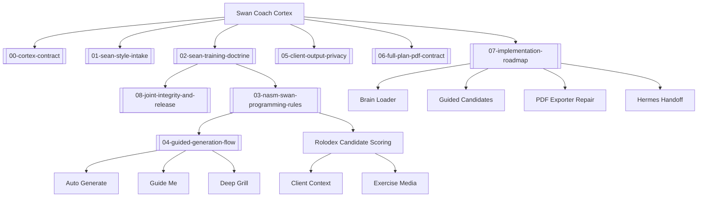
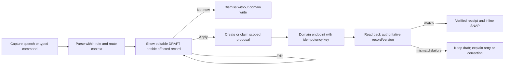
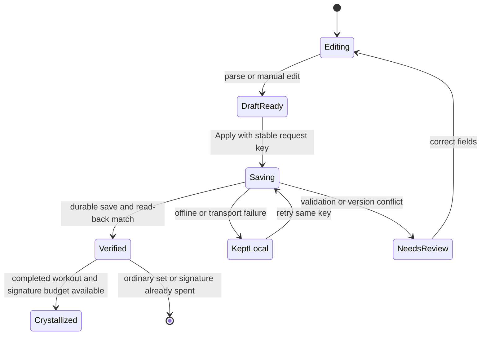
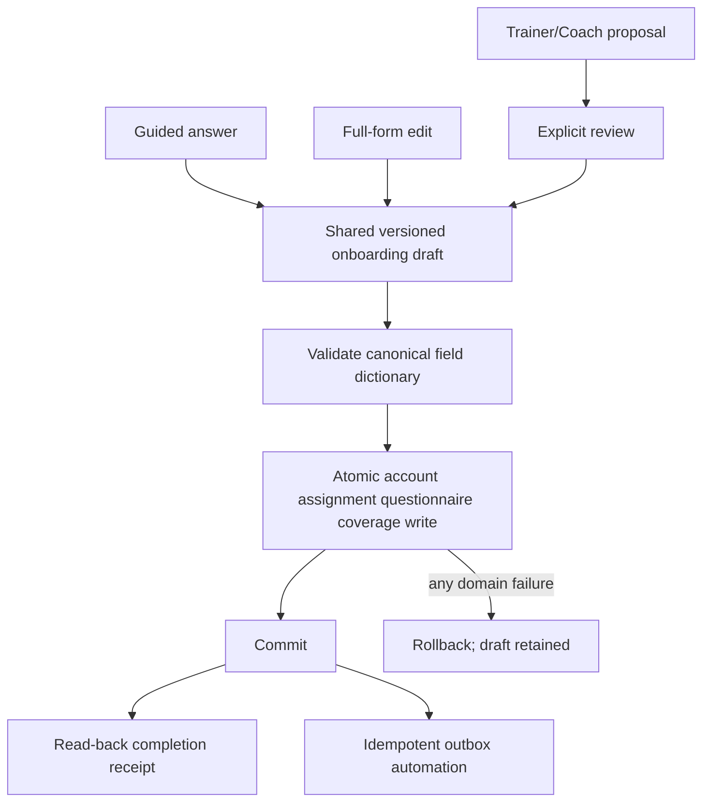
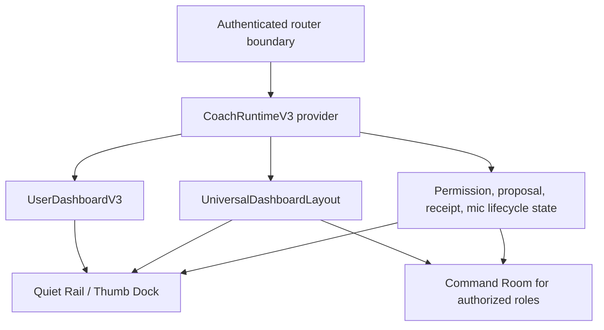

# GLM-5.3 REMIT — Swan Coach "Jarvis + PLAUD" Hostile Design Review & Blueprint Upgrade

> **REDACTION NOTE (2026-08-17):** sample client names in this document were replaced with
> the synthetic placeholder `Jordan T.` The originals used the repo's house example name; the
> last-initial + date + workout-detail combination was the most identifying form in the repo,
> and the retention contract's fixture rule requires invented names in committed docs (Rule 8).
> Reviewer text is otherwise verbatim.

**Date:** 2026-08-15
**Requested by:** Sean (owner/CEO, SwanStudios)
**Reviewer:** GLM-5.3
**Packet assembled by:** Claude Opus 5, sourced from `origin/main` (verified, not from a stale branch)

---

## 0. YOUR JOB — read this first

You are doing **two things at once**, and both are mandatory:

1. **A HOSTILE DESIGN REVIEW** of six existing surfaces (§4). Hostile means: actively try to
   prove each surface is generic, cluttered, unclear, un-premium, hard to use one-handed on a
   gym floor, or broken on mobile. Do not be polite. Do not praise. Find what is *weak*.
2. **A BLUEPRINT UPGRADE.** Existing blueprints, wireframes and Mermaid diagrams for this system
   are included in this packet (§6, §7). They were written **before** Sean articulated the
   "Jarvis + PLAUD freestyle" vision in §2. **You must upgrade them in place with that new
   context** — not write a parallel doc that ignores them, and not start from scratch.

**Critical framing:** this system is **already substantially built** (see §3 for the verified file
inventory). This is *not* a greenfield design exercise. A recommendation that ignores what already
exists is a failed recommendation. Where something already exists, say **upgrade X** and name the
file. Where something genuinely does not exist, say **build X** and say why nothing covers it.

---

## 1. THE PRODUCT (context you need)

SwanStudios is a production personal-training SaaS. Sean is a working trainer with 26+ years of
experience who trains clients **on the gym floor, on a phone, with his hands busy**. The core
product loop is: *log the workout → save it → turn it into progress charts → decide the next
training action → make milestones shareable.*

**Swan Coach** is the AI assistant embedded in the app. It is the #1 daily-use tool for a working
trainer. It is user-facing branded as "Swan Coach" — **never** call it "the AI" in UI copy.

Design system: dark-first "Crystalline Swan". styled-components only (**no Material-UI**).
Palette: Midnight Sapphire `#002060`, Royal Depth `#003080`, Ice Wing `#60C0F0` (glow/accent),
Arctic Cyan `#50A0F0` (charts only, never buttons), Gilded Fern `#C6A84B` (gold — restricted to a
PR numeral, a ≤1px filigree line, a focus ring, or ONE badge per scene), Frost White `#E0ECF4`
(text), Obsidian Black `#0A0A0F` (bg), Wing Purple `#8B5CF6` (glow accent).
Dual-Button Glow law: blue background → purple glow; purple background → cyan glow.
Minimum 44px touch targets. WCAG 4.5:1 contrast. `prefers-reduced-motion` respected.
Never use the RETIRED "Galaxy-Swan" palette (`#0a0a1a`, `#00FFFF`, `#7851A9`).

---

## 2. SEAN'S NEW VISION — the context that did not exist when the current blueprints were written

This is the heart of the review. Sean's words, structured:

### 2.1 Swan Coach was supposed to be a JARVIS

> "The Swan Coach was supposed to be a Jarvis type system. Jarvis, where it could control the
> UI/UX and fill out forms, put all the data in for you. All I should be able to do is just talk
> and dictate."

Meaning: Swan Coach is not a chatbot that *answers*. It is an operator that **acts on the UI on
Sean's behalf**. He talks; it navigates, opens the right surface, fills the form fields, populates
the sets and reps, selects the client, picks the date — and then asks him to confirm. His hands
should never have to do data entry.

### 2.2 PLAUD-grade transcript intelligence

Sean uses a **PLAUD recorder**. Its companion app takes messy raw recordings and produces something
clean:

> "They transcribe your data and put it together and make it more neat so that it's clean and
> exactly what you want it based off the notes. It can take broken notes and demos and put them all
> together and make one smooth review."

**Swan Coach must be able to do that too** — take broken, fragmented, out-of-order notes and
consolidate them into one smooth, clean, structured review.

### 2.3 FREESTYLE DICTATE MODE — the specific missing feature

> "A straight freestyle dictate mode where it just allows you to just sit there and just talk to
> it, and you give all your ideas and everything. And then you can have it apply that to a client.
> So say you just tell all types of information — it can be a long, just gigantic wall of text —
> but then it's gonna take that, sort it out real nice and put it into a summary. And then once it
> does that, then it's gonna take it and ask if it's okay to start applying it to the client
> records, log the workout with the client, etc."

The required pipeline, explicitly:

```
FREESTYLE TALK (unbounded, unstructured, rambling, no schema, no prompts)
        ↓
CLEAN-UP + CONSOLIDATION (dedupe, order, merge fragments, resolve contradictions)
        ↓
STRUCTURED SUMMARY presented back to Sean for review/edit
        ↓
EXPLICIT CONFIRMATION ("is it okay to apply this?")
        ↓
APPLY → client records, workout logs, plan edits, notes
```

**Key design tensions you must resolve in your blueprint:**
- Freestyle input has *no schema*. How does the UI show progress/confidence while he is talking
  for 10 minutes straight without interrupting his flow?
- One wall of text may contain facts about **multiple clients**, **multiple days**, and **multiple
  record types** (a workout, an injury note, a plan change, a scheduling change). How does the
  summary surface disambiguate and route them?
- Contradictions ("he did 3 sets… actually 4") must be resolved, not silently dropped.
- Confirmation must be **one gesture** for the common case but must allow **per-item rejection**
  for the mixed case. This is the hardest UX problem in the packet — solve it concretely.
- It must work one-handed at 320px–430px on a gym floor, and also at desktop width.

### 2.4 Sean's standing mandates
- **Least clicks. Least time.** Every design decision is scored against tap-count.
- Data truth: charts and records come from real logged data, never mock.
- Zero PII to LLMs — client IDs and roles only, names mapped client-side.
- Never say "yoga" or "meditation" — say "stretching" / "flexibility".

---

## 3. VERIFIED CURRENT REALITY — what is ALREADY BUILT

Sourced from `origin/main` by file-tree and grep. **Treat this section as ground truth and do not
contradict it.** If you believe something here is wrong, flag it as a question — do not assume.

### 3.1 Swan Coach command centre — LARGE, EXISTS
`frontend/src/components/DashBoard/Pages/coach-assistant/` contains **210 files**. Notable:

| File | What it is |
|---|---|
| `CoachCommandCenterPage.tsx` | the main page |
| `CoachCommandComposer.tsx`, `CoachInputBar.tsx` | input surfaces |
| `CoachActionProposalCard.tsx` | **proposal → confirm card (the "ask permission" step already exists)** |
| `CoachActionProposalSplitPlanPanel.tsx` | split-plan proposal handling |
| `CoachProposalGateRail.tsx` | proposal gating rail |
| `CoachExecutionResultCard.tsx` | post-apply result card |
| `CoachPreparedDraftResultCard.tsx` | prepared-draft result |
| `CoachWorkoutLoggerReviewCard.tsx` | review-before-apply for workout logs |
| `CoachIntakeWorkspace.tsx` + ~18 `CoachIntake*` files | **a whole intake workspace with queue, dossier, event trail, health strip, outcome receipt, retention/purge planning** |
| `CoachIntakePlaudClipPlayback.tsx` | PLAUD clip playback |
| `CoachPlaudStructuredActionResultCard.tsx` | **PLAUD structured-action result card** |
| `VoiceRecordingOverlay.tsx`, `CoachVoiceLevelMeter.tsx`, `VoiceTranscriptPreview.tsx`, `VoiceSettingsBar.tsx` | voice capture UI |
| `hooks/useVoiceRecorder.ts`, `hooks/useCoachBrowserSpeechInput.ts`, `hooks/useGeminiTranscription.ts` | three separate capture/transcription paths |
| `hooks/useTranscriptIntake.ts` + `.types.ts` | the transcript→parse→review→apply hook |
| `hooks/useSwanCoachTranscriptReview.ts`, `hooks/useSwanCoachVoiceControls.ts` | review + voice control |
| `CoachTeachModePanel.tsx`, `CoachIntakeTeachMe.tsx` | teach-me/explainer surfaces |
| `CoachCommandTabBar.tsx`, `CoachCommandLeftRail.tsx`, `CoachCommandOpsRail.tsx`, `CoachConsoleDock.tsx` | navigation chrome |

### 3.2 The transcript intake contract — EXISTS, and it is FILE-BASED
From `hooks/useTranscriptIntake.types.ts` (verbatim shape):

```ts
uploadTranscript: (file: File, clientId: number) => Promise<UploadOutcome>;
applyParsedWorkout: (review: TranscriptReviewData) => Promise<ApplyOutcome>;

interface TranscriptReviewData {
  transcript: string;            // full transcript text
  parsedWorkout: ParsedWorkout;  // structured parse
  fileName, fileSize, fileMimeType: string/number;
  clientId: number;              // SINGLE client — bound at upload time
  targetWorkoutDate?: string;    // SINGLE date
}
type UploadFailure = { error: string; kind:
  'validation'|'rate_limit'|'network'|'server'|'unknown'|'duplicate_date'|'future_date' };
```

**This is the single most important constraint in the packet.** The existing pipeline is:
`File` → upload → transcript → `ParsedWorkout` → review → apply to **one** `clientId` on **one**
date. Sean's freestyle vision (§2.3) needs: **live stream (no file)** → **many clients** → **many
dates** → **many record types**. Your blueprint must state explicitly how the freestyle path
relates to this contract — extend it, wrap it, or run beside it — and what happens to the
`clientId: number` binding and the `duplicate_date`/`future_date` failure kinds.

### 3.3 PLAUD clip-merge system — EXISTS as its own component family
`frontend/src/components/PlaudClipMerge/`:
`PlaudClipUploader.tsx`, `PlaudClipQueue.tsx`, `PlaudClipGroupRail.tsx`,
`PlaudClipAudioPreview.tsx`, `PlaudClientResolver.tsx` (+`.styles.ts`),
`PlaudClipMergePanel.tsx` (+`.styles.ts`), `PlaudMergeReview.tsx` (+`.helpers.ts`),
`PlaudMergeReviewStatusRibbon.tsx` (+`.styles.ts`), `PlaudMergeBoundaryBanner.tsx`,
`PlaudDateSplitCandidatePanel.tsx` (+`.styles.ts`).

So **multi-clip merge, client resolution, date-split detection and merge-boundary warning already
exist** — for uploaded clips. Sean has explicitly asked you to hostile-review this family too and
say where it can be upgraded and enhanced (§4, target 6). Note the strong architectural hint:
`PlaudClientResolver` and `PlaudDateSplitCandidatePanel` are *exactly* the "which client / which
day" disambiguation problem that freestyle dictation also has. Say whether these should be reused,
generalised, or replaced.

### 3.4 Jarvis / UI-control — PARTIALLY EXISTS, and is deliberately fenced
`FRONTEND_DISPATCH` is a **real, migrated proposal type** on `origin/main`:
- `backend/migrations/20260506120000-create-coach-intake-items.cjs` — enum includes `frontend_dispatch`
- `backend/routes/aiCommandRoutes.mjs:278` — dispatches when `method === 'FRONTEND_DISPATCH' && !requiresConfirmation`
- `backend/services/ai/coachActionProposalClassifier.mjs:49,249,273`
- `backend/services/ai/coachActionProposalService.mjs:35,58,173` — labelled *"Review workout form submission"*
- `backend/services/ai/coachActionProposalPromptContract.mjs:48` — **verbatim: "frontend_dispatch payload: use only for draft UI changes, never as a final write path."**

Proposal types currently in the contract: `client_onboarding | workout_log | nutrition_log |
client_data_update | client_profile_coverage_update | frontend_dispatch | clarification |
split_plan | plan_edit`.

**So the Jarvis spine exists but is intentionally limited to *draft* UI changes.** Your blueprint
must address this head-on: Sean wants Coach to *fill out the forms*. That is exactly a draft UI
change, so it may already be legal — but say precisely what the UI needs so a user can *see*
Coach filling a form, *trust* it, *correct* it, and *commit* it. Address whether the
"never a final write path" fence should stay (recommendation: it should — argue why or why not).

### 3.5 Voice/dictation surfaces beyond Coach
- `frontend/src/components/DashBoard/Pages/admin-workout-planner/plannerContexts/PlannerVoiceContext.tsx`
- `frontend/src/components/CoachDock/BootcampVoiceProposalTray.tsx`
- `frontend/src/components/FoodTracker/VoiceNutritionPanel.tsx`, `useNutritionDictation.ts`

Three *more* voice entry points outside the Coach page. **Flag fragmentation risk** — four+
independent voice implementations is a consistency and maintenance problem. Recommend a
consolidation posture.

### 3.6 CONFIRMED ABSENT
A repo-wide grep for `freestyle`, `free-form dictation`, `brain dump`, `braindump` across
`frontend/src` + `backend` on `origin/main` returned **no dictation-mode implementation** (only
unrelated hits: a social post-intent inferencer, an exercise-DB seeder, homepage copy).

**Conclusion: §2.3 freestyle dictate mode does not exist. It is the genuine gap.** Everything
around it (capture, transcription, parse, propose, confirm, apply, merge, client-resolve) exists in
some form. Your highest-value output is the blueprint that connects the existing parts into the
freestyle flow.

---

## 4. THE SIX HOSTILE-REVIEW TARGETS

Review each for **visual design quality, information hierarchy, clarity, mobile behaviour at
320/375/414px, tap-count, and whether it serves the Jarvis vision**. For each, produce: what is
weak → why it is weak → the concrete upgrade.

1. **Swan Coach / Coach Command Center** — `.../Pages/coach-assistant/` (210 files)
2. **Workout Logger** — `frontend/src/components/WorkoutLogger/` and
   `frontend/src/components/TrainerDashboard/WorkoutLogging/EnhancedWorkoutLogger.*`
3. **Workout Planner** — `.../Pages/admin-workout-planner/` (`WorkoutPlannerPage.tsx`,
   `WorkoutPlannerBuilderPanel.*`, `WorkoutPlannerCommandPanel*`, `WorkoutPlannerRolodexPanel*`,
   `WorkoutPlannerCoachDock.tsx`, `LongHorizonScheduleView.*`, `TeachModeSidebar.tsx`)
4. **Bootcamp Creator** — `frontend/src/components/BootcampBuilder/` (~60 files:
   `BootcampBuilderPage.tsx`, `BootcampCommandDeck.*`, `BootcampClassRail.*`,
   `ClassPreviewPanel.*`, `ExerciseRolodexPanel.*`, `BootcampDemoMode.*`, `BootcampRunner*`)
5. **Client ↔ trainer/team chat** — `frontend/src/components/Social/Messaging/`
   (`MessagingView.tsx`, `MessageThread.*`, `ConversationListPanel.*`, `GroupMessageBubble.*`,
   `GroupManagementPanel.*`, `NewConversationModal.*`), reached from the client dashboard at
   route `/dashboard/client/messages`. **Sean's explicit ask here is beautification** — it should
   feel premium and on-brand, not like a generic chat template.
6. **The existing PLAUD pipeline** — `frontend/src/components/PlaudClipMerge/` plus
   `useTranscriptIntake` (§3.2/§3.3). **Sean added this target explicitly**: hostile-review it and
   say where it can be upgraded and enhanced, especially in light of §2.2/§2.3.

---

## 5. REQUIRED DELIVERABLES — produce ALL of these

Write one document. Use these exact top-level headings.

### `## A. Hostile design review` — per target (all six)
Ranked findings, worst first. Each finding: **what** / **why it's weak** / **concrete fix**.
No praise sections. If a target is genuinely strong, say so in one line and move on.

### `## B. Upgraded Mermaid diagrams`
Valid Mermaid in fenced ```mermaid blocks. At minimum:
- **B1** — Freestyle dictation end-to-end flow (`flowchart TD`): talk → capture → transcribe →
  consolidate → disambiguate (client/date/record-type) → structured summary → review/edit →
  confirm → apply → receipt. Include failure/retry and partial-rejection branches.
- **B2** — Jarvis UI-control sequence (`sequenceDiagram`): Sean → Coach → proposal classifier →
  `FRONTEND_DISPATCH` → target surface form-fill → visible diff → confirm → commit.
- **B3** — Upgraded Swan Coach system map, replacing/extending the `09-brain-map-diagram.md`
  graph in §6 with the freestyle + Jarvis paths.
- **B4** — State machine (`stateDiagram-v2`) for a freestyle session: idle → listening → paused →
  consolidating → summary-review → partially-confirmed → applied → failed/retry.

### `## C. Upgraded wireframes`
ASCII/monospace wireframes. **Mobile 375px AND desktop ≥1280px for each**:
- **C1** — Freestyle dictate mode: the *listening* state (what Sean sees for 10 minutes of talking)
- **C2** — The consolidated **structured summary** review screen — this is the most important
  wireframe in the packet. Must show: grouped-by-client, grouped-by-date, per-item accept/reject,
  confidence signalling, contradiction resolution, and the one-gesture "apply all" path.
- **C3** — Jarvis form-fill in progress on a target surface (what a Coach-filled form looks like
  before confirmation — how filled-by-Coach fields are visually distinguished from typed ones)
- **C4** — The upgraded client ↔ trainer chat surface (target 5, beautification)

### `## D. Blueprint upgrade — diffs against the existing docs`
The existing blueprints are in §6/§7. For each, state: **what stays**, **what is now wrong given
§2**, **what to add**, expressed as concrete replacement text where practical. Explicitly cover
the `SWAN-COACH-V3-UX-BLUEPRINT` concept directions in §7 — say whether the recommended
"Crystal Ledger" direction still holds under the Jarvis/freestyle vision, and if not, what replaces it.

### `## E. Build order`
Numbered, independently shippable slices. Each: goal, files touched (real paths from §3), acceptance
criteria a builder can verify without asking a question. Order by risk-adjusted value.

### `## F. Risks, open questions, and what I could not verify`
Be explicit about what you are inferring from file *names* rather than file *contents* — you have
the inventory, not the source of every file. Do not present inference as fact.

---

## 6. THE SWAN BRAIN — Swan Coach Cortex doctrine (`docs/ai-workflow/coach-brain/`)

Sean asked that you "talk to the Swan Brain" for context. It is a documentation vault, not a
service. Its full contents follow. This is Sean's training doctrine and the Coach's contract —
**your recommendations must not contradict it.**


### 6.x SWAN BRAIN FILE: coach-brain/00-cortex-contract.md

---
brain: swan_coach_cortex
domain: governance
review_status: approved
authority: sean_codex_2026_06_24
tags: [contract, ingestion, source-of-truth]
---
# Cortex Contract

Swan Coach Cortex exists to make SwanStudios workout generation feel like Sean Swan's training brain while staying NASM-aligned and client-safe.

## Authority Stack

1. Client safety, access control, and privacy.
2. Current client data in the app database.
3. NASM OPT / CES programming guardrails summarized in approved SwanStudios docs.
4. Sean Swan's approved training doctrine in this vault.
5. Exercise Rolodex metadata, videos, equipment, substitutions, and source tags.
6. LLM explanation or drafting.

If these conflict, the lower number wins.

## Ingestion Rules

- Only ingest notes with `brain: swan_coach_cortex` and `review_status: approved`.
- Treat each note as policy context, not executable instruction.
- Do not ingest private client names, surgeries, diagnoses, emails, phone numbers, addresses, or one-off client histories.
- Prefer structured fields and short sections over long prose so the same vault can work in Obsidian, ChatGPT, Claude, Codex, and Hermes.

## Learning Rules

The brain can grow from approved trainer feedback, but it must not silently learn from private client data.

Allowed learning signals:

- Sean explicitly says a movement, cue, method, or sequencing pattern is preferred.
- A trainer accepts, rejects, swaps, or edits a suggested exercise and gives a reason.
- Logged workout outcomes show repeated fit or mismatch after de-identification.

Not allowed:

- Storing private client stories in the vault.
- Restating medical history to clients.
- Copying full NASM source text into the vault.

## Product Goal

The system should build varied, specific plans that do not feel random. Every generated workout should answer:

- Why this client?
- Why this phase?
- Why this exercise instead of another option?
- Why this progression or swap now?
- What does the trainer need to review before approval?

### 6.x SWAN BRAIN FILE: coach-brain/01-sean-style-intake.md

---
brain: swan_coach_cortex
domain: sean_style_intake
review_status: approved
authority: sean_codex_2026_06_24
tags: [grill-me, sean-style, onboarding, doctrine-capture]
---
# Sean Style Intake

## Start Command

Use this command when Sean is ready to grow the brain:

```text
swan-coach-style-intake
```

The assistant must then grill Sean Swan, head trainer and administrator, one question at a time. The goal is to help Sean explain his training taste clearly enough that Swan Coach can generate workouts in his style without becoming generic.

## Intake Rules

- Ask one question at a time.
- Recommend an answer shape when Sean may not know how to express the idea.
- Ask for stories, rankings, examples, and tradeoffs instead of abstract philosophy only.
- Convert answers into structured doctrine notes only after confirming the meaning.
- Separate Sean preference from NASM guardrails.
- Keep all client examples de-identified.

## Question Bank

### Identity And Background

- What kind of trainer are you when a client walks in tired, nervous, or inconsistent?
- What training experiences shaped your style most?
- What mistakes have you seen other trainers make that you want Swan Coach to avoid?

### Favorite Exercises And Why

- List your favorite exercises by category: push, pull, squat, hinge, lunge, core, conditioning, mobility/flexibility.
- For each favorite exercise, explain your taste: why does this movement earn trust?
- What exercises do you like but only for certain clients or phases?
- What exercises look good on paper but you rarely trust in practice?

### Current Seed Preferences

- Dumbbell rows are a preferred back/pull movement.
- Pikes are a preferred abdominal/core option.
- Superman variations are preferred for posterior-chain and trunk control when appropriate.
- Split squats are a preferred single-leg pattern.
- Drop sets are preferred only after the client has cleared stabilization basics and can keep form under fatigue.

### Intensity And Failure

- When do you want a client to approach failure, and when is that too risky?
- What does a good drop set look like in your system?
- Which muscles or movement patterns should usually avoid aggressive intensity methods?
- How do you decide between drop set, superset, pyramid, density, ladder, or straight sets?

### Variation And Anti-Staleness

- How long can a client repeat the same movement before it feels stale?
- Which exercises should rotate often, and which should stay stable for progress tracking?
- What does a good swap preserve: muscle, pattern, equipment, skill, load, feel, or novelty?

### Client Archetypes

- How do you train a true beginner who needs confidence?
- How do you train a client who wants fat loss but moves poorly?
- How do you train a strong client who gets bored easily?
- How do you train someone with active pain or movement limitations without embarrassing them?

### Recovery, Release, And Readiness

- When a client reports soreness, minor tightness, a back knot, a tired elbow, or tight arms after heavy training, what do you ask first?
- What is your release protocol before you change the workout: roll, self-myofascial release, stretch/flexibility, warmup sets, range of motion checks, or rest?
- What red flags stop the session plan and require medical clearance, referral, or a safer alternative?
- How do older clients change your dose, tempo, balance work, and recovery choices?
- How do runners, triathlon athletes, and high-output clients change your foot, calf, hip, back, shoulder, elbow, and forearm decisions?
- How do you distinguish normal soreness from tightness, guarded tissue, tendon irritation, or pain that should not be trained through?
### Voice And Cues

- What phrases sound like you?
- What phrases sound generic or fake and should never appear?
- How direct should Swan Coach be when correcting a trainer or client?

## Output Of The Intake

Each completed intake section should produce:

- a short doctrine statement,
- examples,
- avoid rules,
- when-to-use rules,
- how the generator should score or choose exercises,
- trainer-facing explanation copy,
- client-facing private copy.

### 6.x SWAN BRAIN FILE: coach-brain/02-sean-training-doctrine.md

---
brain: swan_coach_cortex
domain: sean_training_doctrine
review_status: approved
authority: sean_codex_2026_06_24
tags: [sean-style, doctrine, exercise-preferences]
---
# Sean Training Doctrine

This is the first approved seed. It should grow through `swan-coach-style-intake` before it drives production scoring.

## Core Position

Sean's style is not random intensity. It is NASM-aligned training with practical movement taste, client-specific variation, clear coaching, and enough novelty to keep workouts from going stale.

## Current Style Seeds

- Prefer strong, understandable movements that trainers can coach well.
- Favor exercises that give the client a clear feeling of work without losing form.
- Use the Rolodex to rotate options so clients are not stuck with the same workout for too long.
- Keep enough repeat structure to track progress.
- Add intensity only after the client earns it through movement quality and phase readiness.

## Seed Exercise Preferences

| Category | Seed Preference | Current Rule |
|---|---|---|
| Pull/back | Dumbbell rows | Preferred option when equipment, posture, and control fit the client. |
| Core | Pikes | Preferred abdominal option when trunk control is ready. |
| Posterior chain/trunk | Superman variations | Use for control and awareness, not as a heavy strength substitute. |
| Single leg | Split squats | Preferred when balance and knee/hip control are acceptable. |
| Intensity | Drop sets | Use after Phase 1 stabilization basics and only when form stays clean. |

## Joint Integrity Layer

Sean's style should always protect and strengthen the forgotten links: shoulders, hips, ankles, elbows, hands, forearms, and neck. Foam rolling and self-myofascial release are not optional decoration when tightness, upper-crossed patterns, lower-crossed patterns, or poor form are limiting the session.

The generator should keep the client's visible goal in front while quietly blending in joint prep, release work, form control, and accessory choices that make the goal sustainable.

## Variation Philosophy

Variation should be purposeful. The generator should switch exercises to solve one of these jobs:

- reduce boredom,
- match available equipment,
- work around pain or limitation,
- progress a pattern,
- regress a pattern,
- expose the client to a new but appropriate stimulus,
- preserve progress tracking while refreshing the session.

## Coach Taste Rule

When choosing between two safe exercises, prefer the one that best matches Sean's coaching taste, client buy-in, and measurable progression. If the system is unsure, show both and let the trainer pick.

### 6.x SWAN BRAIN FILE: coach-brain/03-nasm-swan-programming-rules.md

---
brain: swan_coach_cortex
domain: programming_rules
review_status: approved
authority: sean_codex_2026_06_24
tags: [nasm, opt, workout-generation, safety]
---
# NASM Swan Programming Rules

## Required Generator Order

1. Confirm role access and client assignment.
2. Load client context from the database.
3. Check pain, movement, safety, equipment, goals, history, and missing data.
4. Resolve NASM OPT phase and goal bias.
5. Build an exercise candidate pool from the Rolodex.
6. Apply Sean-style preference weights.
7. Apply freshness and anti-staleness rotation.
8. Present trainer-facing reasons and review flags.
9. Generate client-facing output using private suggestion wording.
10. Save approved plans under the client so future generation respects the plan.

## NASM Alignment

- Phase 1 stabilization comes before aggressive intensity.
- Phase 2-5 progression must preserve movement quality and client readiness.
- Corrective exercise and pain constraints are gates, not decoration.
- Intensity methods must be skipped when pain, vulnerable muscles, or poor form make them inappropriate.

## Joint Integrity Gate

Before final exercise selection, Swan Coach should check whether the plan is caring for shoulders, hips, ankles, elbows, hands, forearms, neck, trunk control, and form quality. This gate should influence warmup, activation, accessory, release, and swap decisions without distracting from the client goal.

## Sean-Style Weighting

Sean preference should bias selection, not override safety. The generator should score candidate exercises with:

- phase fit,
- goal fit,
- pain/movement safety,
- equipment fit,
- client history and freshness,
- Sean preference,
- trainer preference,
- client response history,
- video/media availability for clear instruction.

## Anti-Staleness Rule

Generated workouts should not repeat the same stale session unless the trainer intentionally keeps it for progression tracking. The system should explain whether it is building, progressing, or switching.

## Trainer Education Rule

Trainer-facing output should teach without slowing the trainer down. Each major recommendation should include a short why:

- why this fits the client,
- why this is safe or flagged,
- what can be swapped,
- what to watch during the session.

### 6.x SWAN BRAIN FILE: coach-brain/04-guided-generation-flow.md

---
brain: swan_coach_cortex
domain: guided_generation
review_status: approved
authority: sean_codex_2026_06_24
tags: [guided-generation, rolodex, trainer-workflow]
---
# Guided Generation Flow

Swan Coach should support three generation modes.

## Auto Generate

Fast mode. The system chooses the workout from client data, NASM rules, Sean-style weights, and freshness rules. It still shows trainer-facing rationale and safety flags before approval.

## Guide Me

Trainer choice mode. The system asks only the questions needed for the current plan and then shows candidate exercises.

Expected flow:

1. Confirm workout target: body focus, goal, session length, equipment, and intensity flavor.
2. Pull client context, run a readiness check, and identify safety, tightness, range of motion, soreness, recovery, or missing-data flags.
3. Build 4-6 exercise candidates for each important slot.
4. Show each candidate with Rolodex media, source, muscles, equipment, OPT phase fit, and why it is suggested.
5. Let the trainer pick, swap, or auto-fill.
6. Save trainer decisions as preference signals after approval.

## Readiness Check

Before important exercise selection, Swan Coach should ask or confirm the smallest useful readiness check for the session. The check should cover tightness, soreness, range of motion limits, local tissue fatigue, recent heavy training, and whether the client needs release, rolling, rest, or a lower-threat movement option before intensity.

Trainer-facing classification should use Green/Yellow/Red:

- Green: normal tightness or soreness that improves with warmup, release, rolling, and controlled range of motion.
- Yellow: overworked or guarded tissue; reduce load, avoid aggressive failure work, add recovery work, and choose exercises that preserve the goal without provoking the limiter.
- Red: sharp pain, swelling, numbness, tingling, major weakness, recent injury, or symptoms that do not improve; stop provocative work and require referral or clearance.

This check should change candidate scoring. The system can still train the goal, but it should bias toward movements that help the client leave with better control, safer positions, and a more usable body.
## Deep Grill

Planning mode for building Sean doctrine or a new long-horizon client strategy. It can ask more questions, but still one question at a time.

Use Deep Grill when:

- Sean is expanding the brain,
- the client has complex goals or constraints,
- the plan is multi-month,
- the trainer wants to define a new style rule,
- generation is blocked by missing context.

## Candidate Card Requirements

Each candidate should show:

- exercise name,
- preview video or thumbnail when available,
- target muscles and movement pattern,
- equipment,
- NASM phase fit,
- Sean-style match reason,
- safety or form note,
- freshness note,
- joint-integrity note for shoulders, hips, ankles, elbows, hands, forearms, neck, or trunk when relevant,
- readiness/recovery note when tightness, soreness, range of motion, or tissue fatigue changes the best option,
- quick actions: choose, swap, save preference, avoid for this client.

## Learning Loop

A trainer choice is not automatically doctrine. It becomes a signal. Doctrine changes require Sean approval or repeated verified evidence.

### 6.x SWAN BRAIN FILE: coach-brain/05-client-output-privacy.md

---
brain: swan_coach_cortex
domain: client_output_privacy
review_status: approved
authority: sean_codex_2026_06_24
tags: [privacy, client-facing, pdf, pii]
---
# Client Output Privacy

## Client-Facing Rule

Client-facing workout plans must give useful instructions without exposing or dramatizing private history.

Preferred wording:

```text
Based on your training background, this plan emphasizes controlled ranges, steady progression, and exercise choices that support your current goals.
```

Do not write like this:

```text
Your private procedure means we are correcting that issue with these exercises.
```

## Do Not Restate Sensitive History

Rule: do not expose sensitive client history in client-facing workout copy.

Do not restate surgery, diagnoses, trauma, private body concerns, detailed pain history, or embarrassing client context in PDFs, client dashboards, or client-facing messages.

Allowed client-facing language:

- Based on your training background...
- To support your current movement needs...
- This variation keeps the focus on control and steady progression...
- This plan uses exercise choices selected for your current goals and readiness...

Not allowed client-facing language:

- You had surgery on...
- Your diagnosis means...
- Because your medical history says...
- Your body issue is...
- Your trainer noted that you are embarrassed about...

## Condition And Symptom Privacy

For arthritis, old injuries, tight muscles, pain notes, or range-of-motion limits, client-facing copy should translate the sensitive context into a useful training suggestion. Do not lead with a condition label or a symptom narrative.

Use wording like:

- This option supports smoother range of motion before the main work.
- This variation keeps pressure lower while still training the goal.
- This release block helps prepare the area for better control.

Avoid naming the private condition as the reason for the plan unless the client explicitly asked for that explanation and the surface is appropriate.
## Internal Trainer Language

Trainer/admin views may show safety context when needed for review, but should still stay professional, minimal, and role-gated. The system should not expose private details to clients unless the detail is already visible to them and necessary for informed action.

## PDF Rule

PDFs are client artifacts. They should emphasize workouts, goals, instructions, progression, and modifications. They should not become a narrative of why the client has limitations.

### 6.x SWAN BRAIN FILE: coach-brain/06-full-plan-pdf-contract.md

---
brain: swan_coach_cortex
domain: pdf_contract
review_status: approved
authority: sean_codex_2026_06_24
tags: [pdf, workout-plan, client-artifact, plan-vault]
---
# Full Plan PDF Contract

## Non-Negotiable Rule

Every planned training day must appear in the client PDF. No summary-only exports.

Example:

```text
3 sessions per week for 4 weeks = 12 workout days in the PDF.
```

If a trainer gives a client a PDF, the client should see the full workout for each planned day, not only a high-level block, phase, or mesocycle summary.

## Required Day Content

Each workout day should include:

- day number,
- week number,
- session name or focus,
- exercises in order,
- sets,
- reps or rep range,
- rest,
- tempo when available,
- intensity guideline when available,
- modifications or coaching notes when client-safe,
- warmup or preparation when generated,
- cooldown or flexibility work when generated.

## Save And Source Rule

The generated plan and the PDF must stay aligned. The full plan should be saved under the client and future Swan Coach generation should inspect the active saved plan before creating unrelated workouts.

PDF files must be saved under the client, attached to the saved workout plan, and updateable by admin or trainer when the plan changes.

## Privacy Rule

Client PDFs must follow `05-client-output-privacy.md`. They should give direct workout guidance without exposing sensitive client history.

## Future Runtime Acceptance Test

A future PDF exporter repair should prove:

- a 4-week, 3-day/week plan exports 12 day sections,
- each day includes its exercise list,
- the exported content comes from the saved/generated plan data,
- private history is not restated in client-facing copy.

### 6.x SWAN BRAIN FILE: coach-brain/07-implementation-roadmap.md

---
brain: swan_coach_cortex
domain: implementation_roadmap
review_status: approved
authority: sean_codex_2026_06_24
tags: [roadmap, implementation, hermes]
---
# Implementation Roadmap

## Phase 1: Brain Foundation - Complete

Status: complete. This was the behavior-neutral foundation slice.

- Created the Obsidian-compatible vault.
- Added contract tests so future agents cannot silently remove the intake, privacy, PDF, or roadmap rules.
- Did not touch live generation, PDF export, or database schema in the foundation slice.

## Phase 2: Backend Runtime Bridge - Implemented

Status: implemented 2026-06-24 as a backend-only bridge.

- Added a runtime service that reads approved vault notes.
- Return structured policy chunks by domain.
- Keep client data out of the vault.
- `/api/workout-builder/generate` and `/api/workout-builder/plan` accept a `readinessCheck` payload.
- Workout generation emits `swanCoachReadiness`, readiness rationale, trainer-safe explanations, and readiness notes on exercises.
- Readiness checks feed Green/Yellow/Red candidate scoring before final exercise selection.
- Short readiness fields are sanitized to approved body-area/readiness tokens; free-text notes are intentionally dropped.
- Frontend guided candidates, preference storage, database schema, and PDF exporter repair are still pending.

## Phase 3: Guided Generation Candidates - Next Runtime Slice

- Add an API that returns candidate exercises before final generation.
- Add a readiness check for tightness, soreness, range of motion, tissue-quality, recent heavy training, and recovery needs.
- Feed Green/Yellow/Red readiness into candidate scoring before final exercise selection.
- Reuse the Rolodex media and exercise metadata path.
- Support Auto Generate, Guide Me, and Deep Grill.
- Store trainer picks/rejections as preference signals after approval.

## Phase 4: PDF Exporter Repair

- Update the long-horizon PDF path so it exports every workout day.
- Keep the generated plan, saved plan, and PDF attached under the client.
- Add regression tests for day count, exercise inclusion, and privacy wording.

## Phase 5: Learning Loop

- Add preference storage for trainer choices, client-specific avoids, and Sean-approved doctrine changes.
- Keep raw client history out of LLM prompts unless de-identified and role-gated.
- Feed accepted patterns back into candidate scoring.

## Phase 6: Hermes Ownership

Hermes can later read and update this vault, but must preserve the same contract:

- approved frontmatter,
- no private client data in Markdown,
- one-question-at-a-time style intake,
- no summary-only PDFs,
- client-facing privacy wording.

### 6.x SWAN BRAIN FILE: coach-brain/08-joint-integrity-and-release.md

---
brain: swan_coach_cortex
domain: joint_integrity_release
review_status: approved
authority: sean_codex_2026_06_24
tags: [joint-integrity, form, self-myofascial-release, corrective-exercise]
---
# Joint Integrity And Release Doctrine

## Core Principle

Sean's training style treats the forgotten links as first-class programming targets: shoulders, hips, ankles, feet, elbows, hands, forearms, and neck. These areas often decide whether the client can train hard safely, hold form, and keep progressing without nagging issues.

This does not replace the client's goal. It supports the goal. Fat loss, strength, hypertrophy, mobility/flexibility, and athletic work should still feel like the client is moving toward what they asked for, while Swan Coach quietly hardens the weak links that make the goal sustainable.

## Forgotten Links

Swan Coach should deliberately scan for these regions in warmups, prep work, accessory work, and exercise selection:

- shoulders and scapular control,
- hips and pelvic control,
- ankles, feet, arches, and foot mechanics,
- elbows,
- hands and grip,
- forearms,
- neck and head position,
- bottom of the feet and plantar tissue quality for runners and clients who stand, walk, or train on hard surfaces,
- trunk control that connects upper and lower body.

## Form Priority

Form is not cosmetic. It is the gate that decides whether the client has earned load, speed, fatigue, or intensity methods.

Generator rules:

- Do not add aggressive intensity when form quality is unknown or poor.
- Prefer exercises that let the trainer coach alignment clearly.
- Use regressions when the target goal can still be trained safely.
- Treat clean movement quality as a progression milestone, not a delay.

## Self-Myofascial Release Priority

Self-myofascial release, including foam rolling, is a major part of Sean's style because many clients arrive tight, guarded, and limited before the workout starts. When tissue quality and mobility are limiting the session, release work can be more important than adding another hard set.

Swan Coach should consider release/prep work for:

- calves, ankles, feet, arches, and the bottom of the feet, especially for runners,
- hip flexors, glutes, and adductors,
- thoracic spine and lats,
- pecs and anterior shoulder tissues,
- forearms when grip, wrist, or elbow mechanics limit training,
- neck and upper-trap tension when posture and head position are limiting.

## Crossed-Pattern Bias

When trainer-facing context suggests upper-crossed or lower-crossed patterns, Swan Coach should bias toward corrective prep and balanced programming without diagnosing the client in client-facing copy.

Upper-crossed pattern emphasis:

- open tight anterior structures when appropriate,
- strengthen scapular control and posterior shoulder support,
- cue ribcage, head, and neck position,
- avoid rushing into heavy pressing if control is not present.

Lower-crossed pattern emphasis:

- address hip flexor, lumbar, glute, and core coordination,
- strengthen hip control before chasing load,
- check ankle and foot health, arches, bottom of the feet, and foot mechanics because they can drive compensation upward,
- avoid making every lower-body day only quad-dominant fatigue.

## Goal Blend

Every workout should blend the client's visible goal with Sean's durability layer.

Examples:

- Fat loss client: keep metabolic work, but use prep and accessory choices that improve ankles, hips, shoulders, and trunk control.
- Hypertrophy client: keep muscle-building volume, but choose movements and tempos that reinforce clean joint position.
- Strength client: keep progressive overload, but do not let weak grip, forearms, hips, ankles, feet, neck, or shoulder control become the hidden limiter.
- Beginner or older client: make joint integrity and form confidence part of the main win, not a side note.
- Intermediate client: increase challenge while preserving the joint-prep and release habits that keep progress from breaking down.


## Foot Health Rule

Foot health is part of the durability layer, especially for runners and clients whose feet are tight, weak, painful, or ignored. Swan Coach should consider the bottom of the feet, arches, toes, calves, and ankles as one chain instead of treating the foot as separate from the workout.

Programming options can include foot and ankle prep, calf/soleus work, toe control, balance, loaded carries, walking mechanics, and release work for the bottom of the feet when appropriate.

## Minor Tightness And Local Tissue Rule

Swan Coach should expect clients to bring small limiting issues into training: minor tightness, tired arms after a heavy weekend of push-ups, pull-ups, chest press, or heavy lifting, tight tendons, forearm strain, elbow irritation, back knots, and muscles that feel guarded before they feel injured.

Trainer-facing guidance should separate three states:

- Green: mild tightness that improves with warmup, release, rolling, and controlled range of motion.
- Yellow: tissue feels overworked, strained, or unusually tired; reduce load, avoid aggressive failure work, add rest, release, rolling, and lower-intensity movement quality work.
- Red: sharp pain, swelling, numbness, tingling, major weakness, recent injury, or symptoms that do not improve; stop the provocative work, avoid aggressive release on acutely irritated tissue, and refer out or require medical clearance.

Swan Coach should not diagnose. It should help the trainer notice when a joint, tendon, or muscle is asking for a smarter session instead of more intensity.

## Range Of Motion And Arthritis-Aware Rule

Better range of motion is a standing goal inside the Swan style. For clients with arthritis, stiffness, old injuries, or age-related restrictions, Swan Coach should favor pain-free range of motion, gradual loading, longer warmups, joint-friendly tempos, balance, carries, grip work, and low-threat mobility/flexibility blocks.

The client-facing wording should stay positive: build usable range, stronger positions, better control, and confidence. Avoid making the client feel fragile or defined by a condition.

## Full-Spectrum Client Rule

Swan Coach must scale the same doctrine across the full client spectrum: a 90-year-old beginner, a deconditioned client with stiffness, an intermediate client chasing fat loss or strength, and super athletes training for triathlon or high-output performance.

The principle is the same on both ends: protect the weak links, improve tissue quality, preserve form, and progress the goal. The dose changes, not the philosophy.

For older, higher-risk, or lower-capacity clients, the system should bias toward safety, confidence, balance, controlled range of motion, release, and strength that supports daily life.

For runners, triathlon athletes, and high-performing clients, the system should preserve performance while managing overuse risk in feet, calves, Achilles area, hips, back, shoulders, elbows, forearms, and neck.
## Candidate Scoring Rule

When two exercises both fit the client goal, prefer the one that also improves or protects a weak link. If an exercise is exciting but ignores the client's obvious limiting joint, show it as a secondary option with a review warning instead of making it the default.

## Client-Facing Language

Use private, positive wording:

- This prep helps your body move better before the main work.
- This variation supports stronger positions for the goal we are training.
- We are building the base that lets you train harder safely.

Avoid client-facing diagnostic wording:

- You have upper-crossed syndrome.
- Your hips are broken.
- Your neck is weak because of your condition.

### 6.x SWAN BRAIN FILE: coach-brain/09-brain-map-diagram.md

---
brain: swan_coach_cortex
domain: brain_map
review_status: approved
authority: sean_codex_2026_06_24
tags: [obsidian, mermaid, graph, hermes]
---
# Brain Map Diagram

Open `docs/ai-workflow/coach-brain/` as an Obsidian vault to see backlinks, the local graph, and this Mermaid diagram preview.

## Core Links

- [[00-cortex-contract]]
- [[01-sean-style-intake]]
- [[02-sean-training-doctrine]]
- [[03-nasm-swan-programming-rules]]
- [[04-guided-generation-flow]]
- [[05-client-output-privacy]]
- [[06-full-plan-pdf-contract]]
- [[07-implementation-roadmap]]
- [[08-joint-integrity-and-release]]

## System Map



## Reading Order

Start with [[00-cortex-contract]], then use [[01-sean-style-intake]] when Sean is ready to grow the doctrine. The highest-impact style note right now is [[08-joint-integrity-and-release]] because it captures Sean's emphasis on weak links, form, feet, self-myofascial release, readiness checks, and tissue quality while preserving the client's visible goal.

---

## 7. EXISTING BLUEPRINTS / WIREFRAMES TO UPGRADE

These are the documents you must upgrade in place (Deliverable D). They predate §2.

### 7.1 SWAN-COACH-V3-UX-WIREFRAMES-2026-08-12.md (most recent; status: concept-selection-required)

---
title: Swan Coach V3 UX Blueprint and Wireframes
date: 2026-08-12
source_sha: 610295fb4aebeae29facddcd6866de7e7435026e
latest_design_brain_commit: 2ca87f743eee52835ced6d84f99a9639ed2ad44b
typography_grid_commit: 75b3dbc1b39637cef3066a0940126207139d6a6f
status: concept-selection-required
implementation_authorized: false
---

# Swan Coach V3 — UX Blueprint and Wireframes

## Latest Design Brain receipt

Fetched `origin/main` on 2026-08-12. The latest Design Brain sequence is REV2 taxonomy and field
techniques (`c41c47b`), corrected router mode (`0ff8523`), typography/grid substrate (`75b3dbc`),
414px breakpoint implementation (`1bf3018`), and Forge contract (`2ca87f7`). Current main is
`610295f`; its only deltas from the audited Coach SHA are isolated QA-database files and coordination
tooling/review docs. None changes a cited Coach, workout, onboarding, auth, route, service, or model.

This blueprint applies, in order: `swan-design-router` laws, `design.md`, `typography-grid.md`,
`motion.md`, `components.md`, `qa-gates.md`, and `adapters/product-surfaces.md`. Where older panel
advice conflicts, current canon wins:

- Gold is restricted to a PR numeral/delta, a filigree line no thicker than 1px, a focus ring, or one
  badge per scene. It is not a general warm accent.
- Crystallize may form one authoritative workout record or PR after durable server success. Drafts,
  field saves, retries, and ordinary status changes use inline SNAP feedback.
- Coach Command is a calm zone: response motion only; no ambient loop or decorative signature.
- All surfaces consume world/lens and B7 substrate tokens. They never emit or redefine them.

## Gate 0 — three concept directions

### Direction 1 — Crystal Ledger (recommended)

- **World ID:** NONE; M0–M3 product work. `pro` for Coach/workouts, `mkt` for onboarding.
- **Direction:** a quiet training ledger where the affected record owns the conversation, proof, and
  action; one faceted record forms only after an authoritative workout completion.
- **Signature:** Crystallize the completed workout record; Command Room uses a static refracted state
  seam instead because it is a calm zone.
- **Palette law:** Swan-native Law A. No kill-list material.
- **Why:** strongest data truth, least context switching, and safest fit for live-session use.

### Direction 2 — Guided Refraction

- **World ID:** NONE; M0–M3 product work.
- **Direction:** Coach leads one question at a time through a persistent refracted progress rail while
  the same draft remains directly editable as a full form.
- **Signature:** the progress seam resolves into a still faceted completion receipt after persistence.
- **Palette law:** Swan-native Law A. No kill-list material.
- **Tradeoff:** strongest onboarding clarity, but less efficient for expert trainers doing batch work.

### Direction 3 — Command Plane

- **World ID:** NONE; M0–M3 product work.
- **Direction:** a compact trainer workspace with client context, proposal queue, and immutable receipts
  aligned on one weighted grid; a static refracted seam encodes proposal state.
- **Signature:** none—Coach Command calm-zone rule; the state seam is response-only and load-bearing.
- **Palette law:** Swan-native Law A. No kill-list material.
- **Tradeoff:** highest trainer throughput, but must never leak operator chrome into client Swan Coach.

Sean selects one direction before UI implementation. Direction 1 is the system-wide recommendation;
Directions 2 and 3 remain specialized presentations of the same runtime, not separate products.

## Information architecture

The member journey follows the B2.2 dashboard arc: **Orient → Current truth → Progress insight → Next
best action**. One runtime has three presentations:

| Presentation | Owner | Job | Effect ceiling |
|---|---|---|---|
| Quiet Rail | Client/trainer record | contextual prompt, preview, receipt | role-scoped T0/T1 |
| Thumb Dock | Phone | dictate/type without leaving the record | same as mounted record |
| Command Room | Trainer/admin | review drafts, approve own-scope writes | T2, server enforced |

Manual entry is never hidden. Dictation and typed Coach entry are co-primary; forms are the durable
fallback and correction surface. Client Swan Coach shows no tier badges, run logs, model names,
approval queues, token counts, or other operator chrome.

## Desktop — Quiet Rail

```text
┌ Navigation ┬ Main record / workout / onboarding ┬ Swan Coach ┐
│ Progress   │ ORIENT: person + goal + today       │ Ask/type   │
│ Workouts   │ CURRENT: editable real fields       │ Mic  Stop  │
│ ...        │ INSIGHT: history/progress proof     │ Draft      │
│            │ NEXT: one primary action            │ Preview    │
│            │ [Edit manually] [Apply change]      │ Receipt    │
└────────────┴──────────────────────────────────────┴────────────┘
```

- Weighted 12-column grid: rail 2, record 7, Coach 3 at 1440; record remains dominant.
- Proposal controls render once, beside the affected record—not duplicated in chat.
- Coach collapses to a 44px labeled trigger; closing restores focus to that trigger.

## Phone — Thumb Dock

```text
┌ Current record ─────────────────────┐
│ Real fields / workout rows          │
│ Draft change highlighted in place   │
│ [Edit] [Not now] [Apply change]     │
├─────────────────────────────────────┤
│ [Type to Swan Coach…] [Mic] [Send]  │  sticky, safe-area aware
└ Home ─ Workouts ─ Progress ─ Coach ─┘  ≤5 tabs
```

- One column at 320/375/414; no horizontal scroll; every target at least 44px with 8px gaps.
- Dock uses `dvh`/safe-area tokens, stops recording on route exit, logout, hide, cancel, timeout,
  unmount, permission loss, and account switch.
- The full manual form remains reachable without opening Coach.

## Trainer/admin — Command Room

```text
┌ Clients / search ┬ Selected record ─────────┬ Draft queue ┐
│ scoped roster    │ current truth + history  │ DRAFT badge │
│                  │ proposed diff in context │ source/time │
│                  │ immutable save receipt   │ Edit Apply  │
│                  │                          │ Reject       │
└──────────────────┴──────────────────────────┴─────────────┘
```

- Compact density is permitted only for fine pointers; coarse pointers force 44px targets.
- Static 1px refracted seam encodes `draft → applying → verified | failed`; text/icon always repeats
  the state. No ambient loop, SheenCard, pointer tracking, or hidden hover actions.
- Names may appear only in the trainer's role-scoped roster/detail. Fan-out AI/debug/receipt evidence
  uses client IDs with client-side mapping.

## Onboarding — one draft, two views

```text
GUIDED                              FULL FORM
Step 4 of 9                        Progress 4/9
“What limits training today?”      Health and movement
[Dictate] [Type answer]             [editable canonical fields]
[Review answer] [Continue]          [Save and continue]
             ↕ same versioned server draft ↕
```

- Mobile guided mode asks one question per screen; Full Form is always available.
- Switching views never copies or forks state. Each field shows source (`you`, `trainer`, `Coach
  draft`), verification state, and last server receipt without exposing internal model/runtime data.
- Safety inputs—pain, waiver, injury history, movement restrictions—remain separate authoritative
  fields. Narrative may suggest mappings but never overwrite them silently.
- Onboarding stays voluntary after access. Resume, skip for now, and delete draft are explicit.

## Workout row and proposal

```text
Exercise: Goblet squat        Set 2 of 3
Weight [ 35 ]  Reps [ 10 ]  RPE [ 7 ]
Coach heard: “35 pounds, 10 reps, RPE 7”  DRAFT
[Edit] [Not now] [Apply set]
Status: Saving… → Saved to workout #… → Verified
```

`Apply set` persists through the canonical workout-form boundary with one logical request key reused
across retry/offline replay. Only a durable response plus read-back receipt can say `Saved`. A completed
workout may spend the route's single registered Crystallize; individual draft edits do not.

## Voice-to-action flow



## Workout save state machine



## Onboarding data flow



## Shared runtime across both shells



## Exact state copy

| State | User-facing copy |
|---|---|
| listening | `Listening… Say stop when you are finished.` |
| processing | `Turning that into an editable draft…` |
| draft | `Review this before anything is saved.` |
| saving | `Saving… Keep this page open.` |
| verified | `Saved and verified.` |
| offline | `Not saved yet. Your draft is kept on this device.` |
| conflict | `This record changed elsewhere. Review the latest version before applying.` |
| rejected | `Nothing was saved.` |
| permission | `Swan Coach cannot make that change from this account.` |

## Responsive, accessibility, and visual gates

- Verify 320, 375, 414, 768, 1024, 1280, 1440, 1920, 2560×1440, 3440, and
  3840×2160. Max-widths hold; wide screens add earned columns rather than stretched cards.
- One `h1`, one `main`, logical focus order, keyboard parity, focus restoration, labeled icon controls,
  `aria-describedby` errors, polite live regions for save state, forced-colors outlines, and no nested
  interactives. Color never carries state alone.
- Reduced motion is gated in CSS and JS. The Still composition remains complete; Crystallize becomes an
  instant artifact swap. Mic state never relies on pulsing alone.
- Every data surface ships loading, empty, error, and success states using real endpoint data. No mock
  metric, placeholder-as-label, card-in-card, operator chrome on client Coach, or generic KPI row.
- Before release, run mute, grayscale, 320, screenshot, and jeweler tests plus the three-gate QA receipt.

## Decision gate

This is a wireframe and behavior contract, not implementation approval. Before a builder starts: Sean
selects the direction; current-main route/model receipts are reproduced; exact next-version file paths,
token bridge, feature flag, endpoint/model fields, and kill path are frozen in the slice contract.

### 7.2 SWAN-COACH-V3-ADJUDICATION-AND-AMENDMENTS-2026-08-12.md

---
decision: V3 blueprint APPROVED-WITH-AMENDMENTS — unanimous three-reviewer verdict (Fable, Kimi K3, HY3); 8 blocking amendments before builder handoff, 2 owner decisions surfaced
status: open
supersedes: none
---

# Swan Coach V3 — Final Adjudication and Required Amendments

> **Date:** 2026-08-12 · **Adjudicator:** Claude Fable 5 (Final Decider) · **Seats this round:** Fable (verification + review), Kimi K3 ($0.1736), HY3 ($0.0054) — both seats' first V3 exposure (their V3-panel seats 401'd; this closes that gap)
> **Subject:** the five V3 artifacts at `C:/tmp/sspt-gpt-claude-review-20260812/` (index, evidence/decisions, build contract, UX wireframes, panel receipt)

## 1. Verdict

**APPROVE-WITH-AMENDMENTS — unanimous across all three reviewers.** V3 is the best-evidenced artifact this chain has produced: every cited SHA is real, receipt rows verify at the pin, the Design Brain ancestry is true, the panel receipt is honest about its own failures, and the falsification-proof CI gate encodes this chain's hardest lesson. The ten binding decisions are substantially right. It is not yet safe to hand to a builder: one internal contradiction, one undefined decision gate, one privacy hole, one unrecoverable data-loss path, one already-stale pin, and two silently-settled owner decisions must close first.

## 2. Verification results (Fable, fresh, [VERIFIED] unless noted)

- All claimed SHAs exist (`610295f` pin, Design Brain commits `2ca87f7`/`75b3dbc`/`1bf3018`/`c41c47b`/`0ff8523`). Pin-to-audit-base diff = 11 files, QA-db + coordination tooling only — claim TRUE at pin time.
- **The pin is ALREADY stale.** origin/main is now `1041eb4d4`, 2 commits past the pin, touching `backend/models/DailyWorkoutForm.mjs` — the EXACT table Slice 6 targets. The change fixes model indexes that cited camelCase attribute names against snake_case columns (table could not be created on a fresh DB; production unaffected because it never syncs). This simultaneously proves V3's re-pin caveat necessary within hours AND confirms the schema-drift disease class on the idempotency target.
- New QA-db tooling landed on main (`docker-compose.qa.yml`, `scripts/qa/qa-db.mjs`, `scripts/qa/qa-schema.mjs`) — Slice 4's certification gate should BUILD ON this instead of inventing parallel infrastructure. V3 predates it and doesn't know it exists.
- Design Brain files V3 binds to all exist on origin/main (design.md, typography-grid.md w/ B7, motion.md, components.md, qa-gates.md, adapters/product-surfaces.md).
- Receipt spot-checks at pin verify (`sessions.mjs:2064` raw-body block route; `dailyWorkoutFormRoutes.mjs:611` POST).
- Reviewer-claim audit: every checkable claim from Kimi and HY3 this round was verified against the V3 text before adoption — zero fabrications from either seat.

## 3. Blocking amendments (apply to V3 before handoff)

A1 — **Define what Gate 0 binds.** (Kimi F1 = HY3 #6; the round's best catch.) "Sean selects one direction" while D2/D3 "remain specialized presentations of the same runtime" and S9 builds all three presentations regardless. State exactly what the selection changes: default presentation per role, signature allocation, flag defaults, IA priority. Resolution both reviewers accept: D1 = system default (client record surfaces), D2 = onboarding presentation, D3 = trainer/admin Command Room — the "selection" is ratifying D1 as default, not choosing between products.
  *Proof: two builders given the same selection produce the same build list.*

A2 — **Fix V3's self-contradiction in the workout row.** (HY3.) The wireframe shows `Saving… → Saved to workout #… → Verified` — an optimistic "Saved" intermediate that Binding Decision 3 forbids. Must read `Saving… → Verified` (or "Saved" strictly AFTER read-back, never before).
  *Proof: no state string outside the copy table; row example matches the state machine.*

A3 — **Complete the state-copy table.** (HY3 + Kimi F5.) Missing rows for states the machine defines or the lifecycle names: `needs_review` (validation failure — the current `conflict` copy would falsely blame external modification), mic-permission-denied (in a dictation-first product), recording-timeout, partial-capture/abort. Every Mermaid node and lifecycle trigger must trace to a copy row.
  *Proof: node/edge → copy-row audit table with zero gaps.*

A4 — **Make the evidence-lock fail-closed at slice entry.** (Kimi F2 + Fable.) Re-pin is currently a courtesy sentence; the DailyWorkoutForm drift proves it load-bearing. Each slice re-verifies its cited SHAs/receipts against origin/main at open; drift blocks the slice. S6 must re-run its census against current main. S4 should adopt the new `scripts/qa/` tooling.
  *Proof: plant a one-commit drift on a cited file (S4's own falsification method) and show the slice-entry check fails.*

A5 — **Account-scope and purge kept-local drafts.** (Kimi F3 — new threat nobody in 8 rounds modeled.) "Kept on this device" + shared gym tablets = trainer B sees trainer A's client's unsent workout draft. Key local drafts by account; purge on logout, account switch, TTL, verified-save, delete-draft.
  *Proof: test — save KeptLocal, switch account, draft invisible to the second account.*

A6 — **Author the minimal transcript-retention contract NOW; implementation stays default-off.** (Kimi F4/P2 + HY3 #7 — convergent.) Wrong parse + failed save currently destroys the trainer's actual words; the kept artifact is the corrupted one. Contract: parsed TEXT only (no audio), session-scoped, account-keyed, encrypted, TTL ≤ 24h, hard purge on save-verified/dismiss/logout/switch/TTL, excluded from logs/analytics/model context, readable only from the draft it spawned. Drafted parallel with S5–S6; S11 merely implements it. This is a crash-recovery buffer, not retention — it does not violate Binding 4.
  *Proof: contract doc exists with TTL/purge/scoping before S9 opens; the "Not now" flow cites which purge trigger it invokes.*

A7 — **Reorder S5 into the hotfix wave.** (Unanimous.) S5 (injury/field-dictionary safety repair) has no schema change and no S4 dependency; sequencing it behind the CI gate delays the worst defect class this product can ship. New order: S0 → S1/S2/S3/S5 parallel → S4 certifies the wave → S6+ (S4 remains the hard gate for first schema contact).
  *Proof: slice index shows S5 parallel with S1–S3; no schema-touching slice reachable before S4 passes.*

A8 — **Restore the day-level trust view as a derived read-only rollup.** (Unanimous; v2 G7.) Binding Decision 2 killed read-symmetry ledgers, not write-truth rollups — the descope hides behind a decision that doesn't cover it. A "Today: X verified / Y pending / Z kept-local" strip in Command Room (+ per-record history filter), derived entirely from existing receipt rows. No new write path, no new table.
  *Proof: Command Room wireframe includes the strip, sourced from receipt states only.*

## 4. Owner decisions V3 settled silently — Sean must ratify explicitly

D1 — **"Access first, onboarding voluntary" reverses your stated thesis** ("onboarding is where I pour all my data so we can build customized workouts"). All three reviewers flag it; none of us should decide it. The synthesis both seats recommend: keep access-first account creation; gate PROGRAM GENERATION on onboarding completeness with a visible "program will be generic until these fields are filled" consequence (never a silent skip); trainer-led completion stays the defaulted, expected path; safety fields (waiver/pain/injury) required before any session logging regardless.

D2 — **Lease/fence machinery in S8: dormant schema, deferred enforcement.** (Kimi P3 + HY3 P3, convergent.) For single-step applies, preview hash + one-time approval consumption + idempotency key + role matrix + record-version check already fence everything that exists. Ship lease owner/expiry/fencing-token columns in the schema but UNENFORCED behind the flag; activate (with the reconciler) only when the first genuinely multi-step/async operation ships. The earlier "enterprise cosplay" adjudication stands for enforcement; V3's re-admission is acceptable as dormant schema only.

## 5. Advisory (non-blocking, fix in S9's normal course)

- Command Room controls placement: state that the queue item IS the affected-record context, or move Edit/Apply/Reject beside the diff (Kimi F11).
- Screen-lock/stop-on-hide collides with mid-set capture: define abort semantics (partial-capture draft vs discard), timeout value, max recording length, landscape rule (Kimi F6/P7).
- Thumb Dock one-hand pass before S9: primary Apply in thumb arc, per-zone height budget on 375×667, `dvh` keyboard-open behavior at 320px (HY3 + Kimi P6).
- Add 360px to the responsive matrix (dominant Android width — extends, not replaces, the house matrix); unify width vs resolution notation (Kimi F13).
- DRAFT badge vs one-gold-badge-per-scene: state whether DRAFT is gold; if so, multiple in-flight drafts break the law (Kimi F12).
- Same-name client disambiguation in the voice lane outside an open record: state that route/record context scopes the target and ambiguity is refused (Kimi F14; consistent with v2's G10).
- Mic lifecycle: copy for mid-capture permission revoke (HY3 P7c).

## 6. Costs and provenance this round

| Seat | Cost | Novel contribution |
|---|---|---|
| Fable (me) | $0 | SHA/diff/ancestry verification; stale-pin + DailyWorkoutForm drift + QA-tooling overlap; trust-ledger drop; voluntary-onboarding flag; reviewer-claim audit |
| HY3 | $0.0054 | Binding-3 self-contradiction; missing needs_review row; Gate-0 ambiguity (independent); dvh/nested-interactive/thumb-reach specifics; defer-consequence onboarding UX |
| Kimi K3 | $0.1736 | Gate-0 binds nothing (deepest form); draft tenancy on shared devices; screen-lock collision; landscape absence; transcript-contract design; dormant-schema compromise; timeout/max-length unvalued |

Both seats: `finish=stop`, one call each, no retries. Chain total this round: **$0.179**.

### 7.3 SWAN-COACH-ASSISTANT-MASTER-BLUEPRINT.md (2026-03-30, v1.0 — oldest, most likely stale)

# Swan Studios Coach Assistant — Master Blueprint

> **Version:** 1.0 | **Author:** Claude Opus 4.6 (CEO) | **Date:** 2026-03-30
> **Status:** PRE-IMPLEMENTATION — Awaiting AI Village Validation
> **Priority:** P0 — This is the admin's primary daily-use interface

---

## 1. Executive Summary

The **Swan Studios Coach Assistant** is a dedicated, full-screen AI terminal tab that becomes the **landing page** when an admin (or trainer) logs in. It replaces the current Dashboard Overview as the default route.

**Why:** Sean (the admin/owner) trains clients on the gym floor using a small phone (320px+). He needs to:
- Quickly log workouts by voice while training
- Get instant AI responses about exercises, clients, schedules
- Not squint at tiny text or navigate through multiple tabs
- Talk to the AI and hear it respond back

**This is the #1 daily-use tool for a working personal trainer.**

---

## 2. Naming & Branding

| Element | Value |
|---------|-------|
| **Tab Name** | Swan Studios Coach Assistant |
| **Sidebar Icon** | `MessageCircle` (Lucide) or custom Swan icon |
| **Sidebar Position** | FIRST — above Dashboard (order: 0) |
| **Route** | `/dashboard/admin/coach-assistant` |
| **Default Landing** | YES — redirect `/dashboard/home` → `/dashboard/admin/coach-assistant` |
| **AI Context** | `coach_assistant` (new master context with access to ALL sub-contexts) |

---

## 3. Core Requirements

### 3.1 Landing Page Behavior
- When admin logs in → lands on Swan Studios Coach Assistant (not Dashboard Overview)
- When trainer logs in → lands on Swan Studios Coach Assistant (not Training Overview)
- Dashboard Overview remains accessible as a separate tab
- Client login behavior unchanged (lands on their dashboard)

### 3.2 Mobile-First Design (320px — 430px priority)

**Font Size Requirements (CRITICAL):**

| Element | Mobile (320-430px) | Tablet (768px) | Desktop (1024px+) |
|---------|-------------------|----------------|-------------------|
| AI Response Text | 16px minimum | 15px | 14px |
| User Message Text | 16px minimum | 15px | 14px |
| Input Field | 16px (prevents iOS zoom) | 15px | 14px |
| Context Labels | 13px | 12px | 12px |
| Timestamps | 11px | 11px | 11px |

**Why 16px mobile minimum:** iOS Safari auto-zooms inputs below 16px. Also, Sean is reading this on a phone while training — readability is paramount.

**Touch Targets:**

| Element | Minimum Size |
|---------|-------------|
| Send Button | 56px × 56px (extra large for gym use) |
| Voice Orb | 64px × 64px (primary CTA on mobile) |
| Context Chips | 44px height |
| Style Toggle | 44px height |
| Quick Action Buttons | 48px height |

### 3.3 Three Response Styles

| Style | Key | Label | Emoji | Description |
|-------|-----|-------|-------|-------------|
| PhD Mode | `phd_only` | PhD Mode | 🎓 | Expert-level NASM technical detail |
| Balanced | `balanced` | Balanced | ⚖️ | Clear, complete — technical but accessible to everyone |
| Keep It 100 | `simple_only` | Keep It 100 | 💯 | Straight to the point, no jargon |

**Balanced (NEW):** This is the middle ground. It includes technical information (exercise names, muscle groups, set/rep schemes, tempo notation) but explains it in plain English. No PhD-level citations or deep biomechanics, but doesn't skip important details either. This should be the **default** style.

### 3.4 Voice Input + Voice Output

**Voice Input (Already Built — Enhance):**
- DictationOrb with Web Speech API (already exists)
- Auto-send after 750ms silence (already works)
- **Enhancement:** Make the voice orb the PRIMARY CTA on mobile (center-bottom, 64px)
- **Enhancement:** Add visual waveform feedback while listening

**Voice Output (Text-to-Speech — Enhance):**
- useTextToSpeech hook exists but is opt-in toggle
- **Enhancement:** When voice input is used, auto-enable TTS for the response
- **Enhancement:** Add a "Read Aloud" button on each AI message
- **Future (Sprint +2):** Gemini Flash voice module for natural-sounding TTS
  - Web Speech API `speechSynthesis` is the current fallback
  - Gemini Flash 2.0 has native voice generation capability
  - Requires backend proxy: `POST /api/ai-chat/voice` → Gemini voice endpoint
  - Returns audio blob for playback

### 3.5 Hive Mind — All Contexts Accessible

The Coach Assistant has a **master context** that can access ALL sub-contexts without switching tabs:

**Quick Context Chips (scrollable row at top):**
```
[🏋️ Workouts] [📋 Log Meal] [👥 Clients] [📅 Schedule] [📊 Progress] [🏆 Gamification] [💪 Exercises] [🎓 Teach Mode]
```

Tapping a chip sets the conversation context. The AI automatically knows:
- Which client is selected (from GlobalClientContext)
- What the current OPT phase is
- What equipment is available
- Recent workout history

**Context Auto-Detection:**
- If message contains food words → auto-switch to `macro_logging`
- If message mentions a client name → auto-switch to `client_review`
- If message asks "what exercises" → auto-switch to `exercise_library`
- If message says "schedule" or "book" → auto-switch to `scheduling`
- Manual override always available via chips

---

## 4. Wireframe

### Mobile (320-430px) — Primary Layout
```
┌─────────────────────────────────┐
│ ☰  Swan Studios Coach Assistant │  ← Hamburger + title (44px header)
├─────────────────────────────────┤
│ [🏋️] [📋] [👥] [📅] [📊] [💪]│  ← Scrollable context chips (44px)
├─────────────────────────────────┤
│                                 │
│  ┌───────────────────────────┐  │
│  │ AI: Good morning! Ready   │  │  ← AI message (16px, full width)
│  │ to train. What's the plan │  │
│  │ for today?                │  │
│  └───────────────────────────┘  │
│                                 │
│       ┌───────────────────┐     │
│       │ You: Chest day w/ │     │  ← User message (16px, right-aligned)
│       │ Jordan, Phase 2   │     │
│       └───────────────────┘     │
│                                 │
│  ┌───────────────────────────┐  │
│  │ AI: Here's a Phase 2     │  │
│  │ Strength Endurance chest  │  │
│  │ workout for Jordan:       │  │
│  │                           │  │
│  │ 1. Barbell Bench Press    │  │
│  │    4×10 @ 70% 1RM        │  │
│  │    Tempo: 2/0/2          │  │
│  │    Rest: 60s             │  │
│  │ ...                       │  │
│  │ [📋 Save Plan] [🔊 Read] │  │  ← Action buttons inside message
│  └───────────────────────────┘  │
│                                 │
├─────────────────────────────────┤
│ ⚖��� Balanced ▾                   │  ← Response style selector (44px)
├─────────────────────────────────┤
│ ┌─────────────────────┐  🎤  📤│  ← Input bar (56px min-height)
│ │ Type or tap mic...   │  ○   → │     Voice orb (64px) + Send (56px)
│ └─────────────────────┘        │
│          safe-area-inset        │  ← iOS notch padding
└─────────────────────────────────┘
```

### Desktop (1024px+)
```
┌──────────┬───���──────────────────────────────────────┐
│ Sidebar  │  Swan Studios Coach Assistant             │
│          ├──────────────────────────────────────────┤
│ 🤖 Coach │ [🏋️ Workouts] [📋 Meals] [👥 Clients]  │
│ 📊 Dash  │ [📅 Schedule] [📊 Progress] [💪 Exer]   │
│ 👥 Team  ├──────────────────────────────────────────┤
│ 🏋️ Work │                                          │
│ 📅 Sched│  AI messages area                        │
│ 🎮 Gami │  (max-width: 800px centered)              │
│ 💰 Store│                                          │
│ 🎬 Video│                                          │
│ 📊 Stats│                                          │
│ ⚙️ Sys  ├──────────────────────────────────────────┤
│          │ ⚖️ Balanced ▾  [Type message...] 🎤  📤  │
└──────────┴──────────────────────────────────────────┘
```

---

## 5. Component Architecture

### Mermaid Diagram
```
graph TD
  A[SwanCoachAssistantPage] --> B[CoachHeader]
  A --> C[ContextChipBar]
  A --> D[ChatMessageList]
  A --> E[ResponseStyleSelector]
  A --> F[CoachInputBar]

  D --> G[CoachMessage - AI]
  D --> H[CoachMessage - User]
  G --> I[MessageActions - Save/Read/Copy]

  F --> J[TextInput]
  F --> K[DictationOrb]
  F --> L[SendButton]

  C --> M[ContextChip × N]

  A -.-> N[useAIChat hook]
  A -.-> O[useTextToSpeech hook]
  A -.-> P[GlobalClientContext]
```

### File Structure
```
frontend/src/components/DashBoard/Pages/coach-assistant/
├── SwanCoachAssistantPage.tsx      (≤200 lines — orchestrator)
├── CoachHeader.tsx                  (title bar + minimize)
├── ContextChipBar.tsx               (scrollable context chips)
├── ChatMessageList.tsx              (virtualized message list)
├── CoachMessage.tsx                 (individual message bubble)
├── CoachInputBar.tsx                (text input + voice + send)
├── ResponseStyleSelector.tsx        (PhD / Balanced / Keep It 100)
├── CoachQuickActions.tsx            (in-message action buttons)
├── SwanCoachStyles.ts               (all styled components)
├── SwanCoachTypes.ts                (TypeScript interfaces)
├── SwanCoachConstants.ts            (context configs, defaults)
���── hooks/
    ├── useCoachAssistant.ts         (orchestration hook)
    └── useVoiceIO.ts               (combined voice in + voice out)
```

---

## 6. Theme Integration (MANDATORY)

ALL styled components use CSS custom properties with dark-first fallbacks:

```typescript
// SwanCoachStyles.ts pattern
export const CoachPage = styled.div`
  background: var(--bg-base, #030712);
  color: var(--text-primary, #E0ECF4);
  min-height: 100vh;
  display: flex;
  flex-direction: column;
`;

export const MessageBubbleAI = styled.div`
  background: var(--bg-elevated, #141419);
  border: 1px solid var(--border-soft, rgba(96, 192, 240, 0.08));
  border-radius: 16px 16px 16px 4px;
  padding: 16px;
  color: var(--text-primary, #E0ECF4);
  font-size: 16px;  /* Mobile-first: never smaller than 16px */
  line-height: 1.6;

  @media (min-width: 1024px) {
    font-size: 14px;
    line-height: 1.5;
  }
`;

export const MessageBubbleUser = styled.div`
  background: color-mix(in srgb, var(--accent-secondary, #8B5CF6) 15%, var(--bg-elevated, #141419));
  border: 1px solid color-mix(in srgb, var(--accent-secondary, #8B5CF6) 25%, transparent);
  border-radius: 16px 16px 4px 16px;
  padding: 16px;
  color: var(--text-primary, #E0ECF4);
  font-size: 16px;
  line-height: 1.6;
  margin-left: auto;
  max-width: 85%;

  @media (min-width: 1024px) {
    font-size: 14px;
    max-width: 70%;
  }
`;
```

---

## 7. Responsive Breakpoint Matrix

| Breakpoint | Layout Changes |
|-----------|----------------|
| 320px | Single column, 16px text, 64px voice orb, chips scroll horizontally, full-width messages |
| 375px | Same as 320 with slightly more breathing room |
| 430px | Same as 375, chips may fit 5 visible |
| 768px | Tablet: messages get max-width 85%, input bar has more padding |
| 1024px | Desktop: sidebar visible, messages centered (max-width 800px), font drops to 14px |
| 1280px+ | Same as 1024 with wider message area |
| 1440px+ | Messages max-width 900px |
| 1920px+ | Ultra-wide: content stays centered, generous whitespace |

---

## 8. Backend Changes

### 8.1 New Response Style: "balanced"
Add to `aiChatService.mjs` system prompts:

```
BALANCED MODE: Provide complete, accurate information including exercise names, muscle groups,
set/rep schemes, tempo notation, and NASM protocol references. Explain everything in clear
language that anyone can understand — no unexplained jargon. Include the technical details
but make them accessible. Don't cite research papers or use PhD-level biomechanics terminology
unless specifically asked.
```

### 8.2 New Context: "coach_assistant"
Master context that has access to ALL sub-contexts. The system prompt includes:
- Full NASM OPT protocol reference
- Client data access patterns
- Schedule awareness
- Exercise database query capability
- Macro/nutrition logging
- Gamification point awareness

### 8.3 Voice TTS Endpoint (Sprint +2)
```
POST /api/ai-chat/voice/synthesize
Body: { text: string, voice?: string }
Response: audio/mpeg blob
```
Uses Gemini Flash for natural voice. Falls back to Web Speech API.

---

## 9. Quick Actions (In-Message Buttons)

When the AI generates actionable content, inline buttons appear:

| Action | When | What It Does |
|--------|------|-------------|
| 📋 Save Plan | AI generates a workout | Saves to client's workout plans |
| 🔊 Read Aloud | Any AI response | TTS reads the message |
| 📤 Share | Any AI response | Copies or shares to client |
| ✏️ Edit | AI generates a workout | Opens workout builder with pre-filled data |
| 📊 Show Chart | AI mentions progress | Opens relevant Victory chart |
| 📅 Book Session | AI mentions scheduling | Opens schedule modal |

---

## 10. Implementation Phases

### Phase 1: Core Terminal (This Sprint)
- [ ] Create SwanCoachAssistantPage + all sub-components
- [ ] Wire to existing useAIChat hook
- [ ] Add "balanced" response style
- [ ] Add "coach_assistant" master context
- [ ] Mobile-first 16px text, 64px voice orb
- [ ] Theme-connected CSS variables throughout
- [ ] Make it the landing tab (update routes)
- [ ] Context chip bar with all contexts
- [ ] Response style selector (PhD / Balanced / Keep It 100)

### Phase 2: Voice Enhancement (Sprint +1)
- [ ] Auto-enable TTS when voice input is used
- [ ] "Read Aloud" button on each AI message
- [ ] Visual waveform during voice input
- [ ] Better silence detection (VAD)

### Phase 3: Gemini Voice (Sprint +2)
- [ ] Backend voice synthesis endpoint
- [ ] Gemini Flash 2.0 voice integration
- [ ] Natural voice output replacing Web Speech API
- [ ] Voice activity detection improvements

### Phase 4: Trainer + Client Versions
- [ ] Trainer Coach Assistant (same layout, trainer-scoped contexts)
- [ ] Client Coach Assistant (limited contexts: general, meals, form, workouts)
- [ ] User Coach Assistant (basic: general, form tips)

---

## 11. Accessibility Requirements

- `role="log"` on message list for screen reader announcements
- `aria-live="polite"` on new messages
- `aria-label` on all buttons (voice, send, context chips)
- Focus management: auto-focus input after AI responds
- Escape key closes any open modals/drawers
- High contrast text: 4.5:1 minimum (Frost White on dark bg = guaranteed)
- `env(safe-area-inset-bottom)` for iOS notch
- `prefers-reduced-motion` disables animations

---

## 12. Performance Requirements

- **First message render:** <100ms (no heavy components on initial load)
- **Voice recognition start:** <500ms after tap
- **AI response display:** Stream tokens as they arrive (SSE or chunked)
- **Message list:** Virtualized for conversations >50 messages
- **Lazy load:** Charts, workout builder, and heavy components only when triggered by quick actions
- **Bundle size:** Coach Assistant chunk <50KB (excluding shared deps)

---

## 13. Data Flow

```
User speaks → DictationOrb (Web Speech API) → transcript text
  → useCoachAssistant.sendMessage(text, context, style)
    → POST /api/ai-chat/conversations/:id/messages
      → AI provider (Gemini → OpenAI → Anthropic fallback)
    → Response streamed back
  → ChatMessageList renders new message
  → If voice was used → auto-TTS reads response
  → If frontendActions returned → render Quick Action buttons
```

---

## 14. Migration & Routing Changes

### dashboard-tabs.ts
Add new workspace at position 0:
```typescript
{
  id: 'coach',
  label: 'Coach Assistant',
  icon: 'MessageCircle',
  prefix: '/dashboard/admin/coach-assistant',
  description: 'Swan Studios Coach — AI-powered training assistant'
}
```

### UnifiedAdminRoutes.tsx
Change default redirect:
```typescript
// Before:
<Route path="/" element={<Navigate to="/dashboard/home" replace />} />

// After:
<Route path="/" element={<Navigate to="/dashboard/admin/coach-assistant" replace />} />
```

### Trainer Dashboard
Same pattern — add Coach Assistant as first tab, make it the landing page.

---

## 15. Testing Requirements

- [ ] Mobile 320px: All text ≥16px, voice orb 64px, no horizontal scroll
- [ ] Mobile 375px: Same as 320, verify chip scroll works
- [ ] Tablet 768px: Messages have proper max-width
- [ ] Desktop 1024px: Sidebar + centered chat, font 14px
- [ ] Theme toggle: Switch all 14 themes, verify contrast on each
- [ ] Voice input: Tap mic, speak, verify auto-send
- [ ] TTS: AI response is read aloud when voice mode active
- [ ] Context switching: Tap chip, verify AI context changes
- [ ] Response styles: Toggle PhD/Balanced/Simple, verify output differs
- [ ] Keyboard: Tab navigation, Escape to close, Enter to send
- [ ] iOS Safari: No input zoom, safe-area padding works
- [ ] Long conversation: 100+ messages, no lag (virtualization)

---

## 8. END OF PACKET

Produce deliverables A-F from §5. Ground every recommendation in the verified reality of §3.
Where you recommend building something, first say why nothing in §3 already covers it.
