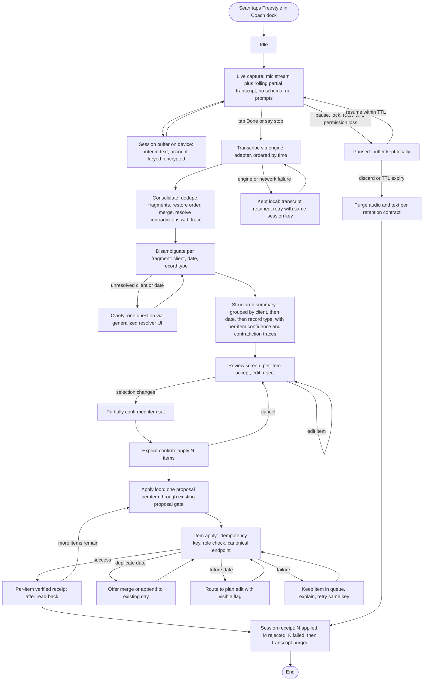
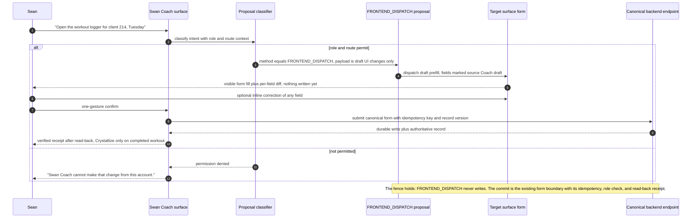
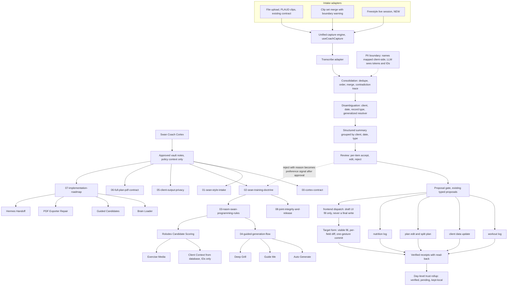
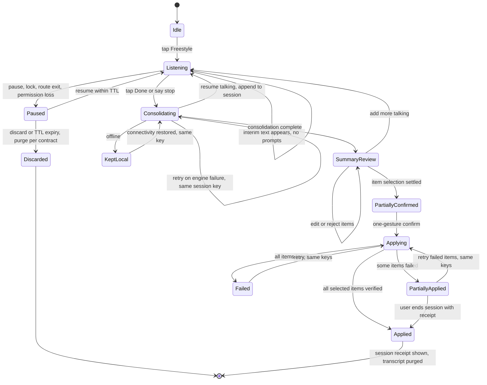

# GLM Consult

> **REDACTION NOTE (2026-08-17):** sample client names in this document were replaced with
> the synthetic placeholder `Jordan T.` The originals used the repo's house example name; the
> last-initial + date + workout-detail combination was the most identifying form in the repo,
> and the retention contract's fixture rule requires invented names in committed docs (Rule 8).
> Reviewer text is otherwise verbatim.

**Model:** glm-5.3
**Document:** docs/ai-workflow/AI-HANDOFF/GLM-COACH-JARVIS-PACKET-2026-08-15.md
**Tokens:** 21548 in / 25429 out (reasoning: 12057) | total 46977
**Wall:** 546.6s

---

# Hostile Design Review & Blueprint Upgrade — Swan Coach "Jarvis + PLAUD"

**Reviewer:** GLM-5.3 · **Date:** 2026-08-15 · **Packet:** Claude Opus 5 assembly from `origin/main`
**Verdict up front:** the Jarvis spine (proposal → confirm → apply), the PLAUD merge intelligence, and voice capture all exist. What does not exist is the one thing Sean actually described: **live freestyle dictation with no schema, consolidated into a multi-client, multi-date, multi-type summary with per-item confirmation** (§3.6 confirms absence). The existing file-based, single-client, single-date intake contract (§3.2) is the wall this review is aimed at.

---

## A. Hostile design review

Evidence basis per target is stated inline. For targets 2–5 I hold file/route inventories, not source contents; every claim below that depends on layout or behavior rather than the verified contract is flagged as **[inference]** and consolidated in §F.

### A1. Swan Coach / Coach Command Center — `.../Pages/coach-assistant/` (210 files)

**Evidence basis:** verified file tree (§3.1), verified backend contract (§3.2, §3.4). Visual/behavioral claims are inference from component names.

1. **WORST — The product's #1 user cannot do his #1 workflow.** The entire intake pipeline begins with `uploadTranscript(file: File, clientId: number)`. On a gym floor, mid-session, with hands busy, there is no file and no time to pre-select a client. Sean's stated vision (§2.1, §2.3) — talk freely, Coach sorts it out — is unreachable from this surface. **Why it's weak:** every other strength is irrelevant if entry is impossible in the real context of use. **Fix:** build Freestyle as a first-class mode (B1, B4, C1, C2; slices S2–S7 in §E) that runs *beside* the file contract rather than through it.
2. **Six navigation chrome components for one page.** `CoachCommandTabBar`, `CoachCommandLeftRail`, `CoachCommandOpsRail`, `CoachConsoleDock`, plus intake workspace chrome. **[inference]** On a 375px phone, a tab bar + two rails + a dock is a chrome tax paid before any content; at 320px it is unusable. **Fix:** one responsive shell — at mobile: single sheet + one Coach dock trigger (aligns with §7.1 Thumb Dock doctrine); rails collapse into a sheet; audit tap-count to any function ≤2 from Coach landing.
3. **Six different confirmation cards = six confirmation idioms.** `CoachActionProposalCard`, `CoachActionProposalSplitPlanPanel`, `CoachExecutionResultCard`, `CoachPreparedDraftResultCard`, `CoachWorkoutLoggerReviewCard`, `CoachPlaudStructuredActionResultCard`. **[inference on visual variance, certain on duplication]** Sean must relearn "how do I say yes" per card type. **Fix:** one proposal-card primitive with typed slots (payload renderer, confidence, diff, accept/reject/edit); specialized cards become slot configs. This primitive is *also* the per-item card the freestyle summary needs (C2) — build it once.
4. **Three transcription paths in one folder.** `useVoiceRecorder.ts`, `useCoachBrowserSpeechInput.ts`, `useGeminiTranscription.ts` — three permission models, three failure modes, three UIs implied. **Fix:** `useCoachCapture` engine abstraction with pluggable adapters; existing hooks become wrappers (S1). Anything less guarantees the freestyle build forks a *fourth* path.
5. **Teach-mode surfaces compete with operator surfaces.** `CoachTeachModePanel`, `CoachIntakeTeachMe` — education is doctrine-mandated for trainer-facing output (03, Trainer Education Rule), but **[inference]** panels defaulting visible on mobile will bury the mic. **Fix:** teach content as progressive disclosure inside results, never a default-visible panel under 768px.
6. **One-line strength:** the proposal→confirm→execution-receipt spine is the right Jarvis skeleton; keep it, extend it, don't replace it.

### A2. Workout Logger — `WorkoutLogger/` + `EnhancedWorkoutLogger.*`

**Evidence basis:** file paths only. All findings here are **[inference]** except where tied to §3.2.

1. **WORST — Two logger families.** `frontend/src/components/WorkoutLogger/` and `TrainerDashboard/WorkoutLogging/EnhancedWorkoutLogger.*` imply duplicated set/rep persistence logic and two bug surfaces for the single most data-truth-critical form in the product. **Fix:** declare one canonical surface, extract shared field/persistence hooks, reduce the other to a re-export or route redirect.
2. **`duplicate_date` is a dead end, not a feature.** Verified in §3.2: a duplicate date is an upload *failure kind*. Real trainers backfill, double-session, and correct. Treating that as validation failure teaches Sean the pipeline breaks when he's honest about his day. **Fix:** in the freestyle path, `duplicate_date` becomes a **merge/append proposal** against the existing day (B1). Port to the file path afterward.
3. **No field-provenance visible.** For Jarvis (§3.4), the logger must render Coach-filled values differently from typed ones or Sean cannot trust or correct the fill. Nothing in the inventory suggests a draft-source distinction exists. **Fix:** field source marks (`you` / `Coach draft`), 1px Ice Wing left border on Coach-filled fields, inline "heard" chips (C3). This extends §7.1's onboarding field-source law to the logger.
4. **`future_date` policy is invisible.** Either plan-ahead logging is allowed (with a flag) or it must be refused with copy that explains why. **Fix:** per-item state in the freestyle summary: "future date — applied to plan, not log" routing to `plan_edit`, not `workout_log`.
5. **Mobile set-matrix risk.** **[inference]** Multi-set grids at 320px historically go horizontal-scroll. **Fix:** one set per row, sticky set-add button in thumb arc, `Apply set` ≥44px, inline SNAP per §7.1 (no optimistic "Saved" — A2 amendment already binds this).

### A3. Workout Planner — `.../Pages/admin-workout-planner/`

**Evidence basis:** file paths; doctrine §6. All layout claims **[inference]**.

1. **WORST — Five panels, no stated mobile story.** Builder + Command + Rolodex + LongHorizonSchedule + TeachModeSidebar + CoachDock. **[inference]** If these stack naively at 375px, tap-count to any planning action explodes; TeachModeSidebar as a *sidebar* is desktop-first by name. **Fix:** mobile mode switcher (Plan / Rolodex / Schedule / Coach) as ≤5 bottom tabs; every panel becomes a sheet; desktop keeps the multi-pane layout.
2. **A voice context *inside the planner*.** `PlannerVoiceContext.tsx` is a fourth independent voice implementation (§3.5). **Fix:** consume the unified capture engine (S1 posture: freeze new variants, wrap on next touch — do not big-bang rewrite three surfaces at once).
3. **Long-horizon view vs the PDF contract.** 06-full-plan-pdf-contract mandates *every planned day appears, no summary-only exports*. If `LongHorizonScheduleView` summarizes weeks with days hidden behind aggregation, the UI violates the spirit of the doctrine the PDF obeys. **[inference]** **Fix:** week rows expand to exhaustive day lists; add a day-count assertion ("4 wks × 3 d = 12 days — 12 shown").
4. **Readiness must be visible in the builder.** Doctrine 04 requires Green/Yellow/Red readiness to change candidate scoring. **[inference]** No file name suggests a readiness strip. **Fix:** persistent readiness strip in the builder header, one line, text+color (never color alone), fed by the existing `readinessCheck` payload (§6, roadmap Phase 2 — already implemented backend-side).
5. **Jarvis gap.** Planner accepts `plan_edit` and `split_plan` proposals (§3.4) but **[inference]** has no Coach-fill presentation. The freestyle summary's `plan_edit` items must land here as visible diffs, same primitive as C3.

### A4. Bootcamp Creator — `BootcampBuilder/` (~60 files)

**Evidence basis:** file paths only. **[inference]** throughout.

1. **WORST — `BootcampDemoMode` lives in the production component tree.** Demo/mock data anywhere near real surfaces threatens the data-truth mandate (charts and records from real logged data, never mock) and the §7.1 law against mock metrics. **Fix:** hard feature flag + isolated route + demo data injected only at the demo boundary and labeled at render time; strip demo components from the production bundle path.
2. **Second Rolodex implementation.** `ExerciseRolodexPanel` here + `WorkoutPlannerRolodexPanel` in the planner = the same doctrine asset (Rolodex metadata, authority stack tier 5) rendered twice. **Fix:** one Rolodex primitive, two slot configs.
3. **Three-pane desktop idiom, unknown mobile collapse.** ClassRail + Preview + CommandDeck. **Fix:** mobile = rail as horizontal class strip, one class detail sheet, command actions in a bottom deck ≤5.
4. **`BootcampRunner` must be a gym-floor mode, not a panel.** If the runner shares chrome with the builder, pause/next/next-class actions will be <44px and out of thumb arc. **Fix:** full-screen runner, ≥56px primary controls, works one-handed, screen-lock tolerant.
5. **Two "command" idioms across surfaces** (Bootcamp CommandDeck vs Coach Command Center) — naming drift that will read as two products. **Fix:** reserve "Command" for Swan Coach; rename the bootcamp deck.

### A5. Client ↔ trainer/team chat — `Social/Messaging/`

**Evidence basis:** file paths + route. Visual state unverified — **[inference]**. Sean's explicit ask: beautification, premium, on-brand.

1. **WORST — Generic chat anatomy.** The file names (`MessageThread`, `GroupMessageBubble`, `ConversationListPanel`, `NewConversationModal`) describe a template, and Sean's complaint confirms it reads like one. **Why it's weak:** this is a *client-facing* surface — it is the brand for clients. **Fix:** Crystalline Swan restyle (C4): Midnight Sapphire elevation planes for threads, 1px Ice Wing hairlines between days, trainer bubbles Royal Depth with purple glow (blue-family background → purple glow, per law), client bubbles Obsidian-elevated; ONE gold badge per scene maximum (e.g., streak/PR chip in header).
2. **`NewConversationModal` on mobile.** **[inference]** A centered modal at 375px with a keyboard open is a trap. **Fix:** bottom sheet, full-width, 16px inputs (iOS zoom), 44px targets, safe-area aware.
3. **Privacy doctrine is load-bearing here and nothing signals it.** 05-client-output-privacy: client-facing copy must never restate sensitive history. If Swan Coach ever drafts replies here (it should — that's Jarvis), draft wording must be constrained to the approved phrasing family ("Based on your training background…"). **Fix:** trainer-only Coach draft strip in the composer with privacy-safe suggested wording, clearly marked as draft, never auto-sent (C4). Client side renders zero Coach chrome — consistent with §7.1.
4. **Group surfaces need role truth, not just UI.** `GroupManagementPanel` **[inference]** — add/remove permissions must be server-enforced and the UI must degrade gracefully when a role lacks them; do not rely on hiding buttons.
5. **Unread/state model unverified** — flag in §F; whatever exists must be text+icon, never color-only.

### A6. The existing PLAUD pipeline — `PlaudClipMerge/` + `useTranscriptIntake`

**Evidence basis:** verbatim contract (§3.2) + file tree (§3.3). This is the review's center of gravity.

1. **WORST — The contract is structurally incapable of the vision.** `uploadTranscript(file, clientId)`: File-in, **one** client bound at upload, **one** optional date, **one** parsed workout. §2.3 needs: live stream in, N clients, N dates, N record types. No amount of styling fixes this; it is a data-model boundary. **Fix — explicit, as §3.2 demands:** run freestyle **beside** this contract, not through it:
   - New sibling hook `useFreestyleIntake` + server-side session object; the existing file path is untouched and keeps working.
   - `clientId: number` moves from *upload-time binding* to *per-item binding at review time* — the summary groups by client, and each item carries its own target resolved via the generalized `PlaudClientResolver`.
   - `targetWorkoutDate?` becomes per-item; `ParsedWorkout` becomes **one item type** in a `FreestyleSummary` bundle whose other items route to the proposal types that already exist (`client_data_update`, `plan_edit`, `split_plan`, `nutrition_log` — §3.4). The routing targets were already built; only the intake shape blocks them.
   - `duplicate_date` and `future_date` stop being upload failures and become **per-item states**: merge/append proposal, and plan-routing-with-flag respectively (see A2-2, A2-4).
2. **Two review UXs for one job.** `PlaudMergeReview` and `CoachWorkoutLoggerReviewCard` both answer "here's the cleaned record, check it." Two idioms, twice the learning, twice the drift. **Fix:** the single proposal-card primitive (A1-3) serves both; `PlaudMergeReview` becomes a config of it.
3. **The disambiguation assets are stranded in the clip family.** `PlaudClientResolver` and `PlaudDateSplitCandidatePanel` solve *exactly* the client/date ambiguity freestyle has — but they're coupled to uploaded clips. **Verdict: generalize, don't replace.** Extract both into shared intake components consumed by clip-merge *and* freestyle (S6). `PlaudClipGroupRail`, `PlaudClipAudioPreview`, `PlaudMergeBoundaryBanner` stay clip-specific — they're genuinely about files.
4. **Contradiction handling is unaddressed.** Nothing in the contract surfaces "3 sets… actually 4." Silent resolution violates trust; silent drop loses data. **Fix:** consolidation keeps a **contradiction trace** per item ("heard 3, then 4 — kept 4, latest"), rendered inline in the summary with one-tap change (C2). Latest-wins is the default heuristic; the trace is what makes it trustworthy.
5. **Confidence is absent from the contract.** `ParsedWorkout` has no confidence field; the UI can't triage what to scrutinize. **Fix:** per-item confidence (High/Medium/Low, text+icon, never color alone) driving sort order — lowest confidence nearest the thumb.
6. **PII boundary must be designed in, not bolted on.** Standing mandate: zero PII to LLMs, names mapped client-side. A raw freestyle transcript is PII-dense. **Fix:** client-side name→token mapping before any transcript leaves the device; consolidation runs on tokenized text; re-hydration to real names happens at render. The resolver shows real names locally, only ever in trainer role-scoped views (consistent with §7.1 fan-out rule).
7. **One-line strength:** merge-boundary warning and date-split detection are the right primitives — keep and promote them.

---

## B. Upgraded Mermaid diagrams

### B1 — Freestyle dictation end-to-end flow



### B2 — Jarvis UI-control sequence



### B3 — Upgraded Swan Coach system map (replaces the graph in `09-brain-map-diagram.md`)



### B4 — Freestyle session state machine



---

## C. Upgraded wireframes

Palette/behavior annotations follow each wireframe. All controls ≥44px; primary mobile actions in thumb arc; state is text+icon, never color alone; one gold element per scene maximum; blue-background buttons carry purple glow, purple-background elements carry cyan glow.

### C1 — Freestyle listening state

**Mobile 375px:**

```text
┌─────────────────────────────────────┐
│ ✕         FREESTYLE        dossier ⧉│ 44px header
│ ● 12:04 · mic live · hands free     │ status, text+dot
├─────────────────────────────────────┤
│                                     │
│        ◜ ◝                          │
│      ( ● ● ● ● ● )                 │ level meter, calm;
│        ◞ ◟                          │ never pulse-only state
│                                     │
│ “…supersets on incline, actually    │
│  make that 4 sets, and Elena said   │
│  tight calf so we rolled it and…”   │ rolling tail,
│                                     │ dimmed to 70%,
│  ▸ scroll for full live text        │ read-only
│                                     │
│ HEARD SO FAR — passive, no prompts  │
│ 2 clients · 2 days · 11 fragments   │ progress signal
│ last word: 2s ago                   │
│                                     │
├─────────────────────────────────────┤
│  [ ⏸ Pause ]      [ ■ DONE ]        │ 44px / 56px,
│  discard (2-tap confirm)            │ thumb arc,
└─────────────────────────────────────┘ safe-area aware
```

**Desktop ≥1280px:**

```text
┌────────────────────────────────────────────────────────────────────────────────────────────────┐
│ ✕  FREESTYLE   ● 12:04 · mic live · hands free                                      dossier ⧉  │
├──────────────────────────────────────────────────────────────┬─────────────────────────────────┤
│ LIVE TRANSCRIPT (read-only, autoscroll)                       │ HEARD SO FAR (passive)          │
│                                                               │                                 │
│ 00:00 “Tuesday with Jordan, chest plus triceps,               │ Clients     Jordan T.   7 frags │
│  incline work…               (click timestamp to seek         │             Elena R.   4 frags │
│ 03:12 “actually make that 4 sets on the press”                │ Days        Tue Aug 12         │
│ 07:40 “Elena, tight calf, rolled it, swapped lunge            │             Thu Aug 14         │
│  for split squat…”                        [pause autoscroll]  │ Item types  workout 2 · note 1  │
│                                                               │             · plan edit 1        │
│                                                               │ Last word   2s ago             │
│                                                               │                                 │
├──────────────────────────────────────────────────────────────┴─────────────────────────────────┤
│ [ ⏸ Pause ]   [ ■ Done — clean it up ]   discard (2-tap confirm)                               │
└────────────────────────────────────────────────────────────────────────────────────────────────┘
```

Notes: no modal interruptions for 10+ minutes; disambiguation waits for consolidation; "dossier" opens the existing intake dossier. Pause/Done are the only interactive targets during listening. Transcript text is device-local until consolidation.

### C2 — Consolidated structured summary review (the load-bearing wireframe)

**Mobile 375px:**

```text
┌─────────────────────────────────────┐
│ ‹ Freestyle summary                 │
│ 12:04 session · 3 clients · 13 items│
├─────────────────────────────────────┤
│ ▼ MARCUS J. · Client 214    5 of 5 ✓│ group toggle
│   Tue Aug 12 · WORKOUT LOG   ✓ High │ item row:
│     Chest + triceps · 5 exercises   │ accept-state,
│     Confidence: High                │ confidence,
│     [✓ Accept] [✎ Edit] [✕ Reject]  │ 3×44px actions
│     ⚠ Heard “3 sets” then “4”       │ contradiction
│       → kept 4 (latest) [change]    │ trace + fix
│   Tue Aug 12 · PLAN EDIT     ✓ Med  │
│     Swap: DB press → incline        │
│     [✓] [✎] [✕]                     │ compact mode
│ ▼ ELENA R. · Client 87      3 of 4 ✓│
│   Thu Aug 14 · WORKOUT LOG   ✓ High │
│   Thu Aug 14 · CLIENT NOTE  ✕ Low   │ rejected item:
│     “calf tightness — rolled,       │ stays visible,
│      swapped lunge → split squat”   │ one tap undo
│ ▶ SCHEDULE · 1 item — unassigned    │
│     Which client? [Resolve]         │ resolver entry
├─────────────────────────────────────┤
│ 12 of 13 selected                   │ live count
│ [       APPLY 12 ITEMS         ]    │ 56px, blue bg,
│                                     │ purple glow
│ keep rest as draft · reject rest    │ secondary path
└─────────────────────────────────────┘
```

**Desktop ≥1280px:**

```text
┌──────────────────────────────────────────────────────────────────────────────────────────────────────────────────┐
│ ‹ Freestyle summary · 12:04 session · 3 clients · 13 items                        [Apply 12 items]  [Save draft] │
├───────────────────────────────┬──────────────────────────────────────────────────────┬───────────────────────────┤
│ GROUP TREE                    │ ITEM DETAIL — Jordan T. · Tue Aug 12 · Workout log    │ APPLY PLAN               │
│ ▼ Jordan T. (214) 5/5 ✓      │                                                      │ Jordan T.  5 of 5 ✓      │
│   Tue Aug 12 · workout  ✓    │  Incline DB press     4 sets · 8–10 reps · RPE 7     │ Elena R.   3 of 4 ✓      │
│     ↳ contradiction ⚠        │  Cable fly            3 sets · 12 reps                │ Schedule   0 of 1 ⚠      │
│   Tue Aug 12 · plan edit ✓   │  Triceps pushdown     3 sets · 12–15                  │                           │
│ ▼ Elena R. (87) 3/4 ✓        │                                                      │ Per-item apply order:    │
│   Thu Aug 14 · workout  ✓    │  Source fragment: “4 sets on the press…”             │ 1 workout logs           │
│   Thu Aug 14 · note     ✕    │  Contradiction trace: “3 sets” 03:01 → “4 sets”      │ 2 plan edits             │
│ ▶ Schedule 0/1 ⚠             │   07:12 → kept 4 (latest)  [change]                  │ 3 client notes           │
│                               │                                                      │ 4 schedule               │
│ Confidence legend:            │  [✓ Accept] [✎ Edit fields] [✕ Reject item]         │ On failure: item stays   │
│ High ✓✓ · Medium ✓ · Low ✓?  │                                                      │ queued, same retry key   │
└───────────────────────────────┴──────────────────────────────────────────────────────┴───────────────────────────┘
```

Notes: default state is **all items accepted** — the one-gesture path is the common case; per-item reject is always one tap away; groups collapse per client; unassigned items surface the generalized resolver (`PlaudClientResolver` extraction). Rejected-with-reason items become preference signals only after session approval (doctrine 02 learning rules — never silent learning). "Apply 12 items" opens a final confirm: *Apply 12 items?* → per-item proposals through the existing gate. No optimistic "Saved" anywhere; receipts read `Saving… → Verified` (§7.2 A2).

### C3 — Jarvis form-fill in progress on a target surface

**Mobile 375px:**

```text
┌─────────────────────────────────────┐
│ ‹ Workout logger · Jordan T.        │
│ Tue Aug 12 · Chest + triceps        │
├─────────────────────────────────────┤
│ Incline DB press           Set 2/4  │ typed earlier
│ Weight [ 30 ]  Reps [ 10 ]          │ (source: you)
│                                     │
│ Cable fly                  Set 1/3  │
│ ┃Weight [ 12 ]  Reps [ 12 ]         │ ┃ = 1px Ice Wing
│ ┃heard “12s for 12”   COACH DRAFT   │ left border marks
│                                     │ Coach-filled
│ Triceps pushdown            Set 1/3 │
│ ┃Weight [ 25 ]  Reps [ 15 ]         │
│ ┃heard “25, up to 15 reps”          │
│ ┃Confidence: High                   │
│                                     │
│ Legend: ┃ filled by Swan Coach      │
│         unmarked = typed by you     │
├─────────────────────────────────────┤
│ [Not now]      [ ✓ Apply drafts ]   │ 44px / 56px,
│                                     │ blue bg +
└─────────────────────────────────────┘ purple glow
```

**Desktop ≥1280px:**

```text
┌────────────────────────────────────────────────────────────────────────────────────────────────────────────────┐
│ Workout logger · Jordan T. · Client 214 · Tue Aug 12                              [✓ Apply 3 draft sets] [Not now]   │
├───────────────────────────────────────────────────────────────────────────────────────────────────────────────┤
│ Exercise                 Set   Weight    Reps    RPE    Source        Heard                              │
│ Incline DB press         2/4   30        10      —      you           —                                  │
│ Cable fly                1/3   ┃12       ┃12     —      Coach draft   “12s for 12”                        │
│ Triceps pushdown         1/3   ┃25       ┃15     —      Coach draft   “25, up to 15 reps”                 │
│ Overhead extension       1/3   ┃20       ┃12     —      Coach draft   “20s, 12 reps, drop last set”       │
│                                                                                                                                 │
│ ┃ marks fields filled by Swan Coach — tap any value to correct inline before applying. Nothing is saved        │
│ until you apply. Diff summary: +3 sets, 0 edits to existing rows.                                              │
└────────────────────────────────────────────────────────────────────────────────────────────────────────────────┘
```

Notes: the fence holds — `FRONTEND_DISPATCH` fills drafts only (§3.4 verbatim contract); commit goes through the canonical logger endpoint with idempotency key; read-back then `Verified`. The "Apply N drafts" label always counts. Keyboard parity: every draft field is directly editable; reduced-motion swaps the fill animation for an instant state swap.

### C4 — Upgraded client ↔ trainer chat

**Mobile 375px:**

```text
┌─────────────────────────────────────┐
│ ‹  MARCUS J.                 ⋮      │ monogram chip,
│ ● training with you · 14 wk         │ 1 gold badge:
│                                     │ “14 wk” streak
│            — Tue Aug 12 —           │ hairline date
│                                     │ separator
│ ┌──────────────────────┐            │
│ │ Session flew by      │            │ client bubble:
│ │ today                │            │ Obsidian-
│ └──────────────────────┘            │ elevated
│          ┌──────────────────────┐   │ trainer bubble:
│          │ Next week we progress │   │ Royal Depth,
│          │ the press and add a   │   │ purple glow
│          │ third set             │   │
│          └──────────────────────┘   │
│ ┌ Swan Coach draft (only you see ┐  │ trainer-only
│ │ this): “Based on your training │  │ assist strip,
│ │ background, this plan…”        │  │ privacy-safe
│ └ [Use] [Edit] [Dismiss]         ┘  │ wording per 05
├─────────────────────────────────────┤
│ [Message…              ] 🎤 ➤ 44px  │ 16px input,
└─────────────────────────────────────┘ safe-area aware
```

**Desktop ≥1280px:**

```text
┌──────────────────────────────────────────────────────────────────────────────────────────────────────────────────────┐
│ Messages                                                                                                              │
├───────────────────────────┬───────────────────────────────────────────────────────┬───────────────────────────────┤
│ CONVERSATIONS             │ MARCUS J. · ● training with you · 14 wk               │ CONTEXT (trainer role only) │
│ [search…        ]         │                                                       │ Current plan: Phase 2, wk 6 │
│ ● Jordan T.       now     │            — Tue Aug 12 —                             │ Readiness: Green            │
│   Elena R.       2h       │ ┌──────────────────────┐                              │ Next session: Thu           │
│   Team — Bootcamp  9:15   │ │ Session flew by today │                             │ Unread needs reply: 1       │
│   + New conversation      │ └──────────────────────┘                              │ ── client never sees ──     │
│                           │          ┌──────────────────────────────┐             │   this panel or any         │
│                           │          │ Next week we progress the     │             │   Coach chrome               │
│                           │          │ press and add a third set     │             │                             │
│                           │          └──────────────────────────────┘             │                             │
│                           │ ┌ Swan Coach draft (trainer-only): “Based on your …┐  │                             │
│                           │ └ [Use] [Edit] [Dismiss]                           ┘  │                             │
│                           ├───────────────────────────────────────────────────────┴───────────────────────────────┤
│                           │ [Message…                                              ] 🎤  ➤                      │
└───────────────────────────┴────────────────────────────────────────────────────────────────────────────────────────┘
```

Notes: group threads add a role label chip per bubble (trainer/client/system), text+icon. New-conversation flows are bottom sheets on mobile. Coach drafts are never auto-sent and never render client-side. Wording constrained to the 05-client-output-privacy approved phrasing family — no condition labels, no history narration.

---

## D. Blueprint upgrade — diffs against the existing docs

### D1. `SWAN-COACH-V3-UX-WIREFRAMES-2026-08-12.md`

**What stays (verified still correct under §2):**
- The three-presentation runtime (Quiet Rail / Thumb Dock / Command Room) and the role-scoped effect ceilings.
- Calm-zone rule for Coach Command; response-only motion; no ambient loops.
- Receipt discipline: `Saving… → Verified` with no optimistic "Saved" (A2, already binding).
- Idempotency keys, field-source law (`you` / `trainer` / `Coach draft`), B7 token substrate, responsive/a11y gates, the state-copy table as the single source of user-facing copy.

**What is now wrong given §2:**
1. **Every presentation assumes a mounted record.** "Dictate/type without leaving the record," "the affected record owns the conversation." Freestyle begins with *no record* — a 10-minute session that spawns 13 candidate writes across 3 clients. The IA has no home for the record-less state.
2. **The voice-to-action flow is single-shot.** `Capture → Parse → DRAFT beside affected record` has no consolidation, no disambiguation, no contradiction resolution, no multi-item bundle. It models a command, not a brain dump.
3. **The state machine has no session states** (listening-long, consolidating, partially-applied) and the copy table therefore lacks their rows (an A3 gap that freestyle widens).

**What to add — replacement text:**

> **Freestyle intake (new section, after "Information architecture"):** The Thumb Dock gains an unmounted state. When no record is open, the dock's mic becomes a Freestyle session: capture with zero prompts, passive progress signal only (clients/days/fragments counted, last-word age), pause/resume/discard with account-keyed local retention per amendment A5 and the A6 retention contract. Stopping hands the buffer to consolidation (B1), which returns a structured summary grouped by client → date → record type. The summary is not a record and cannot Crystallize; it resolves into ledger entries only through per-item proposals. Confirmation is one gesture for the all-accept default and one tap per item for rejection. The Command Room gains the same summary as a reviewable queue, and the day-level trust rollup (A8) counts freestyle outcomes: *Today: X verified / Y pending / Z kept-local.*
>
> **Jarvis form-fill (new subsection under "Workout row and proposal"):** `FRONTEND_DISPATCH` remains draft-only per the backend prompt contract. The UI upgrade is: visible fill with a 1px Ice Wing left border on Coach-filled fields, a "heard" chip per filled value, source labels, a counted `Apply N drafts` primary (blue background, purple glow), inline correction before apply, and commit through the canonical form boundary with idempotency key. The fence stays: it is what makes the fill trustworthy and it is the mechanism Sean himself specified — "ask if it's okay."

**State-copy table — new rows (extends A3):**

| State | User-facing copy |
|---|---|
| listening_long | `Still listening. Talk as long as you need — nothing is saved yet.` |
| consolidating | `Cleaning it up — merging repeats and putting events in order…` |
| contradiction | `I heard two versions of one detail. I kept the latest — please check it.` |
| resolve_client | `Which client is this about?` |
| resolve_date | `Which day did this happen?` |
| partially_applied | `9 of 12 saved and verified. 3 kept as drafts — review or retry.` |
| session_discarded | `Session discarded. Nothing was saved.` |

**Concept-direction verdict (explicit, as §5 requires):** **Crystal Ledger (Direction 1) still holds — keep it, extended.** "The affected record owns the conversation" and "one faceted record forms only after authoritative completion" are exactly the right laws for the freestyle apply phase: the summary is a *basket of candidate writes*, and each write becomes a ledger entry only through its own verified proposal. What changes is that the ledger now needs a **pre-ledger stage**: the freestyle session and its summary live *before* the ledger, never write to it directly, and evaporate (per retention contract) once resolved. Direction 2 remains the onboarding presentation; Direction 3 remains trainer/admin Command Room, now hosting the freestyle queue and trust rollup. Gate 0 resolution per adjudication A1: ratifying D1 as system default, not choosing between products — freestyle does not reopen that question.

### D2. `SWAN-COACH-V3-ADJUDICATION-AND-AMENDMENTS-2026-08-12.md`

The 8 blocking amendments carry forward; four gain new load under freestyle:

- **A3 (state-copy completeness):** the copy-row audit must now include the seven new rows above and every B4 state/edge. Proof standard unchanged: node/edge → copy-row table with zero gaps.
- **A5 (account-scoped drafts):** extends to freestyle session buffers — audio and interim text are account-keyed, encrypted, purged on logout/account-switch/TTL/discard. Shared-gym-tablet test now includes: *start freestyle as trainer A, switch accounts, trainer B sees nothing.*
- **A6 (transcript retention contract):** becomes load-bearing, not default-off courtesy, for the freestyle path specifically — freestyle must not ship without it implemented. Contract tightened: parsed text only, audio never persisted server-side, TTL ≤24h, session-scoped, account-keyed, encrypted, purge on save-verified/dismiss/logout/switch/TTL/session-receipt, excluded from logs/analytics/model context beyond the consolidation call itself (de-identified tokens only per the PII mandate). The file-upload PLAUD path may keep the default-off posture from the original amendment.
- **A8 (day-level trust rollup):** the strip now sources freestyle receipt states too, per D1.

A1, A2, A4, A7 are unchanged in letter; A4's re-pin gate applies to every slice in §E (drift blocks slice entry). Owner decisions D1 (onboarding gating) and D2 (dormant lease schema) are untouched by freestyle and still require Sean's explicit ratification.

**New amendment this review adds (recommend binding):** **A9 — freestyle runs beside the file contract.** `useTranscriptIntake`'s `uploadTranscript(file, clientId)` signature, its single-client/single-date binding, and its `duplicate_date`/`future_date` upload-failure semantics must not be edited to absorb freestyle. A sibling session-based path is added; per-item apply reuses the proposal machinery; porting the file path onto the session engine is a later, separately-tested slice. Proof: the existing PLAUD upload flow's contract tests pass unchanged while freestyle ships.

### D3. `SWAN-COACH-ASSISTANT-MASTER-BLUEPRINT.md` (v1.0, 2026-03-30)

**What stays:** mobile-first 16px law (iOS zoom), the touch-target floor (44/56/64px), the landing-route decision, performance budgets (virtualization, <100ms first render), accessibility requirements, and the underlying instinct that voice is the primary input on the gym floor.

**What is now wrong:**
1. **Off-palette fallback hex values.** `#030712`, `#141419` are not Crystalline Swan tokens. Replace all fallbacks: `--bg-base → #0A0A0F`, `--bg-elevated → #002060`-family elevation, `--text-primary → #E0ECF4`, accents from Ice Wing `#60C0F0` / Wing Purple `#8B5CF6` only. Arctic Cyan `#50A0F0` stays chart-only. No retired Galaxy-Swan values anywhere.
2. **"AI" appears in UI copy throughout** ("AI: Good morning", "AI response text"). Branding law: it is Swan Coach, always. Global copy replacement.
3. **750ms silence auto-send** contradicts freestyle: sessions run minutes with no send events. Auto-send remains only for the short-command mode; freestyle uses explicit Done/"say stop."
4. **The planned file structure (~15 files) is superseded by a 210-file reality.** The doc's component plan is dead; the real consolidation targets are the six proposal cards, the three capture hooks, and the six chrome components (A1).
5. **Quick-actions table is subsumed** by the typed proposal system (`workout_log | plan_edit | …`) — retire the ad-hoc table, point to §3.4 types.
6. **Context-chip auto-detection** survives only as intent classification feeding the proposal classifier, not as user-visible chip switching.

**What to add:** a supersession banner ("v1.0 superseded by the V3 wireframes doc + this packet's §E build order"), the freestyle pipeline (B1), the Jarvis fill contract (B2/C3), and the voice-consolidation posture (one capture engine; Planner/Nutrition/Bootcamp voice entry points migrate on next touch, not by big-bang).

### D4. The `FRONTEND_DISPATCH` fence — explicit position (§3.4 requirement)

**Keep the fence. "Never as a final write path" should remain verbatim law.** Arguments:
1. **Sean's own spec requires it.** §2.3 ends with explicit confirmation before applying. An unfenced dispatch is Coach writing without asking — the opposite of the vision.
2. **The authority stack ranks LLM drafting lowest (tier 6)**; client data writes are tier 2. The fence is the enforcement edge between them.
3. **Data truth and auditability:** commits through the canonical form boundary get idempotency keys, role checks, record versions, and read-back receipts. A direct-write path would need to rebuild all of that worse.
4. **The Jarvis feel doesn't need the fence gone.** What was missing is *visibility* — Coach filling the form in front of Sean (C3), field provenance, counted one-gesture apply. That is a UI upgrade on the dispatch, not a permission upgrade.
The one narrow exception to consider later (not now): server-side *scheduling* of already-confirmed writes — which is the dormant D2 lease machinery, already adjudicated.

---

## E. Build order

Ordered by risk-adjusted value. Slices are independently shippable; S9 may run in parallel with anything from S4 onward (disjoint files). Per adjudication A4, every slice re-verifies cited SHAs/receipts against `origin/main` at open; drift blocks entry.

**S0 — Re-pin, doc amendments, retention contract authoring.**
Goal: make the paper true before touching code (A4, A6, D1–D3).
Files: the three §7 docs; new `docs/ai-workflow/coach-brain/10-freestyle-intake.md` authored with `brain: swan_coach_cortex`, `review_status: draft` until Sean approves (ingestion rules forbid self-approving vault notes); A6 retention contract doc.
Acceptance: re-pin receipt reproduced against current main; amended V3 doc contains the D1 replacement text, seven new copy rows, and A9; vault note exists in draft status; `duplicate_date` merge-proposal policy written down with the latest-wins contradiction default.

**S1 — Unified capture engine (Coach page only).**
Goal: one voice entry implementation beneath Swan Coach.
Files: new `frontend/src/components/DashBoard/Pages/coach-assistant/hooks/useCoachCapture.ts` wrapping `useVoiceRecorder.ts`, `useCoachBrowserSpeechInput.ts`, `useGeminiTranscription.ts`; call sites in `CoachCommandComposer.tsx` / `CoachInputBar.tsx`.
Acceptance: all Coach voice entry consumes `useCoachCapture`; the three legacy hooks are wrappers or deleted; identical permission-denied copy and stop-on-route-exit/logout/hide behavior from all entry points; no behavior change in transcript output for the existing file path.

**S2 — Freestyle listening surface (no writes, behind flag).**
Goal: the C1 states exist and are safe.
Files: new `CoachFreestyleOverlay.tsx`, `CoachFreestyleSignalStrip.tsx` (+ `.styles.ts`) in `coach-assistant/`, reusing `VoiceRecordingOverlay.tsx`, `CoachVoiceLevelMeter.tsx`, `VoiceTranscriptPreview.tsx`; `useFreestyleSession.ts` (state machine of B4, buffer per A5).
Acceptance: 10-minute session at 375px one-handed with zero interruptions; pause/resume; discard = 2-tap + purge verified; account-switch hides buffer; 320/375/414 + 1280/1440 pass; reduced-motion path has no pulse-only state; screen-lock behavior defined (partial buffer kept, resume offered).

**S3 — Retention implementation (A6) for freestyle text.**
Goal: the contract is enforced, not decorative.
Files: new `coach-assistant/sessionStore/` (encrypted, account-keyed, TTL ≤24h) + tests.
Acceptance: purge fires on save-verified/dismiss/logout/account-switch/TTL/session-receipt (unit-tested per trigger); audio never leaves the device except as the transcription stream; store contents unreadable from a second account; nothing written to logs/analytics.

**S4 — Consolidation + summary engine (backend).**
Goal: wall-of-text → typed, grouped, confidence-scored items.
Files: new `backend/services/ai/freestyleConsolidationService.mjs` beside `coachActionProposalService.mjs`; route added near existing `aiCommandRoutes.mjs` dispatch; reuse `coachActionProposalClassifier.mjs` types. PII boundary: tokenized transcript in, IDs out (names mapped client-side per mandate).
Acceptance: fixture with 3 clients / 2 dates / 4 record types returns correctly grouped `FreestyleSummary`; contradiction fixture yields a trace with latest-wins and the alternative retained; unresolved client/date yields a clarification item, not a dropped fragment; no client names appear in any outbound prompt payload (assert in test).

**S5 — Summary review surface.**
Goal: C2 shipped.
Files: new `CoachFreestyleSummaryReview.tsx` (+ `.styles.ts`); refactor one proposal-card primitive out of `CoachActionProposalCard.tsx` and configure `CoachWorkoutLoggerReviewCard.tsx` onto it.
Acceptance: all-accepted default with counted one-gesture apply; per-item reject/edit; per-group toggle; contradiction trace changeable in one tap; states match B4 and copy matches the D1 table; existing proposal-card flows regress-tested.

**S6 — Generalize the PLAUD resolvers.**
Goal: one disambiguation layer for clips and freestyle.
Files: extract `PlaudClientResolver.tsx` and `PlaudDateSplitCandidatePanel.tsx` logic into shared intake components (e.g., `frontend/src/components/CoachIntakeShared/`); `PlaudMergeReview.tsx` and S5 consume them.
Acceptance: zero duplicated resolver logic; the existing PLAUD clip-upload flow passes its current tests unchanged.

**S7 — Per-item apply loop + failure-kind upgrades + trust rollup.**
Goal: items become verified receipts; dead-ends become proposals.
Files: `coachActionProposalService.mjs` (batch creation path), `useTranscriptIntake` sibling `useFreestyleIntake.ts` (+ types), `CoachExecutionResultCard.tsx` reuse; Command Room day-level strip (A8) extended to freestyle outcomes via `CoachProposalGateRail.tsx` area.
Acceptance: apply of 13 items issues 13 idempotent proposals; killing the network mid-apply leaves remaining items queued with same retry keys; `duplicate_date` renders a merge/append proposal, `future_date` routes to `plan_edit` with a visible flag; rollup counts reconcile to receipts (X verified / Y pending / Z kept-local).

**S8 — Jarvis visible fill on the logger.**
Goal: C3 shipped, fence intact.
Files: `frontend/src/components/WorkoutLogger/` + `TrainerDashboard/WorkoutLogging/EnhancedWorkoutLogger.*` (draft-source marks, heard chips, counted apply); `coachActionProposalPromptContract.mjs` unchanged (fence stays verbatim).
Acceptance: Coach-filled fields visually distinct (1px border + source label) at all breakpoints; every filled field inline-editable; apply goes through the canonical endpoint with idempotency key; copy audit shows zero "Saved" before read-back; keyboard-only and reduced-motion paths pass.

**S9 — Chat beautification (parallelizable from S4 onward).**
Goal: C4 shipped.
Files: `frontend/src/components/Social/Messaging/MessagingView.tsx`, `MessageThread.*`, `ConversationListPanel.*`, `GroupMessageBubble.*`, `NewConversationModal.*` (→ bottom sheet on mobile), styled-components restyle to Crystalline tokens.
Acceptance: palette/glow/gold-budget audit passes (one gold badge max per scene); 16px inputs, 44px targets, safe-area; trainer-only Coach draft strip with wording restricted to the 05-privacy approved phrasing; client view contains zero Coach chrome; group role labels are text+icon.

**S10 — Chrome and duplication cleanup.**
Goal: kill the fragmentation tax.
Files: `CoachCommandTabBar/LeftRail/OpsRail/ConsoleDock` consolidation to one responsive shell; `BootcampDemoMode` hard-gating; Rolodex primitive dedupe across `BootcampBuilder/ExerciseRolodexPanel.*` and planner panel; planner mobile mode switcher; `PlannerVoiceContext.tsx` / `useNutritionDictation.ts` / `BootcampVoiceProposalTray.tsx` migrated onto `useCoachCapture`.
Acceptance: tap-count ≤2 from Coach landing to any function; demo components unreachable with flag off; single Rolodex implementation; four legacy voice entry points all consume the one engine.

---

## F. Risks, open questions, and what I could not verify

**Inferred from file names, not file contents (the honesty ledger):**
1. Every claim about the *current visual state* of targets 1–5 (rail crowding, card inconsistency, modal behavior, planner/bootcamp mobile collapse, chat template look). I hold the §3 inventory and the §3.2/§3.4 verbatim contracts; I have not read the render trees. The findings stand as architecture-level critiques; their severity ranking could shift after a screenshot pass.
2. `CoachIntakeWorkspace.tsx`'s "retention/purge planning" — filename-confirmed, content-unverified. Whether it already satisfies A6 is unknown; S3 assumes it does not.
3. The 750ms auto-send behavior — sourced from §7.3 (March), likely stale relative to 210 files of subsequent work.
4. Whether `VoiceTranscriptPreview.tsx` streams *interim* partials (needed for C1's rolling tail) or only final segments.
5. Whether `useGeminiTranscription.ts` supports chunked/streaming upload for 10+ minute sessions, and what its hard cap is; Web Speech API continuous-mode restart limits on iOS Safari are a live risk for S2.
6. Whether `coachActionProposalService.mjs` supports batch proposal creation (S7 assumes a small addition, not a rewrite).
7. Whether `WorkoutLogger/` and `EnhancedWorkoutLogger.*` truly overlap or one already delegates to the other.
8. Whether the landing-route redirect from §7.3 was ever implemented.
9. Unread/message-state machinery in Messaging — unknown; C4's unread treatment is a proposal, not a description.

**Open questions for Sean / owners:**
- **D1 and D2 from §7.2 remain unratified** (onboarding gating; dormant lease schema). Nothing in this packet settles them.
- Engine choice for long-form transcription (browser vs server-side Gemini) — cost, latency, and the PII boundary interact; the tokenization mapper's accuracy on nicknames ("Jordan", "MJ", "the runner guy") is a genuine hard problem and needs Sean's real client-name variety tested early (S4 fixture).
- Policy decision needed: is future-date *logging* ever allowed, or does it always route to `plan_edit`? S7 assumes the latter.
- Contradiction default (latest-wins) — confirm Sean agrees, since his PLAUD mental model is "make it clean," not "show me arguments." The trace is the compromise; it can be demoted to an expandable if it reads noisy.
- Whether rejected-with-reason freestyle items should immediately become preference signals (doctrine allows it after approval) or wait for repeated evidence (doctrine's safer default). I assumed the safer default.

**Risks:**
- Long-session capture on iOS (backgrounding, lock, interruption) is the single most likely place S2 fails in the field, not in tests.
- The consolidation LLM call is the only place raw-ish transcript text approaches a model; the tokenization boundary must be tested adversarially (names, nicknames, initials) before S4 ships, or the zero-PII mandate is violated in letter.
- S6 (resolver extraction) risks regressing the working PLAUD clip flow; the "existing tests pass unchanged" gate is mandatory, not aspirational.
- Gold discipline: C2 and C4 each define exactly one gold element; any implementation adding more breaks the law silently — add it to the S5/S9 acceptance audits.
- Scope creep: this packet touches six surfaces. S0's amended docs and the slice gates exist precisely so that the freestyle spine (S1–S7) cannot be held hostage by beautification work (S9) or cleanup (S10), or vice versa.
