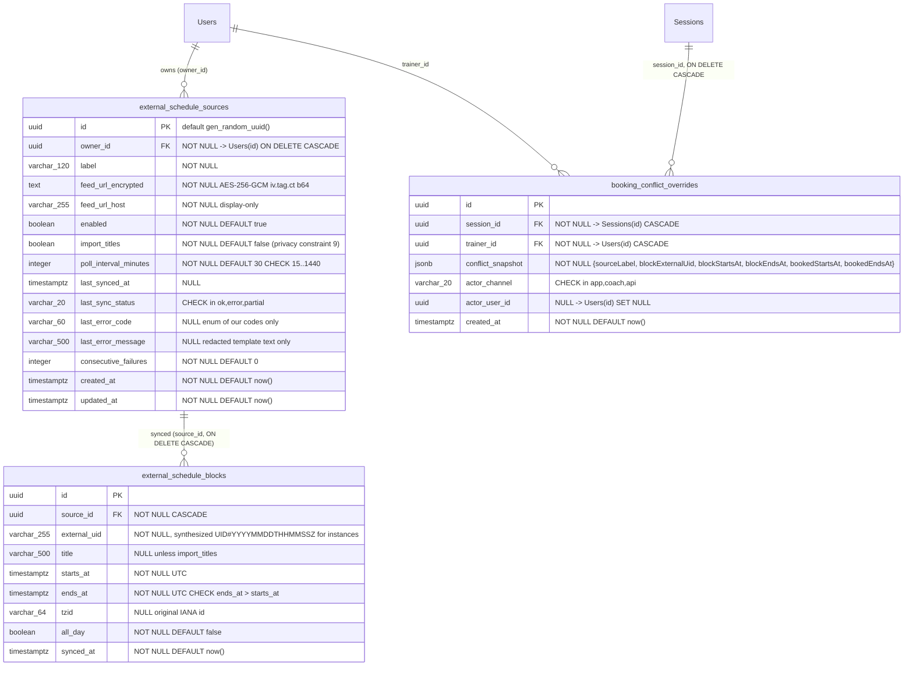
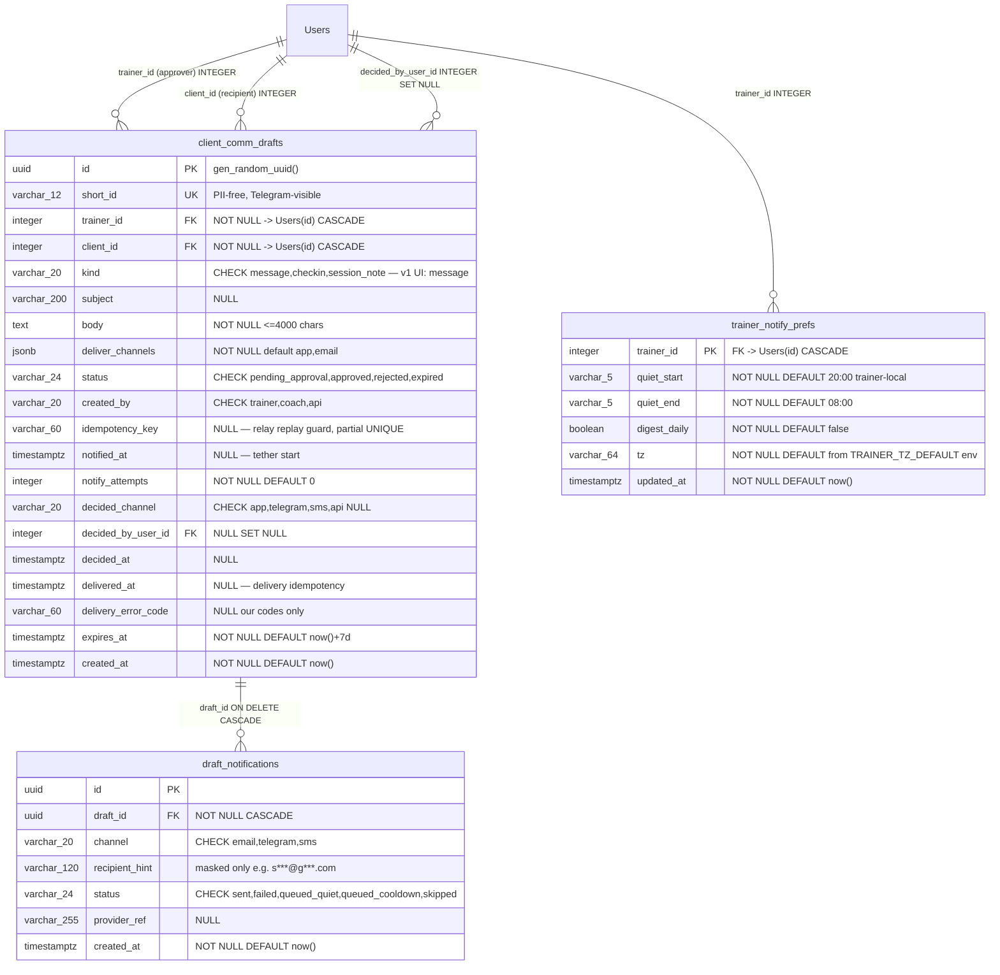

# DEFECT-HUNT PACKET (specs only)

Two blueprints Opus 5 will build VERBATIM. Only the buildable specs are included — migrations,
API contracts, ERDs, slices, test matrices. Prose and rationale were stripped to leave you budget.

CONTEXT YOU NEED, do not re-derive:
- Users.id is INTEGER autoIncrement. Every FK to Users is INTEGER. (already corrected)
- The cart 500's cause is a boot-order race: server listens, models cache initializes in a
  background setTimeout 500ms later, getAllModels() throws a bare Error in that window, 61 files
  are affected. D-1/D-2/D-3 were DISPROVEN against production. (already corrected)
- Blueprint A slice A1's migration is superseded. (already corrected — do not re-report)
- The repo redactor is used for error logging, not raw err.message. (already corrected)

## BLUEPRINT A — GLM money-lane specs

## A.5 Slices

**A0 — Reproduce + instrument (ships first, alone).**
Files: `backend/scripts/repro-cart500.mjs` `[NEW]` (~120 lines); modify `backend/routes/cartRoutes.mjs` [F4 path] to attach the error middleware (~25 lines added).
Acceptance: running the repro on production with `CART_TEST_EMAIL`/`CART_TEST_PASSWORD` env yields 200s for the full lifecycle, or a captured stack in logs with a `requestId`.
Prove: `node backend/scripts/repro-cart500.mjs --host https://sswanstudios.com` then `node backend/scripts/repro-cart500.mjs --host https://sswanstudios.com --role client` (runs both an admin-role and client-role account; D-3-class bugs are role-dependent).

**A1 — Fix per diagnosis table.**
Files: per remediation row above.
Acceptance: A0 repro green for **both roles**, twice consecutively (fresh logins — per U1's own note that a stale session masks it).
Prove: same command as A0, exit code 0.

**A2 — Money canary.**
Files: `backend/core/jobs/moneyCanaryJob.mjs` `[NEW]`; row sink `backend/scripts/money-canary-report.mjs` `[NEW]`.
Acceptance: daily advisory-locked run; any non-2xx on the lifecycle emails Sean via the SendGrid adapter from D.2 (if D.2 not yet shipped, logs `MONEY_CANARY_RED` loudly — belt and suspenders).
Prove: `node backend/core/jobs/moneyCanaryJob.mjs --once` locally against staging creds; grep log for `MONEY_CANARY_GREEN`.

## A.6 Test matrix

| File `[NEW]` | Asserts | Fixture |
|---|---|---|
| `backend/scripts/repro-cart500.mjs` (self-check mode `--selftest`) | Script's own HTTP+assert helpers work against a mock server | Inline mock (30 lines) |
| `backend/core/jobs/moneyCanaryJob.test.mjs` | Canary marks red on first non-2xx; green on all-2xx; advisory lock prevents double-run | Mock fetch returning 500 for `GET /api/cart` |
| `backend/middleware/__tests__/errorHandler.test.mjs` | 500 → log line contains route/userId/status/stack; 4xx → no stack logged; body carries `requestId` | Throwing handler stub |

## A.7 Failure modes & guards

1. **Fix is role- or product-specific** (green for admin, red for client role, or green for package A only) → guard: repro matrix runs both roles × two products; canary rotates product choice daily.
2. **Observability leaks PII into logs** → guard: serializer allowlist (route, userId, status, message, stack, requestId only); test asserts request bodies never appear.
3. **D-1 migration touches live cart rows** → guards: pre-dump `pg_dump --table <cart>`; bounded batch updates (5,000/tx); forward+reverse proven locally first; deploy in a low-traffic window per runbook `docs/runbooks/money-path.md` `[NEW]`.
4. **Canary account pollutes real data** → guard: canary uses a dedicated flagged account; canary cart cleared at end of run; canary never calls `/checkout` until a processor sandbox is confirmed `[LOCATED-IN-A0]`.

---

## B.2 API contract

`POST /api/leads` — public. Guard chain: `leadLimiter` `[NEW]` (10/IP/hour) → validators.
Request: `{ name: string(1..120), email: string(email), phone?: string(7..20), message?: string(0..2000), source: 'contact_form', hp: string (honeypot, normally empty) }`
Responses:
- `202 {"ok":true}` — accepted (also returned for honeypot hits, silently discarded server-side)
- `400 {"error":"VALIDATION","fields":["email"]}` · `429 {"error":"RATE_LIMITED"}`
Notify email to trainer (Sean's account email): subject `New lead — {name} ({source})`, body: name, email, phone, message, link to the marketing workspace lead view.

## B.3 Slices

**B0 — Audit.** Locate: contact form component + its current submit handler; signup route; `Lead` model columns; whether a `source` column exists. Doc: `docs/audit/LEAD-CAPTURE-B0.md` `[NEW]`. Prove: the grep/psql commands' outputs committed in the doc.
**B1 — `POST /api/leads` + notify.** Files: `backend/routes/leadRoutes.mjs` `[NEW]` mounted in `backend/core/routes.mjs` [F4 mount file], `backend/core/services/leadService.mjs` `[NEW]`, tests. Prove: `bash backend/scripts/smoke-leads.sh` (curl → 202 → psql count → email received).
**B2 — Signup conversion + source attribution.** Modify signup handler `[LOCATED-IN-B0]` to create the converted Lead. Prove: signup via curl → Lead row `status='converted'`.
**B3 — Coverage + abuse tests.** Prove: `node --test backend/core/services/leadService.test.mjs`.

## B.4 Test matrix & failure modes

Tests: honeypot hit discards; dedupe upserts (same email within 30 d increments `touchCount` `[ASSUMPTION column — B0; if absent, B1 adds via reversible migration]`); rate limit trips at 11th request. **Failure modes:** (1) bot flood → honeypot + IP limiter + 2,000-char cap; (2) notification email lands in spam → SPF/SendGrid alignment exists [F12], bounce logging in adapter, fallback in-app badge; (3) only one of several public forms wired → B0 inventory grep is the gate, coverage test asserts every `source` enum value has a wired touchpoint.

---

## C.2 Mermaid — ERD


Unique constraints: `external_schedule_sources(owner_id, label)`; `external_schedule_blocks(source_id, external_uid)`. Indexes: `ghost_sources_owner_idx(owner_id)`; `ghost_blocks_source_start_idx(source_id, starts_at)`; `ghost_blocks_source_end_idx(source_id, ends_at)`; `ghost_blocks_purge_idx(ends_at)`; `booking_overrides_session_idx(session_id)`.

## C.4 API contracts

Router: `backend/routes/ghostRoutes.mjs` `[NEW]`, mounted in `backend/core/routes.mjs` [F4 mount file] as `app.use('/api/ghost-sources', ghostRoutes)`. Guards: `protect` [F4] then `requireTrainer` `[NEW middleware — C0 pins role values; fallback spec: role ∈ TRAINER_ROLES constant]`. All responses JSON; all errors shaped `{"error": CODE, ...}`.

**1. `GET /api/ghost-sources`** — `protect, requireTrainer`
→ `200 { "sources": [{ "id": uuid, "label": str, "feedUrlHost": str, "hasFeedUrl": true, "enabled": bool, "importTitles": bool, "pollIntervalMinutes": int, "lastSyncedAt": iso|null, "lastSyncStatus": "ok"|"error"|"partial"|null, "lastErrorCode": str|null, "lastErrorMessage": str|null, "consecutiveFailures": int, "blockCount": int }] }` (owner-scoped to auth user)
→ `401 {"error":"UNAUTHENTICATED"}` · `403 {"error":"FORBIDDEN"}`

**2. `POST /api/ghost-sources`** — `protect, requireTrainer, ghostMutationLimiter` `[NEW: 20/hour/user]`
Body: `{ "label": str(1..120), "feedUrl": str matching ^https?:// or ^webcal:// (webcal→https), "importTitles"?: bool = false, "pollIntervalMinutes"?: int(15..1440) = 30 }`
→ `201` item shape as GET · kicks first sync async
→ `400 {"error":"INVALID_URL"|"INVALID_LABEL"|"INVALID_INTERVAL"}` · `409 {"error":"LABEL_EXISTS"}` · `401/403` as above

**3. `PUT /api/ghost-sources/:id`** — same guards. Body: any subset of `{label?, enabled?, importTitles?, pollIntervalMinutes?, feedUrl?}` (feedUrl replaced = re-encrypt; never returned).
→ `200` item · `404 {"error":"NOT_FOUND"}` · `400/409` as above

**4. `DELETE /api/ghost-sources/:id`** — → `204` · `404`. Cascades blocks (FK). Sessions and overrides survive.

**5. `POST /api/ghost-sources/:id/sync`** — `protect, requireTrainer, ghostSyncLimiter` `[NEW: 1/min/source]`. Runs one inline sync.
→ `200 {"status":"ok","blocksImported":int}` · `200 {"status":"error","errorCode":str}` (with prior blocks kept) · `429 {"error":"RATE_LIMITED"}` · `404`

**6. `GET /api/ghost-sources/blocks?from=ISO&to=ISO`** — `protect, requireTrainer`. Window ≤ 62 d, `to ≥ from`, both required.
→ `200 {"blocks":[{ "id": uuid, "startsAt": iso, "endsAt": iso, "title": str|null, "allDay": bool }]}` (owner-scoped via join to sources)
→ `400 {"error":"WINDOW_TOO_LARGE"|"INVALID_WINDOW"}`

**7. Booking-path integration (existing routes, `[LOCATED-IN-C0]` files).** For session **create** and **update/reschedule** (and bulk creator if it has a separate write `[LOCATED-IN-C0]`):
- No overlap, any mode → `201` normal response (in `warn` mode with overlap: `201` + `"ghostWarning": {"conflicts":[…]}`)
- Overlap in `enforce`, no `overrideGhost:true` in body →
  `409 {"error":"GHOST_CONFLICT","requiresOverride":true,"conflicts":[{"blockId":uuid,"startsAt":iso,"endsAt":iso,"sourceLabel":str}]}`
- `overrideGhost:true` + overlap → `201` + `booking_conflict_overrides` row inserted in the same transaction (`actor_channel:'app'` from web, `'coach'` when the caller is the Coach service `[C0 verifies how Coach authenticates — if indistinguishable, channel 'api']`, `'api'` otherwise; `actor_user_id` = auth user where present).
Coach-facing note: Swan Coach receives the same `409` payload and must surface it — it cannot silently override while U2 stands (H5).

## C.6 — Migration SQL (complete, corrected, forward + reverse)

Files `[NEW]`:
- `backend/migrations/20261007120000-create-ghost-schedule.mjs` — runner-compatible wrapper exporting `up`/`down` (runner + exact dir pinned by C0; the raw `.sql` files below are the source of truth, so proving never depends on the runner)
- `backend/migrations/sql/20261007120000_ghost_forward.sql`
- `backend/migrations/sql/20261007120000_ghost_reverse.sql`

**Forward** (PostgreSQL 16 [F1]; `gen_random_uuid()` built-in; additive DDL only — no existing row is read or mutated, satisfying constraint 7):

```sql
-- 20261007120000 create ghost schedule — FORWARD
-- FK TYPES (correction banner): owner_id / trainer_id / actor_user_id -> Users(id) = INTEGER
--   (VERIFIED: backend/models/User.mjs — id DataTypes.INTEGER PK autoIncrement)
-- session_id -> Sessions(id) = INTEGER (Session.mjs comment records the alignment).
--   C0 PROVE:
--   psql "$DATABASE_URL" -Atc "SELECT data_type FROM information_schema.columns
--     WHERE table_name='Sessions' AND column_name='id';"   -- expected: integer
--   If it returns 'uuid': change the word INTEGER to UUID on
--   booking_conflict_overrides.session_id ONLY. Nothing else in this blueprint moves.

BEGIN;

CREATE TABLE IF NOT EXISTS external_schedule_sources (
  id                    UUID PRIMARY KEY DEFAULT gen_random_uuid(),
  owner_id              INTEGER NOT NULL REFERENCES "Users"("id") ON DELETE CASCADE,
  label                 VARCHAR(120) NOT NULL,
  feed_url_encrypted    TEXT NOT NULL,                 -- AES-256-GCM "iv.tag.ct" base64
  feed_url_host         VARCHAR(255) NOT NULL,         -- display-only; URL never stored in clear
  enabled               BOOLEAN NOT NULL DEFAULT TRUE,
  import_titles         BOOLEAN NOT NULL DEFAULT FALSE, -- privacy constraint 9: times-only default
  poll_interval_minutes INTEGER NOT NULL DEFAULT 30
                        CHECK (poll_interval_minutes BETWEEN 15 AND 1440),
  last_synced_at        TIMESTAMPTZ,
  last_sync_status      VARCHAR(20) CHECK (last_sync_status IN ('ok','error','partial')),
  last_error_code       VARCHAR(60),                   -- OUR enum codes only (see C.5)
  last_error_message    VARCHAR(500),                  -- whitelisted template text only;
                                                        --   raw upstream text can embed the feed URL
  consecutive_failures  INTEGER NOT NULL DEFAULT 0,
  created_at            TIMESTAMPTZ NOT NULL DEFAULT now(),
  updated_at            TIMESTAMPTZ NOT NULL DEFAULT now(),
  CONSTRAINT ghost_sources_owner_label_key UNIQUE (owner_id, label)
);

CREATE TABLE IF NOT EXISTS external_schedule_blocks (
  id           UUID PRIMARY KEY DEFAULT gen_random_uuid(),
  source_id    UUID NOT NULL REFERENCES external_schedule_sources("id") ON DELETE CASCADE,
  external_uid VARCHAR(255) NOT NULL,                  -- instances: "${UID}#YYYYMMDDTHHMMSSZ"
  title        VARCHAR(500),                           -- NULL unless source.import_titles
  starts_at    TIMESTAMPTZ NOT NULL,                   -- UTC
  ends_at      TIMESTAMPTZ NOT NULL CHECK (ends_at > starts_at),
  tzid         VARCHAR(64),                            -- original IANA id, retained for re-sync rebase
  all_day      BOOLEAN NOT NULL DEFAULT FALSE,
  synced_at    TIMESTAMPTZ NOT NULL DEFAULT now(),
  CONSTRAINT ghost_blocks_source_uid_key UNIQUE (source_id, external_uid)
);

CREATE TABLE IF NOT EXISTS booking_conflict_overrides (
  id                UUID PRIMARY KEY DEFAULT gen_random_uuid(),
  session_id        Integer NOT NULL REFERENCES "Sessions"("id") ON DELETE CASCADE,
  trainer_id        Integer NOT NULL REFERENCES "Users"("id") ON DELETE CASCADE,
  conflict_snapshot JSONB NOT NULL,
                    -- {sourceLabel, blockExternalUid, blockStartsAt, blockEndsAt,
                    --  bookedStartsAt, bookedEndsAt} — denormalized ON PURPOSE:
                    -- blocks are volatile derived data; an FK to them would
                    -- cascade-delete audit history on every re-sync
  actor_channel     VARCHAR(20) NOT NULL CHECK (actor_channel IN ('app','coach','api')),
  actor_user_id     Integer REFERENCES "Users"("id") ON DELETE SET NULL,
  created_at        TIMESTAMPTZ NOT NULL DEFAULT now()
);

CREATE INDEX IF NOT EXISTS ghost_sources_owner_idx      ON external_schedule_sources (owner_id);
CREATE INDEX IF NOT EXISTS ghost_blocks_source_start_idx ON external_schedule_blocks (source_id, starts_at);
CREATE INDEX IF NOT EXISTS ghost_blocks_source_end_idx   ON external_schedule_blocks (source_id, ends_at);
CREATE INDEX IF NOT EXISTS ghost_blocks_purge_idx        ON external_schedule_blocks (ends_at);
CREATE INDEX IF NOT EXISTS booking_overrides_session_idx ON booking_conflict_overrides (session_id);
CREATE INDEX IF NOT EXISTS booking_overrides_trainer_idx ON booking_conflict_overrides (trainer_id); -- metrics query (absence-first gap #9)

COMMIT;
```

**Reverse** (run only via the runbook below; drops override audit rows — acceptable pre-traffic; if rows exist, dump first):

```sql
-- 20261007120000 create ghost schedule — REVERSE
BEGIN;
DROP INDEX IF EXISTS booking_overrides_trainer_idx;
DROP INDEX IF EXISTS booking_overrides_session_idx;
DROP INDEX IF EXISTS ghost_blocks_purge_idx;
DROP INDEX IF EXISTS ghost_blocks_source_end_idx;
DROP INDEX IF EXISTS ghost_blocks_source_start_idx;
DROP INDEX IF EXISTS ghost_sources_owner_idx;
DROP TABLE IF EXISTS booking_conflict_overrides;
DROP TABLE IF EXISTS external_schedule_blocks;
DROP TABLE IF EXISTS external_schedule_sources;
COMMIT;
```

**Staging-parity gate (constraint 7, absence-first gap #11) — exact commands, run before production:**

```bash
# 1. Snapshot production schema (read-only) and build a local twin
pg_dump "$PROD_DATABASE_URL" --schema-only --no-owner --no-privileges -f /tmp/prod-schema.sql
createdb ghost_fwd
psql -d ghost_fwd -v ON_ERROR_STOP=1 -f /tmp/prod-schema.sql

# 2. FORWARD -> REVERSE -> FORWARD (idempotency + reversibility proof)
psql -d ghost_fwd -v ON_ERROR_STOP=1 -f backend/migrations/sql/20261007120000_ghost_forward.sql
psql -d ghost_fwd -v ON_ERROR_STOP=1 -f backend/migrations/sql/20261007120000_ghost_reverse.sql
psql -d ghost_fwd -Atc "SELECT count(*) FROM information_schema.tables WHERE table_name IN ('external_schedule_sources','external_schedule_blocks','booking_conflict_overrides');"   # -> 0
psql -d ghost_fwd -v ON_ERROR_STOP=1 -f backend/migrations/sql/20261007120000_ghost_forward.sql
psql -d ghost_fwd -Atc "SELECT count(*) FROM information_schema.tables WHERE table_name IN ('external_schedule_sources','external_schedule_blocks','booking_conflict_overrides');"   # -> 3

# 3. Production gate: dump, then migrate
pg_dump "$PROD_DATABASE_URL" -f /tmp/pre-ghost-$(date +%F).dump
```

Sequelize models mirror this exactly (C1): `backend/models/ExternalScheduleSource.mjs`, `backend/models/ExternalScheduleBlock.mjs`, `backend/models/BookingConflictOverride.mjs` `[NEW]`, with `ownerId: DataTypes.INTEGER`, quoted table names `"Users"`/`"Sessions"`, `timestamps: true` mapping to `created_at/updated_at` on sources only (blocks/overrides use `synced_at`/`created_at` — `timestamps: false` + explicit column defs). Registered in the model index `[path pinned by C0; fallback backend/models/index.mjs]`.

---

## C.7 — Numbered, independently-shippable slices

Deploy order = C0→C1→C2→C3→C4→C5→C6→C7→C8; each is its own PR with its own green tests. Tables exist after C1 but are unused until C5 — production is never mid-slice. `GHOST_CONFLICT_MODE=off` is the shipped default until C6's runbook flips it.

**C0 — Pin audit (read-only). Blocks C1.**
Files: `docs/audit/GHOST-C0.md` `[NEW]`; zero code changes.
Pins, each with file:line or pasted command output: (1) session create route+handler; (2) update/reschedule route; (3) `BulkSessionCreator` write path (API vs direct DB); (4) `Users.id` **and** `Sessions.id` data types (psql output — the C.6 prove command); (5) trainer role values the auth guard checks; (6) migration runner + dir; (7) UMS calendar fetch (endpoint, shape, where TZ conversion happens); (8) frontend test runner — **decision made here: if none exists, C7/C8 add Vitest as a devDependency; no question returns to me**; (9) Coach's write path + how Coach authenticates (maps `actor_channel` to `'coach'` vs `'api'`); (10) trainer timezone source (Users tz column, else env `GHOST_TZ_DEFAULT`); (11) rate-limiter pattern used by `cartMutationLimiter` [F4] (C5 reuses it).
Acceptance: every `[LOCATED-IN-C0]`/`[ASSUMPTION]` in Blueprint C resolves to a path, or is re-listed as still-unknown with the blocking slice named.
Prove: `grep -cE ":[0-9]+" docs/audit/GHOST-C0.md` → ≥ 11.

**C1 — Schema + models. Depends: C0.**
Files: the three C.6 files + three model files + `backend/models/__tests__/ghostModels.test.mjs` `[NEW]`.
Acceptance: forward→reverse→forward green on the local prod-snapshot twin (commands above); app boots with models loaded; a raw insert/delete round-trip honors the UNIQUE constraints (duplicate `(owner_id,label)` rejected).
Prove: the C.6 command block, then `node --test backend/models/__tests__/ghostModels.test.mjs`.

**C2 — Secret box. Ships alone (no C1 dependency).**
Files: `backend/core/lib/crypto/secretBox.mjs` + `secretBox.test.mjs` `[NEW]`.
Acceptance: roundtrip; tampered ciphertext → `{ok:false, code:'DECRYPT_FAILED'}` (never a throw, never a wipe); wrong key → `DECRYPT_FAILED`; key of wrong length fails fast at boot with `GHOST_FEED_KEY_INVALID`; optional `GHOST_FEED_KEY_CHECK` canary value decrypts at boot or sync refuses to start (C.9 #1).
Prove: `node --test backend/core/lib/crypto/secretBox.test.mjs`.

**C3 — iCal library + fixture corpus. Ships alone.**
Files: `backend/core/lib/ical/parseIcal.mjs`, `expandRrule.mjs`, `tzMap.mjs` `[NEW]`; fixtures `backend/core/lib/ical/__fixtures__/` `[NEW]`: `daily-count.ics`, `weekly-byday.ics`, `rrule-unsupported-bysetpos.ics`, `rrule-unsupported-bymonthday.ics`, `unmapped-tzid.ics`, `folded-lines.ics`, `exdate-mixed-tzid.ics`, `status-cancelled.ics`, `rdate.ics`, `allday.ics`, `floating-time.ics`, `dst-spring-la.ics`, `dst-fall-la.ics`, `oversized.ics` (generated by test); tests `parseIcal.test.mjs`, `expandRrule.test.mjs`, `tzMap.test.mjs`.
Acceptance: every fixture in the C.8 matrix produces exactly its coded result; DST fixtures produce the exact UTC instants listed in C.8; unsupported tokens abort with `RRULE_UNSUPPORTED_<TOKEN>` — never a silent partial import.
Prove: `node --test backend/core/lib/ical/`.

**C4 — Sync service + job + CLI. Depends: C1, C2, C3.**
Files: `backend/core/services/ghostSyncService.mjs`, `backend/core/jobs/ghostSyncJob.mjs`, `backend/scripts/ghost-sync-once.mjs`, `backend/scripts/ghost-rotate-key.mjs` `[NEW]`; `ghostSyncService.test.mjs`.
Acceptance: happy-path sync of a locally-served `fixtures/mindbody-sample.ics` inserts expected blocks; **re-sync produces zero uid churn**; stale rows (`synced_at < txStart`) deleted; parse/fetch failure keeps prior blocks and sets a coded `last_error_code`; backoff 2ⁿ cap 60 min; `ETag/If-None-Match` 304 short-circuits; `pg_try_advisory_lock(hashtext('ghost-sync'))` prevents double-run; retention purge removes `ends_at < now()-30d`; DML bounded ≤ 5,000 rows/tx.
Prove: `node --test backend/core/services/ghostSyncService.test.mjs` then, against staging: `node backend/scripts/ghost-sync-once.mjs --source "$SOURCE_ID"` → exit 0 and `psql "$STAGING" -Atc "SELECT last_sync_status FROM external_schedule_sources WHERE id='$SOURCE_ID'"` → `ok`.

**C5 — REST API. Depends: C1 (+ C4 for sync endpoint).**
Files: `backend/routes/ghostRoutes.mjs` `[NEW]` mounted in the routes file [F4], `backend/middleware/requireTrainer.mjs` `[NEW]`, limiters per C0-pinned pattern, `backend/routes/__tests__/ghostRoutes.test.mjs`.
Acceptance: all seven C.4 contracts byte-shape-true, including: every response **provably lacks `feedUrl`/`feed_url_encrypted`**; 401/403 guard chain; label-uniqueness 409; window validation; rate limits.
Prove: `node --test backend/routes/__tests__/ghostRoutes.test.mjs`.

**C6 — Booking-path conflict gate. Depends: C1, C5.**
Files: `backend/core/services/ghostConflictService.mjs` + test `[NEW]`; modify session create/update handlers and bulk write path `[C0 paths]`; env `GHOST_CONFLICT_MODE`.
Acceptance: the C.1 BOOK subgraph exactly — mode `off` never calls the check (spied); `warn` overlap → 201 + `ghostWarning`; `enforce` overlap without `overrideGhost:true` → 409 shape exact; with flag → 201 + `booking_conflict_overrides` row **in the same transaction**; overlap uses strict inequality (touching endpoints clean); all queries owner/trainer-scoped (H3-h).
Prove: `node --test backend/core/services/ghostConflictService.test.mjs` then staging: `curl -s -o /dev/null -w '%{http_code}' -X PUT "$API/api/sessions/$SID" -H "Authorization: Bearer $T" -H 'Content-Type: application/json' -d "$OVERLAP_BODY"` → `409`.

**C7 — Frontend calendar overlay. Depends: C5.**
Files: `frontend/src/components/Schedule/GhostOverlay.jsx`, `GhostToggle.jsx`, `useGhostBlocks.js`, `ghostStyles.ts` `[NEW]` (+ `.tsx` spelling if C0 pins TypeScript — match repo convention; the decision is made, only the extension is contingent); wired into UniversalSchedule [F7 path from C0]; Vitest tests.
Acceptance: wireframe states LOADING/EMPTY/ERROR exact; fetch parallel to session fetch and sessions render even when ghost fetch fails; toggle persists via `localStorage['ss.ghost.visible']`; every interactive element ≥44×44 px; all colors via `var(--…)` tokens (constraint 2).
Prove: `npx vitest run frontend/src/components/Schedule`.

**C8 — Source manager + conflict modal + rollout + metrics. Depends: C7.**
Files: `frontend/src/components/Schedule/GhostSourceManager.jsx`, `GhostConflictModal.jsx` `[NEW]` + tests; `docs/runbooks/ghost-rollout.md` `[NEW]`; `backend/scripts/ghost-metrics.mjs` `[NEW]`.
Acceptance: every state in the C.3 source-manager wireframe renders (synced / failing with coded error copy / add / edit / delete-confirm / URL-error); "Book anyway" re-POSTs with `overrideGhost:true`; runbook steps: deploy C6 with `off` → flip `warn` for 24 h while watching `ghost-metrics` → flip `enforce`; metrics script emits the four numbers from absence-first gap #9.
Prove: `npx vitest run frontend/src/components/Schedule/GhostSourceModal.test.jsx && node backend/scripts/ghost-metrics.mjs --since 7d`.

---

## C.8 — Test matrix (RRULE fixture and DST boundary included verbatim)

**The two load-bearing fixtures, in full:**

`backend/core/lib/ical/__fixtures__/dst-spring-la.ics` — *the case rrule.js gets wrong by construction (H3-a): recurrence defined in local wall time, crossing US spring-forward **Sun 2026-03-08** (2:00→3:00 PST→PDT).*

```ics
BEGIN:VCALENDAR
VERSION:2.0
PRODID:-//SwanStudios//GhostSync Fixture//EN
BEGIN:VTIMEZONE
TZID:America/Los_Angeles
BEGIN:STANDARD
DTSTART:19701101T020000
RRULE:FREQ=YEARLY;BYMONTH=11;BYDAY=1SU
TZOFFSETFROM:-0700
TZOFFSETTO:-0800
TZNAME:PST
END:STANDARD
BEGIN:DAYLIGHT
DTSTART:19700308T020000
RRULE:FREQ=YEARLY;BYMONTH=3;BYDAY=2SU
TZOFFSETFROM:-0800
TZOFFSETTO:-0700
TZNAME:PDT
END:DAYLIGHT
END:VTIMEZONE
BEGIN:VEVENT
UID:fixture-dst-0001@sswanstudios
DTSTART;TZID=America/Los_Angeles:20260306T090000
DTEND;TZID=America/Los_Angeles:20260306T100000
RRULE:FREQ=DAILY;COUNT=6
SUMMARY:Gym floor shift
END:VEVENT
END:VCALENDAR
```

Assert (exact UTC instants): 2026-03-06T17:00Z, 2026-03-07T17:00Z (PST), **2026-03-08T16:00Z** (PDT — 9:00 wall time survives the skipped hour), 03-09…03-11T16:00Z. **Anti-assert: no instance at 17:00Z on 2026-03-08** — that is the UTC-arithmetic failure signature; its absence is the proof luxon wall-time iteration is actually in the path. Companion `dst-fall-la.ics` (DTSTART 20261030T090000, COUNT=4, crossing fall-back Sun 2026-11-01): asserts 10-30/10-31 → 16:00Z, **11-01 → 17:00Z**, 11-02 → 17:00Z.

`backend/core/lib/ical/__fixtures__/weekly-byday.ics` — *the MindBody shift-pattern case [F11]:* `DTSTART;TZID=America/Los_Angeles:20260106T090000` (a Tuesday) with `RRULE:FREQ=WEEKLY;BYDAY=MO,WE,FR;COUNT=6`. Assert: first occurrence **2026-01-07** (DTSTART itself does not match BYDAY and is not emitted), sixth = 2026-01-19, exactly 6 instances, all at 17:00Z.

**Matrix:**

| File `[NEW]` | Asserts | Fixture |
|---|---|---|
| `parseIcal.test.mjs` | Unfolds RFC 5545 folded lines (CRLF + space/tab) before field parse | `folded-lines.ics` |
| 〃 | `RRULE:FREQ=MONTHLY;BYSETPOS=-1;BYDAY=FR` → abort, code `RRULE_UNSUPPORTED_BYSETPOS` (token named), **zero instances emitted** | `rrule-unsupported-bysetpos.ics` |
| 〃 | `BYMONTHDAY`/`BYMONTH` → `RRULE_UNSUPPORTED_BYMONTHDAY`/`_BYMONTH` | `rrule-unsupported-bymonthday.ics` |
| 〃 | `TZID:Custom/Corp-HQ` → `UNMAPPED_TZID`, source-level fail-safe | `unmapped-tzid.ics` |
| 〃 | Two VEVENTs, same UID, second `STATUS:CANCELLED` → UID skipped (stale-deletion semantics) | `status-cancelled.ics` |
| 〃 | `RDATE` adds a one-off instance outside the pattern; each instance gets `UID#YYYYMMDDTHHMMSSZ` | `rdate.ics` |
| 〃 | `VALUE=DATE` all-day → `allDay:true`, date-bounded instants in feed tz, `ends_at` = next midnight (exclusive) | `allday.ics` |
| 〃 | Floating DTSTART (no TZID) → trainer-local interpretation via `GHOST_TZ_DEFAULT` | `floating-time.ics` |
| 〃 | Body > 2 MB → `BODY_TOO_LARGE` **before** parse | generated 3 MB buffer |
| `expandRrule.test.mjs` | DST spring/fall instants + anti-assert exactly as above | `dst-spring-la.ics`, `dst-fall-la.ics` |
| 〃 | BYDAY weekly semantics, COUNT, INTERVAL=2, `UNTIL` inclusive-boundary | `weekly-byday.ics` + inline |
| 〃 | `EXDATE;TZID=America/New_York:20260106T120000` removes the 09:00-LA instance on that date (instant **or** wall-time match — producers emit mixed TZIDs) | `exdate-mixed-tzid.ics` |
| 〃 | `COUNT=1000000` within window → abort `EXPANSION_OVERFLOW` at 5,001st | inline |
| 〃 | Expansion window strictly `[now-14d, now+60d]`; UIDs stable across two calls (no churn) | inline |
| `tzMap.test.mjs` | `"W. Europe Standard Time"→Europe/Berlin`, `"Eastern Standard Time"→America/New_York`, miss → fail-safe | inline table |
| `secretBox.test.mjs` | Roundtrip; tamper → `DECRYPT_FAILED`; wrong key → `DECRYPT_FAILED`; no throw escapes | inline |
| `ghostSyncService.test.mjs` | Re-sync of identical feed: `count(*)` unchanged, uid set identical, `synced_at` advanced (no flicker, H3-f) | local HTTP server + `mindbody-sample.ics` |
| 〃 | Rows absent from new feed but `synced_at ≥ txStart` survive; only pre-txStart rows deleted | mutated fixture |
| 〃 | `PARSE_FAILED` mid-sync → transaction rolls back, prior blocks intact, coded `last_error_code` set | corrupted fixture |
| 〃 | HTTP 500 streak → `consecutive_failures` 1,2,3 → alert emitted at 3; backoff 2,4,8… capped 60 min | mock fetch |
| 〃 | `ETag` replay → 304, no parse, `last_synced_at` still advanced | mock fetch |
| 〃 | Purge deletes `ends_at < now()-30d` only | seeded rows |
| `ghostConflictService.test.mjs` | Strict overlap: block [10:00,12:00) vs booking [12:00,13:00) → clean; [11:59,13:00) → conflict | inline |
| 〃 | Multi-source union; owner scoping (trainer A never sees trainer B's blocks, H3-h) | seeded |
| 〃 | Mode matrix: `off` (service never called — spy), `warn` (201+warning), `enforce` (409 / 201+audit row); `actor_channel` maps app/coach/api per mock identity | inline |
| `ghostRoutes.test.mjs` | Response JSON **string-contains no `feedUrl`** on any endpoint; 401/403; 409 `LABEL_EXISTS`; `WINDOW_TOO_LARGE` at 63 d; limiter trips | supertest-style via app export [C0] |
| `ghostSyncJob.test.mjs` | Advisory lock: second concurrent pass exits without syncing; due-check honors interval+jitter | mocked clock |
| `GhostOverlay.test` / `GhostSourceManager.test` / `GhostConflictModal.test` | States per wireframes; toggle persistence; error banner leaves sessions rendered; buttons ≥44 px; "Book anyway" re-POST carries `overrideGhost:true` | Vitest + pinned runner |

---

## D.2 — ERD (correction applied: all Users FKs INTEGER)



Indexes: `drafts_short_id_key UNIQUE(short_id)`; `drafts_trainer_status_idx(trainer_id, status)`; `drafts_client_idx(client_id)`; partial `drafts_idem_key UNIQUE(trainer_id, idempotency_key) WHERE idempotency_key IS NOT NULL`; partial `drafts_pending_idx ON (notified_at) WHERE status='pending_approval'`; `draft_notif_draft_idx(draft_id)`; `draft_notif_created_idx(created_at)`.

## D.4 — API contracts (guard chains exact)

Trainer router `backend/routes/draftRoutes.mjs` `[NEW]`, mounted `/api/drafts` in the F4 mount file. Relay router `backend/routes/relayRoutes.mjs` `[NEW]`, mounted `/api/internal/relay` — **the relay token is valid on exactly these two routes and nothing else, by router construction.**

1. **`GET /api/drafts?status=&limit=&cursor=`** — `protect, requireTrainer` → `200 {"drafts":[{id, shortId, clientId, clientName, kind, subject, bodyPreview, status, createdAt, notifiedAt, decidedAt, decidedChannel, deliveredAt, deliveryErrorCode}]}` (owner = `trainer_id` = auth user) · `401 UNAUTHENTICATED` · `403 FORBIDDEN`.
2. **`GET /api/drafts/:id`** — `protect, requireTrainer` → `200` full draft incl. body · `404 NOT_FOUND` (owner-scoped — another trainer's id 404s, never leaks).
3. **`POST /api/drafts`** — `protect, requireTrainer, draftMutationLimiter [30/h/user]`. Body `{clientId:int, kind="message", subject?:str(≤200), body:str(1..4000), deliverChannels?:["app","email"]}` → `201` draft shape · `400 VALIDATION {fields[]}` · `404 CLIENT_NOT_FOUND`.
4. **`POST /api/drafts/:id/decide`** — `protect, requireTrainer, draftDecideLimiter [60/h/user]`. Body `{decision:"approve"|"reject"}` → `200 {draft, alreadyApplied?:true}` · `409 {"error":"DRAFT_NOT_PENDING","status":cur}` · `410 {"error":"DRAFT_STALE","hint":"Re-notified? no — compose fresh"}` · `404`.
5. **`GET/PUT /api/drafts/prefs`** — `protect, requireTrainer`. GET → `{quietStart:"20:00", quietEnd:"08:00", digestDaily:false, tz}`; PUT same shape → `200` · `400 VALIDATION`.
6. **`POST /api/internal/relay/drafts`** — `relayAuth, relayLimiter [30/h]`. `relayAuth` = constant-time Bearer compare vs `RELAY_TOKEN`, else `401 {"error":"RELAY_UNAUTHORIZED"}`. Body `{trainerId:int, clientId:int, kind, subject?, body:str(≤4000), createdBy:"coach"|"api", idempotencyKey?:str(≤64)}` → `201 {draftId, shortId}` · replay with same `(trainerId, idempotencyKey)` → `201` **same draftId** (H4 idempotency) · `404 TRAINER_NOT_FOUND|CLIENT_NOT_FOUND` · `400` · `429 RATE_LIMITED`.
7. **`POST /api/internal/relay/decide`** — `relayAuth, relayLimiter`. Body `{shortId, decision:"approve"|"reject"}` → `200 {status, alreadyApplied?:true}` · `404` · `409` · `410 DRAFT_STALE` (tether: `pending_approval` **and** `notified_at > now()-48h` — a replayed approval of a stale draft dies here).
8. **Outbound SS→Hermes (Hermes side honors this contract):** `POST {RELAY_URL}/notify`, `Authorization: Bearer <same token>`, body `{shortId, kind, clientNum:int, deepLink:"https://sswanstudios.com/approve/{shortId}"}` — 5 s timeout, 3 retries, then `draft_notifications.status='failed'`; buttons callback to `POST /api/internal/relay/decide`.

Decision SQL (both doors, one code path — `draftService.decide`):

```sql
UPDATE client_comm_drafts
   SET status=$decision, decided_at=now(), decided_channel=$channel,
       decided_by_user_id=$uid        -- NULL for the telegram door
 WHERE id=$1 AND status='pending_approval'
   AND notified_at > now() - interval '48 hours'
RETURNING *;   -- rowCount 0 → re-read for idempotent 200 / 409 / 410
```

## D.5 — Migration SQL (forward + reverse, correction applied)

Files: `backend/migrations/20261007130000-create-approval-bridge.mjs` + `backend/migrations/sql/20261007130000_approval_forward.sql` / `..._reverse.sql` `[NEW]`. Same pre-dump and forward→reverse→forward gate as C.6, verbatim.

```sql
BEGIN;
CREATE TABLE IF NOT EXISTS client_comm_drafts (
  id                 UUID PRIMARY KEY DEFAULT gen_random_uuid(),
  short_id           VARCHAR(12) NOT NULL,
  trainer_id         Integer NOT NULL REFERENCES "Users"("id") ON DELETE CASCADE,
  client_id          Integer NOT NULL REFERENCES "Users"("id") ON DELETE CASCADE,
  kind               VARCHAR(20) NOT NULL DEFAULT 'message'
                       CHECK (kind IN ('message','checkin','session_note')),
  subject            VARCHAR(200),
  body               TEXT NOT NULL CHECK (char_length(body) <= 4000),
  deliver_channels   JSONB NOT NULL DEFAULT '["app","email"]'::jsonb,
  status             VARCHAR(24) NOT NULL DEFAULT 'pending_approval'
                       CHECK (status IN ('pending_approval','approved','rejected','expired')),
  created_by         VARCHAR(20) NOT NULL DEFAULT 'trainer'
                       CHECK (created_by IN ('trainer','coach','api')),
  idempotency_key    VARCHAR(64),
  notified_at        TIMESTAMPTZ,
  notify_attempts    INTEGER NOT NULL DEFAULT 0,
  decided_channel    VARCHAR(20) CHECK (decided_channel IN ('app','telegram','sms','api')),
  decided_by_user_id Integer REFERENCES "Users"("id") ON DELETE SET NULL,
  decided_at         TIMESTAMPTZ,
  delivered_at       TIMESTAMPTZ,
  delivery_error_code VARCHAR(60),
  expires_at         TIMESTAMPTZ NOT NULL DEFAULT now() + interval '7 days',
  created_at         TIMESTAMPTZ NOT NULL DEFAULT now(),
  CONSTRAINT drafts_short_id_key UNIQUE (short_id)
);
CREATE UNIQUE INDEX IF NOT EXISTS drafts_idem_key
  ON client_comm_drafts (trainer_id, idempotency_key) WHERE idempotency_key IS NOT NULL;
CREATE INDEX IF NOT EXISTS drafts_trainer_status_idx ON client_comm_drafts (trainer_id, status);
CREATE INDEX IF NOT EXISTS drafts_client_idx ON client_comm_drafts (client_id);
CREATE INDEX IF NOT EXISTS drafts_pending_idx ON client_comm_drafts (notified_at)
  WHERE status = 'pending_approval';

CREATE TABLE IF NOT EXISTS draft_notifications (
  id            UUID PRIMARY KEY DEFAULT gen_random_uuid(),
  draft_id      UUID NOT NULL REFERENCES client_comm_drafts("id") ON DELETE CASCADE,
  channel       VARCHAR(20) NOT NULL CHECK (channel IN ('email','telegram','sms')),
  recipient_hint VARCHAR(120),
  status        VARCHAR(24) NOT NULL
                  CHECK (status IN ('sent','failed','queued_quiet','queued_cooldown','skipped')),
  provider_ref  VARCHAR(255),
  created_at    TIMESTAMPTZ NOT NULL DEFAULT now()
);
CREATE INDEX IF NOT EXISTS draft_notif_draft_idx ON draft_notifications (draft_id);
CREATE INDEX IF NOT EXISTS draft_notif_created_idx ON draft_notifications (created_at);

CREATE TABLE IF NOT EXISTS trainer_notify_prefs (
  trainer_id  Integer PRIMARY KEY REFERENCES "Users"("id") ON DELETE CASCADE,
  quiet_start VARCHAR(5) NOT NULL DEFAULT '20:00',
  quiet_end   VARCHAR(5) NOT NULL DEFAULT '08:00',
  digest_daily BOOLEAN NOT NULL DEFAULT FALSE,
  tz          VARCHAR(64) NOT NULL DEFAULT 'America/Los_Angeles',
  updated_at  TIMESTAMPTZ NOT NULL DEFAULT now()
);
COMMIT;
```

```sql
-- REVERSE
BEGIN;
DROP INDEX IF EXISTS draft_notif_created_idx;
DROP INDEX IF EXISTS draft_notif_draft_idx;
DROP INDEX IF EXISTS drafts_pending_idx;
DROP INDEX IF EXISTS drafts_client_idx;
DROP INDEX IF EXISTS drafts_trainer_status_idx;
DROP INDEX IF EXISTS drafts_idem_key;
DROP TABLE IF EXISTS trainer_notify_prefs;
DROP TABLE IF EXISTS draft_notifications;
DROP TABLE IF EXISTS client_comm_drafts;
COMMIT;
```

## D.6 — Slices (D0–D7, independently shippable; app door live before Telegram door per build-order gate)

**D0 — Pin audit.** Files: `docs/audit/APPROVAL-D0.md` `[NEW]`. Pins: SendGrid adapter + exact env names/sender `[ASSUMPTION from H4-ext.1]`; existing in-app message send path (route + model) or its absence (decides `deliver_channels` behavior — both branches pre-written above); `Users` email/name columns; app-shell nav path for the badge; Hermes egress host + who holds `RELAY_URL`. Prove: `grep -cE ":[0-9]+" docs/audit/APPROVAL-D0.md` → ≥ 5.
**D1 — Migration + models.** `backend/models/ClientCommDraft.mjs`, `DraftNotification.mjs`, `TrainerNotifyPrefs.mjs` `[NEW]` + `__tests__/draftModels.test.mjs`. Prove: C.6-style fwd/rev/fwd block + `node --test backend/models/__tests__/draftModels.test.mjs`.
**D2 — Notify adapters + prefs.** `backend/core/services/notify/emailAdapter.mjs`, `smsNoopAdapter.mjs`, `telegramRelayAdapter.mjs`, `quietHours.mjs` + tests `[NEW]`. Prove: `node --test backend/core/services/notify/`.
**D3 — Draft service + relay endpoints.** `backend/core/services/draftService.mjs`, `backend/middleware/relayAuth.mjs`, `backend/routes/relayRoutes.mjs` + tests incl. the concurrency race. Prove: `node --test backend/core/services/draftService.test.mjs` then staging `curl -s -X POST "$API/api/internal/relay/drafts" -H "Authorization: Bearer $RELAY_TOKEN" -H 'Content-Type: application/json' -d '{"trainerId":1,"clientId":2,"body":"relay smoke"}'` → `201 {"draftId":…}`.
**D4 — Trainer API + notify/expiry jobs.** `backend/routes/draftRoutes.mjs`; `backend/core/jobs/draftNotifyJob.mjs`, `draftExpiryJob.mjs` `[NEW]` (advisory locks `draft-notify`, `draft-expiry`). Prove: `node --test backend/routes/__tests__/draftRoutes.test.mjs && node backend/core/jobs/draftExpiryJob.mjs --once`.
**D5 — Delivery executor.** `backend/core/jobs/draftDeliveryJob.mjs` + email send + in-app hook per D0; idempotent on `delivered_at` + provider idempotency key. Prove: `node --test backend/core/jobs/draftDeliveryJob.test.mjs`.
**D6 — Frontend.** `frontend/src/pages/Approvals.jsx`, `frontend/src/components/Approvals/DraftCard.jsx`, `DraftDetailModal.jsx`, `NotifyPrefsPanel.jsx`, `useApprovals.js` `[NEW]` + nav badge `[D0 path]` + Vitest tests. Prove: `npx vitest run frontend/src/pages/Approvals.test.jsx frontend/src/components/Approvals`.
**D7 — Metrics + runbooks.** `backend/scripts/approval-metrics.mjs` (median created→notified, notified→decided, decided→delivered; pending aging; alert if decided-median > 2 h), `backend/core/jobs/approvalAnomalyJob.mjs` (>5 decisions/h → email + `APPROVAL_ANOMALY`), `docs/runbooks/relay-token-rotation.md` `[NEW]`. Prove: `node backend/scripts/approval-metrics.mjs --since 7d && node backend/core/jobs/approvalAnomalyJob.mjs --once`.

## D.7 — Test matrix

| Test `[NEW]` | Asserts | Fixture |
|---|---|---|
| `draftService.test.mjs` — race | Two concurrent decides (app + relay) → exactly one wins; both return the **same final status**; loser carries `alreadyApplied:true`; one `decided_at` | `Promise.all` of two decides |
| 〃 — tether | `notified_at` 49 h old + pending → `410 DRAFT_STALE`; 47 h → succeeds | clock mock |
| 〃 — expiry | pending > 7 d → job flips `expired`; decide then → `409` | seeded |
| 〃 — idempotency key | Relay replay with same key → same `draftId`, one row | two POSTs |
| `relayAuth.test.mjs` | Wrong/missing token → 401; token on any non-relay route → 404 (router scope); compare is constant-time | route table |
| `relayRoutes.test.mjs` | 30/h limiter trips at 31st; `short_id` never decodable to client identity | burst loop |
| `telegramRelayAdapter.test.mjs` | Payload for client "Jane Doe / placeholder@example.com" matches `^Draft [A-Za-z0-9_-]{8,12} · \w+ · client #\d+ — approve\?$` and contains **no** `Jane`, `Doe`, `@`, `jane` — PII-free proven by fixture | client with juicy PII |
| `quietHours.test.mjs` | 21:00 create → `queued_quiet`, sends 08:00; 07:59 boundary; cooldown: second draft <10 min → `queued_cooldown`; digest: 3 drafts → **1** Telegram, 1 email | clock mocks |
| `draftNotifyJob.test.mjs` | Advisory lock `draft-notify` blocks second concurrent pass | lock harness |
| `draftDeliveryJob.test.mjs` | Approved → exactly one client email; retry after success sends **nothing** (`delivered_at` + provider key); SendGrid 500 → backoff, `delivery_error_code='EMAIL_RETRY'`, badge state | mock sender |
| `emailAdapter.test.mjs` | Trainer notify subject `Approval needed — {kind} for client #{n}`; full body in email (trainer is recipient — permitted channel) | inline |
| `smsNoopAdapter.test.mjs` | Logs `SMS_NOOP`; returns `{ok:false, code:'SMS_NOT_CONFIGURED'}`; UI badge flag exposed | inline |
| `approvalAnomalyJob.test.mjs` | 6th decision inside rolling hour → alert fired exactly once | seeded decisions |
| `draftRoutes.test.mjs` | 401/403 chains; owner-scoping (trainer B's draft 404s to trainer A); body 4,001 chars → 400; prefs CRUD | supertest-style |
| `Approvals.test.jsx` | Inbox states per wireframe; queued chip; approve flow → decided chip + delivery line; badge count; all buttons ≥44 px | Vitest |


## BLUEPRINT B — Fable readiness-gate specs

## 5. Contracts

### 5.1 `backend/models/index.mjs` — additions (no existing export changes)

```js
export class ModelsNotReadyError extends Error {
  constructor() {
    super('Models cache not initialized. Call initializeModelsCache() during server startup.');
    this.name = 'ModelsNotReadyError';
    this.code = 'MODELS_NOT_READY';
  }
}

// getAllModels(): replace `throw new Error('Models cache not initialized…')` at line 81
// with `throw new ModelsNotReadyError()`. Message text unchanged; only the type and code change.

let readyResolve;
const readyPromise = new Promise((resolve) => { readyResolve = resolve; });
// inside initializeModelsCache(), immediately after `isInitialized = true;` (line 62): readyResolve();

export const areModelsReady = () => isInitialized && !!modelsCache;

/** Resolves true when ready, false on timeout. Never rejects. */
export const whenModelsReady = (timeoutMs = 8000) =>
  areModelsReady()
    ? Promise.resolve(true)
    : Promise.race([
        readyPromise.then(() => true),
        new Promise((resolve) => setTimeout(() => resolve(false), timeoutMs))
      ]);
```

### 5.2 `backend/middleware/modelsReadinessGate.mjs` `[NEW]` (~40 lines)

```js
import { areModelsReady, whenModelsReady } from '../models/index.mjs';
import { randomUUID } from 'node:crypto';

export const MODELS_READY_TIMEOUT_MS = 8000;
export const MODELS_RETRY_AFTER_SECONDS = 3;
const UNGATED = new Set(['/health', '/api/health']);

export const modelsReadinessGate = async (req, res, next) => {
  if (areModelsReady()) return next();
  if ([...UNGATED].some((p) => req.path === p || req.path.startsWith(`${p}/`))) return next();

  const ready = await whenModelsReady(MODELS_READY_TIMEOUT_MS);
  if (ready) return next();

  const requestId = `req_${randomUUID()}`;
  res.set('Retry-After', String(MODELS_RETRY_AFTER_SECONDS));
  return res.status(503).json({
    success: false,
    error: 'MODELS_NOT_READY',
    message: 'Server is starting. Please retry shortly.',
    requestId
  });
};
```

Log one `logger.warn('[readiness] request held past timeout', { path, requestId })` on the 503 branch only. Never log on the pass-through branch — the gate must be silent when healthy.

### 5.3 Mount — `backend/core/routes.mjs`

Insert **between** line 309 (`app.use('/api/health', healthRoutes);`) and line 310 (`app.use('/api/config', …)`):

```js
  // Models initialize in a background setTimeout AFTER listen (startup.mjs:594). Every API
  // route that lazy-loads a model 500s inside that window. Hold requests until ready; health
  // mounts above this line on purpose so Render's probe is never gated.
  app.use(modelsReadinessGate);
```

### 5.4 Response contract (new, only on timeout)

```
HTTP/1.1 503 Service Unavailable
Retry-After: 3
Content-Type: application/json

{ "success": false, "error": "MODELS_NOT_READY", "message": "Server is starting. Please retry shortly.", "requestId": "req_…" }
```

No change to any 2xx or 4xx response anywhere.

### 5.5 `frontend/src/context/CartContextProvider.tsx` — one bounded retry

At the `/api/cart` fetch (line 67 on `origin/main`) and `/api/cart/add` (line 138): if the response is `503` **and** `error === 'MODELS_NOT_READY'`, wait `Retry-After` seconds (default 3, cap 10), retry **once**. Any other status or a second 503 follows the existing error path unchanged. Expose nothing new in the context API. Keep the file under 300 lines — extract `retryOnceIfWarming(fetchFn)` to `frontend/src/context/cartWarmupRetry.ts` `[NEW]` if needed.

No UI change. The cart badge already renders nothing while loading; the retry happens inside that state.

---

## 6. Slices, tests, proof

| Slice | Files | Acceptance | Prove |
|---|---|---|---|
| **S0** typed error + readiness accessors | `backend/models/index.mjs` | `areModelsReady()` false before init, true after; `whenModelsReady(50)` resolves `false` before init; `getAllModels()` pre-init throws with `.code === 'MODELS_NOT_READY'` and `.name === 'ModelsNotReadyError'` | `npx vitest run backend/tests/unit/modelsReadiness.test.mjs` → N/N, exit 0 |
| **S1** gate + mount | `backend/middleware/modelsReadinessGate.mjs` `[NEW]`, `backend/core/routes.mjs` (+4 lines at 310) | supertest app: `/api/health` → 200 while not ready; `/api/cart` → held, then 200 when readiness flips within cap; `/api/cart` → 503 + `Retry-After: 3` + `error: MODELS_NOT_READY` when cap exceeded; **negative control**: gate mounted *after* the cart router → 500 not 503 (proves placement is load-bearing) | `npx vitest run backend/tests/api/modelsReadinessGate.test.mjs` → N/N, exit 0; `node --check` on both files; `git ls-files --others --exclude-standard backend/` shows only the two new files (Rule 42) |
| **S2** frontend retry | `frontend/src/context/CartContextProvider.tsx`, optional `cartWarmupRetry.ts` `[NEW]` | mocked fetch: 503+`MODELS_NOT_READY` then 200 → resolves 200 with exactly 2 calls; 503 twice → error path, exactly 2 calls; 500 once → error path, exactly 1 call (no retry) | `npx vitest run frontend/src/context/CartContext.warmupRetry.test.ts` → N/N; `npx tsc --noEmit` from `frontend/` exit 0 (report slice-clean vs baseline per Rule 56) |
| **S3** *(separate issue, not this branch)* | `backend/core/startup.mjs` | move `initializeModelsCache()` pre-listen; measure Render first-probe latency | file as SWA-92-follow-up; do not bundle |

**Test fixtures the builder needs (S1):** build the supertest app with `initializeModelsCache` **mocked** via `vi.mock('../../models/index.mjs')` exposing a controllable `flipReady()`; do not import the real models (they pull the DB). The negative-control test is not optional — without it "all green" says nothing about mount order.

**Definition of done for SWA-92 (not for the slice):** `e1f0bcc81` + S0–S2 merged → two consecutive Render deploys → zero `MODELS_NOT_READY` 503s past the cap and zero money-path 500s in logs → **then** close. Closing on green tests is exactly the mistake Rule 73 exists to stop.

---
