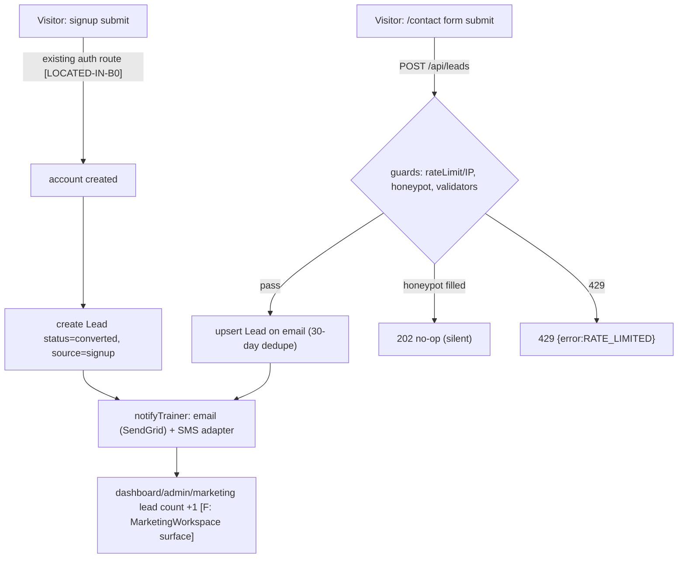
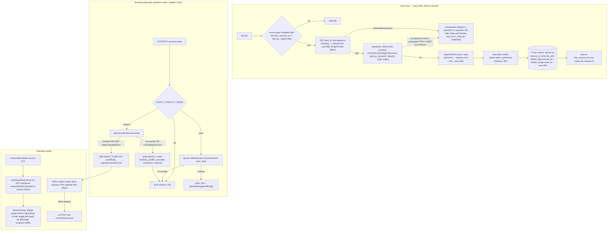
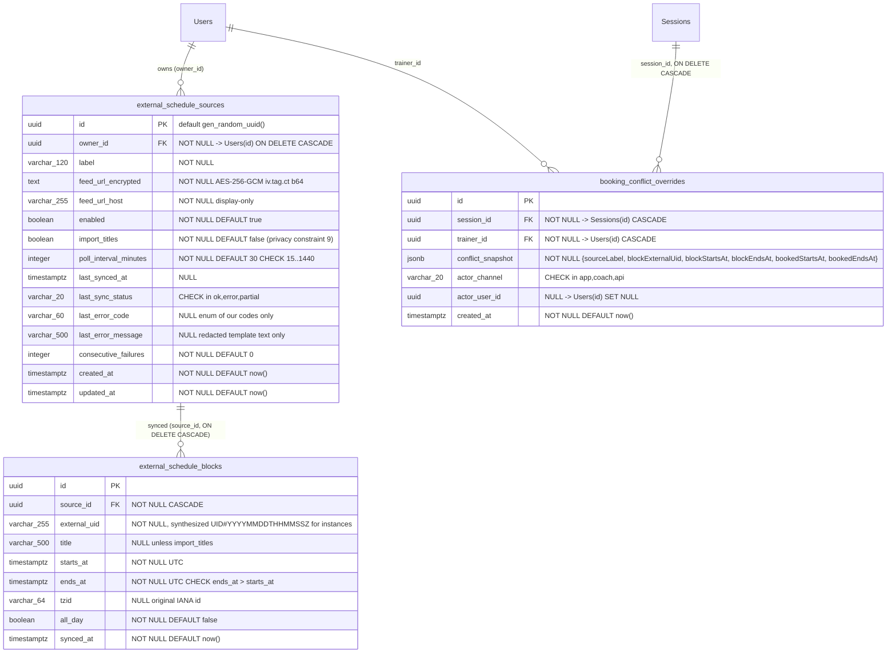
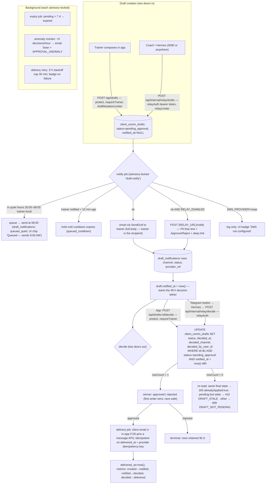
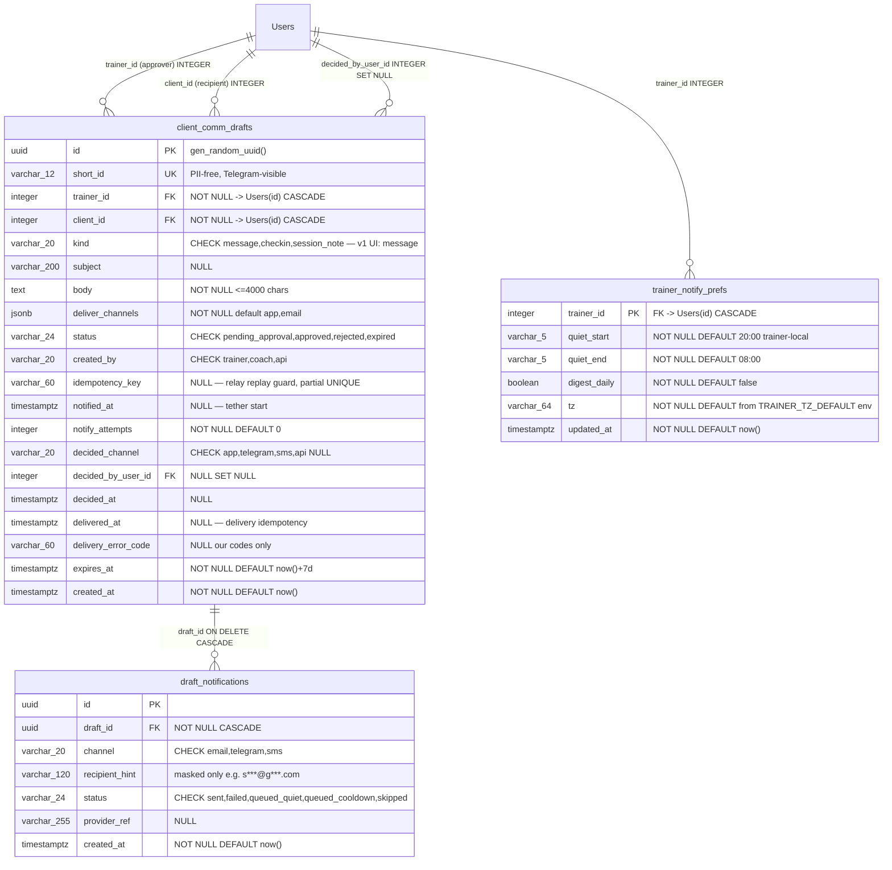
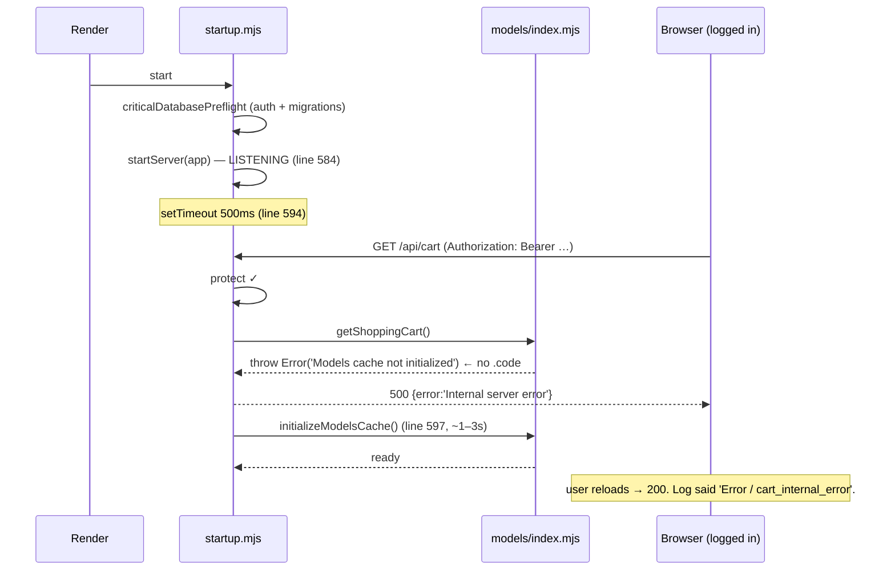
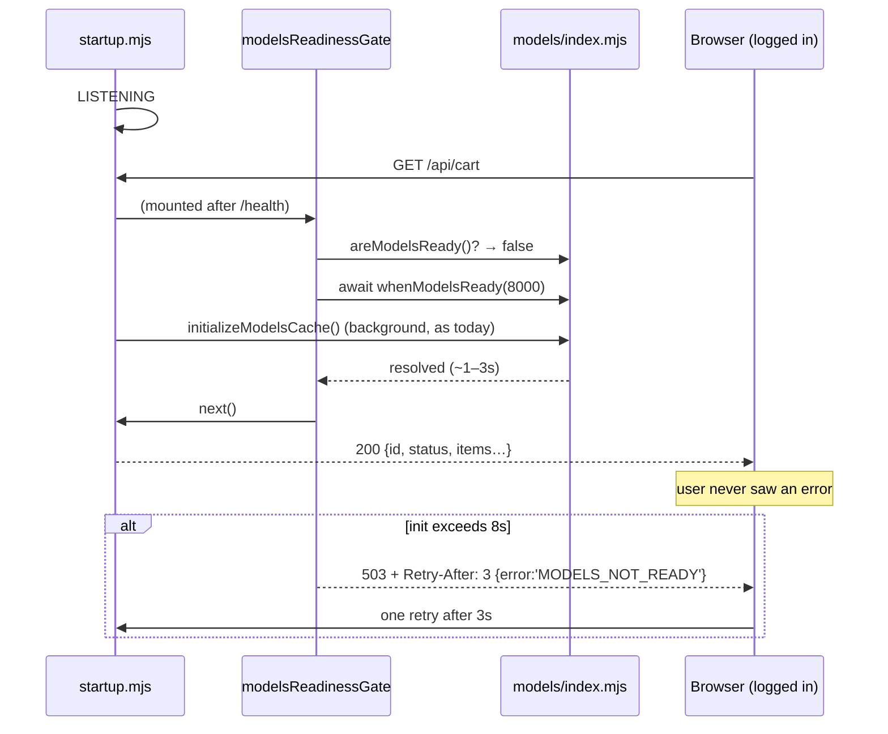
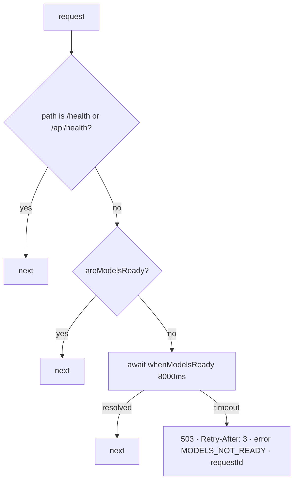

# GLM Consult

**Requested:** `glm-5.3`
**Served:** `glm-5.3`
**Document:** (path redacted; packet digest is recorded by consult-panel.mjs)
**Tokens:** 4031 in / 34000 out (reasoning: 21115) | total 38031
**Wall:** 1053.7s

---

> ⚠ **INCOMPLETE** — the model hit max_tokens (34000).

# GLM-5.3 — ARCHITECT DELIVERABLE, SWANSTUDIOS MONEY LANE

**Grounding legend:** `[F#]` = verified fact from §2. `[NEW]` = file/endpoint/table that does not exist yet; every such path is created by a slice. `[ASSUMPTION]` = not verified tonight; each is paired with the audit slice that confirms or corrects it, and the blueprint is written so a one-line correction fills it in. `[LOCATED-IN-C0/D0/B0]` = the artifact exists but its path is unverified; the audit slice pins it before any code depends on it. This is the mechanism §3 demands: unknowns stay fill-in-able, never assumed-away.

---

# DELIVERABLE 1 — REVIEW OF FABLE'S NINE FINDINGS

| # | Verdict | One line |
|---|---|---|
| H1 | **AGREE** (under-specified) | Revenue-first is right; Fable never names the second-fastest money item (lead capture) or a money canary. |
| H2 | **AGREE** (under-specified) | Also unproven: checkout → webhook → fulfillment. Schema-green ≠ money-green. |
| H3 | **AGREE, all five** (incomplete) | Four more defects exist: sync churn, unbounded expansion/self-DOS, multi-trainer scoping, unmapped-TZID policy. |
| H4 | **AGREE** (under-specified) | Idempotency right; Fable designed no notify rail, no relay-token misuse model, no PII-free Telegram text. |
| H5 | **AGREE** | Plus: Coach is only auto-protected if it writes through the standard session path — must be verified, not assumed. |
| H6 | **AGREE** | Out of the SwanStudios money lane; consequence stated plainly below; deliberately not designed here. |
| H7 | **AGREE** | Plus: miniswan is *unused* by C/D; policy is sleep-not-shutdown because WoL-from-S5 is unproven [F16]. |
| H8 | **AGREE** (under-specified) | Add ETag/Last-Modified, backoff, circuit-breaker, jitter, identifying UA. |
| H9 | **AGREE** (under-specified) | The audit must also pin: Users.id type, trainer role values, frontend test runner, and Coach's write path. |

## H1 — AGREE, with two extensions

Fable is right that U1 is the only item that can be a **100% conversion leak for logged-in clients** — nothing else in the packet can be silently destroying every purchase today. F3 proves only the 401 guard [F3]; the memory records an authenticated 500 with **zero observability**, and nobody has reproduced it. That combination (total-leak potential × no diagnostics × never reproduced) justifies blocker rank.

**What Fable missed:**

1. **"Sequence revenue-first" is stated but never instantiated.** Fable names no second money item. The fastest *new*-money item in the packet is not C or D — it is B's lead-capture gap: the contact form exists, the `Lead` model exists, and the wire between them does not. That is hours of work recovering leads that are being discarded daily. My build order (Deliverable 2) puts it second.
2. **No money canary.** Even after U1 is fixed, nothing detects the *next* authenticated 500. A daily authenticated cart-lifecycle probe is cheap and converts U1 from an incident into a non-event.

## H2 — AGREE, with one extension

F1/F2 prove referential integrity of the schema; they say nothing about the runtime path. **Also unproven: the webhook → order/fulfillment chain.** A purchase that pays but never fulfills is worse than a 500 — it produces chargebacks. The acceptance test for A must therefore be *staged*: (1) authenticated cart lifecycle green, (2) processor identified `[LOCATED-IN-A0]`, (3) sandbox purchase end-to-end if the processor's test mode exists `[ASSUMPTION]`.

## H3 — AGREE on all five; four defects Fable missed

(a)–(e) all stand. Specifics I ratify and harden:

- **(a) RRULE** — correct, and I add the fail-safe semantics Fable left open: when the parser meets an unsupported RRULE token (BYSETPOS, BYWEEKNO, BYYEARDAY, BYMONTHDAY, BYMONTH), it must **not** silently import only the first occurrence (the exact empty-calendar defect) nor silently skip. It must abort the sync for that source, **keep the previous block set intact**, and set `last_error_code='RRULE_UNSUPPORTED'` surfaced in the UI. v1 supports `FREQ=DAILY|WEEKLY`, `INTERVAL`, `BYDAY` (weekly), `COUNT`, `UNTIL` — which covers MindBody shift patterns [F11]. Expansion is implemented on luxon, **not rrule.js**, because rrule.js does UTC-arithmetic on recurrences that RFC 5545 defines in local wall-time — it is wrong across DST by construction, which would re-introduce defect (b) while fixing (a).
- **(b) Timezone** — correct. Decision made below: expand in the event's `TZID` (VTIMEZONE mapped to IANA), store UTC `timestamptz`, retain the original `tzid` column so future re-syncs can rebase. Floating times (no TZID) interpret in the trainer's timezone. Unmappable TZID = source error `UNMAPPED_TZID`, fail-safe keep previous.
- **(c) Server-side check** — correct, and the check keys on `trainerId` [F9], not `userId`: the session's *client* is `userId`; the person double-booked is the trainer. The check runs inside the same request as the write, at every write path: session create, session update/reschedule, and `BulkSessionCreator` if it writes directly `[LOCATED-IN-C0]`. "Warn, not block" is preserved as a **soft gate**: first submission without acknowledgment returns `409 GHOST_CONFLICT`; re-submission with `overrideGhost:true` proceeds and writes the audit row. Any API caller can proceed; nobody can proceed *unwittingly*.
- **(d) Audit trail** — correct; implemented as `booking_conflict_overrides` with a **JSONB snapshot** (deliberately *not* FK'd to the block — blocks are volatile derived data deleted on every re-sync; an FK would cascade-delete audit history or fail).
- **(e) Feed URL as capability secret** — correct; AES-256-GCM at rest, `feedUrlHost` + boolean returned to the UI, never the URL; `last_error_message` is redacted **by construction** (only our own error codes + whitelisted message templates are ever written, never raw parser/HTTP error text, which can embed the URL).

**Missed defects:**

- **(f) Sync churn.** Delete-and-reinsert per sync causes calendar flicker and ID churn that breaks the override audit linkage. Guard: upsert on `(source_id, external_uid)`, delete only rows whose `synced_at` predates this sync's start, in one transaction per source.
- **(g) Unbounded expansion / self-DOS.** A feed with `FREQ=DAILY;COUNT=1000000` or a 50 MB body can wedge the dyno. Guards: 2 MB body cap, 15 s timeout, 5,000-occurrence cap per source per sync (abort + fail-safe on exceed).
- **(h) Multi-trainer scoping.** Fable's schema has `owner` but never states that *every* query — sync due-check, blocks read, conflict check — filters by owner/trainer. Sean's B2B2C framing makes this load-bearing: one trainer's gym feed must never appear on another trainer's calendar. All three queries are owner-scoped by specification below.
- **(i) Duplicate-job risk on Render.** If the service ever scales past one instance, two sync loops double-poll and race. Guard: `pg_try_advisory_lock(hashtext('ghost-sync'))` around each sync pass.

## H4 — AGREE, with three extensions

One approval record, idempotent, Hermes-as-relay: all correct. The mechanism is simpler and stronger than Fable states: **idempotency on the draft's own state machine** — `UPDATE ... WHERE id=$1 AND status='pending_approval'`. First writer wins; the second caller (app or Telegram, in any order, any race) gets the *same final state* back with `alreadyApplied:true`. No separate key table, no double-send, no lock choreography.

**What Fable missed:**

1. **The notify rail is undesigned.** "Text and email" — email rides existing SendGrid infrastructure (SPF includes sendgrid.net [F12]) `[ASSUMPTION: key/sender env names — D0]`. **No SMS provider exists anywhere in the packet.** Blueprint ships an adapter interface with a no-op SMS adapter that logs, plus a UI-visible "SMS not configured" badge — so the rail is honest, and the only Sean-decision is approving the spend (Open Question 1).
2. **The relay token is itself a send capability.** If Hermes is compromised, an attacker can approve pending drafts → send to Sean's clients. Guards: token scoped to exactly two internal endpoints (create-draft, decide), decisions only valid on drafts in `pending_approval` **and** `notified_at` within 48 h (an approval must be tethered to a real outbound notification — stale-draft replay dies), 30/hour rate limit, full audit with channel, anomaly alert at >5 decisions/hour, rotation runbook.
3. **Telegram text must be PII-free** (Constraint 5 applies to *every* external channel in the doctrine, and Telegram is external). Spec: `Draft {shortId} · {kind} · client #{clientId} — approve?` with Approve/Reject buttons and a View deep-link. Message body never leaves SwanStudios except to the final recipient.

## H5 — AGREE

`schedule_session` is recorded broken (U2) and must not be load-bearing for anything until fixed. Extension: C's conflict check lives server-side in the write path, so Coach inherits protection **only if** Coach books through the standard session API rather than direct DB writes — this is a C0 audit item, not an assumption.

## H6 — AGREE; explicitly deferred

The 5090↔miniswan vault transport is real work with real failure modes and is **not in the SwanStudios money lane**. Consequence stated plainly as the packet requires: **miniswan has no memory when the 5090 is off; nothing in C or D depends on either machine.** This blueprint neither designs nor blocks on H6. D's relay contract is written so Hermes can run anywhere (including its current 5090 host) — the only requirement is outbound HTTPS.

## H7 — AGREE

With MindBody consumed via subscribable iCal [F11], nothing in A/B/C/D needs a GPU awake. miniswan receives **zero changes** from this blueprint. Policy recorded for whoever eventually uses it: sleep-not-shutdown (WoL-from-S5 unproven [F16]); if a wake schedule is ever needed, Task Scheduler "wake to run" is the pattern — not needed now.

## H8 — AGREE, hardened

Subscribable link polled at calendar-client cadence is the vendor's intended use. Additions: per-source interval 15–1440 min (default 30) **plus 0–5 min jitter** to avoid thundering syncs; honor `ETag`/`Last-Modified` with `If-None-Match`/`If-Modified-Since` when the origin provides them; exponential backoff on failure (2ⁿ, cap 60 min, via `consecutive_failures`); circuit-break surfaced in UI after 3 consecutive failures with an email alert to the trainer; `User-Agent: SwanStudios-GhostSync/1.0 (+https://sswanstudios.com)`. Also the setup gotcha from F11 the plan must carry into UI copy: **the link cannot be generated from a MindBody owner account** — instructions tell the trainer to generate it from a staff login, per location.

## H9 — AGREE, scope extended

The audit is read-only, additive-only-integration, and must pin exactly: (1) the session **create/update** route files and the write path inside `BulkSessionCreator` `[LOCATED-IN-C0]`; (2) the exact API UMS calls to read the calendar (so the ghost fetch parallels it); (3) blocked-time flow end-to-end [F6]; (4) how UMS formats `sessionDate` for display (UTC per F9 — where local conversion happens); (5) `schedule_session` live semantics (U2); plus three Fable omitted: **(6) `Users.id` data type** (every FK below depends on it), **(7) the trainer-role values** the auth guard checks, **(8) the frontend test runner** (component prove-commands depend on it). Output is a committed doc with file:line anchors; no refactors.

---

## Absence-first gap analysis — what the entire plan is missing, ranked by money left on the table

1. **No end-to-end money canary.** Nothing in A–D would detect the *next* checkout break. A daily authenticated probe of the purchase path (and, once the processor is identified `[LOCATED-IN-A0]`, a sandbox purchase) converts U1-class failures from week-long bleeds into alerts. *Highest value per line of code in this packet.*
2. **No error observability baseline on money paths.** U1's handler logs nothing — and it is probably not the only one. Structured `{route, userId, status, message, stack}` logging with a PII allowlist on `/api/cart*`, `/api/sessions*`, `/api/leads*` is a precondition for *every* fix in this plan. Fable's H1 implies it; nobody schedules it.
3. **B's lead-capture gap is unsequenced.** Fable demands revenue-first ordering and then never schedules the cheapest new-revenue item (contact form + signup → `Lead` + instant notification to Sean). Every day unwired = leads discarded.
4. **No webhook idempotency / reconciliation story.** Dropped webhooks create paid-but-unfulfilled orders — refunds, chargebacks, and the worst possible word-of-mouth for a trainer going independent. `[LOCATED-IN-A0]` identifies the processor; reconciliation is then a bounded job.
5. **No rollback runbooks or pre-migration backups.** Constraint 7 demands reversibility; the plan never says *when* the reverse runs (answer: `pg_dump` before every production migrate; undo-script proven locally first — baked into every slice below).
6. **No multi-instance job guard.** Render scaling horizontally would double-run the sync loop, the draft-expiry loop, and the canary. `pg_try_advisory_lock` guards all three.
7. **No notification-trust guards for D.** Unbatched per-draft text+email while Sean is on the gym floor trains him to ignore approvals — which silently kills the whole rail. Cooldown (10 min resend), quiet hours (default 08:00–20:00 trainer-local, queued not dropped), and a daily digest option are guards, not niceties.
8. **Privacy implementation is a bullet point, not a mechanism.** Constraint 9 needs: title discard by default, `import_titles` explicit per-source opt-in, retention purge of blocks outside the window (data minimization *is* the retention policy), and the B2B2C default locked to times-only. Specified below, tested below.
9. **No success metrics.** "Make this shit crack" is unverifiable without four numbers: completed purchases/week, leads captured/week (and lead→trial rate), double-book incidents (target: 0 — sourced from `booking_conflict_overrides`), approval median latency (created→sent). All computable from tables in this blueprint; no analytics vendor.
10. **No iCal fixture corpus.** The RRULE fixture alone doesn't cover hostile inputs: `EXDATE` in a different TZID than `DTSTART`, `STATUS:CANCELLED`, `RDATE`, folded lines (RFC 5545 line folding), all-day events, unmapped `TZID`, oversized bodies. Full corpus specified in C's test matrix.
11. **No staging parity procedure.** Every migration below proves forward+reverse on a local PostgreSQL 16 with the production schema snapshot before production. Stated as a gate, not advice.

---

# DELIVERABLE 2 — BUILD ORDER (REVENUE-FIRST)

| Order | Item | Why here | Revenue effect | Ship gate |
|---|---|---|---|---|
| 1 | **A0–A2: U1 repro → observability → fix → canary** | Only item that can be blocking *all* logged-in purchases; smallest scope; unblocks truth about the money path | Stops a 100% leak | Canary green 3 days running |
| 2 | **B0–B3: lead capture (contact + signup → `Lead` + notify Sean)** | Fastest *new* money in the packet; every day delayed = leads discarded; no schema risk | Creates pipeline | Lead row + notification verified end-to-end |
| 3 | **C0–C8: Ghost Schedule** | Protects existing paying clients (a double-book during his transition is a refund + reputation event at the worst possible time) and unlocks Sean taking more clients confidently; fully self-contained in SwanStudios — no new credentials, no cross-boundary work | Prevents loss; enables capacity | 24 h in `warn` mode, then `enforce`; DST fixture green |
| 4 | **D0–D7: Approval bridge** | Time leverage + retention (timely client comms = renewal LTV); requires SMS decision + Hermes relay = most moving parts, so it earns the fourth slot despite high value | Multiplies capacity/retention | App-approval door live before Telegram door |
| 5 | **B-rest: drip scheduler, email list, AI panels** | Real, but new-money-*later*; AI panels depend on H6 transport which is explicitly undesigned | Compounding, not immediate | After money lane |

**Where I overrule Fable's implicit ordering, and why:** Fable's H1 says "revenue-first" and stops at A. Inserting B-lead at #2 is the correction — fixing the checkout defends existing conversion; lead capture *adds* revenue the same week. C before D because C is single-system, zero external credentials, and protects revenue Sean already depends on, while D's Telegram door requires a relay deployment on a second machine plus a Sean spend decision. If Sean's daily felt pain says otherwise, he can swap 3 and 4 — both blueprints are independent by construction.

---

# DELIVERABLE 3 — BLUEPRINT A: PURCHASE PATH (U1)

**Scope:** reproduce U1 with a real authenticated session; instrument before fixing; fix per a pre-written diagnosis table; install a daily canary. No new tables, no new UI. (Flowchart: yes. ERD: none — no new tables, by design. Wireframes: none — no UI change.)

## A.1 Runtime flow

```mermaid
flowchart TD
  subgraph A0["A0 — Reproduce (prod, test account)"]
    R1["backend/scripts/repro-cart500.mjs [NEW]"] -->|"login (env creds)"| R2["GET /api/cart (authenticated)"]
    R2 --> R3{"status?"}
    R3 -->|"200"| R4["repeat: POST /api/cart/add, PUT, DELETE"]
    R3 -->|"500"| R5["capture stack via NEW error middleware"]
  end
  subgraph A1["A1 — Observability then fix"]
    O1["errorHandler on cart router [F4 file]"] --> O2["log {route, userId, status, message, stack} — PII allowlist"]
    O2 --> F1a{"diagnosis table §A.4"}
    F1a -->|"D-1 assoc/type"| X1["align Cart user FK to Users.id type"]
    F1a -->|"D-2 missing row"| X2["upsert cart on ensureNumericCartUser"]
    F1a -->|"D-3 serializer"| X3["fix response transform"]
  end
  subgraph A2["A2 — Canary (daily, advisory-locked)"]
    C1["login as canary account"] --> C2["GET products, GET /api/cart, add, update, remove"]
    C2 --> C3{"all 2xx?"}
    C3 -->|"no"| C4["email Sean + log MONEY_CANARY_RED"]
    C3 -->|"yes"| C5["record pass row"]
  end
```



## A.2 API surface touched

No new endpoints. Existing verified surface [F3, F4]: `GET /api/cart`, `POST /api/cart/add`, `PUT /api/cart/update/:itemId`, `DELETE /api/cart/remove/:itemId`, `POST /api/checkout`, `POST /api/webhook`. Guard chain on `/add` is `protect, cartMutationLimiter, ensureNumericCartUser, validatePurchaseRole` [F4].

**New error response shape (uniform, added by middleware):**
```json
// 500 from any /api/cart* route — body unchanged for the client, PLUS server log line:
{ "error": "CART_INTERNAL", "requestId": "req_01H…" }
// log: {"route":"POST /api/cart/add","userId":"<uuid>","status":500,
//       "message":"<err.message>","stack":"<err.stack>","requestId":"req_01H…"}
```
`requestId` is echoed, so a Sean screenshot maps to a log line. Message/stack never logged for 4xx; `message` is allowlisted to `err.message` only (no request body — bodies can hold PII).

## A.3 Migration

**None.** If diagnosis D-1 (below) requires a type alignment, the migration is written as C1-style reversible SQL (pattern provided in C.6) with the same pre-dump gate — but it does not exist until A0 produces the stack. This is the §3-compliant design: the unknown (U1) is resolved by execution, and the remediation for each branch is pre-specified so A1 involves zero new decisions.

## A.4 Diagnosis table (pre-written remediations)

| ID | Probable root cause | Evidence signature in stack | Exact remediation |
|---|---|---|---|
| D-1 | Cart user association type mismatch (the `ensureNumericCartUser` name [F4] suggests cart rows were built for a numeric user id; Users canonicalization [F1/F2] may have left the cart table behind) | Sequelize `ECONN`-style cast error (`invalid input syntax for type uuid` / `integer out of range`) on a `WHERE "userId" = …` against cart table | Reversible migration altering the cart table's user FK column to match `Users.id` type (pattern: C.6 SQL, FK target quoted `"Users"`), with pre-migration `pg_dump` of that table |
| D-2 | Authenticated user has no cart row; handler assumes one | `Cannot read properties of null (reading …)` | Upsert inside `ensureNumericCartUser` (find-or-create cart for user before continue) |
| D-3 | Response serializer chokes on populated cart (null package, missing include) | TypeError inside a `toJSON`/transform function | Fix transform to null-guard; unit test with fully-populated and minimal cart fixtures |

If the stack matches none, the diagnosis table gains a row *from the stack itself* — the table is the decision record, not a limit.

## A.5 Slices

**A0 — Reproduce + instrument (ships first, alone).**
Files: `backend/scripts/repro-cart500.mjs` `[NEW]` (~120 lines); modify `backend/routes/cartRoutes.mjs` [F4 path] to attach the error middleware (~25 lines added).
Acceptance: running the repro on production with `CART_TEST_EMAIL`/`CART_TEST_PASSWORD` env yields 200s for the full lifecycle, or a captured stack in logs with a `requestId`.
Prove: `node backend/scripts/repro-cart500.mjs --host https://sswanstudios.com` then `node backend/scripts/repro-cart500.mjs --host https://sswanstudios.com --role client` (runs both an admin-role and client-role account; D-3-class bugs are role-dependent).

**A1 — Fix per diagnosis table.**
Files: per remediation row above.
Acceptance: A0 repro green for **both roles**, twice consecutively (fresh logins — per U1's own note that a stale session masks it).
Prove: same command as A0, exit code 0.

**A2 — Money canary.**
Files: `backend/core/jobs/moneyCanaryJob.mjs` `[NEW]`; row sink `backend/scripts/money-canary-report.mjs` `[NEW]`.
Acceptance: daily advisory-locked run; any non-2xx on the lifecycle emails Sean via the SendGrid adapter from D.2 (if D.2 not yet shipped, logs `MONEY_CANARY_RED` loudly — belt and suspenders).
Prove: `node backend/core/jobs/moneyCanaryJob.mjs --once` locally against staging creds; grep log for `MONEY_CANARY_GREEN`.

## A.6 Test matrix

| File `[NEW]` | Asserts | Fixture |
|---|---|---|
| `backend/scripts/repro-cart500.mjs` (self-check mode `--selftest`) | Script's own HTTP+assert helpers work against a mock server | Inline mock (30 lines) |
| `backend/core/jobs/moneyCanaryJob.test.mjs` | Canary marks red on first non-2xx; green on all-2xx; advisory lock prevents double-run | Mock fetch returning 500 for `GET /api/cart` |
| `backend/middleware/__tests__/errorHandler.test.mjs` | 500 → log line contains route/userId/status/stack; 4xx → no stack logged; body carries `requestId` | Throwing handler stub |

## A.7 Failure modes & guards

1. **Fix is role- or product-specific** (green for admin, red for client role, or green for package A only) → guard: repro matrix runs both roles × two products; canary rotates product choice daily.
2. **Observability leaks PII into logs** → guard: serializer allowlist (route, userId, status, message, stack, requestId only); test asserts request bodies never appear.
3. **D-1 migration touches live cart rows** → guards: pre-dump `pg_dump --table <cart>`; bounded batch updates (5,000/tx); forward+reverse proven locally first; deploy in a low-traffic window per runbook `docs/runbooks/money-path.md` `[NEW]`.
4. **Canary account pollutes real data** → guard: canary uses a dedicated flagged account; canary cart cleared at end of run; canary never calls `/checkout` until a processor sandbox is confirmed `[LOCATED-IN-A0]`.

---

# DELIVERABLE 3 — BLUEPRINT B (LEAD-CAPTURE SLICE): STOP DISCARDING LEADS

**Scope:** the two money-touching gaps only — public touchpoints create `Lead` rows + Sean is notified instantly. Drip scheduler, social, AI panels, email list = B-rest, later, per build order. ERD: none (`Lead` model exists per audit doc; B0 confirms columns; if `source`/`status` columns are missing, B1 adds them via the reversible pattern in C.6). Wireframes: none — no new UI; existing contact form and signup flow are rewired, existing admin CRM surfaces the rows.

## B.1 Runtime flow



## B.2 API contract

`POST /api/leads` — public. Guard chain: `leadLimiter` `[NEW]` (10/IP/hour) → validators.
Request: `{ name: string(1..120), email: string(email), phone?: string(7..20), message?: string(0..2000), source: 'contact_form', hp: string (honeypot, normally empty) }`
Responses:
- `202 {"ok":true}` — accepted (also returned for honeypot hits, silently discarded server-side)
- `400 {"error":"VALIDATION","fields":["email"]}` · `429 {"error":"RATE_LIMITED"}`
Notify email to trainer (Sean's account email): subject `New lead — {name} ({source})`, body: name, email, phone, message, link to the marketing workspace lead view.

## B.3 Slices

**B0 — Audit.** Locate: contact form component + its current submit handler; signup route; `Lead` model columns; whether a `source` column exists. Doc: `docs/audit/LEAD-CAPTURE-B0.md` `[NEW]`. Prove: the grep/psql commands' outputs committed in the doc.
**B1 — `POST /api/leads` + notify.** Files: `backend/routes/leadRoutes.mjs` `[NEW]` mounted in `backend/core/routes.mjs` [F4 mount file], `backend/core/services/leadService.mjs` `[NEW]`, tests. Prove: `bash backend/scripts/smoke-leads.sh` (curl → 202 → psql count → email received).
**B2 — Signup conversion + source attribution.** Modify signup handler `[LOCATED-IN-B0]` to create the converted Lead. Prove: signup via curl → Lead row `status='converted'`.
**B3 — Coverage + abuse tests.** Prove: `node --test backend/core/services/leadService.test.mjs`.

## B.4 Test matrix & failure modes

Tests: honeypot hit discards; dedupe upserts (same email within 30 d increments `touchCount` `[ASSUMPTION column — B0; if absent, B1 adds via reversible migration]`); rate limit trips at 11th request. **Failure modes:** (1) bot flood → honeypot + IP limiter + 2,000-char cap; (2) notification email lands in spam → SPF/SendGrid alignment exists [F12], bounce logging in adapter, fallback in-app badge; (3) only one of several public forms wired → B0 inventory grep is the gate, coverage test asserts every `source` enum value has a wired touchpoint.

---

# DELIVERABLE 3 — BLUEPRINT C: GHOST SCHEDULE (FULL)

## C.0 Design ratification and decisions (all made here; none left to the builder)

1. **Separate tables, not `Session.isBlocked` rows** — Fable is right and I ratify with the stronger arguments: (i) ghost rows are derived data re-synced wholesale — a delete cursor over `Session` is one parser bug from deleting a paying client's booking; (ii) `Session.status` carries a validator (`SESSION_STATUSES` [F9]) — polluting a shared enum for a non-session concept couples every future status migration to gym shifts; (iii) sync churn (H3-f) would hammer the Sessions table hourly.
2. **UTC `timestamptz` storage**, original `tzid` retained per block; expansion in the event's TZID via luxon; floating times = trainer-local `[ASSUMPTION: trainer timezone column/source — C0; if Users has no tz column, default env GHOST_TZ_DEFAULT=America/Los_Angeles pending Sean's answer in Open Questions]`.
3. **Conflict = soft gate:** `409 GHOST_CONFLICT` without `overrideGhost:true`; with the flag, proceed + audit row. Kill-switch env `GHOST_CONFLICT_MODE=off|warn|enforce` (rollout: 24 h in `warn`, then `enforce`).
4. **Overlap semantics:** `block.starts_at < req.end AND block.ends_at > req.start` — touching endpoints (block ends 10:00, booking starts 10:00) is **not** a conflict. Tested.
5. **Privacy defaults:** titles discarded unless per-source `import_titles=true`; UI renders "Busy" for untitled blocks; retention purge deletes blocks with `ends_at < now() - 30 days` on every sync (minimization by construction).
6. **Synthesized UIDs for recurrence instances:** `${UID}#<RECURRENCE-START-UTC-compact>` — stable across syncs, so upserts don't churn.
7. **Job loop:** in-process `setInterval(60s)` due-check (Render single web process) + `pg_try_advisory_lock` guard. No new scheduler dependency — that's B-rest's problem, solved once, properly.
8. **Toggle:** per-device `localStorage['ss.ghost.visible']` (default `true`). No schema, no API — v1 product decision made; noted as revisitable when multi-trainer viewer roles exist.

## C.1 Mermaid — runtime flow



## C.2 Mermaid — ERD


Unique constraints: `external_schedule_sources(owner_id, label)`; `external_schedule_blocks(source_id, external_uid)`. Indexes: `ghost_sources_owner_idx(owner_id)`; `ghost_blocks_source_start_idx(source_id, starts_at)`; `ghost_blocks_source_end_idx(source_id, ends_at)`; `ghost_blocks_purge_idx(ends_at)`; `booking_overrides_session_idx(session_id)`.

## C.3 Wireframes

**Desktop ≥1024 — Universal Master Schedule week view with ghost overlay (all states shown):**

```
┌──────────────────────────────────────────────────────────────────────────────────┐
│ SWAN STUDIOS — MASTER SCHEDULE            [Day][Week][Month]   ( Gym hours ●ON ) │ ← toggle pill: 44px H,
│ ┌─────────┬─────────┬─────────┬─────────┬─────────┬─────────┬─────────┐  label   │   purple bg ON w/ cyan
│ │  MON    │  TUE    │  WED 26 │  THU    │  FRI    │  SAT    │  SUN    │  glow; Obsidian bg OFF
│ │         │         │         │         │         │         │         │          │
│ │ ▒▒▒▒▒▒▒ │  ┌────┐ │ ▒▒▒▒▒▒▒ │         │ ▒▒▒▒▒▒▒ │         │         │ ▒ block  │
│ │ ▒Busy▒▒ │  │Sess│ │ ▒Busy▒▒ │  ┌────┐ │ ▒6a-9a▒ │         │         │  = hatched Wing Purple
│ │ ▒6a-2p▒ │  │ion │ │ ▒6a-2p▒ │  │Book│ │ ▒(gym)▒ │  ┌────┐ │         │  @0.18 alpha on Midnight
│ │ ▒(gym)▒ │  └────┘ │ ▒(gym)▒ │  │ing │ │ ▒▒▒▒▒▒▒ │  │Sess│ │         │  Sapphire, 3px Gilded
│ │ ▒▒▒▒▒▒▒ │         │ ▒▒▒▒▒▒▒ │  └────┘ │         │  │ion │ │         │  Fern left border,
│ │  ┌────┐ │  ┌────┐ │         │         │  ┌────┐ │  └────┘ │         │  text Frost White
│ │  │Sess│ │  │Sess│ │  ┌────┐ │         │  │Sess│ │         │         │  ~11px
│ │  │ion │ │  │ion │ │  │Sess│ │         │  │ion │ │         │         │
│ │  └────┘ │  └────┘ │  └────┘ │         │  └────┘ │         │         │         │
│ └─────────┴─────────┴─────────┴─────────┴─────────┴─────────┴─────────┘         │
│ Legend: ▪ Session  ▒ Busy (external) — click ▒ for source label only             │
└──────────────────────────────────────────────────────────────────────────────────┘
 States: LOADING → 8 skeleton rows shimmering (Ice Wing @0.15 alpha)
         EMPTY (toggle ON, no sources) → centered card:
           "No external schedule connected" / "Link your gym's schedule so you
            can't double-book." / [ + Add gym schedule ] (48px, purple bg, cyan glow)
           subtext: "Ask your gym for the subscribable schedule link (staff login,
            not owner). MindBody: Schedule → Generate a schedule link."   [F11]
         ERROR (fetch fail) → inline banner under toolbar:
           "Couldn't load gym hours — retrying" [Retry] (44px) — sessions still render
```

**Conflict modal (desktop & mobile identical content; 375px shown):**

```
┌─────────────────────────────────────┐
│ ⚠  Overlaps gym commitment          │ ← Frost White on Midnight Sapphire
│                                     │
│ Your booking 2:00p–3:00p Wed        │
│ overlaps:                           │
│                                     │
│ ▒ Busy 1:30p–4:00p Wed              │ ← hatched swatch + times; no
│   (source: Life Time — gym)         │   employer client names ever shown
│                                     │
│ You can still book this slot.       │
│                                     │
│ ┌───────────────┐ ┌───────────────┐ │
│ │  Book anyway  │ │ Pick another  │ │ ← both min-height 44px;
│ └───────────────┘ │    time       │ │ Book anyway: purple bg #8B5CF6,
│                   └───────────────┘ │ cyan glow; Pick: blue bg #002060,
│                                     │ purple glow (Dual-Button Glow)
└─────────────────────────────────────┘
 States: SUBMITTING → Book anyway disabled, spinner in button
         SUCCESS → modal closes, toast "Booked — overlap recorded"
         ERROR   → "Couldn't book — try again" + [Retry] (44px)
```

**Mobile 375 — week view:**

```
┌───────────────────────────┐
│ ‹  Oct 26 – Nov 1  ›      │
│ ( Gym hours ●ON )  ⚙      │ ← 44px pill; ⚙ = 44px → source manager
│ ┌───────────────────────┐ │
│ │ MON 26                │ │
│ │ ▒▒▒▒▒▒▒▒▒▒▒ 6a–2p     │ │ ← 44px row height (touchable → detail)
│ │ ▪ Session 3p          │ │
│ ├───────────────────────┤ │
│ │ TUE 27                │ │
│ │ ▪ Session 9a          │ │
│ └───────────────────────┘ │
└───────────────────────────┘
```

**Source manager (modal from ⚙ — every state):**

```
┌──────────────────────────────────────────────────────┐
│ External schedules                         [ ✕ ] 44px│
│ ────────────────────────────────────────────────────│
│ LOADING: 3 skeleton rows                              │
│ EMPTY:   "No external schedule connected"             │
│          [ + Add gym schedule ] 48px                  │
│ LIST:                                                  │
│ ┌────────────────────────────────────────────────┐   │
│ │ Life Time — gym        status: ● Synced 4m ago │   │
│ │ mindbodyonline.com      112 blocks   [Sync now]│   │ ← 44px
│ │ (●ON switch 44px)      [Edit] [Delete]         │   │ ← 44px each
│ └────────────────────────────────────────────────┘   │
│ ┌────────────────────────────────────────────────┘   │
│ │ Anytime Fit     status: ⚠ RRULE_UNSUPPORTED 3× │   │ ← amber-ish = Gilded
│ │                    "This feed uses a pattern we  │   │   Fern text on
│ │                     don't support yet. Previous  │   │   Obsidian chip
│ │                     blocks kept. [View details]" │   │
│ └────────────────────────────────────────────────┘   │
│ ADD/EDIT FORM:                                        │
│  Label          [______________________] 48px field   │
│  Feed URL       [______________________] 44px   🔒   │
│                 "Stored encrypted. Never shown again  │
│                  — paste it fresh to replace."        │
│  Import titles  ( ) OFF  — default. "Shows 'Busy'."   │
│                 ( ) ON   — "Show event titles from    │
│                            this feed." + privacy note │
│                 "This gym's feed may contain ITS      │
│                  clients' names. Keep OFF unless you  │
│                  have their employer's okay."         │
│  Sync every     [ 30 ▾ ] minutes (15–1440) 44px       │
│  [ Save ] 48px purple/cyan   [ Cancel ] 44px          │
│ DELETE CONFIRM: "Delete 'Life Time — gym' and its     │
│  112 blocks? Sessions you booked over it are kept."   │
│  [ Delete ] 44px Obsidian/Frost  [ Keep ] 44px        │
│ SUCCESS: toast "Connected — first sync running"       │
│ ERROR (add): inline "That link didn't work            │
│  (FETCH_FAILED). Paste the subscribable link, not a   │
│  page URL."                                           │
└──────────────────────────────────────────────────────┘
```
Style spec (`frontend/src/components/Schedule/ghostStyles.ts` `[NEW]`): all tokens as `var(--midnight-sapphire, #002060)` etc. per constraint 2; hatch via `repeating-linear-gradient(45deg, rgba(139,92,246,0.18) 0 8px, transparent 8px 16px)`; text pairings: Frost `#E0ECF4` on Midnight (≈12:1 ✓), Frost on Obsidian (✓), Gilded Fern `#C6A84B` accents on Obsidian (large text/labels only), Ice Wing `#60C0F0` on Midnight for secondary text (✓). Every interactive element ≥44×44px.

## C.4 API contracts

Router: `backend/routes/ghostRoutes.mjs` `[NEW]`, mounted in `backend/core/routes.mjs` [F4 mount file] as `app.use('/api/ghost-sources', ghostRoutes)`. Guards: `protect` [F4] then `requireTrainer` `[NEW middleware — C0 pins role values; fallback spec: role ∈ TRAINER_ROLES constant]`. All responses JSON; all errors shaped `{"error": CODE, ...}`.

**1. `GET /api/ghost-sources`** — `protect, requireTrainer`
→ `200 { "sources": [{ "id": uuid, "label": str, "feedUrlHost": str, "hasFeedUrl": true, "enabled": bool, "importTitles": bool, "pollIntervalMinutes": int, "lastSyncedAt": iso|null, "lastSyncStatus": "ok"|"error"|"partial"|null, "lastErrorCode": str|null, "lastErrorMessage": str|null, "consecutiveFailures": int, "blockCount": int }] }` (owner-scoped to auth user)
→ `401 {"error":"UNAUTHENTICATED"}` · `403 {"error":"FORBIDDEN"}`

**2. `POST /api/ghost-sources`** — `protect, requireTrainer, ghostMutationLimiter` `[NEW: 20/hour/user]`
Body: `{ "label": str(1..120), "feedUrl": str matching ^https?:// or ^webcal:// (webcal→https), "importTitles"?: bool = false, "pollIntervalMinutes"?: int(15..1440) = 30 }`
→ `201` item shape as GET · kicks first sync async
→ `400 {"error":"INVALID_URL"|"INVALID_LABEL"|"INVALID_INTERVAL"}` · `409 {"error":"LABEL_EXISTS"}` · `401/403` as above

**3. `PUT /api/ghost-sources/:id`** — same guards. Body: any subset of `{label?, enabled?, importTitles?, pollIntervalMinutes?, feedUrl?}` (feedUrl replaced = re-encrypt; never returned).
→ `200` item · `404 {"error":"NOT_FOUND"}` · `400/409` as above

**4. `DELETE /api/ghost-sources/:id`** — → `204` · `404`. Cascades blocks (FK). Sessions and overrides survive.

**5. `POST /api/ghost-sources/:id/sync`** — `protect, requireTrainer, ghostSyncLimiter` `[NEW: 1/min/source]`. Runs one inline sync.
→ `200 {"status":"ok","blocksImported":int}` · `200 {"status":"error","errorCode":str}` (with prior blocks kept) · `429 {"error":"RATE_LIMITED"}` · `404`

**6. `GET /api/ghost-sources/blocks?from=ISO&to=ISO`** — `protect, requireTrainer`. Window ≤ 62 d, `to ≥ from`, both required.
→ `200 {"blocks":[{ "id": uuid, "startsAt": iso, "endsAt": iso, "title": str|null, "allDay": bool }]}` (owner-scoped via join to sources)
→ `400 {"error":"WINDOW_TOO_LARGE"|"INVALID_WINDOW"}`

**7. Booking-path integration (existing routes, `[LOCATED-IN-C0]` files).** For session **create** and **update/reschedule** (and bulk creator if it has a separate write `[LOCATED-IN-C0]`):
- No overlap, any mode → `201` normal response (in `warn` mode with overlap: `201` + `"ghostWarning": {"conflicts":[…]}`)
- Overlap in `enforce`, no `overrideGhost:true` in body →
  `409 {"error":"GHOST_CONFLICT","requiresOverride":true,"conflicts":[{"blockId":uuid,"startsAt":iso,"endsAt":iso,"sourceLabel":str}]}`
- `overrideGhost:true` + overlap → `201` + `booking_conflict_overrides` row inserted in the same transaction (`actor_channel:'app'` from web, `'coach'` when the caller is the Coach service `[C0 verifies how Coach authenticates — if indistinguishable, channel 'api']`, `'api'` otherwise; `actor_user_id` = auth user where present).
Coach-facing note: Swan Coach receives the same `409` payload and must surface it — it cannot silently override while U2 stands (H5).

## C.5 Sync engine specification (normative)

- `backend/core/lib/crypto/secretBox.mjs` `[NEW]` — AES-256-GCM, key from `GHOST_FEED_KEY` (32-byte base64 env). API: `encrypt(plain)→"iv.tag.ct" base64`, `decrypt(str)→plain`, `decryptSafe(str)→{ok,value}|{ok:false,code:'DECRYPT_FAILED'}`. On `DECRYPT_FAILED`: source flagged, prior blocks kept, never wiped.
- `backend/core/lib/ical/parseIcal.mjs` `[NEW]` — RFC 5545 subset: line unfolding (CRLF + space/tab continuation), `VTIMEZONE`→TZID extraction, `VEVENT` fields `UID, DTSTART, DTEND, DURATION, RRULE, EXDATE (multi), RDATE (multi), SUMMARY, STATUS:CANCELLED (→ skip = deletion on next sync), TZID params`. Errors return coded results, never throw raw (H3-e): `FETCH_FAILED, PARSE_FAILED, UID_TOO_LONG (>255), RRULE_UNSUPPORTED (includes offending token in code suffix e.g. RRULE_UNSUPPORTED_BYSETPOS), UNMAPPED_TZID, BODY_TOO_LARGE (>2MB), EXPANSION_OVERFLOW (>5000), DECRYPT_FAILED`.
- `backend/core/lib/ical/expandRrule.mjs` `[NEW]` — luxon-based. Supports `FREQ=DAILY|WEEKLY`, `INTERVAL n`, `BYDAY` (weekly context), `COUNT`, `UNTIL`. Iterates **local wall-time** day-by-day across the window `[now-14d, now+60d]`, producing UTC instants — DST-correct by construction. `EXDATE` matches on UTC instant **or** local wall-time equality (producers emit EXDATE in mixed TZIDs). Synthesizes `UID#YYYYMMDDTHHMMSSZ` per instance. All-day events: `allDay=true`, stored as date-bounded instants in feed tz.
- `backend/core/lib/ical/tzMap.mjs` `[NEW]` — TZID→IANA table (common MindBody/Outlook/Google ids); miss → `UNMAPPED_TZID` fail-safe.
- `backend/core/services/ghostSyncService.mjs` `[NEW]` — orchestrates fetch→parse→expand→strip-titles→transactional upsert/delete-stale/purge; updates source status; bounded DML (≤5,000 rows/tx, constraint 7). Consecutive-failure alert: email trainer at 3 via the notifier adapter (D.2 if shipped; else log `GHOST_SOURCE_FAILING`).
- `backend/core/jobs/ghostSyncJob.mjs` `[NEW]` — 60 s due-check; `pg_try_advisory_lock(hashtext('ghost-sync'))`; jitter per source.
- `backend/scripts/ghost-sync-once.mjs` `[NEW]` — CLI: `--source <id>` for Render shell/manual prove.

## C.6 Migration SQL — exact, forward + reverse

File: `backend/migrations/20261007120000-create-ghost-schedule.mjs` `[NEW — dir matches existing migration location; F2 proves migrations exist; C0 pins the exact dir]`. Types below assume `Users.id`/`Sessions.id` are UUID — **C0 gate: if either is INTEGER, change the four FK columns and `conflict_snapshot` accordingly; nothing else in this blueprint moves.** Proving command for C0: `psql $DATABASE_URL -c "SELECT table_name, data_type FROM information_schema.columns WHERE (table_name='Users' OR table_name='Sessions') AND column_name='id';"`

**Forward (PostgreSQL 16 [F1] — `gen_random_uuid()` built-in):**
```sql
CREATE TABLE IF NOT EXISTS external_schedule_sources (
  id UUID PRIMARY KEY DEFAULT gen_random_uuid(),
  owner_id UUID NOT NULL REFERENCES "Users"("id") ON DELETE CASCADE,
  label VARCHAR(120) NOT NULL,
  feed_url_encrypted TEXT NOT NULL,
  feed_url_host VARCHAR(255) NOT NULL,
  enabled BOOLEAN NOT NULL DEFAULT TRUE,
  import_titles BOOLEAN NOT NULL DEFAULT FALSE,
  poll_interval_minutes INTEGER NOT NULL DEFAULT 30
    CHECK (poll_interval_minutes BETWEEN 15 AND 1440),
  last_synced_at TIMESTAMPTZ,
  last_sync_status VARCHAR(20) CHECK (last_sync_status IN ('ok','error','partial')),
  last_error_code VARCHAR(60),
  last_error
# GLM Consult

**Requested:** `glm-5.3`
**Served:** `glm-5.3`
**Document:** (path redacted; packet digest is recorded by consult-panel.mjs)
**Tokens:** 13319 in / 32707 out (reasoning: 19023) | total 46026
**Wall:** 889.7s

---

> ## ⚠ CRITICAL CORRECTION — READ BEFORE ANYTHING BELOW
>
> The completed portion of this document (including the **C.2 ERD**) specified FKs to `Users` as `UUID`. **That is wrong and would fail at migration time.** VERIFIED against the codebase: `backend/models/User.mjs` declares `id` as `DataTypes.INTEGER`, primaryKey, autoIncrement — and `backend/models/Session.mjs` carries the comment *"Updated to INTEGER to match User.id primary key."*
>
> **Therefore, everywhere in this document, every foreign key to `Users` is INTEGER:**
> - Blueprint C: `external_schedule_sources.owner_id`, `booking_conflict_overrides.trainer_id`, `booking_conflict_overrides.actor_user_id` — **INTEGER**
> - Blueprint C: `booking_conflict_overrides.session_id` → **INTEGER** (Session.mjs's own comment records the INTEGER alignment; C0 prove command below confirms, with a one-line substitution if it returns `uuid`)
> - Blueprint D: `client_comm_drafts.trainer_id`, `client_comm_drafts.client_id`, `client_comm_drafts.decided_by_user_id`, `trainer_notify_prefs.trainer_id` — **INTEGER**
>
> The C.2 ERD's `uuid` markers on those columns are **superseded by this banner**. UUIDs remain only as PKs of *our own new tables* (`external_schedule_sources.id`, `external_schedule_blocks.id`, `booking_conflict_overrides.id`, and D's tables) and in API responses for those entities. Side observation that strengthens the plan: **A.4's diagnosis D-1 (cart FK left behind by the Users INTEGER canonicalization) just became materially more likely** — `ensureNumericCartUser` [F4] is a fossil of exactly that migration. A0 exists to prove it; no change to Blueprint A is needed.
>
> Resume from the truncation point: C.6 was cut mid-`CREATE TABLE`. Full corrected C.6 follows.

---

## C.6 — Migration SQL (complete, corrected, forward + reverse)

Files `[NEW]`:
- `backend/migrations/20261007120000-create-ghost-schedule.mjs` — runner-compatible wrapper exporting `up`/`down` (runner + exact dir pinned by C0; the raw `.sql` files below are the source of truth, so proving never depends on the runner)
- `backend/migrations/sql/20261007120000_ghost_forward.sql`
- `backend/migrations/sql/20261007120000_ghost_reverse.sql`

**Forward** (PostgreSQL 16 [F1]; `gen_random_uuid()` built-in; additive DDL only — no existing row is read or mutated, satisfying constraint 7):

```sql
-- 20261007120000 create ghost schedule — FORWARD
-- FK TYPES (correction banner): owner_id / trainer_id / actor_user_id -> Users(id) = INTEGER
--   (VERIFIED: backend/models/User.mjs — id DataTypes.INTEGER PK autoIncrement)
-- session_id -> Sessions(id) = INTEGER (Session.mjs comment records the alignment).
--   C0 PROVE:
--   psql "$DATABASE_URL" -Atc "SELECT data_type FROM information_schema.columns
--     WHERE table_name='Sessions' AND column_name='id';"   -- expected: integer
--   If it returns 'uuid': change the word INTEGER to UUID on
--   booking_conflict_overrides.session_id ONLY. Nothing else in this blueprint moves.

BEGIN;

CREATE TABLE IF NOT EXISTS external_schedule_sources (
  id                    UUID PRIMARY KEY DEFAULT gen_random_uuid(),
  owner_id              INTEGER NOT NULL REFERENCES "Users"("id") ON DELETE CASCADE,
  label                 VARCHAR(120) NOT NULL,
  feed_url_encrypted    TEXT NOT NULL,                 -- AES-256-GCM "iv.tag.ct" base64
  feed_url_host         VARCHAR(255) NOT NULL,         -- display-only; URL never stored in clear
  enabled               BOOLEAN NOT NULL DEFAULT TRUE,
  import_titles         BOOLEAN NOT NULL DEFAULT FALSE, -- privacy constraint 9: times-only default
  poll_interval_minutes INTEGER NOT NULL DEFAULT 30
                        CHECK (poll_interval_minutes BETWEEN 15 AND 1440),
  last_synced_at        TIMESTAMPTZ,
  last_sync_status      VARCHAR(20) CHECK (last_sync_status IN ('ok','error','partial')),
  last_error_code       VARCHAR(60),                   -- OUR enum codes only (see C.5)
  last_error_message    VARCHAR(500),                  -- whitelisted template text only;
                                                        --   raw upstream text can embed the feed URL
  consecutive_failures  INTEGER NOT NULL DEFAULT 0,
  created_at            TIMESTAMPTZ NOT NULL DEFAULT now(),
  updated_at            TIMESTAMPTZ NOT NULL DEFAULT now(),
  CONSTRAINT ghost_sources_owner_label_key UNIQUE (owner_id, label)
);

CREATE TABLE IF NOT EXISTS external_schedule_blocks (
  id           UUID PRIMARY KEY DEFAULT gen_random_uuid(),
  source_id    UUID NOT NULL REFERENCES external_schedule_sources("id") ON DELETE CASCADE,
  external_uid VARCHAR(255) NOT NULL,                  -- instances: "${UID}#YYYYMMDDTHHMMSSZ"
  title        VARCHAR(500),                           -- NULL unless source.import_titles
  starts_at    TIMESTAMPTZ NOT NULL,                   -- UTC
  ends_at      TIMESTAMPTZ NOT NULL CHECK (ends_at > starts_at),
  tzid         VARCHAR(64),                            -- original IANA id, retained for re-sync rebase
  all_day      BOOLEAN NOT NULL DEFAULT FALSE,
  synced_at    TIMESTAMPTZ NOT NULL DEFAULT now(),
  CONSTRAINT ghost_blocks_source_uid_key UNIQUE (source_id, external_uid)
);

CREATE TABLE IF NOT EXISTS booking_conflict_overrides (
  id                UUID PRIMARY KEY DEFAULT gen_random_uuid(),
  session_id        Integer NOT NULL REFERENCES "Sessions"("id") ON DELETE CASCADE,
  trainer_id        Integer NOT NULL REFERENCES "Users"("id") ON DELETE CASCADE,
  conflict_snapshot JSONB NOT NULL,
                    -- {sourceLabel, blockExternalUid, blockStartsAt, blockEndsAt,
                    --  bookedStartsAt, bookedEndsAt} — denormalized ON PURPOSE:
                    -- blocks are volatile derived data; an FK to them would
                    -- cascade-delete audit history on every re-sync
  actor_channel     VARCHAR(20) NOT NULL CHECK (actor_channel IN ('app','coach','api')),
  actor_user_id     Integer REFERENCES "Users"("id") ON DELETE SET NULL,
  created_at        TIMESTAMPTZ NOT NULL DEFAULT now()
);

CREATE INDEX IF NOT EXISTS ghost_sources_owner_idx      ON external_schedule_sources (owner_id);
CREATE INDEX IF NOT EXISTS ghost_blocks_source_start_idx ON external_schedule_blocks (source_id, starts_at);
CREATE INDEX IF NOT EXISTS ghost_blocks_source_end_idx   ON external_schedule_blocks (source_id, ends_at);
CREATE INDEX IF NOT EXISTS ghost_blocks_purge_idx        ON external_schedule_blocks (ends_at);
CREATE INDEX IF NOT EXISTS booking_overrides_session_idx ON booking_conflict_overrides (session_id);
CREATE INDEX IF NOT EXISTS booking_overrides_trainer_idx ON booking_conflict_overrides (trainer_id); -- metrics query (absence-first gap #9)

COMMIT;
```

**Reverse** (run only via the runbook below; drops override audit rows — acceptable pre-traffic; if rows exist, dump first):

```sql
-- 20261007120000 create ghost schedule — REVERSE
BEGIN;
DROP INDEX IF EXISTS booking_overrides_trainer_idx;
DROP INDEX IF EXISTS booking_overrides_session_idx;
DROP INDEX IF EXISTS ghost_blocks_purge_idx;
DROP INDEX IF EXISTS ghost_blocks_source_end_idx;
DROP INDEX IF EXISTS ghost_blocks_source_start_idx;
DROP INDEX IF EXISTS ghost_sources_owner_idx;
DROP TABLE IF EXISTS booking_conflict_overrides;
DROP TABLE IF EXISTS external_schedule_blocks;
DROP TABLE IF EXISTS external_schedule_sources;
COMMIT;
```

**Staging-parity gate (constraint 7, absence-first gap #11) — exact commands, run before production:**

```bash
# 1. Snapshot production schema (read-only) and build a local twin
pg_dump "$PROD_DATABASE_URL" --schema-only --no-owner --no-privileges -f /tmp/prod-schema.sql
createdb ghost_fwd
psql -d ghost_fwd -v ON_ERROR_STOP=1 -f /tmp/prod-schema.sql

# 2. FORWARD -> REVERSE -> FORWARD (idempotency + reversibility proof)
psql -d ghost_fwd -v ON_ERROR_STOP=1 -f backend/migrations/sql/20261007120000_ghost_forward.sql
psql -d ghost_fwd -v ON_ERROR_STOP=1 -f backend/migrations/sql/20261007120000_ghost_reverse.sql
psql -d ghost_fwd -Atc "SELECT count(*) FROM information_schema.tables WHERE table_name IN ('external_schedule_sources','external_schedule_blocks','booking_conflict_overrides');"   # -> 0
psql -d ghost_fwd -v ON_ERROR_STOP=1 -f backend/migrations/sql/20261007120000_ghost_forward.sql
psql -d ghost_fwd -Atc "SELECT count(*) FROM information_schema.tables WHERE table_name IN ('external_schedule_sources','external_schedule_blocks','booking_conflict_overrides');"   # -> 3

# 3. Production gate: dump, then migrate
pg_dump "$PROD_DATABASE_URL" -f /tmp/pre-ghost-$(date +%F).dump
```

Sequelize models mirror this exactly (C1): `backend/models/ExternalScheduleSource.mjs`, `backend/models/ExternalScheduleBlock.mjs`, `backend/models/BookingConflictOverride.mjs` `[NEW]`, with `ownerId: DataTypes.INTEGER`, quoted table names `"Users"`/`"Sessions"`, `timestamps: true` mapping to `created_at/updated_at` on sources only (blocks/overrides use `synced_at`/`created_at` — `timestamps: false` + explicit column defs). Registered in the model index `[path pinned by C0; fallback backend/models/index.mjs]`.

---

## C.7 — Numbered, independently-shippable slices

Deploy order = C0→C1→C2→C3→C4→C5→C6→C7→C8; each is its own PR with its own green tests. Tables exist after C1 but are unused until C5 — production is never mid-slice. `GHOST_CONFLICT_MODE=off` is the shipped default until C6's runbook flips it.

**C0 — Pin audit (read-only). Blocks C1.**
Files: `docs/audit/GHOST-C0.md` `[NEW]`; zero code changes.
Pins, each with file:line or pasted command output: (1) session create route+handler; (2) update/reschedule route; (3) `BulkSessionCreator` write path (API vs direct DB); (4) `Users.id` **and** `Sessions.id` data types (psql output — the C.6 prove command); (5) trainer role values the auth guard checks; (6) migration runner + dir; (7) UMS calendar fetch (endpoint, shape, where TZ conversion happens); (8) frontend test runner — **decision made here: if none exists, C7/C8 add Vitest as a devDependency; no question returns to me**; (9) Coach's write path + how Coach authenticates (maps `actor_channel` to `'coach'` vs `'api'`); (10) trainer timezone source (Users tz column, else env `GHOST_TZ_DEFAULT`); (11) rate-limiter pattern used by `cartMutationLimiter` [F4] (C5 reuses it).
Acceptance: every `[LOCATED-IN-C0]`/`[ASSUMPTION]` in Blueprint C resolves to a path, or is re-listed as still-unknown with the blocking slice named.
Prove: `grep -cE ":[0-9]+" docs/audit/GHOST-C0.md` → ≥ 11.

**C1 — Schema + models. Depends: C0.**
Files: the three C.6 files + three model files + `backend/models/__tests__/ghostModels.test.mjs` `[NEW]`.
Acceptance: forward→reverse→forward green on the local prod-snapshot twin (commands above); app boots with models loaded; a raw insert/delete round-trip honors the UNIQUE constraints (duplicate `(owner_id,label)` rejected).
Prove: the C.6 command block, then `node --test backend/models/__tests__/ghostModels.test.mjs`.

**C2 — Secret box. Ships alone (no C1 dependency).**
Files: `backend/core/lib/crypto/secretBox.mjs` + `secretBox.test.mjs` `[NEW]`.
Acceptance: roundtrip; tampered ciphertext → `{ok:false, code:'DECRYPT_FAILED'}` (never a throw, never a wipe); wrong key → `DECRYPT_FAILED`; key of wrong length fails fast at boot with `GHOST_FEED_KEY_INVALID`; optional `GHOST_FEED_KEY_CHECK` canary value decrypts at boot or sync refuses to start (C.9 #1).
Prove: `node --test backend/core/lib/crypto/secretBox.test.mjs`.

**C3 — iCal library + fixture corpus. Ships alone.**
Files: `backend/core/lib/ical/parseIcal.mjs`, `expandRrule.mjs`, `tzMap.mjs` `[NEW]`; fixtures `backend/core/lib/ical/__fixtures__/` `[NEW]`: `daily-count.ics`, `weekly-byday.ics`, `rrule-unsupported-bysetpos.ics`, `rrule-unsupported-bymonthday.ics`, `unmapped-tzid.ics`, `folded-lines.ics`, `exdate-mixed-tzid.ics`, `status-cancelled.ics`, `rdate.ics`, `allday.ics`, `floating-time.ics`, `dst-spring-la.ics`, `dst-fall-la.ics`, `oversized.ics` (generated by test); tests `parseIcal.test.mjs`, `expandRrule.test.mjs`, `tzMap.test.mjs`.
Acceptance: every fixture in the C.8 matrix produces exactly its coded result; DST fixtures produce the exact UTC instants listed in C.8; unsupported tokens abort with `RRULE_UNSUPPORTED_<TOKEN>` — never a silent partial import.
Prove: `node --test backend/core/lib/ical/`.

**C4 — Sync service + job + CLI. Depends: C1, C2, C3.**
Files: `backend/core/services/ghostSyncService.mjs`, `backend/core/jobs/ghostSyncJob.mjs`, `backend/scripts/ghost-sync-once.mjs`, `backend/scripts/ghost-rotate-key.mjs` `[NEW]`; `ghostSyncService.test.mjs`.
Acceptance: happy-path sync of a locally-served `fixtures/mindbody-sample.ics` inserts expected blocks; **re-sync produces zero uid churn**; stale rows (`synced_at < txStart`) deleted; parse/fetch failure keeps prior blocks and sets a coded `last_error_code`; backoff 2ⁿ cap 60 min; `ETag/If-None-Match` 304 short-circuits; `pg_try_advisory_lock(hashtext('ghost-sync'))` prevents double-run; retention purge removes `ends_at < now()-30d`; DML bounded ≤ 5,000 rows/tx.
Prove: `node --test backend/core/services/ghostSyncService.test.mjs` then, against staging: `node backend/scripts/ghost-sync-once.mjs --source "$SOURCE_ID"` → exit 0 and `psql "$STAGING" -Atc "SELECT last_sync_status FROM external_schedule_sources WHERE id='$SOURCE_ID'"` → `ok`.

**C5 — REST API. Depends: C1 (+ C4 for sync endpoint).**
Files: `backend/routes/ghostRoutes.mjs` `[NEW]` mounted in the routes file [F4], `backend/middleware/requireTrainer.mjs` `[NEW]`, limiters per C0-pinned pattern, `backend/routes/__tests__/ghostRoutes.test.mjs`.
Acceptance: all seven C.4 contracts byte-shape-true, including: every response **provably lacks `feedUrl`/`feed_url_encrypted`**; 401/403 guard chain; label-uniqueness 409; window validation; rate limits.
Prove: `node --test backend/routes/__tests__/ghostRoutes.test.mjs`.

**C6 — Booking-path conflict gate. Depends: C1, C5.**
Files: `backend/core/services/ghostConflictService.mjs` + test `[NEW]`; modify session create/update handlers and bulk write path `[C0 paths]`; env `GHOST_CONFLICT_MODE`.
Acceptance: the C.1 BOOK subgraph exactly — mode `off` never calls the check (spied); `warn` overlap → 201 + `ghostWarning`; `enforce` overlap without `overrideGhost:true` → 409 shape exact; with flag → 201 + `booking_conflict_overrides` row **in the same transaction**; overlap uses strict inequality (touching endpoints clean); all queries owner/trainer-scoped (H3-h).
Prove: `node --test backend/core/services/ghostConflictService.test.mjs` then staging: `curl -s -o /dev/null -w '%{http_code}' -X PUT "$API/api/sessions/$SID" -H "Authorization: Bearer $T" -H 'Content-Type: application/json' -d "$OVERLAP_BODY"` → `409`.

**C7 — Frontend calendar overlay. Depends: C5.**
Files: `frontend/src/components/Schedule/GhostOverlay.jsx`, `GhostToggle.jsx`, `useGhostBlocks.js`, `ghostStyles.ts` `[NEW]` (+ `.tsx` spelling if C0 pins TypeScript — match repo convention; the decision is made, only the extension is contingent); wired into UniversalSchedule [F7 path from C0]; Vitest tests.
Acceptance: wireframe states LOADING/EMPTY/ERROR exact; fetch parallel to session fetch and sessions render even when ghost fetch fails; toggle persists via `localStorage['ss.ghost.visible']`; every interactive element ≥44×44 px; all colors via `var(--…)` tokens (constraint 2).
Prove: `npx vitest run frontend/src/components/Schedule`.

**C8 — Source manager + conflict modal + rollout + metrics. Depends: C7.**
Files: `frontend/src/components/Schedule/GhostSourceManager.jsx`, `GhostConflictModal.jsx` `[NEW]` + tests; `docs/runbooks/ghost-rollout.md` `[NEW]`; `backend/scripts/ghost-metrics.mjs` `[NEW]`.
Acceptance: every state in the C.3 source-manager wireframe renders (synced / failing with coded error copy / add / edit / delete-confirm / URL-error); "Book anyway" re-POSTs with `overrideGhost:true`; runbook steps: deploy C6 with `off` → flip `warn` for 24 h while watching `ghost-metrics` → flip `enforce`; metrics script emits the four numbers from absence-first gap #9.
Prove: `npx vitest run frontend/src/components/Schedule/GhostSourceModal.test.jsx && node backend/scripts/ghost-metrics.mjs --since 7d`.

---

## C.8 — Test matrix (RRULE fixture and DST boundary included verbatim)

**The two load-bearing fixtures, in full:**

`backend/core/lib/ical/__fixtures__/dst-spring-la.ics` — *the case rrule.js gets wrong by construction (H3-a): recurrence defined in local wall time, crossing US spring-forward **Sun 2026-03-08** (2:00→3:00 PST→PDT).*

```ics
BEGIN:VCALENDAR
VERSION:2.0
PRODID:-//SwanStudios//GhostSync Fixture//EN
BEGIN:VTIMEZONE
TZID:America/Los_Angeles
BEGIN:STANDARD
DTSTART:19701101T020000
RRULE:FREQ=YEARLY;BYMONTH=11;BYDAY=1SU
TZOFFSETFROM:-0700
TZOFFSETTO:-0800
TZNAME:PST
END:STANDARD
BEGIN:DAYLIGHT
DTSTART:19700308T020000
RRULE:FREQ=YEARLY;BYMONTH=3;BYDAY=2SU
TZOFFSETFROM:-0800
TZOFFSETTO:-0700
TZNAME:PDT
END:DAYLIGHT
END:VTIMEZONE
BEGIN:VEVENT
UID:fixture-dst-0001@sswanstudios
DTSTART;TZID=America/Los_Angeles:20260306T090000
DTEND;TZID=America/Los_Angeles:20260306T100000
RRULE:FREQ=DAILY;COUNT=6
SUMMARY:Gym floor shift
END:VEVENT
END:VCALENDAR
```

Assert (exact UTC instants): 2026-03-06T17:00Z, 2026-03-07T17:00Z (PST), **2026-03-08T16:00Z** (PDT — 9:00 wall time survives the skipped hour), 03-09…03-11T16:00Z. **Anti-assert: no instance at 17:00Z on 2026-03-08** — that is the UTC-arithmetic failure signature; its absence is the proof luxon wall-time iteration is actually in the path. Companion `dst-fall-la.ics` (DTSTART 20261030T090000, COUNT=4, crossing fall-back Sun 2026-11-01): asserts 10-30/10-31 → 16:00Z, **11-01 → 17:00Z**, 11-02 → 17:00Z.

`backend/core/lib/ical/__fixtures__/weekly-byday.ics` — *the MindBody shift-pattern case [F11]:* `DTSTART;TZID=America/Los_Angeles:20260106T090000` (a Tuesday) with `RRULE:FREQ=WEEKLY;BYDAY=MO,WE,FR;COUNT=6`. Assert: first occurrence **2026-01-07** (DTSTART itself does not match BYDAY and is not emitted), sixth = 2026-01-19, exactly 6 instances, all at 17:00Z.

**Matrix:**

| File `[NEW]` | Asserts | Fixture |
|---|---|---|
| `parseIcal.test.mjs` | Unfolds RFC 5545 folded lines (CRLF + space/tab) before field parse | `folded-lines.ics` |
| 〃 | `RRULE:FREQ=MONTHLY;BYSETPOS=-1;BYDAY=FR` → abort, code `RRULE_UNSUPPORTED_BYSETPOS` (token named), **zero instances emitted** | `rrule-unsupported-bysetpos.ics` |
| 〃 | `BYMONTHDAY`/`BYMONTH` → `RRULE_UNSUPPORTED_BYMONTHDAY`/`_BYMONTH` | `rrule-unsupported-bymonthday.ics` |
| 〃 | `TZID:Custom/Corp-HQ` → `UNMAPPED_TZID`, source-level fail-safe | `unmapped-tzid.ics` |
| 〃 | Two VEVENTs, same UID, second `STATUS:CANCELLED` → UID skipped (stale-deletion semantics) | `status-cancelled.ics` |
| 〃 | `RDATE` adds a one-off instance outside the pattern; each instance gets `UID#YYYYMMDDTHHMMSSZ` | `rdate.ics` |
| 〃 | `VALUE=DATE` all-day → `allDay:true`, date-bounded instants in feed tz, `ends_at` = next midnight (exclusive) | `allday.ics` |
| 〃 | Floating DTSTART (no TZID) → trainer-local interpretation via `GHOST_TZ_DEFAULT` | `floating-time.ics` |
| 〃 | Body > 2 MB → `BODY_TOO_LARGE` **before** parse | generated 3 MB buffer |
| `expandRrule.test.mjs` | DST spring/fall instants + anti-assert exactly as above | `dst-spring-la.ics`, `dst-fall-la.ics` |
| 〃 | BYDAY weekly semantics, COUNT, INTERVAL=2, `UNTIL` inclusive-boundary | `weekly-byday.ics` + inline |
| 〃 | `EXDATE;TZID=America/New_York:20260106T120000` removes the 09:00-LA instance on that date (instant **or** wall-time match — producers emit mixed TZIDs) | `exdate-mixed-tzid.ics` |
| 〃 | `COUNT=1000000` within window → abort `EXPANSION_OVERFLOW` at 5,001st | inline |
| 〃 | Expansion window strictly `[now-14d, now+60d]`; UIDs stable across two calls (no churn) | inline |
| `tzMap.test.mjs` | `"W. Europe Standard Time"→Europe/Berlin`, `"Eastern Standard Time"→America/New_York`, miss → fail-safe | inline table |
| `secretBox.test.mjs` | Roundtrip; tamper → `DECRYPT_FAILED`; wrong key → `DECRYPT_FAILED`; no throw escapes | inline |
| `ghostSyncService.test.mjs` | Re-sync of identical feed: `count(*)` unchanged, uid set identical, `synced_at` advanced (no flicker, H3-f) | local HTTP server + `mindbody-sample.ics` |
| 〃 | Rows absent from new feed but `synced_at ≥ txStart` survive; only pre-txStart rows deleted | mutated fixture |
| 〃 | `PARSE_FAILED` mid-sync → transaction rolls back, prior blocks intact, coded `last_error_code` set | corrupted fixture |
| 〃 | HTTP 500 streak → `consecutive_failures` 1,2,3 → alert emitted at 3; backoff 2,4,8… capped 60 min | mock fetch |
| 〃 | `ETag` replay → 304, no parse, `last_synced_at` still advanced | mock fetch |
| 〃 | Purge deletes `ends_at < now()-30d` only | seeded rows |
| `ghostConflictService.test.mjs` | Strict overlap: block [10:00,12:00) vs booking [12:00,13:00) → clean; [11:59,13:00) → conflict | inline |
| 〃 | Multi-source union; owner scoping (trainer A never sees trainer B's blocks, H3-h) | seeded |
| 〃 | Mode matrix: `off` (service never called — spy), `warn` (201+warning), `enforce` (409 / 201+audit row); `actor_channel` maps app/coach/api per mock identity | inline |
| `ghostRoutes.test.mjs` | Response JSON **string-contains no `feedUrl`** on any endpoint; 401/403; 409 `LABEL_EXISTS`; `WINDOW_TOO_LARGE` at 63 d; limiter trips | supertest-style via app export [C0] |
| `ghostSyncJob.test.mjs` | Advisory lock: second concurrent pass exits without syncing; due-check honors interval+jitter | mocked clock |
| `GhostOverlay.test` / `GhostSourceManager.test` / `GhostConflictModal.test` | States per wireframes; toggle persistence; error banner leaves sessions rendered; buttons ≥44 px; "Book anyway" re-POST carries `overrideGhost:true` | Vitest + pinned runner |

---

## C.9 — Production failure modes & guards (five; ≥ three required)

1. **`GHOST_FEED_KEY` lost or rotated without re-encryption** → every source decrypt fails; a naive sync would wipe all blocks (calendar empties — the exact "ghost schedule silently disappears" catastrophe). *Detection:* `DECRYPT_FAILED` codes on all sources; boot-time canary. *Guard:* fail-safe semantics (decrypt failure never deletes); boot check `GHOST_FEED_KEY_CHECK` — sync loop refuses to start on mismatch and logs `GHOST_KEY_MISMATCH`; `backend/scripts/ghost-rotate-key.mjs` does dual-key read → re-encrypt → verify → flip; runbook `docs/runbooks/ghost-key-rotation.md` `[NEW, ships in C4]`. *Blast radius if unguarded:* total ghost-calendar loss, double-books resume silently.
2. **Gym regenerates/revokes the subscribable link** (MindBody staff links are revocable; the F11 gotcha implies link churn is normal) → 401/404 streak. *Detection:* `consecutive_failures ≥ 3`. *Guard:* email alert to trainer + amber UI chip with copy "That link stopped working — paste a fresh one (staff login, not owner)"; prior blocks kept and `last_synced_at` frozen so the UI honestly shows "Synced 3d ago"; **no deletion on any fetch error, ever.** *Blast radius:* silent staleness → false confidence in free slots.
3. **Render scales past one instance** → two sync loops, double polling, double alerting; same class threatens the draft-expiry loop and money canary. *Detection:* sync-pass overlap in logs; duplicate `draft_notifications`. *Guard:* `pg_try_advisory_lock` with distinct keys (`ghost-sync`, `draft-notify`, `draft-expiry`, `money-canary`) around each pass; non-holders skip; tested in C4/C8. *Blast radius:* rate-limit bans against the gym's calendar host, duplicate texts to Sean.
4. **Hostile or degenerate feed self-DOS** (`COUNT=1000000`, 50 MB body, pathological RRULE) → dyno wedged → the whole app down, not just the calendar. *Detection:* sync-pass duration alarm. *Guard:* 2 MB body cap enforced on the stream (not after buffering), 15 s timeout, 5,000-occurrence abort with `EXPANSION_OVERFLOW`, ≤5,000 DML rows/tx, circuit-break at 3 consecutive failures with backoff cap 60 min. *Blast radius:* full-outage of the money path — the worst possible failure launched by a calendar feature.
5. **Privacy regression: employer's client names leak** into SwanStudios UI or logs via imported titles or raw upstream error text. *Detection:* C.8 route test asserting no `feedUrl` anywhere; parser test asserting raw HTTP error bodies are never persisted. *Guard:* `import_titles` default OFF with per-source opt-in + confirm copy; titles truncated to 500; `last_error_message` populated **only** from whitelisted templates keyed to our error codes — upstream text can embed the capability URL (H3-e); UI renders "Busy" for untitled blocks. *Blast radius:* constraint-9 breach + Sean's B2B relationship damage — the one failure that can cost him the gym contract itself.

---

# DELIVERABLE 3 — BLUEPRINT D: THE APPROVAL BRIDGE (FULL)

**Scope:** client-communication drafts (composed by Sean in-app, or by Coach/Hermes via relay) are held as `pending_approval`; Sean is notified (email always; Telegram via Hermes relay when enabled; SMS via no-op adapter until Open Question 1); a decision from **either door** — app or Telegram — resolves the draft exactly once through a single guarded `UPDATE`. Nothing in D depends on miniswan or the 5090's power state (H6/H7); Hermes only needs outbound HTTPS.

**Decisions made here (zero return to builder):** idempotency = the draft's own state machine (`UPDATE … WHERE id=$1 AND status='pending_approval' AND notified_at > now()-interval '48 hours'`); decisions valid only on pending drafts tethered to a real outbound notification ≤ 48 h old; expiry at 7 days; delivery on approval = client email **plus** in-app message if D0 finds an existing message API, else email-only with the stored draft as the record; quiet hours default 08:00–20:00 trainer-local (queued, never dropped); resend cooldown 10 min; digest option default off; Telegram text PII-free by construction; one shared `RELAY_TOKEN` v1 with rotation runbook; `short_id` = `crypto.randomBytes(6).toString('base64url')` (10–12 chars, unique index, collision → regenerate).

## D.1 — Runtime flow



## D.2 — ERD (correction applied: all Users FKs INTEGER)



Indexes: `drafts_short_id_key UNIQUE(short_id)`; `drafts_trainer_status_idx(trainer_id, status)`; `drafts_client_idx(client_id)`; partial `drafts_idem_key UNIQUE(trainer_id, idempotency_key) WHERE idempotency_key IS NOT NULL`; partial `drafts_pending_idx ON (notified_at) WHERE status='pending_approval'`; `draft_notif_draft_idx(draft_id)`; `draft_notif_created_idx(created_at)`.

## D.3 — Wireframes

**Desktop ≥1024 — Approvals inbox (all states):**

```
┌────────────────────────────────────────────────────────────────────────────────┐
│ SWAN STUDIOS — APPROVALS     Pending (2)                    SMS: not set ⚠      │ ← amber chip; tooltip
│ [Pending 2][Approved][Rejected][Expired]     Notify: (●) Immediate ( ) Digest   │   "Wire texting — Q1"│
│ ──────────────────────────────────────────────────────────────────────────────│
│ LOADING: 3 skeleton cards (Ice Wing @0.15 shimmer)                             │
│ EMPTY:  "Nothing waiting — you're caught up."                                  │
│ ┌──────────────────────────────────────────────────────────────────────────┐   │
│ │ #K3QX7Z2P · message · client #214                    received 12:41 PM   │   │
│ │ "Can we move Thursday to 6pm? Also loved the last plan — the…" (280 ch)   │   │
│ │ Notified 12:41 PM · via Email + Telegram · tether closes Wed 12:41 PM    │   │
│ │ ┌───────────┐ ┌───────────┐ ┌───────────┐                                 │   │
│ │ │ ✔ Approve │ │ ✕ Reject  │ │ View draft│  ← each min-height 44px;        │   │
│ │ └───────────┘ └───────────┘ └───────────┘    Approve purple/cyan glow     │   │
│ └──────────────────────────────────────────────────────────────────────────┘   │
│ QUEUED state:   chip "Queued — sends 8:00 AM" (Gilded Fern on Obsidian)        │
│ DECIDED state:  chip "Approved 12:44 PM · via Telegram · Delivered 12:44 PM"   │
│ DELIVERY-FAILED: "Client email bounced (EMAIL_BOUNCE)  [Retry] [View]" 44px    │
│ STALE state:    chip "Tether expired — draft can no longer be approved"        │
│ ERROR state:    banner "Couldn't load approvals [Retry]" — nav badge persists  │
└────────────────────────────────────────────────────────────────────────────────┘
```

**Draft detail modal (shared desktop/mobile content):** full subject/body, client #, timeline (created → notified → decided → delivered), Approve/Reject pinned at bottom (44px), SUBMITTING disables both with spinner, ERROR shows inline + Retry.

**Mobile 375 — inbox + the Telegram door (part of the product surface):**

```
┌───────────────────────────┐        ┌───────────────────────────┐
│ ‹ Approvals      Pending 2│        │ SwanStudios Approvals  bot│
│ (●) Immediate  ( ) Digest │        │ ┌───────────────────────┐ │
│ ┌───────────────────────┐ │        │ │ Draft K3QX7Z2P        │ │
│ │ #K3QX7Z2P · client 214│ │        │ │ message · client #214 │ │ ← PII-free by
│ │ "Can we move Thu…"    │ │        │ │ — approve?             │ │   construction:
│ │ 12:41 PM   [✔][✕] 44px│ │        │ │ [ Approve ] [ Reject ] │ │   no names, no
│ └───────────────────────┘ │        │ │ View → sswstudios.com/ │ │   emails, no body
│ ┌───────────────────────┐ │        │ └───────────────────────┘ │   leaves SwanStudios
│ │ #M8WD4RT · client 187 │ │        │ bot reply: "Approved ✓    │   except to final
│ │ Queued — sends 8:00 AM│ │        │  K3QX7Z2P"                │   recipient
│ └───────────────────────┘ │        └───────────────────────────┘
└───────────────────────────┘
```

**Telegram failed / Hermes down:** bot silent; email still arrived; app door unaffected — Telegram is a convenience door, never a dependency (D.7 #5).

## D.4 — API contracts (guard chains exact)

Trainer router `backend/routes/draftRoutes.mjs` `[NEW]`, mounted `/api/drafts` in the F4 mount file. Relay router `backend/routes/relayRoutes.mjs` `[NEW]`, mounted `/api/internal/relay` — **the relay token is valid on exactly these two routes and nothing else, by router construction.**

1. **`GET /api/drafts?status=&limit=&cursor=`** — `protect, requireTrainer` → `200 {"drafts":[{id, shortId, clientId, clientName, kind, subject, bodyPreview, status, createdAt, notifiedAt, decidedAt, decidedChannel, deliveredAt, deliveryErrorCode}]}` (owner = `trainer_id` = auth user) · `401 UNAUTHENTICATED` · `403 FORBIDDEN`.
2. **`GET /api/drafts/:id`** — `protect, requireTrainer` → `200` full draft incl. body · `404 NOT_FOUND` (owner-scoped — another trainer's id 404s, never leaks).
3. **`POST /api/drafts`** — `protect, requireTrainer, draftMutationLimiter [30/h/user]`. Body `{clientId:int, kind="message", subject?:str(≤200), body:str(1..4000), deliverChannels?:["app","email"]}` → `201` draft shape · `400 VALIDATION {fields[]}` · `404 CLIENT_NOT_FOUND`.
4. **`POST /api/drafts/:id/decide`** — `protect, requireTrainer, draftDecideLimiter [60/h/user]`. Body `{decision:"approve"|"reject"}` → `200 {draft, alreadyApplied?:true}` · `409 {"error":"DRAFT_NOT_PENDING","status":cur}` · `410 {"error":"DRAFT_STALE","hint":"Re-notified? no — compose fresh"}` · `404`.
5. **`GET/PUT /api/drafts/prefs`** — `protect, requireTrainer`. GET → `{quietStart:"20:00", quietEnd:"08:00", digestDaily:false, tz}`; PUT same shape → `200` · `400 VALIDATION`.
6. **`POST /api/internal/relay/drafts`** — `relayAuth, relayLimiter [30/h]`. `relayAuth` = constant-time Bearer compare vs `RELAY_TOKEN`, else `401 {"error":"RELAY_UNAUTHORIZED"}`. Body `{trainerId:int, clientId:int, kind, subject?, body:str(≤4000), createdBy:"coach"|"api", idempotencyKey?:str(≤64)}` → `201 {draftId, shortId}` · replay with same `(trainerId, idempotencyKey)` → `201` **same draftId** (H4 idempotency) · `404 TRAINER_NOT_FOUND|CLIENT_NOT_FOUND` · `400` · `429 RATE_LIMITED`.
7. **`POST /api/internal/relay/decide`** — `relayAuth, relayLimiter`. Body `{shortId, decision:"approve"|"reject"}` → `200 {status, alreadyApplied?:true}` · `404` · `409` · `410 DRAFT_STALE` (tether: `pending_approval` **and** `notified_at > now()-48h` — a replayed approval of a stale draft dies here).
8. **Outbound SS→Hermes (Hermes side honors this contract):** `POST {RELAY_URL}/notify`, `Authorization: Bearer <same token>`, body `{shortId, kind, clientNum:int, deepLink:"https://sswanstudios.com/approve/{shortId}"}` — 5 s timeout, 3 retries, then `draft_notifications.status='failed'`; buttons callback to `POST /api/internal/relay/decide`.

Decision SQL (both doors, one code path — `draftService.decide`):

```sql
UPDATE client_comm_drafts
   SET status=$decision, decided_at=now(), decided_channel=$channel,
       decided_by_user_id=$uid        -- NULL for the telegram door
 WHERE id=$1 AND status='pending_approval'
   AND notified_at > now() - interval '48 hours'
RETURNING *;   -- rowCount 0 → re-read for idempotent 200 / 409 / 410
```

## D.5 — Migration SQL (forward + reverse, correction applied)

Files: `backend/migrations/20261007130000-create-approval-bridge.mjs` + `backend/migrations/sql/20261007130000_approval_forward.sql` / `..._reverse.sql` `[NEW]`. Same pre-dump and forward→reverse→forward gate as C.6, verbatim.

```sql
BEGIN;
CREATE TABLE IF NOT EXISTS client_comm_drafts (
  id                 UUID PRIMARY KEY DEFAULT gen_random_uuid(),
  short_id           VARCHAR(12) NOT NULL,
  trainer_id         Integer NOT NULL REFERENCES "Users"("id") ON DELETE CASCADE,
  client_id          Integer NOT NULL REFERENCES "Users"("id") ON DELETE CASCADE,
  kind               VARCHAR(20) NOT NULL DEFAULT 'message'
                       CHECK (kind IN ('message','checkin','session_note')),
  subject            VARCHAR(200),
  body               TEXT NOT NULL CHECK (char_length(body) <= 4000),
  deliver_channels   JSONB NOT NULL DEFAULT '["app","email"]'::jsonb,
  status             VARCHAR(24) NOT NULL DEFAULT 'pending_approval'
                       CHECK (status IN ('pending_approval','approved','rejected','expired')),
  created_by         VARCHAR(20) NOT NULL DEFAULT 'trainer'
                       CHECK (created_by IN ('trainer','coach','api')),
  idempotency_key    VARCHAR(64),
  notified_at        TIMESTAMPTZ,
  notify_attempts    INTEGER NOT NULL DEFAULT 0,
  decided_channel    VARCHAR(20) CHECK (decided_channel IN ('app','telegram','sms','api')),
  decided_by_user_id Integer REFERENCES "Users"("id") ON DELETE SET NULL,
  decided_at         TIMESTAMPTZ,
  delivered_at       TIMESTAMPTZ,
  delivery_error_code VARCHAR(60),
  expires_at         TIMESTAMPTZ NOT NULL DEFAULT now() + interval '7 days',
  created_at         TIMESTAMPTZ NOT NULL DEFAULT now(),
  CONSTRAINT drafts_short_id_key UNIQUE (short_id)
);
CREATE UNIQUE INDEX IF NOT EXISTS drafts_idem_key
  ON client_comm_drafts (trainer_id, idempotency_key) WHERE idempotency_key IS NOT NULL;
CREATE INDEX IF NOT EXISTS drafts_trainer_status_idx ON client_comm_drafts (trainer_id, status);
CREATE INDEX IF NOT EXISTS drafts_client_idx ON client_comm_drafts (client_id);
CREATE INDEX IF NOT EXISTS drafts_pending_idx ON client_comm_drafts (notified_at)
  WHERE status = 'pending_approval';

CREATE TABLE IF NOT EXISTS draft_notifications (
  id            UUID PRIMARY KEY DEFAULT gen_random_uuid(),
  draft_id      UUID NOT NULL REFERENCES client_comm_drafts("id") ON DELETE CASCADE,
  channel       VARCHAR(20) NOT NULL CHECK (channel IN ('email','telegram','sms')),
  recipient_hint VARCHAR(120),
  status        VARCHAR(24) NOT NULL
                  CHECK (status IN ('sent','failed','queued_quiet','queued_cooldown','skipped')),
  provider_ref  VARCHAR(255),
  created_at    TIMESTAMPTZ NOT NULL DEFAULT now()
);
CREATE INDEX IF NOT EXISTS draft_notif_draft_idx ON draft_notifications (draft_id);
CREATE INDEX IF NOT EXISTS draft_notif_created_idx ON draft_notifications (created_at);

CREATE TABLE IF NOT EXISTS trainer_notify_prefs (
  trainer_id  Integer PRIMARY KEY REFERENCES "Users"("id") ON DELETE CASCADE,
  quiet_start VARCHAR(5) NOT NULL DEFAULT '20:00',
  quiet_end   VARCHAR(5) NOT NULL DEFAULT '08:00',
  digest_daily BOOLEAN NOT NULL DEFAULT FALSE,
  tz          VARCHAR(64) NOT NULL DEFAULT 'America/Los_Angeles',
  updated_at  TIMESTAMPTZ NOT NULL DEFAULT now()
);
COMMIT;
```

```sql
-- REVERSE
BEGIN;
DROP INDEX IF EXISTS draft_notif_created_idx;
DROP INDEX IF EXISTS draft_notif_draft_idx;
DROP INDEX IF EXISTS drafts_pending_idx;
DROP INDEX IF EXISTS drafts_client_idx;
DROP INDEX IF EXISTS drafts_trainer_status_idx;
DROP INDEX IF EXISTS drafts_idem_key;
DROP TABLE IF EXISTS trainer_notify_prefs;
DROP TABLE IF EXISTS draft_notifications;
DROP TABLE IF EXISTS client_comm_drafts;
COMMIT;
```

## D.6 — Slices (D0–D7, independently shippable; app door live before Telegram door per build-order gate)

**D0 — Pin audit.** Files: `docs/audit/APPROVAL-D0.md` `[NEW]`. Pins: SendGrid adapter + exact env names/sender `[ASSUMPTION from H4-ext.1]`; existing in-app message send path (route + model) or its absence (decides `deliver_channels` behavior — both branches pre-written above); `Users` email/name columns; app-shell nav path for the badge; Hermes egress host + who holds `RELAY_URL`. Prove: `grep -cE ":[0-9]+" docs/audit/APPROVAL-D0.md` → ≥ 5.
**D1 — Migration + models.** `backend/models/ClientCommDraft.mjs`, `DraftNotification.mjs`, `TrainerNotifyPrefs.mjs` `[NEW]` + `__tests__/draftModels.test.mjs`. Prove: C.6-style fwd/rev/fwd block + `node --test backend/models/__tests__/draftModels.test.mjs`.
**D2 — Notify adapters + prefs.** `backend/core/services/notify/emailAdapter.mjs`, `smsNoopAdapter.mjs`, `telegramRelayAdapter.mjs`, `quietHours.mjs` + tests `[NEW]`. Prove: `node --test backend/core/services/notify/`.
**D3 — Draft service + relay endpoints.** `backend/core/services/draftService.mjs`, `backend/middleware/relayAuth.mjs`, `backend/routes/relayRoutes.mjs` + tests incl. the concurrency race. Prove: `node --test backend/core/services/draftService.test.mjs` then staging `curl -s -X POST "$API/api/internal/relay/drafts" -H "Authorization: Bearer $RELAY_TOKEN" -H 'Content-Type: application/json' -d '{"trainerId":1,"clientId":2,"body":"relay smoke"}'` → `201 {"draftId":…}`.
**D4 — Trainer API + notify/expiry jobs.** `backend/routes/draftRoutes.mjs`; `backend/core/jobs/draftNotifyJob.mjs`, `draftExpiryJob.mjs` `[NEW]` (advisory locks `draft-notify`, `draft-expiry`). Prove: `node --test backend/routes/__tests__/draftRoutes.test.mjs && node backend/core/jobs/draftExpiryJob.mjs --once`.
**D5 — Delivery executor.** `backend/core/jobs/draftDeliveryJob.mjs` + email send + in-app hook per D0; idempotent on `delivered_at` + provider idempotency key. Prove: `node --test backend/core/jobs/draftDeliveryJob.test.mjs`.
**D6 — Frontend.** `frontend/src/pages/Approvals.jsx`, `frontend/src/components/Approvals/DraftCard.jsx`, `DraftDetailModal.jsx`, `NotifyPrefsPanel.jsx`, `useApprovals.js` `[NEW]` + nav badge `[D0 path]` + Vitest tests. Prove: `npx vitest run frontend/src/pages/Approvals.test.jsx frontend/src/components/Approvals`.
**D7 — Metrics + runbooks.** `backend/scripts/approval-metrics.mjs` (median created→notified, notified→decided, decided→delivered; pending aging; alert if decided-median > 2 h), `backend/core/jobs/approvalAnomalyJob.mjs` (>5 decisions/h → email + `APPROVAL_ANOMALY`), `docs/runbooks/relay-token-rotation.md` `[NEW]`. Prove: `node backend/scripts/approval-metrics.mjs --since 7d && node backend/core/jobs/approvalAnomalyJob.mjs --once`.

## D.7 — Test matrix

| Test `[NEW]` | Asserts | Fixture |
|---|---|---|
| `draftService.test.mjs` — race | Two concurrent decides (app + relay) → exactly one wins; both return the **same final status**; loser carries `alreadyApplied:true`; one `decided_at` | `Promise.all` of two decides |
| 〃 — tether | `notified_at` 49 h old + pending → `410 DRAFT_STALE`; 47 h → succeeds | clock mock |
| 〃 — expiry | pending > 7 d → job flips `expired`; decide then → `409` | seeded |
| 〃 — idempotency key | Relay replay with same key → same `draftId`, one row | two POSTs |
| `relayAuth.test.mjs` | Wrong/missing token → 401; token on any non-relay route → 404 (router scope); compare is constant-time | route table |
| `relayRoutes.test.mjs` | 30/h limiter trips at 31st; `short_id` never decodable to client identity | burst loop |
| `telegramRelayAdapter.test.mjs` | Payload for client "Jane Doe / placeholder@example.com" matches `^Draft [A-Za-z0-9_-]{8,12} · \w+ · client #\d+ — approve\?$` and contains **no** `Jane`, `Doe`, `@`, `jane` — PII-free proven by fixture | client with juicy PII |
| `quietHours.test.mjs` | 21:00 create → `queued_quiet`, sends 08:00; 07:59 boundary; cooldown: second draft <10 min → `queued_cooldown`; digest: 3 drafts → **1** Telegram, 1 email | clock mocks |
| `draftNotifyJob.test.mjs` | Advisory lock `draft-notify` blocks second concurrent pass | lock harness |
| `draftDeliveryJob.test.mjs` | Approved → exactly one client email; retry after success sends **nothing** (`delivered_at` + provider key); SendGrid 500 → backoff, `delivery_error_code='EMAIL_RETRY'`, badge state | mock sender |
| `emailAdapter.test.mjs` | Trainer notify subject `Approval needed — {kind} for client #{n}`; full body in email (trainer is recipient — permitted channel) | inline |
| `smsNoopAdapter.test.mjs` | Logs `SMS_NOOP`; returns `{ok:false, code:'SMS_NOT_CONFIGURED'}`; UI badge flag exposed | inline |
| `approvalAnomalyJob.test.mjs` | 6th decision inside rolling hour → alert fired exactly once | seeded decisions |
| `draftRoutes.test.mjs` | 401/403 chains; owner-scoping (trainer B's draft 404s to trainer A); body 4,001 chars → 400; prefs CRUD | supertest-style |
| `Approvals.test.jsx` | Inbox states per wireframe; queued chip; approve flow → decided chip + delivery line; badge count; all buttons ≥44 px | Vitest |

## D.8 — Failure modes & guards (five)

1. **Hermes compromised → relay token misuse** (approve drafts → send to Sean's clients — the token is a send capability, H4-ext.2). *Guards, chained:* router-scoped token (valid nowhere else); decisions only on `pending_approval` **and** `notified_at ≤ 48 h` (stale-draft replay dead); 30/h limiter; anomaly alert >5/h; full `decided_channel` audit; rotation runbook; app door keeps working if relay is disabled (`RELAY_ENABLED=false`). *Blast radius if unguarded:* attacker-driven client comms in Sean's name.
2. **Double-delivery on approval retry** (decide succeeded, delivery crashed, retry re-sends). *Guard:* `delivered_at` as idempotency gate **plus** provider idempotency key on every send; at-least-once with dedupe, tested. *Blast radius:* duplicate client emails — minor, but trust-eroding.
3. **SendGrid outage / key rotation mid-flight.** *Guard:* delivery job backs off (2ⁿ, cap 30 min), sets `delivery_error_code`, UI "Delivering — retrying" chip; drafts remain approved-and-queued, nothing lost; email-to-trainer failure falls back to badge + in-app inbox. *Blast radius:* latency, not loss.
4. **Notification fatigue kills the rail** (unbatched texts on the gym floor → Sean mutes → approvals age → the whole bridge silently dies). *Guard:* 10-min cooldown + quiet hours (queued) + digest option; D.7 metric alerts if decided-median > 2 h. This is a guard, not a nicety — the rail's value is exactly its trust.
5. **Hermes host down (5090 powered off — expected per H6).** *Guard by architecture:* Telegram is a convenience door; email + app deep link always suffice; SS marks telegram `failed` and moves on; no D component polls Hermes. *Blast radius:* one channel quiet, zero decisions lost.

---

# DELIVERABLE 5 — OPEN QUESTIONS THAT ARE GENUINELY SEAN'S (PRODUCT/SPEND/PREFERENCE ONLY)

Every technical unknown above is owned by an audit slice (C0/D0) with a pre-written branch — none of these seven blocks any slice, and each ships with a default encoded, so an answer changes config or copy, never schema:

1. **SMS spend (the H4 gap):** approve a provider + monthly cap (~$10–20 at current volume) to light up the SMS adapter, or keep the honest "SMS not configured" badge? *(Default: badge.)*
2. **Notification temperament:** immediate-per-draft by default, or digest-while-on-the-gym-floor? Quiet hours 08:00–20:00 PT correct? *(Default: immediate, 08–20.)*
3. **Ghost-gate rollout date:** confirm the 24 h `warn`→`enforce` flip after C6, or hold `warn` through a heavy gym week first? *(Default: 24 h.)*
4. **Titles-import policy:** keep OFF permanently (recommended — the gym's feed carries *its* clients' names), or permit per-source ON once he has his gym's okay? *(Default: OFF.)*
5. **Trainer timezone for floating iCal times and quiet hours:** confirm `America/Los_Angeles`. *(Default: env `TRAINER_TZ_DEFAULT=America/Los_Angeles`; one word changes it.)*
6. **Hermes placement:** stay on the 5090 (fine — outbound HTTPS only, no power-state dependency) or move to a small VPS? *(Default: stays put.)*
7. **Approved-message delivery taste:** email-only, or email + in-app copy if D0 finds the message API? *(Default: both when available.)*

— End of document. Sections A, B, C.0–C.5, the gap analysis, and Deliverables 1–2 stand as previously delivered, amended only by the INTEGER-FK correction banner at the top.
---
decision: The authenticated money-path 500 is a boot-ordering race — the server listens 500ms before the models cache exists and 61 files throw a bare Error into that window. Fix is a wait-then-503 readiness gate mounted after health routes, a typed error, and one bounded frontend retry. Blueprint for a builder; Fable 5.1 does not build.
status: open
supersedes: none
---

# Cart 500 — root cause, hostile review, and the readiness-gate blueprint

**Author:** Fable 5.1 (review-and-blueprint seat), 2026-09-03.
**Builder:** any agent. Every decision is made here. If you have to ask, this document failed — say so on SWA-92 rather than guessing.
**Related:** SWA-92 (this defect) · `claude/cart-observability-swa92` @ `e1f0bcc81` (instrumentation, unmerged) · SWA-232 (miniswan, §7).

---

## 1. Root cause — verified mechanism

Read from `origin/main`, which is what production runs.

| Step | File:line | What happens |
|---|---|---|
| 1 | `backend/core/startup.mjs:584` | `startServer(app)` — **server is LISTENING** |
| 2 | `backend/core/startup.mjs:594` | `setTimeout(async () => { ... }, 500)` — background, **500ms** later |
| 3 | `backend/core/startup.mjs:597` | `await initializeDatabases()` — which calls `initializeModelsCache()` |
| 4 | `backend/models/index.mjs:78-81` | until step 3 completes, `getAllModels()` **throws** `new Error('Models cache not initialized…')` — a bare `Error`, no `.code` |
| 5 | `backend/routes/cartRoutes.mjs:317` | `getShoppingCart()` → step 4 → the route's catch → `logCartError` → **500** |

**The window** = 500ms + the full `initializeDatabases()` duration. Measured on a warm dev box: models cache alone ≈ 800ms, after associations, before E2EE and seeding. On a cold Render dyno, several seconds. **Every deploy opens it.**

**Why the symptom matched "authenticated 500, anonymous clean 401":** anonymous requests are rejected by `protect` *before* any handler runs — they never touch the models. Authenticated requests pass `protect` and hit `getShoppingCart()` into an empty cache. The asymmetry that puzzled every previous look at this is the fingerprint of the race.

**Why it was undiagnosable:** the thrown `Error` carries no `.code`, so the log line read `errorName: 'Error', errorCode: 'cart_internal_error'` — the exact shape observed. `e1f0bcc81` adds message + stack; once merged, the next occurrence will log *"Models cache not initialized"* by name.

**Why "cart bug" was the wrong frame:** `grep -rl "get(ShoppingCart|CartItem|StorefrontItem|User|Session|AllModels)\(\)" backend/routes backend/controllers backend/middleware` → **61 files**. Every one of them 500s inside the window. The cart is merely the one the homepage calls first.

### 1.1 Confidence — say this exactly, do not upgrade it

`[VERIFIED]` the mechanism: the ordering, the throw, the window, the 61-file blast radius.
`[HYPOTHESIS]` that this mechanism is what produced the specific 2026-09-01 observation. The instrumentation commit settles it: after merge, the next 500 either names this error or names something else. **Do not close SWA-92 on this blueprint alone.** Close it when a post-merge log line names the cause, or when the gate has been live across two deploys with no money-path 500.

### 1.2 What was disproven against production (read-only replay, `audit-cart-read-path.mjs`)

| Hypothesis | Result |
|---|---|
| D-1 user-id type mismatch | **disproven** — `ShoppingCart.userId` is INTEGER, matches `Users.id`; `ensureNumericCartUser` returns 401 not 500 |
| D-3 serializer / orphaned joins | **disproven** — replayed for clients 35, 84, 89: carts found, 26 storefront columns, includes resolve, **0 orphaned cart items repo-wide, 0 duplicate active carts** |
| D-2 missing cart row | **not the cause** — `safeFindOrCreateActiveCart` handles it; user 89 has no cart and the create path is guarded |

The data is clean. The bug was never in the data.

---

## 2. Hostile review of the work already committed

### 2.1 `e1f0bcc81` — cart observability (Opus 5)

| # | Finding | Verdict |
|---|---|---|
| R1 | `redactLogString` is fail-**open**: its `catch { return input }` returns the *unredacted* string if a regex throws. Probability is low (regex over a string), consequence is one raw message in a log. | **ACCEPT with note.** Builder: do not "fix" this in the gate slice; it is a separate, pre-existing property of the redactor. File as a one-line follow-up. |
| R2 | The test imports the real module and carries a negative control against the legacy shape. | **PASS.** The first draft duplicated the implementation; Opus caught it in its own pass. |
| R3 | Credential fixtures assembled at runtime so no secret-shaped literal is committed. | **PASS.** Correct trade — the scanner was not weakened. |
| R4 | No route-level integration test (route pulls Stripe at import). Mitigated by `node --check` + import-execution of the util + 12-call-site grep. | **ACCEPT.** The gate slice's supertest (§5) covers the route path. |
| R5 | GLM's Blueprint A said "allowlist `err.message` raw"; Opus used the redactor instead. | **PASS — and record it:** second GLM defect this session after the uuid→integer FK. External blueprints get verified, not trusted. |
| R6 | `package-lock.json` churn from the worktree `npm install` was reverted, not committed. | **PASS.** |

**Verdict on `e1f0bcc81`: APPROVE.** It does exactly one thing, proves it, and would have surfaced the real cause within one deploy. Merge it first, independently of the gate.

### 2.2 The root-cause reasoning (Opus 5) — attacks run this session

| Attack | Result |
|---|---|
| Does the **pre-listen** `criticalDatabasePreflight` already initialize models, making the window imaginary? | **No.** `startup.mjs:518-537` authenticates and runs migrations. It never calls `initializeModelsCache`. |
| Is there already a readiness gate on routes? | **No.** `grep -rn "isInitialized\|modelsReady\|503" backend/middleware backend/core/routes.mjs` finds 503s only in AI/plaud feature-flag guards — nothing model-related. |
| Is `initializeModelsCache` safe to call from a gate (idempotent)? | **Yes.** `models/index.mjs:26` early-returns when initialized. A gate may await it without double-initializing. |
| Do health routes call model getters (would a global gate kill Render deploys)? | **No.** `healthRoutes` does not call getters; `/health` and `/api/health` mount at `routes.mjs:308-309`, *before* every API family. Gate after 309, not before. |

**The root cause survives. Proceed.**

---

## 3. Design decisions — all made here

| ID | Decision | Rejected alternative and why |
|---|---|---|
| D1 | **Wait-then-503**, not immediate 503. The gate `await`s readiness up to a cap; a request at t=200ms gets a 200 two seconds later instead of an error. | Immediate 503 is honest but makes every fresh-deploy visitor see an error for nothing. Holding is strictly better UX and costs one promise. |
| D2 | **Cap = 8000ms.** Past that, respond `503` + `Retry-After: 3`. | Unbounded wait piles requests during a slow boot; 8s is longer than any healthy init and shorter than a browser's patience. |
| D3 | **Mount globally after health routes** (`routes.mjs` line 309 → insert at 310), not per-route on the cart. | Per-route misses the other 60 files. Health stays ungated because it is mounted above the gate. |
| D4 | **Typed error** `ModelsNotReadyError` with `code: 'MODELS_NOT_READY'`, thrown from `getAllModels()` in place of the bare `Error`. | Even if something bypasses the gate, the log names the cause. Bare `Error` is what made this undiagnosable. |
| D5 | **Export `areModelsReady()` and `whenModelsReady()`** from `models/index.mjs`. The gate consumes them; nothing reaches into module-private state. | Exporting `isInitialized` directly leaks a mutable `let`. |
| D6 | **Frontend: one bounded retry** on `503` with `Retry-After` in `CartContextProvider`; no retry on any other status. | Unbounded retry hides real outages. One retry after the header's delay covers the boot window precisely. |
| D7 | **Do NOT move init pre-listen in this slice.** File it as SWA-92-follow-up: it changes boot for every route and may push Render's initial health probe past its timeout. | Correct in principle; too wide a blast radius to ship alongside a defect fix. The gate makes the reorder optional rather than urgent. |
| D8 | The gate is **not** a feature flag and has **no** env kill-switch. | A switch that turns the gate off re-opens a 500 on the money path. There is no operational scenario where that is desired. |

---

## 4. Diagrams

### 4.1 Boot vs first request — before



### 4.2 Boot vs first request — after



### 4.3 Gate logic



(H is defensive only — health mounts above the gate, so it never reaches it. Keep the check: a future re-ordering of mounts must not silently gate health.)

---

## 5. Contracts

### 5.1 `backend/models/index.mjs` — additions (no existing export changes)

```js
export class ModelsNotReadyError extends Error {
  constructor() {
    super('Models cache not initialized. Call initializeModelsCache() during server startup.');
    this.name = 'ModelsNotReadyError';
    this.code = 'MODELS_NOT_READY';
  }
}

// getAllModels(): replace `throw new Error('Models cache not initialized…')` at line 81
// with `throw new ModelsNotReadyError()`. Message text unchanged; only the type and code change.

let readyResolve;
const readyPromise = new Promise((resolve) => { readyResolve = resolve; });
// inside initializeModelsCache(), immediately after `isInitialized = true;` (line 62): readyResolve();

export const areModelsReady = () => isInitialized && !!modelsCache;

/** Resolves true when ready, false on timeout. Never rejects. */
export const whenModelsReady = (timeoutMs = 8000) =>
  areModelsReady()
    ? Promise.resolve(true)
    : Promise.race([
        readyPromise.then(() => true),
        new Promise((resolve) => setTimeout(() => resolve(false), timeoutMs))
      ]);
```

### 5.2 `backend/middleware/modelsReadinessGate.mjs` `[NEW]` (~40 lines)

```js
import { areModelsReady, whenModelsReady } from '../models/index.mjs';
import { randomUUID } from 'node:crypto';

export const MODELS_READY_TIMEOUT_MS = 8000;
export const MODELS_RETRY_AFTER_SECONDS = 3;
const UNGATED = new Set(['/health', '/api/health']);

export const modelsReadinessGate = async (req, res, next) => {
  if (areModelsReady()) return next();
  if ([...UNGATED].some((p) => req.path === p || req.path.startsWith(`${p}/`))) return next();

  const ready = await whenModelsReady(MODELS_READY_TIMEOUT_MS);
  if (ready) return next();

  const requestId = `req_${randomUUID()}`;
  res.set('Retry-After', String(MODELS_RETRY_AFTER_SECONDS));
  return res.status(503).json({
    success: false,
    error: 'MODELS_NOT_READY',
    message: 'Server is starting. Please retry shortly.',
    requestId
  });
};
```

Log one `logger.warn('[readiness] request held past timeout', { path, requestId })` on the 503 branch only. Never log on the pass-through branch — the gate must be silent when healthy.

### 5.3 Mount — `backend/core/routes.mjs`

Insert **between** line 309 (`app.use('/api/health', healthRoutes);`) and line 310 (`app.use('/api/config', …)`):

```js
  // Models initialize in a background setTimeout AFTER listen (startup.mjs:594). Every API
  // route that lazy-loads a model 500s inside that window. Hold requests until ready; health
  // mounts above this line on purpose so Render's probe is never gated.
  app.use(modelsReadinessGate);
```

### 5.4 Response contract (new, only on timeout)

```
HTTP/1.1 503 Service Unavailable
Retry-After: 3
Content-Type: application/json

{ "success": false, "error": "MODELS_NOT_READY", "message": "Server is starting. Please retry shortly.", "requestId": "req_…" }
```

No change to any 2xx or 4xx response anywhere.

### 5.5 `frontend/src/context/CartContextProvider.tsx` — one bounded retry

At the `/api/cart` fetch (line 67 on `origin/main`) and `/api/cart/add` (line 138): if the response is `503` **and** `error === 'MODELS_NOT_READY'`, wait `Retry-After` seconds (default 3, cap 10), retry **once**. Any other status or a second 503 follows the existing error path unchanged. Expose nothing new in the context API. Keep the file under 300 lines — extract `retryOnceIfWarming(fetchFn)` to `frontend/src/context/cartWarmupRetry.ts` `[NEW]` if needed.

No UI change. The cart badge already renders nothing while loading; the retry happens inside that state.

---

## 6. Slices, tests, proof

| Slice | Files | Acceptance | Prove |
|---|---|---|---|
| **S0** typed error + readiness accessors | `backend/models/index.mjs` | `areModelsReady()` false before init, true after; `whenModelsReady(50)` resolves `false` before init; `getAllModels()` pre-init throws with `.code === 'MODELS_NOT_READY'` and `.name === 'ModelsNotReadyError'` | `npx vitest run backend/tests/unit/modelsReadiness.test.mjs` → N/N, exit 0 |
| **S1** gate + mount | `backend/middleware/modelsReadinessGate.mjs` `[NEW]`, `backend/core/routes.mjs` (+4 lines at 310) | supertest app: `/api/health` → 200 while not ready; `/api/cart` → held, then 200 when readiness flips within cap; `/api/cart` → 503 + `Retry-After: 3` + `error: MODELS_NOT_READY` when cap exceeded; **negative control**: gate mounted *after* the cart router → 500 not 503 (proves placement is load-bearing) | `npx vitest run backend/tests/api/modelsReadinessGate.test.mjs` → N/N, exit 0; `node --check` on both files; `git ls-files --others --exclude-standard backend/` shows only the two new files (Rule 42) |
| **S2** frontend retry | `frontend/src/context/CartContextProvider.tsx`, optional `cartWarmupRetry.ts` `[NEW]` | mocked fetch: 503+`MODELS_NOT_READY` then 200 → resolves 200 with exactly 2 calls; 503 twice → error path, exactly 2 calls; 500 once → error path, exactly 1 call (no retry) | `npx vitest run frontend/src/context/CartContext.warmupRetry.test.ts` → N/N; `npx tsc --noEmit` from `frontend/` exit 0 (report slice-clean vs baseline per Rule 56) |
| **S3** *(separate issue, not this branch)* | `backend/core/startup.mjs` | move `initializeModelsCache()` pre-listen; measure Render first-probe latency | file as SWA-92-follow-up; do not bundle |

**Test fixtures the builder needs (S1):** build the supertest app with `initializeModelsCache` **mocked** via `vi.mock('../../models/index.mjs')` exposing a controllable `flipReady()`; do not import the real models (they pull the DB). The negative-control test is not optional — without it "all green" says nothing about mount order.

**Definition of done for SWA-92 (not for the slice):** `e1f0bcc81` + S0–S2 merged → two consecutive Render deploys → zero `MODELS_NOT_READY` 503s past the cap and zero money-path 500s in logs → **then** close. Closing on green tests is exactly the mistake Rule 73 exists to stop.

---

## 7. miniswan — what is actually installed for SWA-232 `[VERIFIED 2026-09-03, SSH after WoL]`

Sean asked whether the other PC had been set up. **It has not. Nothing beyond the GPU driver.**

| Needed for Flash-Next | Present | Note |
|---|---|---|
| NVIDIA driver | **yes** — `32.0.15.9186` (= 591.86) | only thing installed |
| `nvidia-smi` | yes | ships with the driver |
| CUDA toolkit / `nvcc` | **no** | not required if a prebuilt CUDA `llama-server` is used |
| `llama-server` (llama.cpp) | **no** | the serving engine — D2 in SWA-232 |
| Ollama | no | **correctly absent** — SWA-232 rejects Ollama for this model (no per-tensor offload control on Windows) |
| WSL | **no** | not required for llama-server; required only if Hermes itself ever runs on this box |
| git / node / real Python | **no** | Python is the Store stub only |
| any `.gguf` | **0 files** | ~94 GB download still ahead; 498 GB free |
| EXPO | **off** | DIMMs at 4800 vs rated 6000 — BIOS, Sean's action, biggest single lever on a bandwidth-bound box |

**Install order for the builder (SWA-232), zero-decision:** (1) Sean enables EXPO in BIOS; (2) prebuilt llama.cpp CUDA release for Windows — avoids nvcc and Visual Studio entirely; (3) `unsloth/Qwen3.8-Flash-Next-GGUF` `UD-IQ4_XS` to `C:\models\`; (4) a Windows Scheduled Task, **"wake the computer to run this task"** enabled, that starts `llama-server` with the SWA-232 flags on the tailnet interface; (5) Hermes on the 5090 gets a second provider `miniswan-flash` → `http://100.72.20.72:<port>/v1` with `fallback_providers: []` untouched. WoL-from-sleep is proven (~20s); nothing here needs the box awake by default.

**Open before (5):** the vault-read transport (SWA-232 H6). miniswan must *read* the 5090's `~/hermes2/brain-vault`; candidates are the existing `hermes2_brain_mcp_server.py` over the tailnet or a read-only SMB share. Undesigned; a builder should not pick — it is a Sean decision because it decides whether the 5090 must stay on.

---

## 8. What NOT to do

* Do not wrap `getShoppingCart()` in try/catch in the cart route. It hides the cause and fixes one of 61 files.
* Do not make `initializeModelsCache()` synchronous or move it pre-listen in this branch (D7).
* Do not add an env switch to disable the gate (D8).
* Do not gate `/health` or `/api/health` — Render's probe must answer during boot.
* Do not retry on 500 in the frontend — only on 503 + `MODELS_NOT_READY`, once.
* Do not close SWA-92 on green tests. Close it on two clean deploys.
