# GLM Consult

**Model:** glm-5.3
**Document:** C:/tmp/sspt-atelier-studio/scripts/design-brain/atelier/frontpage/DESIGN-BRIEF-8-RUN.md
**Tokens:** 1909 in / 17386 out (reasoning: 11805) | total 19295
**Wall:** 408.3s

---

## 7a — Concept Directions

Four directions spanning the full volume axis, each structurally distinct on ≥4 axes.

```json
[
  {
    "id": "still-water",
    "nav_model": "no-nav-until-scroll",
    "hero_mechanics": "Swans glide across Swans.mp4 in one unbroken slow left-to-right drift; their wake and a slow light bloom are the only motion on screen.",
    "chapter_count": 6,
    "grid": "12col-asymmetric-7-5",
    "volume": "quiet",
    "lighting": "warm-amber-in-blue",
    "anti_specs": [
      "No parallax deeper than 2 layers — depth is suggested by focus falloff, not stacking",
      "No motion that is not caused by water, light, or the cursor",
      "No chapter taller than 1.5 viewports — the page must be finishable"
    ],
    "phenomenon": "The surface is mirror-still until the cursor touches it, then a swan's wake bends around the pointer — the water is listening.",
    "tradeoff": "Weakest product proof of the four — THE LOOP must sell charts in almost no room, and impatient visitors get no spectacle to remember."
  },
  {
    "id": "harbor-lights",
    "nav_model": "side-rail-left",
    "hero_mechanics": "Swans descend INTO a dusk waterfront of lit windows where tiny impressionistic people train; each scroll beat lands one more swan among them until the harbor is populated.",
    "chapter_count": 6,
    "grid": "12col-interleaved-8-4 with human vignettes breaking the right margin",
    "volume": "people-first",
    "lighting": "dusk",
    "anti_specs": [
      "No face larger than 15% of viewport until THE PROOF",
      "No swan appearing alone after chapter 1 — every swan shares the frame with people",
      "No caption on a human moment beyond name + goal, and only with an approval tag"
    ],
    "phenomenon": "Every lit window on the waterfront maps to a real workout logged on the platform tonight — the skyline's brightness IS the community's activity.",
    "tradeoff": "The activity-driven skyline goes dead-static at launch with no user data, and all that warmth buries the product's craft."
  },
  {
    "id": "instrument-flight",
    "nav_model": "floating-dock-bottom",
    "hero_mechanics": "A single swan flies a precise instrument pattern through cold night air and its wake IS a line chart — the flight path plots a real member's strength curve as it banks.",
    "chapter_count": 6,
    "grid": "12col 9-3 with sticky data rail",
    "volume": "product-forward",
    "lighting": "cold-crystalline",
    "anti_specs": [
      "Never a dashboard grid — data appears as constellations, plaques, and in-world instruments",
      "No device mockups or screenshots — the product renders as part of the sky",
      "No chart without a named human owner attached to it"
    ],
    "phenomenon": "Moving the cursor through the swan's wake re-plots the trend line live, ice crystallizing along the new curve.",
    "tradeoff": "Coldest read of the four — 'homey' is at real risk, and a non-technical trainee may feel lectured by instruments instead of welcomed."
  },
  {
    "id": "beneath-the-waterline",
    "nav_model": "chapter-dot-rail-right collapsing to top progress bar on mobile",
    "hero_mechanics": "Swans.mp4 plays at the surface; scrolling dives the viewer beneath the waterline — light shafts, rising debris, deep night — and the descent resolves at the seabed onto one full-size human moment.",
    "chapter_count": 6,
    "grid": "full-bleed chapters, each owning its interior grid (prose 7-5, data 9-3, fork 6-6)",
    "volume": "full-cinematic",
    "lighting": "deep-night",
    "anti_specs": [
      "No scroll-jacking or snap traps — descent is native scroll, damped, escapable",
      "No video after the hero — depth layers are D9 slots: generated stills and canvas only",
      "No large human figure until THE PROOF — above it, people are silhouettes and lit windows"
    ],
    "phenomenon": "The waterline never leaves: surface light refracts down through every chapter, and a set logged in THE LOOP sends a splash ripple upward that crosses the hero's horizon in real time.",
    "tradeoff": "The entire premise rests on desktop motion — mobile and prefers-reduced-motion must survive as a different, still-art-directed page or this collapses into a long dark scroll."
  }
]
```

---

## 7b — Hostile Review

1. **Eight designs, one page.** Palette is one family, hero is one mandated video, swan is fixed, chapters are fixed, copy is fixed. The D6 matrix (volume × lighting) is not orthogonal — *quiet+warm* vs *quiet+dusk* is a color-grade tweak, not a design. Predict three of eight die in review as duplicates and the run burns budget proving it.

2. **The copy deck cannot fill the contract it's handed.** D3 demands two equal, late doors — and the verbatim deck contains **zero trainer-facing lines**. Every word on the trainer door is `[new copy]`, every label on THE LOOP is `[new copy]`. You have banned invention and mandated invention in the same document. This is the exact failure mode that killed the previous run, rebuilt with better lighting.

3. **The manifesto sells an ideology, not a service.** "Gaming companies fire the people who made their best games" — a 52-year-old pre-diabetic shopping for a trainer does not care, and a trainer deciding where to run payroll cares even less. ¶1 is a social-media timeline. Your most emotional chapter is aimed at people who already agree with you.

4. **"Owned by the community" is your most quotable line and your least defensible claim.** No equity, no governance, no mechanism anywhere on the page. If it means "we're nice," it's oversold; if it means ownership, someone's lawyer eventually asks. The manifesto's trust pitch has a trust hole built into its closing sentence.

5. **Swans.mp4 as unconditional hero is a sunk-cost decision.** Eight designs hinge on one asset nobody has vetted for text-safe areas, loop seam, or encode budget. Ship it over ~8MB and mobile LCP is dead before layout starts; compress it hard and your "living world" is a low-bitrate pond. Mandating it in all eight designs means one bad video poisons the entire run.

6. **The living world is a ghost town at launch.** PROOF = charts from real logged data. THE LOOP = real community feed. Harbor lights = live activity. Every one of these binds its best visuals to users the platform does not have. So the page ships broken, ships fake, or ships watermarked `sample data` — and fake progress charts on a *health* platform is a trust grenade with the pin out.

7. **Late equal forks convert worse than early asymmetric ones — by construction.** Equal-weight CTA pairs split clicks and halve page learning. A trainer arriving from Sean's Instagram scrolls through four trainee-toned chapters before anyone says the word "15%." Equal *visual* weight is not equal *information*, and the trainer — the side that actually pays you — gets the worse pitch.

8. **Six canvas chapters of parallax ≈ invisible to search.** The marketplace's cheapest acquisition channel is being asked to subsidize its most expensive one. A page that is 60 lines of manifesto and zero crawlable content about "personal trainer near me" is a paid-traffic dependency dressed as a brand strategy.

9. **"Motion scales to device" means the product only exists on desktop.** Instagram-referral trainees — the majority of real traffic for affordable training — receive the degraded photocopy: poster frames, two layers, no descent. You will spend 80% of the effort on the minority session, and `prefers-reduced-motion` users get a PDF of a swimming pool.

10. **Six "violently different" chapters trades monotony for disorientation.** Users calibrate scroll grammar in chapters 1–2; a violent rhythm break at chapter 4 reads as a new page or a broken one. And FOOTER as a rhythm chapter is decoration apologizing for itself.

11. **The swan rules contradict the swan mechanics.** "Never a mascot, never a gimmick" — and the contract field is literally `hero_mechanics: what the swans DO`. Gliding, landing, diving, flying patterns: that is character animation. One personality beat too many and it's a mascot with a heritage backstory you're contractually forbidden from illustrating. High wire, no net, eight times.

12. **The performance math is being waved at, not done.** Deep parallax + video hero + light/weather layers + four font families (Cormorant italic *over video* is also an accessibility joke) + generated default media per slot. That payload janks on a $300 Android — the exact device class of "luxury for everybody." "Homey and marvelous" is a nice sentence and a real render budget.

13. **D9's "optional real-footage override" means "never."** The page ships — permanently — with generated stand-ins for *human moments* on a platform whose manifesto promises "real connection." The placeholders are on-brand until somebody looks twice.

14. **"Never call it AI" will not survive contact with users.** Swan Coach analyzing data and co-writing programs *is* AI to every visitor. Refusing the word while shipping the behavior reads evasive, not warm — a trust leak installed directly beside your trust pitch.

---

## 7c — Blueprints: `beneath-the-waterline`

Picked because it's the only direction that literalizes D8 ("scroll travels inward and resolves to a human moment") and the only one with a graceful degradation story: strip its motion and it still works as a depth-graded art-direction system.

### Desktop wireframe

```
══════════════════════════════════════════════════════════════════════════
 CH1 · THE WORLD · 100vh · SURFACE — Swans.mp4 full-bleed, zero chrome
══════════════════════════════════════════════════════════════════════════
┌────────────────────────────────────────────────────────────────┬──────┐
│ ◈ SWANSTUDIOS (top-left, fades after 20% scroll)               │  ●   │
│                                                                │  ●   │
│                  ~~~ waterline horizon @ 62% vh ~~~            │ dot  │
│                                                                │ rail │
│                 Health First. Community Always.                │  ●   │
│                                                                │      │
│     Where world-class personal training meets a supportive     │  ●   │
│     community built around clean living, real connection,      │      │
│     and lifelong wellness.                                     │      │
│                                                                │      │
│       ( Join the Community )      ( Find a Trainer )           │      │
│        blue bg → purple glow      outline, cyan hover          │      │
└────────────────────────────────────────────────────────────────┴──────┘
   scroll = camera dives ↓ · both CTAs anchor to #fork · rail = 6 dots
──────────────────────────────────────────────────────────────────────────
 CH2 · THE MANIFESTO · ~160vh · drifting prose, one ¶ per depth stratum
──────────────────────────────────────────────────────────────────────────
   ┌────── 7col prose ──────┐   (light shafts fall from surface,
   │ The food industry      │    debris rises past the column)
   │ profits from making    │
   │ you sick. …            │      each ¶ lands ~40vh deeper,
   │        …¶2…            │      column drifts 1col right per ¶
   │        …¶3…            │
   └────────────────────────┘
              Built by a trainer. Owned by the community.
                     Powered by all of us.        ← Cormorant italic, large
──────────────────────────────────────────────────────────────────────────
 CH3 · THE LOOP · ~180vh · one dataset shown from BOTH seats
──────────────────────────────────────────────────────────────────────────
 ┌── 9col scroll steps ────────────────┐ ┌─ 3col sticky rail ──────────┐
 │ 01 BUILD  trainer lays the program  │ │  line chart draws itself    │
 │     Swan Coach co-builds WITH the   │ │  as steps scroll past       │
 │     trainer — never instead [tag]   │ │  Fira Code · Arctic Cyan    │
 │ 02 LOG    trainee logs the set ─────┼─► "sample data" badge until   │
 │ 03 SEE    the line leaves the noise │ │  live users > threshold     │
 │ 04 SHARE  milestone → member feed   │ │                             │
 └─────────────────────────────────────┘ └─────────────────────────────┘
──────────────────────────────────────────────────────────────────────────
 CH4 · THE PROOF · ~140vh · SEABED · first and only full-size human
──────────────────────────────────────────────────────────────────────────
        ┌────────── SLOT: proof_portrait (real person, 60vw) ─────────┐
        │                [ a lit window in the dark ]                 │
        │      26+ years · NASM-protocol                              │
        │      two real charts (cyan) · SLOT trainer_quote ×2 [tag]   │
        └─────────────────────────────────────────────────────────────┘
──────────────────────────────────────────────────────────────────────────
 CH5 · THE FORK · ~110vh · ascent begins · light shafts grow from above
──────────────────────────────────────────────────────────────────────────
                Ready to Be Part of Something Real?
          Your health journey deserves a permanent home. Your
          trainer deserves a fair platform. Your community
          deserves to own itself. SwanStudios is where it lives.
   ┌────── 6col TRAINEE DOOR ──────┐ ┌────── 6col TRAINER DOOR ──────┐
   │ sapphire panel · purple glow  │ │ royal/purple panel · cyan glow│
   │                               │ │                               │
   │ Find a Trainer                │ │ Bring your clients. Keep your │
   │ Join the Community            │ │ business.          [new copy– │
   │                               │ │ needs Sean approval]          │
   │                               │ │ 15% capped monthly · no setup │
   │                               │ │ fee · we only make money when │
   │                               │ │ you do.            [tag]      │
   │                               │ │ Join as a Trainer   [tag]     │
   └───────────────────────────────┘ └───────────────────────────────┘
──────────────────────────────────────────────────────────────────────────
 CH6 · FOOTER · ~40vh · SURFACE BREAK · calm pre-dawn water, near-still
──────────────────────────────────────────────────────────────────────────
    Built by a trainer. Owned by the community. Powered by all of us. (echo)
    Platform · Trainers · Swan Coach · Community · Legal      [UI labels–tag]
```

### Mobile wireframe (390px)

```
┌───────────────────────┐
│ ▁▁▁▁▂ progress bar    │ ← dot rail collapses to top bar; tap = jump
├───────────────────────┤
│  Swans.mp4 → poster   │
│  frame + 2-layer      │
│  parallax drift       │
│                       │
│  Health First.        │
│  Community Always.    │
│  sub ≤18px, 3 lines   │
│ ┌───────────────────┐ │
│ │ Join the Community│ │ ← full-width, stacked
│ ├───────────────────┤ │
│ │  Find a Trainer   │ │
│ └───────────────────┘ │
├───────────────────────┤
│ MANIFESTO             │
│ single col · 20px     │
│ gutters · ¶ gaps      │
│ halved · close italic │
├───────────────────────┤
│ LOOP: steps become    │
│ full-width cards ·    │
│ chart = inline SVG    │
│ draws on intersection │
├───────────────────────┤
│ PROOF: portrait       │
│ full-bleed · charts   │
│ stack · quotes swipe  │
├───────────────────────┤
│ FORK: title + body    │
│ doors stacked,        │
│ EQUAL 50/50 heights — │
│ parity kept by height,│
│ not width             │
├───────────────────────┤
│ FOOTER: 2-col links   │
└───────────────────────┘
 prefers-reduced-motion: every slot → graded still · dive → crossfade ·
 chart pre-drawn · same six chapters, zero motion dependency
```

### Slot contract (D9)

| Slot | Default (generated) | Override | Reduced-motion |
|---|---|---|---|
| `hero_video` | Swans.mp4 + poster | none (mandated) | graded still |
| `loop_demo` | generated screencast, both seats | real product capture | still pair |
| `proof_portrait ×3` | generated lit-window stills | real member/trainer footage | same stills |
| `trainer_quote ×2` | none — must be real or chapter shrinks | real quotes | — |
| `fork_door_media` | canvas light shafts | real footage | static gradient |

### Visitor path — BOTH audiences

```
                          ┌─────────────────────────────┐
                          │ ENTRY: IG/YT referral · ad  │
                          │ trainer link · organic      │
                          └──────────────┬──────────────┘
              intent splits at the door, not on the page (D3)
             ┌────────────────────────────┴────────────────────────┐
             ▼ TRAINEE (warmth-seeking)             ▼ TRAINER (business-seeking)
      ┌─────────────┐                        ┌─────────────┐
      │ CH1 WORLD   │  identical hero        │ CH1 WORLD   │
      └──┬───────┬──┘                        └──────┬──┬───┘
   CTA click│     │scroll                     rail jump│  │scroll
            ▼     ▼                                   ▼  ▼
        ┌──────┐ ┌──────────────┐              ┌─────────────────┐
        │ jump │ │ CH2 MANIFESTO│              │ CH3 LOOP reads  │
        │ to   │ │ belief forms │              │ as BUILD/CLIENTS│
        │ FORK │ │ (¶2 hits:    │              │ /PAY seat —     │
        └──┬───┘ │ "supports    │              │ Swan Coach      │
           │     │ your trainer"│              │ co-builds [tag] │
           │     └──────┬───────┘              └────────┬────────┘
           │            ▼                               ▼
           │     ┌──────────────┐              ┌─────────────────┐
           │     │ CH3 LOOP     │              │ CH4 PROOF reads │
           │     │ reads as     │              │ as credentials  │
           │     │ LOG/CHART/   │              │ + the 15% line  │
           │     │ FEED seat    │              │ [tag]           │
           │     └──────┬───────┘              └────────┬────────┘
           │            ▼                               │
           │     ┌──────────────┐                       │
           │     │ CH4 PROOF:   │                       │
           │     │ full-size    │                       │
           │     │ human, trust │                       │
           │     └──────┬───────┘                       │
           ▼            ▼                               ▼
      ┌───────────────────────────────────────────────────────┐
      │ CH5 FORK — "Ready to Be Part of Something Real?"     │
      │            equal doors, mirrored glow                 │
      ├─────────────────────────┬─────────────────────────────┤
      ▼ TRAINEE                 ▼ TRAINER
 [ Find a Trainer ]        [ Join as a Trainer ]
 → /trainers browse        → /trainers/apply
 [ Join the Community ]        │
 → /signup                     ▼
      │                  application funnel (off-page)
      ▼                  CH6 FOOTER only if bounced
 member onboarding
 (off-page)
```

Key mechanic: **THE LOOP is two-voiced by design** — one dataset, two seats, so a trainer never reads four "trainee chapters" before their story appears. That is the structural answer to hostile-review #7.

### Component / data structure

```mermaid
graph TD
    PAGE["FrontPage"] --> TOK["design-tokens.css<br/>palette + type + dual-glow<br/>var(--token, fallback) only"]
    PAGE --> MS["motion-scale<br/>desktop | mobile | prefers-reduced-motion"]
    PAGE --> SLT["slot-loader<br/>default → override → reduced"]
    PAGE --> NAV["ChapterDotRail<br/>desktop right rail / mobile top bar"]

    PAGE --> CH1["CH1 WorldHero"]
    PAGE --> CH2["CH2 ManifestoDepths"]
    PAGE --> CH3["CH3 LoopCathedral"]
    PAGE --> CH4["CH4 ProofResolve"]
    PAGE --> CH5["CH5 ForkAscent"]
    PAGE --> CH6["CH6 SurfaceFooter"]

    CH1 --> SLOT_HERO["SLOT hero_video<br/>default: Swans.mp4<br/>reduced: graded still"]
    CH1 --> COPY_H1["H1 + sub — verbatim"]
    CH1 --> CTA_HERO["DualCTA → anchor #fork<br/>analytics: cta_origin=hero"]

    CH2 --> COPY_MAN["¶1 ¶2 ¶3 + close — verbatim"]
    CH2 --> DEPTH1["depth layers: shafts + debris<br/>2 layers mobile, 4 desktop"]

    CH3 --> STEPS["StepRail<br/>build → log → see → share [tag]"]
    CH3 --> COACH["Swan Coach line<br/>co-builds WITH trainer — never instead [tag]"]
    CH3 --> SLOT_DEMO["SLOT loop_demo<br/>default: generated screencast<br/>override: real capture"]
    CH3 --> CHART["ScrollDrawnChart<br/>data: demo-dataset.json<br/>live: /api/public/metrics<br/>when active_users > threshold<br/>badge: sample-data honesty flag"]

    CH4 --> SLOT_POR["SLOT proof_portrait ×3<br/>real footage only or section shrinks"]
    CH4 --> SLOT_QUO["SLOT trainer_quote ×2 [tag]"]
    CH4 --> CRED["26+ years · NASM-protocol"]
    CH4 --> RESOLVE["first full-size human on page"]

    CH5 --> COPY_FORK["CTA title + body — verbatim"]
    CH5 --> DOOR_T["TraineeDoor<br/>Find a Trainer · Join the Community<br/>sapphire / purple glow"]
    CH5 --> DOOR_R["TrainerDoor<br/>15% capped · no fees [tag]<br/>Join as a Trainer [tag]<br/>purple / cyan glow"]
    DOOR_T --> AB["door analytics<br/>equal-weight A/B: order swap,<br/>glow swap, height parity check"]

    CH6 --> FOOT["links [UI labels - tag]<br/>verbatim close as echo"]
    CH6 --> CALM["near-still water · 1 layer motion"]
```



Two contract notes before build: (1) the trainer door and every `[tag]` line must go to Sean **before** visual polish — copy approval is this design's critical path, not the dive mechanic; (2) the ripple-from-LOOP-to-hero phenomenon and the live-data chart both stub out cleanly at launch (`sample data` badge, no ripple) without structural change — the page must be honest on day one, or hostile-review #6 buries it.
