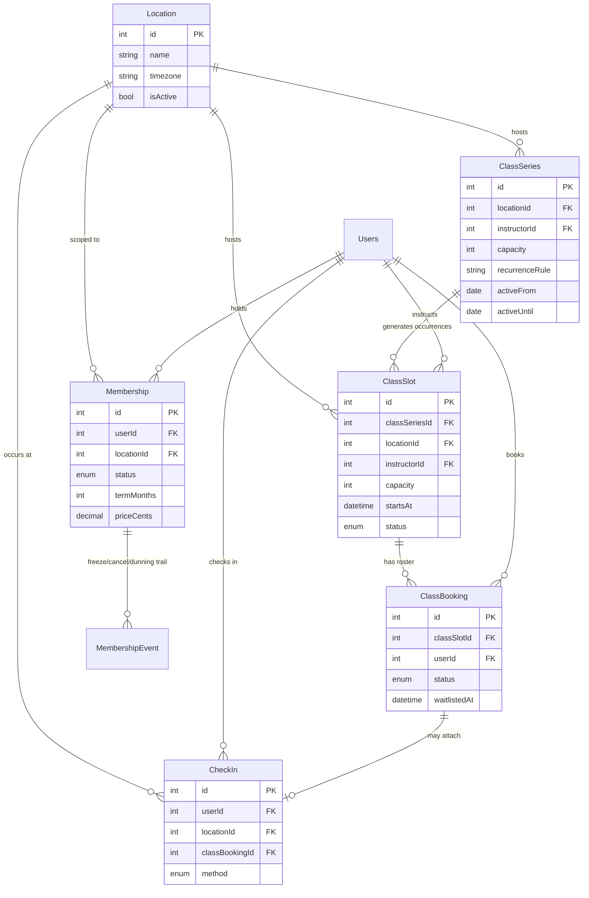

# ⛔ v1 — DO NOT BUILD FROM THIS DOCUMENT

**Rejected by hostile review 2026-07-28.** Kimi K3 found 5 BLOCKERs; Claude independently verified
all 5 against this text. Review: `KIMI-REVIEW-gym-ops-spine-2026-07-28.md`. Tracking: **SWA-74**.

A disciplined builder following this document ships a gym that can be **oversold, deadlocked,
billed-while-frozen, and never charged in the first place.** Specifically:

| ID | Defect in this document |
|---|---|
| A1 | Slice 5 writes `status: 'suspended'`; Slice 4's `memberships.status` ENUM does not contain it. Day-10 suspension throws → **delinquent members keep booking and keep entering.** |
| A2 | **No slice creates a Stripe subscription for a Membership.** `stripeSubscriptionId` is permanently NULL, so Slice 5's dunning branch never matches. There is no way to sell a membership. |
| A3 | Slice 3 flips bookings to `attended` pre-class; Slices 1–2 count capacity as `booked` only → a checked-in member stops occupying a seat → **waitlist promotes into an occupied spot.** |
| B1 | Cancel-vs-cancel **lock-order inversion deadlock** (slot→booking vs booking→slot). |
| D1 | The cancel+promote transaction — the path B1 lives in — **has no specification at all.** |

Plus ~16 HIGH findings, including: `bookIntoSlot` has no membership/entitlement gate anywhere;
`ON DELETE CASCADE` erases attendance history; freeze does not stop Stripe billing; no scheduler or
dunning-state storage exists; Slice 3 actually depends on Slice 1 (§2's table is wrong);
`check_ins.membershipId` is assigned to Slice 4 and created by no slice; wireframe buttons have no
endpoints; ~18 forced guesses in a document that forbids guessing.

**v2 must fix these as spec, not as patches.** The sections below are retained only as the input
to that revision.

---

# Gym Operations Spine — Worker-Bot Build Blueprint (v1, superseded)

**Date:** 2026-07-28 · **Linear:** SWA-74 · **Audit this implements:** `MINDBODY-DISPLACEMENT-AUDIT-2026-07-27.md`
**Builder profile:** zero repo context. Every path, field, and acceptance test is stated. **Ask nothing — build it.**

---

## 0. How to use this document

Seven slices, in order. **Each slice is independently shippable** — it migrates, passes tests, and
breaks nothing if the next slice never lands. Do not start slice N+1 until slice N's acceptance
criteria pass.

If you hit something this document genuinely does not decide: **stop, comment on SWA-74, do not
guess.** A wrong guess in the schema is expensive; a comment costs an hour.

### Prime directives (violating any of these fails review)

| # | Rule |
|---|---|
| D1 | **Never add `capacity`, rosters, or attendee arrays to `Session.mjs`.** Session is 1:1 personal training and its shape is load-bearing (session deduction, commission, trainer assignment all key off singular `userId`). Group classes are a **new table family**. |
| D2 | **Never extend `Subscription.mjs` for gym memberships.** It is the AI feature-tier gate (`hasFullAIAccess()`, tiers free/pro/elite). Conflating them corrupts both. Slice 4 creates a new `Membership`. |
| D3 | **All FKs to users reference `"Users"`** (PascalCase, quoted). There is a stale lowercase `users` table in production. Referencing it is a live bug. |
| D4 | Migration filename format: `YYYYMMDDHHMMSS-kebab-description.cjs` in `backend/migrations/`. Copy the structure of `20260723090000-create-trainer-applications.cjs` exactly (FK block shape, `addIndex` naming, `DROP TYPE` in `down`). |
| D5 | Models: copy the structure of `backend/models/SessionType.mjs` (docblock → `import { DataTypes, Model }` → `class X extends Model {}` → `X.init({...}, { sequelize, modelName, tableName, timestamps: true })` → `export default X`). |
| D6 | Max 300 lines per file. Extract helpers/services when approaching it. |
| D7 | No Material-UI. styled-components only. No hardcoded colors — `var(--token, #fallback)`. 44px min touch targets. |
| D8 | Every ENUM created must be dropped in the migration's `down` via `DROP TYPE IF EXISTS "enum_<table>_<column>";`. |

### Registering a model in `backend/models/associations.mjs` — THREE edit points

This file is long; the edits are mechanical. For each new model:

1. **~line 16-30** (import block): `const XModule = await import('./X.mjs');`
2. **~line 236-248** (extract block): `const X = XModule.default;`
3. **~line 572+** (association block): the `belongsTo`/`hasMany` calls.

Also add the model to the registry object near **line 495** so it is exported.

### Mounting a route in `backend/core/routes.mjs` — TWO edit points

1. Top import block (~line 87-144): `import xRoutes from '../routes/xRoutes.mjs';`
2. Body (~line 285-510): `app.use('/api/x', xRoutes);`

---

## 1. Target architecture



### The three decisions that shape everything

**Why `ClassSeries` → `ClassSlot` (materialized), not lazy generation.**
A member cannot book a row that does not exist, and capacity cannot be locked on a row that does not
exist. So occurrences are **materialized** for a rolling 90-day horizon by a generator job. `ClassSeries`
holds the recurrence rule; `ClassSlot` is one concrete dated occurrence. This is how every serious
booking system does it, and it makes capacity enforcement a simple row lock.

**Why waitlist is a `ClassBooking.status`, not its own table.**
Position is derived from `waitlistedAt` ordering. Promotion is a status flip inside the same
transaction that frees a spot. A separate table would need its own uniqueness rules and a two-table
transaction on every cancel. One table, one lock, no drift.

**Why capacity is enforced with a row lock, not a `CHECK`.**
Postgres cannot express "count of child rows < parent.capacity" as a `CHECK`. Two members booking the
last spot concurrently is a real race that loses money and trust. Slice 1 specifies
`SELECT ... FOR UPDATE` on the slot row. **Do not replace this with an app-level count.**

---

## 2. Slice sequence

| Slice | Delivers | Unblocks | Ship independently? |
|---|---|---|---|
| 0 | `Location` + backfill `Session.location` | everything | ✅ |
| 1 | `ClassSeries` + `ClassSlot` + `ClassBooking` + capacity lock | the decisive gap | ✅ |
| 2 | Waitlist + auto-promote | 1 | ✅ |
| 3 | `CheckIn` + kiosk endpoint | 0 | ✅ |
| 4 | `Membership` + `MembershipEvent` | 0 | ✅ |
| 5 | Dunning ladder + access suspension | 4 | ✅ |
| 6 | Door-access authorization endpoint | 3, 4 | ✅ |

---

## SLICE 0 — `Location`

**Goal:** make location a first-class entity. Cheap now, brutal later. Build it even for a
single-site pilot.

### Files

**CREATE** `backend/migrations/20260728100000-create-locations.cjs`

```js
'use strict';

/**
 * Creates locations — first-class facility entity. Everything gym-operational scopes to a location.
 * Also adds Session.locationId (nullable) alongside the legacy free-text Session.location, which is
 * left in place and backfilled in a LATER slice. Nullable FK = zero breakage for existing rows.
 */
module.exports = {
  up: async (queryInterface, Sequelize) => {
    await queryInterface.createTable('locations', {
      id: { type: Sequelize.INTEGER, primaryKey: true, autoIncrement: true, allowNull: false },
      name: { type: Sequelize.STRING(150), allowNull: false },
      slug: { type: Sequelize.STRING(150), allowNull: false },
      addressLine1: { type: Sequelize.STRING(255), allowNull: true },
      addressLine2: { type: Sequelize.STRING(255), allowNull: true },
      city: { type: Sequelize.STRING(100), allowNull: true },
      region: { type: Sequelize.STRING(100), allowNull: true },
      postalCode: { type: Sequelize.STRING(20), allowNull: true },
      country: { type: Sequelize.STRING(2), allowNull: false, defaultValue: 'US' },
      phone: { type: Sequelize.STRING(50), allowNull: true },
      timezone: { type: Sequelize.STRING(64), allowNull: false, defaultValue: 'America/Los_Angeles' },
      isActive: { type: Sequelize.BOOLEAN, allowNull: false, defaultValue: true },
      metadata: { type: Sequelize.JSONB, allowNull: true },
      createdAt: { type: Sequelize.DATE, allowNull: false, defaultValue: Sequelize.literal('CURRENT_TIMESTAMP') },
      updatedAt: { type: Sequelize.DATE, allowNull: false, defaultValue: Sequelize.literal('CURRENT_TIMESTAMP') },
      deletedAt: { type: Sequelize.DATE, allowNull: true },
    });

    await queryInterface.addIndex('locations', ['slug'], { name: 'locations_slug_unique', unique: true });
    await queryInterface.addIndex('locations', ['isActive'], { name: 'locations_isActive' });

    await queryInterface.addColumn('sessions', 'locationId', {
      type: Sequelize.INTEGER,
      allowNull: true,
      references: { model: 'locations', key: 'id' },
      onUpdate: 'CASCADE',
      onDelete: 'SET NULL',
    });
    await queryInterface.addIndex('sessions', ['locationId'], { name: 'sessions_locationId' });
  },

  down: async (queryInterface) => {
    await queryInterface.removeIndex('sessions', 'sessions_locationId');
    await queryInterface.removeColumn('sessions', 'locationId');
    await queryInterface.dropTable('locations');
  },
};
```

> ⚠ **Verify the sessions table name before running.** `Session.mjs` declares its `tableName` —
> read it and use that literal string. If it is `"Sessions"` (PascalCase), use that in both
> `addColumn` calls. Do not assume.

**CREATE** `backend/models/Location.mjs` — model per D5. Fields mirror the migration. Add
`paranoid: true` (matches the `deletedAt` column). `tableName: 'locations'`.

**EDIT** `backend/models/Session.mjs` — add `locationId` (INTEGER, nullable, comment
`'FK to locations.id — replaces the legacy free-text location column'`). **Leave the existing
`location` STRING field untouched.** Both coexist until a later cleanup slice.

**EDIT** `backend/models/associations.mjs` — three edit points:
- `const LocationModule = await import('./Location.mjs');`
- `const Location = LocationModule.default;`
- ```js
  Session.belongsTo(Location, { foreignKey: 'locationId', as: 'facility' });
  Location.hasMany(Session, { foreignKey: 'locationId', as: 'sessions' });
  ```
  *(alias is `facility`, not `location` — `location` collides with the existing STRING attribute)*

**CREATE** `backend/routes/locationRoutes.mjs` — admin CRUD. `GET /` (list active),
`POST /`, `PUT /:id`, `DELETE /:id` (soft). Admin-role guard on write routes; match the auth
middleware pattern used in `backend/routes/adminSettingsRoutes.mjs`.

**EDIT** `backend/core/routes.mjs` — import + `app.use('/api/locations', locationRoutes);`

### Acceptance criteria — Slice 0

- [ ] Migration runs clean up **and** down on a scratch DB.
- [ ] `node --check` passes on every new/edited `.mjs`.
- [ ] Backend boots (`node backend/server.mjs` reaches listening state without `ERR_MODULE_NOT_FOUND`).
- [ ] `GET /api/locations` returns `[]` on a fresh DB, `200`.
- [ ] Creating two locations with the same `slug` returns a constraint error, not two rows.
- [ ] **Existing sessions still load.** Regression test: fetch a session created before this migration; `locationId` is `null` and nothing throws.
- [ ] `Session.location` (STRING) is byte-identical to before — `git diff` shows only an *added* field.

---

## SLICE 1 — `ClassSeries` + `ClassSlot` + `ClassBooking` ⭐ the decisive slice

### Migration `20260728110000-create-class-booking-tables.cjs`

**`class_series`**

| Column | Type | Notes |
|---|---|---|
| `id` | INTEGER PK | |
| `locationId` | INTEGER FK → `locations.id` | NOT NULL, `ON DELETE RESTRICT` |
| `instructorId` | INTEGER FK → `"Users".id` | NOT NULL, `ON DELETE RESTRICT` |
| `name` | STRING(150) | NOT NULL |
| `description` | TEXT | |
| `capacity` | INTEGER | NOT NULL, **CHECK (capacity > 0)** |
| `durationMinutes` | INTEGER | NOT NULL, default 60 |
| `recurrenceRule` | STRING(255) | iCal RRULE, e.g. `FREQ=WEEKLY;BYDAY=MO,WE,FR` |
| `startTimeLocal` | STRING(5) | `'06:30'` — wall-clock in the location's tz |
| `activeFrom` | DATEONLY | NOT NULL |
| `activeUntil` | DATEONLY | nullable = open-ended |
| `isActive` | BOOLEAN | NOT NULL default true |
| timestamps + `deletedAt` | | paranoid |

**`class_slots`** — one concrete dated occurrence

| Column | Type | Notes |
|---|---|---|
| `id` | INTEGER PK | |
| `classSeriesId` | INTEGER FK → `class_series.id` | **nullable** — allows one-off classes |
| `locationId` | INTEGER FK → `locations.id` | NOT NULL |
| `instructorId` | INTEGER FK → `"Users".id` | NOT NULL — **denormalized from series so a substitute can be set per-occurrence** |
| `name` | STRING(150) | NOT NULL, denormalized from series (renaming a series must not rewrite history) |
| `capacity` | INTEGER | NOT NULL, CHECK > 0, denormalized — capacity change applies to *future* slots only |
| `startsAt` | DATE | NOT NULL, UTC |
| `endsAt` | DATE | NOT NULL |
| `status` | ENUM(`scheduled`,`cancelled`,`completed`) | NOT NULL default `scheduled` |
| `cancellationReason` | TEXT | |
| timestamps | | |

Indexes: `(locationId, startsAt)`, `(classSeriesId)`, `(instructorId, startsAt)`.
Unique: `(classSeriesId, startsAt)` where `classSeriesId IS NOT NULL` — **makes the generator idempotent.**

**`class_bookings`**

| Column | Type | Notes |
|---|---|---|
| `id` | INTEGER PK | |
| `classSlotId` | INTEGER FK → `class_slots.id` | NOT NULL, `ON DELETE CASCADE` |
| `userId` | INTEGER FK → `"Users".id` | NOT NULL, `ON DELETE CASCADE` |
| `status` | ENUM(`booked`,`waitlisted`,`attended`,`no_show`,`cancelled`,`late_cancelled`) | NOT NULL default `booked` |
| `waitlistedAt` | DATE | nullable — set only when status starts `waitlisted`; **ordering key for promotion** |
| `bookedAt` | DATE | NOT NULL default CURRENT_TIMESTAMP |
| `cancelledAt` | DATE | |
| `promotedAt` | DATE | set when waitlist → booked |
| `source` | ENUM(`member`,`staff`,`admin`) | NOT NULL default `member` |
| timestamps | | |

**Critical index — prevents double-booking:**
```js
await queryInterface.addIndex('class_bookings', ['classSlotId', 'userId'], {
  name: 'class_bookings_one_active_per_user_per_slot',
  unique: true,
  where: { status: ['booked', 'waitlisted'] },
});
```
A cancelled member can rebook; an active one cannot double-book. Race-proof at the DB.

Also index `(classSlotId, status)` and `(userId, bookedAt)`.

### Service — `backend/services/classBookingService.mjs`

**This is the load-bearing file. Get the transaction right.**

```js
/**
 * Books a member into a class slot, or waitlists them if full.
 * Capacity is enforced with a row lock — NOT an app-level count — because two concurrent
 * bookings for the last spot is a real race that oversells the class.
 */
export async function bookIntoSlot({ userId, classSlotId, source = 'member' }) {
  return sequelize.transaction(async (t) => {
    // 1. Lock the slot row. Every concurrent booking for this slot serializes here.
    const slot = await ClassSlot.findByPk(classSlotId, {
      transaction: t,
      lock: t.LOCK.UPDATE,
    });
    if (!slot) throw new NotFoundError('CLASS_SLOT_NOT_FOUND');
    if (slot.status !== 'scheduled') throw new ConflictError('CLASS_NOT_BOOKABLE');
    if (new Date(slot.startsAt) <= new Date()) throw new ConflictError('CLASS_ALREADY_STARTED');

    // 2. Count confirmed bookings INSIDE the lock.
    const booked = await ClassBooking.count({
      where: { classSlotId, status: 'booked' },
      transaction: t,
    });

    const isFull = booked >= slot.capacity;

    // 3. Insert. The partial unique index rejects a duplicate active booking.
    const booking = await ClassBooking.create({
      classSlotId,
      userId,
      source,
      status: isFull ? 'waitlisted' : 'booked',
      waitlistedAt: isFull ? new Date() : null,
    }, { transaction: t });

    return { booking, waitlisted: isFull, spotsRemaining: Math.max(0, slot.capacity - booked - (isFull ? 0 : 1)) };
  });
}
```

**DO NOT:** count outside the transaction · use `findOne` without `lock` · catch the unique-violation
and retry silently (surface `ALREADY_BOOKED` to the caller).

### Generator — `backend/services/classSlotGeneratorService.mjs`

Expands `ClassSeries.recurrenceRule` into `ClassSlot` rows for a rolling horizon.

- `generateSlotsForSeries(seriesId, { horizonDays = 90 })`
- Idempotent — relies on the `(classSeriesId, startsAt)` unique index; use `findOrCreate`.
- Converts `startTimeLocal` + the location's `timezone` → UTC `startsAt`. **DST is why the local
  wall-clock time is stored and converted per-occurrence rather than adding 7 days in UTC.**
- Must be safe to run repeatedly (cron daily + on series create/edit).

### Routes — `backend/routes/classRoutes.mjs`, mounted `/api/classes`

| Method | Path | Auth | Purpose |
|---|---|---|---|
| GET | `/slots` | member | `?locationId&from&to` — schedule with `spotsRemaining` |
| GET | `/slots/:id` | member | detail + roster count (**not names** — privacy) |
| POST | `/slots/:id/book` | member | → `bookIntoSlot` |
| DELETE | `/bookings/:id` | member (own) | cancel; applies late-cancel window |
| GET | `/slots/:id/roster` | **staff only** | names — instructor/admin |
| POST | `/series` | admin | create + trigger generator |
| PUT | `/series/:id` | admin | edit; regenerate **future** slots only |

### Acceptance criteria — Slice 1

- [ ] Migration up + down clean.
- [ ] **Capacity race test (mandatory, this is the slice's whole point):** seed a slot with `capacity: 1`; fire two `bookIntoSlot` calls concurrently via `Promise.all`; assert exactly one `booked` and one `waitlisted`. Must pass 10 consecutive runs.
- [ ] Double-book test: same user books twice → second rejects with `ALREADY_BOOKED`, one row exists.
- [ ] Cancel-then-rebook succeeds (partial index excludes `cancelled`).
- [ ] Booking a started class returns `CLASS_ALREADY_STARTED`.
- [ ] Generator idempotency: run twice for the same series → slot count unchanged.
- [ ] DST test: a weekly 06:30 class spanning a DST boundary has every occurrence at 06:30 **local**.
- [ ] **`Session.mjs` has zero diff in this slice.** `git diff backend/models/Session.mjs` is empty.
- [ ] Member-facing `GET /slots/:id` does **not** leak other members' names.

---

## SLICE 2 — Waitlist auto-promote

### Files
**CREATE** `backend/services/classWaitlistService.mjs`
**EDIT** `classBookingService.mjs` — call promotion on cancel.

```js
/**
 * Promotes the longest-waiting member when a spot frees. Runs INSIDE the caller's transaction
 * so a cancel + promote is atomic — a crash between them would leave a class permanently
 * under-filled with someone waiting.
 */
export async function promoteFromWaitlist(classSlotId, t) {
  const slot = await ClassSlot.findByPk(classSlotId, { transaction: t, lock: t.LOCK.UPDATE });
  if (!slot || slot.status !== 'scheduled') return null;

  const booked = await ClassBooking.count({ where: { classSlotId, status: 'booked' }, transaction: t });
  if (booked >= slot.capacity) return null;

  const next = await ClassBooking.findOne({
    where: { classSlotId, status: 'waitlisted' },
    order: [['waitlistedAt', 'ASC']],   // FIFO — first waitlisted, first promoted
    transaction: t,
    lock: t.LOCK.UPDATE,
  });
  if (!next) return null;

  await next.update({ status: 'booked', promotedAt: new Date() }, { transaction: t });
  return next;
}
```

Notification fires **after** commit, never inside the transaction (a failed send must not roll back
a valid promotion). Use the existing `notificationService.mjs`.

### Acceptance criteria — Slice 2
- [ ] Full class, 3 waitlisted, 1 cancels → the **earliest** `waitlistedAt` is promoted, other two unchanged.
- [ ] Promoted member receives a notification; notification failure does **not** roll back the promotion (test with a mocked throwing sender).
- [ ] Two concurrent cancels on a class with 1 waitlisted → exactly one promotion, no double-promote.
- [ ] Cancelling a class slot (`status: 'cancelled'`) promotes nobody.

---

## SLICE 3 — `CheckIn`

`check_ins`: `id`, `userId` FK `"Users"`, `locationId` FK `locations` (NOT NULL),
`classBookingId` FK `class_bookings` (**nullable** — open-gym check-ins have no class),
`method` ENUM(`kiosk`,`staff`,`qr`,`app`,`door`), `checkedInAt` DATE NOT NULL,
`membershipId` FK (nullable, added in Slice 4), timestamps.

Index `(userId, checkedInAt)`, `(locationId, checkedInAt)`.

**Service** `backend/services/checkInService.mjs` → `checkIn({ userId, locationId, method })`:
resolves whether the member has a class starting within ±30 min at that location and attaches
`classBookingId` if so, flipping that booking to `attended`.

**Routes** `/api/checkin`: `POST /` (staff/kiosk), `GET /today?locationId` (staff).

### Acceptance criteria — Slice 3
- [ ] Check-in with no class → row created, `classBookingId` null.
- [ ] Check-in 10 min before a booked class → booking flips to `attended`, `classBookingId` set.
- [ ] Check-in 3 hours before → **not** attached (outside window).
- [ ] Duplicate check-in within 5 min is idempotent (returns existing row, does not double-count).

---

## SLICE 4 — `Membership` + `MembershipEvent`

**`memberships`**: `id`, `userId` FK, `locationId` FK, `name` STRING(150),
`status` ENUM(`active`,`frozen`,`past_due`,`cancelled`,`expired`) default `active`,
`priceCents` INTEGER NOT NULL, `billingInterval` ENUM(`monthly`,`annual`),
`termMonths` INTEGER (null = month-to-month), `startsAt`/`endsAt` DATE,
`entitlement` ENUM(`unlimited`,`limited`,`open_gym_only`),
`sessionsPerPeriod` INTEGER nullable, `stripeSubscriptionId` STRING(255) nullable,
`cancellationNoticeDays` INTEGER default 30, `frozenUntil` DATE nullable, timestamps + paranoid.

**`membership_events`** — append-only audit: `id`, `membershipId` FK,
`eventType` ENUM(`created`,`frozen`,`unfrozen`,`payment_failed`,`payment_recovered`,`suspended`,`cancelled`,`renewed`),
`actorUserId` FK nullable, `notes` TEXT, `metadata` JSONB, `occurredAt` DATE.

> **Never mutate membership status without writing a `MembershipEvent`.** Billing disputes are won
> or lost on this trail.

### Acceptance criteria — Slice 4
- [ ] Freeze sets `status: 'frozen'` + `frozenUntil` **and** writes an event.
- [ ] A frozen membership cannot book a class (403 `MEMBERSHIP_FROZEN`).
- [ ] Cancellation respects `cancellationNoticeDays` — `endsAt` is notice-days out, not immediate.
- [ ] `Subscription.mjs` has **zero diff** in this slice.

---

## SLICE 5 — Dunning ladder

**EDIT** `backend/webhooks/stripeWebhook.mjs` — route `invoice.payment_failed` carrying a
`stripeSubscriptionId` that matches a `Membership` into the membership ladder (existing AI-tier
handling stays untouched; branch on which record the subscription ID belongs to).

**CREATE** `backend/services/membershipDunningService.mjs`:

| Attempt | Action |
|---|---|
| 1 | `status: 'past_due'`, notify member, event `payment_failed` |
| 2 (day 3) | reminder |
| 3 (day 7) | final notice |
| Day 10 | `status: 'suspended'` → **blocks booking and door access**, event `suspended` |
| Any success | `status: 'active'`, event `payment_recovered` |

### Acceptance criteria — Slice 5
- [ ] `payment_failed` on a **membership** → `past_due` + event; **AI-tier subscription behaviour unchanged** (regression test both paths).
- [ ] Day-10 suspension blocks `bookIntoSlot` with `MEMBERSHIP_SUSPENDED`.
- [ ] Recovery restores `active` and re-enables booking.
- [ ] Ladder is idempotent — replaying the same Stripe event does not double-advance.

---

## SLICE 6 — Door-access authorization endpoint

**Vendor-neutral.** We do not integrate a specific reader; we expose the decision endpoint hardware calls.

`GET /api/access/verify?userId=&locationId=` → `200 { allow: boolean, reason: string, memberName?: string }`

Deny reasons: `NO_ACTIVE_MEMBERSHIP` · `MEMBERSHIP_FROZEN` · `MEMBERSHIP_SUSPENDED` ·
`WRONG_LOCATION` · `OUTSIDE_HOURS`.

**Fail-closed:** any internal error returns `allow: false`. Never fail open on a door.
Authenticate the caller with a per-location API key (header `X-Access-Key`), **not** a user JWT.
Log every decision to `check_ins` with `method: 'door'` when allowed.

### Acceptance criteria — Slice 6
- [ ] Active membership at the right location → `allow: true`.
- [ ] Suspended / frozen / wrong-location → `allow: false` with the correct reason.
- [ ] DB unreachable → `allow: false` (fail-closed), test with a mocked throwing repository.
- [ ] Missing/invalid `X-Access-Key` → `401`, no membership data leaked in the body.

---

## 3. Wireframes

### Member — class schedule (mobile 375px)

```
┌─────────────────────────────┐
│  ‹  Classes        [Downtown ▾]│   ← location picker only if >1 location
├─────────────────────────────┤
│  MON 28   TUE 29   WED 30    │   ← horizontal day strip, swipeable
│    ●                         │
├─────────────────────────────┤
│ ┌─────────────────────────┐ │
│ │ 6:30 AM · 45 min        │ │
│ │ SUNRISE STRENGTH        │ │
│ │ Sean · Main Floor       │ │
│ │ ▓▓▓▓▓▓▓▓░░  8/12        │ │   ← capacity bar, Ice Wing fill
│ │ ┌─────────────────────┐ │ │
│ │ │      BOOK  (44px)   │ │ │
│ │ └─────────────────────┘ │ │
│ └─────────────────────────┘ │
│ ┌─────────────────────────┐ │
│ │ 9:00 AM · 60 min        │ │
│ │ CONDITIONING            │ │
│ │ ▓▓▓▓▓▓▓▓▓▓  12/12  FULL │ │
│ │ ┌─────────────────────┐ │ │
│ │ │  JOIN WAITLIST (2)  │ │ │   ← shows queue length, honest
│ │ └─────────────────────┘ │ │
│ └─────────────────────────┘ │
└─────────────────────────────┘
```

### Staff — roster / check-in (desktop 1280px)

```
┌──────────────────────────────────────────────────────────────┐
│ SUNRISE STRENGTH · Mon 28 Jul 6:30 AM · Downtown             │
│ Instructor: Sean            8 booked · 2 waitlisted · cap 12  │
├──────────────────────────────────────────────────────────────┤
│  ROSTER                              │  WAITLIST              │
│  ✓ M. Chen         checked in 6:22   │  1. R. Patel  (6:02p) │
│  ✓ A. Rivera       checked in 6:25   │  2. K. Osei   (7:41p) │
│  ○ J. Blake        booked            │                        │
│    [ CHECK IN ]  (44px)              │  [ PROMOTE ] (44px)   │
├──────────────────────────────────────────────────────────────┤
│  [ CANCEL CLASS ]        [ MARK REMAINING NO-SHOW ]           │
└──────────────────────────────────────────────────────────────┘
```

Styling: styled-components only, `var(--token, #fallback)`, capacity bar uses Ice Wing `#60C0F0`,
full state uses Gilded Fern `#C6A84B`. Cards follow the Swan client/data-card standard —
low-motion, no hover-only actions, 44px targets, checked at 320/375/414px.

---

## 4. Rollback

Each slice's migration has a working `down`. Order to unwind: 6 → 0.
No slice drops or rewrites an existing column, so `down` is non-destructive to pre-existing data.
`Session.location` (STRING) and `Subscription.mjs` are never modified by any slice — **that is
deliberate, and it is what makes every rollback safe.**

## 5. Out of scope (do not build)

Card-present POS hardware · payroll export (ADP/Paychex) · consumer marketplace · SMS campaign
builder · multi-tenant white-label · Mindbody data import (Phase 3, separate work order).

## 6. Open — comment on SWA-74, do not guess

1. `sessions` table name literal (PascalCase vs lowercase) — read `Session.mjs` `tableName`.
2. Late-cancel window (hours) and whether a late cancel forfeits a session credit — **business
   policy, Sean's call.** Default to 12h / no forfeit and flag it.
3. Whether `class_bookings` should decrement `SessionPackage` credits for PT-package holders
   attending classes — touches money. Ask.
