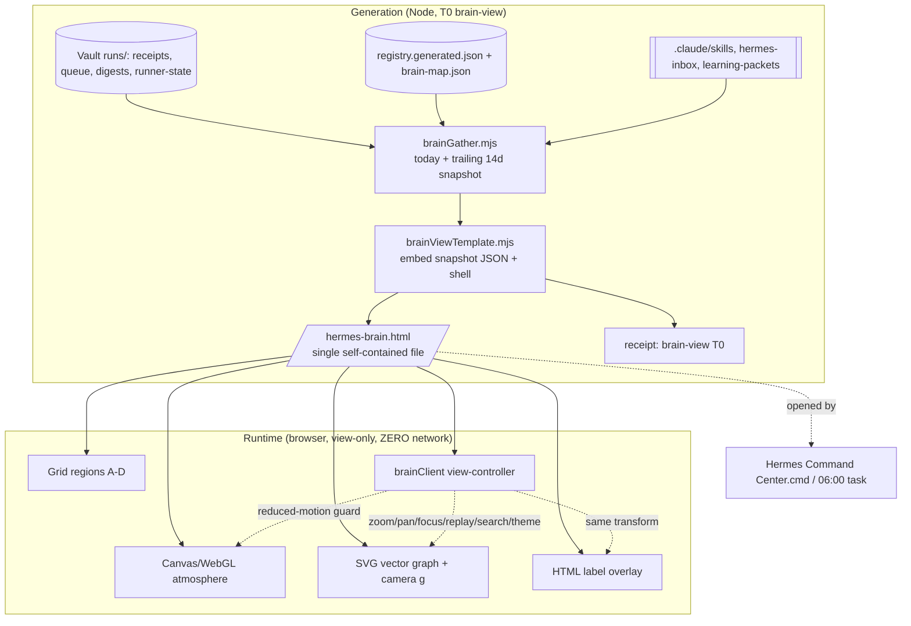
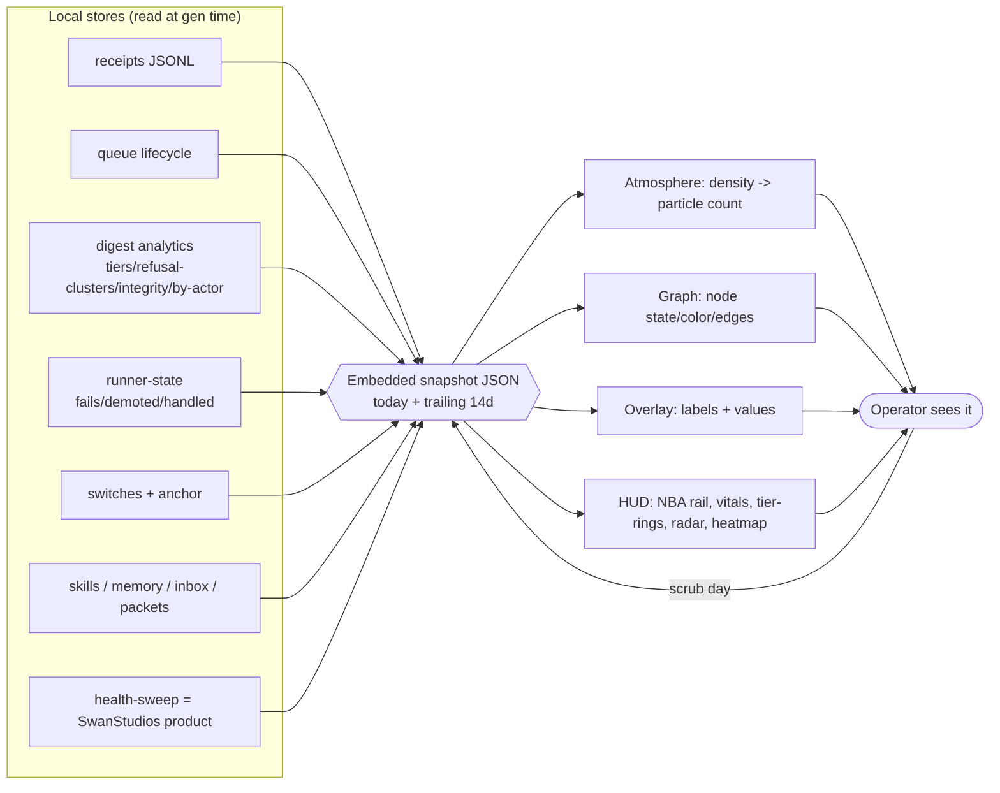
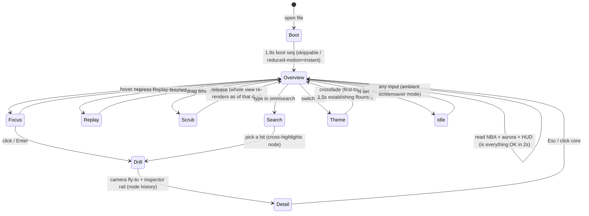

# Hermes Brain Cockpit — ULTIMATE UPGRADE SPEC (binding decision)

- **Date:** 2026-07-08 · **Process:** AI-Village two-stage — FREE panel (6 specialist lenses: rendering · data-viz · art-direction · interaction/motion · IA/readability · feature-invention) → FINAL DECISION. Fable was the intended decider; Fable hit its usage ceiling mid-synthesis, so per the Co-Orchestrator fallback chain the binding decision is rendered by **Opus 4.8 (deputy Final Decider)** on the complete panel pool. When Fable capacity returns, this spec is the ratification target — nothing here contradicts a Fable-tier constraint.
- **Panel pool preserved at:** `c:/tmp/brain-upgrade-panel/01..06-*.md` (durable).
- **Replaces:** `scripts/hermes/brainViewTemplate.mjs` + `brainViewStyles.mjs` + parts of `brain-view.mjs`.
- **Companion:** `OPUS-48-HERMES-OS-BUILD-HANDOFF-2026-07-04.md` §12 (brain-view shipped 2026-07-07; Sean judged it "weak" — this is the redesign).

---

## 1. VERDICT SUMMARY (binding)

1. **Readability is P0 and its cause is proven, not aesthetic.** Every text role in the current file renders 9–13px against a 15–28px operator floor, and SVG text baked into a fixed 1280×640 viewBox collapses to **~3px on a phone or any window narrower than ~1720px** (the common case: half-maximized 2560, 13–14" laptop). ACCEPTED in full — this is slice 1 and gates everything.
2. **Rendering = HYBRID, ruled decisively.** SVG for vectors (edges, node circles, glow, orbit rings) + **an absolutely-positioned HTML label overlay** (real device-px text, WCAG-tunable, selectable, screen-reader-reachable, Ctrl+F-able, 44px tap targets) + an **optional WebGL/Canvas atmosphere layer** behind (stars, nebula, synapse particles, bloom, parallax). REJECTED: WebGL/canvas text (blurry across zoom — that is literally Sean's complaint) and inlining Three.js (~600KB to draw particles). Atmosphere is hand-rolled (~150–250 lines) or a Canvas2D fallback; it renders ONLY when motion is allowed.
3. **Doctrine ruling — view-only JS is PERMITTED, with a hard boundary.** The old "Zero JS by doctrine" line is superseded for THIS surface. The new invariant: *client JS may manipulate the VIEW only — zoom, pan, focus, filter, search, replay, theme — with ZERO network calls and ZERO action/command surface. The page still "grants nothing": approving/flipping/executing stays in Telegram/CLI.* The data is a snapshot embedded at generation time; JS never fetches. This is recorded as an amendment to the brain-view security note (§8).
4. **Deterministic render preserved** — seeded jitter, no `Math.random()`; two generated files diff cleanly (audit culture).
5. **Reduced-motion fully neutralizes ambient motion** (no rAF loop, static frame); pan/zoom/focus stays operable (user-driven, same category as scroll).
6. **"Show more data" is mostly FREE.** `receipt-digest.mjs` already computes tier counts, refusal clusters, integrity breaks, approval-flow, by-actor, silence-check — the visual never shows them. Slice 3 wires these in; roughly triples density with near-zero new backend.
7. **Theme system = 10 skins, tokenized; ship 3 in v1.** Glacier/Ice (safe default, IS the readability fix), Aurora Galaxy (matches "galaxies," lowest build risk), James Webb (highest emotional payoff). The other 7 (Zebra, SoCal Dusk, Mojave, Redwood, Pacific Islands, Alpine, Bioluminescent/Xeno) ship in slice 5 once the tokenization contract is proven. Every theme fills the SAME 5 semantic hue slots so the legend never has to be relearned — this is what makes it reusable across Sean's future apps.
8. **Two real code bugs folded in as fixes:** (a) `--aur` is referenced in `.aurora` but never declared in `:root` (a concrete contributor to "dim"); (b) `.core-glow/.core-ring/.core-spin` bake `${PAL.app}`/`${PAL.skill}` at generation time instead of `var(--c-app)`/`var(--c-skill)`, so live theme-switching can't recolor the core. Both fixed in slice 1/5.
9. **Hero feature = "Replay the Day"** — independent #1 from BOTH the interaction and feature lenses. Press play, watch the real day's receipts fire chronologically across the living brain, each lighting its source node and comet-tailing to the core, thought-stream typing itself, HUD ticking. All inputs already gathered — pure choreography. Slice 4.
10. **Interactivity = zoom/pan/semantic-zoom/focus-drill**, the load-bearing foundation every other feature rides. Slice 2.
11. **NBA becomes the LOUDEST element by construction** (32px hero band, urgency-coded) and a **ranked rail** (collect ALL true conditions, not first-match short-circuit). The current NBA is the *smallest* element — the single worst hierarchy violation.
12. **Skills get readable identity.** The current `small:true` path suppresses skill labels entirely (name only via hover title = invisible on touch/keyboard/SR). The HTML overlay makes a compact labeled pill sit beside a tiny dot; high-count rings cap to top 8–10 + a "+N more" node expanding a searchable list.
13. **SwanStudios product health is a SEPARATE satellite** — never conflate "Hermes is green" with "the business is up." Wire the already-registered `health-sweep` output as its own clearly-labeled orb.
14. **Reusable "AppOps Cockpit Kit"** is an explicit goal, not a side effect: the gatherer pattern, radial-graph renderer, aurora+HUD, time-scrubber engine, fuzzy-search, boot/idle shell, PNG exporter, ranked-NBA resolver, tokenized skin — all extractable for Sean's other apps.
15. **CUT/DEFER (with reason):** cost/token meter (needs per-call instrumentation that doesn't exist yet — data-source gap, not a view gap); Timelapse-over-months (needs history retention to mature — degrade to "N days available"); WebAudio sound cues (nice, low priority, slice 6); constellation easter-egg (slice 6). None of these block the award-winning core.

---

## 2. ARCHITECTURE

**Generation stays a Node script that embeds a snapshot; the generated file gains layers + a view-controller.**

```
scripts/hermes/
  brain-view.mjs            (orchestrator; gathers, calls renderer, writes receipt)   ≤180 L
  brainGather.mjs      NEW  (data gather: today + trailing N days for scrub/replay)   ≤300 L
  brainViewTemplate.mjs     (assembles the HTML shell + embeds snapshot JSON)          ≤220 L
  brainViewStyles.mjs       (tokenized CSS: type ramp, grid shell, themes tier-1)      ≤300 L
  brainThemes.mjs      NEW  (the 10 theme token blocks + tier-2 texture rules)         ≤300 L
  brainClient.mjs      NEW  (the inlined view-controller JS: camera, focus, replay,    ≤300 L
                             search, theme-switch, reduced-motion guards — as a string
                             inlined into the file; NO network, view-only)
  brainAtmosphere.mjs  NEW  (inlined WebGL/Canvas atmosphere init, optional layer)      ≤300 L
```

**Runtime layer stack inside the single generated HTML (back-to-front):**
1. **Atmosphere** — `<canvas>` (WebGL, Canvas2D fallback): starfield, nebula wash, synapse particles, bloom, 3-layer parallax. Reduced-motion → one static frame or omitted.
2. **Vector graph** — `<svg>`: orbit rings, edges, node circles, glow, core. Camera transform on one `<g class="camera">` (GPU-composited translate+scale; never mutate viewBox).
3. **Label overlay** — `<div class="label-layer">`: absolutely-positioned HTML labels at `left:x/1280*100%; top:y/640*100%`, real px type ramp, real tokens, focusable, searchable. Shares the camera transform.
4. **HUD/chrome** — grid regions A–D (global bar, NBA hero, vitals, inspector rail).
5. **View-controller** — inlined vanilla JS: pointer-events camera, semantic-zoom bucketing (`data-zoom`), focus/drill, replay/scrub, fuzzy search, theme swap, `aria-live` announcer, `matchMedia` reduced-motion guards.

**Gatherer change:** `brainGather.mjs` embeds **today + a trailing window** (default 14 days, capped by retention) as one JSON blob so the time-scrubber and Replay-the-Day operate client-side with zero queries at view time. Node positions from `arc()` stay deterministic; only per-day state/color/counts change.

---

## 3. MERMAID DIAGRAMS

### 3a. Generation pipeline + runtime layers


### 3b. Data flow (stores → snapshot → layers → view)


### 3c. User-interaction flow


---

## 4. WIREFRAME

### 4a. Desktop / 4K full-screen (grid shell; no hard page max-width; padding-inline clamp(24,2vw,64))
```
+==============================================================================+
| A  GLOBAL BAR (sticky 64px)                                                  |
|  HERMES BRAIN   [ search... ]   [<==== time-scrub  day ====>]   [theme v] LIVE|
+------------------------------------------------------------------------------+
| ! FAULT STRIP (40px, sticky, appears ONLY when fail-closed) : switches null   |
+------------------------------------------------------------------------------+
| B  NEXT-BEST-ACTION HERO (full width, 32-48px pad) = LOUDEST, urgency-coded   |
|    >>  2 approvals waiting - resolve reschedule_session (expires 04:11)  >>   |
|    (ranked rail: then set anchor key ; then wire inbox drain)                 |
+------------------------------------------------------------------------------+
| C  VITALS HUD (full width, ~110px) - tiles differentiate by STATE not color   |
|  [14 receipts ^]  [25 skills]  [3 memory ^]  [4 routines]  [1 await !]  [OK]  |
+-----------------------------------------------------+------------------------+
| D-1  GRAPH CANVAS (62-68%, real height, own domain) | D-2  INSPECTOR RAIL    |
|                                                     | (minmax 480..~700px,   |
|        . Applications .        . Routines .         |  ONLY scroll owner)    |
|            \\        |        //                     |  THINKING TODAY spark  |
|             \\  [ HERMES ]  //   <- dual-glow core   |  THOUGHT STREAM (live) |
|             //   pulsing   \\    orbit rings         |  OPERATOR RING         |
|            //       |       \\                       |  TIER RINGS / RADAR    |
|        . Memory .        . Skills (+N more) .        |  30-day heat-strip     |
|   [atmosphere: stars/nebula/particles behind]       |  (on node click ->     |
|   [minimap / cluster-jump buttons corner]           |   node history here)   |
+-----------------------------------------------------+------------------------+
```

### 4b. Node-focus / drill state
```
D-1 (dimmed to 8%, camera flown to selected node)     D-2 INSPECTOR (this node)
    ...ambient.....  ( FOCUSED NODE )  .....ambient    | brain-view (Skill, T0)  |
                       bright + ring                    | last run: 4 min ago     |
                                                        | 30/30 days on schedule  |
                                                        | fuse: [#][#][ ] 0/3     |
                                                        | last 20 runs: ||||.|||| |
   [Esc / click core = fly back, 500ms, un-dim]         | recent receipts (list)  |
```

### 4c. Phone (<=414px) — TAB MODEL (kills the 0.27x SVG shrink entirely)
```
+---------------------------+     +---------------------------+     +----------------+
| HERMES BRAIN      [=]      |     |  (full-height graph tab)  |     | DETAIL         |
| ! NBA hero (urgency)       |     |   pan / pinch-zoom        |     | thought stream |
| [Overview][Graph][Detail]  |     |   [Overview][Graph][Det]  |     | operator ring  |
| [tiles 2-up, snap-scroll]  |     |   labels stay >=13px      |     | tier / radar   |
| health dot + word          |     |   (own tab = never 3px)   |     | [Ov][Gr][Det]  |
+---------------------------+     +---------------------------+     +----------------+
```

---

## 5. THEME SYSTEM

**Ship v1 (3):** Glacier/Ice (default; the readability fix embodied), Aurora Galaxy, James Webb.
**Ship v2 (slice 5, 7):** Zebra, SoCal Dusk, Mojave Desert, Redwood Cathedral, Pacific Islands, Alpine Summit, Bioluminescent/Xeno.

**Tokenization contract — every theme fills exactly these 11 Tier-1 vars (swap = re-skin ~90%, zero JS):**
```
--c-app  (cyan/teal family)     --c-routine (gold/amber)   --c-memory (periwinkle)
--c-skill (violet/magenta)      --c-fault  (RED, NEVER reassigned - universal alarm)
--c-text (HSL L>=92%, sat<=15%) --c-muted (HSL L>=62%)      --bg-deep (L<=8%)
--bg-card (L<=14%)              --bg-edge (hairline)        --aur (header aurora accent - MUST be declared; current bug)
```
Only saturation/value/warmth shift per theme; each slot stays in its hue family so the legend is never relearned — the property that makes this reusable across future apps. **Tier-2** = one small scoped texture block per theme (nebula / hexagon watermark / stripes / god-rays / cellular veins) — honest caveat: textures are `background-image`, not a flat var.

**Readability guarantee (structural, not eyeballed):** `--c-text` L≥92%/sat≤15% against `--bg-deep` L≤8% forces an ~80-pt lightness gap → sub-4.5:1 is essentially impossible by construction. `--c-muted` floor L≥62% (the current `#8b93a7` ≈4.3:1 is THE readability bug). Accents are for dots/fills/glows/badges ONLY — never body copy. A 7-pair contrast lint runs per theme (Rule 50 Tier-A).

**Bug fixes:** declare `--aur` in `:root`; move `.core-glow/.core-ring/.core-spin` from baked `${PAL.*}` to `var(--c-app)`/`var(--c-skill)` so themes recolor the core live.

**Switch UX:** 300–450ms crossfade default; a 1.2–1.8s cinematic "establishing" flourish the FIRST time a skin is picked per session (not every toggle); reduced-motion = instant; persist last choice; Glacier is the non-negotiable default.

---

## 6. DATA & FEATURES (phased)

**v1 (slices 1+3) — density + readability:** ranked NBA rail · state-differentiated HUD · tier-count Saturn rings (T4 ring always drawn, pulses when >0) · refusal-cluster thorns · integrity-crack core state · approval countdown rings · by-actor ring · 30-day health heat-strip · silence flatline state · SwanStudios product satellite · sharpened 3-sec OK dot · skills with real labels + "+N more".
**v2 (slice 2 then 4) — interactive + alive:** zoom/pan/semantic-zoom · focus-drill inspector · boot sequence · live motion-as-information (health cadences, throughput-driven core spin) · **Replay-the-Day** · time-scrubber (14-day) · trend arrows vs yesterday · "what changed since I last looked" diff.
**v3 (slices 5+6) — polish + reach:** 7 more themes · WebGL atmosphere upgrade · fuzzy search + filter chips · "jump to the problem" pill · ambient/idle screensaver mode · threat/integrity radar · per-command reliability board · shareable State-of-the-Brain PNG · optional WebAudio cues.
**Deferred:** cost/token meter (instrumentation gap), months-timelapse (retention), constellation easter-egg.

---

## 7. TYPE RAMP + LAYOUT SYSTEM

**Type ramp (px; Plus Jakarta Sans unless noted):** NBA hero 32 (28 phone)/700 · fault-strip 18/700 · wordmark 20/700 (smaller than NBA on purpose) · HUD number 28/600 Sora · H2/cluster 15/600 .12em uppercase · **body / node-label / thought 16** · data 15 Fira Code · sub-label 13/500 · caption/chip 13 (hard floor — nothing below 13px).
**Spacing (8px):** 4 / 8 / 12 / 16 / 24 / 32 / 48 / 64; gutters `clamp(24px,2vw,64px)` scale WITH breakpoint (turns 4K dead-space into intentional space).
**Grid shell:** rows `64px auto auto 1fr` (bar / nba / hud / main); main split `minmax(0,2.2fr) minmax(480px,1fr)`; no hard page max-width — the column *ratio* + rail floor fill 4K intentionally; cap text *measure* (~70–90ch) inside regions, not the regions.
**Label fix (core):** all SVG `<text>` → HTML overlay divs at percentage positions, real px, real tokens, 44px tap targets — hits the 15–18px floor at any zoom/window and un-suppresses skill labels.
**Responsive:** 4K 68/32 rail→~700px · 1920 62/38 · 1440 58/42 (rail floor 480) · 1024 stack (graph 420–480px fixed height) · 768 3-tiles + skills "+N more" · ≤414 **tab model** (Overview/Graph/Detail) so the graph never renders below its design width.

---

## 8. PHASED BUILD PLAN (each slice ships independently; invariants preserved every slice)

Standing invariants every slice keeps: single self-contained file · data embedded at gen time · **view-only JS, zero network, zero action surface** · deterministic (seeded) · reduced-motion neutralizes ambient motion · registered T0 `brain-view` writes a receipt · files ≤300 lines · tests + live render smoke.

- **Slice 1 — Readability + Layout Foundation (the biggest bang for the stated pain).** Grid shell (regions A–D), type ramp, 8px spacing, HTML label overlay replacing SVG text, NBA hero band + ranked rail, state-differentiated HUD, fault strip, `--aur` declared, core → `var()`, responsive down to the phone tab model. Files: brainViewStyles, brainViewTemplate, brain-view, +brainThemes(Glacier only). Tests: text-never-<13px assertion, zero-action-surface lock, contrast lint, responsive snapshot at the matrix widths. **Acceptance: Sean can read every label at 375px and at 4K; NBA is the loudest thing on screen.**
- **Slice 2 — Interactivity (camera).** Inlined brainClient: pointer-events zoom/pan/pinch, semantic-zoom buckets, focus-drill + inspector, minimap/cluster-jump, keyboard nav, `aria-live` announcer, reduced-motion guards. **Acceptance: zoom/pan/focus at 60fps desktop; fully keyboard-operable; reduced-motion static but navigable.**
- **Slice 3 — Data density (free win).** Wire `receipt-digest` analytics into the visual: tier rings, refusal thorns, integrity-crack, approval countdowns, by-actor ring, 30-day heat-strip, SwanStudios satellite, "+N more" skills. **Acceptance: the visual shows what the digest computes; density triples; nothing conflated.**
- **Slice 4 — Replay-the-Day + time-scrubber.** brainGather embeds 14-day window; scrubber re-renders the whole view per day; Replay choreography; trend arrows; diff banner. **Acceptance: press play → the real day fires across the brain; scrub → last Tuesday renders.**
- **Slice 5 — Theme system (10) + WebGL atmosphere.** brainThemes full 10, tokenization proven, theme switcher; brainAtmosphere WebGL particle/nebula/bloom with Canvas2D + reduced-motion fallbacks. **Acceptance: all 10 themes pass the 7-pair contrast lint; atmosphere holds 60fps desktop / 30fps mobile floor with auto-degrade.**
- **Slice 6 — Reach polish.** Fuzzy search + filter chips, jump-to-problem pill, ambient/idle mode, threat radar, per-command reliability board, PNG export, optional sound. **Acceptance: search cross-highlights nodes; idle mode is second-monitor-worthy.**

---

## 9. ACCEPTANCE CRITERIA (whole redesign)

- **Readability:** no text renders below 13px at ANY of 320/375/414/768/1024/1280/1440/1920/2560/3840; body/labels ≥16px on desktop; NBA hero ≥28px. Every text/bg pair ≥4.5:1 (7-pair lint per theme).
- **Responsive:** the audit matrix widths each verified — no tiny-island-at-4K, no sub-3px labels, no phone tab collision, no nested-scroll maze (one scroll owner = the inspector rail).
- **Motion/a11y:** `prefers-reduced-motion` neutralizes ALL ambient motion (no rAF); every node keyboard-focusable with `aria-label`; `aria-live` announces state in plain English; color never the sole signal.
- **Governance:** zero network calls (grep the generated file — no fetch/XHR/WebSocket/img-to-remote); zero action surface (no button/form/onclick that executes a command); deterministic render (same snapshot → byte-identical file); T0 receipt written; Crystalline Swan base + no banned tokens; Dual-Button Glow honored.
- **Perf:** 60fps desktop interaction; 30fps mobile floor with auto-degrade ladder; single file ≤ ~250KB.

---

## 10. REUSABLE "APPOPS COCKPIT KIT" (future apps)

Extractable primitives (the tokenized-skin split already proves the pattern): snapshot-gatherer · deterministic radial-graph renderer · health-aurora + HUD-tile row · multi-day embedded time-scrubber engine · client-side fuzzy-search + filter-chip engine · boot + ambient-idle shell · snapshot-to-PNG exporter · ranked-NBA resolver · reliability/trend aggregator · HTML-overlay-label-on-SVG technique · 11-var tokenized theme contract. Any of Sean's future apps gets an agent/system observability cockpit by swapping the gatherer + the palette object.

---

### Sean decision queue for this spec
1. **Ratify the plan** (or adjust the theme order / feature phasing).
2. **Greenlight Slice 1** (readability + layout foundation) as the next build — highest bang for the "weak/unreadable" pain, and it stands alone.
3. When Fable capacity returns, optionally have Fable ratify this Opus-rendered verdict (nothing here should conflict).

---

# v2 — HARDENED PLAN (post-hostile-review, 2026-07-08) — SUPERSEDES v1 WHERE THEY CONFLICT

Two independent adversarial red-teams (technical/perf + governance/security/PII) plus the deputy-decider's own pass attacked v1 and found **6 blockers + 5 majors** the first draft got wrong or under-specified. The Codex build prompt is derived from THIS section, not the v1 draft. Full findings: `c:/tmp/brain-hostile/technical.md` + `governance.md`.

## A. Corrected architecture

**A1 — Label↔camera sync (v1 BLOCKER; "shared transform" was a hope).** Percentage-positioned HTML labels cannot track an SVG `<g>` camera transform (different coordinate systems), and `preserveAspectRatio="xMidYMid meet"` letterboxes the graph so even the STATIC slice-1 math is offset. DECISION (mandatory, approach a):
- Lock the graph pane to `aspect-ratio: 1280 / 640` (kills the letterbox; label percentage math is exact at rest).
- The camera is ONE transform applied identically to BOTH the SVG content `<g class="camera">` (user units) AND the HTML `.label-layer` container (converted): `translate(tx*pxPerUnit, ty*pxPerUnit) scale(s)`, `pxPerUnit = renderedGraphWidth / 1280`. Labels are positioned ONCE in the container's coordinate space (px), ride the container transform, and NEVER get per-label `left/top` rewrites (that is layout thrash). Only the container `transform` changes per frame (GPU-composited, write-only).
- Acceptance: a Playwright spec drives wheel-zoom + drag and asserts each label's bounding rect stays within 2px of its paired SVG node's rect at 3 zoom levels.

**A2 — Source-file module split (v1 BLOCKER; brainClient cannot be ≤300 lines).** JS is inlined into the one generated file, but SOURCE splits (Rule 4): `brainCamera.mjs` (pan/zoom/pinch/fly-to/keyboard/semantic-zoom/focus-drill) · `brainReplay.mjs` (replay + scrubber + diff) · `brainClient.mjs` (search + theme + reduced-motion + aria-live + bootstrap) · plus `brainGather.mjs`, `brainThemes.mjs`, `brainAtmosphere.mjs`, `brainViewTemplate.mjs`, `brain-view.mjs`. Each ≤300 lines; all inlined into ONE runtime file.

**A3 — 14-day gather is NEW plumbing, not "call it 14x" (v1 BLOCKER).** (1) `runnerLib.readState()` returns a single CURRENT snapshot — routine per-day state must be RE-DERIVED from that day's receipts (`receipts.filter(commandOf === cmd)`). (2) `receipt-digest.mjs` analytics are module-private and return Markdown. REQUIRED refactor: extract `computeDigestData(vaultRoot, isoDate, opts) -> structured object` as a pure exported function; `renderDigest()` calls it (zero behavior change; existing golden test covers); `brainGather` calls the same function per day. **Replay-the-Day is TODAY-ONLY**; the other 13 scrub-days embed DERIVED AGGREGATES ONLY (state/color/counts), never raw receipts.

**A4 — File-size budget (v1 BLOCKER; no math).** Empty-data fixture is already 33KB. Today's full receipts + 13-day aggregates + inlined JS/CSS/themes + HTML labels must stay ≤~250KB on a REAL populated day — do the arithmetic before Slice 4/5 closes. Compact per-day schema is the lever.

**A5 — Canvas2D fallback gets its OWN lower ceiling (v1 MAJOR).** GPU-instanced particles + value-noise nebula are WebGL-only. Canvas2D path = genuinely cheaper: far fewer particles, no per-particle glow, a pre-baked noise texture blended via `globalCompositeOperation` for the nebula, its own perf target (not "60fps like WebGL").

**A6 — Tokenization completeness sweep (v1 MAJOR).** Beyond the two named bugs (`--aur` undeclared; core baked `${PAL.*}` -> `var()`), sweep ALL hardcoded hex into tokens in Slice 1: body gradient `#131a2e`/`#171229`, `.orbit #22293d`, `.star #9fb4dd`, orb gradient `#232b45`/`#101018`, `.thought code #50A0F0`, `.chip #2a3142`, and decide `PAL.dim #39415a` -> fold into `--c-muted` or add a 12th var. Else 9 themes get retrofitted at once in Slice 5.

## B. Security & privacy mandates (NON-NEGOTIABLE)

**B1 — Receipt-content XSS (BLOCKER).** Attacker text reaches `outcome`/`target`/`what` verbatim by design (the refusal trail); the redesign's JSON-embed + JS-built DOM re-open injection, and an injected remote ``/`fetch` would break the "zero network" claim itself. MANDATE: (i) embed the snapshot via a helper escaping `<`,`>`,`&`,U+2028/2029 and specifically neutralizing `</script` (`JSON.stringify(x).replace(/</g,'[backslash]u003c')`); (ii) ALL data-derived DOM in the client modules uses `textContent`/`createElement`, NEVER `innerHTML` with interpolated snapshot fields; (iii) a regression test plants a receipt with an XSS-shaped `outcome` and asserts, when the generated file is loaded in jsdom/happy-dom, it does NOT execute (not a grep). Embed-helper lands Slice 1; DOM discipline lands before any interactivity (Slice 2).

**B2 — Replace the doctrine test, do not delete it (BLOCKER).** `brain-view.test.mjs` asserts no `<script>/<button>/<form>/<input>/onclick/javascript:` — that IS Zero-JS-doctrine enforced. Slice 2 REPLACES it (same commit) with the real invariant: no `<script src=` (inline only), no `fetch(`/`XMLHttpRequest`/`WebSocket(`/`sendBeacon(`, no `` segment); the PNG export excludes raw receipt/thought prose (visual + counts only); by-actor stays roles (`hermes/runner`), never names; document the 14-day embed as a retention exception in `memory-and-state.md` privacy floor.

**B4 — localStorage is UI-preference-only (MAJOR).** Namespaced (`hermesBrain:v1:theme`), theme/zoom only. FORBID persisting search text/history (an operator could type a client name). Test: type a query, reload, assert it is gone. Add "no client-influenceable text in localStorage" to acceptance.

**B5 — PNG export mechanics (MINOR).** MUST use `canvas.drawImage` compositing of the app's OWN layers (WebGL + rasterized SVG + HTML overlay); NEVER `getDisplayMedia`/screen-capture (a permission prompt is itself an action surface and captures more than intended). Zero permission dialogs.

**B6 — Reduced-motion hard gate (verify in review).** JS gates the FIRST `requestAnimationFrame` schedule at init (matchMedia), not just skips work inside a scheduled callback; the boot sequence + first-touch theme flourish are SKIPPED, not shortened.

**B7 — Determinism boundary (doc).** The GENERATED FILE is byte-identical given an identical snapshot AND generation timestamp; runtime rAF animation (camera easing, particles, replay) is legitimately non-deterministic. Slice 6 idle-variety may use runtime randomness but must never bake a wall-clock value into the embedded snapshot.

## C. Re-sequenced slice plan (supersedes v1 §8)

- **Slice 0 — Feasibility spike + locked decisions (NO shipped UI).** Real-day byte-budget arithmetic; confirm label-sync approach (a) with the formula; write the module split; decide routine-per-day-state reconstruction; lock Replay = today-only; inventory hardcoded colors; extract `computeDigestData()` from `receipt-digest` (golden tests green, zero behavior change). Output: decisions appended to this spec. Cheap; de-risks BLOCKERs 1/3/4 + the budget before any pixels.
- **Slice 1 — Readability + layout foundation (static, identity transform).** Grid shell (regions A-D), type ramp, 8px spacing, HTML label overlay in the aspect-locked shared container (so Slice 2 only adds the transform — no rework), NBA hero + ranked rail, state-differentiated HUD, fault strip; `--aur` declared; core -> `var()`; full hardcoded-color -> token sweep; the embed-escaper helper (B1-i); the network-invariant test replacement + registry row 48 update + header amendment (B2); determinism-boundary doc (B7); responsive to the phone tab model. Ships static. **Acceptance: every label ≥13px, readable at 375px and 4K; NBA loudest; zero-network + XSS-embed tests green.**
- **Slice 2 — Interactivity.** `brainCamera` inlined; the converted camera transform on both SVG `<g>` and label container (A1); semantic zoom; focus/drill + inspector; keyboard nav + SVG-node/HTML-label event sync; aria-live announcer; reduced-motion FIRST-frame gate (B6); textContent-only DOM discipline + jsdom XSS regression (B1); Playwright label-tracks-node bbox test (A1). **Acceptance: labels within 2px of nodes across zoom; fully keyboard-operable; reduced-motion static-but-navigable.**
- **Slice 3 — Data density (uses computeDigestData from Slice 0).** Tier rings, refusal thorns, integrity-crack, approval countdowns, by-actor ring (roles), 30-day heat-strip, SwanStudios satellite, "+N more" skills; search index scoped to structured fields; evidence-path normalization (B3). **Acceptance: the visual shows what the digest computes; no raw prose indexed.**
- **Slice 4 — Replay (today-only) + time-scrubber (aggregates).** `brainReplay` inlined; `brainGather` embeds today-full + 13-day aggregates (A3/A4); routine per-day state re-derived from that day's receipts; trend arrows; "what changed" diff; real-day byte-budget verified ≤250KB. **Acceptance: play -> today fires; scrub -> prior day from aggregates; file ≤250KB on a real day.**
- **Slice 5 — Themes (10) + atmosphere.** `brainThemes` full 10 behind the switcher (all swept colors tokenized); `brainAtmosphere` WebGL + Canvas2D lower-ceiling fallback + nebula substitute (A5); localStorage theme namespaced (B4); 7-pair contrast lint per theme. **Acceptance: all 10 pass the lint; WebGL 60fps desktop / Canvas2D its own floor; reduced-motion kills the rAF loop.**
- **Slice 6 — Reach polish.** Fuzzy search (NO query persistence, B4), jump-to-problem pill, ambient idle mode, threat radar, per-command reliability board, PNG export (canvas-composite own layers, excludes raw prose, no getDisplayMedia — B5/B3), optional sound. **Acceptance: search cross-highlights, no localStorage query; PNG leaks no receipt prose.**

## D. Added acceptance gates (append to v1 §9)

Zero-network test (real invariant, replacing the `<script>` ban) green every slice from Slice 1 · XSS-embed jsdom test green from Slice 1, textContent discipline from Slice 2 · Playwright label-tracks-node (≤2px across zoom) from Slice 2 · PII: structured-field-only search, PNG excludes prose, evidence vault-relative, no client text in localStorage, by-actor = roles · file ≤250KB on a REAL day (arithmetic recorded) · canonical registry row 48 matches shipped reality; `memory-and-state.md` privacy floor notes the 14-day exception · each source module ≤300 lines; runtime = one self-contained file; deterministic given snapshot+timestamp; reduced-motion first-frame gated.

## E. What v1 got RIGHT (kept, do not re-litigate)

Hybrid render (SVG + HTML-overlay text + optional WebGL); view-only JS doctrine (with the escaping + boundary mandates); the readability type-ramp + grid; the 10-theme tokenized system; Replay-the-Day as the hero (now today-only); the two named CSS bugs; ~60-node DOM is negligible; the 14-day window is within the 90-day hot retention (`readReceipts` degrades to `.gz`); reduced-motion + determinism INTENT (gaps were test/registry follow-through, now closed).
