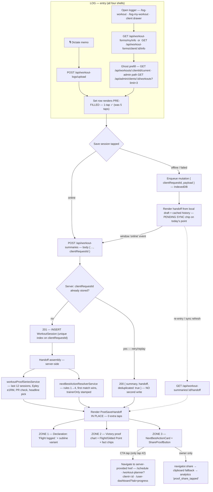

# Kimi K3 — Front-End / Design Review

**Reviewer:** OpenRouter `moonshotai/kimi-k3` (effort: medium)
**Document:** docs/ai-workflow/AI-HANDOFF/KIMI-CORE-PRODUCT-SURFACES-REVIEW-PACKET-2026-07-17.md
**Seed:** docs/ai-workflow/AI-HANDOFF/KIMI-4.2-LOGGER-POST-SAVE-BLUEPRINT-2026-07-17.md
**Tokens:** 14795 in / 16000 out · **Cost:** ~$0.2844 · **Wall:** 491.9s

---

## (e) MERMAID FLOWCHART — upgraded log → save → proof → next-action → share

Decisions baked in: the NBA is computed **server-side inside the save** (zero extra round-trip), and re-exposed at `GET /api/workout-summaries/:id/handoff` for re-entry, offline-sync refresh, and the 4.11 seam.



---

## (f) WIREFRAMES

### f.1 — 375px, LOGGER ENTRY (floor-first; sticky save; 44px+ targets)

```
┌───────────────────────────────┐ 375 × 100dvh — Obsidian bg
│ ‹  Log workout          ⏱ 04:12│ 56px header · Carbon · rest-timer chip (Fira tabular)
│ Client #4821 · Tue · Push B    │ 28px context strip — TRAINER/ADMIN/MODAL shells only
├───────────────────────────────┤
│ BARBELL BACK SQUAT        📖  │ Sora 600 1rem · 📖 = NASM rolodex, 44px
│ ┌───────────────────────────┐ │
│ │ SET 3   225 LB  ×  5  [ ✓ ]│ │ ← GHOST ROW: pre-filled from last session.
│ │ last Tue · 225×5 · ± step │ │   Fira 1.375rem tabular · ✓ = 48px Ice Wing.
│ └───────────────────────────┘ │   TAP ✓ = SET LOGGED (1 tap, was 5)
│ ✓ SET 2  225×5   ✓ SET 1 225×5│ logged rows collapse to 44px chips
│ ＋ Add exercise      🎙 Dictate│ two 48px ghost buttons
│ ┌───────────────────────────┐ │
│ │ 💬 Correctives — right knee │ │ corrective panel slot (pain-linked), collapsible
│ └───────────────────────────┘ │
├───────────────────────────────┤
│ [  Save session · 3 exercises ]│ STICKY 56px primary dual-glow
└───────────────────────────────┘ (Royal Depth bg → Wing Purple glow)
```
Empty state: no plan today → H2 "Open mat." + *"Log anything — the chart starts where you start."* + `Browse exercises` CTA. Loading: 3 shimmer rows (Graphite→Carbon, 1200ms). Error: "Couldn't load today's form — Retry" (Retry = 48px).

### f.2 — 375px, POST-SAVE HANDOFF (replaces logger in place; one scroll = one screen)

```
┌───────────────────────────────┐
│        Flight logged.          │ ZONE 1 — H1 Jakarta 700
│  A new personal best — +7 lbs  │ Cormorant Italic, Frost 80%
│  over your previous mark.      │
├───────────────────────────────┤
│ EST. 1-REP MAX · BARBELL BACK  │ ZONE 2 — eyebrow, Arctic Cyan
│ SQUAT · LAST 12 SESSIONS       │ (charts-only color, 0.75rem)
│              263               │ Fira tabular, GILDED FERN (PR)
│               ░▒ gold pulse ×3 │ 3×600ms radial pulse → static glow
│ VOL 6,840 LB · 5 EXERCISES ·   │ fact chips, Fira 0.875rem
│ 52 MIN                         │
│ ╭───────────────────────────╮  │
│ │        ▄▂▃▅▆▅▇█●  220px   │  │ Victory area+line, Arctic Cyan
│ │  ─────────────────────    │  │ Gilded Point r=8 = today
│ ╰───────────────────────────╯  │
├───────────────────────────────┤
│ NEXT BEST ACTION               │ ZONE 3 — eyebrow, Ice Wing
│ ┌▌ Next up: Pull day — Wed 6a  │ Graphite card, 3px Ice Wing rail
│ │ [   View next workout     ]  │ 48px primary dual-glow CTA
│ └──────────────────────────┘  │
│ [      Share this win       ]  │ 48px secondary (Wing Purple→Ice Wing glow)
│ Branded proof cards — coming   │ Sora 0.75rem Gilded Fern
│ soon for Pro.                  │
│            Done                │ 44px text button → onDismiss()
└───────────────────────────────┘
```
Offline variant: identical, plus `PENDING SYNC` chip (Graphite bg, Ice Wing 1px border, Sora 0.6875rem) pinned over the chart's top-right. First-session variant: single Flight Point, subline "First flight on record…", chips omit VOL if null. Handoff-fetch-failure variant: build proof locally from draft+cache (same code path as offline) — **no dead-end state exists.**

### f.3 — 1440px, LOGGER ENTRY

```
┌──────────────────────────────────────────────────────────────────────────────────┐
│  1440 — Obsidian backdrop · intentional canvas max-width 1120px, centered          │
│ ┌──────────────────────────── 1120px canvas ───────────────────────────────────┐ │
│ │ ‹ Log workout                                       ⏱ 04:12 · 🎙 Dictate      │ │ 64px header
│ │ Client #4821 · Tue · Push B                                                   │ │
│ ├──────────────────────────────── 640px ────────────────┬───── 420px rail ──────┤ │
│ │ BARBELL BACK SQUAT                              📖    │ REST TIMER            │ │
│ │ ┌───────────────────────────────────────┐             │  ┌─────────────────┐  │ │
│ │ │ SET 3   225 LB × 5              [ ✓ ]  │ ← ghost row │  │      01:30      │  │ │
│ │ │ last Tue · 225×5 · ± steppers         │   64px tall │  │  Fira 3rem tab  │  │ │
│ │ └───────────────────────────────────────┘             │  │ [+15][−15][skip]│  │ │
│ │ ✓ SET 2 225×5   ✓ SET 1 225×5                         │  └─────────────────┘  │ │
│ │ ＋ Add exercise                                       │ NASM ROLODEX          │ │
│ │                                                       │ CORRECTIVES — R knee  │ │
│ ├───────────────────────────────────────────────────────┴───────────────────────┤ │
│ │ [              Save session · 3 exercises              ] 56px, max-w 640px    │ │
│ └───────────────────────────────────────────────────────────────────────────────┘ │
└──────────────────────────────────────────────────────────────────────────────────┘
```

### f.4 — 1440px, POST-SAVE HANDOFF (two-column; zone order preserved: declaration leads)

```
┌──────────────────────────────────────────────────────────────────────────────────┐
│  Obsidian backdrop · 1120px canvas · handoff card Carbon, 24px radius              │
│ ┌────────────────────────── 480px ────────────────┬────────── 560px ────────────┐ │
│ │                                                 │ EST. 1-REP MAX · BARBELL    │ │
│ │            Flight logged.                       │ BACK SQUAT · LAST 12        │ │
│ │  A new personal best — +7 lbs over your         │ SESSIONS                    │ │
│ │  previous mark.                                 │              263   (Gilded) │ │
│ │                                                 │ VOL 6,840 LB · 5 EX · 52MIN │ │
│ │  NEXT BEST ACTION                               │ ╭─────────────────────────╮ │ │
│ │  ┌▌ Next up: Pull day — Wed 6a                  │ │                         │ │ │
│ │  │ [    View next workout     ] 48px            │ │   Victory chart 320px   │ │ │
│ │  └──────────────────────────┘                  │ │   ▄▂▃▅▆▅▇█●            │ │ │
│ │  [         Share this win         ] 48px       │ │                         │ │ │
│ │  Branded proof cards — coming soon for Pro.    │ ╰─────────────────────────╯ │ │
│ │              Done (44px)                       │                             │ │
│ └─────────────────────────────────────────────────┴─────────────────────────────┘ │
└──────────────────────────────────────────────────────────────────────────────────┘
```
Loading: chart skeleton block + two shimmer bars (left column), 300ms fade-in on resolve. ≥1600px: canvas hard-capped at 1120px, backdrop holds Obsidian + faint Ice Wing radial vignette (opacity 0.04) — never a full-bleed 2560px chart.

---

## (g) FILE-BY-FILE BUILD ORDER

**Build step 0 — pre-flight (blocking).** `git fetch && git checkout -b feat/logger-post-save-handoff origin/main` → verify `git merge-base --is-ancestor origin/main HEAD && echo BASE-OK`.
**AC #1 for EVERY file below (inherited, non-waivable): branch base = `origin/main`, `git merge-base` proof in PR description.** R2 check: field shapes used here (`WorkoutSession{ id, userId, clientRequestId, startedAt, durationMin }`, sets via `WorkoutLog`/`WorkoutExercise`) must match Opus's §2 canonical data contract; on conflict, **the contract wins and this blueprint's field names adapt** — additive-only, no renames of live columns.

Global token law (referenced as **TOKENS** below): all color via `var(--name, #fallback)` scoped by `LoggerTokenScope`; approved measured pairs — Frost White on Royal Depth **13.3:1** (CTA), Ice Wing on Graphite **8.4:1** (rails/labels), Arctic Cyan on Carbon **6.7:1** (eyebrow), Gilded Fern on Carbon **8.0:1** / on Graphite **7.5:1** (PR numeral, microcopy ≥16px or 0.75rem bold only), **Wing Purple banned as body text (4.33:1 — glow/fill only)**. Motion: transform/opacity only; `prefers-reduced-motion` → static designed state.

---

### BATCH A — backend contract (build first; frontend mocks against it)

**A1 · `backend/migrations/20260718000000-add-clientrequestid-to-workout-session.cjs`** (≤60L, NEW)
- Up: add `clientRequestId STRING(64) NULL` to `WorkoutSessions`; unique partial index `workout_sessions_client_request_id_unique` (`WHERE "clientRequestId" IS NOT NULL`; on SQLite plain unique index — NULLs exempt). Down: drop index + column.
- AC: migrate up/down clean on Postgres + SQLite; duplicate insert of same `clientRequestId` raises unique violation; existing rows untouched (NULL).

**A2 · `backend/services/workoutProofSeriesService.mjs`** (≤170L, NEW)
```js
export async function buildProofSeries({ targetUserId, summary, trx })
// → { exerciseId, exerciseName, points:[{sessionId,dateISO,e1rm,isToday}],
//     todayE1rm, pr, prDeltaLbs, totalVolumeLbs, exerciseCount,
//     durationMin, sessionsThisWeek }
```
- Rules: proof exercise = today's highest-volume exercise with ≥3 prior logged sessions, else today's highest-volume exercise; e1RM = Epley `round(weight × (1 + reps/30))` of each session's top set; window = last 12 sessions incl. today; `pr = todayE1rm > max(all prior e1rm for that exercise)` (all-time, not window); `prDeltaLbs = todayE1rm − priorBest`; `sessionsThisWeek` = ISO-week count; `streakWeeks` = consecutive weeks incl. current with ≥3 sessions.
- AC (unit): seeded 12-session fixture → correct series; ties in volume → earlier-listed exercise wins; <3 priors → fallback branch; first-ever session → single point, `pr:false`; zero real-data substitutes, no fabrication when history empty.

**A3 · `backend/services/nextBestActionResolverService.mjs`** (≤180L, NEW)
```js
export async function resolveNextBestAction({ viewerRole, viewerUserId, targetClientId, summary, trx })
// → { kind:'ADJUST_PLAN'|'DO_NEXT_WORKOUT'|'RECOVERY_FLEXIBILITY'|'VIEW_PROGRESS',
//     title, body?, ctaLabel, href, trainerOnly:boolean }
```
- Evaluate **in order, first match wins** (exactly (d)'s rules): **1)** role ∈ {trainer, admin} ∧ targetClientId ∧ (missed ≥1 prescribed top set today ∨ 14-day adherence < 60%) → `ADJUST_PLAN`, title `"Client #{targetClientId} needs a plan adjustment"`, cta `Open planner`, href `/workout-planner?client={id}`, `trainerOnly:true`. If no active plan exists, rule 1 is skipped (cannot evaluate honestly). **2)** viewer's next `Session` within 48h → `DO_NEXT_WORKOUT`, title `Next up: {dayName}`, cta `View next workout`, href `/schedule`. **3)** `sessionsThisWeek ≥ plan.frequency` → `RECOVERY_FLEXIBILITY`, title `Recovery day tomorrow`, body `10-minute flexibility flow — your joints earned it.`, cta `Open flexibility flow`, href `/stretching`. **4)** fallback `VIEW_PROGRESS`, title `See your progress`, cta `Open progress`, href `/user-dashboard?tab=progress`.
- Hard rule in code: `if (viewerRole === 'client') assert(!result.trainerOnly)` — server can never emit a plan decision to a client.
- AC (unit): fixture per rule; precedence proven (rule 1 beats 2 when both match); client role → `trainerOnly:false` invariant test; adherence boundary 59%/60%; copy strings asserted byte-exact, lexicon scan passes ("flexibility", never banned terms).

**A4 · `backend/routes/workoutSummaryRoutes.mjs` + `workoutSessionController` (MODIFY)**
- POST handler: wrap create in transaction; pre-check `WorkoutSession.findOne({ where:{ clientRequestId } })` → if found, return `200 { summary, handoff, deduplicated:true }`; else create → `handoff = { headline, headlineVars, proof, nba, share, pendingSync:false }` assembled from A2+A3 → `201 { summary, handoff }`. `share = { eligible: targetUserId === viewerUserId, reason: 'owner'|'not-owner' }`. `headline` pick: `pr → 'pr'`; else `sessionsThisWeek ≥ 3 → 'streak'`; else `sessionsThisWeek === 1 && lifetime === 1 → 'first'`; else `'default'`.
- NEW route: `GET /api/workout-summaries/:id/handoff` — authz: owner, or trainer/admin with an active `ClientTrainerAssignment`; 404 otherwise. Rebuilds the same payload (proof from live history, NBA re-resolved).
- AC: replayed POST (same `clientRequestId`) → 200, `deduplicated:true`, exactly ONE row; handoff present on both 200/201; GET returns identical shape; unauthorized GET → 404 (not 403 — no existence leak); route file ends ≤300L (assembly lives in the controller/service, route stays thin).

**A5 · `backend/tests/workoutHandoff.test.mjs`** (≤260L, NEW) — integration: save→handoff shape; idempotent replay; NBA precedence; share eligibility matrix (self vs trainer-for-client); offline-replay simulation (two POSTs, one row). AC: suite green in CI.

---

### BATCH B — frontend pure modules (no JSX; fully unit-tested)

**B1 · `frontend/src/components/WorkoutLogger/core/workoutLogger.types.ts`** (≤190L, NEW) — single type source for core + handoff + shells:
```ts
export type LoggerRole = 'client' | 'trainer' | 'admin';
export interface LoggedSet { setId: string; exerciseId: string; weightLbs: number|null; reps: number|null; completedAt: string; isTopSet: boolean; }
export interface GhostSuggestion { sourceSessionId: string; weightLbs: number|null; reps: number|null; loggedAgoLabel: string; }
export interface ExerciseDraft { exerciseId: string; name: string; sets: LoggedSet[]; ghost: GhostSuggestion|null; }
export interface SessionDraft { clientRequestId: string; exercises: ExerciseDraft[]; startedAt: string; durationMin: number|null; source: 'manual'|'voice'|'hybrid'; }
export interface ProofPoint { sessionId: string; dateISO: string; e1rm: number; isToday?: boolean; isPendingSync?: boolean; }
export interface ProofSeries { exerciseId: string; exerciseName: string; points: ProofPoint[]; todayE1rm: number;
