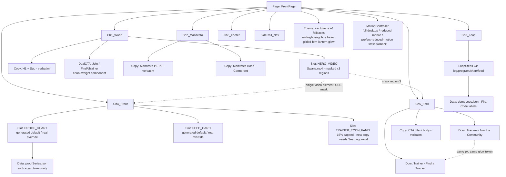

# Kimi K3 - Review

**Reviewer:** `moonshotai/kimi-k3` (high)
**Document:** C:/tmp/sspt-atelier-studio/scripts/design-brain/atelier/frontpage/DESIGN-BRIEF-8-RUN.md
**Seed:** (none)
**Tokens:** 2025 in / 4404 out | **Cost:** ~$0.0721 | **Wall:** 174.1s | **finish_reason:** stop

---

## 7a — Concept Directions

```json
[
  {
    "id": "dawn-approach",
    "nav_model": "no-nav-until-scroll (logo only in hero; slim top bar fades in after chapter 1)",
    "hero_mechanics": "Swans.mp4 plays full-bleed at dawn light; swans drift left-to-right across a still lake while three parallax layers of distant human silhouettes (a lifter, a runner, a stretching pair) move at 0.2x/0.5x/0.8x scroll speed; scrolling pushes the camera toward the nearest figure until it resolves into a real-photo human moment at chapter 2.",
    "chapter_count": 6,
    "grid": "12col-asymmetric-8-4 (manifesto text on 8, gold rule + pull-quote on 4)",
    "volume": "quiet",
    "lighting": "dawn (deep-night sapphire base warming to amber horizon by chapter 3)",
    "anti_specs": [
      "no autoplaying UI demos or product screenshots above the fold",
      "no card grids anywhere in the first three chapters",
      "no parallax layer may move faster than scroll (nothing 'pops')"
    ],
    "phenomenon": "The lake reflection of the swans is a live-inverted, blur-shifted duplicate of the video layer, so the water 'responds' to the footage without a second asset.",
    "tradeoff": "Weakest at trainer recruitment — the mood is so trainee-emotional that the business case (15%, tools) lands late and soft."
  },
  {
    "id": "two-lanterns",
    "nav_model": "side-rail-left (vertical chapter dots labeled WORLD/MANIFESTO/LOOP/PROOF/FORK, collapses to bottom bar on mobile)",
    "hero_mechanics": "Swans.mp4 is cropped into a tall central 'river' column flanked by two equal glowing door-panels (Join the Community / Find a Trainer) that brighten like lanterns as the swans pass behind them via a shared masked video layer.",
    "chapter_count": 6,
    "grid": "12col-symmetric-6-6 with a persistent 2col center gutter reserved for the swan river",
    "volume": "people-first",
    "lighting": "warm-amber-in-blue (gilded-fern lantern glow on midnight sapphire)",
    "anti_specs": [
      "refuses to let either CTA ever appear without the other within the same viewport",
      "no full-width media — everything is split by the center river",
      "no Cormorant drama type outside the manifesto chapter"
    ],
    "phenomenon": "One video element is CSS-masked into three disjoint regions (hero river, mid-page slit, fork backdrop) so a single swan appears to swim continuously down the entire page.",
    "tradeoff": "Worst cinematic range — the rigid split-grid caps how big any single moment can get; THE PROOF chapter feels cramped."
  },
  {
    "id": "glass-console",
    "nav_model": "floating-dock (bottom-center pill dock: World / Loop / Proof / Join / Train, appears after hero)",
    "hero_mechanics": "Swans.mp4 plays inside a frosted-glass 'viewport' framed like a live camera feed with Fira Code telemetry (heart-rate, reps, streak days) ticking at the edges; on scroll the glass viewport shrinks and docks into THE LOOP chapter as the actual product UI, revealing the footage was the product's data all along.",
    "chapter_count": 6,
    "grid": "12col-product-5-7 (copy 5, live UI mock 7, alternating)",
    "volume": "product-forward",
    "lighting": "cold-crystalline (ice-wing on obsidian, arctic-cyan charts, minimal gold)",
    "anti_specs": [
      "no human photography larger than avatar size until THE FORK",
      "no Cormorant anywhere — drama is carried by data, not serif",
      "no ambient particle effects; every moving pixel must represent real logged data"
    ],
    "phenomenon": "The hero telemetry numbers are the same dataset that animates the charts in THE PROOF — one JSON object drives both, so the page's data feels continuous, not decorative.",
    "tradeoff": "Coldest emotionally — the manifesto's 'never sells you out' warmth fights the console aesthetic; risks reading as the exact SaaS-hero the taste log killed."
  },
  {
    "id": "vegas-mile",
    "nav_model": "no-nav-until-scroll, then a marquee-style top strip with chapter names in lit-bulb styling",
    "hero_mechanics": "Full-cinematic: Swans.mp4 is the marquee of a nighttime boulevard; each chapter is a 'block' of the street with its own lighting state, and scrolling travels down the boulevard as neon signs (the verbatim copy) flicker on in sequence, ending at two equal doorways side by side, both open, both lit.",
    "chapter_count": 6,
    "grid": "12col-chaotic (each chapter declares its own sub-grid: 9-3, 4-8, 12, 6-6, 7-5, 12)",
    "volume": "full-cinematic",
    "lighting": "deep-night (obsidian base, wing-purple + ice-wing neon, gilded-fern as 'warm window light')",
    "anti_specs": [
      "no flat section backgrounds — every chapter has a lighting state, not a color",
      "no identical dividers; chapters are separated by 'street crossings' (scroll-bound light sweeps)",
      "no more than one neon sign illuminated per viewport (restraint clause)"
    ],
    "phenomenon": "Neon signs cast real-time blurred color reflections onto a 'wet pavement' gradient layer that shifts with scroll velocity — the street feels rained-on and alive.",
    "tradeoff": "Highest perf risk and worst reduced-motion fallback — strip the scroll-binding and it collapses into the 14-equal-sections sin it was built to cure."
  }
]
```

## 7b — Hostile Review

**The brief is in love with the hero and silent about the business.** Six chapters, four lighting moods, scroll-bound swans — and the single most important sentence on the page, "we take 15%, capped, no monthly fee," has no chapter, no slot, no copy. THE FORK is supposed to recruit trainers with a verbatim CTA body that says "Your trainer deserves a fair platform" and *never says what fair means*. A trainer landing here gets vibes and a door. Vibes don't beat Mindbody's pricing page. Every one of the eight designs will fail the trainer door the same way unless someone writes `[new copy - needs Sean approval]` for the 15% economics — and the brief's own copy rules make that terrifying to do, so nobody will.

**"One story, two EQUAL doors" is a design slogan, not a user truth.** A trainee and a trainer have zero shared intent after about 200px of scroll. Forcing equal visual weight through five chapters means one of two outcomes: the trainee story is diluted with business talk (kills conversion), or the trainer content is compressed into a token panel that *performs* equality while saying nothing (kills recruitment and insults D3). The brief mandates the fork be LATE and EQUAL but never reconciles that with the fact that the two audiences need different proof: trainees need before/after human evidence, trainers need a calculator. There is no calculator chapter.

**D8 will collapse on real hardware.** "Deep parallax, real light/weather/depth, people small and impressionistic in far/mid layers" — that's 4-6 composited layers plus a full-bleed video. On a mid-tier Android over LTE this is a 9-second LCP and a janky scroll, and "motion scales to device, reduced elsewhere" is doing enormous unexamined work. The reduced version of a scroll-bound cinematic page is a static page with a video on top — i.e., the design *is* the motion, and the fallback is a different, worse website nobody is designing. Who designs the reduced-motion version of vegas-mile? Nobody. It'll ship as an afterthought.

**Swans.mp4 is load-bearing and untested as such.** "KEPT, always, the hero asset" — fine, but the brief never states its duration, aspect, weight, or whether it loops cleanly. Four of my own directions above assume things about it (maskable into slits, reflection-duplicable, croppable to a river column) that a 16:9 drone shot of two swans may simply not support. Eight designs built on an uninspected asset is eight designs built on sand.

**The manifesto is a landmine the brief treats as a feature.** ¶1 attacks the food industry, social media, gaming companies, and healthcare — on a page whose job is to convert a person who googled "personal trainer near me." That's a 26-second scroll of grievance before anyone mentions training. It may be authentic to Sean; it is also a bounce-rate machine sitting in chapter 2 of 6. Nobody in this run is allowed to say that, because the copy is VERBATIM. So all eight designs will polish the typography of a paragraph that shouldn't be on a landing page.

**"Violently different sizes and rhythms" + "6 chapters" + "equal doors" is an over-constrained system.** Something gives. In practice it'll be THE PROOF — charts from real logged data require real data, which doesn't exist for a page that needs to look good in a screenshot review. Every design will fake the charts with plausible dummy data, the owner will approve the artboard, and the shipped page will either ship the fake data (community-first promise: broken) or ship empty states (design: broken).

**The palette fights the brief.** "Warm, homey, luxury for everybody" with a fixed palette that is five blues, a purple, and two near-blacks, plus one gold. Dark-first sapphire is corporate-nocturnal by default; "homey" has to be smuggled in through one `#C6A84B` token and Cormorant Italic. Half the eight designs will drift cold-corporate (glass-console already has) and get killed in review for a sin the palette committed.

**D9's "generated default always present" is an AI-slop factory.** Named swappable slots are good engineering. But "generated default" for *people* imagery on a platform whose entire pitch is "real connection, never sells you out" is a brand contradiction waiting for one eagle-eyed screenshot on Twitter. Generated swans: fine. Generated impressionistic humans in the mid-layer: defensible. Generated faces anywhere near THE PROOF: fatal.

## 7c — Blueprints: `two-lanterns` (strongest direction)

Chosen because it's the only direction that structurally enforces D3 (equal doors) instead of decorating it, and its single-video-mask trick is the cheapest cinematic effect of the four.

### Desktop wireframe (1440)

```
┌──────────────────────────────────────────────────────────────────────────┐
│ RAIL │                                                                   │
│      │   CH1 THE WORLD (100vh)                                          │
│  ●   │  ┌────────────────────┐ ║river║ ┌────────────────────────────┐   │
│  W   │  │ H1: Health First.  │ ║ swan║ │  [Join the Community]      │   │
│  o   │  │ Community Always.  │ ║ swims║  [Find a Trainer]          │   │
│  r   │  │ Sub (verbatim)     │ ║  L→R║ │  ← equal glow, both lit →  │   │
│  l   │  └────────────────────┘ ║     ║ └────────────────────────────┘   │
│  d   │                                                                   │
│  ○   │── street crossing: horizontal gold light sweep ──────────────────│
│  M   │   CH2 THE MANIFESTO (140vh — TALL, this is the peak)             │
│      │  ┌──────────────┐ ║     ║ ┌──────────────────────────────────┐  │
│      │  │ Cormorant:   │ ║swan║ │ ¶1 verbatim                      │  │
│      │  │ "Built by a  │ ║cont.║ │ ¶2 verbatim                      │  │
│      │  │  trainer..." │ ║     ║ │ ¶3 verbatim                      │  │
│      │  └──────────────┘ ║     ║ └──────────────────────────────────┘  │
│  ○   │── crossing ─────────────────────────────────────────────────────│
│  L   │   CH3 THE LOOP (70vh — short, fast)                              │
│      │  [log]→[program]→[chart]→[feed]  4-step horizontal, Fira Code   │
│  ○   │── crossing ─────────────────────────────────────────────────────│
│  P   │   CH4 THE PROOF (90vh)                                           │
│      │  ┌─chart (arctic cyan)─┐ ║slit║ ┌─milestone feed card─┐         │
│      │  │ real logged data    │ ║swan║ │ "saved to my feed"  │         │
│      │  └────────────────────┘ ║    ║ └────────────────────┘         │
│  ○   │── crossing ─────────────────────────────────────────────────────│
│  F   │   CH5 THE FORK (100vh)                                           │
│      │  ┌─────────────┐ ║river║ ┌─────────────┐                        │
│      │  │ TRAINEE DOOR│ ║opens║ │ TRAINER DOOR│  identical px, glow   │
│      │  │ Join the... │ ║     ║ │ 15% capped  │  [new copy - needs    │
│      │  │             │ ║     ║ │ [approval]  │   Sean approval]      │
│      │  └─────────────┘ ║     ║ └─────────────┘                        │
│      │   CTA title + body (verbatim) spanning both doors                │
│      │   CH6 FOOTER (30vh — rest)                                       │
└──────────────────────────────────────────────────────────────────────────┘
```

### Mobile wireframe (390)

```
┌─────────────────────┐
│ CH1 (100vh)         │
│ ┌─────────────────┐ │
│ │ Swans.mp4 top   │ │
│ │ 40vh crop       │ │
│ ├─────────────────┤ │
│ │ H1 + Sub        │ │
│ │ [Join the Comm] │ │
│ │ [Find a Trainer]│ │ ← stacked, equal height, equal glow
│ └─────────────────┘ │
│ ── light sweep ──   │
│ CH2 MANIFESTO       │
│ ¶1 ¶2 ¶3 (single    │
│ col, Cormorant      │
│ pull-quote between) │
│ ── sweep ──         │
│ CH3 LOOP: vertical  │
│ 4-step timeline     │
│ ── sweep ──         │
│ CH4 PROOF: chart    │
│ full-width, feed    │
│ card below          │
│ ── sweep ──         │
│ CH5 FORK:           │
│ ┌─────────────────┐ │
│ │ TRAINEE DOOR    │ │
│ ├─────────────────┤ │
│ │ TRAINER DOOR    │ │ ← same height, same order every visit
│ └─────────────────┘ │
│ CTA title + body    │
│ CH6 FOOTER          │
│ [bottom bar: W M L  │
│  P F dots]          │
└─────────────────────┘
```

### Flowchart — both audiences

```
                        ┌──────────────┐
                        │  LAND: CH1   │
                        │ swans + H1   │
                        └──────┬───────┘
                               │ scroll (or door click)
                        ┌──────▼───────┐
                        │ CH2 MANIFESTO│
                        └──────┬───────┘
                               │
              ┌────────────────┴────────────────┐
              │ intent signal: which door       │
              │ hovered/tapped first?           │
              └───────┬───────────────┬─────────┘
                      │               │
        TRAINEE PATH  ▼               ▼  TRAINER PATH
   ┌──────────────────────┐  ┌──────────────────────┐
   │ CH3 LOOP framed as:  │  │ CH3 LOOP framed as:  │
   │ "your workouts, your │  │ "your clients, your  │
   │  charts, your feed"  │  │  programs, your pay" │
   └──────────┬───────────┘  └──────────┬───────────┘
              │                          │
   ┌──────────▼───────────┐  ┌──────────▼───────────┐
   │ CH4 PROOF: progress  │  │ CH4 PROOF: same chart│
   │ chart + milestone    │  │ + 15% capped panel   │
   │ feed card            │  │ [new copy - approval]│
   └──────────┬───────────┘  └──────────┬───────────┘
              │                          │
              └───────────┬──────────────┘
                          ▼
                ┌──────────────────┐
                │ CH5 THE FORK     │
                │ both doors equal │
                └───┬──────────┬───┘
                    │          │
          ┌─────────▼──┐  ┌────▼─────────┐
          │ Join the   │  │ Find a       │──► trainer lands on
          │ Community  │  │ Trainer      │    recruitment page
          │ → signup   │  │ → marketplace│    (off-page, D10)
          └────────────┘  └──────────────┘
        (either door re-opens the other; no dead ends)
```

### Mermaid — component/data structure


