# Kimi K3 - Review

**Reviewer:** `moonshotai/kimi-k3` (high)
**Document:** C:/tmp/ss-coach-gate0-20260812/docs/ai-workflow/AI-HANDOFF/KIMI-PACKET-5-SKILL-BLUEPRINT-2026-08-13.md
**Seed:** (none)
**Tokens:** 2145 in / 21806 out | **Cost:** ~$0.3335 | **Wall:** 725.0s | **finish_reason:** stop

---

# The external-model packet skill

**The invariant, stated once:** *The model's context contains the real artifact — provably, mechanically — or the call does not happen.* Inline bytes for the API lane, verified-read for the chat lane. Same invariant, two mechanisms, and the skill refuses to treat them as the same operation.

The design principle underneath everything below: **prose exhorts, scripts enforce, lint exposes, history explains why.** A rule that can be mechanical and isn't will become decorative. Rules that can't be mechanical are labeled as judgment calls so nobody mistakes green for true.

---

## 1. Mermaid flowchart

```mermaid
flowchart TD
    A["Invoke: any outbound model call<br/>incl. Hermes local or cloud"] --> B{"Gate 0: selftest fresh<br/>and canaries red-to-green?"}
    B -- "stale / red" --> R15["REFUSE R15<br/>gates presumed broken<br/>nothing sends until fixed"]
    B -- "ok" --> C{"transport declared<br/>in manifest?"}
    C -- "no" --> R14["REFUSE R14<br/>no manifest = no send"]
    C -- "api" --> D1["resolve model id +<br/>context budget"]
    C -- "chat" --> D2["resolve brain: local or cloud<br/>token budget + session reserve floor"]
    D1 --> E["parse remit"]
    D2 --> E
    E --> F{"premises resolve?<br/>every named route, file,<br/>symbol found by grep"}
    F -- "phantom found" --> R05["REFUSE R5<br/>echo the phantom back<br/>review what exists"]
    F -- "all resolved" --> G{"remit asks about code?<br/>and code artifact planned?"}
    G -- "about code, no artifact" --> R04["REFUSE R4<br/>descriptions are not artifacts"]
    G -- "artifact planned or n/a" --> H["select artifacts<br/>each entry: path + lines + sha + why"]
    H --> I["extract verbatim by line range<br/>at build time, never retyped"]
    I --> J{"byte-verify: re-extract<br/>from repo and diff"}
    J -- "mismatch" --> R03["REFUSE R3<br/>print the diff<br/>someone hand-typed code"]
    J -- "clean" --> K["scan-secrets.sh + PII +<br/>absolute-path scan"]
    K -- "hit" --> R06["REFUSE R6<br/>list offending lines<br/>no silent auto-redact"]
    K -- "clean" --> L{"target reviewed before?<br/>grep reviews dir"}
    L -- "yes, and no settled digest" --> R11["REFUSE R11<br/>generate settled digest first"]
    L -- "no, or digest attached" --> M["attach calibration digest<br/>keyed by model id + task class"]
    M --> N{"which lane?"}

    N -- "api" --> O{"size within<br/>context budget?"}
    O -- "over" --> R01["REFUSE R1<br/>narrowing menu: per-file costs<br/>+ one-command cuts<br/>never summarize to fit"]
    O -- "fits" --> P["build packet +<br/>zero-call preflight"]
    P --> Q["STOP: render approval view<br/>worst-case usd, cumulative spend,<br/>delta since last send to this target"]
    Q --> S1["human runs send<br/>with --confirm-spend"]
    S1 --> T1["receive review<br/>findings ledger: every claim<br/>SOURCE-cited or INFERENCE + verify cmd"]
    T1 --> U["run verify commands<br/>on load-bearing claims"]
    U --> V["update calibration:<br/>hits AND misses or refuse update"]
    V --> W["commit packet + review + ledger<br/>review lint requires packet id"]

    N -- "chat" --> X{"wedge check:<br/>memo + artifacts + session reserve<br/>within brain budget?"}
    X -- "over" --> R02["REFUSE R2<br/>scoped sub-session<br/>or narrower artifact"]
    X -- "fits" --> Y{"artifact committed<br/>or sha256-pinned?"}
    Y -- "dirty and unpinned" --> R08["REFUSE R8<br/>commit it or pin the hash<br/>no 'read the current file' ambiguity"]
    Y -- "pinned" --> Z["write consult memo: remit,<br/>refs + sha, receipt protocol,<br/>probe QUESTIONS, label demands, expiry"]
    Z --> AA["STOP: operator relays memo id<br/>probe ANSWERS stay local, gitignored"]
    AA --> AB["model returns READ-RECEIPT<br/>before any finding"]
    AB --> AC{"verify-read.mjs:<br/>sha echo + probe answers<br/>exact match vs ground truth"}
    AC -- "fail" --> AD{"re-anchor once:<br/>re-point at exact sha"}
    AD -- "fail again" --> R09["REFUSE R9<br/>answer inadmissible<br/>fallback ladder: fresh scope /<br/>narrow / small inline excerpt /<br/>escalate to api lane"]
    AC -- "pass" --> AE["findings admissible"]
    AD -- "pass" --> AE
    AE --> AF{"findings inform an<br/>action-tier decision?"}
    AF -- "read-only tier" --> U
    AF -- "action tier" --> AG{"R13: every load-bearing<br/>claim verified?"}
    AG -- "unverified INFERENCE<br/>in the load path" --> AH["BLOCK the action<br/>run its verify commands first"]
    AG -- "verified" --> U
```



---

## 2. ASCII wireframes

### Outcome A1 — packet ready, API lane

```
+==========================================================================+
| PACKET READY - NOT SENT                           id: 2026-08-13-k07     |
+==========================================================================+
| lane: api-inline    model: moonshotai/kimi-k3     task-class: review     |
| target: calendar recurring-mutation paths                                |
+--------------------------------------------------------------------------+
| ARTIFACT MANIFEST  (byte-verified @ a1b2c3, re-extract diff: clean)      |
|   src/routes/calendar.mjs  L40-118   7.2k  sha 9f3e..  why: mutators     |
|   src/mw/adminOnly.mjs     L1-40     1.1k  sha 71c0..  why: gate code    |
|   src/lib/series.mjs       L200-260  2.4k  sha bb10..  why: bind step    |
|   extraction receipts: 3 blocks, all diff-clean [ok]                     |
+--------------------------------------------------------------------------+
| PREMISES    6 named entities, 6 resolved [ok]                            |
| SETTLED     4 items: 2 verified, 1 disproven, 1 asserted-unverified [ok] |
| CALIBRATION kimi-k3/review: digest attached, incl. 2026-08-13 1/3 miss   |
|             on prose packet (review-2) [ok]                              |
| SURFACES    5 named, all 5 strings present in artifact bytes [ok]        |
| HYGIENE     scan-secrets: clean | PII: clean | abs paths: none [ok]      |
| SIZE        11,420 chars <= 24,000 budget [ok]                           |
+--------------------------------------------------------------------------+
| PREFLIGHT (0 model calls)                                                |
|   status=preflight model_calls=0 model=moonshotai/kimi-k3                |
|   prompt_chars=11420 max_tokens=60000                                    |
|   worst_case_usd=$0.67 cap_usd=$3.00      today_so_far=$1.12             |
+--------------------------------------------------------------------------+
| >>> STOPS HERE. Spend approval is human.                                 |
| send:    node scripts/consult-kimi.mjs --document packets/2026-08-13-    |
|          k07.md --remit "..." --out reviews/2026-08-13-k07.md            |
|          --confirm-spend                                                 |
| rebuild: packet-build --id k07 --drop src/lib/series.mjs                 |
+==========================================================================+
```

### Outcome A2 — consult pack ready, chat lane (Hermes)

```
+==========================================================================+
| CONSULT PACK READY - NOT RELAYED                     id: h-2026-08-13-41 |
+==========================================================================+
| lane: chat-reference   brain: qwen3-local         task-class: review     |
+--------------------------------------------------------------------------+
| WEDGE CHECK   memo 0.9k + artifacts 12.6k + reserved session 6.0k        |
|             = 19.5k <= 24.0k usable ctx                                  |
|   reserve floor 6.0k enforced [ok]                                       |
+--------------------------------------------------------------------------+
| ARTIFACT REFERENCES (pinned)                                             |
|   src/routes/calendar.mjs  @sha256:9f3e..  L40-118  why: mutators        |
|   src/mw/adminOnly.mjs     @sha256:71c0..  full     why: gate code       |
|   state: both committed at a1b2c3 [ok]                                   |
+--------------------------------------------------------------------------+
| WRITTEN:  memos/consult/h-41.md                                          |
|   remit + refs+sha + receipt protocol + probe QUESTIONS                  |
|   + inference-label demand + named surfaces + settled/calib digest       |
|   + expiry: this memo dies when target sha moves                         |
| PROBES:   5 sampled (3 quote-exact [2 from named surfaces],              |
|           1 order-of-checks, 1 negative-space)                           |
|   ground truth -> out/probes/h-41.json   (GITIGNORED - never in repo)    |
+--------------------------------------------------------------------------+
| >>> STOPS HERE. Operator relays: "consult h-41".                         |
| Hermes must emit READ-RECEIPT before any finding.                        |
| verify:  node scripts/verify-read.mjs --id h-41   (paste receipt)        |
|   PASS -> findings admissible                                            |
|   FAIL x2 -> REFUSAL R9: answer inadmissible, fallback ladder            |
+==========================================================================+
```

### Outcome B — blocked (both lanes share this shape)

```
+==========================================================================+
| BLOCKED - NO PACKET WRITTEN                          id: 2026-08-13-k08  |
+==========================================================================+
| R1 SIZE      41,300 chars > 24,000 budget. cap-usd would clear; the      |
|              context budget is the binding constraint.                   |
| R5 PREMISE   remit names '/unblock' -- 0 hits in repo.                   |
|              reviewing phantoms is exactly how review-2 burned time.     |
+--------------------------------------------------------------------------+
| NARROWING MENU (sizes byte-verified)                                     |
|   [a] split by file: calendar.mjs alone = 18.9k -> fits                  |
|       cmd: packet-build --id k08 --only src/routes/calendar.mjs          |
|   [b] remit q2 only (recurring bind) = 9.7k -> fits                      |
|       cmd: packet-build --id k08 --remit-q 2                             |
|   [c] drop audit-log.mjs (not named by any premise) = -8.2k              |
| FIX R5: correct the remit term, or justify the phantom explicitly.       |
|                                                                          |
| The skill will NOT summarize to fit. Pick a cut. Nothing was sent.       |
| This refusal was logged to packets/refusals.log                          |
+==========================================================================+
```

Every refusal ships a menu with one-command next actions. A refusal without a next action is a bug in the skill, not the operator's problem — that is load-bearing, see §5 item 2.

---

## 3. Skill structure

```
skills/external-packet/
  SKILL.md                   # the law, front-loaded
  template.api.md            # hash-pinned packet skeleton
  template.consult-memo.md   # hash-pinned chat memo skeleton
scripts/
  packet-build.mjs           # builds, checks, emits manifest; nonzero exit = no packet
  verify-read.mjs            # chat-lane receipt checker against probe ground truth
  review-lint.mjs            # after-call: claims must be SOURCE-cited or INFERENCE+verify-cmd
  memo-sweep.mjs             # lists expired/stale consult memos (sedimentation tripwire)
  packet-selftest.mjs        # canaries that MUST fail the gates
packets/                     # built packets (committed)
reviews/                     # model outputs (committed, must cite packet id)
calibration/<model-id>.md    # per-model, per-task-class ledgers
out/probes/                  # probe ground truth (gitignored)
```

### SKILL.md sections — each item labeled **[M]** mechanical (script-enforced) or **[A]** advisory (judgment):

**1. Header / Invariant (first screenful, before anything else)**
Must contain: the invariant sentence; the owner's two settled decisions verbatim (refuse-over-summarize, stop-for-approval); the [M]/[A] legend; and the truncation guard — *"If you cannot see the line `END OF SKILL — 12 rules` at the bottom, this file was truncated; re-read before acting."* A skill consumed by agents is itself subject to the confabulation risk it governs. Dogfood it.

**2. When this fires** — any outbound model call: consult scripts, Hermes-local, Hermes-cloud, ad-hoc API use. Explicit statement: *answering about this repo's code from memory, through any transport, is the violation this skill exists to prevent.* **[A]** for detection, **[M]** for the manifest requirement once invoked.

**3. Lanes** — two mechanisms, one invariant; explicit statement that by-reference is not "a cheaper inline" but a different operation with different failure modes (sedimentation, wedge, unverified reads) and different refusals.

**4. Packet anatomy (API lane)** — mandatory sections, with their checks:
- *Remit*: question form + ranking criterion. **[A]**
- *Artifact manifest*: every entry = `{path, line-range, sha256, why}`. **[M]**: re-extract + diff each block; `why` non-empty and not in a stopword list ("context", "completeness", "FYI").
- *Premise resolution*: named entities grep-verified. **[M]**
- *Settled digest*: required when prior reviews for the target exist. **[M]**: digest cites review paths that exist; each item carries verdict `verified | disproven | asserted`.
- *Calibration digest*: from `calibration/<model-id>.md`, sliced by task class. **[M]**: cites ≥1 entry containing both a hit and a miss, or explicitly "first call, no record."
- *Named attack surfaces*: ≥1 concrete string that must appear verbatim in the artifact bytes. **[M]**
- *Inference-labeling demand*: fixed template text; template hash pinned. **[M]** — the demand that saved you in review-2 cannot be edited out.
- *Hygiene block*: secrets/PII/abs-paths scan results. **[M]**

**5. Consult memo anatomy (chat lane)** — remit, pinned refs, receipt protocol, probe questions, label demands, **expiry rule** (memo dies when target sha moves). **[M]** for pins, expiry, probes-present; **[A]** for remit quality.

**6. Proof-of-read protocol** — sampling rules, ground-truth handling, one retry, verdict format. Fully **[M]**.

**7. Refusal table** — §4 below, with codes. Every entry must name the operator's next action.

**8. After the call** — findings ledger format (claim ↔ SOURCE-citation or INFERENCE+verify-cmd ↔ verification status); calibration update procedure (**[M]** via `review-lint.mjs`: updates with zero misses while the ledger shows disproven findings are rejected); commit conventions; review→packet-id lint.

**9. Selftest** — canary suite and cadence (pre-push + monthly): a packet with a planted secret must be blocked; a packet with a hand-retyped line must be blocked; an oversize packet must be blocked; a known-good packet must pass. *A gate that cannot be made to fail is presumed failed.* **[M]**

**10. ROT WATCH** — §5 below, abridged, with tripwires. The skill carries its own autopsy-in-advance.

**11. SETTLED — do not re-litigate** — the owner's two decisions, **plus the four-call evidence table from this document, verbatim.** This is the skill's origin story and it is load-bearing (§5, item 10).

**12. END marker.**

---

## 4. Refusal conditions

You have size. Here is my independent list — grouped by when they fire, codes stable so refusals are greppable:

**Gate 0 — the gates themselves:**
- **R15 — gates presumed broken.** Selftest stale or canary red. Nothing sends. Default-deny on tooling failure, because a broken checker that exits 0 is the exact "technically green, substantively decorative" disease.

**Build-time, both lanes:**
- **R1 — oversize** (yours; API lane). Context budget binding even when cap-usd would clear.
- **R3 — provenance failure.** Any quoted code block fails byte-verification against the repo. Hand-typed or hand-"improved" code in a packet is the description failure wearing a fence.
- **R4 — no artifact.** Remit asks about code behavior and no code artifact is planned. This is the rule that makes review-2 structurally unrepeatable.
- **R5 — phantom premise.** Remit names a route/file/symbol that grep can't find (`/unblock`, today). Phantom premises produce confident reviews of systems that don't exist.
- **R6 — hygiene hit.** Secrets scanner, PII, absolute paths, DB-shaped material. Refuse with the offending lines listed. **No silent auto-redaction** — redaction can destroy exactly the lines being reviewed (auth code mentions tokens by nature). Sanitization is an operator decision, then re-run.
- **R7 — stale anchors.** Extraction receipts computed at a different commit than current target bytes. Re-extract with operator confirmation; never silently reuse.
- **R11 — re-review without settled digest.** Prior reviews exist for this target and the packet doesn't digest them. Without it you pay the model to re-derive settled ground and to re-report already-disproven findings.
- **R12 — template breach.** Mandatory section missing, emptied, or filled with placeholder ("settled: none" when grep finds three prior reviews; all `why` fields say "context").
- **R14 — undeclared transport or model.** No manifest, unknown model id with no budget on record. You cannot size-govern what you haven't measured.
- **R16 — over-inclusion.** Files included that no premise names, with vacuous `why`s. Flooding is just starvation's mirror: it buries the load-bearing bytes and reintroduces PII surface. (Warn first at 1 extra file; refuse at willful bulk.)

**Chat-lane specific:**
- **R2 — wedge.** Artifact tokens + memo + enforced session reserve > the specific brain's usable context. Detailed in §6(b).
- **R8 — unpinned dirty target.** "Read the current file" is ambiguous the moment the file changes mid-session. Commit it or sha256-pin the working copy and require the receipt to echo that hash.
- **R9 — unverified read.** Proof-of-read failed twice. The answer is inadmissible regardless of how confident it sounds. Fallback ladder: fresh scoped sub-session → narrower artifact → small byte-verified inline excerpt under the wedge threshold → escalate to API lane.

**Post-answer, chat lane (the call is fine; the *use* is refused):**
- **R13 — action-tier gate.** Findings inform a decision at or above the externally-visible effect tier while load-bearing claims remain `[INFERENCE]`. Block the action until their named verification commands have been run. A confabulated answer costing dollars is recoverable; one driving an irreversible operator action is the expensive version of review-2.

---

## 5. How this skill itself rots

This is the section that matters, so it gets the most space. Each entry: the rot, the *mechanism by which the gate stays green while dying*, and the tripwire.

**1. Section theater.** Every mandatory section present, every checkbox green, content hollow: "settled: none", "surfaces: general correctness", calibration "N/A". Presence validators can't detect vacuity. Mitigation: content validators with teeth — settled items must cite review paths that exist; surfaces must be literal strings found in the artifact bytes; calibration must quote an entry containing a miss. Then the honest admission, written into the skill: **these validators catch lazy emptiness, not plausible emptiness. The last 10% is operator audit — one packet read by a human, monthly, ritually.** Pretending otherwise is how you get decorative gates.

**2. Bypass economics.** This is the one that kills it. The transport is unchanged and you said so — `consult-kimi.mjs` accepts any `--document`. If refusal is frequent and the narrowing path is expensive, the operator (or a future agent "helping" the operator) routes around the skill, once, then habitually. You cannot prevent bypass without changing the transport; you can only make it *unnecessary* and *visible*. Unnecessary: every refusal ships a one-command narrowing menu, so compliance is the cheapest path. Visible: `review-lint` requires every file in `reviews/` to cite a packet id with a passing manifest; a review that names no manifest fails repo lint, and the bypass sits in git history forever. **Audit, not cryptography. If you find yourself wanting hard enforcement, the skill's economics are wrong — fix the menu, not the lock.**

**3. Refusal fatigue.** False refusals — stale-hash mismatches, probes that disagree because the file legitimately moved — teach the operator that refusals are noise. Alarm conditioning precedes the real failure sailing through. Tripwires: every mismatch refusal prints *both* hashes and the drift diff (a refusal the operator can't diagnose in 30 seconds will become an ignored refusal); the selftest measures false-block rate against known-good packets; the refuse:send ratio is logged monthly, and a spike is treated as a bug in the skill, not a sin by the operator.

**4. Proof-of-read Goodhart (chat lane).** Two versions. (a) If probes become predictable ("quote line 47"), the framework learns to emit receipt-shaped text; (b) the deeper one — **delivery ≠ attention**: Hermes reads the file to pass the probes, then answers the actual question from priors anyway. Tripwires: probes are sampled fresh per call from the actual bytes; at least two come from the seams named in the remit (passing requires having loaded the region that matters); at least one negative-space probe ("does this file contain X-that-plausibly-could"); probe answers exact-match checked by script, never vibe-judged by the operator; and attention is back-stopped by the findings format — every claim carries `path:line` or `[INFERENCE]` + verify command, linted by `review-lint`. Residual risk after all this: real. Named, accepted, mitigated by R13 for anything that drives action.

**5. Repo sedimentation — the chat lane's signature rot.** For the API lane the packet is explicit and ephemeral. For Hermes, **the repo itself is the packet** — and every stale memo, every outdated design note, every superseded review sitting in the ingest path is ambient packet content. Hermes will confabulate from *your own committed sediment* with perfect citation. The by-reference mechanism manufactures the description failure at scale and feeds it to the agent as received truth. Tripwires: consult memos carry expiry pinned to target sha; `memo-sweep.mjs` runs weekly, lists expired artifact-referencing memos, committed log; calibration files are the *only* permanent prose-about-code the skill permits, and they're keyed to model ids, not to the codebase's current state. This is the rot mode I'd bet on appearing first, because it requires no one's negligence — just the repo aging normally.

**6. Calibration propaganda.** The record inflates: hits get logged, misses get forgotten; eventually the digest primes flattery instead of caution. Worse, "verified REAL" is itself operator-judged and drifts. Tripwires: the update schema has mandatory hits AND misses fields, and `review-lint` rejects a zero-miss update when the findings ledger shows disproven claims; every digest quotes the model's *worst recent miss*, not just its score. The four-call table from this document ships as the seed, including review-2's 1-of-3 — that entry is the single most instructive line in the record.

**7. Mechanical-check rot.** The scripts themselves decay: secret patterns go stale, `verify-read.mjs` hits a Windows path-with-spaces bug and starts passing everything, extraction diffs silently skip binary-adjacent files. A broken gate exiting 0 is worse than no gate. Tripwire: the canary suite — a planted-secret packet, a hand-retyped-code packet, an oversize packet, a bad-sha receipt — *must* turn each gate red, run pre-push and monthly, results logged. Rule written in the skill: **a gate with no canary history is presumed broken. R15 fires.**

**8. Version drift.** The provider swaps weights under the id `moonshotai/kimi-k3`; the GPU box upgrades Qwen3; someone edits `template.api.md`. Calibration keyed to yesterday's brain is applied to today's. Tripwires: every manifest records model id, resolved-at date, skill self-hash, template hashes; unknown model id → first-call mode (smaller budget, mandatory proof-of-read even on lanes that could inline cheaply) until calibration exists; a template hash mismatch blocks the builder.

**9. Metric theater.** The evidence table's own columns become targets: operators start preferring calls that produce more "Findings." But review-3 produced 8 findings at 5/8 verified and review-1 produced 9 at "every claim I checked" — raw count anti-correlates with nothing and optimizes toward confident volume. Tripwire: the ledger binds every finding to a verification status permanently; unverified findings age into a **debt line** printed in every subsequent calibration digest; no call is ever summarized by raw count alone.

**10. Origin-story erasure — the terminal rot.** Two years from now the skill has been green for eighteen months. Someone — possibly an agent doing "skill hygiene" — concludes it's ceremony and deletes it, or strips SKILL.md down to a checklist. The violations that would justify it stopped happening *because of it*, which is indistinguishable from them never having been possible. There is no mechanical tripwire for this. The defense is the one you already know from your own history: the skill carries its origin story. The four-call table, the `/unblock` phantom, the `<b>`-tag injection that reassembled itself — embedded in §11 of SKILL.md, in evidence form, so the future reader doesn't have to trust the rule, they can see the receipt. **Delete the story and the skill becomes ceremony. Keep the story and a cold reader can re-derive the rule from the evidence in ninety seconds.**

**The keel of this section:** the skill cannot fully self-enforce, and §5 should say so in its own text. What it *can* do — what your decorative gates didn't — is make every green mean "a script verified bytes," make every bypass leave a git trail, make every refusal carry its own remedy, and keep its own failure modes written down where the next agent will read them before it reads anything else.

---

## 6. The three scope-addition questions, answered directly

**(a) How does the skill verify a by-reference delivery landed?**
Proof-of-read, four components, all mechanical:
1. **Sha-echo**: the receipt must report the sha256 of each file as read. Catches stale reads and partial reads against the pin.
2. **Sampled probes**: ≥5 per call, sampled fresh from the pinned bytes by the builder — quote-exact probes chosen for *distinctive* lines (a comment like `409 on both refusals so it is not an enumeration oracle` is unguessable from priors and trivial to string-match), one order-of-operations probe, one negative-space probe. At least two probes from the seams named in the remit.
3. **Deterministic verification**: ground truth computed at build time, stored in `out/probes/` which is **gitignored** — because Hermes reads the repo, committing answers hands the exam to the examinee. Questions travel in the memo; answers never do. Verdicts and receipts (sans answers) get committed for audit.
4. **Receipt-before-findings protocol**: findings are inadmissible until `verify-read.mjs` passes. One re-anchor retry, then R9.

Answering a probe correctly *requires* loading the artifact — so passing the probes is delivery. Attention is a separate problem and is backstopped by line-cited findings + R13, not by more probes. Don't conflate the two.

**(b) What is the chat-transport refusal condition for "too large"?**
"Too large to send" doesn't exist in this lane — nothing goes through Telegram but a memo id. The real constraint is **too large to load without evicting the session**: artifact tokens estimated for *that specific brain's* tokenizer (chars with a conservative divisor for the local model, no new infra) + memo + a hard session-reserve floor, against the brain's usable context. Over → R2, and the resolution is structural, not "cut a few lines": spin a **scoped sub-session** whose entire context is the memo pack + the artifact (nothing to wedge if there's nothing else in the brain), or narrow the artifact. The graduated ladder from R9 applies here too. The invariant survives the mechanism change precisely because the check moved from *bytes over the wire* to *working context at read time*.

**(c) Does the calibration record travel with the model, the transport, or the task class?**
**Identity: the model.** (Exact id, version-aware; a swapped brain forks the record.) **Slicing: the task class.** (Review vs. design vs. debugging — the evidence table is all review-class; don't let it speak for design.) **Transport: delivery only.** The record lives at `calibration/<model-id>.md`, sectioned by task class; what's *transported* is a digest — inline section for API packets, memo attachment for Hermes. Rationale: confabulation risk is a property of which brain answered what kind of question. Transport changes the *consequences* (dollars vs. operator decisions) and the *mechanics* (inline vs. reference), not the record. Note the corollary: "Hermes" never appears as a calibration key — its local brain and its cloud brain are separate records, because the same failure attaches to whichever one talked.

---

## Why a cold agent a year from now still can't send a description

Not because the prose told it to. Because:

1. The builder **cannot emit** a packet missing mandatory sections — template hashes are pinned, R4 has no override flag, provenance is byte-verified.
2. A review with no manifest **fails repo lint** — the bypass leaves evidence in git.
3. Canaries keep the gates honest, and a gate with no canary history **blocks everything** (R15) — the failure direction is closed, not open.
4. The chat lane's memo **expires with its target's sha** — sediment can't silently become the packet.
5. And SKILL.md §11 carries this document's evidence table, so the agent doesn't have to trust the rules — it can re-derive them from the receipts.

One honest closing caveat, since you asked about rot above all else: items 1–4 are mechanical and will hold. The operator-ritual parts — monthly packet audit, calibration honesty, not reflexively approving — are not, and no skill can make them so. The skill's job is to keep those rituals cheap, visible, and rare enough that they stay sharp.
