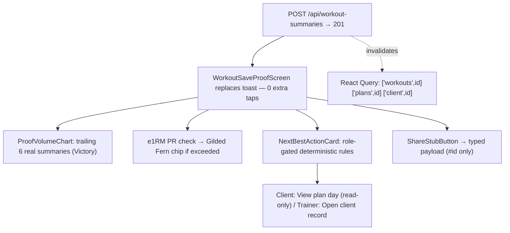

# Kimi K3 — Front-End / Design Review

**Reviewer:** OpenRouter `moonshotai/kimi-k3` (effort: medium)
**Document:** docs/ai-workflow/AI-HANDOFF/KIMI-CORE-PRODUCT-SURFACES-REVIEW-PACKET-2026-07-17.md
**Seed:** (none)
**Tokens:** 11735 in / 16000 out · **Cost:** ~$0.2752 · **Wall:** 503.6s

---

# KIMI K3 — WORKOUT SECTION: ENHANCEMENTS + IMPROVEMENTS REPORT

**Scope:** 4.2 Logger · 4.1/4.3 Planners · 4.4 Bootcamp + Sprint · Post-Save Handoff · client-dashboard touchpoints.
**Section verdict (one line):** SHIP-WITH-CHANGES — this is the strongest engineering in the product and the least-closed loop: real data, voice, offline, ghost-prefill, SSE sprints all exist; what's missing is the *handoff* (proof → next action → share) and *coherence* (4 loggers, 3 planners, 2 data models).
**Global acceptance criterion #1 for every build item below (Fable R1):** `branch base = origin/main`, verified by `git merge-base origin/main HEAD`. Per R2, the canonical data contract (`WorkoutSession`/`WorkoutPlan`/summary write paths) lands before Build #1 executes; this report binds to it.

---

## (a) THE SINGLE HIGHEST-LEVERAGE MOVE — "The Proof Screen" (Post-Save Handoff), specced

Fable R7 pre-assigns this as Build #1. This is its final spec — additive, no rebuild.

**What:** The instant `POST /api/workout-summaries` returns 201, the save toast is **replaced** by a full-screen proof moment, in all four logger shells. Zero extra taps. One screen, three things: real-data Victory proof, one next-best-action, one share stub. Until 4.11 ships, this screen is the canonical owner of the client's next-best-action (§5.11).

**Why it wins (Rule-62):** progress-proof + adherence (the save moment becomes the reward), coaching depth (trainer sees adherence delta), community/revenue (share stub is the milestone-artifact seam, §5.5). It converts the app's most-used moment into the product's thesis.

**Minimal-click:**
- "Save session → see proof": **before 4 taps** (Save → dismiss toast → nav → Progress) → **after 1 tap** (Save).
- "Log this set" (delivered in the same build, item #4 below): **before ~5 interactions + typing** → **after 1 tap** to confirm ghost values, +1 per stepper adjustment.

**375px wireframe (one viewport, 100dvh):**

```
┌─────────────────────────────────┐
│ ✓ Session saved.                │  Plus Jakarta Sans 700, clamp(24px,6vw,32px)
│                                 │
│ SESSION VOLUME                  │  Sora 11px, letter-spacing .12em, Ice Wing
│ 8,940 lb                        │  Fira Code 700, clamp(40px,11vw,56px), tabular
│                                 │
│ ┌─────────────────────────────┐ │
│ │      ▁  ▂  ▃  ▂  ▄  █      │ │  VictoryBar, last 6 sessions, h=160px
│ │     W1 W2 W3 W4 W5 NOW     │ │  prior = Arctic Cyan 40%, today = Ice Wing
│ └─────────────────────────────┘ │
│ ★ NEW PR — Trap Bar Deadlift    │  Gilded Fern chip (gold = PRs only), 16px bold
│   335 × 5 · est. 1RM 391 (+9)   │  Fira Code 14px tabular
│ ┌─────────────────────────────┐ │
│ │ NEXT UP                     │ │
│ │ Lower Body B · Thursday     │ │
│ │ [ View plan day ]      44px │ │  Dual-Button Glow primary
│ └─────────────────────────────┘ │
│ [ Share this win ]         44px │  secondary, stub (see below)
│ Done                            │  text button, 44px
└─────────────────────────────────┘
```

**1440px:** same single column centered at 560px max-width over `var(--apex-obsidian,#0A0A0F)`; chart height 200px; no side rails — this is a moment, not a dashboard.

**Logic (all real data, pure functions):**
- `sessionVolume = Σ(load × reps)` over loaded sets; if the session is 100% unloaded, display total reps with label "TOTAL REPS". Unit from client profile, default `lb`.
- e1RM per set = `load × (1 + reps/30)` (Epley), rounded to 1. PR iff max set e1RM for an exercise exceeds the prior 90-day max from the trailing-summaries payload. Show **one** chip — the largest delta. No PR → no chip (never filler).
- Next-best-action rules, in order (client role): ① active plan + next undone day → "NEXT UP / {dayName} · {weekday}", CTA "View plan day" (read-only — client never edits); ② plan complete → "Block complete. Your trainer programs what comes next.", CTA "See your progress"; ③ no plan → "Your trainer sets your next session.", CTA "See your progress". Trainer shell: "Logged for client #id · Block adherence {n}%", CTA "Open client record". Client is **never** offered a plan decision (trainer-indispensability).
- Share stub v1: button present, branded; tap → toast "Sharing arrives with Client Home — your win is saved." Payload object `{ volume, pr, clientRef: #id }` (zero PII) typed and exported so 4.11/§5.5 plugs in without rework.
- Empty state (<2 sessions on record): single bar + "Your proof starts here — every session builds the record." No mock bars, ever (data-truth rule).

**Files (all ≤300 lines):**
```
frontend/src/components/WorkoutLogger/post-save/
  WorkoutSaveProofScreen.tsx        (~170) orchestrator, one <h1>
  WorkoutSaveProofScreen.styles.ts  (~120)
  postSave.logic.ts                 (~140) volume/e1RM/PR/NBA rules — pure, unit-tested
  postSave.types.ts                 (~60)
  ProofVolumeChart.tsx              (~110) VictoryBar only
  NextBestActionCard.tsx            (~80)
  ShareStubButton.tsx               (~60)
```
**Tokens (map to existing Enchanted Apex theme vars; fallbacks are the binding part):** bg `var(--apex-obsidian,#0A0A0F)`, card `var(--apex-carbon,#141419)`, text `var(--apex-frost,#E0ECF4)`, today-bar `var(--apex-ice,#60C0F0)`, prior bars `color-mix(in srgb, var(--apex-cyan,#50A0F0) 40%, transparent)`, PR chip `var(--apex-gold,#C6A84B)` on `var(--apex-carbon,#141419)`. **Measured contrast pairs:** Frost-on-Midnight ≈ 12.7:1; Arctic-Cyan-on-Carbon ≈ 6.7:1; Gilded-Fern-on-Carbon ≈ 8.0:1 — all pass 4.5:1. Motion: bars `scaleY` 240ms `cubic-bezier(0.2,0.8,0.2,1)`, 40ms stagger; `prefers-reduced-motion` → fully static designed render.

**Fable-required `WorkoutLogger.tsx` (855L) split — same build:**
```
WorkoutLogger/core/  WorkoutLoggerCore.tsx (≤280) · workoutLogger.logic.ts · .types.ts · .styles.ts
                     + existing 140 support files (voice, queue, timer, rolodex) moved under core/, imports only
WorkoutLogger/shells/ ClientLoggerShell.tsx · TrainerLoggerShell.tsx · AdminPersonalShell.tsx · AdminClientDrawerShell.tsx (each ≤150)
```
Old `WorkoutLogger.tsx` becomes a ≤20-line re-export shim for one release, then propose-only deletion (Rules 32–39). Routes mount shells; shells compose core + gate props. **Zero logic in shells.**

**Acceptance criteria (executable):** ① base = `origin/main` verified; ② any shell's successful save renders Proof Screen with no navigation, toast removed; ③ chart data equals the network payload of the trailing-6 summaries fetch — no mocks (test asserts against fixture payload); ④ PR chip appears only on true e1RM exceed (unit tests: 5 NBA cases + 4 PR cases); ⑤ measured taps: save→proof = 1; set-confirm = 1; ⑥ at 375px, all content fits 100dvh minus safe-area; ⑦ axe clean, all touch targets ≥44px, one `<h1>`; ⑧ reduced-motion snapshot shows static chart; ⑨ share payload contains `#id` only, no PII. **Do NOT:** recharts/sparkline-SVG; gold for anything except PR/milestone; any plan-edit or plan-switch affordance on a client role.



---

## (b) RANKED ENHANCEMENTS — logger + planner + bootcamp

Effort key: **S** <1 day · **M** 2–4 days · **L** 1–2 weeks. Every item tagged with its Rule-62 pillar.

| # | Surface | Add / change | Why it wins (pillar) | Before → after taps | Effort |
|---|---------|--------------|----------------------|--------------------|--------|
| 1 | Logger | **The Proof Screen** (a), incl. 855L split + role shells | progress-proof, adherence, revenue | save→proof: 4 → **1** | M |
| 2 | Planners | **Consolidation to ONE planner** (Fable R6): 4.3A canonical; 4.3B → thin drawer shell over 4.3A panels; 4.3C → `/api/workout/plans` read-adapter onto `/api/workout-plans` + propose-delete; **4.1 folds into 4.3A as a "Generate" tab** (same components, one save path, one activate path) | trust, coaching depth; kills schema-drift + 3-UI divergence | reach generator: 3 (nav→route→tab) → **1** (tab) | L |
| 3 | Planner | **Saved Plans PDF round-trip** (d) — vault, viewer, manual/Swan-Coach edit, PDF as regenerated artifact | adherence, revenue, trainer-indispensability | view plan PDF: n/a → **1**; edit→fresh PDF: ~12 → **4** | M |
| 4 | Logger core | **One-tap set confirm:** ghost-prefilled load/reps rendered as tappable 44px −/+ steppers + 56px ✓ on each set row; keyboard never opens unless tapped | adherence (floor-first) | log a set: ~5 + typing → **1** (confirm) / 3 (adjust) | S |
| 5 | Logger core | **Dictation-first set capture:** extend existing voice upload into structured parse — hold mic, say "trap bar 335 for 5, RPE 9" → parsed chip row → one-tap confirm; plus RPE chip row (6–10) on top set | adherence, coaching depth (RPE feeds load suggestions later) | log w/ RPE: ~8 → **2** (hold, confirm) | M |
| 6 | Logger core | **Pain-aware banner:** active pain flags for the client render as a slim banner ("2 active flags — right shoulder") → tap opens read-only constraints list + swap link (Phase F seam, 4.9) | trust, safety | check constraints: nav away (4) → **1** inline | S |
| 7 | Planner | **Next-best-adjustment card:** compare planData vs real logged sets; rule "hit top of rep range 2 sessions straight → suggest +load step"; one card, "Apply" (trainer-only) → PUT planData → PDF regen via (d) | coaching depth (proactive > reactive, §5.3) | compute + apply adjustment: ~10 → **1** | M |
| 8 | Bootcamp | **Floor Runner mode** on `BootcampFloorPresentation`: 72px Fira Code timer, current/next station, one 64px "Advance", class-end single "Taught ✓" → `POST /api/bootcamp/log` + slot confirm | adherence (gym-floor minimal-time law) | close out a class: ≥4 → **1** | M |
| 9 | Sprint Planner | **375px calendar fix:** replace month grid (sub-44px cells — a standing violation) with week-strip + agenda list; month view ≥768px only | trust, usability | read a slot: pinch/zoom/3 → **1** | S |
| 10 | Bootcamp backend | **Commit + wire `bootcampPainAlerts.mjs`** (untracked on main — flagged in packet) into `POST /api/bootcamp/generate`: exclude contraindicated stations, flag banner | trust, safety | — | S |
| 11 | Sprint Planner | **Sprint-memory transparency chip** on generated slots: "Excluded: taught last sprint" — shows the anti-staleness engine working | trust (proof the system remembers) | — | S |
| 12 | Planner vault | **Adherence sparkline** on each Saved Plan row (Victory line, planned-vs-done % from real logs) | progress-proof, adherence | check adherence: 3 → **0** (ambient) | S (folds into #3) |

Cut candidates that failed the Rule-62 gate (named so nobody re-proposes them): badges/streak gamification on the logger (decoration, no pillar), in-logger social feed (belongs to 4.11), client-side plan "preferences" toggle (violates trainer-indispensability).

---

## (c) CROSS-SURFACE COHERENCE — one canonical client record

**1. One logger engine, four skins (Fable binding).** Capabilities live in `WorkoutLoggerCore`; shells only gate/skin. **Logger parity matrix** (✓ = capability on, — = hidden by shell, all rendered by the same core components):

| Capability | Client | Trainer | Admin-personal | Admin-client drawer |
|---|:--:|:--:|:--:|:--:|
| Set rows / steppers / rest timer | ✓ | ✓ | ✓ | ✓ |
| Ghost prefill | ✓ | ✓ | ✓ | ✓ |
| Offline queue | ✓ | ✓ | ✓ | ✓ |
| Voice dictation import | ✓ | ✓ | ✓ | ✓ |
| NASM-protocol rolodex | ✓ | ✓ | ✓ | ✓ |
| Proof Screen handoff | ✓ | ✓ | ✓ | ✓ |
| Client picker | — | ✓ | — | ✓ |
| Corrective-exercise panel | read-only flags | ✓ edit | — | ✓ edit |
| Challenge receipts / session PDF | ✓ | — | ✓ | — |

**2. Shared components (single owner, imported everywhere — never forked):**
- `<ClientRecordHeader clientId role />` — `#id` chip, active-plan name, last-trained date, active-pain flag dot. Used by trainer logger shell, planner header, bootcamp slot panel, client drawer. One component = one definition of "who is this client right now."
- `ExerciseRolodex` — converge logger's and planner's two rolodexes into `components/WorkoutCore/ExerciseRolodex`.
- `PlanPdfViewerModal` — used by planner vault, client drawer, and the client's read-only plan view.
- `ProofSparkline` (Victory) — vault rows, Client Hub cards, and later 4.11.
- `WorkoutSaveProofScreen` — exported as the contract 4.11 consumes (§5.12 seam; do not re-invent).

**3. One state spine.** React Query keys: `['client',id]` · `['workouts',id]` · `['plans',id]` · `['plan-pdf',planId]`. On any `workout-summaries` save, invalidate `['workouts',id]`, `['plans',id]` (adherence), `['client',id]` — so the planner vault, Client Hub, and (later) Client Home reflect the save with no refresh and no duplicate fetches.

**4. Dual data model — the decree (binds to the R2 contract):** `WorkoutSession` (header) + `WorkoutExercise`/`WorkoutSet` (normalized set-level rows) are the **canonical truth**. `WorkoutLog` is a legacy mirror: **write-frozen for all new code** — nothing new reads or writes it directly. Server keeps the existing dual-write fan-out from the single write path (`POST /api/workout-summaries`) for one release; a `workoutLogReadAdapter.mjs` maps legacy reads to the canonical shape; after one release + grep, `WorkoutLog` is propose-only deletion. All four logger shells, all planners, bootcamp history, and dashboards read **only** canonical projections via `useWorkoutHistory(clientId)`. New features never touch `WorkoutLog` — this is how schema-drift (Rule 58) dies.

---

## (d) SEAN'S REQUIREMENT — SAVED PLANS PDF ROUND-TRIP, designed

**Doctrine:** `planData` (structured JSONB) is the only editable source of truth. The PDF is a **render artifact** — regenerated on every approved edit, never edited itself. Editing and switching plans is **trainer-only**; clients read + do.

**UI — "Saved Plans" vault, pinned at the bottom of `WorkoutPlannerPage` (4.3A), visible without scroll on 1440px, one collapsed section on 375px:**

```
SAVED PLANS                                              (h2, Sora 600)
┌───────────────────────────────────────────────────────┐
│ Hypertrophy Block 3        client #4821 · 4 days/wk   │
│ [● ACTIVE]   ▁▂▃▅ adherence 78%   PDF · updated 2d ago│  Victory sparkline
│ [ View PDF ] [ Edit ] [ Edit with Swan Coach ] [ ⋯ ]  │  all 44px; ⋯ = Duplicate/Activate/Archive
└───────────────────────────────────────────────────────┘
```

- **VIEW (1 tap, any role):** `PlanPdfViewerModal` — focus-trapped Crystalline modal, `<object>` streaming `GET /api/workout-plans/:id/pdf` (blob fetch w/ auth), toolbar: Download · Print · Close (all 44px). Client sees exactly this — the PDF, nothing else editable.
- **EDIT — manual (trainer/admin only):** "Edit" opens `PlanEditorDrawer` reusing 4.3A's existing builder-panel components over typed `planData`:
```ts
type PlanData = { days: PlanDay[] };
type PlanDay = { name: string; order: number; exercises: PlanExercise[] };
type PlanExercise = { exerciseId: string; sets: number; reps: string; load?: number;
                      restSeconds?: number; notes?: string; order: number };
```
Save → `PUT /api/workout-plans/:id { planData, changeNote }` → server regenerates PDF synchronously (v1 target p95 < 3s) → response `{ plan, pdfUrl, pdfGeneratedAt }` → invalidate `['plans',id]` + `['plan-pdf',planId]`.
- **EDIT — via Swan Coach (trainer/admin only):** "Edit with Swan Coach" routes to `/coach-assistant?intent=plan.edit&planId=:id&client=#id`. The coach emits a **`workout_plan_edit` proposal** (patch = whole-day replacement units + rationale — reviewable in one glance), rendered in the existing `CoachActionProposalCard`; trainer approves → the existing deterministic approval service calls **the same PUT** (single write path — the coach never writes directly, per the 4.10 doctrine). planData carries exercise IDs + numbers only — zero PII to the LLM; client referenced as `#id`.
- **Fail-safe regen:** if PDF regeneration fails, the plan edit **still saves** (never lose trainer work); row shows "PDF outdated — Regenerate" retry badge (`pdfGeneratedAt < updatedAt` ⇒ stale). Trust over blocking.
- **Gating (defense in depth):** UI renders Edit/Activate/Archive only for trainer/admin; **server returns 403** on `PUT /:id` and `/activate` for client role regardless of UI. `ENABLE_CLIENT_PLAN_SELFGEN` stays a generation-only switch — even when on, activation remains trainer-only. Client copy in vault: "Programmed by your trainer · 26+ years experience · NASM-protocol programming."
- **White-label (named bleed risk):** PDF generation resolves branding exclusively through `workoutPlannerPlanPdfAdapter.ts` — a Move-Fitness client's PDF shows Move-Fitness branding, SwanStudios clients see SwanStudios, never crossed. Snapshot test per client type is an acceptance criterion.

```mermaid
sequenceDiagram
  participant T as Trainer
  participant V as Saved Plans vault (4.3A)
  participant API as /api/workout-plans
  participant PDF as workoutPlanPdfService + branding adapter
  participant SC as Swan Coach (proposal pipeline)
  T->>V: Generate → save plan (or Edit / Edit with Swan Coach)
  SC-->>V: workout_plan_edit proposal → trainer approves
  V->>API: PUT /:id {planData} (trainer JWT)
  API->>API: role gate — client → 403
  API->>PDF: regenerate(planData, clientType branding)
  PDF-->>API: pdfUrl, pdfGeneratedAt
  API-->>V: {plan, pdfUrl} → invalidate ['plans',id]
  T->>V: Saved Plans → "View PDF" (1 tap, any role)
  V->>API: GET /:id/pdf → stream into PlanPdfViewerModal
  Note over V,API: planData = source of truth; PDF = artifact, regenerated on every approved edit
```

**Files (all ≤300):** `saved-plans/SavedPlansVault.tsx` (~140) · `PlanCardRow.tsx` (~110) · `PlanPdfViewerModal.tsx` (~120) · `PlanEditorDrawer.tsx` (~180, composes existing panels) · `savedPlans.logic.ts` (~90) · `savedPlans.types.ts` (~50) · backend: extend `workoutPlanRoutes.mjs` (+`POST /:id/pdf` regenerate, `GET /:id/pdf` stream) + `workoutPlanPdfService.mjs` (~200).

**Acceptance criteria:** ① base `origin/main`; ② client-role `PUT`/`activate` → 403 (API tests, not just hidden buttons); ③ after any edit, returned `pdfGeneratedAt ≥ plan.updatedAt` in the same response cycle; ④ regen failure ⇒ edit persisted + stale badge + working retry (kill the renderer in test); ⑤ branding snapshot: Move-Fitness plan PDF contains zero SwanStudios marks and vice-versa; ⑥ coach edit flows through proposal approval (spy: no direct write from chat handler); ⑦ viewer usable at 375px, focus-trapped, all targets 44px; ⑧ vault renders at bottom of planner with zero scroll at 1440px. **Do NOT:** store edits in the PDF; open a client-visible edit affordance; bypass the approval pipeline; add a second save path.

---

## (e) COMPETITOR OUT-BUILD — what best-in-class does that SwanStudios doesn't (yet)

1. **Auto-regulated next-load suggestion (FitBod, RP Hypertrophy).** They don't just ghost last session — they *recommend* the next load from e1RM + RPE. SwanStudios ghosts but never suggests. **Pre-empt:** item #5's RPE chips + the e1RM math already in the Proof Screen feed a `suggestedLoad` field on the ghost payload (flag-gated v2, trainer-overridable). This is the cheapest intelligence win in the section.
2. **PR detection → shareable milestone cards (Hevy).** Auto-detected PRs become branded social cards = free acquisition. **Pre-empt:** PR chip ships in the Proof Screen now; the typed share payload + Gilded Fern-as-PR-reserve are deliberately the seam for the §5.5 artifact (4.11 plugs in, no rework).
3. **Program adherence analytics + trainer triage (TrueCoach, Trainerize).** Per-program compliance % surfaced to the trainer before they ask. **Pre-empt:** adherence sparkline in the vault (#12) +
