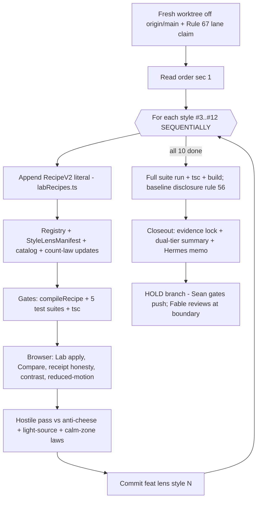

# FABLE BLUEPRINT — Lens OS World-Style Expansion (10 themes, built by another agent, 100% in Fable's style)

- **Date:** 2026-07-16 · **Author:** Fable (claude-fable-5), Final Decider · **Status:** READY FOR BUILDER AGENT · **Commissioned:** Sean 2026-07-16 — "expand and make styles based off of the new worldview we built… ten themes… gaming, cyberpunk Edgerunners-2077-class, other designs… beautiful, marvelous, professional, fun… deep, complex, 3D flow, 3D visual effects, wow factor… another agent builds it, exactly as Fable would."
- **What this is:** the complete work order to add **ten new Smart Lens OS styles** (v2 recipes #3–#12) to the SwanStudios theming operating system via the sanctioned add-a-style pipeline. Every decision is made here. The builder makes none. Where this blueprint is silent, `docs/ai-workflow/references/LENS-ADD-A-STYLE.md` wins, then the lens-finish-pack, then STOP and escalate — never improvise.
- **Authority chain:** CLAUDE.md rules > `LENS-ADD-A-STYLE.md` (the 30-minute pipeline law) > `docs/ai-workflow/brainstorms/lens-finish-pack-2026-07-14.md` (architecture + frozen interface) > this blueprint > builder judgment (≈ zero).

## 0. Mission and the one architectural law

Styles are **DATA, never code**: each theme is a validated `RecipeV2` literal appended to `frontend/src/adapters/style-lens-swan/v2/labRecipes.ts` plus its registry/manifest/catalog entries — the pipeline the Lens OS was built to feed forever ("style #27 in under 30 minutes, gates green, zero code"). You are adding entries through the two sanctioned ADDITIVE carve-outs (labRecipes.ts appends; surfaceManifests.ts additive optional variants). **Everything else in the lens core is FROZEN** — `recipeV2.ts`, `compileRecipe.ts`, `LensPlanFrame.tsx`, `whatChanged.ts`, resolution, gates. Editing a frozen file = STOP + escalate. The Lab must still feel like a jeweler's counter: calm, precise, reversible, honest.

## 1. Read FIRST, in this order (nothing else)

1. `docs/ai-workflow/references/LENS-ADD-A-STYLE.md` — THE pipeline. Follow its steps literally for every style (all FIVE entries per style, incl. the StyleLensManifest step).
2. `docs/ai-workflow/brainstorms/lens-finish-pack-2026-07-14.md` §1–2 — vision, frozen-interface table, file map, forbidden patterns, count-law amendment (`WORKOUT_DESIGN_STYLE_COUNT`, registry enumerated treatments, renderer-pick rule, `dashboardChrome` flag honesty).
3. `frontend/src/adapters/style-lens-swan/v2/labRecipes.ts` — the two production exemplars (Candy Glass Arcade, Prism Terminal). Your recipes must match their density and validation discipline.
4. `frontend/src/core/style-lens-os/v2/recipeV2.ts` — the schema + token allowlist (no `url()`, no expressions, no `;`/`{}` — the compiler is fail-closed; a rejected token is YOUR bug).
5. `.ai-workflow/coordination/*.lane.md` + `review-queue.md` (Rule 67) — claim your files before editing.

## 2. Execution rails (hard requirements)

- **Fresh worktree** off current `origin/main`, branch `<agent>/lens-world-styles-2026-07-16`. Do NOT work in the unified-world-gallery worktree, the dirty main checkout, or any Codex worktree.
- **ONE builder agent, styles built SEQUENTIALLY** — labRecipes.ts and the registry counts are shared append points; parallel agents collide. Commit per style: `feat(lens): style #N — <name>`. NO push — Sean gates the batch push (Rule 70).
- Tests are **EXTENDED, never forked**: `WorkoutDesignLab.styleAxis.test.tsx`, `WorkoutDesignLab.contract.test.ts`, `labRecipes.test.ts`, `swanStyleLensRegistry.test.ts`, `styleLensBoundary.test.ts`. Count sites update ONLY via the sanctioned count-law mechanism (derived counts, all four styleAxis count sites individually per finish-pack v1.7).
- Per-style hostile pass (rule 61) recorded in the commit body: what you attacked, what you fixed.
- All files ≤300 lines (extract if a fragment file approaches the cap); `css\`\`` helper for any interpolated shared fragment (rule 43); ASCII-only sources; no inline `style={{}}` on mounted components.

## 3. THE DEPTH GRAMMAR — what "3D, deep, complex, wow" means in Fable's hands

Lens styles carry **no WebGL, no canvas, no video, no images**. The 3D is an *illusion engineered from light*: gradients, dual shadows, bevels, glass, extrusion, and transform-only micro-motion. This grammar is BINDING on all ten styles — it is the difference between "wow" and "cheap."

1. **Elevation ladder (every style defines E0–E3):** E0 flat surface → E1 raised (dual shadow: key `0 2px 4px` sharp + ambient `0 12px 32px` soft) → E2 floating (key `0 8px 16px` + ambient `0 24px 56px` + 1px inset top highlight at 6–10% white) → E3 modal/spotlight. Depth comes from TWO shadows plus an inner highlight — one blurry shadow is 2015, not 3D.
2. **Bevel spec (physical thickness):** inset top-edge highlight + inset bottom-edge shade on interactive chrome = the surface has mass. Buttons press: active state inverts the bevel (top shade, bottom light) and translates 1px down.
3. **Glass spec:** `blur(10–18px)` + 1px edge-light border + inner top sheen — on panels and floating chrome ONLY, never on large scrolling regions (perf law).
4. **Extrusion spec (voxel/isometric styles):** solid edge-faces built from stacked hard box-shadows or borders; hover = lift + the edge face GROWS (the object rises off the deck).
5. **Sheen law:** one specular gradient sweep, hover or celebration only, never looping, never on data.
6. **Perspective micro-tilt:** ≤2deg rotateX/Y on hover, transform/opacity only, 120–200ms, fully removed under `prefers-reduced-motion` (every animated property gets the escape).
7. **One light source per style.** Name it in the recipe's comment header (e.g. "light: upper-left cold"). Every gradient, bevel, and shadow obeys it — mixed light directions are the #1 tell of AI-generated chrome.
8. **Calm-zone supremacy:** charts recolor ONLY through `--world-accent` via `lensChartPalette` (never restyled otherwise); numeric truth stays monospace; data/list regions get E0–E1 maximum; the wow lives on chrome, headers, buttons, celebration states — never between the user and a number.
9. **Honesty law:** every style's `StyleLensManifest` declares true coverage; chrome-less/partial styles set `dashboardChrome` accordingly and the Apply receipt must say so. A lens that lies about what it changes is a failed lens regardless of beauty.
10. **Contrast law:** every style names its critical text pairs below and must hold WCAG 4.5:1 on them — verified per style, not assumed.

## 4. THE TEN STYLES (v2 recipes #3–#12 — build in this order)

Format per style: id · display name · family · mood words · light source · palette (role: hex) · critical pairs · depth treatment (which grammar moves lead) · signature chrome · anti-cheese line (BINDING) · provenance note.

### #3 `glacier-chrome` — "Glacier Cathedral" · family: World Engine
Mood: glacial, luminous, patient, sacred. Light: below-left cold blue. Palette: ground `#0A0A0F`, ice-mass `#123C67`, crevasse-light `#62CBE8`, frost-type `#EEF8FA`, aurora-accent `#7F79D9`, low-sun-gold `#D4A85A` (ONE warm moment per surface). Critical pairs: frost on ground / frost on ice-mass. Depth: glass spec at its deepest — panels read as cut-ice slabs (blur + crevasse-light edge + translucent strata: two stacked translucent layers offset 2px); E2 cards glow faintly from WITHIN (inset crevasse-light at 4%). Signature: focus rings as light-through-ice (double ring: tight frost + wide soft cyan). Anti-cheese: dies when ice becomes frosted-glass decoration EVERYWHERE — strata on panels, never on body text containers. Provenance: worlds.md Glacier Cathedral entry (Law-B set), the gallery's glacier-cathedral site is the visual reference.

### #4 `neon-meridian-chrome` — "Neon Meridian" · family: World Engine
Mood: electric, rain-slick, dense, alive, midnight. Light: signage-glow above + ground reflection below (double-source is the signature). Palette: void `#060608`, wet-steel `#1A1F2E`, signal-magenta `#FF2E88` (CTA/action ONLY), current-cyan `#23D5E8` (data/holograms), sodium-amber `#FFB13D` (the humanizing 5% — must appear on every themed surface), hologram-violet `#9B5CFF`, rain-white `#E8F0F8`. Critical pairs: rain-white on void / on wet-steel; void on signal-magenta (large CTA text). Discipline: magenta OR cyan dominates a surface, never parity. Depth: reflection shadow (a second, mirrored soft glow BELOW glowing chrome, like wet asphalt) + hologram edge-light on panels. Signature: "hologram rematerialize" — applied-state transitions use a 1-frame scanline sheen (reduced-motion: instant). Anti-cheese: dies as purple-pink wallpaper soup — wet, layered, amber-warmed density or nothing. Provenance: worlds.md Neon Meridian (Law B).

### #5 `neon-ronin` — "Neon Ronin" · family: Gaming/Cyber
Edgerunners-2077-CLASS energy — **inspired-by only: zero franchise names, logos, characters, or copied trade dress anywhere in ids, labels, copy, or comments.** Mood: kinetic, insolent, chrome-and-acid, street-samurai. Light: hard upper-right. Palette: charcoal `#0B0B10`, steel `#191922`, acid-yellow `#F5E027` (LEADS — kickers, active states, the one loud voice), current-cyan `#2BD9E0` (secondary/data), alert-red `#FF3B4E` (rare/danger states ONLY), white `#F2F2F5`. Critical pairs: white on charcoal; charcoal on acid-yellow (badges/CTAs). Depth: HUD chrome — cards get ONE clipped corner (notch cut via clip-path-equivalent token if the schema allows; else a corner accent border), hard 1px yellow hairlines, E1 shadows tight and dark (street light, not softbox). Signature: a single glitch accent — active tab/selection gets a 1px chromatic split (cyan left-shift, red right-shift at 40% opacity), ONE element per viewport max, reduced-motion static. Anti-cheese: dies when yellow+cyan+red hit parity or glitch spreads to everything — yellow leads, red is a whisper, glitch is a garnish. Provenance: original composition; no CD Projekt / Trigger assets or names.

### #6 `grid-runner` — "Grid Runner" · family: Gaming/Cyber
Mood: disciplined, angular, fast, sparse, exact. Light: emitted (the geometry IS the light — inverted depth grammar: glow replaces shadow). Palette: void `#050608`, grid-teal `#2BAEC2`, command-pink `#F05B91` (single action accent), plane `#161A21`, type `#E9F1F3`, warning-amber `#E4B85B` (rare). Critical pairs: type on void/plane; void on command-pink. Depth: light-line borders that CONTINUE across components (border-color coordination so adjacent cards read as one circuit); elevation = glow intensity ladder instead of shadows (E1 = 20% glow, E2 = 40% + 1px brighter line). Signature: 90°-only geometry — zero rounded corners above 2px anywhere; the active element's border-light is visibly "powered." Anti-cheese: dies with bloom soup or curved friendliness — hard angles, two colors + black, restrained glow. Provenance: worlds.md Grid Runner (Law B).

### #7 `voxel-forge` — "Voxel Forge" · family: Gaming
Mood: chunky, crafted, satisfying, sturdy, playful-serious. Light: upper-left warm. Palette: bedrock `#14161C`, slate `#262B36`, ember-orange `#F08A3C` (primary action), moss `#6FBF73` (success/XP), sky `#58B7E8` (info), bone `#EDEAE0` (type). Critical pairs: bone on bedrock/slate. Depth: THE extrusion showcase — 4-tone block faces (face color, top face +12% lighter, side face −14% darker, drop edge) built from stacked hard shadows; radii 2–4px only; buttons are blocks that PRESS (edge collapses 2px on :active). XP/progress bars are extruded channels that fill with glowing material. Signature: applied-state "place the block" — chrome settles with a 1px drop + edge grow (reduced-motion: pre-settled). Anti-cheese: dies as a Minecraft clone — original block proportions, no dirt/grass textures, no pixel fonts. Provenance: worlds.md Voxel Realm, original block language.

### #8 `arcade-royale` — "Arcade Royale" · family: Gaming
Mood: celebratory, plush, holographic, generous, fun-premium. Light: top-center warm spotlight. Palette: midnight-plum `#17102B`, royal-violet `#7C4DE8`, holo-pink `#FF7ADF`, coin-gold `#FFC94D`, mint `#4DE8B8`, ticket-white `#F7F3FF`. Critical pairs: ticket-white on plum; plum on coin-gold. Depth: candy-gloss bevels (strong top inner highlight = lacquered buttons) + holographic-foil card sheen (a diagonal 3-stop gradient border: violet→pink→mint at 30%). Signature: celebration states (badge unlock, level-up, streak) get the full foil treatment + ONE sheen sweep — everyday chrome stays plush but calm. Anti-cheese: dies as a casino — no pulsing gold, no starbursts, celebration is EARNED (event-driven), never ambient. Provenance: original; cousin of production "Candy Glass Arcade" — must read clearly distinct (richer, darker, foil-based vs candy-gloss).

### #9 `deep-field-observatory` — "Deep Field Observatory" · family: World Engine
Mood: ancient, precise, silent, revelatory. Light: none (pinpoint starlight — brightness is information). Palette: void `#030407`, infrared `#D97842`, star-gold `#E7BA68`, cluster-violet `#8B6FB1`, ion-blue `#78B9D6`, caption `#F0EEE8`. Critical pairs: caption on void. Depth: vignette depth (surfaces darken 4% toward edges), instrument hairlines (0.5px-feel borders at 12% caption), data in mono with star-gold accents. Signature: focus rings as 4-point diffraction spikes (the Webb signature, subtle, 40% opacity). The most restrained style of the ten — its inclusion proves the set isn't just maximalism. Anti-cheese: dies as dishonest cosmic wallpaper — no decorative star fields behind data; the void is EMPTY, that's the point. Provenance: worlds.md Webb Deep Field (Law B).

### #10 `faceted-sigil` — "Faceted Sigil" · family: Logo-Derived
Mood: crystalline, precise, assembled, proud. Light: upper-left cold. Source DNA: the SwanStudios mark's low-poly facets (`frontend/src/assets/Logo.png`). Palette: sapphire-ground `#0D2B6B`, deep-ground `#0A0A0F`, facet-ice `#BFE3F2`, facet-periwinkle `#8FA8E8`, facet-violet `#8B5CF6`, frost `#EEF8FA`. Critical pairs: frost on sapphire/deep ground. Gradient LAW: white→ice→periwinkle→violet, always that order, one hero wash + progress fills only. Depth: facet bevels — cards carry 2–3 angled gradient planes (hard-stop linear gradients at 8–12% opacity deltas) reading as cut-crystal faces catching one light. Signature: active/applied chrome "catches the light" — the facet plane brightens on the light-source side. Anti-cheese: dies as 2015 low-poly wallpaper — facets live on chrome at whisper opacity, never as full-strength backgrounds. Provenance: original derivation of Sean's own mark; never distort/recolor the actual logo.

### #11 `sapphire-monolith` — "Sapphire Monolith" · family: Logo-Derived
Mood: monumental, crested, deep, exclusive, earned. Light: upper-left, single, dramatic. Source DNA: the logo's circular sapphire badge. Palette: abyss-navy `#062040`, monolith-navy `#0A1F4D`, ice-edge `#62CBE8`, frost `#E0ECF4`, rank-gold `#C6A84B` (membership/rank moments ONLY, one per surface). Critical pairs: frost on abyss/monolith. Depth: TRUE EMBOSS — medallion chrome (avatars, rank pills, section seals) uses dual inset+outset shadow (outer key shadow + inner top light + inner bottom shade) so circles read as struck metal-in-stone; large surfaces are monolithic vertical gradients with one giant off-canvas circle arc (1px ice-edge at 8%) crossing per view. Signature: rank/achievement chrome gets the full struck-medallion emboss + one light sweep on award. Anti-cheese: dies as a crypto-coin site — no spinning medallions, no metallic gradient TEXT, no laurels; the circle is architecture. Provenance: original derivation of the mark's badge geometry.

### #12 `isometric-playdeck` — "Isometric Playdeck" · family: Showcase-3D
Mood: dimensional, tactile, orderly, delightful, professional-playful. Light: upper-left, 30° (the isometric constant). Palette: ink `#101017`, graphite `#1A1A24`, electric-blue `#4D7CF0`, coral `#FF6F61`, lime `#B4E84D` (success), paper `#F0F2F8`. Critical pairs: paper on ink/graphite; ink on electric-blue. Depth: THE 3D-flow showcase — cards are extruded tiles (solid 4–6px bottom+right edge faces in a darkened surface tone); hover lifts the tile (translateY −2px while the edge face grows +2px = the object visibly RISES off the deck); pressed = flush. Stacked panels offset like a hand of cards (each successive layer +2px x/y). Signature: the applied style's preview tile physically sits ABOVE its neighbors on the deck. Anti-cheese: dies when extrusion hits text blocks or data tables — tiles/chrome only; content planes stay flat and calm. Provenance: original.

## 5. Per-style pipeline + gates (repeat ×10, sequentially)

For EACH style: (1) follow `LENS-ADD-A-STYLE.md` literally — RecipeV2 literal append + registry + StyleLensManifest + catalog + count-law updates (all five entries); (2) recipe header comment: light source + one-line mood contract; (3) run gates — `compileRecipe` fail-closed green, focused suites (`labRecipes.test.ts`, `styleAxis`, `contract`, `registry`, `boundary`) green with new derived counts, `npx tsc --noEmit` clean; (4) open the Workout Design Lab in a browser, apply the style: verify Explorer card + family grouping, Compare vs Crystalline default, What-Changed receipt honest, 4.5:1 spot-check on the named critical pairs (contrast tool, not eyeball), reduced-motion pass, 44px targets intact, charts recolor ONLY via `--world-accent`; (5) hostile pass — attack with the style's anti-cheese line + Depth Grammar §3.7 (light-source consistency) + §3.8 (calm zones); fix; (6) commit `feat(lens): style #N — <name>` with the hostile findings in the body.

## 6. Wireframe — the anatomy every style must express (Lab Explorer card + applied chrome)

```
┌─ Explorer style card ──────────────────┐   ┌─ Applied chrome anatomy ─────────────────┐
│ [swatch strip: 5 palette roles]        │   │ E2 PANEL (glass/facet/extrusion per style)│
│ Style Name          [family chip]      │   │ ┌ inset top highlight (light source!) ┐  │
│ mood words · engine badge v2           │   │ │ KICKER (accent voice of the style)  │  │
│ [Apply 44px]  [Compare]  [Pin]         │   │ │ Heading (Plus Jakarta)              │  │
└────────────────────────────────────────┘   │ │ body… (calm, flat, readable)        │  │
   Apply → confirmation chip + What-Changed  │ │ [PRIMARY CTA: bevel+press][ghost]   │  │
   receipt listing REAL axis diffs only      │ └ dual shadow: key + ambient ┘        │  │
                                             │ CHART AREA: --world-accent ONLY, E0   │  │
                                             └───────────────────────────────────────┘  │
```

## 7. Mermaid — the build pipeline



## 8. Acceptance checklist (the review gate checks exactly these)

- [ ] Ten new v2 recipes present (#3–#12), each with all five pipeline entries; count-law sites updated via the sanctioned mechanism only; NO frozen file touched.
- [ ] Every style: named light source, E0–E3 ladder expressed, critical pairs 4.5:1 verified, calm zones flat, charts via `--world-accent` only, reduced-motion complete, 44px intact.
- [ ] Every style passes its OWN anti-cheese line under hostile review; no two styles read as siblings-by-laziness (esp. #8 vs production Candy Glass Arcade; #4 vs #5 vs #6 must be three DIFFERENT cybers).
- [ ] Zero franchise IP anywhere (ids, labels, comments) for #5; logo never distorted/recolored for #10/#11; no retired Galaxy-Swan hex values (`#00FFFF`, `#7851A9`, `#0a0a1a`) anywhere.
- [ ] All suites green + tsc clean + build clean (slice-vs-baseline disclosed per rule 56); every file ≤300 lines; ASCII-only; commits per style; branch NOT pushed.
- [ ] What-Changed receipts honest for every style (chrome-only styles say so via `dashboardChrome`).

## 9. What NOT to do

- Do NOT touch `frontend/` outside the lens adapter/lab files the pipeline names; do NOT edit frozen core files; do NOT fork tests; do NOT add WebGL/canvas/images/fonts to any recipe.
- Do NOT build styles in parallel agents; do NOT `git add -A`; do NOT push.
- Do NOT let wow reach data: if a chart, table, or money number is harder to read under your style than under Crystalline default, the style is REVISE regardless of beauty.
- Do NOT pad a weak style with more glow — subtract, sharpen the signature, or escalate to Fable with a concrete alternative.

*Fable-fidelity note: the ten roster entries above are opinionated on purpose — palettes, light sources, and signatures are decisions, not suggestions. If a builder "improves" a palette or adds an eleventh effect, that is drift, and drift is the failure mode this blueprint exists to kill. Where you feel the urge to deviate, re-read the style's anti-cheese line — the urge is usually the cheese.*
