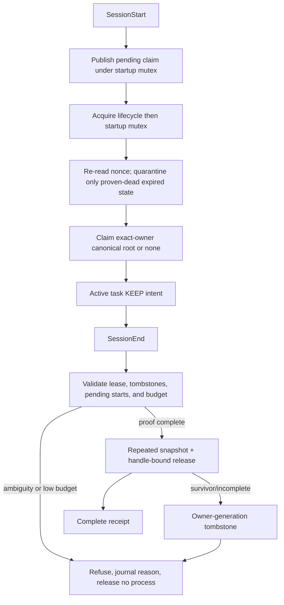

# MCP Lifecycle Hygiene — Enhanced Landing Plan

**Purpose:** Convert the verified V1 implementation and Kimi K3 hostile review into a calibrated, builder-exact landing plan.  
**Author:** Codex  
**Last updated:** 2026-08-09  
**Status:** Audit-first implementation and two exact-snapshot hostile reviews are CLEAN in the isolated worktree. Installed hooks remain `-Mode audit`, and enforcement is mechanically sealed.  
**External review:** Kimi K3, one approved call, actual cost approximately $0.1448.  
**Commit gate:** A matching Kimi APPROVE review under Rule 46 plus Sean approval; Fable is opt-in only. No push to `main` is authorized.

## 1. Decision Summary

The retained, unreachable V1 kill boundary remains technically sound: exact launch grammar, exact Claude owner identity, process creation-time ancestry, host-wide leases,
full claimed-root validation at repeated snapshots, and start-time-bound Windows process handles. Codex and POSIX mutation remain audit-only.

Do not open the current sealed enforcement path. Land the system in audit mode
first, prove crash recovery and observability, then enable the existing
Playwright-only Windows mutation path in
a separate, reversible change.

### Implementation checkpoint (2026-08-09)

- Installed SessionStart/SessionEnd hooks route through host-global and exact-owner named mutexes plus a
  kill-on-close Job Object coordinator in explicit audit mode.
- Nonce-bearing pending claims, exact-holder quarantine, transactional
  owner-coalesced tombstones, bounded active/inactive state, dirty latch, monotonic deadlines, journal,
  `status`, `doctor`, approved `rearm`, and registry/code authority separation
  are implemented with targeted regressions.
- No live lifecycle hook, production lease mutation, or MCP process termination was used during the build.
  Runtime and wrapper code mechanically seal audit-to-enforce behind a separate paid-review and owner gate.

## 2. Kimi Finding Calibration

| Finding | Local disposition | Repository evidence | Plan effect |
|---|---|---|---|
| F1 cross-owner orphan claim | **Rejected as stated** | `manager.mjs:194-197` claims only groups matching the exact current owner PID and creation time; `core.mjs:252-276` applies the same owner filter before claim selection. | Add same-owner session-generation tombstones as defense against future multiplexed Claude hosts, not as a current P0 fix. |
| F2 stale lock/pending poisoning | **Accepted** | `leases.mjs:225-248` writes a bare holder PID and never proves holder liveness or reclaims a stale file; pending starts have no holder identity or expiry. | Replace file locks with an abandoned-owner-safe OS primitive before enforcement. |
| F3 hook budget mismatch | **Rejected as current defect; accept regression hardening** | Discovery is capped at 1.5s, each lock at 12s, release work at 8s plus bounded final discovery; hook budgets are 45s/60s. | Encode the budget equation and pre-mutation reserve in tests/constants. |
| F4 ABBA deadlock | **Rejected today; accept contract hardening** | SessionStart releases `withOwnerStartupGate()` at `manager.mjs:190` before acquiring `withOwnerLock()` at `:192`; SessionEnd nests lifecycle then startup at `:228`. | Document one legal lock order and test that Start never nests both locks. |
| F5 silent refusal | **Accepted** | Hook receipts are ephemeral stdout; no durable sanitized `status` or `doctor` surface exists. | Add reason-coded journal and read-only status/doctor. |
| F6 keep-on-end | **Rejected** | Preserving servers after an ended task recreates the leak Sean asked to remove. | KEEP remains active-task intent and preview scope only. |
| F7 FILETIME tick equality | **Rejected; clarify actual precision** | The manager converts both WMI creation time and `.NET Process.StartTime` to UTC Unix milliseconds and compares exact integer equality. | Add strict `±1 ms` contract coverage; do not invent incompatible tick precision. |
| F8 visibility scope | **Rejected in code; docs clarification accepted** | SessionStart candidates are filtered to the exact current Claude owner. | State “exact-owner scope” explicitly in skill and Rule 82. |

## 3. Non-Negotiable Boundaries

1. Never broaden automatic mutation beyond exact Windows Playwright until a new
   server/platform has its own grammar, ownership proof, and hostile tests.
2. Never terminate Codex-host descendants while multiple tasks can share one host.
3. Never use process names, PID alone, elapsed age alone, or substring matching as ownership.
4. Never let stale-state recovery delete a record whose holder identity is live or ambiguous.
5. Never expose PIDs, command lines, session IDs, paths, environment data, or credentials in reports.
6. Never treat process cleanup as current-task context reclamation.
7. Every runtime phase must retain an audit-only rollback path.

## 4. Target State Flow

## 5. Phase 0 — Freeze and Audit-Mode Landing

### Scope

- Add one explicit mode: `audit` or `enforce`.
- `.claude/settings.json` explicitly passes `--mode=audit`; the manager parses the
  mode on every invocation. Missing, malformed, unknown, or dirty-latched mode is audit.
- Audit mode may atomically create/remove its own hook bookkeeping, but can never
  call `executeRelease()` or the process terminator.
- Preserve `--confirm` as necessary but not sufficient for mutation.
- Update Rule 82, generated `AGENTS.md`, both skill mirrors, and `ACTIVE-INDEX.md`
  in the same phase so no trailhead claims automatic cleanup is active.
- Record the exact V1 baseline: 41 lifecycle tests, two local CLEAN reviews, and
  the Kimi calibration above.

### Acceptance

- An end-to-end hook smoke proves zero calls to the terminator in audit mode.
- Audit is the runtime default even when client settings are cached or absent.
- A durable atomic dirty latch is written before enforcement mutation and cleared
  only after final verification plus journal receipt. A surviving latch forces
  future invocations to audit until read-only diagnosis succeeds.
- Switching configuration affects future hooks only; an entered kill boundary
  cannot be recalled and must retain its internal deadline/final proof.
- Hook commands remain project-root-safe from a non-root working directory.
- No config deletion, MCP logout, or authentication mutation is introduced.

## 6. Phase 1 — Crash-Safe State Recovery (Enforcement Blocker)

### Crash-safe locking decision

- Do not automatically reclaim canonical lock paths with read-then-delete; nonce
  fields do not close the two-reclaimer ABA race.
- Replace both file locks with a host-global state mutex plus per-owner Windows named mutexes. A project-root-safe
  PowerShell coordinator owns the mutex and launches the Node action inside a Windows
  Job Object configured kill-on-close, so coordinator death cannot leave an unfenced child.
- Keep two mutex purposes. SessionStart takes startup-publication alone, releases
  it after publishing, then takes lifecycle. SessionEnd takes lifecycle then
  startup-publication. Start never holds startup while waiting for lifecycle.
- A proof-of-concept must show exact owner-derived names, bounded waits, coordinator
  and child crash release, abandoned acquisition, kill-on-close, and no cross-owner collision. If it cannot,
  enforcement remains audit-only; no filesystem-reclaim fallback is allowed.

Pending-start records gain the hook holder PID/creation time, publication time,
expiry, schema version, and nonce. Quarantine holds lifecycle then startup-publication,
re-reads the exact nonce while both are held, and proceeds only when the record is
expired and its exact holder is proven dead. Publishers and reclaimers are serialized.

Old V1 bare-PID lock files are ambiguous: `doctor` reports them and enforcement
stays audit-only. No automatic or generic repair path deletes them.

### File design

- Keep `mcp-lifecycle-leases.mjs` below 300 lines by extracting mutex coordination
  and state recovery to dedicated modules/scripts.
- Inject the state root and process-discovery function for tests; production and
  test namespaces must remain physically separate.

### Acceptance

- Fault tests kill the coordinator at every mutation boundary; each releases the
  mutex, kill-on-close terminates its Node child, and the next audit converges safely.
- A live exact holder blocks until release or bounded timeout.
- PID-reused holder with a different creation time is reclaimable only after the
  old holder is proven absent.
- Missing creation time, malformed JSON, unsupported schema, and concurrent
  reclaimer all fail closed.
- Fault injection at every lock/pending write boundary converges on the next hook
  without touching production state.

## 7. Phase 2 — Session-Generation Quarantine

### Scope

- On incomplete cleanup, write a private owner-generation tombstone containing
  exact owner/root identities and sanitized reason codes.
- Tombstone persistence is transactional in order: atomic write, schema read-back,
  then active-lease removal. Any write/read-back failure retains the active lease,
  sets the dirty latch, and forces audit. If lease removal fails, both records may
  coexist; tombstones never enter active-lease enumeration.
- A future SessionStart under a different exact owner ignores that tombstone.
- A future SessionStart under the same exact owner cannot claim tombstoned roots;
  this protects against a future Claude host that multiplexes sequential session IDs.
- Remove a tombstone only under the lifecycle mutex when all claimed roots and
  attributable descendants are proven gone, or the exact owner process is proven
  exited. Doctor never generically deletes tombstones.

### Acceptance

- Cross-owner orphan test stays protected by the existing owner filters.
- Same-owner sequential-session test cannot adopt an incomplete predecessor's root.
- Tombstones cannot enter the active-lease enumeration or permanently block a new owner.
- Evidence and tombstone paths are separate and schema-versioned.

## 8. Phase 3 — Budget and Lock-Order Contracts

### Scope

- Centralize discovery timeout, lock waits, release deadline, final-scan reserve,
  and hook budgets as exported constants.
- Start the absolute budget at hook/coordinator entry. The wrapper subtracts mutex
  acquisition and launch time, then passes only the remaining budget to Node, which
  uses a monotonic clock and reserves wrapper/final-scan margin. Bound state-file count
  and bytes, journal rotation, discovery, termination, and final verification; overflow forces audit.
- Before the first kill, require enough remaining internal budget for one immediate
  snapshot, one termination timeout, one after snapshot, and final verification.
- Legal order: SessionStart may take startup gate alone, release it, then lifecycle;
  SessionEnd may take lifecycle then startup. No code path may hold startup while
  waiting for lifecycle.

### Acceptance

- Static/contract test proves the configured 45s/60s hook budgets exceed every
  internal worst-case path by a documented safety margin.
- Slow-discovery tests refuse before mutation when the final reserve is unavailable.
- Forced lock contention completes or returns a sanitized refusal—never deadlocks.
- Exact UTC Unix-millisecond start-time comparison rejects `expected ± 1 ms`.

## 9. Phase 4 — Sanitized Operator Observability

### Scope

- Add append-only, size-bounded journal entries containing timestamp, mode,
  allowlisted label/count, result counts, and enumerated reason codes only.
- Add `status` for the latest sanitized lifecycle result.
- Add read-only `doctor` that classifies active, stale-proven, ambiguous, malformed,
  and legacy state without changing it.
- `doctor --repair-stale` is not part of the first landing. A later repair command
  may quarantine only schema-valid expired pending records whose exact holders are
  proven dead after nonce re-read while holding lifecycle then startup. It cannot delete active leases,
  tombstones, evidence, ambiguous records, or legacy lock files and never terminates processes.
- A separate operator-approved rearm may clear the dirty latch only through the
  host-global coordinator mutex after clean state proof and a durable journal receipt.

### Acceptance

- Every refusal path maps to one documented reason code.
- Journal rotation is bounded and atomic; a write failure never enables mutation.
- Secret/PII/path/PID/session-ID scanners remain zero-hit on seeded journal output.
- Status remains useful when hook stdout is hidden by the client.

## 10. Phase 5 — Enforce Playwright, Then Expand by Registry

### Playwright canary

- Enable `enforce` only for the exact existing Windows Playwright grammar.
- Run a bounded canary across fresh, resumed, concurrent, crash-injected, and
  non-root-directory Claude tasks.
- Any incomplete, ambiguous, stale, or journal failure flips the next run to audit
  until `doctor` is clean and the operator-approved re-arm transaction succeeds.

### Future registry

- Each server entry defines exact executable/argv grammar, platform, ownership
  proof, descendant policy, and audit label. Registry data can classify only.
- Mutation requires a second code-owned exact allowlist entry tied to explicit
  Sean approval, a matching hostile-test manifest, and a Rule 82 update. A data
  flag alone can never authorize termination.
- New registrations start audit-only and cannot change the release engine.
- Remote MCPs remain configuration/session concerns, never local-process targets.

### Acceptance

- Registry schema rejects unknown fields, duplicate labels, broad regexes, and
  any data-owned attempt to enable mutation.
- Removing an entry reverts only that server to unmanaged audit visibility.
- Codex and POSIX remain audit-only absent equivalent per-task ownership proof.

## 11. Required Test Additions

| Test family | Required cases |
|---|---|
| Recovery | dead/live/reused/unknown holder; malformed/future schema; concurrent reclaim; coordinator-death matrix |
| Pending starts | crash before/after lease; stale holder; different worktree; paused reclaimer plus replacement nonce |
| Session generations | same-owner predecessor tombstone; different-owner isolation; owner exit cleanup |
| Budgets | maximum lock waits; slow discovery; low final reserve; no pre-refusal terminate call |
| Lock order | Start sequential order; End nested order; forbidden inversion contract |
| Observability | all reason codes; rotation; write failure; forbidden-field scan |
| Modes | audit never releases a process or changes MCP config/auth; bounded bookkeeping only; enforce remains mechanically sealed in this revision |
| Existing boundary | all 41 current tests remain unchanged and green |

## 12. Landing and Rollback Gates

### Go

- Phase 0 through Phase 4 tests pass in a test-only state namespace.
- Two new independent hostile reviews return CLEAN on the exact recovery revision.
- A new exact-revision Kimi review returns APPROVE after its own dry-run spend
  preflight and Sean approval; the current Kimi verdict is REVISE and is not a gate pass.
- Audit-mode canary shows no unexplained stale or ambiguous state.
- Sean explicitly approves the separate audit-to-enforce configuration change.

### No-go

- Any stale record can be reclaimed while its exact holder is live or ambiguous.
- Any same-owner tombstoned root can be adopted by a new session.
- Any hook timeout can interrupt a mutation that started without final-scan reserve.
- Any receipt or journal exposes forbidden process/session material.
- Any change broadens Codex, POSIX, remote, or server-shape mutation authority.

### Rollback

1. Keep the wrapper and runtime mechanically sealed to `audit`.
2. Leave SessionStart/SessionEnd auditing active for evidence.
3. Never delete server configuration or authentication as rollback.
4. Use read-only `doctor` to classify remaining state.
5. Require explicit approval before quarantining stale lifecycle files.

## 13. Per-Phase Trailhead Checklist

Every implementation phase updates, in one reviewed slice: runtime modules and
tests; `.claude/settings.json`; Rule 82 in `CLAUDE.md`; generated `AGENTS.md`; both
skill mirrors; `ACTIVE-INDEX.md`; mode/implemented-through status; and the durable
verification receipt. The outbound Kimi packet is an immutable preflight snapshot
whose original status text is historical; the separate consult receipt carries
the completed-call truth. Never edit the raw Kimi output.

## 14. Residual Risks After This Plan

- Same-user forged hook input remains outside the security boundary and must stay disclosed.
- A process can crash after the final scan; later audits detect state but cannot
  retroactively guarantee immediate cleanup.
- Windows process and WMI semantics can drift with OS/runtime upgrades; rerun the
  identity contract on supported upgrades.
- Codex shared-host cleanup remains manual/audit-only until the client exposes a
  task-scoped ownership primitive.
- Stopping local processes still cannot remove schemas or outputs already present
  in model context.
