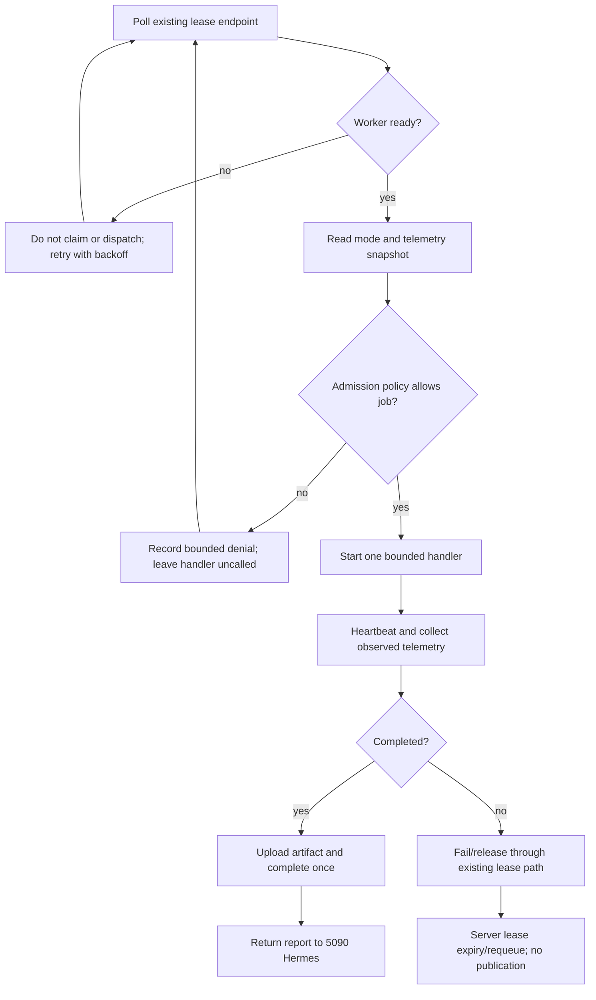

# MiniSwan Resource-Mode Enforcement Blueprint

**Status:** ADMISSION GATE WIRED LOCALLY; DEPLOYMENT AND LIVE QUEUE VERIFICATION PENDING
**Version:** 1.0
**Supersedes:** `MINISWAN-RESOURCE-MODE-CONTRACT-2026-09-06.md` only for implementation sequencing; the contract remains the policy source.
**Owner:** Main Hermes on the RTX 5090
**Worker:** MiniSwan RTX 4080

## Requirements and acceptance criteria

| ID | Requirement | Acceptance criterion |
| --- | --- | --- |
| MS-WAKE-1 | Preserve the proven worker wake path | S3 wake from the 5090 produces SSH and Tailscale readiness before a job is offered. |
| MS-MODE-1 | Enforce worker modes at admission | `cool` and `sleep` reject heavy work; `balanced` requires fresh telemetry; `full` requires a future expiry. |
| MS-MODE-2 | Fail closed on unknown or stale control state | Unknown mode, stale required telemetry, missing expiry, and expired full mode never reach a handler. |
| MS-QUEUE-1 | Keep the existing lease queue authoritative | No second queue is introduced; rejected work is reported without claiming or completing a lease. |
| MS-VIDEO-1 | Make one real render path measurable | One representative render records requested mode, observed CPU/GPU use, duration, output hash, audio/caption result, and recovery outcome. |
| MS-BRAIN-1 | Protect the canonical brain | MiniSwan can read approved snapshots and submit proposals only; direct canonical writes and external sends remain denied. |
| MS-OPS-1 | Keep the 5090 responsive | Worker concurrency is bounded to one heavy job initially, and every run reports requested versus observed limits. |
| MS-RECOVERY-1 | Recover without duplicate publication | Worker restart or lease expiry does not publish twice; the server queue remains the source of truth. |

## Scope

In scope: render-agent admission, telemetry freshness, mode expiry, worker readiness, bounded video benchmark, status reporting, and recovery evidence.

Out of scope for this slice: automatic YouTube publication, email/social sends, calendar mutations, broad browser automation, hardware power-limit tuning, S5/full-power-off wake, and direct brain writes.

## Blueprint and boundaries

- `scripts/swan-video-studio/worker-resource-policy.mjs` owns pure admission decisions.
- The render-agent owns lease polling, handler dispatch, heartbeats, completion, and failure reporting.
- Main Hermes owns mode changes, approvals, canonical memory, and operator reports.
- MiniSwan owns execution artifacts and observed telemetry; it does not own authorization.
- The existing server lease queue remains authoritative. The adapter must run before handler dispatch and must not claim a new local queue.

The first implementation slice is an adapter in the render-agent worktree that evaluates the policy before invoking `HANDLERS[kind]`. On denial it must fail without calling the handler and must report a bounded, non-secret reason through the existing failure path or a non-claim readiness response, according to the existing server contract.

## Wireframes and conditional artifacts

- UI wireframes: N/A. This slice is headless worker/runtime behavior; no user-facing surface is changed.
- Responsive/accessibility matrix: N/A for the same reason. CLI logs remain line-oriented and machine-readable.
- ERD: N/A. No database schema or queue authority changes.
- State diagram: applicable and represented by the flow below.
- Sequence/trust-boundary diagram: applicable and represented by the flow below.
- Permissions matrix: applicable and represented by the policy table in the contract; external-visible actions remain approval-gated.

## Flowchart



The diagram is source-only in this packet; a rendered image is not required for this headless runtime change and the repository has no configured Mermaid renderer.

## Contracts

Admission input:

```js
{
  mode: 'cool' | 'balanced' | 'full' | 'sleep',
  kind: string,
  heavyJobsRunning: number,
  browserSessions: number,
  telemetryFresh: boolean,
  now: number,
  expiresAt: string | null
}
```

Admission output is `{ allowed, reason, policy, kind }`. `allowed: false` is terminal for this dispatch attempt. No token, prompt, path, customer identifier, or external-account credential may be written to the denial log.

## Test plan and traceability

| Test | Requirement | Expected evidence | Status |
| --- | --- | --- | --- |
| MS-T1 | MS-MODE-1 | Pure policy tests cover all modes and heavy/control jobs | PASS: existing focused suite |
| MS-T2 | MS-MODE-2 | Unknown mode, stale telemetry, missing/expired full expiry reject | PASS: existing focused suite; adapter cases pending |
| MS-T3 | MS-QUEUE-1 | Render-agent adapter denies before handler invocation | PASS: gate wired before handler dispatch; focused adapter test passes |
| MS-T4 | MS-WAKE-1 | S3 WOL produces LAN SSH and Tailscale SSH | PASS: live 2026-09-06 evidence |
| MS-T5 | MS-VIDEO-1 | Representative CPU/NVENC benchmark and artifact checks | NOT RUN |
| MS-T6 | MS-RECOVERY-1 | Restart/lease-expiry fixture proves no duplicate completion/publication | NOT RUN |
| MS-T7 | MS-BRAIN-1 | External send and direct brain write are rejected | PASS for external-send policy; direct-write adapter test pending |

Baseline command:

```powershell
node --test scripts/miniswan/miniswan-wake.test.mjs scripts/miniswan/miniswan-llama-server.test.mjs scripts/swan-video-studio/worker-resource-policy.test.mjs
```

## Operations, rollout, and rollback

1. Snapshot the dirty render-agent worktree and record its exact status before editing.
2. Add adapter tests first; expected RED must be a real assertion that a denied job never invokes its handler.
3. Add the adapter and preserve existing lease/heartbeat/completion semantics.
4. Run focused tests, then a `--once` dry run against a non-production fixture or explicitly approved queue target.
5. Roll back by removing the adapter wiring while retaining the pure policy module; do not discard the existing dirty provider changes.
6. Do not deploy or publish externally in this slice.

## Hostile review and readiness receipt

Known risks: the server may already claim a lease before local admission runs; the exact server behavior must be verified before choosing fail/report versus non-claim semantics. Stale telemetry must never be interpreted as safe. CPU/GPU requested limits are not observed limits until measured on MiniSwan. The separate render-agent worktree is dirty and behind origin, so it is not safe to merge or reset during this slice.

Canonical evidence:

- Policy: `scripts/swan-video-studio/worker-resource-policy.mjs`
- Existing policy tests: `scripts/swan-video-studio/worker-resource-policy.test.mjs`
- Wake helper: `scripts/miniswan/miniswan-wake.ps1`
- Existing worker: `C:\Users\BigotSmasher\Desktop\quick-pt\swan-render-agent\backend\scripts\render-agent.mjs`
- Existing contract: `MINISWAN-RESOURCE-MODE-CONTRACT-2026-09-06.md`

Current readiness: **PLAN READY FOR ADAPTER SLICE; IMPLEMENTATION NOT VERIFIED; NOT DEPLOYED.**
