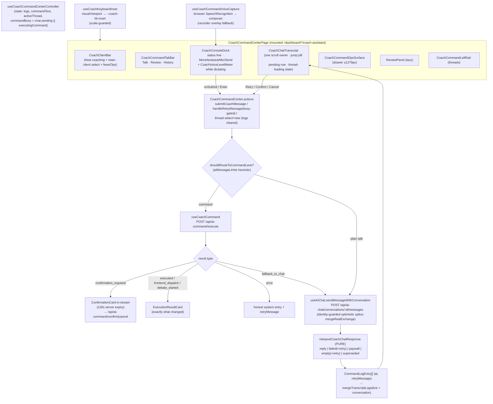

# NEXT-CHAT MASTER PROMPT — Coach Command Center v2: finish the job + take it to the next level
**Forged 2026-07-17 by Fable 5 (Final Decider) after the W3 rebuild + 4-round recursive hostile review shipped LIVE. Status: READY.**

> **Kickoff (paste this to the fresh agent):** *"Read `docs/ai-workflow/AI-HANDOFF/NEXT-CHAT-PROMPT-coach-command-center-v2-2026-07-17.md` in full, then execute it. Fresh worktree off origin/main, one slice at a time in the order given, recursive hostile review until dry after each phase, commit per slice, ONE push per phase batch, verify each deploy live on Render."*

---

## 1. What this surface IS (vision bind — read before touching code)

The Coach Command Center (`/dashboard/{admin,trainer,client}/coach-assistant`) is the **talk-first operating layer** of SwanStudios — not a chatbot. Spec truth lives in:
- `docs/ai-workflow/references/SWAN-COACH-V1-SPEC.md` — dual-lane command model, execution contract (interpret → confirm → execute → report exactly what changed → offer next action), non-negotiable #6: **no fake "I did it" responses, ever**.
- `docs/ai-workflow/references/SWAN-COACH-SPRINT-A-ACCEPTANCE-CHECKLIST.md` — the pass/fail bar (§4 results in-stream, §7 mobile, §8 error/fallback).
- Product Core Loop (CLAUDE.md): log workout → progress proof → next best action. Every enhancement must strengthen coaching, adherence, progress proof, or trust — kill anything that doesn't.

## 2. Where we are NOW (verified 2026-07-17, live on prod)

Two same-day batches shipped to main and deploy-verified:
1. **W3 rebuild** (`1550aa1ca`, `36f5d522f`, `ee9ac1470`): chat truth (fabricated-reply fallback killed; honest paywall/failed/superseded/empty states + retry + timestamps), Codex-chat-style one-row composer (dock ~232px → 133px measured on 414px), compact header, visualViewport keyboard inset, live voice waveform while dictating (parallel analyser-only stream, pulse fallback), jump-to-newest pill.
2. **Recursive hostile review R1→R4-dry** (`3194ec10e`, `3cd5a19ed`, `d8799d04f`, merge `12a8a6a92`): 13 R1 fixes (retry busy-gate, conversation-identity guards in `useAIChat`, cross-thread log bleed, thread-switch scroll reset, pending "thinking" + thread-loading states, offline truth copy, composer restore on non-retryable failures, 44px select, trust cue never hides, keyboard-aware height floors, landscape tier, pinch-zoom guard, mic release in meter fallback); R2 identity-safe optimistic splice (`mergeRealExchange`); R3 caught a runtime crash (catch-scope refs on failed sends) + added `useAIChat.sendFailureCleanup.test.tsx`.

**Gates at ship:** coach+hooks vitest 1026/1026 · full tsc exit 0 / 0 errors · vite build clean · live Playwright smoke 3/3 (375/414/1440, typed hello → reply rendered) · fallow zero new dead exports.

**⚠ Two lying-gate gotchas (cost us a round — do not repeat):**
- Full `tsc --noEmit` **OOM-crashes (exit 134)** on this repo with the default heap, and `grep -c "error TS"` reads the crash as "0 errors". Always run `NODE_OPTIONS=--max-old-space-size=8192 npx tsc --noEmit` **and check the exit code**.
- vitest run from a **worktree root** silently uses the wrong config (no jsdom) → misleading mass results. Always `cd frontend/` first.
- The live layout probe for this authed surface is `frontend/e2e/coach-command-center-mobile-smoke.spec.ts` (mocked admin JWT + `page.route('**/api/**')` against a plain vite dev server: `SWAN_PLAYWRIGHT_SKIP_WEBSERVER=1 BASE_URL=http://localhost:<port>`). Extend it; don't reinvent.

## 3. Architecture blueprint (as-built)



## 4. Mobile wireframe (as-built, 414×896 — the contract to preserve)

```
┌────────────────────────────────────┐  ← dashboard chrome ~130px (fixed)
│ NOW COACHING            [+] [⋯]   │  client bar (compact, 44px controls)
│ Sean's Client ▾ (main-client 44px) │
├────────────────────────────────────┤
│  🎙Talk   │  Review ③ │  History   │  tab bar (44px)
├────────────────────────────────────┤
│ New chat · Client #84              │  thread header
│                                    │
│         ┌────────────────────────┐ │
│         │ YOU · 12:12 PM         │ │  ← transcript owns the viewport
│         │ hello                  │ │     (~42% of screen, one scroll owner)
│         └────────────────────────┘ │
│ ┌───────────────────────────┐      │
│ │ SWAN COACH · 12:12 PM     │      │
│ │ Reply text…               │      │
│ │ [ConfirmationCard if cmd] │      │
│ └───────────────────────────┘      │
│ (⋯ Swan Coach is thinking)         │  pending row while busy
│            [↓ New reply]           │  jump pill when scrolled up
├────────────────────────────────────┤
│ status line…      Confirm before save │ ← single honest line (11px ≤380)
│ ┌──┐ ┌──────────────────┐ ┌──┐ ┌──┐│
│ │⋯ │ │ Talk or type…    │ │🎙│ │↑ ││  one-row composer, autogrow,
│ └──┘ └──────────────────┘ └──┘ └──┘│  48px buttons, ~133px total
│ [🔴 Listening — waveform ▁▃▅▃▁ ]   │  voice strip only while dictating
└────────────────────────────────────┘  safe-area padded, above keyboard
```

## 5. What remains to FINISH the job (P0 — do these first)

**P0.1 — Client-mode proposal-rendering probe + fix (highest-value deferred item).**
`[HYPOTHESIS to verify]` For clients, `commandLaneEnabled=false` → everything rides the chat lane; the backend enriches replies with `coachActionProposals` metadata (`useAIChat.ts` `enrichAssistantMessageWithActionMetadata`), but `CoachCommandCenter.chatLogs.ts` maps messages to `{body, at}` only — **proposal confirm cards may be invisible on this surface**, meaning a client's "Log workout" chat can't complete its confirm loop here (spec: client mode CAN log workouts). Probe first (rule 55): extend the e2e smoke with a client-role session whose mocked reply carries `coachActionProposals`; assert whether a confirm affordance renders. If it doesn't (expected): carry message metadata through `buildConversationLogs` → render `CoachActionProposalCard` (already exists in this directory, used by the legacy surface) in `CoachCommandLogEntry`. Accept: e2e proves a client chat reply with a proposal shows a working confirm card; zero PII in fixtures; suites green.

**P0.2 — Sean's on-device XR pass (human gate, cannot be automated).**
Keyboard inset behavior while typing, and the mic waveform during real dictation. If Sean reports issues, treat as new hostile-review round on `useCoachKeyboardInset` / `CoachVoiceLevelMeter`.

**P0.3 — Small deferred fixes from the hostile rounds (one slice):**
- `CoachCommandCenter.quickClientAction.ts:56` echoes raw `error?.message` — route through a safe-copy helper like the confirmation path.
- Dangling `aria-controls` on unmounted tab panels (`CoachCommandTabBar`) — render panels hidden or drop the attribute for inactive tabs.
- Double SR announcement (dock `role="status"` + transcript live region fire together) — announce replies from ONE source.
- 96px dead scroll tail on Review/History (`tab-scroll` reserves dock space the dock never occupies there) — scope the padding to the Talk tab.

## 6. Take it to the NEXT LEVEL (P1/P2 — audited gaps, ranked by Core-Loop value)

| # | Gap (verified against current code) | Why it matters (Core Loop) | Shape of the fix | Size |
|---|---|---|---|---|
| P1.1 | **No streaming replies** — UI waits for the full LLM response; only remedy is the pending row | Perceived speed IS trust on the gym floor | Gated on the **B1b SSE spike** (already a pending Sean item — Render flag + probe). Wire `transcript-pending` → token stream when it lands. Do NOT hand-roll a second transport | L (gated) |
| P1.2 | **Confirmation cards expire silently** — server holds ops ~120s; the card stays "confirmable" forever | A stale Confirm that always fails reads as a broken product | Countdown on `ConfirmationCard` (from a server-returned `expiresAt` if present, else client 120s); on expiry swap buttons for "Expired — re-issue" + one-tap re-send of the original text (reuse `retryMessage` lane) | M |
| P1.3 | **Command discoverability is zero** once the empty state scrolls away — users guess phrasing; misses fall to chat | Failed commands = failed logging = broken loop | "＋ commands" chip in the More menu → bottom-sheet listing the LIVE command families with one-tap prompt staging (reuse `handleSuggestedPrompt`); source the list from the zod registry summary, never hardcode | M |
| P1.4 | **Composer drafts die** on tab-switch/navigation/app-switch (mobile reality: interruptions every 30s) | A trainer mid-dictation who answers a text loses the log | Persist draft per thread-key to `sessionStorage` (debounced, cleared on send); restore on mount. No PII concern beyond what the user typed (stays on-device) | S |
| P1.5 | **No day dividers** — timestamps show time only; older history is a soup | History review is a coaching workflow | Date separator rows ("Today / Yesterday / Jul 12") in `CoachChatTranscript` from `entry.at` day boundaries | S |
| P2.1 | **No per-message actions** — can't copy a reply/plan; TTS is global-only | Trainers paste plans into notes; accessibility | Long-press/hover row: Copy + Read-aloud (reuse `usePremiumTTS.speak`) | S |
| P2.2 | **Command success rate unmeasured** (spec success metric: command completion rate ↑, fallback rate ↓) | Can't improve what we can't see | PII-safe counters (command name, outcome, latency — IDs only) to an existing analytics lane; admin-visible in Review | M |
| P2.3 | **Recent-clients quick-switch** — main-client select is a full dropdown; floor workflow is 2-3 hot clients | Fewer taps to rebind = faster floor logging | 2-3 recent-client chips beside the select (client IDs from recent threads) | S |
| P2.4 | **Destructive confirms are cosmetic-only** (Sprint A §3.4 wants a stronger path) | Silent destructive writes are a trust cliff | Two-step for `isDestructive`: first tap arms ("Tap again to delete"), 3s disarm; no typing ceremony on mobile | S |

**Recommended order:** P0.1 → P0.3 → P1.2 → P1.4 → P1.5 → P1.3 → P2.4 → P2.1 → P2.3 → P2.2, with P1.1 whenever the SSE spike unblocks. One slice each, hostile-review-until-dry per phase batch.

## 7. Guardrails (bans that already caught real bugs — keep them)

1. **Never fabricate a coach reply** — every non-reply outcome goes through `interpretCoachChatResponse`; extend it, don't bypass it.
2. **Never render raw server error text in cards** — `CoachCommandCardsErrorSafety.test.tsx` pins the allowlist pattern; use safe-copy helpers.
3. **Retry/send must never abort an in-flight send** — the busy gate (`isBusy`) is load-bearing; any new send entry point needs it.
4. **All `setActiveConversation` mutations must be conversation-identity-guarded** and optimistic-removal must be object-identity (`mergeRealExchange` pattern).
5. **300-line cap enforced by `sectionSplit.test`** — extract, don't squeeze.
6. Phone height reserves are device-matrix-tuned (132px phone tier): **don't shave them**; `overflow-x:hidden` ancestors break sticky rescue.
7. Tokens-with-fallback only (`--coach-*`), no MUI/Tailwind, 44px targets, reduced-motion honored (rules 1/2/6/25).
8. Zero PII in fixtures, logs, commits (rule 8/44); the coach lane sends IDs, not names.

## 8. Operating contract
- Fresh worktree off `origin/main`, branch `claude/coach-cc-v2-<date>`; junction/`npm install` node_modules; claim `.ai-workflow/coordination/claude.lane.md`, read Codex's lane first (rule 67).
- Per slice: implement → targeted tests → hostile self-review → fix → gates (suite from `frontend/`, honest tsc, build, e2e smoke) → commit. ONE push per phase; verify deploy (bundle-hash watch + `/api/health`).
- Closeout per rule 41; rule 48 audit record at the end covering P0+P1; Hermes memo per rule 69/closeout gate.
- Codex coordination: it owes a hostile pass on the shipped batches (review-queue 2026-07-16T24:05Z) — merge its verdicts before starting P1 if they've landed.

## 9. Receipts index (for the next agent's rule-52 checks)
- Canonical surface receipt + root causes: this doc §2-§4; original in session log 2026-07-16.
- Live probe harness: `frontend/e2e/coach-command-center-mobile-smoke.spec.ts`.
- Chat truth module + tests: `CoachCommandCenter.chatResponse.ts` / `.test.ts`; failure-cleanup regression: `src/hooks/useAIChat.sendFailureCleanup.test.tsx`.
- Review trail: `.ai-workflow/coordination/review-queue.md` entries 2026-07-16T19:45Z and 24:05Z.
