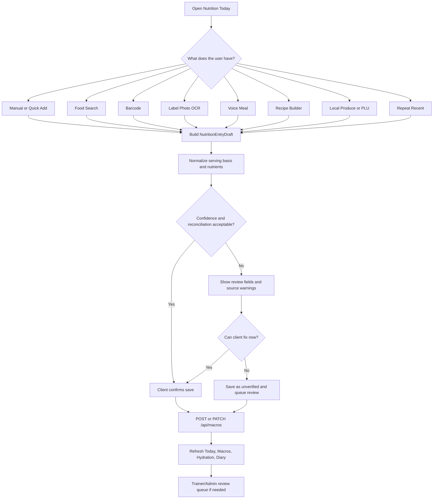

# Nutrition Decision Logger Fable-Ready Brief - 2026-07-09

Status: planning and audit packet only. No production code changes in this packet.
Owner surface: Codex planning for Sean/Fable review.
Scope: `/user-dashboard/nutrition`, shared role meal-planner routes, food scanner, manual/search/photo/voice macro logging, hydration, and admin nutrition review.
Attachment reviewed: `C:\Users\BigotSmasher\.codex\attachments\1654ba11-d4b4-4034-be11-b88947fcf6e6\pasted-text.txt`.
Attachment caveat: the audit explicitly had no direct repo access. This brief separates repo-proven facts from external recommendations.
External reference refresh: FDA Nutrition Facts serving/nutrient semantics, USDA FoodData Central API, Open Food Facts API usage, Google ML Kit barcode/OCR docs.
External reference gap: GS1 Sunrise 2027 and local-food directory claims from the attachment still need an official-source refresh before implementation.
External design reference: [MOBBIN UNAVAILABLE]. No Mobbin-like connector was available in this session, so design direction is from Swan docs and repo truth.

## Plain-English Goal

Upgrade the current nutrition tab from a set of separate tools into a single decision logger: one place where a client captures food, Swan validates what it knows, flags what it does not know, saves the diary entry honestly, and gives the trainer/admin a review trail when the data is weak.

The key product move is not just a prettier component. The logger needs to become a nutrition data system with three layers:

1. Capture: manual meal, food search, barcode, label/photo OCR, voice, recipe/meal builder, repeat meal, local produce/PLU.
2. Truth: raw values, serving basis, source system, confidence, reported-vs-calculated calories, reconciliation status, and verified state.
3. Review: client confirmation, trainer/admin review queues, food-source quality metrics, duplicate/version conflict handling.

## Current Verdict

The existing surface is real and valuable, but fragmented. `NutritionWorkspace` is the canonical client nutrition hub and already mounts Today, Log Meal, Voice, Food Search, Hydration, Macros, Meal Plan, Intelligence, and Learn. The barcode scanner is a separate live route at `/food-scanner`, not part of the nutrition tab. Manual logging only captures the big four macros even though the backend diary model can store more nutrition truth. Food search pulls external data in the browser and does not normalize source quality through a Swan-owned food catalog first. Admin review exists, but only as a partial estimate-verification queue, not a full food-data quality operation.

The pro-level upgrade should converge these lanes into a draft/review/save pipeline before adding large schema changes.

## Canonical Surface Receipt

Route file that actually mounts the target URL:

- `frontend/src/routes/main-routes.tsx:708` declares `path: 'user-dashboard'` and `:712` renders `<UserDashboardV3 />`.
- `frontend/src/routes/main-routes.tsx:718` declares `path: 'user-dashboard/:tab'` and `:722` renders `<UserDashboardV3 />`.
- `frontend/src/routes/main-routes.tsx:157-158` lazy-loads `FoodScannerPage`, and `:536/:539` mounts it at `food-scanner`.

Mounted JSX page/component:

- `frontend/src/components/UserDashboard/UserDashboard.V3.tsx:58` navigates non-home tabs to `/user-dashboard/${tab}`.
- `frontend/src/components/UserDashboard/components/UserDashboardTabsV3.tsx:43` lazy-loads `NutritionWorkspace`.
- `frontend/src/components/UserDashboard/components/UserDashboardTabsV3.tsx:208` renders `<NutritionWorkspace />` inside the nutrition tab.
- `frontend/src/components/DashBoard/workspaces/NutritionWorkspace.tsx:136` defines the workspace component.
- `frontend/src/components/DashBoard/workspaces/NutritionWorkspace.tsx:239-261` renders Today, Log Meal, Voice, and Search panels.
- `frontend/src/components/DashBoard/workspaces/NutritionWorkspace.tsx:269-288` renders Meal Plan and Intelligence under subscription locks.

Shared role routes that mount nutrition-adjacent surfaces:

- `frontend/src/components/DashBoard/UniversalDashboardLayout.routes.tsx:106` maps admin `/nutrition/:clientId?` to `NutritionPlanBuilder`.
- `frontend/src/components/DashBoard/UniversalDashboardLayout.routes.tsx:139` maps admin `/meal-planner` to `NutritionWorkspaceLazy`.
- `frontend/src/components/DashBoard/UniversalDashboardLayout.routes.tsx:162` maps trainer `/meal-planner` to `NutritionWorkspaceLazy`.
- `frontend/src/components/DashBoard/UniversalDashboardLayout.routes.tsx:188` maps client `/meal-planner` to `ClientMealPlannerRoute`.

Consumer hooks/services and frontend API strings:

- `frontend/src/components/DashBoard/workspaces/NutritionWorkspace.tsx:146` refreshes macros after meal log success.
- `frontend/src/components/FoodTracker/FoodIntakeForm.tsx:4` documents manual `/api/macros` logging.
- `frontend/src/components/FoodTracker/FoodIntakeForm.tsx:163-169` builds the macro payload and posts/patches `/api/macros`.
- `frontend/src/components/FoodTracker/useFoodSearchAddToLog.ts:28` posts search results to `/api/macros`.
- `frontend/src/components/FoodTracker/mealPhotoLog.ts:6` builds photo/AI estimate payloads for `POST /api/macros`.
- `frontend/src/pages/FoodScanner/FoodScannerPage.tsx:348` calls `/api/food-scanner/scan/:barcode`.
- `frontend/src/pages/FoodScanner/FoodScannerPage.tsx:398` calls `/api/food-scanner/search`.
- `frontend/src/pages/FoodScanner/FoodScannerPage.tsx:472-475` posts `/api/food-scanner/log-scan` with `servingSizeGrams: 100`.
- `frontend/src/components/DashBoard/workspaces/clients-team/ClientNutritionEstimateReviewPanel.tsx:87` calls `/api/macros/review-queue`.
- `frontend/src/components/DashBoard/workspaces/clients-team/ClientNutritionEstimateReviewPanel.tsx:119` patches `/api/macros/client-timeline/:entryId/verify`.

Backend route matches and shadow order:

- `backend/core/routes.mjs:361` mounts `/api/food-scanner` to `foodScannerRoutes`.
- `backend/core/routes.mjs:632` mounts `/api/macros` to `dailyMacroRosterTriageRoutes` before the general macro router.
- `backend/core/routes.mjs:633` mounts `/api/macros` to `dailyMacroRoutes`.
- `backend/core/routes.mjs:634` mounts `/api/hydration` to `hydrationRoutes`.
- `backend/core/routes.mjs:639` mounts `/api/meal-plans` to `mealPlanRoutes`.
- `backend/core/routes.mjs:640` mounts `/api/free` to `freeApiRoutes`.
- Shadow note: `/api/macros/review-queue` and `/api/macros/client-timeline/:entryId/verify` are claimed by the triage router first; generic macro routes handle `/`, `/weekly`, and `/:id` after that.

Authoritative model fields:

- `backend/models/DailyMacroLog.mjs:24-180` has `userId`, `date`, `mealType`, `description`, `calories`, `protein`, `carbs`, `fat`, `fiber`, `sugar`, `sodium`, `addedSugar`, `saturatedFat`, `transFat`, `cholesterol`, `novaGroup`, `brandName`, `mealSource`, flag columns, `items`, `source`, `aiConversationId`, and `verified`.
- `backend/models/FoodProduct.mjs:18-108` has `barcode`, `name`, `brand`, `description`, `ingredientsList`, `ingredients`, `nutritionalInfo`, `overallRating`, `ratingReasons`, `healthConcerns`, `isOrganic`, `isNonGMO`, `category`, `imageUrl`, `healthierAlternatives`, `dataSource`, `lastVerified`, and `scanCount`.

## Surface Classification

| Surface | Classification | Evidence | Decision |
| --- | --- | --- | --- |
| `/user-dashboard/nutrition` -> `NutritionWorkspace` | canonical | `main-routes.tsx:718/:722`, `UserDashboardTabsV3.tsx:43/:208` | Main client nutrition decision logger target. |
| Dashboard `/meal-planner` routes | canonical shared role surface | `UniversalDashboardLayout.routes.tsx:139/:162/:188` | Must stay compatible with role dashboards. |
| Admin `/nutrition/:clientId?` | canonical adjacent builder | `UniversalDashboardLayout.routes.tsx:106` | Nutrition-plan builder, not the diary logger itself. |
| `/food-scanner` | live but separate | `main-routes.tsx:536/:539`, `FoodScannerPage.tsx:594` imports routed scanner component | Converge into nutrition capture flow or expose as a first-class launcher from NutritionWorkspace. |
| `components/FoodScanner/BarcodeScanner.tsx` | canonical for `/food-scanner` route | `FoodScannerPage.tsx:7/:594` | Current routed scanner component. |
| `components/FoodTracker/BarcodeScanner.tsx` | dormant/ambiguous | current grep found no JSX mount; comments reference scanner pipeline | Do not build on it until a caller is proven or it is intentionally adopted. |
| `ClientNutritionEstimateReviewPanel` | canonical partial review support | `ClientNutritionEstimateReviewPanel.tsx:87/:119/:175` | Useful start, but not a full food-source quality console. |

## Primary Gaps

1. Fragmented capture: Today, manual log, search, voice/photo, meal plan, intelligence, and barcode scanning are separate experiences. Users should not have to know which tool owns the food they are trying to log.
2. Manual logger under-captures data: `FoodIntakeForm.logic.ts:4-11` stores item name, quality, calories, protein, carbs, and fat only. It omits serving basis, grams, fiber, sugar, sodium, source, confidence, barcode/FDC/OFF IDs, and reconciliation status.
3. Existing model capacity is underused: `DailyMacroLog` can store fiber, sugar, sodium, added sugar, fats, NOVA, brand, meal source, flags, source, and verification, but the primary manual form does not populate most of it.
4. Search runs too much in the client: `FoodSearchPanel.logic.ts:55` uses USDA endpoint directly, while `:148` fetches the external API from the browser. USDA states API keys must not be publicly exposed, so Swan should proxy/cache through the backend.
5. Scanner is not in the nutrition tab: `/food-scanner` is live, but NutritionWorkspace only labels Food Search with a barcode icon. This is a UX mismatch and a data-flow mismatch.
6. Scanner write path assumes a 100g default: `FoodScannerPage.tsx:472-475` posts `servingSizeGrams: 100`; `foodScannerRoutes.mjs:488-493` scales from per-100g values. That is useful but not enough for label-serving, household measure, package-serving, or weighed quantity.
7. Food catalog lacks pro provenance: `FoodProduct` has source and `lastVerified`, but lacks source version, market country, confidence score, review status, duplicate GTIN conflict handling, serving normalization, and raw source payload linkage.
8. Schema drift risk in scanner admin edit: `foodScannerRoutes.mjs:375-376` updates `nutritionFacts`, `healthScore`, and `allergens`, while `FoodProduct.mjs:50/:55` uses `nutritionalInfo` and `overallRating` and has no first-class `allergens` field.
9. Admin review is too narrow: the current review queue is for unverified macro estimates. The pro system needs queues for unmatched scans, low OCR confidence, stale source records, source conflicts, and incomplete nutrient panels.
10. Local/produce workflows are not tied to diary truth: Farm Finder, Garden, and produce-style intelligence exist as content/tool surfaces, but they do not create source-tagged diary entries with PLU/local source provenance.

## External Reference Implications

- FDA label semantics require serving size and nutrient values to be treated as serving-dependent. The system must preserve label serving, grams, and multiplier logic instead of only storing final display totals.
- USDA FoodData Central offers Food Search and Food Details endpoints, requires an API key, has key-responsibility language, and documents Branded Foods as a browseable data type. Swan should not expose USDA keys in browser code.
- Open Food Facts read operations do not require auth beyond a custom User-Agent, but app identity and usage-form expectations matter for production usage.
- Google ML Kit barcode scanning can run on-device for linear and 2D formats; Text Recognition v2 returns text structure and confidence, which supports a label-photo review flow.

Source links for final review packet:

- FDA Nutrition Facts Label: https://www.fda.gov/food/nutrition-facts-label/how-understand-and-use-nutrition-facts-label
- USDA FoodData Central API Guide: https://fdc.nal.usda.gov/api-guide.html
- Open Food Facts API docs: https://openfoodfacts.github.io/openfoodfacts-server/api/
- Google ML Kit Barcode Scanning: https://developers.google.com/ml-kit/vision/barcode-scanning
- Google ML Kit Text Recognition v2: https://developers.google.com/ml-kit/vision/text-recognition/v2

## North Star System

Working name: Nutrition Decision Logger.

The logger should start from the user's question, not from the app's component boundaries:

- I have the package: scan barcode or type barcode.
- I have the label: photo/OCR the label, then confirm low-confidence fields.
- I know the food name: search Swan cache, USDA, and Open Food Facts.
- I cooked a meal: recipe/meal builder.
- I ate local produce: PLU/name/source/farmers-market mode.
- I want speed: quick-add macros, repeat recent, voice meal.

All lanes should produce the same internal object before saving:

```ts
type NutritionEntryDraft = {
  captureMode: 'manual' | 'search' | 'barcode' | 'label_photo' | 'voice' | 'recipe' | 'quick_add' | 'local_produce' | 'repeat';
  date: string;
  mealType: string;
  description: string;
  servingBasis: 'label_serving' | 'per_100g' | 'weighed' | 'household' | 'manual_estimate';
  amountValue: number | null;
  amountUnit: string | null;
  servingWeightGrams: number | null;
  nutrientsReported: Record<string, number | null>;
  nutrientsCalculated: Record<string, number | null>;
  reconciliationStatus: 'matched' | 'rounded_label' | 'calculated_differs' | 'missing_source' | 'user_estimate';
  sourceSystem: 'swan_verified' | 'usda_fdc' | 'open_food_facts' | 'manual' | 'ocr' | 'voice' | 'local_directory';
  sourceRecordId: string | null;
  confidenceScore: number | null;
  reviewStatus: 'client_confirmed' | 'needs_client_review' | 'needs_trainer_review' | 'needs_admin_source_review' | 'verified';
  rawPayloadRef?: string;
  items: Array<Record<string, unknown>>;
};
```

The user-facing save still writes to `DailyMacroLog`; the draft object becomes the shared contract that keeps every capture method honest.

## Data Architecture Recommendation

Do not rip out `DailyMacroLog`. It is already the correct diary-row anchor. Extend around it.

Phase A - no migration, convergence first:

- Add a shared frontend draft builder for manual/search/photo/voice/barcode flows.
- Populate existing `DailyMacroLog` fields more fully: fiber, sugar, sodium, added sugar, fat subtypes, brand, mealSource, flags, source, verified.
- Store source/provenance extras in `items` JSON while the schema is being reviewed.
- Preserve `verified: false` for estimates and AI-generated/photo/voice entries.

Phase B - durable provenance:

- Add `NutritionSourceRecord` or extend `FoodProduct` with source version date, market country, confidence score, review status, normalized serving fields, raw source payload hash/ref, source freshness, and conflict grouping.
- Add `DailyMacroLog` columns for `sourceRecordId`, `servingBasis`, `servingWeightGrams`, `caloriesReported`, `caloriesCalculated`, `reconciliationStatus`, `confidenceScore`, and `reviewStatus` only after Fable approves the contract.
- Keep `FoodProduct` for barcode/product identity; avoid forcing recipe/local/manual data into a packaged-food-only table.

Phase C - review operations:

- Add a food-data quality queue for unmatched barcode, OCR low confidence, stale source, source conflict, incomplete nutrients, and duplicate GTIN/version conflicts.
- Promote trainer/admin verification actions into first-class audit events, not silent boolean flips.

## Wireframe Direction

Desktop layout:

```text
+--------------------------------------------------------------------------------+
| Today Command Ribbon: date, next action, macro ring, hydration, streak, review  |
+----------------------+-----------------------------------+---------------------+
| Capture Rail          | Draft / Review Panel              | Source Truth Panel  |
| - Quick Add           | - editable food lines              | - source system     |
| - Search              | - serving basis                    | - confidence        |
| - Barcode             | - nutrient comparison              | - conflicts         |
| - Label Photo         | - raw vs calculated calories       | - trainer notes     |
| - Voice               | - save / needs review controls     | - admin queue tags  |
| - Recipe              |                                   |                     |
| - Local Produce       |                                   |                     |
+----------------------+-----------------------------------+---------------------+
| Diary Timeline: meals, verification chips, quick repeat, trainer/admin review   |
+--------------------------------------------------------------------------------+
```

Mobile layout:

```text
[Today summary]
[Capture mode segmented control]
[One active capture card]
[Draft review accordion]
[Source/confidence chips]
[Sticky save/review bottom action bar]
[Diary timeline]
```

Responsive constraints:

- All capture choices are 44px minimum controls.
- No hover-only actions.
- Source chips wrap, not clip.
- The draft review panel becomes a single column before 768px.
- The diary timeline is below capture on mobile and right/bottom on desktop depending on density.
- Verify at 414px, 768px, 1440p/QHD, and 4K before claiming UI completion.

## Flowchart



## Swan Design Directions For Review

Direction 1 - Nutrition Control Tower:

- Best for power users and trainer-led accountability.
- Shows capture rail, central draft review, source-truth panel, and diary timeline in one dense but organized surface.
- Most aligned with SwanStudios as an operating system.
- Risk: can feel complex if mobile progressive disclosure is not strict.

Direction 2 - Food Passport Ledger:

- Best for provenance/source truth and local/farm/PLU workflows.
- Each food behaves like a passport: source, serving, nutrients, confidence, local tag, history.
- Strong for pro data quality and future admin workflows.
- Risk: may slow down fast daily logging unless quick-add/repeat stays prominent.

Direction 3 - Coach-Guided Today:

- Best for low-friction client adherence.
- The Today panel presents one strongest next action, then opens the right capture flow.
- Keeps users moving; trainer/admin complexity lives behind source chips and review queues.
- Risk: may hide advanced modes unless the capture rail remains discoverable.

Recommendation to send into free review: Direction 1 as the desktop architecture, Direction 3 as the mobile interaction model, with Direction 2 as the provenance language inside food/source cards.

## Implementation Slices

Slice 0 - planning packet:

- This document.
- No app code changes.
- Ready for free review and Fable review.

Slice 1 - converge frontend capture shell:

- Modify `NutritionWorkspace` to replace tab sprawl with a Today command ribbon plus capture modes.
- Keep existing mounted components behind the new shell.
- Add scanner launcher/integration decision without deleting `/food-scanner`.
- Tests: active mode transitions, Today next-action routing, existing log/search save callbacks still refresh macros.

Slice 2 - shared draft contract:

- Add `NutritionEntryDraft` utilities and unit tests.
- Convert manual and search payload builders to populate richer existing `DailyMacroLog` fields.
- Keep `verified: false` for estimated lanes.
- Tests: manual/search draft normalization, serving-basis math, no regression in `/api/macros` payload shape.

Slice 3 - barcode and label-photo convergence:

- Move barcode capture into the nutrition shell or embed a stable launcher to `/food-scanner` with return-to-nutrition state.
- Use backend scanner service as source of truth; do not expose external provider secrets client-side.
- Label-photo path creates a draft with OCR confidence and client confirmation before save.
- Tests: unmatched barcode fallback, 100g vs label-serving handling, scanner save refreshes Today.

Slice 4 - backend provenance schema:

- Fable-approved migration only.
- Add source record/reconciliation fields, or add a dedicated source-record table if preferred.
- Fix `foodScannerRoutes.mjs:375-376` schema drift while touching this area.
- Tests: model migration, macro source normalization, scanner log-save preserves source/reconciliation.

Slice 5 - calculation and reconciliation engine:

- Store raw source nutrients and display totals separately.
- Add calories reported vs calories calculated with reconciliation status.
- Preserve label rounding differences; do not falsely mark rounded discrepancies as errors.
- Tests: per-serving, per-100g, weighed grams, household measure, and label-rounded cases.

Slice 6 - admin data-quality layer:

- Extend the current estimate review queue into a source quality console.
- Queues: unmatched scans, low OCR confidence, duplicate GTIN/source conflict, stale source, incomplete nutrients, local item verification.
- Tests: reviewer RBAC, queue filters, audit receipt, verify action does not mutate unrelated rows.

Slice 7 - local produce/farm mode:

- Add PLU/name/local-source draft lane.
- Local pilot source tags can include farmers market, CSA, farm, or manual local source.
- Keep nutrition values honest as estimate/source-backed until reviewed.
- Tests: local produce draft, source tag persistence, review queue handoff.

Slice 8 - design QA and release hardening:

- Responsive matrix: 414px, 768px, 1440p/QHD, 4K.
- Accessibility: focus states, 44px controls, color-token contrast, reduced motion.
- Verify no client-side USDA key exposure remains.
- Route smoke: `/user-dashboard/nutrition`, role `/meal-planner`, `/food-scanner`, macro save, scanner save, review queue.

## Acceptance Criteria

- One canonical nutrition capture shell exists for the client nutrition tab.
- Every capture lane produces a reviewable draft before save.
- Manual/search/barcode/photo/voice/recipe/local/repeat lanes are either implemented or clearly gated with honest unavailable states.
- The diary row preserves source, serving basis, confidence, verified state, and nutrient detail wherever the backend supports it.
- Client-facing estimates are never silently presented as verified facts.
- External food APIs are backend-owned or proxied; API keys are not publicly exposed in browser code.
- Barcode misses fall back to search or label-photo draft, not a dead end.
- Admin/trainer review can see why an entry needs review.
- Existing `/api/macros` mount order and triage routes keep working.
- UI follows Swan dark-first, styled-components, token fallback, 44px touch target, Victory chart, and responsive rules.

## Free AI Village Review Prompt

Use this prompt after Sean approves running a free-only review. Do not run paid/full AI Village models unless Sean explicitly approves the model set and estimated cost.

```text
You are reviewing the SwanStudios Nutrition Decision Logger plan. Treat this as a rigorous architecture, product, data-truth, and UX review before implementation.

Repo context: SwanStudios / SS-PT is a React 18 + TypeScript + styled-components frontend and Node/Express/Sequelize/Postgres backend. Production stability, real data truth, and workout-progress-first nutrition support matter more than cosmetic polish.

Review artifact: docs/ai-workflow/AI-HANDOFF/NUTRITION-DECISION-LOGGER-FABLE-READY-BRIEF-2026-07-09.md

Ask:
1. Identify any incorrect route, model, API, or component assumptions in the packet.
2. Stress-test the proposed NutritionEntryDraft contract. What fields are missing, over-modeled, or risky?
3. Review the slice order. What should move earlier or later to reduce production risk?
4. Review the scanner/search/data-source architecture. Should Swan create a new source-record table, extend FoodProduct, or use a hybrid?
5. Review the admin data-quality workflow. What queues are essential for v1 and what should be deferred?
6. Review the wireframe directions. Choose the best desktop and mobile interaction model for real clients and trainers.
7. List must-fix blockers before coding and nice-to-have improvements after v1.
8. Return a concise verdict: APPROVE PLAN, APPROVE WITH CHANGES, or REVISE BEFORE FABLE.

Constraints:
- Use only file-line evidence from the packet or ask for more evidence.
- Do not recommend Material UI, Recharts, public API keys, mock-only charts, or fake verified nutrition data.
- Keep estimates unverified until client/trainer/admin confirmation.
- Preserve existing `/api/macros` and `/food-scanner` behavior while converging UX.
```

## Final Fable Review Prompt

```text
Fable, act as final decider for the SwanStudios Nutrition Decision Logger upgrade.

You are reviewing a planning packet, not code. The goal is to approve or correct the architecture before implementation starts.

Primary artifact:
docs/ai-workflow/AI-HANDOFF/NUTRITION-DECISION-LOGGER-FABLE-READY-BRIEF-2026-07-09.md

Decision needed:
1. Should SwanStudios build this as a converged NutritionWorkspace capture shell first, or start with backend provenance schema first?
2. Should the durable source model be: extend FoodProduct, add NutritionSourceRecord, or hybrid packaged-food + source-record architecture?
3. Is the NutritionEntryDraft contract sufficient for manual/search/barcode/label-photo/voice/recipe/local/repeat modes?
4. Which design direction should govern desktop and mobile: Nutrition Control Tower, Food Passport Ledger, Coach-Guided Today, or a hybrid?
5. What are the v1 must-have lanes and what should be deferred to avoid overbuilding?
6. What acceptance criteria must be non-negotiable before Sean lets this go live?

Known repo facts from the packet:
- `/user-dashboard/:tab` mounts `UserDashboardV3`, which mounts `NutritionWorkspace` under the nutrition tab.
- `/food-scanner` is live but separate from NutritionWorkspace.
- `DailyMacroLog` already supports richer nutrient fields than the primary manual logger uses.
- `/api/macros` has triage routes mounted before the general macro router.
- `FoodProduct` lacks production-grade source version/confidence/review fields.

Return:
- Final architecture decision.
- Slice order with any changes.
- Data model verdict.
- UI direction verdict.
- Blockers before code.
- Specific edits to make to the brief before implementation.
```

## Fable Context Compression Note

This review should be text-first. Do not send screenshots or image-rendered code to Fable until a UI mock exists. The current artifact is route/model/API evidence plus planning; exact text is higher value than pixels.

## What Not To Do Yet

- Do not delete or rewrite `NutritionWorkspace`.
- Do not remove `/food-scanner`.
- Do not migrate nutrition schema until Fable chooses the source-record architecture.
- Do not expose USDA or other provider keys in browser code.
- Do not treat AI/photo/voice estimates as verified.
- Do not broaden into unrelated dashboard redesign work while Claude is actively editing Home dashboard files.

## Open Questions For Sean/Fable

1. Should scanner become embedded directly in NutritionWorkspace, or remain a separate route with a first-class Nutrition return path?
2. Should v1 include label-photo OCR, or should it start with barcode/search/manual convergence and add OCR in v2?
3. Does Sean want local produce/farm mode in v1, or should it be a separate farm-market slice after the core diary truth lands?
4. Should trainers be allowed to verify client entries, or should only admins mark food-source records as verified?
5. How much admin operation is expected now: lightweight review queue or full food-data command center?

## Immediate Next Step

Run the free-only review prompt against this packet, apply any corrections, then send the corrected packet to Fable for final architecture approval before coding.
