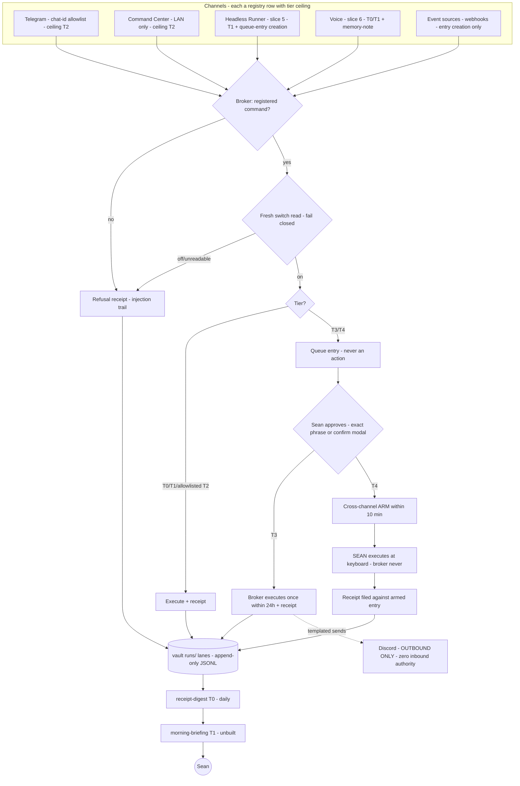
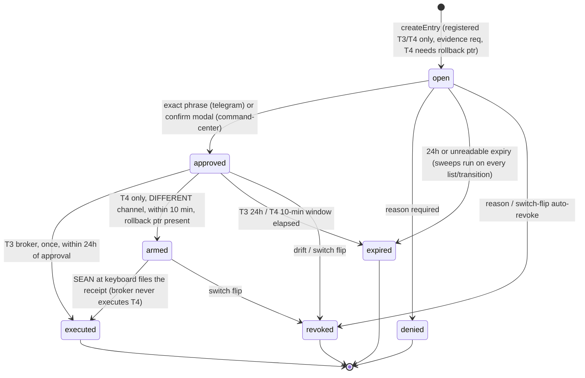
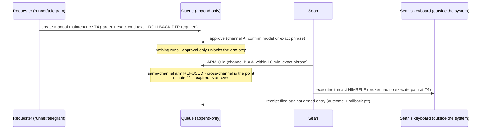
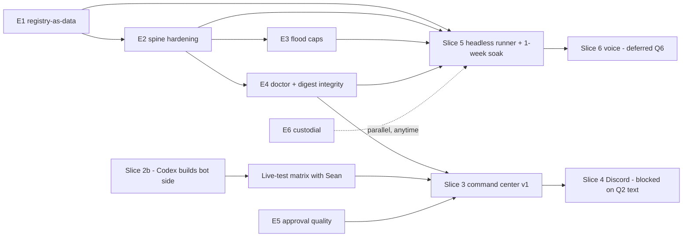

# OPUS 4.8 BUILD HANDOFF — Hermes Agentic OS · Fable Control Layer

- **Date:** 2026-07-04 · **Author:** Fable (claude-fable-5) · **Audience:** Opus 4.8 acting as deputy builder/Final-Decider-fallback (CLAUDE.md Co-Orchestrator Hierarchy)
- **What this is:** the complete, self-contained build handoff for the Hermes Agentic OS runtime — everything built, everything specced-but-unbuilt, a system-wide hostile review with ranked gaps, and an ordered enhancement plan (E-slices) you can execute.
- **Ship state at handoff:** origin/main @ `aa76f0b1b` — doc layer (`529edc02a`) + runtime Slice 1 (`382f56505`) + Slice 2 repo side (`aa76f0b1b`). 39/39 tests green (`node --test scripts/hermes/*.test.mjs` — use the GLOB form; the bare-directory form misbehaves on Windows).
- **Naming warnings:** "Paybolt" = 2026-07 transcription error for **Fable** — never reintroduce. If a transcript says "OAuth" as an agent name, it means **Opus**.

---

## 0. Read me first — your rails in this system

1. **You are the deputy Final Decider when Fable is absent** (rule 46 as amended 2026-06-10). Codex's review verdicts are mandatory *input*, advisory *authority*. You arbitrate; CLAUDE.md rules win over any reviewer suggestion.
2. **Slice authorization — AMENDED by Sean 2026-07-04:** implementation-slices.md §0 required a per-slice yes; Sean has now granted a **scoped standing authorization for this build as a recursive loop** ("make this a loop or a goal so that it doesn't stop until it's done — this would be a recursive build"). Effect: E1–E6 and slices auto-advance WITHOUT per-slice re-asking, **inside the loop boundary defined in §11** — repo-side scripts/docs/tests only. Everything in §11's HARD-PAUSE list still stops for Sean or Codex. This amendment governs where it conflicts with §0; record it in implementation-slices.md when you first touch that file.
3. **Rule 67 lanes:** read `.ai-workflow/coordination/claude.lane.md` + `codex.lane.md` + `review-queue.md` BEFORE any edit. Slice 2 bot side is **Codex's build lane** (live-bot heritage) — do not take it over; hostile-review it.
4. **Load order for canon:** bridge (`docs/ai-workflow/references/HERMES-SWANSTUDIOS-OPERATOR-BRIDGE.md`, T0–T4 vocabulary) → `docs/ai-workflow/hermes-agentic-os/index.md` → the specific doc the slice cites. Never code against memory of a spec; open it.
5. **Hard rails:** no shell through chat surfaces, ever (FORBIDDEN registry rows exist so the refusal is documented). No DB access from brain lanes — SwanStudios APIs only. No paid AI Village without Sean's per-run yes (rule 16). Push = Render deploy; commit by explicit path only (never `git add -A`).
6. **The vault is never in the repo.** Runtime data lives at `HERMES_VAULT_ROOT` (default `~/.hermes/vault`); switches at `HERMES_SWITCHES_FILE` (default `~/.hermes/switches.json`). Tests use temp dirs.

## 1. What this system is (one page)

A governance-first operator OS for SwanStudios. Every action an agent can take is a **registered command** with a tier:

> **T0** read · **T1** draft (labeled DRAFT) · **T2** bounded internal write (standing allowlist: exactly `memory-note`, `queue-approve`, `queue-deny`, `switch-flip` — open-questions Q1 DECIDED) · **T3** external-visible (per-send queue approval by Sean) · **T4** destructive/irreversible (queue + **cross-channel arm** + **HUMAN execution — the broker never executes T4**).

Unregistered = BLOCKED with a refusal receipt. Every T2+ action writes an append-only receipt; T0/T1 write lightweight lines in the same stream. Kill switches are read fresh before every execution and **fail closed** (unreadable brake = pulled brake) — except receipt-writing itself, which is deliberately switchless (the one thing that must never be off). A daily digest turns the receipt stream into counts / attention lines / approval flow / switch activity / silence check. The product (SwanStudios app) keeps serving clients with every operator switch pulled.

## 2. Architecture map



Machines: **5090 (Windows)** = Hermes runtime + vault + switches + future command center (LAN-only). **Pi** = Telegram bot relay (Codex's lane). **Repo** = docs canon + `scripts/hermes/` deterministic tooling. **Render/Postgres** = the product; brain lanes never touch it except through SwanStudios APIs.

## 3. Current state ledger — slice by slice

| Slice | Objective | Status | Builder → Reviewer | Gate to close |
|---|---|---|---|---|
| **1** Receipt + queue spine | receipt writer/reader, queue store, digest, prune | **BUILT + SHIPPED** `382f56505`; 31 tests | Claude → Codex | Codex hostile review (OPEN in review-queue) + Sean reads golden digest |
| **2a** Switches (repo side) | switch-status/switch-flip + §6 auto-revoke | **BUILT + SHIPPED** `aa76f0b1b`; 8 tests | Claude → Codex | folded into the same OPEN review |
| **2b** Telegram broker hardening (bot side) | registered-commands-only matcher, APPROVE/ARM/KILL/RESUME phrase handlers, allowlist re-verify, fresh switch reads | **NOT BUILT** — dense handoff in review-queue | **Codex** → Claude/Opus (line-by-line vs channels-and-brokers.md §2) | build + live-test matrix from Sean's phone |
| **3** Command center v1 | 3 buttons: health-sweep T0 · morning-briefing T1 · approval-queue T2 (Q5 DECIDED) | NOT BUILT | Claude/Opus (design via swan-design-router, Crystalline Cyberforest) → Codex | graduation criteria (Q8): slice-1/2 receipting + registered commands + Sean used the prototype |
| **4** Discord alert broker | templated T3 sends, rate caps, per-send queue | NOT BUILT — **blocked on Q2 exact template text** (Sean, individually) | Codex → Claude/Opus | template text approval; send authority stays per-send |
| **5** Headless runner | acquire→switch→execute→receipt loop, retries, dead-letter, auto-demotion, silence ledger | NOT BUILT | Claude/Opus → Codex | ships with `SWITCH_HEADLESS_RUNNER` off; 1-week T0-only soak; **E-slices below are prerequisites** |
| **6** Voice placeholder | wake-word + STT, T0/T1 + memory-note ceiling | NOT BUILT — deferred (Q6 DECIDED: defer) | Claude/Opus → Codex | Sean picks hardware + vocabulary yes |

Also live: 8 open-questions DECIDED 2026-07-04 (delegation) · 2 PROPOSED T2 registry rows (`receipt-prune`, `vault-init`) awaiting Sean per registry §4 · rule-48 audit record `FABLE-CONTROL-LAYER-AUDIT-RECORD-2026-07-04.md` (its §10 hooks are folded into §6 below) · S17 Hermes teaching paste (120 doc) awaits Sean at the Pi.

## 4. Document inventory — what governs what

**Reference layer (`docs/ai-workflow/references/`):**
- `HERMES-SWANSTUDIOS-OPERATOR-BRIDGE.md` — THE tier ladder (§4), approval law (§7), receipts mandate (§8), switch mandate (§9). Everything cites this; it never restates siblings. §11 decided.
- `SWANSTUDIOS-AI-SKILL-AND-OPERATOR-REGISTRY.md` — who may do which job at which tier; unregistered = BLOCKED. §14 decided.
- `FABLE-WORKFLOW-INTEGRATION-SPEC.md` — when to spend Fable vs Codex/Claude/Village; §12 decided (Claude-family Decider chain; Fable = standing orchestrator; specs carry 90-day stale-review dates).
- `FABLE-CONTEXT-COMPRESSION-PROTOCOL.md` — token-economy rules + estimator; proxy rows stay FORBIDDEN pending provenance gates.

**Runtime canon (`docs/ai-workflow/hermes-agentic-os/`, 21 docs):** `index.md` (map) · `agentic-os-principles.md` (§12 one-honest-slice) · `architecture.md` (trust rings) · `command-effect-registry.md` (runtime rows — the broker's whole vocabulary) · `approval-gates.md` (queue law; §5 T4 two-step) · `audit-receipts.md` (schema §2, storage §3, digest §5) · `kill-switches.md` (three laws; inventory) · `channels-and-brokers.md` (per-channel law; §2 is slice-2b's acceptance spec) · `headless-runner-spec.md` (slice 5 contract) · `dashboard-command-center-spec.md` + `dashboard-button-registry.md` (slice 3) · `memory-and-state.md` (three brains; vault lane law) · `run-logs-and-self-improvement.md` (redaction §2; retention §3; NO self-modification §4) · `loop-engineering.md` (drift + approval-reset) · `approval/channel/distribution/skills/workflow/audit companions` · `open-questions.md` (Q1–Q8 DECIDED) · `implementation-slices.md` (the slice plan §0 ground rules) · `prototypes/hermes-agentic-os-command-center.html` (static Crystalline Cyberforest prototype).

**Design Brain (`docs/ai-workflow/design-brain/`):** `design.md` CANONICAL (design.html is a mirror; md wins) · motion/components/anti-patterns/qa-gates · 8 adapters (adapters never coin tokens) · website-archetypes (20) · cinematic-pages · obsidian/ + graphify/ bridges. Semantics: success=Ice Wing · warn=Gilded Fern · info=Swan Lavender · danger=`#E5484D` (the ONE off-palette semantic). Tier badges: T0 Ice Wing · T1 Swan Lavender · T2 Gilded Fern · T3 Wing Purple · T4 danger red. Loaded by `swan-design-router` (load-order item 4 — wired 2026-07-04).

**Upgrade packet (`docs/ai-workflow/FABLE-HERMES-WORKFLOW-UPGRADE/`):** 100–160 series + checkpoints/010–050. Note: a LEGACY 000–090 series from an earlier lane also exists on origin — hygiene item, see finding G-14.

## 5. Built components — logic by logic (`scripts/hermes/`, all ≤300 lines, tests beside each)

### 5.1 `hermesRunsLib.mjs` (219L) — the shared core
- **Lanes:** `ensureLanes()` scaffolds `runs/{receipts,logs,queue,digests,archive}` each with an `index.md` (the lane law). Idempotent.
- **Switches:** `readSwitches()` fresh-read, never cached; `checkSwitches(names, ctx)` fail-closed — missing file, corrupt JSON, or non-`true` value ⇒ refusal receipt naming the blocker + throw. `seedSwitches()` writes the 9-switch inventory (kill-switches.md §4), all on.
- **Redaction at write (`redactText`):** Stripe/OpenAI-style `sk_live_`/`sk-`/`whsec_`, Slack `xox*`, Google `AIza`, JWTs, Telegram bot tokens, credentialed postgres URLs, PEM blocks → `<REDACTED-KEY>`; emails → `<REDACTED-EMAIL>`; 500-char cap with honest `[truncated N chars]` marker. Applied to EVERY receipt field.
- **Receipts:** `validateReceipt` enforces the 7 fixed fields, ISO `when`, outcome must start `ok|failed|refused|partial`, `target ≠ "various"`. `writeReceipt` assigns `R-YYYYMMDD-NNN` (scan-then-append — see finding G-2) and appends one JSONL line. **No update/delete surface exists — test-locked by export-name scan.**

### 5.2 `queueModel.mjs` (285L) — the lifecycle engine



- State = replay of append-only create/transition records across all `runs/queue/**` files; no in-place mutation anywhere.
- `QUEUEABLE` = doc-mirrored seed (`discord-alert`→T3/`SWITCH_DISCORD_BROKER`, `manual-maintenance`→T4/`SWITCH_MASTER`); FORBIDDEN rows refuse by name; T2 asking to queue is a tier error. **Slice 2b must replace this constant with a live registry lookup — one source of truth (finding G-1).**
- `autoRevokeForSwitch` (approval-gates §6): off-flip revokes dependent open/approved/armed entries; MASTER revokes all; deliberately not switch-gated (it runs the moment after MASTER may have gone off).
- Every resolution transition writes a receipt: `queue-approve/deny (T2)` vs `<action> (T3/T4)` for arm/execute, with `approved-by` carrying the queue-id + resolver.

### 5.3 CLIs — `receipt-write.mjs` (75L) · `queue.mjs` (60L) · `switches.mjs` (104L)
- `receipt-write init` — scaffold lanes + seed switches IF absent; receipted as `vault-init (T2)` (proposed row). `write`/`list` — no mutation subcommand exists by design.
- `queue create|list|approve|deny|arm|execute|revoke` — thin argv layer over the model; refusals exit 2 after the refusal receipt lands.
- `switches status|flip` — **neither is switch-gated** (registry: "must work when everything else is off"; flip IS the resume path). Status answers even with the store unreadable (reports fail-closed posture, `partial` receipt). Flip refuses unknown names (adding a switch is a registry change, kill-switches.md §6) and unreadable stores (masters — daemon stop — are the fallback brakes); receipts every flip with the state diff and any auto-revocations.

### 5.4 `receipt-digest.mjs` (139L) — audit-receipts §5 exactly
Counts by tier (T4>0 is always a headline) · attention lines (failed/refused/partial + evidence pointer) · approval flow (opened/approved/denied/expired + median open→resolved) · switch activity · silence check (schedule.json; missing schedule reported honestly as "pre-slice-5"; unreadable schedule = every scheduled command treated silent, fail closed). Writes `runs/digests/digest-<date>.md` + the human view `runs/receipts/<month>/receipts-<date>.md`; JSONL stays the source. Gated on `SWITCH_MASTER`+`SWITCH_RECEIPT_DIGEST`; output is deterministic (golden-file locked at `scripts/hermes/fixtures/golden-digest-2026-07-01.md` — **Sean's 30-second review of that file is still owed**).

### 5.5 `receipt-prune.mjs` (92L) — retention (Q4 DECIDED)
90-day hot window; aged dated files gzip into `runs/archive/<lane>/…` with byte-verified roundtrip, then removed from hot — moved, never deleted, never leaves the vault. Same-day clamp (hostile-review catch): today's files can never be archived, killing a duplicate-R-id hazard. Dry-run mode. Itself receipted.

### 5.6 T4 flow — the sequence Opus must never "optimize"



## 6. HOSTILE REVIEW — system-wide findings (the "what are we missing" pass)

Method: re-attacked every built component, every spec'd-but-unbuilt surface, and the seams between them. `[VERIFIED]` = reproduced from code/tests this session; `[HYPOTHESIS]` = reasoned, needs a probe before acting.

### 6.1 Ranked gaps and enhancements

| # | Finding | Class | Severity | Fix lands in |
|---|---|---|---|---|
| G-1 | **Registry is prose, runtime mirrors it by hand.** `QUEUEABLE`, switch inventory, T2 allowlist, FORBIDDEN rows are constants transcribed from markdown. Drift between doc and runtime is undetectable today. [VERIFIED] | integrity | **P0** | E1 |
| G-2 | **Receipt/queue id allocation is scan-then-append** — two concurrent writers (runner + Telegram broker, exactly what slices 2b+5 create) can mint the same `R-…-NNN`. Documented but unfixed. [VERIFIED] | correctness | **P0** (before any second writer) | E2 |
| G-3 | **Append-only is a promise, not tamper-evident.** Nothing detects an edited/truncated JSONL line after the fact. A hash-chained receipt stream (each record carries `prev`) makes the flight recorder verifiable end-to-end for ~10 lines of code. [VERIFIED gap] | integrity | **P0** | E2 |
| G-4 | **Approval-fatigue flood is unmitigated.** Nothing caps open queue entries per requester; a buggy runner (or a compromised event source) can bury the one malicious entry under 50 noise entries and train Sean to rubber-stamp. Refusal receipts are similarly unbounded (log-lane flood). [VERIFIED] | security | **P0** | E3 |
| G-5 | **No self-diagnosis command.** First registered command should be `hermes-doctor` (T0): lanes exist + indexes honored, switches readable, receipt append+read roundtrip, chain intact (G-3), clock sane, schedule readable. It's the health panel's data source (slice 3) and the runner's pre-flight (slice 5). Missing entirely. | capability | **P0** | E4 |
| G-6 | **Crash-durability of the spine is unexamined.** `appendFileSync` without fsync policy; a power cut mid-line leaves a torn JSONL record (currently parsed as `__unparseable` and silently counted as T0 — double gap: G-7). Non-atomic switches-file write fails closed (good) but temp+rename is the correct posture. [VERIFIED] | durability | P1 (must land before slice-5 soak) | E2 |
| G-7 | **Malformed receipts degrade silently.** `tierOf()` defaults junk to T0; `__unparseable` lines never surface in the digest. The digest needs an "integrity" attention class: unparseable lines, tier-less receipts, chain breaks. [VERIFIED] | observability | P1 | E4 |
| G-8 | **Queue evidence pointers are never dereferenced.** Sean approves T3/T4 on `evidence` he may not be able to open. Validate-at-create (does the receipt id / path resolve?) + render the evidence excerpt into the approval card (slice 3). | quality | P1 | E5 / slice 3 |
| G-9 | **Armed T4 entries can linger forever.** No staleness surfacing — an armed-but-never-filed entry is exactly the receipt gap the doctrine forbids. Digest: "armed > 24h with no filed receipt" = headline attention line. | observability | P1 | E4 |
| G-10 | **Clock integrity is assumed.** Expiry sweeps, the 10-min arm fuse, and future runner schedules all trust wall clock; a backwards clock jump silently extends approval windows. `hermes-doctor` records last-seen-time; regression ⇒ attention item + refuse arm operations until acknowledged. [HYPOTHESIS on exploitability — window math is UTC-parse based; verify with a probe before building more than the sanity check] | security | P1 | E4 |
| G-11 | **Digest has no delivery path and briefing is vapor.** `morning-briefing` (T1) is registered but unimplemented; the digest lands in a folder Sean must remember to open. Slice-3 button + (later) runner scheduling close this; interim: a `briefing-render` that composes digest + queue-open + switch table into one markdown Sean reads. | capability | P1 | E5 → slices 3/5 |
| G-12 | **Vault has zero backup posture.** runs/ is append-only, LAN-only, never synced — and single-disk. One SSD failure erases the entire audit history the whole doctrine leans on. Needs a receipted local backup job to a second physical disk within the LAN ring (never cloud), restore drill documented. The docs don't even mention this. | durability | P1 | E6 |
| G-13 | **Design-mirror drift is undetectable.** design.md wins over design.html by law, but nothing diffs them; the mirror will rot silently. Tiny T0 checker: extract token table from both, diff, exit nonzero. | integrity | P2 | E6 |
| G-14 | **Legacy 000–090 upgrade-packet series** coexists with the canonical 100–160 series on origin — a future session may read the wrong slice plan. Rule 32-34 hygiene pass: classify + propose archive (propose-only; Sean approves moves). | hygiene | P2 | E6 |
| G-15 | **Trainer-lane partitioning is spec'd "from day one" but unimplemented** — receipts carry `who`, digest doesn't partition by actor yet (Q7 decided weekly review). Cheap now, painful later. | capability | P2 | E4 (partition) / trainer slice (review UI) |
| G-16 | **No archive reader.** Pruned .gz receipts have no query path; the quarterly registry audit (registry §4) will want one command, not manual gunzip. | capability | P2 | E6 |
| G-17 | **KILL/RESUME have no second factor.** A compromised allowlisted Telegram device can silently flip switches (flips are receipted + digest-surfaced, which is the designed mitigation). Consider: `RESUME MASTER` requires command-center confirm (cross-channel, mirroring T4 arm asymmetry). Present as an option to Sean — it trades incident-time speed for compromise resistance; his call, not ours. | security | P2 (decision item) | open question → Sean |

### 6.2 What the hostile pass CONFIRMS is sound (so you don't re-litigate it)
Fail-closed switch reads at every gate [VERIFIED by tests] · refusal-receipt trail on every rejection path [VERIFIED] · T4 broker-never-executes with cross-channel arm + rollback-pointer gate [VERIFIED] · exact-match phrase discipline [VERIFIED] · expiry-closes-itself incl. unreadable-expiry-= -expired [VERIFIED] · write-time redaction incl. stored-line verification [VERIFIED] · vault-outside-repo [VERIFIED] · same-day prune clamp [VERIFIED].

## 7. Enhancement plan — proposed E-slices (PROPOSED additions to implementation-slices.md; each needs Sean's yes per §0)

> Sequencing law: E1–E4 are **prerequisites for slice 5** (the runner must not be the second concurrent writer that triggers G-2, and must pre-flight via `hermes-doctor`). E-slices follow the house pattern: tests-first, kill switch in the same change, hostile review before report, builder/reviewer split, ≤300L files.

- **E1 — Registry-as-data + drift lock** *(closes G-1)*: generate/validate a machine-readable `registry.json` FROM `command-effect-registry.md` (parser is the validator — a row missing any of the 10 fields fails the build); `queueModel`/broker/switch seed all read the generated data; a drift test fails CI when doc and runtime disagree. Acceptance: delete one field from a doc row → test fails; runtime has ZERO hand-mirrored command constants left.
- **E2 — Spine hardening: single-writer discipline + hash chain + durability** *(closes G-2, G-3, G-6)*: per-day lockfile (or single append daemon) making id allocation safe under two writers; each receipt/queue record carries `prev` hash → `verify-chain` (T0); fsync policy on receipt append; switches store temp+rename. Acceptance: 2-process concurrent write test mints no duplicate ids; corrupting any byte of history is detected by `verify-chain`; kill -9 mid-append never yields an undetected torn line.
- **E3 — Flood caps** *(closes G-4)*: per-requester open-entry cap (seed: 10) refusing entry #11 with a receipt + digest headline; per-sender refusal-receipt rate note in the digest (refusal clusters are already the injection detector — make the cluster explicit). Acceptance: cap refusal receipted; digest headlines the flood.
- **E4 — `hermes-doctor` + digest integrity class + actor partition** *(closes G-5, G-7, G-9, G-10, G-15-partition)*: doctor checks lanes/switches/roundtrip/chain/clock/schedule and is the slice-3 health-panel data source; digest gains integrity section (unparseable lines, tier-less receipts, chain breaks, armed>24h, clock regressions) and a by-actor breakdown. Acceptance: each induced fault appears as a digest attention line; doctor exit codes are the panel contract.
- **E5 — Approval-quality pass** *(closes G-8, G-11-interim)*: evidence-pointer validation at `createEntry` (unresolvable evidence = refused entry); `briefing-render` (T1) composing digest + open queue + switch table into one morning markdown. Acceptance: entry with dangling evidence refuses; briefing renders from fixtures deterministically.
- **E6 — Custodial pass** *(closes G-12, G-13, G-14, G-16)*: receipted vault backup to a second local disk + documented restore drill; design.md↔design.html token-diff checker; archive reader (`receipt-read --archived`); rule-32 hygiene proposal for the 000–090 legacy series (propose-only). Acceptance: backup receipt + successful restore drill on a scratch vault; mirror-drift check catches an induced token edit.
- **G-17 (decision, not a slice):** put the RESUME-MASTER-second-factor question to Sean alongside the Q2 template-text review.

### Recommended build order for Opus



While Codex builds 2b, Opus's lane is **E1 → E2** (pure repo scripts, no bot, no external surface — same risk class Sean already approved for slice 1; still ask per slice).

## 8. Slice-3 wireframe (for when its gate opens)

Design law: dashboard-command-center-spec.md §4 interaction rules + Design Brain **Crystalline Cyberforest** + tier badges (T0 Ice Wing · T1 Swan Lavender · T2 Gilded Fern · T3 Wing Purple · T4 `#E5484D`). Buttons invoke the SAME broker path as Telegram — receipts differ only in `who`. No dashboard-private write path. 44px targets, dark-first, reduced-motion, WCAG 4.5:1 — operator UI obeys product rules.

```
┌─ HERMES COMMAND CENTER ──────────────────────── LAN-only · read-mostly ─┐
│ ┌ HEALTH (doctor) ──────────┐  ┌ KILL SWITCHES ────────────────────────┐ │
│ │ ● lanes ok  ● chain ok    │  │ MASTER          [ON ] tested 07-01    │ │
│ │ ● switches ok ● clock ok  │  │ HEADLESS_RUNNER [OFF] never tested ⚠  │ │
│ │ [Health sweep]  T0        │  │ DISCORD_BROKER  [ON ] tested 07-01    │ │
│ └───────────────────────────┘  │ … staleness >90d = presumed broken    │ │
│ ┌ MORNING BRIEFING ─────────┐  └───────────────────────────────────────┘ │
│ │ digest headline · queue   │  ┌ APPROVAL QUEUE (T2 panel) ────────────┐ │
│ │ open count · silence hits │  │ Q-…-001 discord-alert T3  [Approve]   │ │
│ │ [Generate briefing]  T1   │  │   target · evidence link · expires    │ │
│ └───────────────────────────┘  │   → confirm modal restates verbatim   │ │
│ Attention: 2 failed · 1 refused · armed>24h: none                       │ │
└──────────────────────────────────────────────────────────────────────────┘
```

## 9. Verification quickstart

```bash
node --test scripts/hermes/*.test.mjs        # 39/39 (glob form, not the bare directory)
node scripts/hermes/receipt-write.mjs init   # scaffold a real local vault (~/.hermes/vault)
node scripts/hermes/switches.mjs status
node scripts/hermes/receipt-digest.mjs --date 2026-07-04
# golden digest Sean still needs to eyeball: scripts/hermes/fixtures/golden-digest-2026-07-01.md
```

Rule-42 before ANY push: `git ls-files --others --exclude-standard backend/` + `git diff --name-only HEAD backend/`. Secret-scan the staged diff. Commit by explicit path. Push only with Sean's word (his 2026-07-04 delegation covered this workstream's commits — reconfirm for yours).

## 10. Handoff checklist for Opus's first session

1. Read lanes + review-queue (Rule 67). Codex may have landed 2b or the hostile-review verdict — fold both before building.
2. Confirm origin/main ≥ `aa76f0b1b`; work in a fresh worktree off origin/main (shared checkout is ~105 behind and dirty with multi-agent WIP — do not commit from it).
3. Ask Sean's yes for E1 (then E2). Build tests-first. Hostile-review before reporting (rule 61). Ship with the same receipts discipline this doc describes.
4. Standing Sean-owed items to surface gently: golden-digest 30-second look · Hermes 120 paste at the Pi (S17) · Q2 template texts (unblocks slice 4) · 2 proposed T2 registry rows · G-17 RESUME second-factor decision.
5. At any phase close: rule-48 audit record + rule-57 dual summary + rule-60 next slice. The receipts should be boring — that is the success metric (implementation-slices.md §7).

## 11. RECURSIVE BUILD LOOP — the run contract (Sean's directive 2026-07-04)

This build runs as a **goal, not a task list**: the loop does not stop between slices; it stops only at the goal state or a hard-pause gate.

**GOAL STATE (Definition of Done for the loop):**
1. E1–E6 built, tested, hostile-reviewed, shipped (each with its kill switch + receipts discipline).
2. Slices 2b–5 closed per their acceptance criteria in implementation-slices.md (2b built by Codex + live-tested with Sean + reviewed; 3 shipped after graduation criteria; 4 shipped after Q2 text approval; 5 shipped + 1-week T0 soak passed). Slice 6 stays deferred (Q6).
3. Codex hostile-review verdicts folded (APPROVE, or REVISE-cycles closed) for every shipped slice.
4. Rule-48 audit record updated at each phase close; final closeout when the runner soak ends boring.

**PER-ITERATION BEAT (repeat until goal or hard pause):**
```
1. Re-read lanes + review-queue (Rule 67) — fold anything Codex/Sean landed since last beat.
2. Pick the highest unblocked node in the §7 dependency graph (E1→E2→{E3,E4}→E5→S3…; E6 fills any idle beat).
3. Build tests-first in a fresh worktree off origin/main. RED before implement.
4. Rule-61 hostile self-review — attack it, fix what you catch, test-lock the fix.
5. Verify: full scripts/hermes suite green + rule-42 audit + staged-diff secret scan 0.
6. Ship: explicit-path commit, push (covered by this loop's authorization), update the §3 ledger IN THIS DOC + your lane file.
7. Queue/refresh the Codex hostile-review REQ for what shipped.
8. GOTO 1. Do not stop because a beat finished. Do not wait on a review verdict to start the
   next unblocked node — fold verdicts when they arrive (REVISE items preempt new work).
```

**HARD-PAUSE GATES (the ONLY things that stop the loop — park the item, state what's needed, continue on other unblocked nodes; stop fully only when NO node is unblocked):**
- Slice 2b bot build = **Codex's lane** (loop never takes it over; loop DOES hostile-review it when flagged).
- Live-test matrix, golden-digest look, Q2 template texts, proposed-T2-row approvals, G-17 second-factor decision, slice-5 soak switch-on, slice-6 hardware = **Sean-only**.
- Anything external-visible (Discord sends, bot config, prod DB, paid Village) = outside the loop boundary, always.
- A REVISE/REJECT from Codex on shipped work = fix-first before any new node.
- Context exhaustion: write the continuation state into your lane file + this doc's ledger, then hand off — the next session re-enters the loop at beat 1. **The loop survives sessions; it does not survive silent scope drift.**

**READY-TO-PASTE LOOP PROMPT (Sean → Opus, verbatim):**
> Read docs/ai-workflow/AI-HANDOFF/OPUS-48-HERMES-OS-BUILD-HANDOFF-2026-07-04.md end to end, then run its §11 recursive build loop starting at beat 1. Standing authorization per §11: auto-advance through unblocked E-slices and slices, tests-first, hostile review each slice, ship each beat; pause only at the HARD-PAUSE gates and tell me exactly what you need from me when you park one. Don't stop until the goal state or every remaining node is hard-paused.
