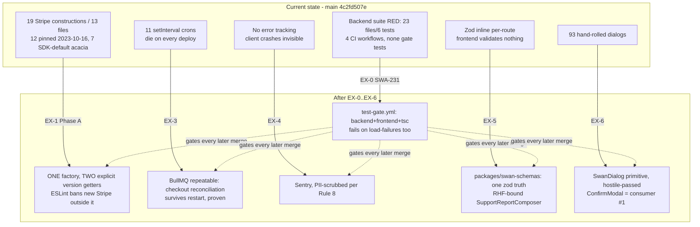
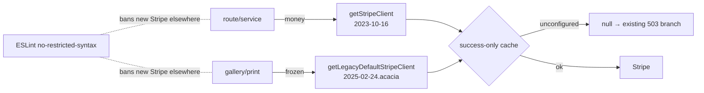

# OSS Execution Blueprint v2 — brick-by-brick, zero building decisions

**Author:** Fable (claude-fable-5) · **Date:** 2026-09-02 · **Refs:** SWA-225 (parent), SWA-231 (EX-0)
**Ground truth this blueprint was written against:** `origin/main` = `4c2fd507e`. Worker MUST re-verify each anchor string before editing; if an anchor is missing, STOP that slice and report — do not improvise.

## §0 Worker contract (read first, applies to every slice)

1. **Build location:** worktree `C:/tmp/ss-forge-variantrun`. Per slice: `git checkout main && git fetch origin && git merge --ff-only origin/main && git checkout -b <branch-named-below>`.
2. **Anchors, not line numbers.** Every edit names an anchor string unique in its file. Verify uniqueness with `grep -c` (expect 1) before editing.
3. **Every test names its control.** A test suite ships only with the listed mutation/negative control executed and observed to FAIL. A green that cannot fail proves nothing.
4. **Per-slice gates (all required):** named tests green → mutation control fires → import-execution smoke on touched backend modules (use the session smoke runner pattern: plain `node <script> <abs paths>`, env set inside the script) → `npm run build` (frontend slices) → Rule 42 audit → commit with the exact message header given → push branch. **Merge to main only where the slice says MERGE; payment slices say HOLD.**
5. **Spend-guard gotchas (verified this session):** no `node -e`, no inline heredoc interpreters, no `VAR=x timeout node …` shapes — write scripts to files, invoke plainly. Commit messages via `git commit -F <file>` (heredoc bodies get parsed as shell).
6. **Receipts:** each slice appends a comment to its Linear issue: commands run, counts, control results, sha.

## §1 System map



Execution order is EX-0 → EX-1 → EX-2 → EX-3 → EX-4 → EX-5 → EX-6. EX-2 (webhook verify-and-document) may run in parallel with any slice; nothing depends on it.

---

## §2 EX-0 — Backend green + CI gate (SWA-231) · branch `claude/ex0-ci-gate`

**Fact correction baked in:** `.github/workflows/` already holds 4 workflows (`ai-eval-gate`, `bodymap-validation`, `docs-check`, `swan-lens-guards`) — none run the test suites. This slice ADDS a gate; it does not create CI.

### 2.1 Enumerate + date the 23 (no decisions: the list is fixed)
The 23 failing files are recorded in SWA-231. For each, run:
```
git log --follow --format="%h %ad %s" --date=short -n 3 -- <file>
```
and record `first-red-estimate = date of most recent commit touching the file or its first import line's module`. If that estimate is not decisive in ≤10 min of reading, record `undatable` — that word, verbatim. No bisecting.

### 2.2 Fix-or-quarantine policy (mechanical)
- A failure caused by a **missing/renamed import** (load failure): fix the import if the target exists under a moved path (`git log --diff-filter=R` to find renames); otherwise quarantine.
- A failure whose assertion references **removed behaviour**: quarantine.
- Quarantine has TWO mechanisms — pick by failure class (hostile-pass fix: `describe.skip` cannot rescue a file that throws at IMPORT, because the file never reaches `describe`):
  - **assertion-failure** → wrap outermost `describe` with `describe.skip` + the marker comment above it;
  - **load-failure** (the dominant class here, 23 files vs 6 tests) → `git mv <name>.test.mjs <name>.test.quarantined.mjs` (vitest's collector no longer matches it) + the marker comment as line 1.
  - Marker, verbatim in both: `// QUARANTINED SWA-231 2026-09-02: <one-line reason>. Un-skip criteria: <one line>.`
  - The count test greps the marker across BOTH `*.test.mjs` and `*.test.quarantined.mjs`.
- Add `backend/tests/quarantine.count.test.mjs`:
  - Counts files containing `QUARANTINED SWA-231` (recursive grep of `backend/tests backend/__tests__`).
  - Asserts count `<= N` where N = the number this slice creates (write the literal after 2.2 completes).
  - **Control:** temporarily add the marker to any extra file → test must fail → remove.

### 2.3 The gate workflow — create `.github/workflows/test-gate.yml` exactly:
```yaml
name: test-gate
on:
  push: { branches: [main] }
  pull_request: { branches: [main] }
jobs:
  backend:
    runs-on: ubuntu-latest
    defaults: { run: { working-directory: backend } }
    steps:
      - uses: actions/checkout@v4
      - uses: actions/setup-node@v4
        with: { node-version: 22, cache: npm, cache-dependency-path: backend/package-lock.json }
      - run: npm ci
      - run: npx vitest run --reporter=dot
  frontend:
    runs-on: ubuntu-latest
    defaults: { run: { working-directory: frontend } }
    steps:
      - uses: actions/checkout@v4
      - uses: actions/setup-node@v4
        with: { node-version: 22, cache: npm, cache-dependency-path: frontend/package-lock.json }
      - run: npm ci
      - run: node scripts/run-vitest-shards.mjs
      - name: type-check (16GB runner memory required)
        run: node --max-old-space-size=14000 ./node_modules/typescript/bin/tsc --noEmit --pretty false
```
- Vitest exits non-zero on load-failed files (verified locally: the 23/6 state exits 1), and the sharded runner now runs every batch — so the gate fails on the load-failure class by construction.
- **Deterministic fallback, pre-decided:** if the type-check step OOMs on the runner (public-repo `ubuntu-latest` = 16GB; if logs show less), delete ONLY that step, keep both test jobs, and note it in SWA-231 — do not weaken the test jobs to save it.

### 2.4 Gate for the slice itself
Backend suite locally: `0 failed` (or `0 failed + N quarantined`, N stated). Push branch, open PR — the PR must show `test-gate` running and green. **MERGE.**
**Rollback:** delete `test-gate.yml`; un-skip markers are grep-findable by `QUARANTINED SWA-231`.

---

## §3 EX-1 — Stripe Phase A (GLM design, behaviour-identical) · branch `claude/ex1-stripe-phase-a` · **HOLD for review, then MERGE on APPROVE**

**Supersedes** held branch `claude/stripe-client-factory-20260901` (commits `24ada896c`, `f2a442af1`). Do NOT merge that branch — it changes gallery behaviour (Phase B's job). Cherry-pick nothing; its test file is reproduced below in v2 form. After EX-1 merges, delete the held branch and note supersession on SWA-225.

### 3.1 The factory — create `backend/utils/stripeClient.mjs`:
Two explicit getters, one per CURRENT effective version. Success-only memoisation per version. Rationale comments as in the held version, updated to Phase A.
```js
import Stripe from 'stripe';
import logger from './logger.mjs';
import { isStripeEnabled } from './apiKeyChecker.mjs';

// The version the money paths run on (cart, packages, subs, ACH, webhook).
export const STRIPE_API_VERSION = '2023-10-16';
// The version the 7 gallery sites ran on by OMISSION (stripe@17 SDK default).
// Phase A makes it explicit; Phase B (separate, reviewed) may unify. Sean's
// dashboard webhook-version reading gates Phase B.
export const STRIPE_LEGACY_DEFAULT_API_VERSION = '2025-02-24.acacia';

const cache = new Map(); // version -> client. SUCCESS-ONLY (GLM #5 / Flash F7).

function get(version) {
  if (cache.has(version)) return cache.get(version);
  if (!isStripeEnabled()) {
    logger.warn(`[stripeClient] Stripe not configured — ${version} client unavailable.`);
    return null;
  }
  try {
    const client = new Stripe(process.env.STRIPE_SECRET_KEY.trim(), { apiVersion: version });
    cache.set(version, client);
    logger.info(`[stripeClient] initialised apiVersion=${version}`);
    return client;
  } catch (error) {
    logger.error(`[stripeClient] construction failed (${version}): ${error.message}`);
    return null;
  }
}

/** Money paths. */
export function getStripeClient() { return get(STRIPE_API_VERSION); }
/** Gallery/print paths ONLY — frozen at their historical effective version.
 *  Adding a NEW caller of this getter is a Phase-B-bypass; ESLint cannot see
 *  that, reviewers must. */
export function getLegacyDefaultStripeClient() { return get(STRIPE_LEGACY_DEFAULT_API_VERSION); }
export function __resetStripeClientForTests() { cache.clear(); }
export default { getStripeClient, getLegacyDefaultStripeClient, STRIPE_API_VERSION, STRIPE_LEGACY_DEFAULT_API_VERSION, __resetStripeClientForTests };
```

### 3.2 Migration table — all 19 sites, per-file anchors (verify `grep -c` = expected count first)

| File | Anchor (must match) | Sites | Replace with |
|---|---|---|---|
| `routes/galleryRoutes.mjs` | `const stripe = new Stripe(stripeKey);` | 6 | `const stripe = getLegacyDefaultStripeClient();` + keep the existing `!stripeKey` 503 guard AND add `if (!stripe) return res.status(503).json({ success: false, error: 'Payment processing not configured' });` — also delete the now-unused `const { default: Stripe } = await import('stripe');` line above each |
| `routes/adminGalleryRoutes.mjs` | same anchor | 1 | same replacement |
| `routes/achPaymentRoutes.mjs` | `stripe = new Stripe(process.env.STRIPE_SECRET_KEY, { apiVersion: '2023-10-16' });` | 1 | `stripe = getStripeClient();` |
| `routes/subscriptionRoutes.mjs` | same single-line pinned anchor | 1 | `stripe = getStripeClient();` |
| `routes/admin/analyticsRevenueRoutes.mjs`, `routes/adminChargeCardRoutes.mjs`, `routes/adminDataVerificationRoutes.mjs`, `routes/adminOrdersRoutes.mjs`, `routes/cartRoutes.mjs`, `routes/sessionPackageRoutes.mjs`, `services/analytics/StripeAnalyticsService.mjs`, `webhooks/stripeWebhook.mjs` | `new Stripe(process.env.STRIPE_SECRET_KEY, {` (multiline pinned form) | 1 each | assignment target `= getStripeClient();` (delete the options block through its closing `});`) |
| `routes/v2PaymentRoutes.mjs` | `stripe = new Stripe(stripeSecretKey, {` | 1 | `stripe = getStripeClient();` |
| `services/payment/PaymentService.mjs` | `this.stripeClient = new Stripe(secretKey.trim(), {` | 1 | `this.stripeClient = getStripeClient();` |

Every touched file adds `import { getStripeClient } from '../utils/stripeClient.mjs';` (or `getLegacyDefaultStripeClient` for the two gallery files; correct relative depth per file — `../../utils/` under `routes/admin/`, `../../../utils/` under `services/payment/` etc.; verify with `node --check`). Remove each file's now-dead `import Stripe from 'stripe'` ONLY if no other use remains (`grep -c "Stripe" <file>` before/after). Also delete the two dead `import Stripe from 'stripe'` lines in `services/payment/strategies/Stripe{Checkout,Elements}Strategy.mjs` (verified dead this session).

### 3.3 The drift guard — backend `.eslintrc.cjs`
Add to the exported config:
```js
rules: {
  'no-restricted-syntax': ['error', {
    selector: "NewExpression[callee.name='Stripe']",
    message: 'Construct Stripe only in utils/stripeClient.mjs (SWA-225 EX-1). Site #20 is how the two-version split happened.',
  }],
},
overrides: [ { files: ['utils/stripeClient.mjs'], rules: { 'no-restricted-syntax': 'off' } } ],
```
**Control:** add `new Stripe('x')` to any route → `npm run lint` errors → remove.

### 3.4 Tests — `backend/tests/unit/stripeClientFactory.test.mjs`
Reproduce the six v1 cases adapted to two getters, plus:
- `getStripeClient` and `getLegacyDefaultStripeClient` construct with EXACTLY `{ apiVersion: <their constant> }` (constructor-spy on the global mock; the global stripe mock means these assert wiring, not negotiation — comment stays).
- The two getters return DIFFERENT instances; each memoises its own.
- Healing test (key-arrives-late) per version.
- **Inventory reconciliation test** (Flash F1, made permanent): reads all backend `.mjs` under routes/services/webhooks/utils, asserts `new Stripe(` appears ONLY in `utils/stripeClient.mjs`. **Control:** insert a construction elsewhere → fails.
- **Mutation controls (both executed):** remove `apiVersion` from `get()` → constructor-spy test fails; swap the two constants → the different-instances/version tests fail.

### 3.5 Behaviour-identity proof (the point of Phase A)
`git diff` of the slice must show, for the 12 pinned sites, no change other than construction source; for the 7 gallery sites, version string `2025-02-24.acacia` now EXPLICIT. Then: import smoke (all 13 files + factory), gallery+stripe test surfaces (expect the same 104 files/904 tests green), full backend suite delta vs base = zero new failures.
**Gate: HOLD → GLM-5.3 one-round re-review of the DIFF (not a packet) → on APPROVE, MERGE.** Rollback: revert the single squash commit.



---

## §4 EX-2 — Webhook integrity: verify-and-document · branch `claude/ex2-webhook-doc` · MERGE

Inspection already disproved the double-grant hypothesis. Remaining work is documentation + one bounded check, both branches pre-decided:
1. Write `docs/ai-workflow/references/STRIPE-WEBHOOK-INTEGRITY.md`: raw-body capture point (cite the mount in `core/middleware/index.mjs`), signature verification (`constructEvent` at `webhooks/stripeWebhook.mjs:155`), fulfilment idempotency keys per event type (quote the `alreadyProcessed` paths), transient-vs-permanent retry classification, and the webhook-vs-verify-session race resolution.
2. **The one check:** does any handled event type lack an idempotent fulfilment path? Enumerate `case '...'` blocks; for each, name its idempotency key. If one lacks it → add a failing test reproducing double-apply, fix by keying on the natural business id (same pattern as `getSessionPackageFulfillmentKey`), in THIS slice. If none lacks it → the doc says so and the slice is doc-only.
3. Queue on SEAN QUEUE: record the dashboard webhook endpoint API version into the doc when Sean reports it (his 2-minute action).

---

## §5 EX-3 — BullMQ first unit: checkout reconciliation · branch `claude/ex3-bullmq-reconciliation` · MERGE (flag-gated OFF)

Target (verified shape): `services/checkoutReconciliationCron.mjs` — `runSweep()`, `SWEEP_INTERVAL_MS = 5*60*1000`, `startCheckoutReconciliationSweeper()`.

1. Create `backend/jobs/queues/reconciliationQueue.mjs`: BullMQ `Queue` + `Worker` named `checkout-reconciliation`, connection from `process.env.REDIS_URL` (reuse the ioredis option shape from `config/session.mjs`; `maxRetriesPerRequest: null` as BullMQ requires), repeatable job `{ every: SWEEP_INTERVAL_MS }`, processor calls the EXISTING `runSweep` (import it; zero logic moves). `attempts: 3`, exponential backoff 30s. Fail-open: if `REDIS_URL` unset → log + return null (the old setInterval path keeps running).
2. Flag: `USE_BULLMQ_RECONCILIATION` (default absent = OFF). Caller resolved (no lookup left): **`backend/core/startup.mjs:641`**, anchor `startCheckoutReconciliationSweeper();` — when flag `=== 'true'`, start the queue INSTEAD of the interval; else the interval, untouched.
3. Tests (`backend/tests/unit/reconciliationQueue.test.mjs`): flag-off → interval started, queue not; flag-on → queue scheduled with `SWEEP_INTERVAL_MS`, interval not; processor invokes `runSweep` exactly once per job. **Control:** point the processor at a misspelled import → test fails.
4. **Survive-restart proof:** run a local script against a local Redis (`docker run -p 6379:6379 redis:7-alpine`): enqueue repeatable, kill the process, restart, assert the repeatable job re-fires without re-registration (BullMQ persists it). Save output to the receipt. **Pre-decided fallback if Docker is unavailable on the build machine:** the proof is marked BLOCKED in the receipt and becomes a hard precondition of Sean's flag-on action — the slice still merges (flag OFF is inert), but the flag NEVER turns on without this proof. Never run the proof against production Redis.
5. Rollback: unset flag. **Turn-on is a Sean action after 48h of the flag-off deploy.**

---

## §6 EX-4 — Error tracking: Sentry · branch `claude/ex4-sentry` · MERGE (DSN-gated: inert until Sean adds env)

1. `cd frontend && npm i @sentry/react@10.73.0` — exact-pinned; verified against the registry 2026-09-02 (the draft said `^8`, two majors stale — caught by this blueprint's own hostile pass; the APIs used below — `init`, `beforeSend`, `tracesSampleRate`, `captureException`, `getClient` — are stable across 8-10).
2. `frontend/src/instrument.ts` (new): `Sentry.init` gated on `import.meta.env.VITE_SENTRY_DSN` (absent → no-op); `tracesSampleRate: 0` (errors only); `sendDefaultPii: false`; `beforeSend` strips `request`, all breadcrumb `data` bodies, and regex-redacts email shapes from messages (Rule 8 — reuse the shapes from Rule 47's redaction list as literal regexes in this file).
3. Anchor in `frontend/src/main.jsx`: first import line — insert `import './instrument';` ABOVE `import React` (Sentry must load first).
4. Wrap the app render error path: `Sentry.ErrorBoundary` is NOT used (house boundaries exist) — instead call `Sentry.captureException` inside the existing top `ErrorBoundary`'s catch (anchor: `componentDidCatch` in `components/ui/ErrorBoundary.tsx`), guarded by DSN presence.
5. Tests: `instrument.noDsn.test.ts` — with no DSN, module import performs zero network and `Sentry.getClient()` returns `undefined` (the `window.__SENTRY__` global is an internal that moved across majors — assert the public accessor instead); beforeSend unit test feeds an event containing an email + a request body, asserts both scrubbed. **Control:** disable the scrub line → test fails.
6. SEAN QUEUE: create the Sentry project, put `VITE_SENTRY_DSN` in Render frontend env, optional `SENTRY_AUTH_TOKEN` later for sourcemaps (separate slice; not now).
7. Rollback: remove the env var (init self-disables).

---

## §7 EX-5 — Shared zod + RHF first unit · branch `claude/ex5-shared-schema` · MERGE

Pair (verified): backend `routes/supportIssueRoutes.mjs` `createSchema` (anchor `const createSchema = z.object({`, line ~33) ↔ frontend `pages/support/SupportReportComposer.tsx`.

1. New package `packages/swan-schemas/`: `package.json` `{ "name": "@swan/schemas", "type": "module", "main": "index.mjs", "peerDependencies": { "zod": "^3.22.4" } }` (zod THREE — matches backend; the 3→4 upgrade is a later, separate slice touching both ends at once); `index.mjs` re-exports `./supportIssue.mjs`; `supportIssue.mjs` contains `supportIssueCreateSchema` = the EXACT object literal moved from the route, byte-identical field rules.
2. Backend: add `"@swan/schemas": "file:../packages/swan-schemas"` to `backend/package.json`; route imports the schema and deletes its local literal. **Existing route tests must pass unchanged — that is the proof the move is byte-faithful.** If any fails, the move was not faithful; fix the schema, never the test.
3. Frontend: add the same `file:` dep (pattern precedent: `@swan/forge`) + `npm i react-hook-form@^7 zod@^3.22.4 @hookform/resolvers@^3`. In `SupportReportComposer.tsx`: `useForm({ resolver: zodResolver(supportIssueCreateSchema.pick(<the fields the form actually posts — enumerate from its current submit payload before editing>)) })`; wire existing inputs via `register`; existing styled-components untouched (RHF is headless); inline field errors use the existing error-text component in that file (locate by its current error rendering; if none exists, add `<ErrorNote>` from `components/ui/ErrorNote.tsx` — verified to exist).
4. Tests: backend route tests green unchanged (the contract); frontend `SupportReportComposer.validation.test.tsx` — submit empty → zod messages render, no POST fired (spy on the api module the file already imports); valid submit → POST body matches the schema's parse output. **Control:** loosen one schema rule in the shared package → BOTH a backend test and the frontend test fail — this is the entire point of the slice; capture both failures in the receipt, then restore.

---

## §8 EX-6 — SwanDialog primitive + consumer #1 · branch `claude/ex6-swandialog` · MERGE after its own hostile pass

Deps (frontend): `@radix-ui/react-dialog@1.1.23` (exact-pin; verified latest 2026-08-31). First consumer (verified, 115 lines, hand-rolled Escape/aria): `components/DashBoard/Pages/admin-gallery/components/ConfirmModal.tsx`.

### Wireframe (the one UI surface in EX-0..6; other slices are non-UI and carry mermaid instead)
```
        ┌─ overlay: Obsidian #0A0A0F @ 80%, blur(4px), click = onOpenChange(false) unless destructive ─┐
        │                                                                                              │
        │     ┌──────────────── SwanDialog.Content (Graphite #1A1A24, chrome edge, r16) ─────────────┐ │
        │     │  <Title id -> aria-labelledby>  Plus Jakarta Sans 18/600 Frost White        [X 44px] │ │
        │     │  <Description -> aria-describedby> 14/400 Frost White @72%                           │ │
        │     │  ─────────────────────────────────────────────────────────────────────────────────  │ │
        │     │  {children}                                                                         │ │
        │     │                                                                                     │ │
        │     │                       [ Cancel (GlowButton ghost, 44px) ] [ Confirm (primary,44px) ]│ │
        │     │   destructive: Confirm = danger tint; overlay+Escape close DISABLED; Cancel focused │ │
        │     └─────────────────────────────────────────────────────────────────────────────────────┘ │
        │        ≤640px: Content = bottom sheet, full-width, r16 top only, buttons stack full-width    │
        └──────────────────────────────────────────────────────────────────────────────────────────────┘
  Focus: trap = Radix; initialFocus -> Cancel (SwanGuard lesson: destructive confirm must be KEYBOARD-reachable,
  never mouse-only). Return focus to trigger on close = Radix default. prefers-reduced-motion: fade only.
```

### API (final — consumers get no choices beyond these props)
`frontend/src/components/ui/SwanDialog/SwanDialog.tsx` (+ `.styles.ts`, `index.ts`; each ≤300 lines):
```ts
interface SwanDialogProps {
  open: boolean; onOpenChange: (open: boolean) => void;
  title: string; description?: string;
  destructive?: boolean;           // disables overlay/Escape dismiss, danger confirm, focuses Cancel
  confirmLabel?: string; cancelLabel?: string;
  onConfirm?: () => void | Promise<void>;   // omitted => info dialog, single Close button
  children?: React.ReactNode;
}
```
Radix `Root/Portal/Overlay/Content/Title/Description/Close` under styled-components (`styled(Dialog.Content)`), tokens `var(--…, fallback)` per Active Palette, dual-button glow rule, zIndex above drawer layer (match the value used by `VaultDrawer` — read it, reuse it).

### Tests `SwanDialog.test.tsx` (all executed, jsdom + testing-library)
1. open renders title wired to `aria-labelledby`; `role="dialog"` + `aria-modal` present (Radix provides — assert anyway: the assertion is the contract if Radix is ever swapped).
2. Escape closes (non-destructive) — and does NOT close when `destructive`.
3. Overlay click same pair.
4. **Keyboard-only confirm:** `tab` to Confirm, `enter` fires `onConfirm` (the SwanGuard regression class).
5. Focus goes to Cancel on destructive open; returns to trigger on close.
6. Body scroll locked while open, restored after.
7. `onConfirm` rejection does not close the dialog (async safety).
**Controls:** remove `destructive` handling → tests 2/3 fail; remove initialFocus → 5 fails.
### Consumer #1: rewrite `ConfirmModal.tsx` as a thin wrapper over SwanDialog (public props preserved so its call sites don't change); its existing tests must pass unchanged. **Hostile pass on the primitive (dry-loop to clean) BEFORE the consumer commit — 93 future consumers inherit every miss.**

---

## §9 Cross-cutting: instrument-validation matrix (worker fills ✔/✘ per slice receipt)

| Slice | Green evidence | The control that must FAIL | Ran? |
|---|---|---|---|
| EX-0 | suite 0 failed (+N quarantined) | extra quarantine marker → count test fails | |
| EX-1 | factory tests + inventory test + zero suite delta | apiVersion removed → spy fails; rogue `new Stripe(` → inventory+lint fail | |
| EX-3 | flag on/off tests + restart proof | misspelled processor import → fails | |
| EX-4 | no-DSN inert + scrub tests | scrub disabled → fails | |
| EX-5 | backend tests unchanged + form validation tests | loosened shared rule → both ends fail | |
| EX-6 | 7 dialog tests + consumer tests unchanged | destructive/initialFocus mutants → fail | |

## §10 Standing prohibitions for the worker
No merge of the superseded held branch. No `apiVersion` unification anywhere (Phase B is Sean-gated). No new `console.log` in touched backend files (use `logger`). No edits outside each slice's file list without STOP-and-report. No test assertion weakened to reach green — if reality and a test disagree, the slice STOPS and reports which.
