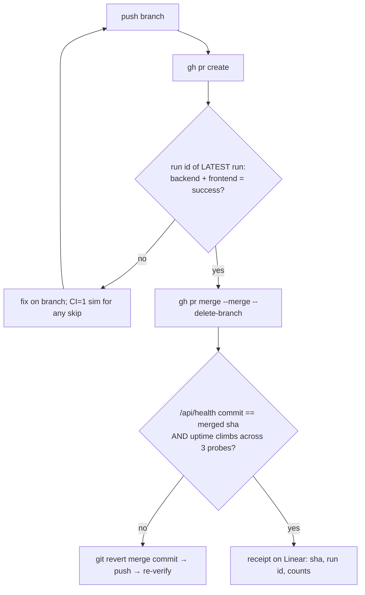

# OSS Execution Blueprint v3 — Fable 5.1 review + the plan Opus builds from

**Author:** Claude Fable 5.1 · **Date:** 2026-09-02 · **Ground truth:** `origin/main` after PR #108 (EX-0 merged, deployed, verified; `/api/health` reports the merged build healthy with uptime climbing). EX-1 sits rebased on that main at `claude/ex1-stripe-phase-a`, 7/7, unpushed, HELD.
**Refs:** SWA-225 (parent), SWA-231 (gate), GLM-5.3 + GLM-5.3-Flash reviews, Fable 5.0 verdict.
**Reader:** Opus 5. Everything here is a decision already made. Where a fact is stated it was measured this session; where a probe is prescribed, run it and STOP on mismatch — never improvise.

---

## §0 What Fable 5.1 found that 5.0 did not (hostile review of ALL shipped work)

Ranked by consequence. Each carries its fix below; nothing here is left as commentary.

| # | Finding | Severity | Where fixed |
|---|---|---|---|
| F1 | **The new test gate is ADVISORY.** The repo is private on GitHub Free: `GET /branches/main/protection` → 403 *"Upgrade to GitHub Pro or make this repository public."* No required check exists; parallel agents push straight to main (they did so 3× during this workstream). A gate nobody is required to pass is a dashboard. | CRITICAL | EX-0b (Sean: GitHub Pro, ~$4/mo) |
| F2 | **CI type-check is gone, not moved.** 5.0 removed the step because its heap alloc killed the runner. The runner died because the step lived INSIDE the frontend test job; as its own job with `continue-on-error`, an OOM can only kill itself and still reports. Signal was surrendered when isolation would have kept it. | HIGH | EX-0c |
| F3 | **EX-1 introduced 12 lint warnings.** Every migrated pinned file kept `import Stripe from 'stripe'` because 5.0's "still used?" detector counted the word in comments. `eslint` now reports `'Stripe' is defined but never used` in all 12 (list measured, §2). A slice that adds a lint rule should not add lint debt. | MEDIUM | EX-1 amendment A |
| F4 | **EX-1's eslint override duplicates the credential selectors** verbatim so the factory file keeps them while dropping the Stripe ban. Two copies drift. | LOW | EX-1 amendment B |
| F5 | **EX-1's merge gate depends on a Sean-gate (GLM 15-round approval)** for a change whose behaviour-identity is already proven by executed controls. Blocking a refactor on a paid-seat checkpoint is the wrong coupling. | MEDIUM | EX-1 amendment C (free-seat review path) |
| F6 | **Phase B was gated on "a field-consumption table" with no procedure to produce it.** Opus would have had to invent one. | HIGH (for Phase B) | §8 Phase B spec |
| F7 | **v2's EX-3 named `runSweep()` as if exported.** It exists but is module-private (`async function runSweep()` at line 26; exports are only start/stop/interval). A worker following v2 would have hit an import error and had to decide. Also unspecified: BullMQ `lockDuration` vs sweep length — default 30s lock on a 5-min job class invites stalled-job double-runs. | HIGH (for EX-3) | EX-3 spec |
| F8 | **EX-2's webhook "no double-grant" verdict rests on code comments** (lines 679-680 say "FinancialTransaction-keyed idempotent"). Comment-evidence. The session's own law: name the instrument, prove it can fail. | MEDIUM | EX-2 executed replay test |
| F9 | **Sentry spec (EX-4) had no scrub for URL query strings** in breadcrumbs — password-reset and magic links carry tokens in `?query`; `sendDefaultPii:false` does not strip breadcrumb URLs. And `release:` was unset, so errors would not map to the build the health endpoint names. | MEDIUM | EX-4 spec |
| F10 | **EX-6 assumed Radix focus-return works.** `ConfirmModal` is controlled via `useState<ConfirmRequest|null>` from `AdminGalleryStudio` (measured) — no `Dialog.Trigger`, so Radix has no trigger to return focus to. Without manual capture, closing the dialog drops keyboard focus to `<body>` — the exact SwanGuard-class regression 5.0 cited. | HIGH (a11y) | EX-6 spec |
| F11 | **CI-scoped skips have no ceiling.** Quarantines are ceiling-guarded (5); the `CI-SKIPPED` class (5 today) can grow silently by the same mechanism the ceiling exists to stop. | LOW | EX-0c |
| F12 | **The original ask is still 0% delivered.** Two infra slices, one payment refactor, and hygiene. Sean asked for OSS replacing hand-rolled logic. With the gate live, the order flips: the next thing built is the first OSS adoption. | STRATEGIC | §1 order |
| F13 | **Worker-contract gaps learned by execution, never written down:** simulate `CI=1` locally before pushing a skip; watch runs by run-id (PR-level polls serve stale rows for seconds); verify a backend deploy by health-commit + uptime climb; never `git checkout --` a file with uncommitted work. | PROCESS | §0.1 contract |
| F14 | **Two remote branches to delete** once EX-1 merges: `claude/stripe-client-factory-20260901` (superseded, PUSHED) and EX-1's own branch. v2 said "delete" without the remote command. | LOW | EX-1 amendment D |

Disproofs re-checked and standing: webhook idempotency exists (F8 only upgrades its evidence); stripe@17.7.0 default really is `2025-02-24.acacia`; all 19 sites resolve to one key; no hidden 20th construction (inventory test now guards it permanently).

### §0.1 Worker contract (v2 §0 plus what execution taught)
1. Build in worktree `C:/tmp/ss-forge-variantrun`; branch per slice from fresh `origin/main`.
2. Anchors, not line numbers; `grep -c` = expected before editing; mismatch → STOP and report.
3. Every test names the control that must FAIL; run it and watch it fail before counting green.
4. **New:** before pushing any `skipIf(CI)` or env-conditional, run the file locally with `CI=1` and record `passed/skipped` — that count is the proof the skip is scoped.
5. **New:** watch CI by **run id** (`gh run view <id> --json status,conclusion`), never by polling `gh pr checks` — the latter serves the previous run's rows for seconds after a push.
6. **New:** after any backend merge, poll `/api/health` until `build.commit` equals the merged short-sha, then take three spaced probes and require `uptimeSeconds` to climb — one 200 cannot distinguish a stable process from a crash-loop mid-restart.
7. **New:** never `git checkout -- <file>` on a tree with uncommitted work; controls use scratch copies (`cp`, edit, test, `cp` back).
8. Spend-guard shapes: no `node -e`, no inline interpreters, no `VAR=x cmd`; scripts to files; commit messages via `git commit -F <file>`; `set -o pipefail` at the head of any command whose exit you read.
9. Receipts on SWA-225 (or the slice's issue) per slice: commands, counts, control results, sha, run id.
10. **Merge policy until EX-0b lands:** merge ONLY via `gh pr merge` after the `backend` and `frontend` jobs of the PR's LATEST run report `success` (by run id). Never `git push origin <branch>:main`.

---

## §1 Order of execution (Fable 5.1 — supersedes v2 §1)

```mermaid
flowchart LR
  A[EX-0b  enforce the gate\nSean: GitHub Pro → required checks] --> B[EX-0c  tsc as isolated job\n+ CI-skip ceiling]
  B --> C[EX-1  merge Phase A\nafter amendments A-D]
  C --> D[EX-5  shared zod + RHF\nFIRST OSS ADOPTION - the ask]
  D --> E[EX-6  SwanDialog primitive\n+ ConfirmModal consumer #1]
  E --> F[EX-3  BullMQ first unit]
  F --> G[EX-4  Sentry]
  G --> H[EX-2  webhook: executed replay test + doc]
  H --> I[Phase B  Stripe version unification\ngated on §8 table + Sean's dashboard reading]
  style A fill:#8B5CF6,color:#E0ECF4
  style D fill:#C6A84B,color:#0A0A0F
```


EX-0b is a Sean action and does not block EX-0c/EX-1 building; it blocks nothing except the *meaning* of "green". EX-2 and EX-4 are independent of everything and may be pulled forward if a slice stalls. Phase B is LAST and Sean-gated.

### The merge pipeline every slice now uses


---

## §2 EX-1 — Stripe Phase A: amendments before merge (branch `claude/ex1-stripe-phase-a`, already rebased on main)

**A. Remove the 12 unused imports** (measured by eslint `no-unused-vars` on 2026-09-02): `routes/achPaymentRoutes.mjs`, `routes/subscriptionRoutes.mjs`, `routes/admin/analyticsRevenueRoutes.mjs`, `routes/adminChargeCardRoutes.mjs`, `routes/adminDataVerificationRoutes.mjs`, `routes/adminOrdersRoutes.mjs`, `routes/cartRoutes.mjs`, `routes/sessionPackageRoutes.mjs`, `routes/v2PaymentRoutes.mjs`, `services/analytics/StripeAnalyticsService.mjs`, `services/payment/PaymentService.mjs`, `webhooks/stripeWebhook.mjs`. In each, delete exactly the line `import Stripe from 'stripe';`. Proof: `npx eslint <the 12>` reports zero `'Stripe' is defined but never used`; import smoke 17/17 again.

**B. DRY the eslint credential selectors.** In `backend/.eslintrc.cjs` hoist the two credential selector objects into `const CREDENTIAL_SYNTAX = [ {…postgres…}, {…api-key…} ];` above `module.exports`; the main rule becomes `['error', ...CREDENTIAL_SYNTAX, { Stripe selector }]` and the factory override becomes `['error', ...CREDENTIAL_SYNTAX]`. Control: rogue `new Stripe('x')` in a route still errors; a database-URL string literal with embedded credentials placed in the factory still errors (write the probe literal only in the scratch copy — the pre-commit scanner blocks that shape in committed files, by design, and did so to this very paragraph's first draft).

**C. Review path (decouples from the paid-seat checkpoint).** Pre-merge review of the RAW DIFF (`git diff origin/main...HEAD > .ai-workflow/ex1.diff`, egress-redacted by the seat) by **whichever is available first**: GLM-5.3 (`consult-glm.mjs`, only if Sean has run the batch approval) **or** Codex (`consult-codex.mjs` — free seat). Remit for either: "behaviour-identical? two-getter API misuse risk? anything you'd block a payment-path merge on? APPROVE or REVISE." An APPROVE from either seat satisfies the gate; a REVISE returns to this section with findings applied. Do not wait on the seat that is blocked.

**D. After merge:** `git push origin --delete claude/stripe-client-factory-20260901` and `--delete claude/ex1-stripe-phase-a`; comment supersession on SWA-225; run §0.1 step 6 deploy verification (backend changed).

Everything else in v2 §3 stands (factory file as committed; migration table already executed; tests 7/7 with M1/M2/L1 controls).

---

## §3 EX-0b — Enforce the gate (Sean action, ~10 min, ~$4/month)

**Fact:** branch protection needs GitHub Pro or a public repo. The repo went private after the 2026-04-19 credential incident; it stays private (history was rewritten but the decision holds). **Decision: GitHub Pro.**
Sean's steps, in the GitHub UI (`Settings → Branches → Add rule` for `main`): require status checks to pass before merging → select `backend` and `frontend` (the two `test-gate` jobs; they appear only after one run on a PR, which #108 provided); require branches to be up to date; **restrict pushes** (no direct pushes; everything via PR); do not allow bypass for admins.
**Consequence for every agent in this tree (state it in CLAUDE.md's Rule 67 block when done):** `git push origin <branch>:main` is dead; PRs only. Until Sean does this, §0.1 step 10 is the procedural stand-in.

## §4 EX-0c — Restore type-check signal + ceiling the CI-skips (branch `claude/ex0c-tsc-job`)

1. `.github/workflows/test-gate.yml`: add a THIRD job:
```yaml
  typecheck:
    runs-on: ubuntu-latest
    continue-on-error: true   # reports; can never take a test job down with it
    defaults: { run: { working-directory: frontend } }
    steps:
      - uses: actions/checkout@v4
      - uses: actions/setup-node@v4
        with: { node-version: 22, cache: npm, cache-dependency-path: frontend/package-lock.json }
      - run: npm ci
      - name: tsc (isolated; OOM here hurts only this job)
        run: node --max-old-space-size=6500 ./node_modules/typescript/bin/tsc --noEmit --pretty false --skipLibCheck
```
   Pre-decided outcomes: if it passes, leave it; if it OOMs, it stays as a visible amber (still not blocking) and SWA-231 gets a note "needs a project split"; either way the test jobs are untouched. Do NOT raise the heap past 6500 on this runner tier.
2. `backend/tests/quarantine.count.test.mjs`: add a second `it` counting files containing the literal `CI-SKIPPED SWA-231` with `CEILING_CI_SKIPS = 5` (the five spawn tests in `missionQaAutomation`). Control: add the marker to any extra file → fails naming it.
3. Gate: PR, run-id green on `backend`+`frontend`, merge. No deploy verification needed (workflow + test only) — but run it anyway; it is cheap and the habit matters.

---

## §5 EX-5 — Shared zod schema + RHF first unit (branch `claude/ex5-shared-schema`) — **THE ASK BEGINS HERE**

Pair (measured): backend `routes/supportIssueRoutes.mjs` `const createSchema = z.object({` (line 33) ↔ frontend `pages/support/SupportReportComposer.tsx`. Non-money, user-facing.

1. **Package** `packages/swan-schemas/`: `package.json` `{ "name": "@swan/schemas", "version": "0.1.0", "type": "module", "main": "index.mjs", "exports": { ".": "./index.mjs" }, "peerDependencies": { "zod": "^3.22.4" } }`; `index.mjs` → `export * from './supportIssue.mjs';`; `supportIssue.mjs` → `import { z } from 'zod'; export const supportIssueCreateSchema = <the EXACT object literal moved from the route, byte-identical field rules>;`. Precedent for `file:` deps: `@swan/forge` in `frontend/package.json` — copy its form.
2. **Backend:** `backend/package.json` → `"@swan/schemas": "file:../packages/swan-schemas"`; `npm install`; in the route replace the local literal with `import { supportIssueCreateSchema } from '@swan/schemas';` and `const createSchema = supportIssueCreateSchema;` (keeping the local name so nothing downstream changes). **Existing route tests must pass UNCHANGED — that is the byte-faithfulness proof.** If any fails, the move was not faithful: fix the schema, never the test.
3. **Frontend:** same `file:` dep + `npm i react-hook-form@^7.5 @hookform/resolvers@^3.9 zod@^3.22.4` (zod THREE on both ends; the 3→4 move is a later slice touching both at once). In `SupportReportComposer.tsx`: before editing, run `grep -nE "api\.|post\(|fetch\(" pages/support/SupportReportComposer.tsx` and list the fields the submit payload currently sends; `useForm({ resolver: zodResolver(supportIssueCreateSchema.pick({ <those fields>: true })) })`; wire existing inputs via `register`; keep every styled-component; inline errors via the file's existing error element or `components/ui/ErrorNote.tsx` (verified present). Submit handler unchanged except it now receives `handleSubmit(values)` — post `values`, not raw state.
4. **Tests:** backend route tests unchanged (the contract); new `pages/support/SupportReportComposer.validation.test.tsx`: (a) submit empty → schema messages render, the api module's post is NOT called (spy on the module the file already imports); (b) valid submit → post body deep-equals the schema's `parse` output. **Control — the entire point of the slice:** loosen one rule in `packages/swan-schemas/supportIssue.mjs` (e.g. drop a `.min(1)`) → BOTH a backend route test AND the frontend validation test fail; capture both failures in the receipt; restore.
5. Gate: PR → run-id green → merge → health verify (backend changed) → receipt. Then **this is the template**: every further form migrates by the same four steps; each is one PR.

---

## §6 EX-6 — SwanDialog primitive + consumer #1 (branch `claude/ex6-swandialog`)

Dep: `@radix-ui/react-dialog@1.1.23` exact (registry-verified). First consumer (measured): `components/DashBoard/Pages/admin-gallery/components/ConfirmModal.tsx`, single call site `AdminGalleryStudio.tsx`, controlled by `useState<ConfirmRequest | null>` — **no Radix Trigger exists, so focus-return is MANUAL (F10).**

### Wireframe (annotated with the ConfirmModal mapping)
```
 ┌ overlay: Obsidian #0A0A0F @80%, blur(4px). click → onOpenChange(false) unless destructive ────────┐
 │  ┌ Content: Graphite #1A1A24, chrome edge (SheenCard geometry), r16, max-w 480, z = VaultDrawer+1 ┐ │
 │  │  Title  (Plus Jakarta Sans 18/600 Frost White)  ← request.title                    [ X 44px ] │ │
 │  │  Description (14/400 Frost @72%)                  ← request.message                          │ │
 │  │  ───────────────────────────────────────────────────────────────────────────────────────     │ │
 │  │  {children}   (ConfirmModal passes none)                                                      │ │
 │  │                        [ Cancel · GlowButton ghost · 44px ]  [ Confirm · primary/danger · 44px ]│ │
 │  │   cancelLabel ← request.cancelLabel ?? 'Cancel'   confirmLabel ← request.confirmLabel        │ │
 │  │   destructive ← request.tone === 'danger'  →  danger tint, overlay+Escape dismiss DISABLED,   │ │
 │  │                                               initial focus on Cancel (keyboard-reachable)    │ │
 │  └────────────────────────────────────────────────────────────────────────────────────────────┘ │
 │   ≤640px: bottom sheet, full width, r16 top only, buttons stack full-width, safe-area padding    │
 └──────────────────────────────────────────────────────────────────────────────────────────────────┘
 Focus: trap = Radix.  Return = MANUAL: capture document.activeElement on open, restore in
 onCloseAutoFocus (preventDefault, then focus the captured element if still in the DOM, else body).
 open ← request !== null ;  onOpenChange(false) → onClose()
 prefers-reduced-motion: opacity only, 120ms.  Escape/overlay: disabled when destructive.
```

### API (final)
```ts
export interface SwanDialogProps {
  open: boolean; onOpenChange: (open: boolean) => void;
  title: string; description?: string;
  destructive?: boolean;
  confirmLabel?: string; cancelLabel?: string;
  onConfirm?: () => void | Promise<void>;   // omitted ⇒ info dialog with a single Close
  children?: React.ReactNode;
}
```
Files: `components/ui/SwanDialog/SwanDialog.tsx`, `SwanDialog.styles.ts`, `index.ts` — each ≤300 lines; Radix `Root/Portal/Overlay/Content/Title/Description/Close` under `styled(Dialog.Content)` etc.; tokens `var(--…, fallback)` from the Active Palette; dual-button glow rule; read `VaultDrawer`'s z-index and use `+1`.

### Focus-return implementation (the F10 fix, exact)
```ts
const returnTo = useRef<HTMLElement | null>(null);
useEffect(() => { if (open) returnTo.current = document.activeElement as HTMLElement | null; }, [open]);
<Dialog.Content onCloseAutoFocus={(e) => { e.preventDefault(); const el = returnTo.current; if (el && document.contains(el)) el.focus(); }}>
```

### Tests `SwanDialog.test.tsx` (jsdom + testing-library; ALL executed)
1. open → `role="dialog"`, `aria-modal`, `aria-labelledby` → title id, `aria-describedby` → description id.
2. Escape closes; does NOT close when `destructive`.
3. Overlay click: same pair.
4. **Keyboard-only confirm:** `tab` to Confirm, `Enter` → `onConfirm` called once.
5. `destructive` open → Cancel has focus.
6. **Focus return (F10):** render a button, `.focus()` it, open, close → that button has focus again. Then: remove the button from the DOM while open, close → focus is on `body`, no throw.
7. Body scroll locked while open, restored after.
8. `onConfirm` rejects → dialog stays open, error surfaced via the existing `ErrorNote`.
**Controls:** remove `destructive` handling → 2/3 fail; remove `onCloseAutoFocus` → 6 fails; remove initial-focus → 5 fails.

### Consumer #1 — `ConfirmModal.tsx` becomes a thin adapter
Keep its exports (`ConfirmRequest`, default `ConfirmModal({ request, onClose })`) so `AdminGalleryStudio.tsx` does not change. Body: `<SwanDialog open={request !== null} onOpenChange={(o) => { if (!o) onClose(); }} title={request?.title ?? ''} description={request?.message} destructive={request?.tone === 'danger'} confirmLabel={request?.confirmLabel} cancelLabel={request?.cancelLabel} onConfirm={request?.onConfirm} />`. Its existing tests pass unchanged. **Hostile pass on the primitive runs BEFORE the consumer commit** — 92 more consumers inherit every miss.

---

## §7 EX-3 — BullMQ first unit (branch `claude/ex3-bullmq-reconciliation`) — corrected

Facts (measured): `services/checkoutReconciliationCron.mjs` exports only `SWEEP_INTERVAL_MS`, `startCheckoutReconciliationSweeper`, `stopCheckoutReconciliationSweeper`; the sweep body is a **module-private** `async function runSweep()` (line 26) that awaits `reconcileStalePendingCarts({ ShoppingCart })`, documented never-throws and reporting `{ released, failed }` — i.e. idempotent by construction. Caller: `core/startup.mjs:641`.

1. In the cron file add exactly one line after `runSweep`'s definition: `export { runSweep };` (nothing else moves).
2. `backend/jobs/queues/reconciliationQueue.mjs`: BullMQ `Queue` + `Worker` named `checkout-reconciliation`; connection from `REDIS_URL` using the option shape in `config/session.mjs` **plus** `maxRetriesPerRequest: null` (BullMQ requires it); `Worker` with `concurrency: 1`, `lockDuration: 10 * 60 * 1000` (2× the interval — a sweep must never be declared stalled mid-run and re-run concurrently, F7), `settings: { stalledInterval: 60_000 }`; repeatable `{ every: SWEEP_INTERVAL_MS, jobId: 'checkout-reconciliation' }` (fixed jobId ⇒ re-registration on boot is a no-op, not a duplicate); `attempts: 3`, backoff `{ type: 'exponential', delay: 30_000 }`; `removeOnComplete: 50`, `removeOnFail: 200`. Processor: `await runSweep()`. Fail-open: no `REDIS_URL` → log + `return null` (interval path keeps running).
3. Flag `USE_BULLMQ_RECONCILIATION`; at `core/startup.mjs:641` anchor `startCheckoutReconciliationSweeper();` → `if (process.env.USE_BULLMQ_RECONCILIATION === 'true') { await startReconciliationQueue(); } else { startCheckoutReconciliationSweeper(); }`.
4. Tests `tests/unit/reconciliationQueue.test.mjs`: flag-off → interval started, queue module not touched; flag-on with no `REDIS_URL` → fail-open null, interval NOT started (document: flag-on without Redis means NO sweeper — assert it and log at error level; this is the one trade-off the flag carries); processor calls `runSweep` exactly once per job (mock it). Control: misspell the `runSweep` import → fails.
5. Survive-restart proof: local Redis via Docker; enqueue, kill, restart, observe the repeatable re-fire without re-registration. No Docker → mark BLOCKED, merge flag-OFF anyway, the proof is a hard precondition of Sean's flag-on. Never against production Redis.
6. Gate: PR → run-id green → merge → health verify → receipt. Flag-on: Sean, after 48h + proof.

---

## §8 EX-4 — Sentry (branch `claude/ex4-sentry`) — corrected

1. `cd frontend && npm i @sentry/react@10.73.0` (exact; registry-verified 2026-09-02).
2. `frontend/src/instrument.ts`: `Sentry.init` only if `import.meta.env.VITE_SENTRY_DSN`; `release: import.meta.env.VITE_BUILD_SHA ?? undefined` (probe: `grep -rn "VITE_BUILD_SHA\|cache-marker" frontend/src/cache-marker.ts vite.config.ts` — if the repo already stamps a build id, reuse THAT name; if not, leave `release` unset and note it — do not invent a stamping step here); `tracesSampleRate: 0`; `sendDefaultPii: false`; `beforeSend(event)`: delete `event.request`; for every breadcrumb strip `data.url` query strings (`url.split('?')[0]`) and delete `data.body`/`data.response`; regex-redact email shapes and the key shapes from Rule 47's list in `event.message` and every `exception.values[].value`. Return the event.
3. `main.jsx` line 1: `import './instrument';` above `import React`.
4. `components/ui/ErrorBoundary.tsx` at the `componentDidCatch` anchor: `if (import.meta.env.VITE_SENTRY_DSN) Sentry.captureException(error, { extra: { componentStack: info?.componentStack } });`.
5. Tests: `instrument.noDsn.test.ts` — no DSN ⇒ `Sentry.getClient()` is `undefined` and no fetch was made (spy on `globalThis.fetch`); `instrument.scrub.test.ts` — feed `beforeSend` an event with an email in message, a `request`, a breadcrumb whose `data.url` is `/reset?token=abc`, assert all three are gone and the URL path survives. Control: comment out the query-string strip → the breadcrumb assertion fails.
6. SEAN QUEUE: Sentry project + `VITE_SENTRY_DSN` on Render. Sourcemap upload is a later slice.

---

## §9 EX-2 — Webhook integrity: executed evidence + doc (branch `claude/ex2-webhook-proof`)

The 5.0 disproof stands on code reading. Upgrade it to executed evidence (F8):
1. `tests/api/stripeWebhookRedelivery.test.mjs`: using the existing global stripe mock's `constructEvent`, deliver the SAME `checkout.session.completed` event (same `id`, same session id, cart metadata) **twice** through the router with the DB layer mocked to record grant calls; assert exactly ONE grant/fulfilment write and that the second delivery returns 2xx with `alreadyProcessed` (or the equivalent field the handler emits — read it at line ~249 before asserting). Repeat for the ACH `payment_intent.succeeded` path (line ~582). **Control:** stub the idempotency key lookup to always miss → the test must observe TWO writes and fail.
2. `docs/ai-workflow/references/STRIPE-WEBHOOK-INTEGRITY.md`: raw-body mount, `constructEvent` site, per-event idempotency key, transient/permanent classification, the verify-session race resolution, and the executed test above as the proof line.
3. Record Sean's dashboard webhook API version in the doc when it arrives; that value gates Phase B.

---

## §10 Phase B — Stripe version unification (LAST; Sean-gated) — the procedure v2 lacked (F6)

Do not start until Sean has reported the dashboard webhook endpoint version AND EX-1 has been on main for 48h.
1. **Field-consumption table (mechanical):** `git grep -n "\.checkout\.sessions\.\(create\|retrieve\|expire\)\|refunds\.create" backend/routes/galleryRoutes.mjs backend/routes/adminGalleryRoutes.mjs` → for each call, list every property read off the returned object in the following 40 lines (`session.url`, `session.payment_status`, `session.id`, `session.metadata.*`, `refund.id`, `refund.status`, …). That list is the table's rows.
2. **Version diff:** for each row, check Stripe's API changelog between `2023-10-16` and `2025-02-24.acacia` for the object (`Checkout.Session`, `Refund`) — record `unchanged | renamed | shape-changed`. Any `renamed/shape-changed` row that gallery code reads = a required code change BEFORE flipping the version.
3. **Direction decision, pre-made:** unify DOWN to `2023-10-16` only if the table shows zero changed rows; otherwise unify UP to the SDK default for ALL sites, which is the larger change and requires the same table for the 12 money-path files. Either way the constant changes in ONE place and the getter split collapses to one getter — that collapse is the whole point.
4. Proof: the EX-1 suite plus a new contract test per table row (gallery mocks return the documented shape for the chosen version); full-suite delta empty; merge through the gate; deploy verify; watch Stripe dashboard events for 24h.

---

## §11 Test matrix v3 (every instrument names its control)

| Slice | Green evidence | Control that must FAIL |
|---|---|---|
| EX-1 amend | eslint 0 unused-Stripe across 12; factory 7/7; smoke 17/17 | rogue construction → inventory + lint; credential literal in factory → lint |
| EX-0c | typecheck job reports (pass or amber); ceiling test 2/2 | 6th CI-SKIPPED marker → fails naming file |
| EX-5 | backend route tests unchanged; composer 2 tests | loosen one shared rule → BOTH ends fail |
| EX-6 | 8 dialog tests; ConfirmModal tests unchanged | destructive off → 2,3 fail; onCloseAutoFocus removed → 6 fails; initial focus removed → 5 fails |
| EX-3 | 3 queue tests; restart proof (or BLOCKED) | misspelled runSweep import → fails |
| EX-4 | noDsn + scrub tests | query-strip commented → fails |
| EX-2 | redelivery ×2 = one write | idempotency lookup stubbed to miss → two writes |
| Phase B | per-row contract tests; suite delta empty | any changed-shape row without a code change → its contract test fails |

## §12 Standing prohibitions (carry forward)
No merge of `claude/stripe-client-factory-20260901`. No apiVersion unification outside §10. No test weakened to reach green — reality vs test disagreement STOPS the slice. No `git push …:main`. No self-approval of the GLM batch. No absolute paths with usernames in committed docs (the secret scanner blocks them; it did once this session).
