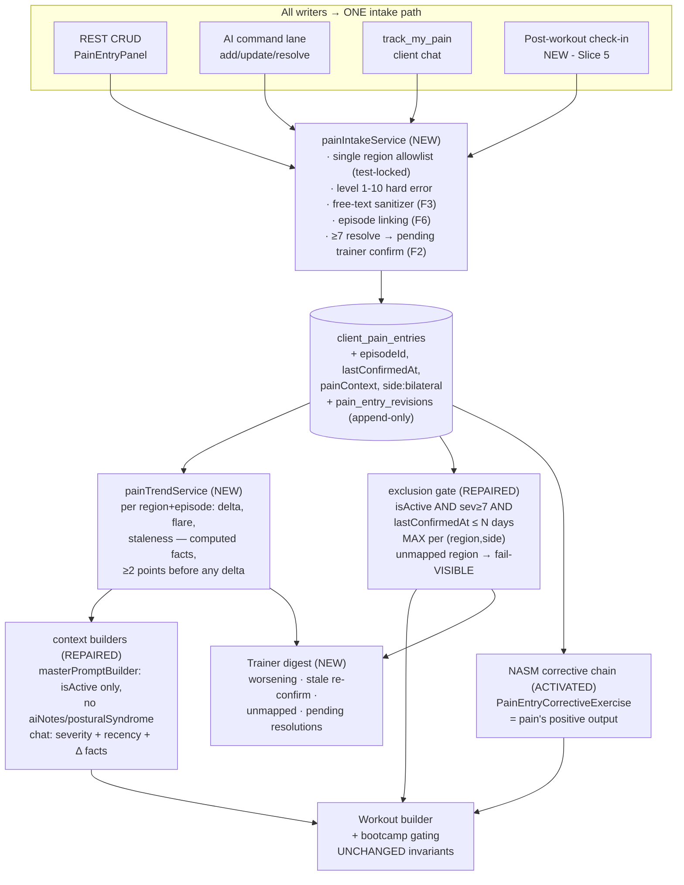
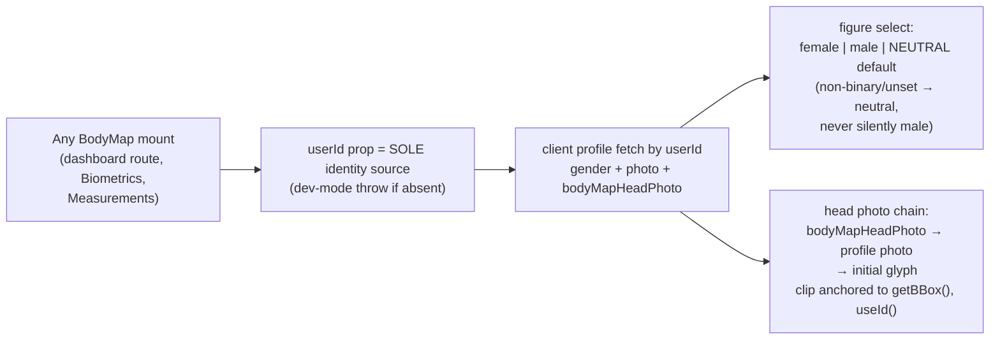

# Pain Chart (BodyMap) Upgrade Blueprint — 2026-08-04

**Provenance:** Fable 5 (Final Decider) + two deep-read audits of origin/main @ `b17e13d90` (read-only worktree) + one authorized Kimi K3 hostile review ($0.16 actual, `PAIN-CHART-KIMI-K3-REVIEW-2026-08-04.md`), Kimi claims calibration-checked against source before adoption.
**Companion docs:** `PAIN-CHART-CONSULT-PACKET-2026-08-04.md` (full verified defect inventory A1–A6 / B1–B13 / C1–C12), Kimi review (F1–F17).
**Branch law:** the wip/comms tree is 1508 commits behind main. ALL build slices branch off `origin/main`. Nothing lands on the wip tree.

---

## 1. The Enhanced Prompt (reconstructed brief)

> Upgrade the SwanStudios pain chart end-to-end — visual quality, interaction, feature logic, and its wiring into the Swan Coach hive-mind — so that:
> 1. **The figure is the client.** Male/female (and neutral) anatomy auto-selected from the client's profile on every mount path, with the client's photo on the figure's head — profile photo by default, with an optional dedicated body-map head photo upload (the profile photo may be a logo/pet/brand image). The figure/photo/entries must all come from the SAME client identity, always.
> 2. **The map tells the truth.** Severity readable without color alone; trends computed per region/episode, never across unrelated body parts; no false "auto-excluded" claims when a region maps to zero muscles; no resolved entries presented as active; no AI prompt fragments shown to clients.
> 3. **Reporting pain is safe and cheap.** 2-tap quick log; post-workout pain check-in on flagged regions; pain reporting visibly produces corrective work (positive output), never visibly punishes with a stripped plan.
> 4. **The brain is truthfully wired.** One validated intake path for every writer (REST, chat command, self-service, check-in); exclusion gate honors active chronic pain (lastConfirmedAt, not createdAt-72h alone); severity≥7 resolutions need trainer confirmation; all 50 intake regions map to muscles or fail VISIBLE; planner/bootcamp/chat/dashboards consume computed facts (deltas, flares, staleness) rather than raw rows.
> 5. **Shipped safety invariants are preserved:** fail-closed `pain.status`, bootcamp fail-visible gating, untagged-exercise fail-safe, client field redaction, zero-PII prompts, trainer indispensability, proposal lane gets zero pain writes.

## 2. What exists today (verified — do not rebuild)

Gender figures (male/female SVG outlines + 4 anatomy PNGs), photo-as-head overlay (front view, clip ellipse + accent ring), 46-region hotspot map with pinch zoom, pain entry panel with trainer-only fields, insight panel + Victory trend, evidence upload/review, full CRUD API with IDOR + client redaction, coach chat context, client-intelligence gates (≥7/72h exclusions, ≥4 warnings), fail-closed safety gate, bootcamp pain gating, AI command lane. **The feature Sean remembered building is live on main** — the work is repair + upgrade, not recreation.

## 3. Consolidated defect ledger (all file:line evidence in the consult packet)

| Tier | Items |
|---|---|
| **P0 — gate integrity** | C2 resolved-as-active in workout LLM context (+aiNotes/posturalSyndrome leak); C3 `track_my_pain` bypasses validation; **F2 client self-resolve flips the safety gate [VERIFIED]**; F1/C8 chronic active pain ages out of exclusion; F3 client free text raw into prompts; C9 encryption list names phantom columns, misses real ones; C12 unscoped high-pain query |
| **P0 — identity** | A1 client gender auto-select dead code [VERIFIED]; A2 wrong-client photo/gender bleed on embedded mounts [VERIFIED] |
| **P1 — truth** | C1 34/50 regions exclude nothing + false "auto-excluded" trainer copy [VERIFIED by execution]; F6 no episode model (root of B11 lying trend + C5 no worsening detection); C4 no recency in chat context; F4 duplicate-entry noise; F5 rest-vs-load pain conflated; F7 no severity-edit audit trail; C6 logger pain-blind, `painLevel` hardcoded 0; C7 NASM corrective chain dead (junction table zero consumers); F14 onset/created ambiguity; C10 createdById 3-way drift; C11 duplicated allowlist |
| **P1 — product** | F8 system punishes honesty (restriction machine → underreporting); F9 11-field friction = data starvation; F10 ontology fix silently changes existing plans; F16 no baseline pain intake at onboarding |
| **P2 — interaction** | B1 overlapping hotspots; B2 shared zoom; B3 scroll-trap; B5 map unmount flash; B6 fake dialog; B7 a11y (46 tab stops, silent labels, 6px text); B8 color-only severity; B9 half-ARIA tabs; B10 prompt fragment shown to clients; B12 generic guidance; F12 no bilateral; F13 ungoverned evidence media; A3 photo-head misplacement; A5 binary gender; A6 duplicate clipPath ids |
| **P3** | B13 token violations + 300-line-cap breaches; F15 badge derivation audit; F17 allowlist header count; B4 zoom affordance |

## 4. Target architecture

### 4.1 Pain data flow (target)



### 4.2 Identity pipeline (target)



### 4.3 Figure rendering decision

Single-geometry-source rule (kills A3/B1-class bugs permanently): the **vector figure owns all interaction geometry**; the photorealistic PNG stays as a decorative `pointer-events:none` underlay aligned to the same viewBox. Neutral figure added as third outline set and made the default for unset/non-binary gender. Severity encoding becomes multi-channel: numeric pill (truth), non-adjacent color steps (1–3 Ice Wing outline / 4–6 Gilded Fern dashed / 7–10 Wing Purple filled), halo+pulse only ≥7, `prefers-reduced-motion` → static.

## 5. Wireframes

### 5.1 Mobile — 2-tap quick log (real dialog: role=dialog, focus trap, Esc, drag-dismiss, inert when closed)

```
Tap region →  ┌────────────────────────────┐   optional step 2 (skippable)
              │ Left Rotator Cuff          │   ┌────────────────────────────┐
              │ How bad right now?         │   │ Type  [sharp][ache][burn]… │
              │ ┌───┬───┬───┬───┬───┐      │   │ Felt  (rest)(daily)(loaded)│
              │ │ 1 │ 2 │ 3 │ 4 │ 5 │      │   │ Side  [L] [R] [Both]       │
              │ ├───┼───┼───┼───┼───┤      │   │ ▸ Details (collapsed)      │
              │ │ 6 │ 7 │ 8 │ 9 │10 │      │   │ [ Save ]                   │
              │ └───┴───┴───┴───┴───┘      │   └────────────────────────────┘
              │ 48px targets, radiogroup   │   Same-region history? banner:
              │ [ Save ]  ← done in 2 taps │   "Flare-up of Jan issue, or new?"
              └────────────────────────────┘   ≥7: "Your trainer will review
                                                this before your next session."
```

### 5.2 Desktop — figure + insight rail

```
┌──────────────────────────────┬──────────────────────────────────────┐
│  [Front] [Back]  [♀|⚲|♂]     │ INSIGHT RAIL (360px)                 │
│                              │ Risk badge (client-safe copy)        │
│      ┌───────┐  ┌───────┐    │ ┌ L-Rotator Cuff · 8 · ep#2 ───────┐ │
│      │ front │  │ back  │    │ │ Victory line: THIS EPISODE only, │ │
│      │ figure│  │ figure│    │ │ dated x-axis, flare ▲ markers    │ │
│      │ +photo│  │       │    │ │ Δ "+3 vs 14d ago (2 check-ins)"  │ │
│      │  head │  │       │    │ └──────────────────────────────────┘ │
│      └───────┘  └───────┘    │ Modifications (with provenance):     │
│  per-panel zoom  [+][−][⟲]   │ "Excluded: overhead press (auto:     │
│  numeric severity pills on   │  region→muscle map)" — or honest:    │
│  hotspots; Map | List toggle │ "No auto-exclusions; region unmapped.│
│  (list = a11y primary)       │  Trainer review flagged."            │
│                              │ Tabs: Active | Resolved | All (full  │
│  overlap tap → chip row:     │ ARIA tablist + arrow keys)           │
│  [Biceps][Elbow][Forearm]    │ NO raw prompt text anywhere          │
└──────────────────────────────┴──────────────────────────────────────┘
```

### 5.3 Head-photo upload (Slice 2, inside profile/body-map settings)

```
┌ Body Map Photo ────────────────────────────┐
│ (○ head preview in figure-clip shape)      │
│ Default: your profile photo                │
│ [ Upload a different photo ]  [ Remove ]   │
│ square crop UI · min 256px · same storage  │
│ governance as evidence media (F13)         │
└────────────────────────────────────────────┘
```

## 6. Data contract changes (all in Slice-numbered migrations, `.cjs`, FKs → "Users")

| Change | Slice |
|---|---|
| `client_pain_entries` + `lastConfirmedAt DATE`, `painContext ENUM-ish STRING(20) rest/daily_activity/loaded_movement`, side gains `bilateral` (already in validator set — verify DB) | 1 |
| Region→muscle ontology becomes a DATA table/const covering all 50 intake regions; coverage unit test locks allowlist↔ontology↔count | 1 |
| `Users` + `bodyMapHeadPhoto STRING` (nullable) + upload route with media governance | 2 |
| `client_pain_entries` + `episodeId UUID` (backfill: cluster same-region gaps <30d); `pain_entry_revisions` append-only table | 4 |
| `WorkoutExercise.painLevel` becomes null-honest (stop hardcoding 0) + check-in write path | 5 |
| `createdById` model/migration reconcile (C10) — inspect prod via information_schema first (Rule 58) | 1 |

## 7. Build order (each slice = own branch off origin/main, own flag where behavior changes, batch-push per Rule 70)

- **Slice 0 — Gate integrity hotfixes** *(days; no schema)*: C2, C3, F3, F1 (exclusion honors chronic active via interim rule: active ≥7 stays excluded, stale flags re-confirm), F2 (≥7 resolve → pending trainer confirm), C9, C12. Regression test per fix reproducing the original failure. **Ship this week even if nothing else lands.**
- **Slice 1 — Truthful constraints** *(schema: lastConfirmedAt, painContext; ontology 50/50)*: MAX-per-region rule, unmapped fail-visible parity + honest trainer copy (kill false "auto-excluded"), F10 first-fire trainer notification, F14 date rules, C10/C11 reconcile.
- **Slice 2 — Identity pipeline** *(Sean's stated priority)*: A1 gender on all mounts, A2 userId-prop-as-sole-source (bleed impossible by construction), A5 neutral default, A3 getBBox-anchored head clip, A6 useId, A4 dedicated head-photo upload + F13 governance, single-geometry figure + neutral outline set.
- **Slice 3 — Interaction overhaul** *(pure frontend, flag-gated)*: LOD hotspots + screen-space hit test + disambiguation chips, per-panel zoom + pan-y + visible controls, keep-mounted refetch, real-dialog 2-tap quick log, multi-channel severity, roving tabindex + Map|List toggle + full ARIA, token sweep + file splits (BodyMapSVG 762→<300 each).
- **Slice 4 — Truth layer** *(schema: episodeId, revisions)*: episode model + flare-up UX, painTrendService (≥2 points before any delta; sample-size qualifier on every Δ), per-episode dated Victory trends, B10 prompt-fragment removal, B12 ontology-keyed guidance, F7 audit log.
- **Slice 5 — Closed loop**: post-workout check-in (3-tap, framed as performance data), candidate entries with trainer confirm (never auto-create), trainer digest card (worsening/stale/unmapped/pending), C7 corrective-chain activation as pain's positive output, F16 onboarding baseline pass.

**Instrumentation guard (Kimi failure-mode 2):** from Slice 0 onward, log `resolve-within-24h-of-exclusion` events — the canary for gate-gaming.

## 8. Kimi K3 calibration record (Rule 69 external-model calibration)

- **Adopted as-is:** F2 (verified real — client self-resolve), F3, F5, F6, F7, F8, F9, F10, F12, F13, F14, F16, F17, LOD/disambiguation design, 2-tap flow, neutral-default, computed-facts-not-rows doctrine, all three failure modes, slice order (adjusted).
- **Adopted with correction:** F1 (its "isActive is decorative" framing is wrong — load filters isActive; the chronic-decay substance is real), F4 ("nondeterministic gate" wrong — muscle exclusion is order-independent set-union; duplicate noise in warnings/trends real), F11 (uniform scaling preserves relative overlap, so "wrong at every zoom" is wrong; screen-space hit-testing still the right fix).
- **Verdict:** high-value review; 14/17 findings sound, 3 overstated but with correct fixes. Worth the $0.16.

## 9. Future review hooks

1. Verify `contextBuilder.mjs` (LLM path) adopted `pain.status` (open hook from Cortex P0 audit) during Slice 0.
2. Re-audit the region ontology when the exercise registry's muscle taxonomy changes — coverage test must fail loudly.
3. After Slice 5 ships, compare check-in severities vs map-entry severities (the honesty-economy canary from Kimi failure-mode 1).
4. F15: audit risk-badge derivation for trainer-only-field leakage during Slice 3.
5. Evidence + head-photo media: retention/deletion-on-resolve policy decision is Sean's (F13) — needed before Slice 2 ships the upload.
