# GLM Consult

**Model:** glm-5.3
**Document:** docs/ai-workflow/AI-HANDOFF/PANEL-SWAN-COACH-BLUEPRINT-SYNTHESIS-2026-08-23.md
**Tokens:** 1876 in / 28961 out (reasoning: 16918) | total 30837
**Wall:** 358.0s

---

# Swan Coach Unified Brain — Implementation-Ready Blueprint

**Version:** 1.0 (Synthesis) · **Status:** BLUEPRINT ONLY — no source edits, no migrations executed, no feature enablement
**Authority:** Clean packet-fingerprinted 10-round hostile debate (GLM 5.3, Grok 4.6, DeepSeek V4 Pro), terminated honestly at `MAXROUNDS / DISPUTE`, ≈$0.7055 tracked spend. Strongest candidate — **FIX BEFORE BUILD / REVISE** — is adopted as the ruling. The earlier five-seat run is demoted to supporting evidence only (stale-state reuse); none of its unresolved state or final candidate is authoritative.

---

## 0. Evidence Conventions

| Label | Meaning |
|---|---|
| **VERIFIED** | Cited `file:line` exists in the sanitized packet; treat as ground truth for structure, not runtime behavior |
| **PROBE** | Structure is verified but runtime behavior is unproven; a probe slice must produce evidence before any dependent claim |
| **UNKNOWN** | No packet evidence either way; builder must not assume |

The builder **may not invent product direction**, may not treat any UI/dispatcher signal as durable-write proof, and must resolve every PROBE to VERIFIED or confirmed-absent before dependent enablement.

---

## 1. Executive Ruling and Dissent

### 1.1 Ruling — FIX BEFORE BUILD / REVISE (preserved verbatim in force)

**No new product surface, capability enablement, or streaming claim ships until the five gate-class findings (F1, F3, F2, F6, F5) are implemented and proven.** The command/proposal lanes currently cannot prove that a claimed success corresponds to a durable, authorized, exactly-once write. Until they can, the UI must not be allowed to say "verified."

1. **F1 (GATE):** Durable `action_id`, scoped unique idempotency key, idempotent executor, authoritative receipt across the command lane. The receipt is returned **before** the UI may show verified success.
2. **F3 (GATE):** One canonical server-owned `targetUserId`/user-PK identity. Client actors resolve to their own actor ID. Admin/trainer mutating or client-scoped actions require a resolved target; answer-only actions may remain target-null. Chat and command share a server context/version and reject mismatches.
3. **F2 (GATE):** Capability and access checks run **after target resolution and immediately before execution**. Denials write a denial-shaped audit/receipt and never mint success.
4. **F6 (GATE):** Proposal claim/apply is one conditional transaction (`status='pending'`) with idempotent replay and durable applied/failed receipt.
5. **F5 (GATE):** Intake/proposal auth, PII, retention, and TTL controls reach parity with the chat middleware family; a parity table is required **before** enablement.
6. **F4 (MUST-FIX PER SLICE, not a global gate):** Separate durable offline intent queue keyed by scoped `action_id`; states `queued / sending / verified / replayed / conflict / failed`; exactly-once reconcile; **never** `AiConversation.messages/status` as the offline queue.
7. **F7:** Inventory every method on `/api/ai-chat/stream-spike`; prove disabled-404 behavior before any product streaming claim.
8. **F10:** Apply `ensureClientAccess` to the debate start path; prove trainer cross-client denial.
9. **F11:** Fence legacy `SwanCoachAssistantPage`; migrate or explicitly retire its tests/locks; it must not compete with the canonical page. **Do not delete it during blueprint work.**
10. **F8:** Cite the review-gate implementation or strike the header claim; prose is not a gate.
11. **F9:** Reconcile or retire `docs/ai-workflow/references/APP-AI-HIVE-MIND.md`.
12. **F12 (canonicalized from candidate item 12):** Cross-lane target coherence — conversation anchored to Client A + command request for Client B → `409 TARGET_MISMATCH`, denial receipt, forced UI re-anchor.
13. **F13 (canonicalized from candidate item 13):** Per-action undo/compensation defined per capability; until it exists, receipts mark applied writes as **non-recoverable**.

*(Candidate items 12 and 13 carried no F-numbers in the packet; they are canonicalized as F12/F13 for traceability, per the F1–F13 preservation requirement.)*

### 1.2 Dissent (panel ended at DISPUTE; minority positions are preserved, not resolved)

Verbatim minority text was not carried in the sanitized packet; the following positions are reconstructed from the DISPUTE termination and candidate rationale and must be logged as open dissents:

| ID | Minority position | Disposition in this blueprint |
|---|---|---|
| D1 | Build UI slices in parallel while F1/F3 land, since gates only constrain backend truth | **Rejected.** Receipts are the trust root for every UI state; parallel UI work would encode unverified success semantics that later need ripping out. |
| D2 | F4 offline queue should be a global build gate, not per-slice | **Adopted as per-slice** (matches the panel's MUST-FIX PER SLICE tier). Any slice touching intent submission must honor F4. |
| D3 | Delete legacy `SwanCoachAssistantPage` immediately | **Rejected.** Packet forbids deletion during blueprint work; fence-then-migrate (F11). |
| D4 | Reconcile `APP-AI-HIVE-MIND.md` rather than retire | **Unresolved.** Decision gate at Slice S10; default is retire-from-canonical-path with a tombstone note, reconcile only if a probe proves a live consumer. |

---

## 2. Canonical Surface and Capability Classification

**Capability classes:** A = answer-only (target-null permitted) · S = self-scope mutating (client actor, own PK) · T = target-required mutating (admin/trainer + resolved target + access check) · P = proposal-mediated mutation · O = operator-only (out of scope) · X = unproven (no product claim until probe passes).

| ID | Surface / Lane | Mount evidence (VERIFIED) | Classification | Roles | Capabilities | Identity model | Authorization point | Evidence state |
|---|---|---|---|---|---|---|---|---|
| UI-COACH | `CoachCommandCenterPage` at `/coach-assistant` | `UniversalDashboardLayout.routes.tsx:98` (admin), `:177` (trainer), `:203` (client); lazy at `UniversalDashboardLayout.routeComponents.tsx:64`; JSX/role context `CoachCommandCenterPage.tsx:34-44,96-105,149` | **Canonical UI** | admin, trainer, client | A, S, T, P (per role) | Server-owned target (F3) | Server, never client | VERIFIED |
| LANE-CHAT | `/api/ai-chat` | `backend/core/routes.mjs:630-634`; consumer `useAIChat.ts:217,425,448` | **Canonical lane** | all | A (+ memory) | `targetUserId` accepted at creation `aiChatRoutes.mjs:308-344` | Chat middleware family `aiChatRoutes.mjs:283,466,610-625` | VERIFIED structure |
| LANE-SPIKE | `/api/ai-chat/stream-spike` | `backend/core/routes.mjs:630-634` | **Disabled-pending-proof** | — | X (no streaming claim) | — | Must prove 404-when-disabled per method | **PROBE (F7)** |
| LANE-CMD | `/api/ai-command` | `backend/core/routes.mjs:630-634`; path `aiCommandRoutes.mjs:110-145`; `commandExecutor.mjs:309-343`; `clientResolver.mjs:110-166` | **Canonical mutating lane** | admin, trainer, client | S, T | Canonical resolver (F3) | Post-resolution gate (F2) | VERIFIED structure; F1 gap |
| LANE-INTAKE | `/api/coach/intake` | `backend/core/routes.mjs:378-379`; guards `coachIntakeRoutes.mjs:23-33` | **Canonical intake** | per guard | P-adjacent intake | Resolved target | Parity with chat family required | **PROBE (F5)** |
| LANE-PROP | `/api/coach/proposals` | `backend/core/routes.mjs:378-379`; guards `coachProposalRoutes.mjs:15-54` | **Canonical proposal lane** | admin, trainer (claim/apply); client (accept) | P | Resolved target | Conditional transaction (F6) | VERIFIED structure; F6 gap |
| LANE-DEBATE | `/api/ai/debate` | `backend/core/routes.mjs:630-634`; start path `aiDebateRoutes.mjs:54-76` | **Adjacent AI lane** | admin, trainer | A (analysis) | Accepts/resolves client context | `ensureClientAccess` required | **PROBE (F10)** |
| LANE-HERMES | `/api/hermes` | `backend/core/routes.mjs:630-634` | **Operator tooling — deliberately distinct** | operator | O | Operator identity | Own lane; **do not join** Coach unless a later probe explicitly merges | VERIFIED mount; internals UNKNOWN |
| PAGE-LEGACY | `SwanCoachAssistantPage` | Referenced but not mounted by the verified route tree | **Legacy-fenced** | — | — | — | Fence + migration path (F11); no deletion | VERIFIED legacy status |
| BRIDGE-EVENTS | `aiWorkoutEvents.ts:121-128` | Returns dispatcher boolean only | **Dispatch hint — not proof of durable write** | — | — | — | UI must not treat boolean as success | VERIFIED limitation |
| DOC-HIVE | `APP-AI-HIVE-MIND.md:7-22` | Free single-provider design prose | **Runtime-drift documentation** | — | — | — | Reconcile or retire (F9) | VERIFIED drift |
| SURFACE-USER | Dedicated generic-User coach surface | none in packet | **UNKNOWN — pattern only** | user | A by default; S only if product later defines | Self PK only | Same brain contracts if mounted | **UNKNOWN** |

---

## 3. Target Architecture and Ownership Boundaries

### 3.1 Layered architecture (provider-neutral)

| Layer | Components (evidence) | Owns |
|---|---|---|
| Presentation | `CoachCommandCenterPage.tsx`, role dashboards | Rendering, a11y, UI status **derived only from receipts/intents**; never derives success from dispatch booleans |
| Client orchestration | `CoachCommandCenter.controller.ts:42`, `CoachCommandCenter.actions.ts:203-204`, `useAIChat.ts:217,425,448` | Intent staging, offline queue mirror (F4), re-anchor handling (F12), receipt display |
| Gateway | `backend/core/routes.mjs` mounts | Routing, authN handoff to lane middleware |
| Lane middleware | Chat middleware family (`aiChatRoutes.mjs:283,466,610-625`) as the reference family; intake/proposal must reach parity (F5) | AuthN/authZ entry, PII redaction, TTL/retention enforcement |
| Brain services | Identity+Context (F3), Capability Gate (F2), Idempotent Executor (F1), Proposal Engine (F6), Receipt Service, Memory Reconciliation, Debate service (F10) | All authorization decisions, execution, receipt minting |
| Persistence | `AiConversation.mjs:24-83` (chat memory **only**), `AiCommandAuditLog.mjs:24-91` (+`action_id`, idem key), NEW durable intent store (F4), NEW append-only receipts (F1) | Durable truth |

### 3.2 Ownership boundaries (non-negotiable)

| Boundary | Rule |
|---|---|
| Receipt Service | **Sole success oracle.** Only `outcome ∈ {applied, replayed}` may render "Verified ✓". Append-only; corrections link via `supersedes_receipt_id`; never mutated. |
| UI / controller | Never mints success; never trusts `aiWorkoutEvents` boolean (`aiWorkoutEvents.ts:121-128`) as write proof. |
| `AiConversation` | Chat memory only. `messages`/`status` must never back the offline queue (F4) or command truth. |
| Identity | Single server-owned resolution path via `clientResolver.mjs:110-166`; clients resolve to own actor PK; no client-supplied alternate target for S/T-class actions. |
| Hermes | Operator tooling stays a separate lane; no shared session/surface with Coach absent an explicit future probe. |
| Legacy page | Fenced (`SwanCoachAssistantPage`); not mounted; no new links; migration/retirement per F11. |
| Check ordering | Resolve target → check capability/access → execute (F2). No check-before-resolution, no execute-before-check. |
| Cross-lane coherence | Conversation anchor vs command target mismatch ⇒ `409 TARGET_MISMATCH` + denial receipt + UI re-anchor (F12). |
| Undo | Default `undoable=false` on applied receipts until per-action compensation exists (F13). |

---

## 4. Diagrams

### 4.1 Component / context

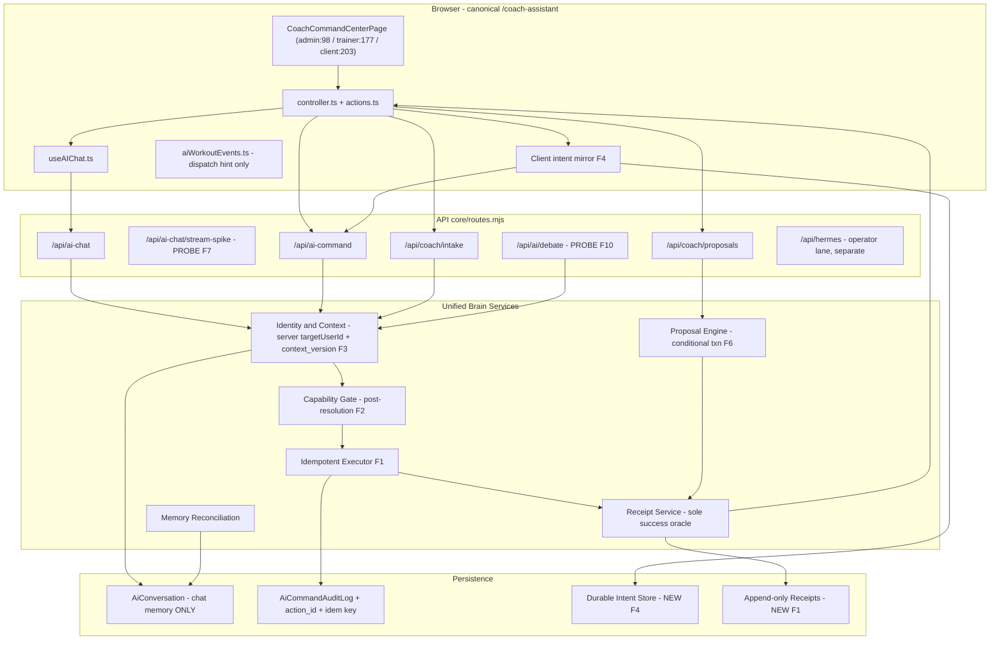

### 4.2 Request-to-receipt sequence

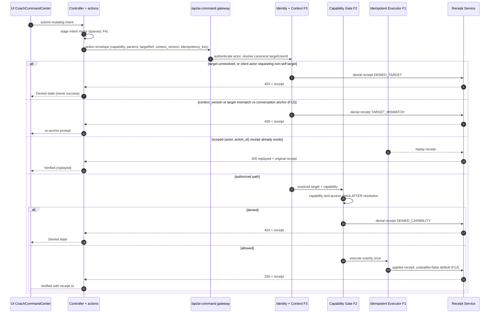

### 4.3 Role / client authorization

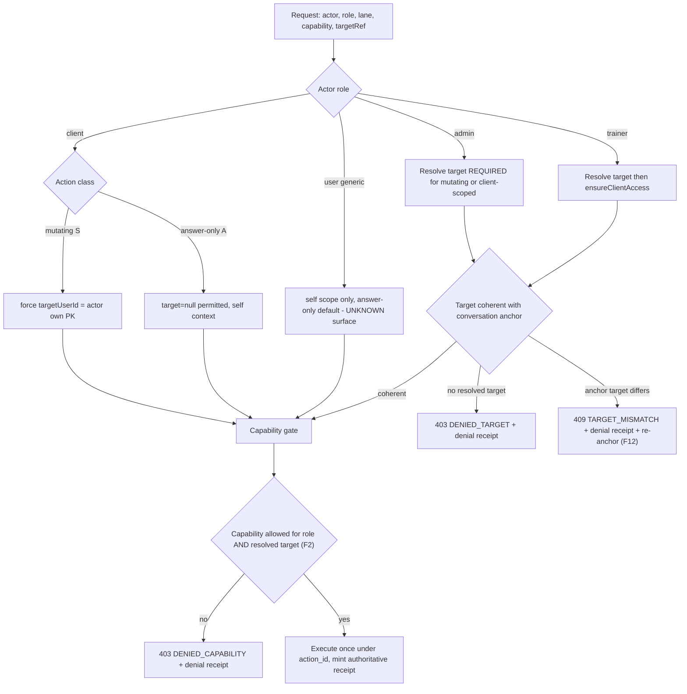

### 4.4 Offline / retry / reconcile

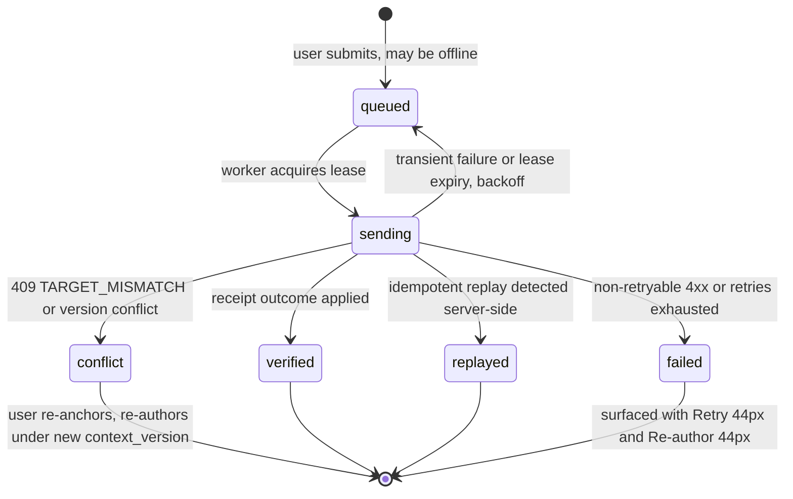

```mermaid
sequenceDiagram
  participant Q as Client intent mirror (F4)
  participant S as Command lane reconcile
  participant E as Executor
  participant R as Receipts
  Q->>S: reconcile(action_id, idempotency_key, capability, params, context_version)
  S->>R: lookup by scoped (actor, action_id)
  alt receipt exists
    R-->>S: existing receipt
    S-->>Q: verified or replayed, no re-execution
  else absent
    S->>E: full gate then execute once
    E->>R: new receipt
    S-->>Q: applied + receipt
  end
  Note over Q,R: Exactly-once by construction: lookup-then-execute under scoped unique key; concurrent duplicates converge to one receipt
```

### 4.5 Migration to the canonical brain

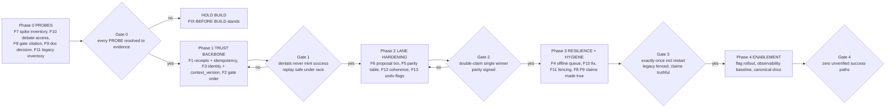

---

## 5. Role Wireframes (textual) — Admin, Trainer, Client, User × Desktop/Mobile

### 5.0 Shared interaction contract (applies to all frames)

| Concern | Rule |
|---|---|
| Controls | Every interactive target ≥ **44×44 px** (pointer + touch); 8px minimum spacing; visible 2px focus ring |
| Keyboard (global) | `/` focus composer · `Enter` send · `Shift+Enter` newline · `Ctrl/Cmd+Enter` command mode · `Esc` close modal/cancel send · `?` shortcut sheet · `g r` jump receipts · `j/k` navigate cards · `1–4` switch tabs (mobile parity) |
| Voice (global, per-frame verbs below) | Wake-free push-to-talk (44px mic); every voice action echoes a visible confirmation chip before submit |
| Success semantics | "Verified ✓" **only** with an `applied`/`replayed` receipt id; otherwise "Sending… (not verified)" |
| Live regions | `aria-live=polite` on conversation; `aria-live=assertive` on conflict/re-anchor only |

**Shared state spec** (referenced by every frame as S-1…S-7):

| ID | State | Trigger | Render | Forbidden |
|---|---|---|---|---|
| S-1 | Loading | request in flight | skeleton rows in conversation; composer disabled with "Sending… (not verified)" | word "streaming" (F7 unproven); success glyphs |
| S-2 | Error | 4xx/5xx/network | inline banner + **[Retry 44px]** + **[Copy receipt id 44px]** if partial | auto-retry mutating actions without confirmation |
| S-3 | Empty | no conversation/queue/proposals | coach greeting + 3 suggested capability chips (role-filtered) | cross-role suggestions; demo PII |
| S-4 | Conflict | `409 TARGET_MISMATCH` (F12) | modal: "Target changed. Re-anchor to Client A?" **[Re-anchor 44px]** **[Cancel 44px]**; conversation locked until resolved | silently switching target; showing which other client was requested |
| S-5 | Offline | connectivity lost | queue badge with count; composer stays enabled; intents go `queued` | implying delivery; hiding queue |
| S-6 | Denied | 403 receipt | banner with denial code (e.g., `DENIED_CAPABILITY`) + action short-id | success glyphs; internal policy/rule internals; other-client existence confirmation |
| S-7 | Verified | applied/replayed receipt | "Verified ✓ #r_xxxx · undoable: no" (F13 default) | "Saved" without receipt id |

**Global forbidden disclosures (all roles):** unverified success; other users' PII or conversations; raw audit parameter payloads / redaction hashes; idempotency keys (display action short-id); internal `context_version` internals beyond a badge; provider/model routing details; Hermes operator tooling; links to legacy `SwanCoachAssistantPage`; "streaming" language anywhere (F7); offline-queue internals from other devices.

### 5.1 Admin — Desktop

```
┌───────────────────────────────────────────────────────────────────────────┐
│ SWAN COACH · ADMIN            /coach-assistant        [⌘K] [?] [🎙 44px]  │
├──────────┬───────────────────────────────────────────┬────────────────────┤
│ NAV 56px │ ANCHOR BAR  Target: [Client A ▾ 44px] · ctx v42 ✓ · TTL 14:12 │
│ ◉ Coach  ├───────────────────────────────────────────┴────────────────────┤
│ ○ Roster │ CONVERSATION (aria-live=polite)                              │
│ ○ Props  │  …assistant answer…  …proposal card [Apply 44px] → Confirm…   │
│ ○ Rcpts  │                                                                │
│ ○ Debate │ RECEIPTS PANEL (live)                                         │
│          │  ✓ #r_9f21 applied · undoable:no      ⏳ #a_1c sending…       │
│ QUEUE(2) │  ⚠ #a_2d conflict → [Re-anchor 44px]   ✕ #a_3e failed [Retry] │
│ [Open44] │ ┌────────────────────────────────────────┐ [View all 44px]    │
│          │ │ composer                     [Send 44]│                    │
│          │ └────────────────────────────────────────┘                    │
└──────────┴────────────────────────────────────────────────────────────────┘
```
- **Keyboard deltas:** `g p` proposals, `g d` debate, `q` open offline queue.
- **Voice verbs:** "target client A", "apply proposal 2", "show receipts", "open queue".
- **Admin-only forbidden:** raw PII beyond resolved-target display name; audit hashes/parameter payloads in receipts panel; any retention/TTL bypass affordance.

### 5.2 Admin — Mobile

```
┌───────────────────────────────┐
│ ☰  Coach·Admin        [🎙 44] │
│ Target: Client A ▾44  v42 ✓   │ ← sticky anchor
├───────────────────────────────┤
│ conversation (scroll)         │
│ …proposal [Apply 44px]        │
│ ⚠ conflict → S-4 modal        │
├───────────────────────────────┤
│ [composer……….]      [Send 44] │
├───────────────────────────────┤
│ Coach | Props | Rcpts | Queue │ ← all ≥44px
└───────────────────────────────┘
```
- Target switcher is 44px full-width row on tap; re-anchor required on change (S-4). Same forbidden list as 5.1.

### 5.3 Trainer — Desktop

```
┌───────────────────────────────────────────────────────────────────────────┐
│ SWAN COACH · TRAINER          /coach-assistant        [⌘K] [?] [🎙 44px]  │
├──────────┬───────────────────────────────────────────┬────────────────────┤
│ NAV 56px │ ANCHOR BAR  My client: [Roster ▾ 44px] · ctx v17 ✓            │
│ ◉ Coach  ├───────────────────────────────────────────┴────────────────────┤
│ ○ Roster │ CONVERSATION   (roster-scoped only)                            │
│ ○ Props  │  …proposal card [Claim 44px] [Ask 44px]                        │
│ ○ Debate │  …draft command → Confirm dialog (T-class)                     │
│          │ RECEIPTS: ✓ #r_77 applied · ⏳ sending (not verified)           │
│ QUEUE(1) │ ┌────────────────────────────────────────┐                     │
│ [Open44] │ │ composer                     [Send 44]│                     │
│          │ └────────────────────────────────────────┘                     │
└──────────┴────────────────────────────────────────────────────────────────┘
```
- **Keyboard deltas:** `g d` debate (access-checked, F10).
- **Voice verbs:** "target my client J.", "claim proposal", "start debate".
- **Trainer-only forbidden:** any affordance naming or confirming clients outside roster (denials render S-6 generic copy); admin operations; audit internals.

### 5.4 Trainer — Mobile

```
┌───────────────────────────────┐
│ ☰ Coach·Trainer      [🎙 44]  │
│ My client: Roster ▾44  v17 ✓  │
├───────────────────────────────┤
│ conversation (scroll)         │
│ …proposal [Claim 44px]        │
├───────────────────────────────┤
│ [composer……….]      [Send 44] │
├───────────────────────────────┤
│ Coach | Props | Rcpts | Queue │
└───────────────────────────────┘
```
- Cross-roster target attempt ⇒ S-6 with no existence leak. Debate entry hidden if F10 probe fails.

### 5.5 Client — Desktop

```
┌───────────────────────────────────────────────────────────────────────────┐
│ SWAN COACH · CLIENT — acting as yourself (no target selector)   [🎙 44px]  │
├───────────────────────────────────────────────────────────────────────────┤
│ TABS (≥44px): [Coach] [My Plan] [My Actions] [Queue(n)]                   │
├───────────────────────────────────────────────────────────────────────────┤
│ CONVERSATION …assistant answer…                                           │
│ PROPOSAL CARD "Adjust Tuesday volume"   [Accept 44px] [Ask 44px]          │
│   Accept → Confirm: "Apply to my plan? This cannot be auto-undone."       │
│             [Yes, apply 44px] [No 44px]          (F13 default surfaced)   │
│ MY ACTIONS: ✓ #r_8e applied · undoable:no · ⏳ #a_5f sending (not verified)│
│ ┌───────────────────────────────────────────────┐                         │
│ │ composer                            [Send 44] │                         │
│ └───────────────────────────────────────────────┘                         │
└───────────────────────────────────────────────────────────────────────────┘
```
- **Voice verbs:** "accept the proposal", "ask about Tuesday", "show my actions".
- **Client-only forbidden:** any `targetUserId` UI; other-client anything; proposal apply on behalf of others; audit/receipt panels beyond own actions.

### 5.6 Client — Mobile

```
┌───────────────────────────────┐
│ Coach · Client (self)  [🎙 44] │
├───────────────────────────────┤
│ conversation (scroll)         │
│ proposal [Accept 44px]        │
│  → confirm [Yes 44][No 44]    │
├───────────────────────────────┤
│ [composer……….]      [Send 44] │
├───────────────────────────────┤
│ Coach | Plan | Actions | Queue│
└───────────────────────────────┘
```

### 5.7 User — Desktop (**SURFACE-USER is UNKNOWN; frame is the mandatory pattern if/when a User surface is mounted**)

```
┌───────────────────────────────────────────────────────────────────────────┐
│ SWAN COACH · USER — self-scope, answer-only by default           [🎙 44px] │
├───────────────────────────────────────────────────────────────────────────┤
│ CONVERSATION (answer-only)  …assistant answer…                            │
│ NO target selector · NO cross-user affordances · NO admin/trainer verbs   │
│ RECEIPTS STRIP: ⏳ sending (not verified) · ✓ #r_k3 verified ·            │
│                  ✕ failed [Retry 44px]                                    │
│ ┌───────────────────────────────────────────────┐                         │
│ │ composer                            [Send 44] │                         │
│ └───────────────────────────────────────────────┘                         │
└───────────────────────────────────────────────────────────────────────────┘
```
- **User-only forbidden:** any mutating capability not explicitly product-defined later; any target concept; proposal lanes; debate lane; Hermes.

### 5.8 User — Mobile (pattern, UNKNOWN mount)

```
┌───────────────────────────────┐
│ Coach · You           [🎙 44]  │
├───────────────────────────────┤
│ conversation (scroll)         │
│ receipts strip (S-1/S-2/S-7) │
├───────────────────────────────┤
│ [composer……….]      [Send 44] │
└───────────────────────────────┘
```

---

## 6. State Machines and Contracts

### 6.1 Context anchor (F3/F12)

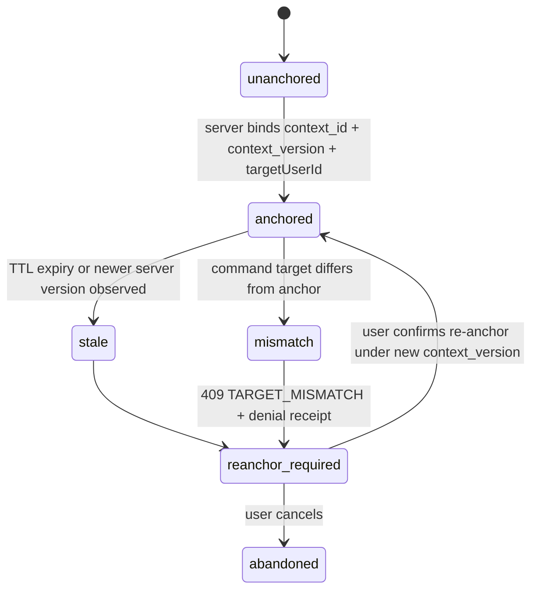
**Contract:** `{ context_id, context_version, targetUserId, lane, anchor_scope, expires_at }` — server-issued at conversation creation (`aiChatRoutes.mjs:308-344` pattern) and echoed by command requests; mismatch ⇒ reject. TTL values: **PROBE (F5)**.

### 6.2 Capabilities (F2)

**Registry contract per capability:** `{ capability_id, class ∈ {A,S,T,P}, target_required, allowed_roles, client_scope_rule, check_order = resolve→access→capability, denial_code, undo_policy }`. Checks execute **after** target resolution, **immediately before** execution; denials are first-class outcomes with receipts, never exceptions swallowed into success.

### 6.3 Actions / intents (F1/F4)

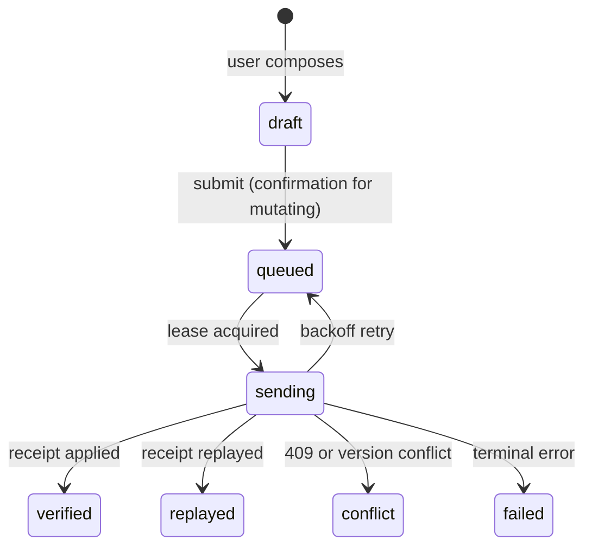
**Contract:** `{ intent_id (client), action_id (server-scoped unique), idempotency_key (unique per actor+lane+key), capability_id, target_ref, redacted_params, context_version, state, attempts, last_error_code }`. `action_id` uniqueness scope: `(actor, lane, idempotency_key)`.

### 6.4 Confirmation / undo (F13)

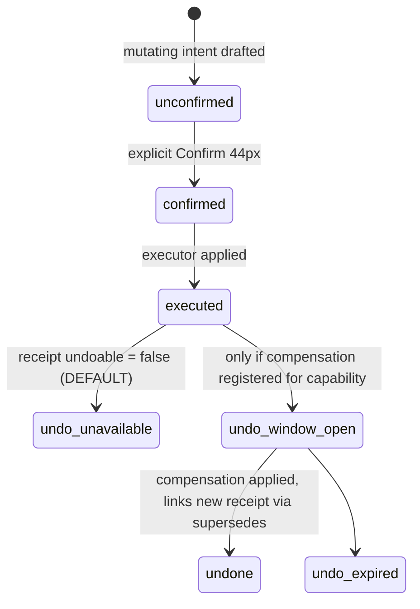
**Contract:** UI copy for every mutating confirm includes "cannot be auto-undone" until a compensation is registered for that capability.

### 6.5 Re-anchor (F12)

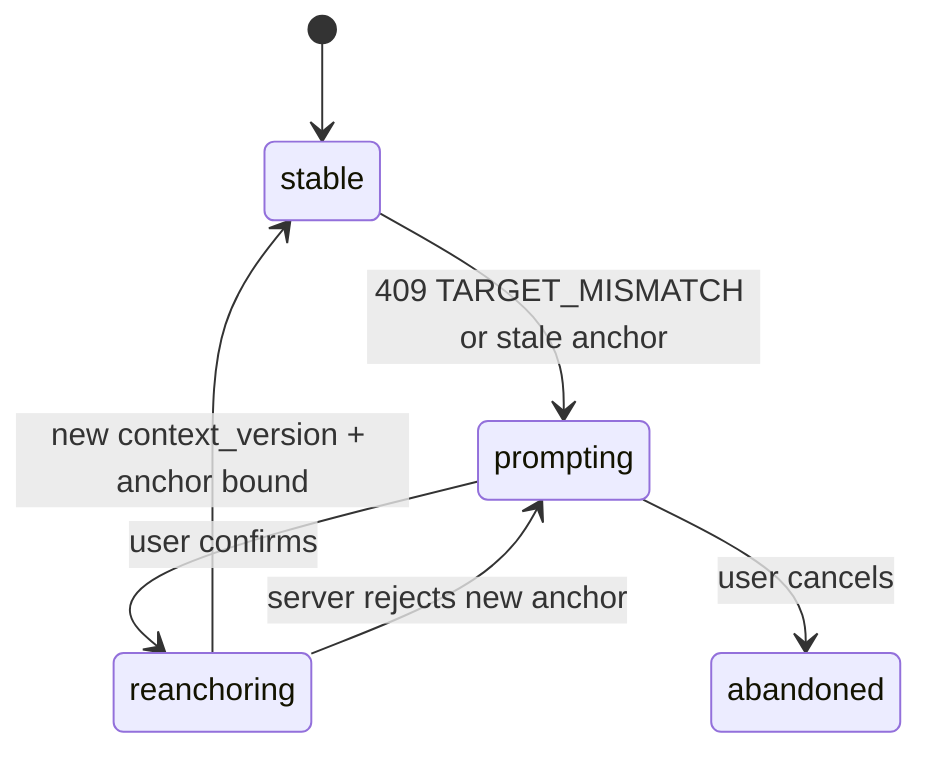
**Contract:** During `prompting`, composer is locked; no intent submission; denial receipt is displayed with action short-id.

### 6.6 Memory reconciliation

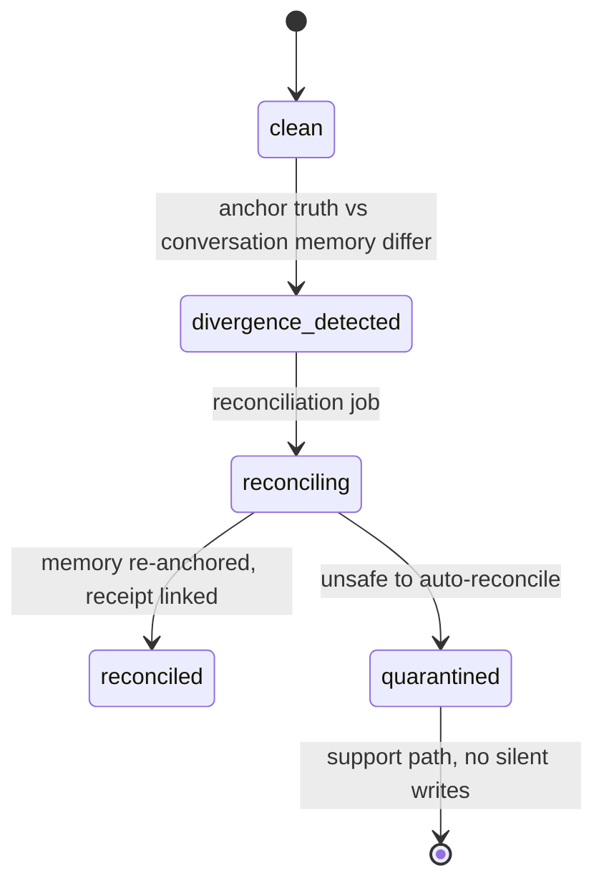
**Contract:** `AiConversation` remains the only conversation memory; reconciliation never writes command state or offline-queue entries into it (F4 boundary).

### 6.7 Receipts (F1/F2/F6/F13)

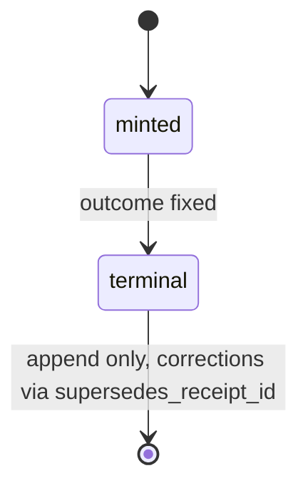
**Contract fields:** `{ receipt_id, action_id, actor, actor_role, targetUserId, capability_id, outcome ∈ {applied, denied, conflicted, replayed, failed}, denial_code?, applied_at, undoable (default false), resource_pointer, context_version, idempotency_key_hash }`. Denials are receipt-shaped with `outcome=denied`. Extend `AiCommandAuditLog.mjs:24-91` (which today lacks `action_id`/unique idempotency) or attach the append-only receipt store; audit retains redaction/hashing semantics.

### 6.8 UI status (derived, never asserted)

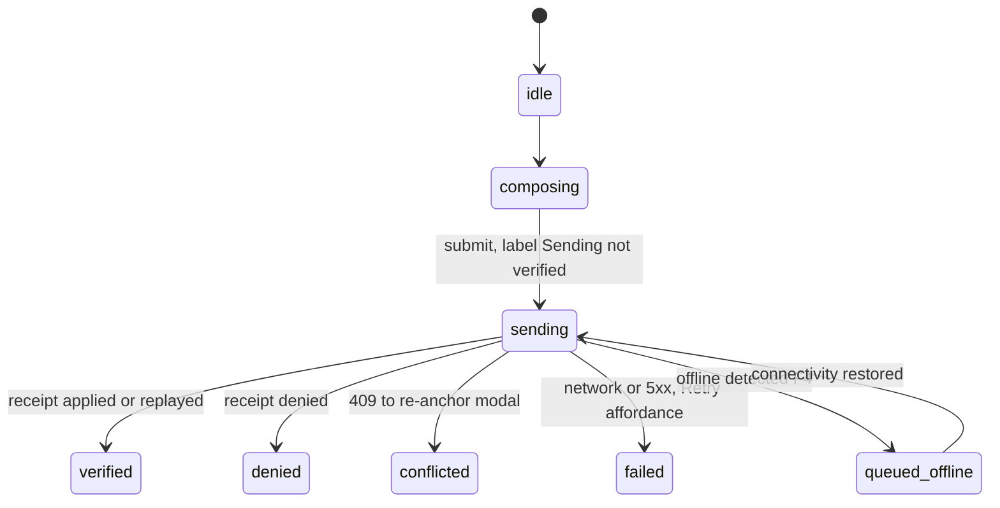
**Contract:** transitions are pure functions of (intent state, receipt); dispatcher booleans (`aiWorkoutEvents.ts:121-128`) may never drive `verified`.

---

## 7. Ordered PR-Sized Implementation Slices

**Global compatibility strategy:** additive-only schema/API changes; every behavior change behind a flag (`coach.receipts.*`, `coach.coherence.*`); receipts run in **shadow mode** (written, not enforced) before enforcement; `context_version` optional-then-required, with `409 TARGET_MISMATCH` active only after the coherence flag; legacy route serves redirect + deprecation log. **Global non-goals:** no new product capabilities; no streaming enablement (F7); no Hermes merge; no provider-specific work; no deletion of legacy page; no offline state in `AiConversation`; no auto-undo claims.

| # | Slice | Exact routes/files | Depends on | Compat strategy | Slice non-goals |
|---|---|---|---|---|---|
| S0 | **Probe ledger** (F7, F10, F8, F9, F11): inventory all `/api/ai-chat/stream-spike` methods (`core/routes.mjs:630-634`, `aiChatRoutes.mjs:466-625`) and prove 404-when-disabled; probe `ensureClientAccess` absence on `aiDebateRoutes.mjs:54-76`; locate or strike the review-gate implementation (F8); record Hive-Mind decision (F9); inventory `SwanCoachAssistantPage` references/tests/locks (F11) | read-only; docs + decision records | — | none (no product change) | Any fix; any enablement |
| S1 | **Receipts + idempotency backbone** (F1): append-only receipt store (NEW model); extend `AiCommandAuditLog.mjs:24-91` with `action_id` + scoped unique idempotency key; idempotent wrapper on `commandExecutor.mjs:309-343`; envelope on `aiCommandRoutes.mjs:110-145` | S0 | shadow mode → enforce flag | UI changes; capability semantics |
| S2 | **Canonical identity + context anchor** (F3): single resolution in `clientResolver.mjs:110-166`; client-actor→own PK; target-required enforcement for S/T; server `context/version` issued at conversation creation (`aiChatRoutes.mjs:308-344`) and shared with command lane | S1 | anchor fields additive; old requests default unanchored | Changing chat auth family |
| S3 | **Post-resolution capability gate** (F2): resolve→check→execute ordering middleware in command lane; denial receipts (`DENIED_TARGET`, `DENIED_CAPABILITY`) | S2 | flag; default deny-then-verify in shadow | New capabilities |
| S4 | **Cross-lane coherence + re-anchor** (F12): `409 TARGET_MISMATCH` + denial receipt; `CoachCommandCenter.controller.ts` / `actions.ts` / `useAIChat.ts` re-anchor flow + S-4 modal | S3 | 409 only under coherence flag | Silent target switching |
| S5 | **Proposal conditional transaction** (F6): claim/apply single conditional txn on `status='pending'` behind `coachProposalRoutes.mjs:15-54`; idempotent replay; applied/failed receipts | S1, S2 | new transactional endpoint form; legacy path frozen read-only | Proposal UX redesign |
| S6 | **Intake/proposal parity** (F5): parity table vs chat family (`aiChatRoutes.mjs:283,610-625`); auth/PII/retention/TTL controls for `coachIntakeRoutes.mjs:23-33` + proposals; **enablement gated on signed parity table** | S0, S5 | lanes stay mounted but capability-gated off until parity signed | Retention policy changes beyond parity |
| S7 | **Offline intent queue** (F4): NEW durable client store + reconcile over command lane keyed by scoped `action_id`; states per §6.3; queue drawer UI | S1, S2, S4 | queue additive; `AiConversation` untouched | Server-side scheduling; cross-device sync (UNKNOWN infra — probe first) |
| S8 | **Debate access fix** (F10): `ensureClientAccess` on `aiDebateRoutes.mjs:54-76`; trainer cross-client denial proof | S0 | additive guard | Debate product changes |
| S9 | **Legacy fencing** (F11): fence/redirect `SwanCoachAssistantPage`; migrate or explicitly retire its tests/locks; ensure no route-tree competition | S0 | redirect + deprecation log; **no deletion** | Deleting the file |
| S10 | **Claims made true** (F8, F9): strike or cite review gate; Hive-Mind retire-with-tombstone or reconcile (D4 decision gate) | S0 | docs + header change only | Rewriting unrelated docs |
| S11 | **Undo scaffolding** (F13): `undoable=false` default on applied receipts; compensation registry pattern (empty) | S1 | flag default-off semantics | Shipping compensations |
| S12 | **Observability + verification completion**: metrics (receipt latency, denial rate by code, mismatch rate, queue depth, replay rate), dashboards, alerts; full §8 suite green | S1–S11 | telemetry additive | User-facing analytics |

---

## 8. Verification Matrix

| Layer | ID | Scenario | Expected | Method |
|---|---|---|---|---|
| Unit | U-1 | Idempotency key scoping | Same key, different actors → two distinct actions | Executor unit tests |
| Unit | U-2 | Denial receipt shape | `outcome=denied` + code; no success fields | Receipt service tests |
| Unit | U-3 | UI status derivation | Dispatcher boolean can never yield `verified` | Pure-function tests over §6.8 |
| Contract | C-1 | Receipt envelope schema | Additive fields only; old clients unaffected | Schema/consumer contract tests |
| Contract | C-2 | `context_version` lifecycle | Optional→required transition honored; mismatch ⇒ 409 only under flag | Lane contract tests |
| Contract | C-3 | Proposal receipt outcomes | `applied`/`failed` only after txn commit | Contract tests on S5 |
| Integration | I-1 | Chat→command context share | Same server context/version both lanes | E2E chat+command flow |
| Integration | I-2 | Debate start access | Trainer cross-client ⇒ denial (F10) | E2E debate route |
| Integration | I-3 | Stream spike disabled | Every inventoried method ⇒ 404 (F7) | Route-level method matrix |
| Concurrency | X-1 | Dual-submit same idempotency key | Exactly one execution; both callers get same receipt | Parallel request harness |
| Concurrency | X-2 | Two trainers claim one pending proposal | Exactly one `applied`; other gets `conflicted`/`failed` receipt | Transactional race test (F6) |
| Concurrency | X-3 | Offline reconcile after client restart | Exactly-once; `replayed` not re-executed | Kill/restart harness (F4) |
| AuthZ / IDOR | A-1 | Client submits `targetUserId` of another user | 403 `DENIED_TARGET`, denial receipt, no existence leak | IDOR probe suite |
| AuthZ / IDOR | A-2 | Trainer targets non-roster client (cmd, debate, intake, proposals) | 403 with generic copy; audit written | IDOR probe suite |
| AuthZ / IDOR | A-3 | Anchor Client A + command Client B | 409 `TARGET_MISMATCH` + denial receipt + UI re-anchor (F12) | Cross-lane test |
| Privacy / retention | P-1 | Audit/receipt parameter redaction | No raw PII in audit or receipts | Redaction fixtures |
| Privacy / retention | P-2 | Intake/proposal TTL + retention vs chat family | Parity table row-by-row equality (F5) | Parity diff test |
| Privacy / retention | P-3 | Receipts panel per role | Role-scoped fields only; no cross-user receipts | UI data-leak tests |
| Offline / failure injection | O-1 | Offline submit → reconnect | `queued→sending→verified`; UI never shows success early | Network partition harness |
| O-2 | 5xx mid-execution | No success minted; retry converges to one receipt | Chaos harness |
| O-3 | Conflict path | `conflict` state → re-anchor → re-author under new version | Scripted 409 flow |
| Responsive / a11y | R-1 | All interactive targets ≥44×44 on 360px viewport | 0 violations | Automated size audit + manual |
| R-2 | Keyboard-only full journey (compose→confirm→verified→re-anchor) | Completable; focus trap in modals; visible rings | Manual + axe |
| R-3 | Voice verbs per §5; live-region announcements for S-4/S-7 | Announced once, assertive only for conflict | Manual AT pass |
| Observability | B-1 | Every terminal outcome emits metric + log with `action_id` | 100% coverage; alert on denial-spike and queue-stall | Dashboard/alert tests |

---

## 9. Prioritized Hostile Findings (F1–F13, preserved)

| ID / Tier | Finding & Evidence | Fix | Acceptance Criterion |
|---|---|---|---|
| **F1 / GATE** | No `action_id`, no unique idempotency key, no authoritative receipt in command lane (`AiCommandAuditLog.mjs:24-91`; `commandExecutor.mjs:309-343`) | S1 backbone | Concurrent duplicate submissions converge to one receipt; UI "Verified" impossible without `applied`/`replayed` receipt |
| **F3 / GATE** | Identity resolution split across chat (`aiChatRoutes.mjs:308-344` accepts `targetUserId`) and command (`clientResolver.mjs:110-166`); no shared context/version | S2 | Single server-owned resolver; client actors forced to own PK; shared `context_version` across lanes |
| **F2 / GATE** | Check ordering unproven relative to target resolution/execution | S3 | Gate provably runs post-resolution/pre-execution; denials are receipt-shaped and never mint success (A-2, U-2) |
| **F6 / GATE** | Proposal claim/apply not one conditional transaction (`coachProposalRoutes.mjs:15-54`) | S5 | X-2 passes: double-claim single winner, durable applied/failed receipt |
| **F5 / GATE** | Intake/proposal guards (`coachIntakeRoutes.mjs:23-33`) unproven vs chat middleware family for auth/PII/retention/TTL | S6 | Signed parity table; P-2 green; enablement blocked until signed |
| **F4 / PER-SLICE** | No durable offline intent lane; risk of abusing `AiConversation.messages/status` | S7 | §6.3 state machine live; exactly-once after restart (X-3); conversation model untouched |
| **F7 / MUST-FIX** | Stream spike methods un-inventoried; 404-when-disabled unproven (`core/routes.mjs:630-634`; `aiChatRoutes.mjs:466-625`) | S0 | Method matrix with per-method 404 proof; zero streaming language in product until then |
| **F10 / MUST-FIX** | Debate start (`aiDebateRoutes.mjs:54-76`) resolves client context without proven `ensureClientAccess` | S0→S8 | Trainer cross-client denial proven (I-2) |
| **F11 / MUST-FIX** | `SwanCoachAssistantPage` legacy-but-referenced; competes if re-linked | S9 | Fenced + redirect; tests/locks migrated or retired; not deleted; absent from canonical nav |
| **F8 / MUST-FIX** | Review-gate header claim uncited | S0/S10 | Implementation cited with `file:line`, or claim struck |
| **F9 / MUST-FIX** | `APP-AI-HIVE-MIND.md:7-22` contradicts mounted multi-lane runtime | S10 | Retired-with-tombstone or reconciled; D4 decision recorded |
| **F12 / DESIGN-GATE** | Cross-lane target coherence absent | S4 | A-3 passes: 409 + denial receipt + forced re-anchor |
| **F13 / DESIGN-GATE** | No per-action undo/compensation | S11 | All applied receipts default `undoable=false`; UI discloses non-recoverable; registry pattern exists (empty) |

---

## 10. Builder Handoff and Acceptance Gates

**Implementation order (strict):** S0 → S1 → S2 → S3 → S4 → (S5 ∥ S6-prep) → S7 → S8 → S9 → S10 → S11 → S12. S8/S9/S10 may run in parallel after S0 but merge after S4 to keep receipt semantics single-threaded.

| Gate | After | Acceptance (all must pass; no partial credit) |
|---|---|---|
| **G0 — Evidence** | S0 | Probe ledger complete: F7 method matrix, F10 access finding, F8 citation-or-strike, F9 decision record (D4 resolved or explicitly deferred with owner), F11 inventory. Every packet PROBE now VERIFIED or confirmed-absent. Otherwise **HOLD BUILD — the FIX BEFORE BUILD ruling stands.** |
| **G1 — Trust backbone** | S1–S3 | Append-only receipts live in shadow; X-1/X-2 harness green on backbone; U-2 denials never success; single identity path; `context_version` issued server-side |
| **G2 — Lane hardening** | S4–S6, S11 | A-3 conflict path green; X-2 single-winner; F5 parity table signed by owner; `undoable=false` default everywhere |
| **G3 — Resilience + hygiene** | S7–S10 | X-3 exactly-once incl. restart; I-2 debate denial; legacy fenced/redirected; F8/F9 claims truthful |
| **G4 — Enablement** | S12 | Flags flipped only now; B-1 observability 100% outcome coverage; R-1/R-2/R-3 a11y pass; zero unverified success paths reachable |

**Standing prohibitions for the builder:** do not invent product direction, capabilities, or UI beyond §5; do not enable streaming claims (F7); do not join Coach with Hermes; do not use `AiConversation` as command/offline state; do not treat dispatch booleans as write proof; do not delete `SwanCoachAssistantPage`; write no code until G0 closes.

**Escalation rule:** any runtime evidence contradicting this packet (e.g., a stream-spike method that serves 200 when "disabled", an `ensureClientAccess` already present, a legacy page mount discovered) ⇒ **halt the affected slice**, log the divergence in the probe ledger, and return to synthesis for a re-ruling. The builder may not resolve product ambiguity unilaterally.

**End of blueprint.**
