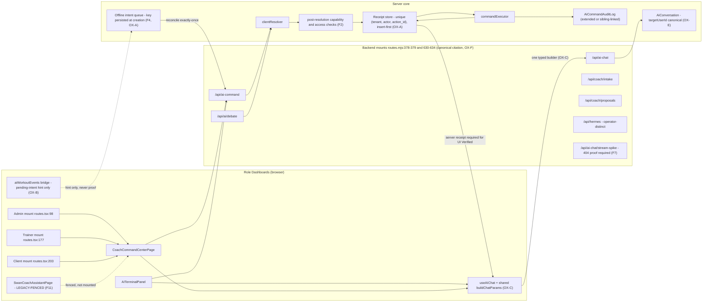
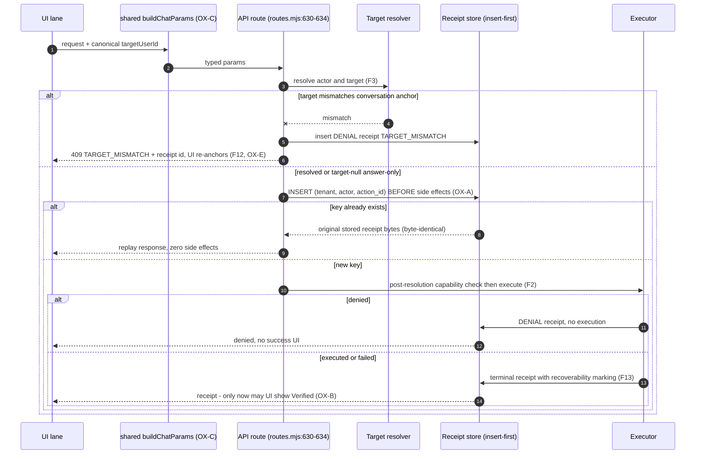
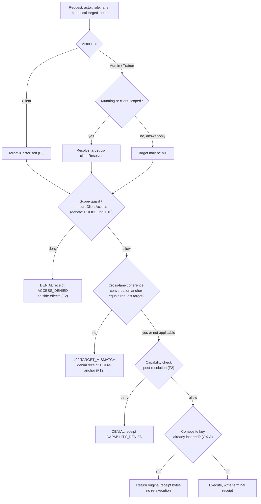
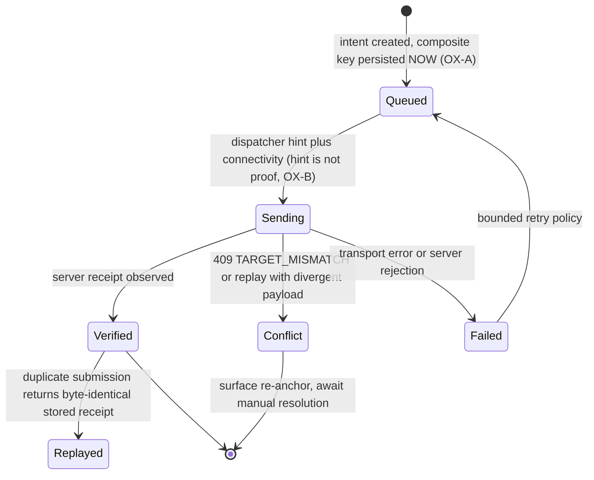
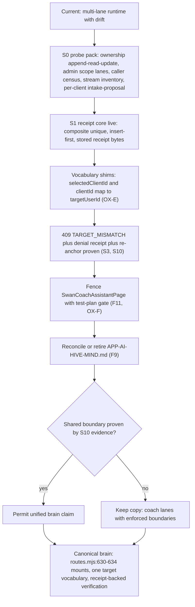
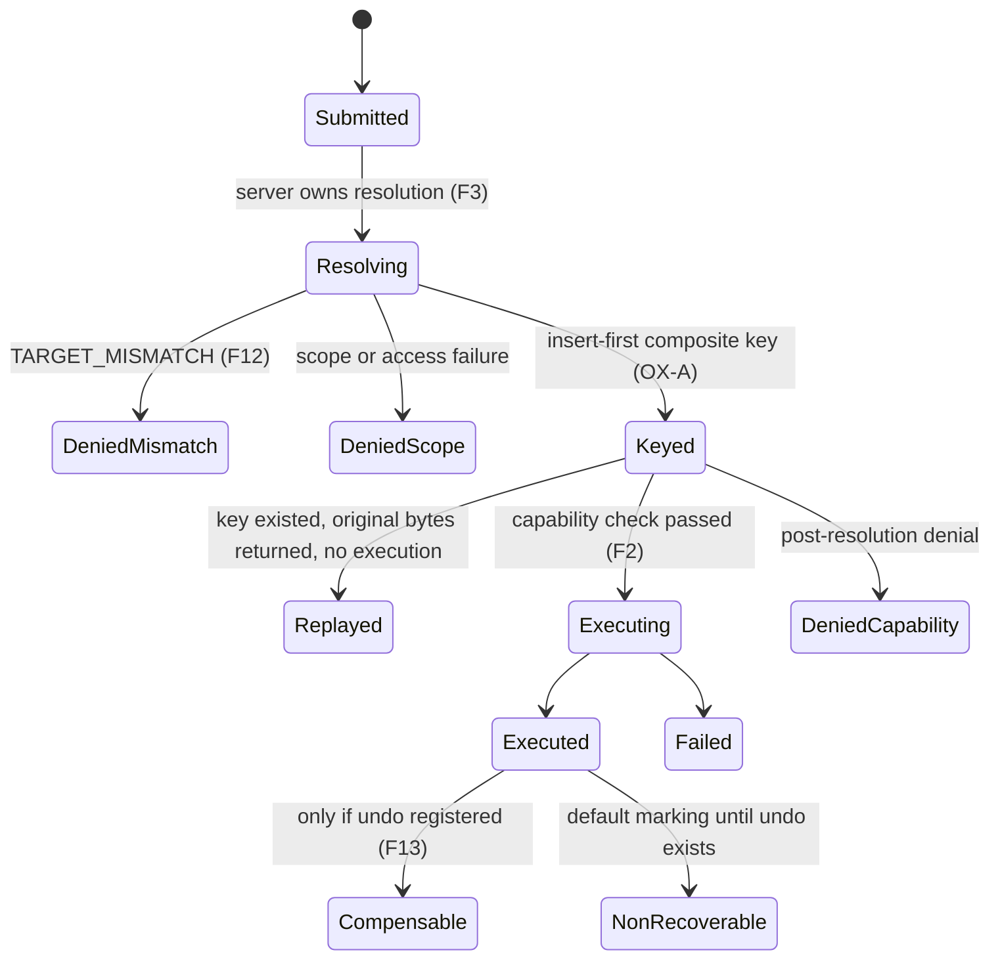
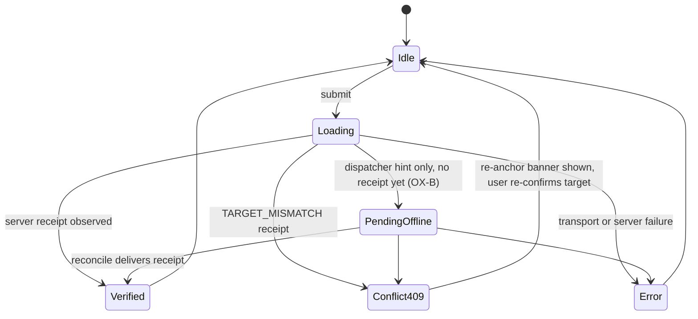

# GLM Consult

**Model:** glm-5.3
**Document:** docs/ai-workflow/AI-HANDOFF/PANEL-SWAN-COACH-BLUEPRINT-SYNTHESIS-2026-08-23.md
**Tokens:** 2117 in / 25485 out (reasoning: 13136) | total 27602
**Wall:** 280.6s

---

# Swan Coach Unified Brain — Revised Implementation Blueprint v2.0 (OX-Inclusive Synthesis)

**Document class:** Provider-neutral, implementation-ready design authority. No source code. No runtime behavior beyond cited evidence. This revision supersedes the baseline synthesis packet. Implementation executors (including Codex) build to this blueprint; they do not alter product direction, gates, rulings, or claims.

---

## 0. Review Provenance, Ledger, and Label Legend

### 0.1 Baseline review (preserved)

- 10 rounds; roster GLM 5.3, Grok 4.6, DeepSeek V4 Pro; honest termination at **MAXROUNDS / DISPUTE**; ≈ $0.7055 tracked spend; strongest candidate ruling: **FIX BEFORE BUILD / REVISE**.
- An earlier five-seat run is **supporting evidence only** (stale-state reuse). Its unresolved state and its final candidate are **non-authoritative** and must not gate, unblock, or seed any decision here.

### 0.2 Fresh OX-inclusive review (governing this revision)

| Item | Record |
|---|---|
| Rounds | 10 |
| Roster | GLM 5.3, Grok 4.6, DeepSeek V4 Pro, **Ox Alpha** |
| Outcome | **MAXROUNDS / DISPUTE** |
| Tracked spend | ≈ $0.7420; ledger line *"approx .7420 under .40"* preserved **verbatim** — the ".40" fragment is carried uninterpreted (this packet forbids inventing semantics not in evidence) |
| OX valid verdicts | Rounds **2, 6, 10** |
| OX transport gaps (explicit) | Rounds **1, 3, 4, 5, 7, 8, 9** — OX TRANSPORT FAILURE, no verdict delivered. These rounds constitute **neither concurrence nor dissent**. Failure mode details are not in the sanitized ledger (UNKNOWN). |
| Amendments adopted | OX-A through OX-F are **mandatory** regardless of per-round transport status; the panel adopted them on the strength of the valid round-2/6/10 verdicts. |

### 0.3 Label legend (used throughout; PROBE/UNKNOWN discipline preserved)

| Label | Meaning | Build rule |
|---|---|---|
| **VERIFIED** | Cited file:line evidence exists | May be built upon |
| **PROBE** | Design requires a probe; assumption forbidden | Probe must land before dependent build |
| **UNKNOWN** | No evidence either way | Blocks dependent claims; carries forward explicitly |
| **OX-FAIL** | Ox Alpha transport failure for that round | No OX position claimed |

---

## 1. Executive Ruling and Dissent

### 1.1 Ruling — unchanged, doubly sustained

**FIX BEFORE BUILD / REVISE.** Both the baseline 10-round debate and the fresh OX-inclusive 10-round review ended MAXROUNDS/DISPUTE with FIX BEFORE BUILD as the strongest candidate. No enablement, no "unified brain" claim, and no streaming/product claims until the gate register below is green.

### 1.2 Gate register F1–F13 (preserved verbatim in force; OX tightenings noted)

| Gate | Requirement (preserved) | OX tightening |
|---|---|---|
| **F1** | Durable `action_id`, scoped unique idempotency key, idempotent executor, authoritative receipt across the command lane; receipt returned **before** UI verified success | **OX-A** (composite uniqueness, insert-first, byte-identical replay, key persisted at intent creation, concurrency/isolation proofs) |
| **F2** | Capability + access checks run **after target resolution, immediately before execution**; denials write a denial-shaped audit/receipt, never mint success | **OX-D** (probe ownership beyond creation) |
| **F3** | One canonical server-owned `targetUserId`/user-PK identity; client actors resolve to self; admin/trainer mutating or client-scoped actions require resolved target; answer-only may be target-null; chat and command share server context/version and reject mismatch | **OX-E** (vocabulary shims + 409) |
| **F4** | Separate durable offline intent queue keyed by scoped `action_id`; states `queued/sending/verified/replayed/conflict/failed`; exactly-once reconcile; **never** `AiConversation.messages/status` | **OX-A** (key persisted at creation) |
| **F5** | Intake/proposal auth, PII, retention, TTL at parity with chat middleware family; parity table required before enablement | **OX-F** (per-client probes) |
| **F6** | Proposal claim/apply as one conditional transaction on `status='pending'`; idempotent replay; durable applied/failed receipt | — |
| **F7** | Inventory every stream-spike method; prove disabled-404 behavior before any streaming claim | — |
| **F8** | Cite the review-gate implementation or strike the header claim; prose is not a gate | — |
| **F9** | Reconcile or retire `APP-AI-HIVE-MIND.md` | **OX-F** (dormant-doc reconciliation gate) |
| **F10** | Apply `ensureClientAccess` to debate start; prove trainer cross-client denial | — |
| **F11** | Fence legacy `SwanCoachAssistantPage`; migrate or explicitly retire its tests/locks; no competition with canonical page | **OX-F** (legacy test-plan gate) |
| **F12** | Cross-lane coherence: conversation bound to Client A + command for Client B ⇒ `409 TARGET_MISMATCH`, denial receipt, forced UI re-anchor | **OX-E** (mapping shims; no unified-brain claim until proven) |
| **F13** | Per-action undo/compensation; until it exists, receipts mark applied writes **non-recoverable** | — |

### 1.3 OX amendment register (mandatory, additive)

| ID | Amendment (binding summary) |
|---|---|
| **OX-A** | Durable receipt payload in the audit store or a sibling receipt store; **actor/tenant-scoped composite uniqueness** for command idempotency; **insert-first** conflict handling returning the **original receipt before any side effects**; key **persisted at offline intent creation**; prove **concurrent duplicate ⇒ one execution + byte-identical receipts** and **cross-actor isolation**. |
| **OX-B** | `aiWorkoutEvents.ts:121-128` restored as a **must-fix**: the dispatcher is only a **pending-intent hint**; UI "Verified" requires a **server receipt**. A test must **fail** when browser acknowledgement alone is treated as verified. |
| **OX-C** | One typed shared **`buildChatParams`** at `useAIChat.ts`, used by **every** `sendMessageWithConversation` caller, including `AITerminalPanel.tsx:116-139` and `CoachCommandCenter.actions.ts:203-204`; test all callers. |
| **OX-D** | Probe ownership for existing conversation **message append, reads, and updates** — not only creation; probe **admin scope** across command / chat / intake / proposal / debate / Hermes-related lanes. |
| **OX-E** | Standardize target-client vocabulary — `AiConversation.targetUserId` (canonical), `aiCommand selectedClientId`, `aiDebate`/`AITerminal clientId` — via mapping shims; `409 TARGET_MISMATCH` + denial receipt + UI re-anchor. **Do not claim unified brain until the shared boundary is proven.** |
| **OX-F** | Legacy `SwanCoachAssistantPage` **test-plan gate**; dormant `APP-AI-HIVE-MIND` reconciliation; **per-client intake/proposal probes**; `routes.mjs:630-634` is the **canonical API mount citation**. |

### 1.4 Dissent and non-concurrence (recorded honestly)

- MAXROUNDS/DISPUTE in **both** reviews: no unanimous final at round 10. Per-seat final positions beyond the ruling itself: **PROBE** (transcripts sanitized).
- The earlier five-seat run's differing candidate is recorded as **non-authoritative dissent only**; it gates nothing.
- OX transport failures (rounds 1, 3, 4, 5, 7, 8, 9) mean **no OX concurrence is claimed** for those rounds; only rounds 2, 6, 10 delivered OX verdicts.
- No seat's evidence, in either review, overturned or weakened any of F1–F13.
- **Claim discipline (binding):** the phrase "unified brain" may not appear in UI copy, docs, or release notes until the OX-E shared boundary is proven by the S10 evidence gate. Until then, the sanctioned copy is **"coach lanes with enforced shared boundaries."**

---

## 2. Canonical Surface and Capability Classification

### 2.1 Surface classification table

| Surface / artifact | Evidence (VERIFIED unless labeled) | Classification | Governing gates |
|---|---|---|---|
| Admin mount of `CoachCommandCenterPage` | `UniversalDashboardLayout.routes.tsx:98`; lazy decl `routeComponents.tsx:64` | CANONICAL (admin) | F1–F13 |
| Trainer mount | `routes.tsx:177` | CANONICAL (trainer) | F1–F13 |
| Client mount | `routes.tsx:203` | CANONICAL (client) | F1–F13, OX-B |
| Mounted JSX + role context | `CoachCommandCenterPage.tsx:34-44, 96-105, 149` | CANONICAL | — |
| Chat hook | `useAIChat.ts:217, 425, 448`; consumer `CoachCommandCenter.controller.ts:42` | CANONICAL; becomes sole home of shared `buildChatParams` | OX-C |
| Command actions caller | `CoachCommandCenter.actions.ts:203-204` | CANONICAL; must adopt shared builder | OX-C |
| AI terminal | `AITerminalPanel.tsx:116-139` | CANONICAL; must adopt shared builder | OX-C, OX-E (`clientId` shim) |
| API mounts (canonical citation) | `routes.mjs:378-379` (intake, proposals); **`routes.mjs:630-634` (canonical citation per OX-F)** for `/api/ai-chat/stream-spike`, `/api/ai-chat`, `/api/ai-command`, `/api/hermes`, `/api/ai/debate` | CANONICAL | F7 |
| Chat auth/access | `aiChatRoutes.mjs:283, 466, 610-625`; creation with `targetUserId` at `:308-344` | CANONICAL; **append/read/update ownership = PROBE** | OX-D |
| Command target path | `aiCommandRoutes.mjs:110-145`; `commandExecutor.mjs:309-343`; `clientResolver.mjs:110-166` | CANONICAL; `selectedClientId` shim | F1, F3, OX-A, OX-E |
| Intake / proposal guards | `coachIntakeRoutes.mjs:23-33`; `coachProposalRoutes.mjs:15-54` | CANONICAL; parity gap open | F5, F6, OX-F |
| Debate start | `aiDebateRoutes.mjs:54-76` — accepts/resolves client context; `ensureClientAccess` **PROBE** | CANONICAL (conditional) | F10, OX-D, OX-E |
| Conversation model | `AiConversation.mjs:24-83` (`userId, role, context, targetUserId, messages, status, metadata, messageCount, lastMessageAt`) | CANONICAL; `targetUserId` is the canonical vocabulary | F3, F4, OX-E |
| Command audit model | `AiCommandAuditLog.mjs:24-91` — actor/role/target/operation/outcome/param-hash/redaction/duration; **no `action_id`, no unique idempotency key** | GAP → receipt core | F1, OX-A |
| Browser event bridge | `aiWorkoutEvents.ts:121-128` — dispatcher boolean only, not proof of durable write | HINT-ONLY | OX-B |
| `SwanCoachAssistantPage` | Legacy, still referenced, **not** mounted by the verified route tree | **LEGACY-FENCED** — do not delete; fence + test-plan gate | F11, OX-F |
| `APP-AI-HIVE-MIND.md:7-22` | Describes a free Gemini/Qwen design conflicting with mounted multi-lane runtime | **DORMANT-DOC** — reconcile or retire | F9, OX-F |
| Hermes lane (`/api/hermes`) | Mount VERIFIED; operator semantics UNKNOWN | **OPERATOR-DISTINCT** — public Coach surface stays separate unless a later probe explicitly joins them | OX-D (scope probe) |
| Stream spike | Mount VERIFIED; "disabled" claim unproven | **PROBE** — 404 proof before any claim | F7 |

### 2.2 Capability lane status

| Lane | Mount | Status | Blocking gates |
|---|---|---|---|
| Chat | `/api/ai-chat` | Build permitted after S1–S4 | F1–F3, OX-A/C/D/E |
| Command | `/api/ai-command` | Build permitted after S1–S4 | F1–F3, OX-A/E |
| Offline workout intents | browser bridge → queue | Design only until S6 | F4, OX-A/B |
| Intake | `/api/coach/intake` | **Enablement blocked** | F5, OX-F |
| Proposal | `/api/coach/proposals` | **Enablement blocked** | F5, F6, OX-F |
| Debate | `/api/ai/debate` | **Enablement blocked** | F10, OX-D/E |
| Streaming | `/api/ai-chat/stream-spike` | **All product claims blocked** | F7 |
| Hermes | `/api/hermes` | Out of scope; operator-distinct | Boundary rule (§3.7) |

---

## 3. Target Architecture and Ownership Boundaries

### 3.1 Identity ownership rules (F3, preserved)

1. The **server** owns target identity resolution; clients never assert an authoritative target.
2. Client actors resolve to their **own actor ID** (self-anchor).
3. Admin/trainer **mutating or client-scoped** actions require a **resolved target** via `clientResolver.mjs:110-166`.
4. **Answer-only** actions may remain target-null.
5. Chat and command share one server context/version; mismatch is rejected (→ F12/409).

### 3.2 Receipt and idempotency core (F1 + OX-A)

**Store decision (S0-gated):** extend `AiCommandAuditLog` with the receipt payload + composite unique index, **or** create a sibling receipt store cross-referenced from the audit row. Decision criteria: probe whether the audit store has a single-writer path; if yes, extension is permitted; if multiple writers or retention semantics diverge, the sibling store is mandatory. Default if the probe is inconclusive: **sibling receipt store** (isolates idempotency semantics from audit retention).

**Composite uniqueness:** `(tenant, actor, action_id)` — actor/tenant-scoped; enforced by a unique index at the store, not by application-level check-then-insert.

**Insert-first protocol (binding order):**

1. Resolve target (F3).
2. Coherence check (F12) → mismatch writes denial receipt, returns 409.
3. **INSERT** `(tenant, actor, action_id)` **before any side effect**.
   - Insert conflicts ⇒ **return the originally stored receipt bytes**; no side effects execute (replay).
4. Post-resolution capability/access check (F2) ⇒ denial writes denial-status receipt; no execution.
5. Execute; write terminal receipt (`executed` / `failed`).

**Byte-identical guarantee:** the receipt's canonical bytes are serialized **once at first write** (fixed field order, deterministic encoding, existing audit redaction rules applied to parameter hashes) and **stored**; every replay returns the **stored bytes**, never a re-serialization. This is how "byte-identical receipts" is provable rather than aspirational.

**Receipt payload contract (store-neutral):**

| Field | Owner | Constraint |
|---|---|---|
| `action_id` | caller, validated server-side | Present at first insert; opaque to executor |
| `tenant`, `actor`, `actor_role` | server | Composite key members with `action_id` |
| `resolved_target` | server | Canonical `targetUserId` or null (answer-only) |
| `lane`, `operation` | server | Enumerated lanes (§2.2) |
| `params_hash` | server | Redacted per existing audit redaction |
| `status` | server | `executed \| denied \| conflict \| replayed \| failed` |
| `denial_code` | server | `ACCESS_DENIED \| CAPABILITY_DENIED \| TARGET_MISMATCH \| SCOPE_UNKNOWN` |
| `server_timestamp`, `duration` | server | As audit family today |
| `recoverability` | server | `NON_RECOVERABLE` by default until F13 compensation registered |
| `receipt_bytes` | server | Stored canonical serialization; replay source |

**Offline linkage (OX-A):** the composite key is **persisted at offline intent creation** (§3.6), so a later retry replays the identical key — never a fresh one.

### 3.3 Target vocabulary standard (OX-E + F3 + F12)

- **Canonical boundary vocabulary: `targetUserId`.**
- Mapping shims (temporary, retirement-gated): `selectedClientId` (aiCommand) → `targetUserId`; `clientId` (aiDebate / AITerminalPanel) → `targetUserId`. Shims translate **at the route boundary**; internal services see only the canonical field. Shim retirement gate: zero non-shim usages in probes + all-caller tests green.
- **Mismatch contract:** conversation anchored to Client A + command/debate request for Client B ⇒ `409 TARGET_MISMATCH` + denial receipt + UI re-anchor event (§6.4).

### 3.4 Shared chat parameter builder (OX-C)

One typed `buildChatParams` owned by `useAIChat.ts` is the **only** permitted construction path for `sendMessageWithConversation` requests. Known callers to migrate: `AITerminalPanel.tsx:116-139`, `CoachCommandCenter.actions.ts:203-204`. **PROBE (S0):** full caller census — any caller not enumerated here is UNKNOWN until the census lands. Contract: single typed input (canonical `targetUserId`, context/version, lane), single typed output; every caller has a caller-pinned test.

### 3.5 Conversation ownership (OX-D — probe matrix)

| Operation | Status |
|---|---|
| Conversation **creation** with `targetUserId` | VERIFIED (`aiChatRoutes.mjs:308-344`) |
| Message **append** ownership | **PROBE** |
| Message **read** ownership | **PROBE** |
| Message/conversation **update** ownership | **PROBE** |
| Admin scope — command lane | **PROBE** |
| Admin scope — chat lane | **PROBE** |
| Admin scope — intake / proposal lanes | **PROBE** (+ per-client probes, OX-F) |
| Admin scope — debate lane | **PROBE** |
| Admin scope — Hermes-related lanes | **PROBE / UNKNOWN** (operator-distinct until probed) |

Rule: no ownership design is finalized for append/read/update until the S0 probes land; UNKNOWN results carry forward explicitly and block related enablement.

### 3.6 Offline intent semantics (OX-B + F4)

- `aiWorkoutEvents.ts:121-128` dispatcher boolean = **pending-intent hint only**. It never evidences a durable write.
- UI **"Verified"** renders exclusively from an observed **server receipt**.
- Offline queue is a **separate durable store** with states `queued / sending / verified / replayed / conflict / failed`; the composite key is written **at creation**; reconcile is exactly-once; `AiConversation.messages/status` is **never** the queue (F4).

### 3.7 Hermes boundary (preserved)

Hermes remains operator tooling, distinct from the public Coach surface. No join, no shared copy, no shared claim in this revision. A later explicit probe may propose a join; until then, joins are UNKNOWN.

### 3.8 Memory reconciliation ownership

| Store | Authoritative for | Forbidden use |
|---|---|---|
| `AiConversation` | Dialogue memory, context/version | Offline queue; action proof |
| Receipt store | Action outcomes, idempotency, denials | Dialogue content |
| Offline intent queue | Pending intents, retry state | Any UI "verified" claim; conversation mutation |

---

## 4. Mermaid Diagram Families (five, as contracted)

### D1 — Component / context



### D2 — Request-to-receipt sequence



### D3 — Role / client authorization



### D4 — Offline / retry / reconcile



### D5 — Migration to the canonical brain



---

## 5. Role Wireframes — Desktop and Mobile (Admin, Trainer, Client, User)

**Shared control & state contract (applies to all eight frames):** every interactive control ≥ **44×44 px**; full keyboard operability with documented tab order and visible focus; **voice input** available on every chat/command input (provider-neutral capture); live-region announcements for all status transitions. Required states everywhere applicable: **Loading** (skeleton, double-submit prevented), **Error** (retry affordance + receipt id if one exists), **Empty** (guidance + lane status), **Conflict** (409 banner + forced re-anchor), **Offline-Pending** (copy: "Pending server verification — not Verified").

### 5.1 Admin — desktop

```
┌───────────────────────────────────────────────────────────────────────────┐
│ Swan Coach · Admin        [ANCHOR: Client ▾ — A. Sample]      ⌘K   Help(44)│
├────────────┬──────────────────────────────────────────┬───────────────────┤
│ Lanes      │ Command Center (chat + terminal)          │ Anchor & Receipts │
│ Chat    ●  │ ┌──────────────────────────────────────┐  │ Anchored: A. S.  │
│ Command ●  │ │ conversation · useAIChat             │  │ 409? → banner +  │
│ Intake  ○  │ │ shared buildChatParams (OX-C)        │  │ forced re-anchor │
│ Proposal○  │ └──────────────────────────────────────┘  │───────────────────│
│ Debate  ○  │ > terminal · AITerminalPanel              │ Receipt stream    │
│ Hermes  ⊘  │ [🎤 44][ input            ][Send 44][Confirm▸]│ #a1 ✓ verified │
│ (operator) │ Status: ● online ◌ pending(offline) ⚠ err │ #a2 ⊘ denied     │
│ Legacy  ⛔  │ Empty: "No conversation for this anchor" │ [Audit export 44] │
└────────────┴──────────────────────────────────────────┴───────────────────┘
```

### 5.2 Admin — mobile

```
┌─────────────────────────────┐
│ ☰(44) Admin  [Anchor: A ▾44]│
├─────────────────────────────┤
│ [Chat][Cmd][Intk][Prop] 44px│
│ ┌─────────────────────────┐ │
│ │ conversation stream     │ │
│ │ (skeleton while loading)│ │
│ └─────────────────────────┘ │
│ ┌ terminal / action card ┐  │
│ [🎤44][ input        ][➤ 44]│
│ Receipts ▸ bottom drawer 44 │
│ ⚠ 409 → re-anchor sheet     │
└─────────────────────────────┘
```

**Admin must not be shown:** Hermes operator internals (UNKNOWN lane), stream-spike affordances (F7 unproven), any "verified" state not backed by a server receipt, legacy-page entry points.

### 5.3 Trainer — desktop

```
┌─────────────────────────────────────────────────────────────────┐
│ Swan Coach · Trainer   [ANCHOR: My Client ▾ — assigned only]  ⌘K │
├────────────┬────────────────────────────────────────────────────┤
│ My Roster  │ Chat + command (scoped to assigned clients)        │
│ A. Sample ●│ ┌────────────────────────────────────────────────┐ │
│ B. Lee   ● │ │ conversation · shared builder                 │ │
│ (unassigned│ └────────────────────────────────────────────────┘ │
│  clients   │ [🎤44][ input                     ][Send44][Confirm▸]│
│  hidden)   │ Cross-client denial state:                        │
│ Workouts ○ │ "Access denied — client not in your roster"       │
│ Intake  ○  │ + denial receipt id shown, no retry-until-reanchor │
└────────────┴────────────────────────────────────────────────────┘
```

### 5.4 Trainer — mobile

```
┌──────────────────────────┐
│ ☰(44) Trainer [Client ▾44]│
├──────────────────────────┤
│ [Chat][Cmd][Wkout] 44px  │
│ conversation stream       │
│ [🎤44][ input      ][➤44]│
│ ⊘ denial card w/ receipt  │
│ ⚠ 409 → re-anchor sheet   │
│ Offline: "Pending server  │
│ verification — not Verified"│
└──────────────────────────┘
```

**Trainer must not be shown:** unassigned-client selectors, admin-scope operations, debate lane controls (until F10 green), any verified state without a receipt.

### 5.5 Client — desktop

```
┌───────────────────────────────────────────────────────────────┐
│ Swan Coach · Client (self-anchored · no target selector)  ⌘K  │
├──────────────┬────────────────────────────────────────────────┤
│ Today        │ Chat with coach (targetUserId = self)          │
│ Workouts     │ ┌────────────────────────────────────────────┐ │
│ ┌──────────┐ │ │ messages                                    │ │
│ │ Push-ups │ │ └────────────────────────────────────────────┘ │
│ │ ◌ Pending│ │ [🎤44][ input                    ][Send 44]     │
│ │ Stretch  │ │ Event verification (OX-B):                     │
│ │ ✓Verified│ │  Push-ups ◌ Pending — awaiting server receipt  │
│ │ #a1      │ │  Stretch  ✓ Verified — receipt #a1             │
│ └──────────┘ │  (browser acknowledgement alone never shows ✓) │
└──────────────┴────────────────────────────────────────────────┘
```

### 5.6 Client — mobile

```
┌──────────────────────────┐
│ Swan Coach · Me      ⌘K  │
├──────────────────────────┤
│ [Chat][Workouts] 44px    │
│ conversation stream       │
│ [🎤44][ input      ][➤44]│
│ Workout card:             │
│  ◌ Pending (hint only)    │
│  ✓ Verified · receipt #a1 │
│ ⚠ error → retry (44)      │
└──────────────────────────┘
```

**Client must not be shown:** any target/client selector, other clients' data, admin/trainer operations, trainer tools, internal audit export.

### 5.7 User (generic authenticated principal outside the three coach roles) — desktop

```
┌────────────────────────────────────────────────────────────┐
│ Account · AI Activity & Consent                    ⌘K Help44│
├────────────────────────────────────────────────────────────┤
│ [Activity PROBE] [Consent PROBE] [Data & retention PROBE]  │
│ Coach command lanes: NOT MOUNTED for this principal        │
│ ┌────────────────────────────────────────────────────────┐ │
│ │ Activity list (surface scope UNKNOWN — S0 probe)       │ │
│ │ Empty: "No AI activity surfaces for this account yet"  │ │
│ └────────────────────────────────────────────────────────┘ │
│ [Manage consent 44] [Export my data 44] (gated by F5 parity)│
└────────────────────────────────────────────────────────────┘
```

### 5.8 User — mobile

```
┌──────────────────────────┐
│ Account · AI        ⌘K   │
├──────────────────────────┤
│ [Activity][Consent] 44px │
│ PROBE-tagged cards only  │
│ Coach lanes: not mounted │
│ [Manage consent 44]      │
│ Loading/Error/Empty as   │
│ shared contract          │
└──────────────────────────┘
```

**User must not be shown:** coach lanes (chat/command/intake/proposal/debate), Hermes anything, any receipt stream belonging to other actors, any verified-state logic (none applies).

---

## 6. State Machines and Contracts

### 6.1 Action lifecycle (state machine)



### 6.2 UI status (state machine)



### 6.3 Context contract

| Field | Owner | Rule |
|---|---|---|
| `conversationId`, `contextVersion` | server | Shared by chat and command lanes |
| `anchoredTargetUserId` | server | Derived from conversation binding; canonical vocabulary |
| `lane`, `actor_role` | server | Enumerated |
| Mismatch | — | Any cross-lane divergence ⇒ 409 + denial receipt (F3/F12) |

### 6.4 Re-anchor contract

| Aspect | Specification |
|---|---|
| Trigger | Receipt with `denial_code = TARGET_MISMATCH` (409) |
| Payload | Expected anchor, offending target, lane, receipt id |
| UI behavior | Non-dismissable banner, focus moves to anchor control, pending submissions for the offending target are cleared, live-region announcement |
| Telemetry | Re-anchor event with receipt id (observability row, §8) |

### 6.5 Capabilities matrix (cells keep PROBE/UNKNOWN until S0/S9 land)

| Lane | Admin mutating | Trainer mutating | Client self | Answer-only |
|---|---|---|---|---|
| Chat | PROBE (OX-D) | PROBE (OX-D) | VERIFIED (self-anchor) | Allowed, target-null |
| Command | PROBE (OX-D) | Scoped-probe | Allowed (self) | Allowed, target-null |
| Intake/Proposal | PROBE (OX-F per-client) | PROBE | Self-only probe | n/a |
| Debate | PROBE | **PROBE → F10 gate** | PROBE | PROBE |
| Hermes | UNKNOWN (operator-distinct) | UNKNOWN | Not offered | UNKNOWN |
| Streaming | **Blocked (F7)** | Blocked | Blocked | Blocked |

### 6.6 Confirmation / undo contract

- Mutating actions require two-step confirm (UI Confirm affordance visible in wireframes).
- Compensation registry per action type; **until an entry exists, every executed receipt is marked `NON_RECOVERABLE`** and the UI shows "This action cannot be undone" pre-confirmation (F13).

### 6.7 Memory reconciliation contract

- Reconciler moves offline intents → receipt outcomes exactly once (D4); it **never** writes `AiConversation.messages/status` (F4) and never fabricates receipts client-side (OX-B).
- Dialogue edits via conversation ownership rules only — those rules are **PROBE** until OX-D lands.

### 6.8 Receipt & UI-status contracts

- Receipt: §3.2 payload table; statuses `executed/denied/conflict/replayed/failed`; replay returns **stored bytes**.
- UI status mapping: `PendingOffline→"Pending server verification — not Verified"`, `Verified→✓ + receipt id`, `Conflict409→re-anchor banner`, `Error→retry + receipt id if any`, `Empty→lane guidance`.

---

## 7. Ordered PR-Sized Implementation Slices

Global compatibility strategy: **additive only** — shims, new store/index, new 409 code with UI handling, no deletion of the legacy page, no Hermes changes, no streaming enablement. Global non-goals: no provider-specific behavior, no "unified brain" copy, no enablement of blocked lanes, no source-code deletion of legacy artifacts in this revision.

| # | Slice | Gates | Dependencies | Exact files / routes (VERIFIED citations) | Compatibility & non-goals | Acceptance (summary; full in §10) |
|---|---|---|---|---|---|---|
| S0 | Probe & census pack (no behavior change) | OX-D, OX-C census, F7, OX-F | none | `aiChatRoutes.mjs` (append/read/update probes), `aiCommandRoutes.mjs`, `coachIntakeRoutes.mjs:23-33`, `coachProposalRoutes.mjs:15-54`, `aiDebateRoutes.mjs:54-76`, stream-spike methods, `useAIChat.ts` caller census, audit single-writer probe | Read-only; non-goal: any fix | Probe report committed; every PROBE resolved or explicitly carried as UNKNOWN; receipt-store decision recorded |
| S1 | Receipt & idempotency core | F1, OX-A | S0 | `AiCommandAuditLog.mjs:24-91` extension or sibling store; `commandExecutor.mjs:309-343`; `aiCommandRoutes.mjs:110-145` | Additive; non-goal: UI change, offline queue | Concurrent duplicates ⇒ 1 execution + byte-identical stored-byte receipts; cross-actor same `action_id` ⇒ 2 isolated executions; insert-before-side-effects proven |
| S2 | Shared chat builder | OX-C | S0 census | `useAIChat.ts` (builder home), `AITerminalPanel.tsx:116-139`, `CoachCommandCenter.actions.ts:203-204`, `CoachCommandCenter.controller.ts:42` | No protocol change; non-goal: behavioral rewrites | Every enumerated caller uses the one typed builder; every caller has a passing caller-pinned test |
| S3 | Target canonicalization & 409 | F3, F12, OX-E | S1, S2 | `AiConversation.mjs:24-83`, `aiCommandRoutes.mjs:110-145`, `clientResolver.mjs:110-166`, `aiDebateRoutes.mjs:54-76`, coach UI surfaces | Shims temporary; non-goal: shim removal | 409 + denial receipt + UI re-anchor demonstrated on chat↔command mismatch |
| S4 | Post-resolution checks | F2 | S1, S3 | `commandExecutor.mjs:309-343`, lane guards | Ordering change only; non-goal: new capabilities | Denials produce denial receipts; no success path bypasses post-resolution check |
| S5 | Verified gating (browser ack ≠ verified) | OX-B | S1 | `aiWorkoutEvents.ts:121-128`, client UI verified badge | Non-goal: removing the bridge (it stays a hint) | New test **fails** if browser acknowledgement alone yields "Verified"; ✓ renders only from a server receipt |
| S6 | Offline intent queue | F4, OX-A | S1, S5 | New durable queue store; bridge linkage | Non-goal: conversation-store usage | States per D4; key persisted at creation; exactly-once reconcile proven under failure injection |
| S7 | Proposal claim/apply transaction | F6 | S1 | `coachProposalRoutes.mjs:15-54`, proposal service | Non-goal: enablement (stays gated by F5) | Conditional-on-`pending` transaction; idempotent replay returns durable applied/failed receipt |
| S8 | Intake/proposal parity | F5, OX-F | S0 | `coachIntakeRoutes.mjs:23-33`, `coachProposalRoutes.mjs:15-54`, middleware family | Non-goal: enablement before parity table passes | Parity table (auth/PII/retention/TTL) green; per-client probes documented |
| S9 | Debate access | F10 | S3 | `aiDebateRoutes.mjs:54-76` | Non-goal: debate enablement | `ensureClientAccess` applied; trainer cross-client denial test passes with denial receipt |
| S10 | Cross-lane coherence E2E | F12, OX-E proof | S3, S4 | All lanes + UI | Non-goal: claim unlock by assertion | A-anchored conversation + B-target command/debate ⇒ 409 + receipt + re-anchor, across every lane; **this is the unified-brain-claim evidence gate** |
| S11 | Undo / compensation registry | F13 | S1 | Receipt store marking, action registry | Non-goal: retroactive undo before registry | Executed receipts marked `NON_RECOVERABLE` unless a compensation entry exists |
| S12 | Legacy fence + dormant doc | F11, F9, OX-F | S10 | `SwanCoachAssistantPage` (fence, tests/locks migration plan), `APP-AI-HIVE-MIND.md:7-22` | Non-goal: deletion | Legacy page fenced with passing **test-plan gate**; doc reconciled or retired with decision record |
| S13 | Gate citation + observability + release readiness | F8 + all | all | Review-gate implementation citation (or header strike), metrics/log dashboards | Non-goal: enablement of blocked lanes | Cited gate implementation or claim struck; observability matrix (§8) green; final acceptance run recorded |

---

## 8. Verification Matrix

| Class | What must be proven | Key cases (gate refs) | Acceptance criterion |
|---|---|---|---|
| **Unit** | Builder typing, receipt serialization, state transitions | `buildChatParams` type contract (OX-C); canonical receipt bytes (OX-A); D4/D6.1 transitions | 100% of enumerated units covered; no caller bypasses builder |
| **Contract** | Route/API contracts incl. 409 shape; receipt payload; denial codes | `TARGET_MISMATCH` payload (F12/OX-E); denial receipts (F2); replay response = stored bytes | Contract tests pin every field; no untyped parameter paths at callers |
| **Integration** | Full lane paths chat/command/debate; anchor binding; proposal transaction | `routes.mjs:630-634` mounts; S7 conditional transaction (F6); S9 debate denial (F10) | End-to-end green with receipts at each terminal state |
| **Concurrency** | OX-A proofs | N parallel same-`(tenant,actor,action_id)` submissions ⇒ **1 execution**, all responses byte-identical to stored receipt; same `action_id` across actors ⇒ N executions, isolated receipts; proposal double-claim ⇒ single winner | Deterministic under repeated runs; no side effect on replay |
| **Authorization / IDOR** | Post-resolution checks; scope matrix; cross-client denial | Trainer→unassigned client denied with receipt (F2/F10); admin scope per OX-D probe results; client self-anchor only | Zero unauthorized successes; every denial has a denial receipt |
| **Privacy / retention** | Parity of intake/proposal with chat middleware | Parity table (F5); PII redaction in `params_hash`; retention/TTL (OX-F probes) | Parity table fully green or lane stays disabled |
| **Offline / failure injection** | Queue semantics; hint ≠ proof | Kill network after dispatcher hint ⇒ UI stays "Pending" (OX-B); **red test**: browser ack alone must fail to produce Verified; duplicate reconnect ⇒ replayed, not re-executed (F4/OX-A) | Exactly-once reconcile; no conversation-store usage |
| **Responsive / accessibility** | 44px targets, keyboard, voice, live regions, all states per frame | All 8 wireframe frames; conflict/re-anchor announcement | Automated a11y + manual keyboard/voice pass per frame |
| **Observability** | Receipt, denial, replay, re-anchor telemetry | Receipt id in logs; denial-code histograms; re-anchor events (§6.4); stream-spike 404 telemetry (F7) | Dashboards distinguish executed/replayed/denied/mismatch without PII |

---

## 9. Prioritized Hostile Findings (evidence → fix → acceptance)

| Pri | ID | Finding | Evidence | Fix | Acceptance criterion |
|---|---|---|---|---|---|
| P0 | H1 | No `action_id` / unique idempotency key; replays can double-execute | `AiCommandAuditLog.mjs:24-91` | S1 (F1/OX-A) | Concurrency row of §8 green |
| P0 | H2 | Authorization ordering not provably post-resolution | `commandExecutor.mjs:309-343` | S4 (F2) | Denial-receipt proof; no pre-resolution execution path |
| P0 | H3 | Cross-lane target drift (`targetUserId` vs `selectedClientId` vs `clientId`) | `AiConversation.mjs:24-83`, `aiCommandRoutes.mjs:110-145`, `aiDebateRoutes.mjs:54-76` | S3/S10 (F3/F12/OX-E) | 409 + receipt + re-anchor across all lanes |
| P0 | H4 | Browser dispatcher boolean masquerading as verification | `aiWorkoutEvents.ts:121-128` | S5 (OX-B) | Red test: browser ack alone fails; ✓ only with server receipt |
| P0 | H5 | Offline intents lack durable queue; risk of conversation-store misuse | Packet F4 ruling | S6 | D4 machine proven under failure injection |
| P0 | H6 | Proposal claim/apply race | `coachProposalRoutes.mjs:15-54` | S7 (F6) | Conditional transaction + idempotent replay receipts |
| P1 | H7 | Conversation append/read/update ownership UNKNOWN | `aiChatRoutes.mjs:308-344` covers creation only | S0 (OX-D) | Probe report; UNKNOWNs either resolved or blocking |
| P1 | H8 | Admin scope unprobed across six lanes | OX-D | S0 | Scope matrix cells filled or explicitly UNKNOWN |
| P1 | H9 | Stream-spike "disabled" claim unproven | `routes.mjs:630-634` mount | S0/S13 (F7) | 404 proof per method or claim struck |
| P1 | H10 | Debate start lacks proven `ensureClientAccess` | `aiDebateRoutes.mjs:54-76` | S9 (F10) | Trainer cross-client denial test |
| P1 | H11 | Caller-fragmented chat params | `AITerminalPanel.tsx:116-139`, `CoachCommandCenter.actions.ts:203-204` | S2 (OX-C) | All callers on one typed builder, all tested |
| P1 | H12 | No undo/compensation; applied writes silently "recoverable-looking" | F13 ruling | S11 | Default `NON_RECOVERABLE` marking + registry |
| P1 | H13 | Intake/proposal below chat middleware parity | `coachIntakeRoutes.mjs:23-33`, `coachProposalRoutes.mjs:15-54` | S8 (F5/OX-F) | Parity table green or lanes disabled |
| P2 | H14 | Legacy page can compete with canonical surface | `SwanCoachAssistantPage` still referenced, unmounted | S12 (F11/OX-F) | Fence + test-plan gate passed |
| P2 | H15 | Dormant doc contradicts runtime | `APP-AI-HIVE-MIND.md:7-22` | S12 (F9) | Reconciled or retired with decision record |
| P2 | H16 | Header review-gate claim uncited | F8 ruling | S13 | Citation present or claim struck |
| P1 | H17 | **Process: OX transport gaps** — rounds 1,3,4,5,7,8,9 produced no Ox Alpha verdict | §0.2 ledger | Disclosure only; no retroactive concurrence invented | Gaps remain explicit in this blueprint and any derived docs |
| P2 | H18 | **Process: stale five-seat run** could be mistaken for authority | §0.1 | Provenance rule | No artifact cites it as gating authority |
| P2 | H19 | **Process: spend ledger fragment** "under .40" ambiguous | §0.2 | Verbatim preservation; no derived budget behavior | Fragment carried uninterpreted |

---

## 10. Builder Handoff — Exact Order and Acceptance Gates

**Implementation order (strict):** S0 → S1 → S2 → S3 → S4 → S5 → S6 → S7 → S8 → S9 → S10 → S11 → S12 → S13. S0 is read-only and blocks everything; S1 blocks all receipt-dependent slices; S10 is the sole evidence gate for any "unified brain" claim; S12 runs only after S10 to avoid competing surfaces mid-migration.

**Per-slice acceptance gates:**

- **S0:** probe report committed; receipt-store decision recorded; caller census complete; every PROBE resolved or explicitly carried as UNKNOWN with owner.
- **S1:** insert-first proven; concurrent duplicates ⇒ one execution + byte-identical stored-byte receipts; cross-actor isolation proven.
- **S2:** one typed builder; zero bypassing callers; all caller tests green.
- **S3:** shims live; 409 + denial receipt + UI re-anchor demonstrated.
- **S4:** no execution path precedes post-resolution checks; denials always receipted.
- **S5:** the browser-ack-alone test exists and **fails** without a server receipt; UI honors it.
- **S6:** D4 machine proven; key persisted at creation; exactly-once reconcile.
- **S7:** conditional transaction + idempotent replay receipts.
- **S8:** parity table green or lanes remain disabled.
- **S9:** trainer cross-client debate denial with receipt.
- **S10:** cross-lane 409 proven on every lane — **claim gate unlocked only here**.
- **S11:** `NON_RECOVERABLE` default + compensation registry.
- **S12:** legacy fence + test-plan gate passed; hive-mind doc reconciled/retired.
- **S13:** F8 citation or strike; observability matrix green; release-acceptance run recorded.

**Global release gates (all must be green before any enablement):** F1–F13 all passing; OX-A through OX-F all passing; §8 matrix fully green; all PROBE/UNKNOWN items either resolved or explicitly waived in a recorded ruling; canonical API mount citation (`routes.mjs:630-634`) present in all derived docs; OX transport gaps and the stale five-seat run disclosed in all derived provenance sections.

**Standing prohibitions:** no source code in blueprint artifacts; no enablement of blocked lanes; no Hermes/coach join; no streaming claims before F7; no deletion of the legacy page; no provider-specific behavior; no "unified brain" copy before S10; and — binding — **Codex and all downstream executors implement this blueprint and do not alter product direction.**

---

*End of blueprint. Ruling preserved: FIX BEFORE BUILD / REVISE.*
