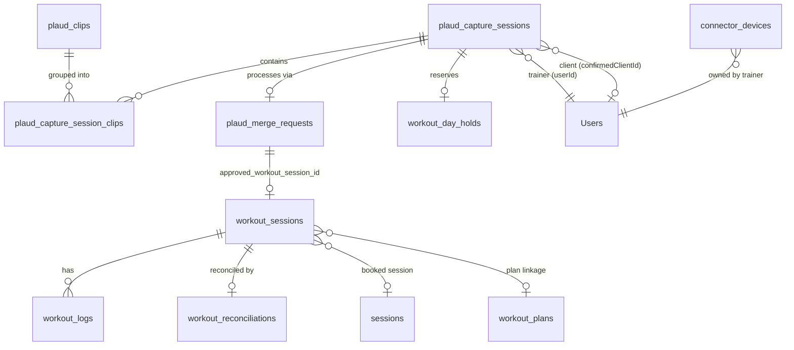
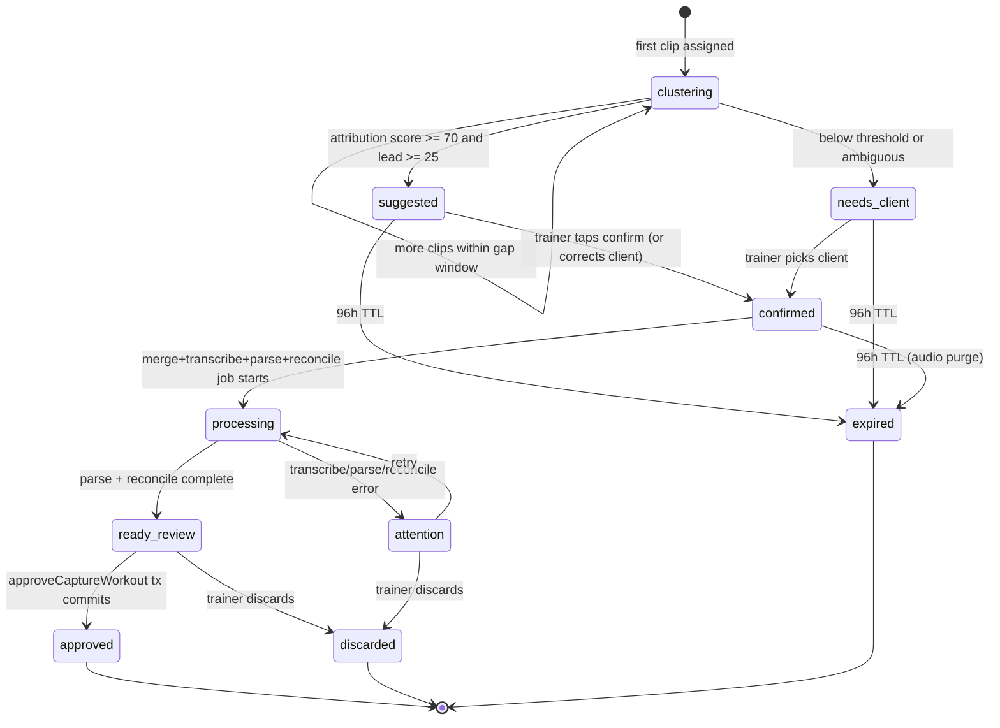
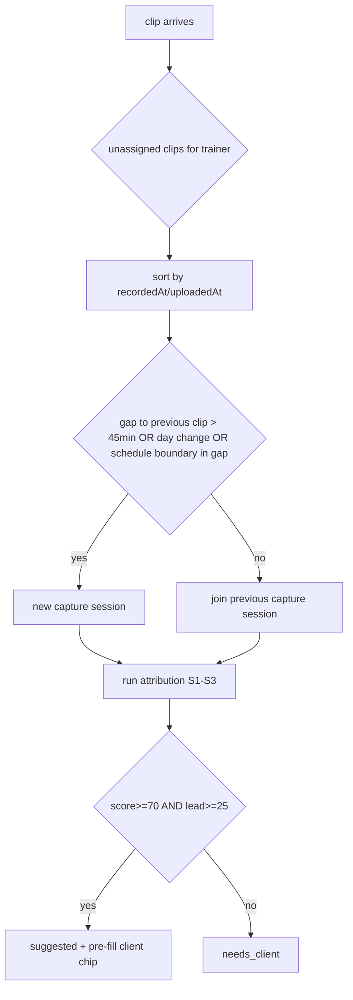

# PLAUD Auto-Ingest Rebuild — Hostile Review + Zero-Decision Blueprint

**Date:** 2026-09-01 · **Author:** Claude Fable 5 (Final Decider) · **Owner:** Sean
**Ground truth basis:** working tree at `wip/comms-notifications-2026-07-05@99f57cb` — PLAUD backend verified byte-identical to `origin/main` except 9 lines in `plaudMergeController.mjs` (git diff run 2026-09-01). Three full codebase maps (backend pipeline, frontend surfaces, plan/schedule data model) executed this session with file:line evidence.

**What this document is:** the complete build spec for Sean's vision — *trainers record all day on PLAUD or any device; recordings auto-upload; Swan sorts clips to the right client automatically (including start/stop re-records); parsed numbers reconcile against that day's already-planned workout; everything lands behind an approval gate; the trainer writes nothing.* A builder AI executing this document makes **zero design decisions**. Every choice is made here, with the reason recorded. If a builder believes a decision is missing, that is a defect in this document — stop and report it; do not improvise.

---

## Part 0 — How a builder uses this document

1. Build in slice order (Part 14). Slices are independently shippable; do not merge slices.
2. Every slice has acceptance criteria and named test files. Tests are written first (failing), then implementation (project TDD/bugfix standard).
3. Rules that bind every slice: no MUI (R1), 44px targets (R2), tokens-with-fallback (R6), 300-line file cap (R4), Victory-only charts (R10), zero PII to LLMs (R8), styled-components `css` helper for shared fragments (R43), pre-push backend audit (R42), proof-before-done (R73).
4. `[VERIFIED]` claims below were confirmed by direct file reads this session. `[LIKELY]` claims require the Slice 0 probes before code that depends on them lands.
5. All file paths are repo-relative. Line numbers are as of `99f57cb` / `origin/main` (identical for the PLAUD tree).

---

## Part 1 — Hostile review of the ChatGPT audit

Overall: the GPT audit is a competent **operations** read (connector state, CLI vs Applaud, soft-hold concept, seven follow-up scenarios) with the right UX instinct. But it audited the plumbing and missed the product: the two capabilities Sean actually asked for — automatic clip→client attribution and planned-vs-actual reconciliation — do not exist in the codebase at all, and the GPT plan neither detects their absence as the headline gap nor specifies how to build them. It also missed the two worst code defects on the approval path. Its 68/100 "C-" grades the wrong axis: the plumbing it graded 78 is where the ship-blocking bugs are.

### Findings register

| # | Severity | Finding | GPT verdict | Reality (evidence) |
|---|---|---|---|---|
| F1 | **CRITICAL** | Whole-merge approval writes a `workout_sessions` UUID into `approved_workout_form_id UUID REFERENCES daily_workout_forms(id)` → FK violation → 500 after the workout already committed → orphaned workout + merge stuck `completed` and re-approvable (double-log risk) | Called it a "residual atomicity risk" with compensating deletion | `[VERIFIED code]` `adminWorkoutLoggerController.mjs:127` (`formId: serviceResult.formId \|\| serviceResult.sessionId`); `workoutLogService.mjs` returns only `sessionId` (workout_sessions UUID, `WorkoutSession.mjs:26`); FK unconditional in `20260504100001-create-plaud-merge-requests.cjs` (`approved_workout_form_id UUID REFERENCES daily_workout_forms(id)`), never dropped. Runtime consequence `[LIKELY]` — Slice 0 probe P1 confirms |
| F2 | **CRITICAL** | Per-segment approvals (`source: 'plaud_merge_segment'`, sent by `PlaudMergeWorkspace.apply.ts:91`) never touch `plaud_merge_requests` — the string appears **nowhere in backend/** (`grep -rn plaud_merge_segment backend/` → 0 hits). Segment flow depends entirely on the standalone `/approve` endpoint, which sets no workout linkage | Not detected | `[VERIFIED]` grep run 2026-09-01; `adminWorkoutLoggerController.mjs:64` gates on exact `'plaud_merge'` |
| F3 | **HIGH** | GPT frames the system as "a single-owner Swan ingestion flow" and advises against multi-account support — but Sean's stated vision is **all trainers** recording on their own devices. The current connector is one PLAUD login on one Windows machine with one Swan identity | Recommends against Team plan; never surfaces the contradiction | Vision statement (this session); connector design `swan-plaud-official-sync.mjs` single `SWAN_AUTH_TOKEN`, single CLI login |
| F4 | **HIGH** | Automatic clip→client attribution does not exist and GPT's "ABC" mock shows a "Suggested client" field with **no mechanism behind it**. `plaud_clips.client_id` is never written by any code path; the resolver file header explicitly forbids parser-chosen clients (`PlaudClientResolver.tsx:15-17`); the boundary detector only warns, never suggests | Not identified as the core gap | `[VERIFIED]` backend map: writes to `plaud_clips.client_id` = zero; frontend map: resolver is manual search only |
| F5 | **HIGH** | Planned-vs-actual reconciliation does not exist anywhere. `workout_sessions.workoutPlanId/workoutPlanDayId/sessionId` are never populated by the PLAUD lane (`workoutLogService.mjs:356-367`); adherence was designed into the 2025 NASM migration comments and abandoned; GPT's C-stage logs a free-standing workout | Not addressed; its flow ends at "save workout" | `[VERIFIED]` plan-model map §5; `migrations/20250503-create-nasm-tables.mjs:103,180` |
| F6 | **HIGH** | Rule 8 egress: raw, **unredacted** merged audio (spoken client names, health talk) goes to Google Gemini for transcription with no consent gate — `voiceTranscriptionService.mjs` and `plaudMergeController.mjs` contain zero consent references, while a consent framework exists (`aiEligibilityHelper.mjs`, `AiConsentLog`, `WaiverConsentFlags`) and guards other AI lanes. The parser leg IS redacted (`workoutLogParserService.mjs:433`) — the transcription leg is the hole | Silent; recommends "Swan performs its own processing" with no egress framing | `[VERIFIED]` greps this session; 2026-08-18 learning packets (six binary egress points; subject-scoped consent gate) |
| F7 | MEDIUM | Connector 401 root cause: the Node agent reads `SWAN_AUTH_TOKEN` **once** (`swan-plaud-official-sync.mjs:254`) and loops forever with the captured value; no 401 handler, no refresh; the only refresh logic is in PowerShell and runs pre-start. GPT says "needs durable authentication repair" but prescribes nothing. The correct fix is a scoped device token, not user-JWT refresh plumbing (Part 9) | Detected symptom, no root cause, no fix | `[VERIFIED via map]` `runLoop` :269-289 reuses captured token; `isPlaudAuthFailure` :118 covers PLAUD CLI only |
| F8 | MEDIUM | 24-hour TTLs kill the day-batch workflow: clips expire and are **deleted from disk and R2** after `PLAUD_CLIP_TTL_HOURS` (24) and cipher payloads purge after 24h — "record all day, review tomorrow evening" loses the audio before approval | Not detected | `[VERIFIED via map]` `plaudCronJobs.mjs:144-163`, migration default `NOW() + INTERVAL '24 hours'` |
| F9 | MEDIUM | Duplicate-date guard (one `workout_sessions` per client per day, `workoutLogService.mjs:343-353`) turns the legitimate "client already has a log today" case into a 409 dead end. GPT's soft-hold proposal is good (adopted, Part 6) but it never resolves the append/two-a-day case | Partial (soft hold only) | `[VERIFIED via map]` |
| F10 | LOW | GPT's UI numbers (72/41 buttons) are unverifiable snapshots, but the direction is right — and understated. Measured: **~95-100 distinct labels/concepts** on the trainer surface, raw enum pills (`CIPHER PURGED`, `pending merge`), and up to 20 raw error codes rendered verbatim (`plaudSafeErrorText.ts:8-29`) | Directionally right | `[VERIFIED]` frontend map §8 |
| F11 | LOW | Surface sprawl is worse than GPT reported: 4 live mounts of the same engine + `/dashboard/plaud-merge` mounted **twice** (`main-routes.tsx:845`, `DashboardRoutes.tsx:57`) + an orphaned `CoachCommandOverview.tsx` imported nowhere + two independent intake read-models (`/api/plaud/intake` vs `/api/coach/intake/queue`) with competing vocabularies and two separate "next best move" engines | Found `/dashboard/plaud-merge` only | `[VERIFIED]` frontend map §1, §3 |
| F12 | CONFIRM | Unpinned CLI: `npx --yes @plaud-ai/cli` resolves latest on every run and output is screen-scraped | GPT caught this — **credit** | `[VERIFIED via map]` `swan-plaud-official-sync.mjs:20` |
| F13 | CONFIRM | PLAUD-side merges duplicate content (originals + merged both sync); Swan must be sole merge authority or suppress lineage | GPT caught this — **credit** | Adopted (Part 9, connector rule C6) |
| F14 | CONFIRM | Test infrastructure defects: a backend "unit" test writes to the production-parity DB; frontend `node_modules` missing declared Vitest/Vite packages | GPT caught these — **credit** | Carried into Slice 0 |

**Verdict on the GPT plan:** adopt its ABC surface concept, its collapsed vocabulary, its soft-hold concept, its CLI-over-Applaud decision, its no-subscription decision, and its seven hostile test scenarios. Reject its scope (single-owner), its grade weights, and its implicit claim that the remaining work is UI simplification — the remaining work is two missing engines and a broken approval seam.

---

## Part 2 — Vision contract (what Sean asked for, as testable requirements)

| ID | Requirement | Source |
|---|---|---|
| R1 | Any trainer (Sean or staff) records freely all day on PLAUD **or any recording device**; recordings reach Swan with zero manual writing | Sean 2026-09-01 |
| R2 | Swan automatically sorts the day's recordings: which clips belong to which client — including repeated start/stop re-records of the same client's session | Sean: "extremely important" |
| R3 | Workouts are pre-planned; the recording captures the numbers actually hit | Sean: "one coach is already supposed to have plans" |
| R4 | Captured numbers are compared against that day's planned workout and logged against the plan for that day | Sean: "tied in to go against what was already the planned workout" |
| R5 | Nothing commits without approval — Sean's/trainer's gate stands even though the pipeline is automatic | Sean: "a gate for my approval" |
| R6 | The whole flow is minimal-click and phone-usable (one-handed approval) | Standing least-clicks mandate |
| R7 | Approved numbers feed the real progress charts (Data-truth rule) | Product Core Loop |
| R8 | Client audio/PII never leaves without consent; approval and holds are auditable | Rule 8 + consent framework |

---

## Part 3 — Keep / Rebuild / Retire (the destroy-and-rebuild ruling)

Sean authorized full destruction. The Final-Decider ruling is: **destroy the workflow layer and the surfaces; keep the substrate.** The substrate (upload, idempotency, dual-tier storage, AES-GCM cipher, merge locks, cron TTL machinery, ffmpeg merge) survived multiple Codex hostile rounds and works; rebuilding it re-runs risk for zero product gain. Everything the trainer touches, and everything between "clip stored" and "workout saved," is rebuilt.

| Component | Ruling | Why |
|---|---|---|
| Upload route + idempotency + rate limit (`plaudClipsRoutes.mjs`, `plaudUploadIdempotencyService.mjs`) | **KEEP** | Proven; dedupe keyed `(userId, clipSource, clipExternalId)` with DB backstop is correct |
| Dual-tier storage + R2 mirror worker + cipher service | **KEEP** | Correct pattern; retention *policy* changes (Part 6) |
| Merge engine (ffmpeg normalize/concat, lock service, atomic finalization tx inside `plaudMergeController`) | **KEEP** | The in-controller tx is actually well-guarded; the broken seam is downstream in `adminWorkoutLoggerController` |
| Transcription (Gemini Flash + fitness vocab bias) + parser (`workoutLogParserService`) | **KEEP + GATE** | Engine works; add consent gate before egress (Part 12) |
| Approval seam (`adminWorkoutLoggerController.mjs:100-156`) | **REBUILD** | F1 + F2; replaced by one-transaction `approveCaptureWorkout` service (Part 8) |
| Client attribution | **BUILD NEW** | Does not exist (F4) — Part 7 |
| Plan reconciliation | **BUILD NEW** | Does not exist (F5) — Part 8 |
| Connector (`swan-plaud-official-sync.mjs` + PS launchers) | **REBUILD** | F7 + F3 + F12 — Part 9 |
| Applaud webhook + local sync (all `APPLAUD_*`) | **RETIRE** | Dormant, superseded; keep code dormant behind its fail-closed flag for one release, then delete (Slice 11) |
| Trainer surface (`PlaudIntelligenceWorkspacePage`), admin embed, `/dashboard/plaud-merge` (×2 mounts), `CoachCommandOverview.tsx` | **REBUILD → 1 surface/role** | F10 + F11 — Part 11 |
| Intake read-models (both) | **REBUILD → 1** | Two competing vocabularies; capture-session-based v2 (Part 10) |
| Swan Coach PLAUD commands (read/propose-only) | **KEEP** | Already correctly gated; repoint reads at capture sessions in Slice 11 |

---

## Part 4 — Target architecture

```mermaid
flowchart LR
  subgraph capture [Capture — any trainer, any device]
    P[PLAUD device] --> PC[PLAUD cloud]
    PC --> CONN["Connector v2 (per-trainer)\nPinned CLI + device token"]
    PHONE[Phone / any recorder] --> GU["Generic upload\n(existing UI or share-sheet)"]
  end

  subgraph swan [Swan backend]
    CONN -->|POST /api/plaud/clips/upload\nX-Swan-Device-Token| UP[Upload + idempotency + storage KEEP]
    GU --> UP
    UP --> CS["Capture-session clustering\n(time-gap + day boundary)"]
    CS --> ATT["Attribution engine\nschedule x transcript x plan x continuity"]
    ATT -->|score >= 70 and lead >= 25| SUG[status: suggested]
    ATT -->|else| NC[status: needs_client]
    SUG --> CONF{Trainer confirms client+date}
    NC --> CONF
    CONF --> HOLD[Day hold created]
    CONF --> TR["Consent gate -> Gemini transcribe\n-> redact -> parse KEEP+GATE"]
    TR --> REC["Reconciliation engine\nplanned vs actual diff"]
    REC --> REV[status: ready_review]
  end

  subgraph approve [Approval gate]
    REV --> UI["Approve surface\nplanned vs actual, one screen"]
    UI -->|approve| TX["approveCaptureWorkout\nONE transaction"]
    TX --> WS[(workout_sessions + workout_logs\n+ plan linkage columns)]
    TX --> RC[(workout_reconciliations)]
    TX --> ADV[Plan cursor advance - existing service]
    WS --> CH[Progress charts - free, existing join]
  end
```



Data-flow invariants (builder must preserve):
- I1: No write to `workout_sessions`/`workout_logs` ever happens outside `approveCaptureWorkout` for capture-sourced workouts.
- I2: Attribution NEVER auto-confirms. `suggested` is a UI pre-fill; a human tap moves it to `confirmed`. (Preserves the resolver's existing doctrine and R5.)
- I3: Audio bytes reach Google only after the consent gate passes for the **confirmed** client (consequence: transcription runs after client confirmation, not before — see Part 7 note on attribution without transcripts).
- I4: Every state transition writes an audit row (existing pattern: audit logs) with actor, before/after, capture-session id.

---

## Part 5 — Data model



### 5.1 New table `plaud_capture_sessions` (migration `20260901-01`)
| Column | Type | Notes |
|---|---|---|
| id | BIGINT PK autoincrement | |
| capture_session_id | UUID unique NOT NULL | external id |
| user_id | INT NOT NULL → "Users" | the **trainer** who recorded |
| suggested_client_id | INT NULL → "Users" | attribution output; never trusted |
| confirmed_client_id | INT NULL → "Users" | set only by human action |
| capture_date | DATEONLY NOT NULL | derived from earliest clip `recorded_at` (fallback `uploaded_at`), **in the trainer's timezone** (store tz used in `attribution` JSON) |
| status | VARCHAR(24) NOT NULL | enum in Part 6 |
| attribution | JSONB | full signal breakdown: `{signals: {schedule, transcript, planShape, continuity}, scores: [{clientId, score}], threshold, leadMargin, tz}` |
| merge_request_id | UUID NULL → plaud_merge_requests | set when processing starts |
| created_at / updated_at | TIMESTAMPTZ | |
| expires_at | TIMESTAMPTZ NOT NULL DEFAULT NOW() + INTERVAL '96 hours' | retention (F8 fix) |

### 5.2 New column on `plaud_clips` (same migration)
`capture_session_id BIGINT NULL REFERENCES plaud_capture_sessions(id)` + index. Clustering assigns it; re-clustering allowed only while the capture session is `clustering|needs_client|suggested`.

### 5.3 New table `workout_day_holds` (migration `20260901-02`)
| Column | Type |
|---|---|
| id BIGINT PK · client_id INT NOT NULL → "Users" · hold_date DATEONLY NOT NULL · capture_session_id BIGINT NOT NULL → plaud_capture_sessions · created_by INT NOT NULL · created_at TIMESTAMPTZ · released_at TIMESTAMPTZ NULL | partial unique index on `(client_id, hold_date) WHERE released_at IS NULL` |

Semantics (GPT's soft-hold, adopted + completed): created at client-confirm; released at approve/discard/expire. The Workout Logger and Coach check holds and render a warning banner ("PLAUD review pending for this client/date — approving it will conflict with a manual log"). A hold **warns, never blocks** — admin can proceed (audited). This is deliberately advisory because an unassigned/misattributed recording must never lock the wrong client (GPT's own correct argument).

### 5.4 New table `workout_reconciliations` (migration `20260901-03`)
| Column | Type |
|---|---|
| id BIGINT PK · workout_session_id UUID NOT NULL UNIQUE → workout_sessions · workout_plan_id UUID NULL → workout_plans · assignment_key VARCHAR(96) NULL (`planId:wN:dM:type` — existing derived identity, `clientTrainingReadModelService.mjs:223-225`) · planned_snapshot JSONB NOT NULL · actual_snapshot JSONB NOT NULL · diff JSONB NOT NULL · adherence_score SMALLINT NULL (0-100) · suggested_adjustments JSONB NULL · created_at TIMESTAMPTZ | |

**Decision D-REC-1 (the biggest open question, decided):** we do **NOT** materialize dated planned-workout rows. The plan stays a cursor (`WorkoutPlan.currentWeek/currentDay` into `planData`); "planned for date Y" is resolved at reconciliation time through the existing read-model synthesis (`clientTrainingReadModelService.mjs:227-271`) and pinned by snapshotting it into `planned_snapshot`. Why: a dated materialization creates a second source of truth that drifts the moment a trainer edits the plan mid-week; the snapshot gives reconciliation immutability without forking plan authority. The existing `formData.plannedAssignment` validation service (`plannedWorkoutAssignmentLogService.mjs`) is reused as the identity check.

### 5.5 New table `connector_devices` (migration `20260901-04`)
| Column | Type |
|---|---|
| id BIGINT PK · device_id UUID unique · user_id INT NOT NULL → "Users" (trainer) · label VARCHAR(64) · token_hash CHAR(64) (SHA-256 of the secret; secret shown once at creation) · scopes JSONB DEFAULT '["plaud:upload"]' · last_seen_at TIMESTAMPTZ · revoked_at TIMESTAMPTZ NULL · created_at TIMESTAMPTZ | |

### 5.6 Repair migration `20260901-05` (F1 fix)
1. `ALTER TABLE plaud_merge_requests ADD COLUMN approved_workout_session_id UUID NULL REFERENCES workout_sessions(id);`
2. Backfill: none expected — Slice 0 probe P1 first runs `SELECT COUNT(*) FROM plaud_merge_requests WHERE approved_workout_form_id IS NOT NULL` (expected 0 given the FK bug; if >0, those rows predate the bug via the DailyWorkoutForm lane — copy them only if the UUID exists in `daily_workout_forms`).
3. Leave `approved_workout_form_id` in place, unused, for one release; drop in a follow-up migration after Slice 6 ships clean (Rule 34 — no blind cleanup).
All migrations are `.cjs`, reversible (`down` implemented), and reference `"Users"` (never `users`) per the dual-table gotcha.

---

## Part 6 — State machines

### 6.1 Clip (existing — unchanged, for builder reference)
`uploading → pending_merge → merged`, with `lost` (write failure / 5-min stale), `expired` (TTL), `deleted_at` soft delete. `[VERIFIED]` transitions table in backend map; do not modify.

### 6.2 Capture session (NEW)

Rules: re-clustering (moving a clip between capture sessions) is legal only in `clustering|needs_client|suggested`. `confirmed` creates the day hold. `approved|discarded|expired` release it. TTL: clips belonging to a capture session inherit the capture session's `expires_at` (96h default, `PLAUD_CAPTURE_TTL_HOURS`) — this **overrides** the 24h clip TTL and fixes F8; the TTL cron gains one predicate: skip clips whose capture session is not terminal.

### 6.3 Public status vocabulary (the ONLY words trainers see — adopted from GPT, extended)
`New → Needs client → Ready to approve → Approved` plus `Needs attention`. Mapping: `clustering|suggested`→New (suggested shows the pre-filled client chip), `needs_client`→Needs client, `ready_review`→Ready to approve, `attention|expired`→Needs attention, `approved`→Approved, `discarded`→(hidden, listed under History). Raw enums, `CIPHER PURGED`, error codes, and internal source labels **never render**; error codes map to plain sentences in one lookup file (rebuild of `plaudSafeErrorText.ts` — codes go to a `<details>` disclosure for support, not the primary line).

---

## Part 7 — Attribution engine (the "smart sort" — R2)

**Module:** `backend/services/plaudAttributionService.mjs` (NEW). Deterministic, local, zero egress, zero LLM. Pattern cloned from the existing client-name scoring ladder (`services/ai/clientResolver.mjs:21-95` — Levenshtein + ambiguity gate), which is the house-approved shape for this problem.

**When it runs:** on every clip arrival (after clustering assigns the clip to a capture session) and again when a capture session's membership changes. It scores **candidate clients = the trainer's active roster** (`client_trainer_assignments WHERE trainerId = :uploader AND status = 'active'` — note: `status`, there is no `isActive` column).

### Signals and weights (fixed; builder does not tune)
| Signal | Points | Computation |
|---|---|---|
| S1 schedule overlap | +50 | A `sessions` row for (trainer, candidate) whose `[sessionDate - 15min, endDate + 30min]` window contains the capture session's earliest `recorded_at`. Statuses counted: `scheduled|confirmed|completed`. If `recorded_at` is null on all clips (upload-time only), use `uploaded_at` and cap S1 at +30 |
| S1b same-day session | +25 | (only if no overlap hit) a session for (trainer, candidate) exists on `capture_date` |
| S2 filename/external hint | +20 | PLAUD recording title or original filename contains candidate first or full name (Levenshtein ≤ 2 per token; exact +20, fuzzy +12) |
| S3 continuity | +15 | The trainer confirmed an adjacent capture session (gap ≤ 15 min from this one's window) for the same candidate that day — start/stop re-records inherit their neighbor |
| S4 plan-shape | +20 | Available only post-parse (see note): parsed exercise names vs the candidate's synthesized today-assignment exercises — `+20 × (matched/planned)` rounded, using the exercise matcher (Part 8.2) |
| Negative: roster ambiguity | gate | If two candidates share a first name and only S2-fuzzy distinguishes them → force `needs_client` (clone of `clientResolver.mjs:231` ambiguity gate) |

**Decision thresholds:** `suggested` requires top score ≥ 70 **and** lead over runner-up ≥ 25. Otherwise `needs_client`. Both constants live in `plaudAttributionService.mjs` as named exports (tested, not env-tunable — tuning without evidence is drift).

**Ordering note (I3 consequence, decided):** transcripts don't exist before client confirmation (consent gate is per-client). So first-pass attribution uses S1/S1b/S2/S3 only — schedule is the dominant prior, which matches reality: coaches run booked sessions. S4 runs as a **post-parse verification**: after transcription+parse, if plan-shape match against the *confirmed* client scores 0 matched exercises AND another roster client's plan matches ≥ 50%, raise a `MISMATCH_WARNING` on the review card ("Parsed exercises match {other}'s plan better — verify client"). The existing transcript boundary detector (`clientNameBoundaryDetector.mjs`) stays as the second post-parse tripwire. This gives Sean the "smart enough" behavior without sending un-consented audio to Google and without ever auto-committing.

### Clustering (start/stop re-records — R2)
**Module:** `backend/services/plaudCaptureClusterService.mjs` (NEW — extracted evolution of `plaudClipGroupService.mjs:120-146`, which is read-only suggestions today). Same proven heuristic, now persisted:
- Sort trainer's unassigned clips by `recorded_at ?? uploaded_at`.
- New capture session when: gap > 45 min (tightened from 90 — a client session break; 90 min merged back-to-back clients in practice), or calendar day changes (trainer tz), or an S1 schedule boundary falls inside the gap (a new booked session started → cut even at < 45 min).
- No 5-clip cap (the old cap existed for the 5-clip merge API limit; capture sessions merge in batches of 5 under the hood — the ffmpeg merge engine's input contract is unchanged).
- Confidence marker preserved (`high|medium|low` per recordedAt coverage) and shown as a subtle dot, not a word.



---

## Part 8 — Reconciliation engine + the one-transaction approval

### 8.1 Prescription parser
**Module:** `backend/services/workout/prescriptionParserService.mjs` (NEW). Pure functions, no I/O. Parses `WorkoutPlanDayExercise` string prescriptions and `planData` JSONB exercise entries into `{sets: int|null, repsMin: int|null, repsMax: int|null, loadType: 'rpe'|'pct1rm'|'absolute'|null, loadValue: number|null, tempo: string|null, restSec: int|null}`:
- `setScheme` `"3x10"` → sets 3, repsMin/Max 10 · `"4x8-12"` → sets 4, 8–12
- `repGoal` `"8-12"` → 8–12 · `"AMRAP"` → repsMax null, flag `amrap: true`
- `intensityGuideline` `"RPE 8"` → rpe 8 · `"70% 1RM"` → pct1rm 0.70 · `"135 lb"` → absolute 135
- Unparseable → all-null + `raw` preserved; reconciliation renders "—" (never guesses).

### 8.2 Exercise matcher
**Module:** `backend/services/workout/exerciseMatchService.mjs` (NEW; replaces naive substring `exerciseLookup.mjs` for this lane — the old module keeps its current callers untouched, Karpathy surgical rule). Ladder, first hit wins:
1. exact `LOWER(name)` match against `"Exercises"` (UUID PK, `name` unique)
2. exact match against the **`aliases`** JSON column (exists, currently read by nothing — this is its purpose)
3. token-normalized match (strip `db/dumbbell`, `bb/barbell`, plural s, hyphens; bidirectional)
4. Levenshtein ≤ 2 on normalized full string, unique winner required (two candidates within distance 1 of each other → unmatched)
5. unmatched → keep free-text `exerciseName` (the `workout_logs.exerciseName` column is free text by design), flag `unmatchedExercise: true` in the diff so the review UI shows "not in catalog" — and queue the name into the existing `unmatchedExercises` reporting channel.

### 8.3 Reconciliation
**Module:** `backend/services/workout/workoutReconciliationService.mjs` (NEW).
Input: parsed workout (parser output shape `workoutLogParserService.mjs:19-26`) + confirmed client + capture date.
1. Resolve planned side: synthesize today-assignment via `clientTrainingReadModelService` for `capture_date`; if the client has no active plan/assignment for that date → reconciliation is `unplanned: true` (workout still approvable; diff section shows "No plan for this day — logging as unplanned session"). **No hard requirement of a plan** — Sean's trainers sometimes freestyle; the gate is approval, not planning bureaucracy.
2. Match exercises: planned×actual bipartite match via exerciseMatchService ids (fallback normalized-name equality).
3. Per matched exercise diff: `plannedSets vs actualSets`, `plannedRepRange vs actualReps per set`, `plannedLoad vs actualWeight`, statuses `met | over | under | missing | extra`.
4. `adherence_score` = round(100 × matchedPlannedExercises_completed / plannedExercises), null when `unplanned`.
5. `suggested_adjustments` (deterministic, trainer-approved only — trainer-indispensability doctrine: clients never decide, and neither does the pipeline):
   - every set of an exercise ≥ repsMax → `{type:'increase_load', pct: 5}`
   - any set < repsMin − 2 → `{type:'decrease_load', pct: 5}` or `{type:'hold'}` if RPE ≤ 7 recorded
   - planned exercise fully missing → `{type:'flag_skipped'}`
   Suggestions render as chips on the approve screen; they are **stored, never auto-applied to the plan**.

### 8.4 `approveCaptureWorkout` — the single transaction (F1+F2 fix)
**Module:** `backend/services/workout/approveCaptureWorkoutService.mjs` (NEW). Replaces the `adminWorkoutLoggerController.mjs:100-156` seam. One `sequelize.transaction` wrapping ALL of:
1. Re-validate: capture session `ready_review`, actor owns it or admin, active trainer-client assignment.
2. `logWorkoutForClient(..., { transaction })` — **change to the existing service:** it gains an optional `transaction` param; when provided it joins instead of opening its own (backward compatible — all current callers pass nothing). It also gains optional `workoutPlanId`, `workoutPlanDayId`, `bookedSessionId` params which it writes to the columns that exist and are null today (`WorkoutSession.mjs:132-185`).
3. Duplicate-date handling (F9, decided): if `DUPLICATE_DATE` and caller passed `mode: 'append'` → instead of insert, load the existing day's `workout_sessions` row and `WorkoutLog.bulkCreate` the new rows onto it (recompute totals); the approve UI offers exactly two buttons on conflict: **Append to today's log** / **Discard this recording**. One-per-day stays the invariant; append is the two-a-day answer.
4. Insert `workout_reconciliations` row.
5. Update `plaud_merge_requests`: `status='approved', approved_workout_session_id=:sessionId, approved_at=NOW(), cipher purge`.
6. Update capture session → `approved`; release the day hold.
7. Commit. Then (post-commit, best-effort, unchanged): XP award, plan cursor advance via existing `advancePlanAfterPlannedAssignmentLog` when `assignment_key` present.
`source` accepted values: `plaud_capture` (new), with `plaud_merge`/`plaud_merge_segment` kept as aliases routed into the same service during migration (F2 dies here).

```mermaid
sequenceDiagram
    participant UI as Approve screen
    participant API as POST /api/plaud/capture-sessions/:id/approve
    participant SVC as approveCaptureWorkoutService
    participant DB as PostgreSQL
    UI->>API: {mode?: 'append', overrides?: {date, exercises[]}}
    API->>SVC: approveCaptureWorkout(...)
    SVC->>DB: BEGIN
    SVC->>DB: validate capture/assignment/status
    SVC->>DB: workout_sessions + workout_logs (plan columns populated)
    SVC->>DB: workout_reconciliations
    SVC->>DB: plaud_merge_requests -> approved (approved_workout_session_id)
    SVC->>DB: capture_session -> approved; release day hold
    SVC->>DB: COMMIT (any failure = full rollback, nothing orphaned)
    SVC-->>API: {workoutSessionId, adherenceScore}
    SVC--)SVC: post-commit: XP, cursor advance (best effort, logged)
```

---

## Part 9 — Connector v2 (multi-trainer, unattended, self-healing)

**Replaces** the auth model of `scripts/plaud-official-sync/swan-plaud-official-sync.mjs`; the poll/ledger/upload skeleton is kept.

| Rule | Spec |
|---|---|
| C1 identity | Each trainer registers a **connector device** (Part 5.5) from their own dashboard (Settings → Recording sync): `POST /api/plaud/connector/devices` returns `{deviceId, token}` — token shown once. The connector authenticates every upload with `X-Swan-Device-Token`; a new middleware `connectorDeviceAuth.mjs` resolves it (SHA-256 compare, not timing-vulnerable string compare — use `crypto.timingSafeEqual`), rejects revoked, stamps `last_seen_at`, and sets `req.user` to the owning trainer with scope check. **No user JWT in the connector, ever** — this deletes the 401 class instead of patching it (F7) |
| C2 PLAUD account | One PLAUD account per trainer, logged into the CLI on that trainer's machine. The Swan device token binds uploads to the right trainer, which is what attribution needs. (F3 fix — no Team subscription required; N independent free/Starter accounts) |
| C3 pinning | `@plaud-ai/cli@<exact version>` pinned in a connector `package.json`; startup runs a compat smoke (`me` + `recent --days 1` parse check) and refuses to run on parse failure with a health-file error (F12) |
| C4 health | Connector writes `%LOCALAPPDATA%\SwanStudios\plaud-official-sync\health.json` (`{lastPollAt, lastUploadAt, lastError, consecutiveFailures}`) every cycle AND posts `POST /api/plaud/connector/heartbeat` (device-token-authed) every 15 min. The Sync card (Part 11 A-stage) reads `GET /api/plaud/connector/health` per trainer: `Connected` / `Needs attention (last seen 3h ago)` — the silent-death mode GPT flagged dies here |
| C5 failure | 401/403 from Swan → the token was revoked → connector exits nonzero after writing health error (Task Scheduler restarts it; it fails fast and visibly rather than looping silently). Network errors → existing per-cycle retry stays |
| C6 lineage | Skip PLAUD-side merged recordings when their component ids are already in the ledger (PLAUD keeps originals after merge — F13): the CLI `recent` parse records ids; a merged item whose duration ≈ sum of ≥2 already-uploaded items within its window is uploaded but tagged `clipExternalId` suffix `:merged` and the intake dedupe drops it if components exist. Swan is the sole merge authority |
| C7 any-device | Non-PLAUD devices use the existing generic upload (5 files/batch, 11 audio mimetypes) — already live. A phone share-sheet PWA target is Slice 13 (optional, post-core) |

State ledger, 5-min poll, dedupe key `(userId,'plaud_official_sync', recordingId)`, DPAPI local storage: all kept as-is.

---

## Part 10 — API contract (complete)

Existing endpoints kept: clip upload/list/audio/delete, merge, merge-requests list/detail/discard (paths in frontend map §4). New/changed:

| Method + path | Auth | Body → Response |
|---|---|---|
| `GET /api/plaud/capture-sessions?scope=new\|needs_client\|ready\|attention\|history&limit&cursor` | trainer/admin | → `{items: [{captureSessionId, status, publicStatus, captureDate, clipCount, durationSec, suggestedClient: {id, displayName, confidence} \| null, confirmedClient, holdActive, adherencePreview}], nextCursor}` |
| `GET /api/plaud/capture-sessions/:id` | owner/admin | → detail: clips (chronological, playable), attribution breakdown (per-signal, for the disclosure panel), transcript (post-parse, decrypted on demand), parsed exercises, reconciliation diff, warnings (`MISMATCH_WARNING`, boundary, duplicate-date) |
| `POST /api/plaud/capture-sessions/:id/confirm` | owner/admin | `{clientId, captureDate?}` → 200; creates day hold; enqueues process job. 409 `HOLD_CONFLICT` if another live hold exists for client+date (response includes the other capture id) |
| `POST /api/plaud/capture-sessions/:id/clips` | owner/admin | `{add: [clipId], remove: [clipId]}` — re-cluster while non-terminal; 409 `CAPTURE_LOCKED` otherwise |
| `POST /api/plaud/capture-sessions/:id/approve` | owner/admin | `{mode?: 'append', dateOverride?, exerciseOverrides?}` → `{workoutSessionId, adherenceScore, appended: bool}`; 409 `DUPLICATE_DATE` when no mode and a workout exists (UI then shows the two-button choice) |
| `POST /api/plaud/capture-sessions/:id/discard` | owner/admin | → 200; releases hold; schedules cipher/audio purge |
| `POST /api/plaud/connector/devices` | trainer/admin (interactive JWT) | `{label}` → `{deviceId, token}` (once) |
| `DELETE /api/plaud/connector/devices/:deviceId` | owner/admin | revoke |
| `POST /api/plaud/connector/heartbeat` | device token | `{version, lastError?}` → 204 |
| `GET /api/plaud/connector/health` | trainer/admin | → `{devices: [{deviceId, label, lastSeenAt, state: 'connected'\|'stale'\|'revoked', lastError}]}` |
| `GET /api/workout-day-holds?clientId&date` | trainer/admin | → hold rows (consumed by Workout Logger banner) |

All new routes: behind `PLAUD_MERGE_ENABLED`, `protect`+`authorize(['admin','trainer'])` except device-token routes, rate limits mirroring existing ones, error codes mapped to plain-language strings in the single lookup file. `/api/plaud/intake` (both old read-models) is superseded by `capture-sessions` and retired in Slice 11 alongside its consumers.

---

## Part 11 — UI/UX rebuild (ABC, one surface per role)

**Route plan:** trainer `/dashboard/trainer/plaud` and admin coach-assistant `workspace=plaud` keep their URLs but render the new `CaptureFlowWorkspace` (new component tree under `frontend/src/components/CaptureFlow/`, styled-components, Crystalline tokens with fallbacks, alpha via `color-mix` — no raw rgba glow constants). Retired: `/dashboard/plaud-merge` (both mounts → redirect to the trainer surface preserving `?clientId`), `CoachCommandOverview.tsx` (deleted — orphan), `PlaudClipMerge/*` tree (deleted after Slice 10 ships; git history preserves it), both old intake read-model consumers.

**Vocabulary on screen:** ONLY the Part 6.3 public statuses + client names + dates + exercise data. Zero of the 95-label inventory survives except `Approve`, `Discard`, `Refresh`.

### A — Sync (top strip, trainer home + capture surface)
```
┌──────────────────────────────────────────────────┐ 414px
│  ● Recording sync — Connected                    │   green dot / amber "Needs attention"
│  Last upload 4:12 PM · 6 new recordings today    │
│  [ Fix connection ]           (only when broken) │   44px, deep-links device re-register
└──────────────────────────────────────────────────┘
```

### B — Review (the queue; default tab)
```
┌──────────────────────────────────────────────────┐
│  Today                                           │
│ ┌──────────────────────────────────────────────┐ │
│ │ ▶ 3 clips · 41 min · 9:05–10:02 AM           │ │  chronological chips
│ │ Suggested: Marcus R.  ●high      [Confirm ✓] │ │  one-tap confirm = R6
│ │                        [Change client]        │ │
│ └──────────────────────────────────────────────┘ │
│ ┌──────────────────────────────────────────────┐ │
│ │ ▶ 2 clips · 18 min · 11:10–11:31 AM          │ │
│ │ Needs client            [Choose client]       │ │  search list (existing resolver UX)
│ └──────────────────────────────────────────────┘ │
│  Ready to approve (2)  ──────────────  [open →]  │
│  Needs attention (1)   ──────────────  [open →]  │
└──────────────────────────────────────────────────┘
```
Confirm asks nothing else when the date is unambiguous; date chip is editable inline. A "why this suggestion" disclosure (▸) opens the per-signal breakdown — trust is built by showing the schedule/name/continuity evidence, not by hiding it.

### C — Approve (one screen per capture session)
```
┌──────────────────────────────────────────────────┐
│  Marcus R. · Mon Sep 1 · 41 min       [▶ audio]  │
│  Plan: Phase 2 · Week 3 · Day 2   Adherence 84%  │
│ ┌────────────── Planned → Actual ──────────────┐ │
│ │ Goblet Squat      3×10 @RPE8 → 3×10 ✓ met    │ │
│ │ DB Bench Press    4×8-12     → 4×12 ▲ over   │ │  ▲ chip: "+5% load next time?"
│ │ Split Squat       3×12       → 2×12 ▼ under  │ │
│ │ Plank             3×45s      → — missing      │ │
│ │ Face Pull (extra) —          → 3×15 + extra  │ │
│ └──────────────────────────────────────────────┘ │
│  ▸ Transcript evidence   ▸ Warnings (0)          │
│ ┌───────────────────────┐ ┌────────────────────┐ │
│ │   Approve workout ✓   │ │  Needs correction  │ │  both ≥44px, thumb-reach
│ └───────────────────────┘ └────────────────────┘ │
└──────────────────────────────────────────────────┘
```
`Needs correction` opens inline per-set editing (reps/weight steppers — the current UI's read-only confirm-or-discard is replaced; a wrong parsed weight must be a 2-tap fix, not a discard-and-rerecord). On `DUPLICATE_DATE`: modal with exactly `Append to today's log` / `Discard this recording`. Unplanned day renders the actuals table alone with an "Unplanned session" pill. Suggested-adjustment chips are informational; tapping one queues it into the plan editor as a draft for the trainer — never auto-applies.

**Admin extra (embedded in coach-assistant):** the same three stages across all trainers, plus a per-trainer connector health table and the hold list. Nothing else — Intake/Audio/Drafts triple-card chrome dies.

**Responsive/motion:** audit at 320/375/414/768/1024/1440/2560×1440/3840×2160; low-motion data-card rules (house card standard); `prefers-reduced-motion` honored; design passes through `swan-design-router` at build time (Rule 40) with this Part as the ideation input — this is a working surface, Mobbin-lane, not a cinematic-journey surface.

---

## Part 12 — Security & privacy posture

| Control | Spec |
|---|---|
| Consent gate on audio egress (F6) | Before any transcription call, `assertAiEligibility` (`backend/services/ai/aiEligibilityHelper.mjs` — existing role×consent matrix: trainer+no-consent = deny, admin+no-consent = allow-with-audited-override) runs for the **confirmed client**; result + `consentSource` written to `AiConsentLog`. No confirmed client → no egress, ever (why transcription is post-confirmation, I3). The review card for a no-consent client shows "Transcription unavailable — {client} has not consented to AI processing" with the clips still playable (human can log manually from audio) |
| Redaction | Parser-leg regex redaction stays (`workoutLogParserService.mjs:433`); transcription-leg exposure is governed by consent above (redaction of raw audio is impossible — consent is the control, stated honestly) |
| At rest | Transcript/parse payload stays AES-256-GCM (existing cipher service). NEW: R2 mirror writes gain SSE headers if bucket supports; raw audio on disk stays 0600; capture-session TTL purges audio at `expired` exactly as the clip TTL does today |
| Device tokens | SHA-256 hashed at rest, `timingSafeEqual` compare, scope-checked (`plaud:upload` cannot call any other API), revocable per device, `last_seen_at` audited. Token creation/revocation writes audit rows |
| Approval audit | Every confirm/approve/discard/override writes the existing audit-log pattern with actor + capture id + before/after (I4) |
| Holds | Advisory-not-blocking with audited override (Part 5.3) — prevents both the lost-update anomaly and the wrong-client-lock hazard |
| Kill switches | `PLAUD_MERGE_ENABLED` (everything), `PLAUD_CAPTURE_PIPELINE_ENABLED` (NEW — clustering/attribution/process jobs; off = clips land and wait, zero automation), connector dies on revocation (C5). Both flags default **off** in prod until Slice 12 sign-off |

---

## Part 13 — Test plan

**Prerequisite fixes (Slice 0):** quarantine the prod-DB-writing "unit" test behind an explicit `INTEGRATION_DB=1` guard (F14); repair frontend `node_modules` (`cd frontend && npm ci`) so vitest runs; add the missing-deps check to CI notes.

### Unit (vitest / node — new files)
| File | Proves |
|---|---|
| `backend/tests/unit/plaudCaptureClusterService.test.mjs` | 45-min gap cut; day-boundary cut; schedule-boundary cut; recordedAt-null fallback ordering; re-cluster legality by status; no-cap grouping |
| `backend/tests/unit/plaudAttributionService.test.mjs` | each signal in isolation (fixture roster+sessions); threshold edge 69/70; lead edge 24/25; same-first-name ambiguity → needs_client; empty schedule day → needs_client; continuity inheritance; S1 cap at +30 without recordedAt |
| `backend/tests/unit/prescriptionParserService.test.mjs` | "3x10", "4x8-12", "8-12", "AMRAP", "RPE 8", "70% 1RM", "135 lb", garbage → nulls+raw |
| `backend/tests/unit/exerciseMatchService.test.mjs` | exact, alias-column hit, "db incline press"→"Dumbbell Incline Press" normalization, Levenshtein unique-winner, two-close-candidates → unmatched |
| `backend/tests/unit/workoutReconciliationService.test.mjs` | full-met diff; over/under/missing/extra statuses; unplanned day; adherence math; suggested-adjustment rules (top-of-range → +5%; sub-min with low RPE → hold) |
| `backend/tests/unit/approveCaptureWorkoutService.test.mjs` | **atomicity: injected failure at each of steps 2–6 rolls back everything (no orphan workout)** — the F1 regression test; plan columns populated; append mode merges rows + recomputes totals; re-approve idempotence (second call 409, no second workout); segment-alias source routes correctly (F2 regression); hold released on approve and discard |
| `backend/tests/unit/connectorDeviceAuth.test.mjs` | valid/revoked/unknown token; scope enforcement; timing-safe compare used; heartbeat stamps last_seen |
| `scripts/plaud-official-sync/__tests__/connector.test.mjs` | 401 → nonzero exit + health.json error; pinned-CLI compat smoke failure refuses start; lineage suppression (C6) |
| `frontend/src/components/CaptureFlow/__tests__/*` (per component) | public vocabulary only (assert forbidden strings `CIPHER PURGED`, `pending_merge`, raw codes never render); confirm one-tap; conflict modal two options; inline set editing; suggested chip + disclosure panel |

### Integration (DB-backed, `INTEGRATION_DB=1`)
| File | Proves |
|---|---|
| `backend/tests/integration/plaudCaptureE2E.test.mjs` | upload 3 clips → cluster → attribute (fixture schedule) → confirm → hold exists → process (transcribe/parse mocked at service seam) → reconcile → approve → workout_sessions + workout_logs + workout_reconciliations rows correct, plan columns set, charts query (`workout_logs JOIN workout_sessions`) returns them; FK on `approved_workout_session_id` satisfied |
| `backend/tests/integration/plaudConsentGate.test.mjs` | no-consent client: zero transcription-service invocations (spy), review card state `consent_blocked`; admin override path audited |
| `backend/tests/integration/workoutDayHolds.test.mjs` | hold uniqueness partial index; logger warning payload; advisory override write |

### E2E (Playwright, staging) — the GPT seven, adopted + extended
reboot/wake connector recovery · expired-then-revoked device token (fails fast + health card) · >20 MB recording (clean per-file error, batch continues) · six short start/stop clips → one capture session · PLAUD-side merge before sync (no duplicate content) · manual workout logged during pending review (hold warning + append flow) · one-handed phone approval at 414px · no-consent client · unplanned-day approval · wrong-suggestion correction (change client, re-attribution audit row).

---

## Part 14 — Build slices (execute in order; each independently shippable)

| # | Slice | Contents | Acceptance |
|---|---|---|---|
| 0 | **Truth probes + test hygiene** | Probe P1: staging/prod-parity DB — attempt whole-merge approve on a fixture; confirm F1 FK violation and count `approved_workout_form_id NOT NULL` rows. Probe P2: confirm PLAUD-lane consent absence at runtime (spy). Quarantine prod-DB test; `npm ci` frontend; record baselines (Rule 56) | Probe reports in-thread; suites runnable |
| 1 | **Approval seam fix** | Migration 20260901-05; `approveCaptureWorkoutService` (works against existing merge-requests before capture sessions exist — accepts mergeRequestId); route `plaud_merge` + `plaud_merge_segment` sources into it; delete controller seam :100-156 | F1+F2 regression tests green; existing 29 PLAUD tests green |
| 2 | **Consent gate on egress** | Wire `assertAiEligibility` + `AiConsentLog` ahead of `voiceTranscriptionService` call in the merge pipeline | Consent integration tests green; audited override path proven |
| 3 | **Capture sessions + clustering** | Migrations 01+02; cluster service; TTL predicate change (96h inherit) | Cluster unit tests green; TTL cron respects capture retention |
| 4 | **Attribution engine** | Service + scoring + capture-sessions list/detail/confirm/clips APIs; hold table (migration 02→03) + logger warning banner | Attribution unit + holds integration green |
| 5 | **Reconciliation engine** | Prescription parser, exercise matcher, reconciliation service, migration 03 (reconciliations) | All three unit suites green |
| 6 | **Approve v2** | approve/discard endpoints on capture sessions; append mode; plan-linkage columns; cursor advance; post-parse S4 mismatch warning | plaudCaptureE2E green; adherence renders |
| 7 | **Connector v2** | Device registry + token auth middleware + heartbeat/health APIs; connector script rebuild (pin, 401-exit, health, lineage) | Connector tests green; kill a token → health flips within 15 min |
| 8 | **UI A+B** | CaptureFlow workspace: sync strip + review queue + confirm/change-client; mounted at both role routes | Vocabulary tests green; 414px audit |
| 9 | **UI C** | Approve screen: planned-vs-actual table, inline correction, conflict modal, adjustment chips | E2E approval scenarios green; design dual-pass run |
| 10 | **Surface retirement** | Redirect `/dashboard/plaud-merge`; delete orphan + old `PlaudClipMerge/*` + old intake read-model consumers; Coach commands repointed | Grep proves zero imports of retired tree; redirects live |
| 11 | **Applaud retirement + intake API removal** | Remove `/api/plaud/intake` v1 + webhook code + `APPLAUD_*` scripts (separate cleanup pass, Rule 37, Sean-approved file list) | Rule 34 grep evidence in the cleanup doc |
| 12 | **Flag flip + phase audit** | Enable `PLAUD_CAPTURE_PIPELINE_ENABLED` in prod; run the E2E ten; write the Rule 48 audit record | Audit record landed; Sean sign-off |
| 13 | *(optional)* **Any-device PWA share-sheet** | Phone → share audio → Swan upload target | Deferred until 0–12 shipped |

Per-slice gates: failing-test-first, hostile pass (Rule 61), Gemini+Codex review (Rule 46 order, Fable arbitration), Tier-A with baseline disclosure, batch-push cadence (Rule 70). Slices 1–2 are production-risk fixes and may ship ahead of the rest.

---

## Part 15 — Rollback & kill switches

- `PLAUD_CAPTURE_PIPELINE_ENABLED=false` → clips still ingest and store; zero automation; old behavior reachable until Slice 10.
- `PLAUD_MERGE_ENABLED=false` → whole feature 503s (existing, unchanged).
- Per-device revocation kills a single trainer's connector without touching others.
- Migrations 01–04 are additive (new tables/columns) — `down` drops them cleanly; migration 05 leaves the old column in place until the follow-up drop, so rollback is a no-op.
- Git: each slice is one commit on its branch; revert by slice.

## Part 16 — KPIs & future review hooks

**KPIs:** attribution acceptance rate (suggested→confirmed unchanged) target ≥ 80% after 2 weeks · median clips-to-approved time · % workouts with reconciliation (vs unplanned) · connector uptime (heartbeat gaps) · approval taps (target: 2 taps happy path: Confirm ✓ → Approve ✓).

**Review hooks for the next hostile pass:** (1) attribution weights vs real acceptance data after 2 weeks — retune only with evidence; (2) 45-min gap constant vs real session breaks; (3) consent-override audit volume (admin overrides should be rare — frequent = consent capture UX is broken); (4) device-token scope creep — verify `plaud:upload` still can't reach any other route after future route additions; (5) capture TTL 96h vs actual review latency; (6) exercise matcher unmatched-rate — feed the alias column; (7) whether the retired `approved_workout_form_id` column is dropped; (8) Gemini inline-data 20 MB cap vs longer capture sessions (batched merge keeps segments under cap — verify with 90-min sessions).
