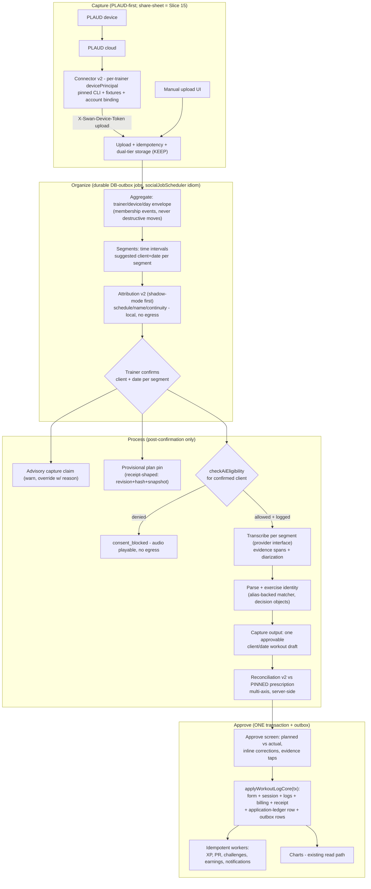
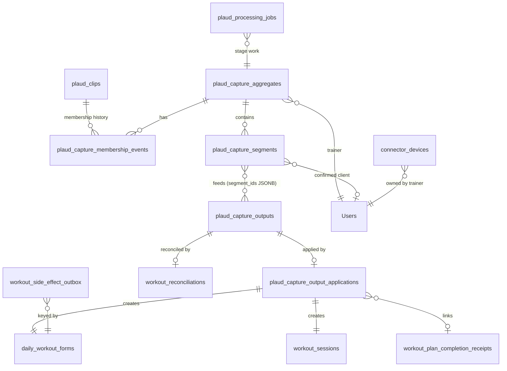
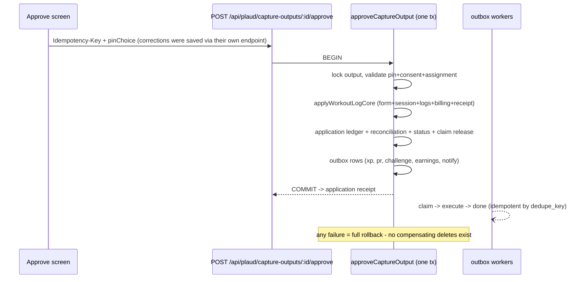
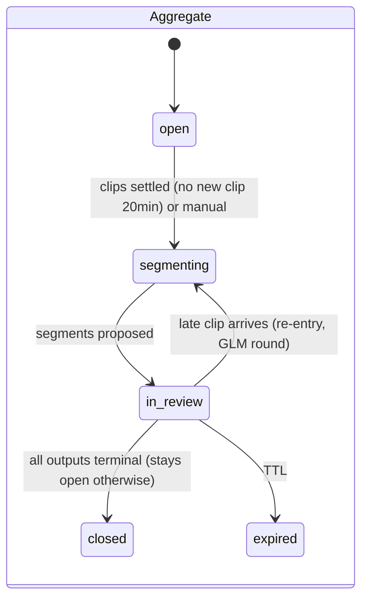
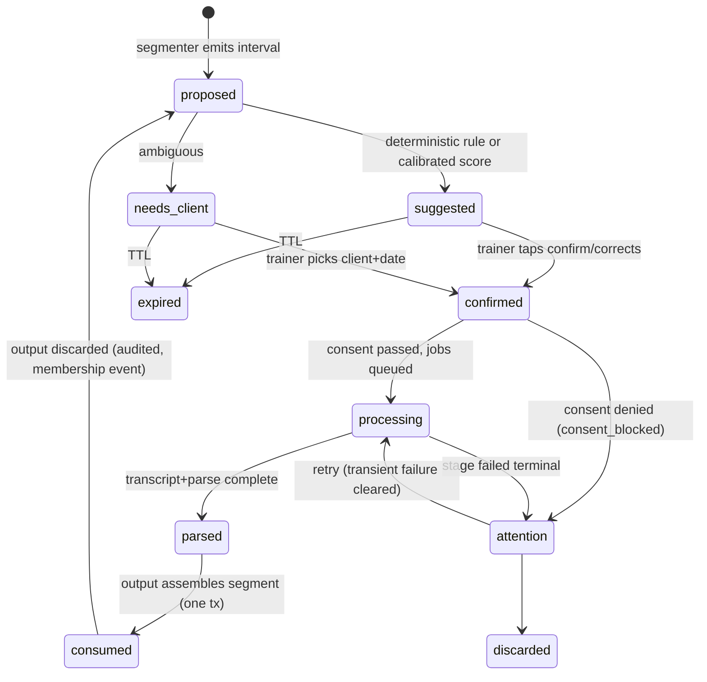
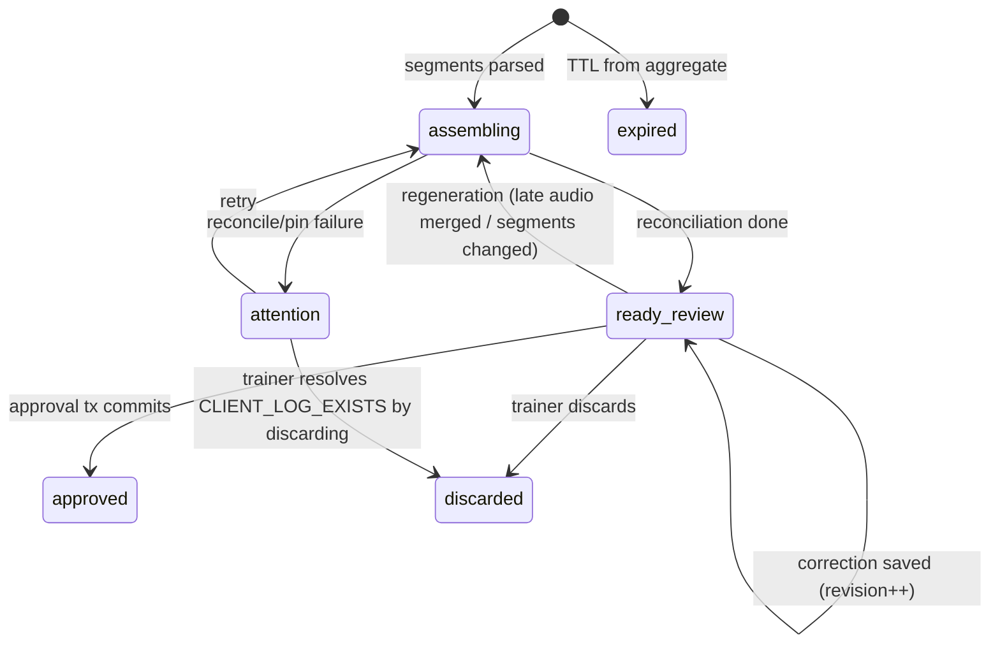
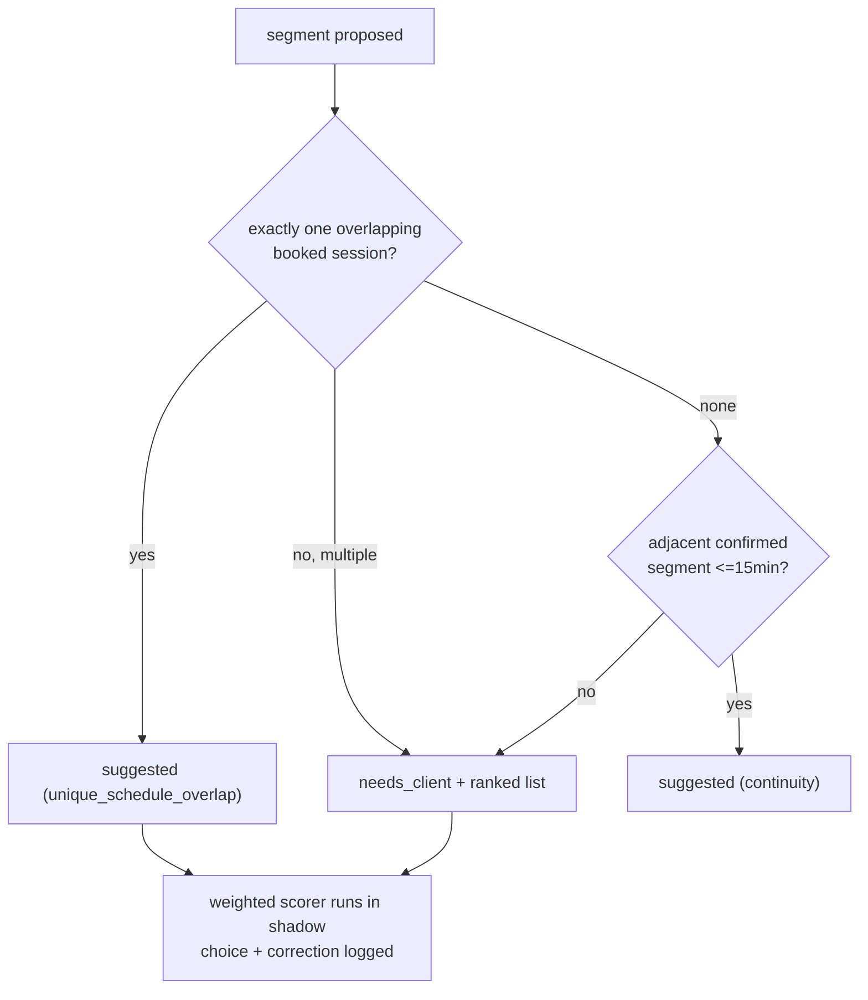

# PLAUD Auto-Ingest — Unified v2 Blueprint (hostile-reviewed twice, rebased to main truth)

**Date:** 2026-09-01 · **Author:** Claude Fable 5 (Final Decider) · **Owner:** Sean
**Ground truth:** `origin/main @ c2e69d72c` — mapped THIS session via a dedicated read-only worktree (two full maps: canonical write lane; PLAUD tree + queue infra + plan-vs-actual + frontend surfaces). Main moves fast (it advanced past the GPT review's own quoted SHA during that review); **the builder MUST re-pin and re-verify Part 3's facts at its build SHA before Slice 1.**

**Lineage:** v1 blueprint (this repo) + ChatGPT-Pro hostile review (PLAUD-PLAN-HOSTILE-REVIEW-REVISION-2026-09-01). Part 1 adjudicates both. Everything else is the single merged spec. A builder executing this document makes zero design decisions; a decision it finds missing is a defect — stop and report.

---

## Part 0 — Builder rules

1. **Build branch is cut from current origin/main**, never from `wip/comms-notifications-*`. Slice 0 re-pins the base SHA and re-verifies every Part 3 fact at that SHA (file:line cites here are @ `c2e69d72c`).
2. Build in slice order (Part 16); failing tests first; per-slice gates: hostile pass (R61), Tier-A with baseline disclosure (R56), Gemini+Codex review (R46), batch-push (R70).
3. House rules bind every slice: no MUI, 44px targets, tokens-with-fallback, 300-line cap, Victory-only, `css` helper (R43), pre-push backend audit (R42), proof-before-done (R73), blast-radius rules for every migration (`"Users"` quoted; INTEGER user FKs; reversible `down()`; snapshot-verified FK targets).
4. Claim tags: `[MAIN-VERIFIED]` = confirmed at c2e69d72c this session with file:line. `[VENDOR]` = external vendor claim, re-verify at build. `[DECIDED]` = a design ruling made here, with its reason.

---

## Part 1 — Adjudication of the two prior plans

### 1.1 Where the GPT-Pro review was RIGHT (adopted)

| Its finding | v2 ruling | Main evidence |
|---|---|---|
| H0/H1 stale baseline: v1's F1 "guaranteed FK violation" is not main behavior — the controller calls `submitAiWorkoutLogAsDailyForm` and writes a **real** DailyWorkoutForm id | **CONFIRMED — v1's F1 diagnosis and its `approved_workout_session_id` migration are WITHDRAWN** | `adminWorkoutLoggerController.mjs:96,151` ("real DailyWorkoutForm id since Phase 1.1a") `[MAIN-VERIFIED]` |
| H2: `plaud_merge_segment` IS recognized (source policy normalizes it) | CONFIRMED — v1's F2 wording withdrawn; the *reshaped* defect stands (1.3) | `workoutLogSourcePolicy.mjs:37` `[MAIN-VERIFIED]` |
| H3: the canonical write lane is `submitAiWorkoutLogAsDailyForm`; `logWorkoutForClient` is retired | CONFIRMED — main's `workoutLogService.mjs` is an 82-line stub; the function no longer exists; 4 live callers all use the canonical adapter | stub header `workoutLogService.mjs:14-22`; callers list Part 3.2 `[MAIN-VERIFIED]` |
| H4: post-commit failure reaches a catch that calls `rollback()` on a committed tx | CONFIRMED — try opens :98, commit :253, four post-commit steps follow, catch :360 calls rollback :361, no `committed` flag; Sequelize's "already finished" error then masks the real one | `aiWorkoutDailyFormService.mjs:98,253,360-363` `[MAIN-VERIFIED]` |
| H5: `WorkoutPlanCompletionReceipt` already stores prescription truth (revision, hash, snapshot, occurrence, idempotency key, immutability hooks) | CONFIRMED — reconciliation links to it instead of duplicating planned snapshots | model `:29-153`; created in-tx via `clientTrainingPlanProgressService.mjs:246-255` `[MAIN-VERIFIED]` |
| H6: plan-vs-actual EXISTS (frontend-only, weak) | CONFIRMED — v1's "does not exist" corrected to "v2 replaces an inadequate implementation" (see 1.3 for how inadequate) | `resolvePlanVsActual.ts:37-62` `[MAIN-VERIFIED]` |
| H7/H8: v1's single-client capture session can't represent multi-client/multi-day audio, and its ERD contradicted its schema | CONFIRMED — 4-level hierarchy adopted (Part 5) with an auto-collapse fast path | v1 §5.1-5.2 internal contradiction |
| H11: v1's hold was self-contradictory (advisory prose, blocking 409 + unique index) | CONFIRMED — advisory capture claim adopted (Part 5.6) | v1 §5.3 vs §10 |
| H12: reconciliation `workout_session_id UNIQUE` conflicts with multi-capture days | CONFIRMED — uniqueness moves to the application ledger row | v1 §5.4 |
| H13: snapshot-at-reconciliation-time reconciles against the wrong prescription after edits/advances | CONFIRMED — provisional plan pin at confirm time, receipt-shaped (Part 9.1) | |
| H14: generic "append" is not a design | CONFIRMED — 3-case ruling in Part 13.4 `[DECIDED]` | |
| H15: approval replay must return the original receipt, not 409 | CONFIRMED — idempotency keys on the application ledger (Part 6.3) | |
| H16/H17: field-level evidence spans + canonical exercise identity | CONFIRMED — Part 9.3/9.4 | `WorkoutLog.exerciseName` free text; `Exercise.aliases` written by seeders, read by nothing `[MAIN-VERIFIED]` |
| H18/H19: single adherence % is misleading; ±5% chips unsafe for v1 | CONFIRMED — multi-axis display, no composite, no progression chips in core release | |
| H20/H21: attribution thresholds miscalibrated (+50 max signal < 70 gate); fixed 45-min gap too crude | CONFIRMED — shadow mode + deterministic high-precision rule + interval clustering (Part 8) | |
| H22: duration-sum dedupe can silently discard valid recordings | CONFIRMED — lineage/id-based dedupe + quarantine, never duration arithmetic (Part 11 C6) | |
| H23: "any device" wasn't actually delivered | CONFIRMED — honest scope ruling: **PLAUD-first v1**, share-sheet promoted to a numbered slice (Part 16, Slice 15) `[DECIDED]` | |
| H24: device tokens must not impersonate `req.user` | CONFIRMED — `req.devicePrincipal` + isolated router (Part 11 C1) | |
| Storage: "R2 plaintext at rest" was wrong — R2 encrypts at rest (AES-256-GCM) by default | CONFIRMED — v1's claim withdrawn; real storage risks listed in Part 14 | Cloudflare platform behavior `[VENDOR]` |
| Branch protection off on main | CONFIRMED via `gh api` this session: `{"protected": false}` | `[MAIN-VERIFIED]` |

### 1.2 Where the GPT-Pro review was WRONG or overreached (corrected)

| Its claim | v2 correction | Evidence |
|---|---|---|
| "Adapt the existing BullMQ/Redis queue pattern" (H10) | **REJECTED.** BullMQ on main is **dead infrastructure**: `initVideoJobQueue` has ZERO call sites, so the sole queue is never initialized and every `addJob()` silently no-ops (3 production callers are already broken no-ops). Redis was also disabled in gamification for "causing production crashes." The repo's PROVEN durable-work idiom is DB-polling outbox tables (`plaud_clip_mirror_jobs`, `workout_plan_pdf_derivatives` — the latter written inside the caller's tx) plus `socialJobScheduler`'s atomic conditional-UPDATE claim + heartbeat + 15-min stuck-reaper. **v2's job system uses that idiom** (Part 6.4). BullMQ may be revisited only as its own workstream with its own burn-in | `videoJobQueue.mjs:328` zero callers; `addJob` no-op `:424-429`; `GamificationPersistence.mjs:44`; `socialJobScheduler.mjs:9-18,29,85` `[MAIN-VERIFIED]` |
| "Gemini 3.5 Transcribe is generally available" | It is **public preview** (announced ~Aug 26 2026), ≈$0.005/min blended, 1-hour file cap, **diarization limited to 3 speakers (3+ experimental)** — that 3-speaker limit is a real constraint for gym audio and goes into the benchmark rubric | Web-verified this session `[VENDOR]` |
| Its "current main" SHA (4936874…) | Already superseded — main was at `c2e69d72c` hours later. Proves the re-pin rule in Part 0, cuts both ways | `git rev-parse origin/main` this session |
| "/dashboard/plaud-merge mounted twice" (inherited from v1) | On main it has ONE router registration (`main-routes.tsx:923`); the second mount was branch-only drift | `[MAIN-VERIFIED]` |
| Implied the compensating-delete cleanup is merely "incomplete" | Understated — see 1.3 for the full unreverted list | |

### 1.3 What BOTH plans missed (found by this session's main maps — all `[MAIN-VERIFIED]`)

1. **The compensating deletes revert 3 tables and strand at least 6 side-effect classes.** On approval-invariant failure the controller deletes `daily_workout_forms`, `workout_logs`, `workout_sessions` — but NOT: the `availableSessions` credit decrement, the booked `Session` stamped completed/present/creditsDeducted, the trainer earnings accrual, XP/streak/badges, challenge progress, PR events. Worst: the completion receipt is removed **incidentally via FK CASCADE while the plan cursor advance is NOT reverted** — plan state advanced with no receipt (`adminWorkoutLoggerController.mjs:155-182`).
2. **No DB uniqueness backs either one-per-day guard.** `daily_workout_forms(clientId,date)` index is non-unique; `workout_sessions` has no `(userId,date)` unique either; both guards are app-level `findOne`s — two concurrent submits can both pass (`DailyWorkoutForm.mjs:386-388`; migration `20250714000002:151`).
3. **The canonical writer destroys client data in one path:** when a WorkoutSession exists for (userId,date) without a form (e.g. a client self-log), `findOrCreate` reuses it, overwrites it trainer-led/completed, and `WorkoutLog.destroy` wipes the client's existing rows before `bulkCreate` (`aiWorkoutDailyFormService.mjs:178-193`).
4. **Segment applies skip validation entirely on main:** `source==='plaud_merge_segment'` bypasses the mergeRequestId UUID check, the approval UPDATE, and compensation (`adminWorkoutLoggerController.mjs:77`); the frontend never calls approve per-segment and swallows the final approve failure (`PlaudMergeWorkspace.apply.ts:68,77-97`).
5. **`needsClient` is hardcoded-true in effect:** `plaud_clips.client_id` is written by no code path, so every intake row shows "needs client" forever (`plaudIntakeQueueMappers.mjs:179`).
6. **PlanVsActual is weaker than "primitive":** pairing is array-position (its `date` field is dead in the type), **weight comparison is dead code in production** (the strip never populates planned weight), reps are never compared, and no test exercises misalignment. No server-side endpoint exists at all (`resolvePlanVsActual.ts:16,37-55`; `PlanVsActualStrip.tsx:78-88`).
7. **Phantom doc:** `PlaudMergeRequest.mjs:14-18` documents a `markApproved` model method that does not exist anywhere.
8. **PLAUD source policy nuance:** plaud keeps XP, challenges, plan-advance, PR detection ON and only suppresses paid-session deduction — so every plaud approval fires the full post-commit side-effect chain, raising the stakes of H4 (`workoutLogSourcePolicy.mjs:51-88`).
9. **Consent helper exists, is wired to exactly 2 lanes, and PLAUD is not one of them** — zero consent references in the whole PLAUD path (`aiEligibilityHelper.mjs:45`; importers: aiWorkoutController, longHorizonController only).
10. **The transcription model is already env-swappable** — `AI_GEMINI_TRANSCRIPTION_MODEL` (`voiceTranscriptionService.mjs:112`) — the provider interface (Part 10) formalizes an existing seam rather than inventing one.

### 1.35 GLM hostile round — 2026-09-01 (post-publication, amendments applied in place)

Sean authorized a Z.AI panel: **GLM 5.3 → REJECT (15 findings)**, **GLM 5.3 Flash → REVISE (14 findings)**. Same lab — overlap counted once; ~20 distinct defects after merge. Adjudication: **all 20 adopted** (this document already reflects every fix — search `[GLM round]`), zero disproven; three repo-dependent VERIFYs resolved by direct read (`awardWorkoutXP` internally idempotent `:65-83`; consent `withdrawnAt` exists `:81,95`; `PATCH .../workouts/:sessionId` edit route exists `:104` — which enabled the amendment CUT). Headline adoptions: per-source outbox gating (the flag would have frozen platform-wide side effects); `plaud_capture` source-policy registration (silent billing bug); amendment mode cut (four independent uniqueness walls); ledger subject-typing (Slice-2/4 FK ordering); consent re-check inside the transcribe worker + revocation semantics; admin_override stripped of egress power; legacy-sweeper retune (24h TTL vs 96h review window); output identity `(trainer, client, date)` cross-aggregate; typed `CLIENT_LOG_EXISTS`; encrypted verbatim evidence; header-authoritative replay keys; per-event outbox delivery contracts; tap-first split control; 8 new test suites. Full transcripts: `GLM-CONSULT-PLAUD-V2-2026-09-01.md`, `GLMFLASH-CONSULT-PLAUD-V2-2026-09-01.md`.

### 1.4 Disposition of prior work

- **v1 blueprint: SUPERSEDED** by this document (kept as history; its ABC UI, vocabulary, wireframes, consent finding, connector direction, and test-shape survive INTO v2).
- **Branch Slice 0+1 commits (`2aa65a999` etc.): DO NOT MERGE to main.** They refactor a function main deleted (`logWorkoutForClient`) and add a migration v2 withdraws. What survives: the *pattern* (validate-under-lock before write, one transaction, rollback-not-compensate) and the *behavioral test shapes* (fault-injection atomicity, engagement-post-commit ordering) — re-ported in Slices 1–2 against the canonical core. The read-only probe script is still useful and can be cherry-picked.
- **GPT-Pro review: ADOPTED as amended** by 1.2/1.3.

---

## Part 2 — Vision contract (unchanged goals, honest scope)

| ID | Requirement |
|---|---|
| R1 | Trainers record freely all day (PLAUD device); recordings reach Swan with zero manual writing. **v1 scope ruling `[DECIDED]`: PLAUD-first.** Other devices use the existing manual upload until Slice 15 ships the phone share-sheet — stated, not implied |
| R2 | Swan sorts the day's audio: clip clusters → per-client segments → suggested client, including start/stop re-records and recordings that span two clients or midnight |
| R3-R4 | Parsed numbers reconcile against the plan **as prescribed at capture time** (pinned), log against the plan for that day, and advance it — through the canonical write lane |
| R5 | Approval gate on everything; suggestions never auto-commit |
| R6 | Phone-first, one-handed, 2-tap happy path (Confirm ✓ → Approve ✓) |
| R7 | Approved numbers feed charts via the existing `workout_logs JOIN workout_sessions` read path |
| R8 | Consent-gated audio egress; auditable approvals, claims, and corrections |

---

## Part 3 — Main ground truth the builder must re-verify at the build SHA

### 3.1 Canonical write lane — `submitAiWorkoutLogAsDailyForm` (`aiWorkoutDailyFormService.mjs`)
IN ONE TRANSACTION (`:96-253`): client row lock → scheduled-session resolve+lock (`aiWorkoutScheduledSessionService`) → future-date check → one-form-per-day guard (app-level `findOne` `:131-138`) → planned-assignment resolve+plan lock (`aiWorkoutPlannedAssignmentService`) → billing decision → `WorkoutSession.findOrCreate` (+overwrite if existed) → `WorkoutLog.destroy` + `bulkCreate` → `DailyWorkoutForm.create` → credit decrement → plan advance + **WorkoutPlanCompletionReceipt** (same tx) → scheduled-session completion → commit `:253`.
POST-COMMIT, inside the same try: earnings `:258`, challenges `:267`, XP `:274`, PR `:294` (only PR has a local catch). Outer catch `:360` calls rollback unconditionally.
Return: `formId` = DailyWorkoutForm UUID; `sessionId` = WorkoutSession UUID; xp/billing/challenge/prEvents/form envelope.
Callers (4): adminWorkoutLoggerController:96 · coachActionProposalApprovalService:227 · workoutLogWriteDispatcher:16 · historyBackfillService:269.

### 3.2 Source policy (`workoutLogSourcePolicy.mjs:51-88`)
`plaud_merge` (aliases `plaud_merge_segment`, `plaud`): historical=false, PR=on, XP/challenges=on, plan-advance=on, **paid-session deduction=off**. Unknown source → `live` (everything on).

### 3.3 Receipts (`WorkoutPlanCompletionReceipt`)
Columns incl. `dayKey (w#:d#)`, `occurrenceIndex`, `scheduledDate`, `prescribedRevision`, `prescribedHash (sha256)`, `exerciseSnapshot JSONB`, `dailyWorkoutFormId` (UNIQUE), `idempotencyKey = wpc:sha256(planId|dayKey|scheduledDate|occurrenceIndex|prescribedRevision)` (UNIQUE — note it excludes formId: second form on the same plan-day-revision collides → relevant to the occurrence deferral in 13.4). Immutability via before-update/destroy hooks (ORM-level only). Created inside the form-service tx.

### 3.4 PLAUD pipeline (unchanged from the May design, verified on main)
Upload idempotency `(clip_source, clip_external_id, user_id)` + ON CONFLICT; group service read-only, 90-min gap, 5-clip cap, day-boundary cut; merge 1–5 clips, 15-min heartbeated lock, ffmpeg, `gemini-2.5-flash` (env-overridable) + fitness vocab, AES-GCM payload; 24h clip TTL + cipher purge + 3 more sweepers; `plaud_clips.client_id` never written; segment parse endpoint exists; Applaud webhook dormant behind fail-closed preflight.

### 3.5 Frontend surfaces (main)
5 JSX mounts of PlaudMergeWorkspace, 4 reachable, 1 orphan (`CoachCommandOverview.tsx`); `/dashboard/plaud-merge` single router; trainer page = `PlaudIntelligenceWorkspacePage` wrapper; resolver = debounced search + admin-only create-client, still zero auto-suggestion; ~95-label vocabulary problem unchanged in kind.

### 3.6 Job/queue reality
BullMQ dead (3.2 of Part 1.2). Proven idioms: DB outbox rows written in-tx + `setInterval` pollers (`plaudR2MirrorWorker`) + `socialJobScheduler` atomic claim/heartbeat/reaper.

---

## Part 4 — Target architecture



Invariants:
- I1: capture-sourced workouts write ONLY through `applyWorkoutLogCore` inside the approval transaction.
- I2: attribution suggests, humans confirm; no auto-commit ever.
- I3: audio bytes leave Swan only after the confirmed client's consent check passes and is logged; segment boundaries are trainer-confirmed before egress whenever schedule evidence suggests >1 session in the window.
- I4: clips are immutable; membership changes are events, not destructive updates.
- I5: every approval, claim override, correction, and consent decision writes an audit row.

---

## Part 5 — Data model



All migrations: `.cjs`, reversible, `"Users"` quoted, INTEGER user FKs, additive-first. New tables (columns abbreviated; builder writes full DDL from these + house patterns):

| Table | Key columns | Notes |
|---|---|---|
| `plaud_capture_aggregates` | id BIGINT pk · aggregate_id UUID uq · user_id INT →"Users" (trainer) · source_device_id →connector_devices NULL · window_start/window_end TSTZ · status (`open,segmenting,in_review,closed,expired`) · clusterer_version · expires_at (96h default, `PLAUD_CAPTURE_TTL_HOURS`) | The trainer/device/day envelope. NO client identity here (H7) |
| `plaud_capture_membership_events` | id · aggregate_id FK · clip_id FK plaud_clips · action (`added,removed`) · actor (`system,trainer:<id>`) · reason · created_at | Append-only; "current membership" = latest event per clip. Concurrency guard `[GLM round]`: inserts run under an advisory lock per clip_id, and an `added` is rejected while another aggregate holds an un-`removed` `added` for that clip — one clip is current in at most one aggregate, by construction. Resegmentation freezes once ANY output of the aggregate reaches `assembling`; changing membership after that requires discarding the affected output first (which returns its segments to `proposed`) |
| `plaud_capture_segments` | id · segment_id UUID uq · aggregate_id FK · start_at/end_at TSTZ · clip_spans JSONB (`[{clipId,startMs,endMs}]`) · suggested_client_id NULL · suggestion JSONB (scorer_version, signals, ranked candidates, reason codes) · confirmed_client_id NULL · confirmed_date DATEONLY NULL · consent_state (`unchecked,allowed,denied,admin_override`) · consent_log_id NULL · status (`proposed,needs_client,suggested,confirmed,processing,parsed,consumed,attention,discarded,expired`) `[GLM round: `consumed` added — set when an output assembles the segment; `consumed → proposed` on output discard (with membership event + audit) so mis-attributed audio is recoverable instead of stranded]` | One clip may span segments; per-segment client/date/consent (H7). Confirm uses a conditional UPDATE (`WHERE status IN ('proposed','suggested','needs_client')`) so two concurrent confirms produce one winner and one 409 |
| `plaud_capture_outputs` | id · output_id UUID uq · **trainer_id INT + client_id INT + workout_date DATEONLY = the output's identity `[DECIDED — GLM round]`: partial UNIQUE on (trainer_id, client_id, workout_date) WHERE status NOT IN ('approved','discarded','expired') — one PENDING draft per trainer/client/day, enforced, cross-aggregate** · aggregate_id FK (provenance only, not identity — late audio in a NEW aggregate merges into the existing pending output for the same identity) · segment_ids JSONB · plan_pin JSONB NULL (Part 9.1) · parsed_workout ENCRYPTED (existing cipher service, key-versioned; **verbatim evidence text lives INSIDE this ciphertext** — 9.3) · evidence JSONB (offsets/refs only, no plaintext speech) · reconciliation_id NULL · status (`assembling,ready_review,approved,discarded,attention,expired`) · warnings JSONB | Assembly of output + segment flips + job row = ONE transaction; rollback returns segments to `parsed`. **Midnight rule `[DECIDED]`: `workout_date` = the trainer-TZ calendar day holding the majority of the output's audio duration** |
| `plaud_capture_output_applications` | id · application_id UUID uq · **subject_type (`merge_request,capture_output`) + subject_id BIGINT** `[DECIDED — GLM round: no FK at creation — Slice 2 predates the outputs table; Slice 4's migration adds the real FK constraint for `capture_output` rows via a CHECK + trigger or validated FK, and the uq is on (subject_type, subject_id, correction_revision) so the two id spaces can never collide]` · correction_revision INT · idempotency_key VARCHAR(128) uq (client-supplied header, 6.3) · request_hash CHAR(64) · daily_workout_form_id UUID FK · workout_session_id UUID FK · completion_receipt_id UUID FK NULL · applied_by INT · applied_at · mode (`standard,merge_into_pending`) | The durable ledger (H15). `amendment` mode REMOVED (13.4). Replay semantics per 6.3 |
| `workout_reconciliations` | id · capture_output_application_id FK **UNIQUE** · workout_session_id NON-unique · completion_receipt_id NULL · plan_pin JSONB (copy of the validated pin) · actual_snapshot JSONB · match_decisions JSONB (Part 9.4 decision objects) · axes JSONB (Part 9.5) · created_at | Uniqueness per application, not per session (H12) |
| `workout_side_effect_outbox` | id · event_type (`xp,challenge,pr,earnings,notification,analytics`) · payload JSONB · dedupe_key uq (`<type>:<formId>`) · status (`pending,in_flight,done,failed_terminal`) · attempts · next_retry_at · locked_by/locked_until (claim) · last_error | Written INSIDE the core tx; workers use the socialJobScheduler claim idiom `[DECIDED — Part 1.2]` |
| `plaud_processing_jobs` | id · job_key uq (deterministic: `<stage>:<subject_id>:<input_hash>`) · stage (`cluster,segment,attribute,consent,transcribe,parse,pin,reconcile,prepare_review,purge`) · subject_type/subject_id · status · attempts · next_retry_at · locked_by/locked_until · input_hash · output_hash · provider_meta JSONB (model/version) · failure_class · created/updated | Same claim idiom; DB is truth (H10) |
| `connector_devices` | id · device_id UUID uq · user_id INT →"Users" · label · token_prefix CHAR(8) · token_digest CHAR(64) (HMAC-SHA256 with server pepper) · expected_plaud_account_hint · scopes JSONB default `["plaud:upload","plaud:heartbeat"]` · last_seen_at · expires_at · revoked_at · created_at | Part 11 |
| `workout_capture_claims` | id · client_id · claim_date DATEONLY · output_id FK · scheduled_session_id NULL · created_by · released_at NULL · override_reason NULL | **NO unique index** (advisory, H11). Read by logger/Coach for warnings |

Canonical-core repair migrations (Slice 1, each with pre-checks + reversible):
- `daily_workout_forms`: dedupe-audit query first (report duplicates to Sean if any); then UNIQUE index on `(clientId, date)` `[MAIN-VERIFIED gap 1.3.2]`.
- `workout_sessions`: same audit; UNIQUE on `(userId, date)` deferred until the occurrence decision (13.4) — instead add a partial protective index + keep the app guard; ruling recorded `[DECIDED]`: don't freeze one-per-day into the DB while two-a-day is an open product decision.
- Fix the `PlaudMergeRequest` phantom-doc header (1.3.7) — doc-only.

---

## Part 6 — Canonical core refactor (the load-bearing slice)

### 6.1 Split (H3/H4 fix; preserves all 4 existing callers)
```
submitAiWorkoutLogAsDailyForm(args)            // thin wrapper, signature unchanged
  → applyWorkoutLogCore(args, { transaction })  // ALL in-tx truth from Part 3.1, unchanged order
  → enqueueWorkoutSideEffects(core, { transaction })  // outbox rows, same tx
  → commit; committed = true
  → return buildResultShape(core)               // NO side-effect execution here
catch: if (!committed) rollback; throw          // the committed flag H4 demands
```
- **Per-source routing `[DECIDED — GLM round]`:** the four post-commit calls (earnings/challenges/XP/PR) move to outbox rows **for the capture lane only** (`source policy flag routeSideEffectsToOutbox`, set for `plaud_capture`). The four EXISTING callers keep their current inline post-commit execution — bytes unchanged, real xp values in responses, zero consumer churn — until the outbox has burned in, after which inline→outbox promotion for legacy sources is its own later slice with its own gate. This kills the original design's flaw: `WORKOUT_OUTBOX_ENABLED` (default off) would otherwise have silently frozen XP/earnings/challenges/PR for every production workout between the Slice 1 deploy and a flag flip — a platform-wide regression disguised as a capture kill switch. Now the flag's blast radius is exactly the capture lane.
- The **committed-flag fix applies to ALL sources immediately** (that part is a pure bug fix): commit → `committed = true`; the four inline effects run after it, each individually try/caught (today only PR is); the outer catch rolls back only when `!committed`.
- The inline block and the outbox workers call the SAME extracted per-effect functions — one implementation, two invocation paths.
- Add a startup/ops alert: pending outbox rows older than 10 minutes while the worker flag is on → warn; while off → error (the drain-on-enable contract is explicit: enabling the flag drains the backlog oldest-first).
- `[DECIDED — GLM round]` **Register `source: 'plaud_capture'` in `workoutLogSourcePolicy` in the same slice that first sends it** (Slice 2), with `plaud_merge`'s exact flags (paid-session deduction OFF, XP/PR/challenges/plan-advance ON) **plus** `routeSideEffectsToOutbox`. Without this row the string falls through to `live` and paid-session deduction turns ON — a silent money bug (Flash's catch). A source-policy table test asserts a `plaud_capture` approval enqueues zero billing deduction.

### 6.2 PLAUD approval transaction
`approveCaptureOutput({ outputId, correctionRevision, overrides, actor })` — ONE tx:
1. Lock output FOR UPDATE; validate `ready_review`, actor owns aggregate or admin, active trainer-client assignment.
2. Validate plan pin (Part 9.2) — mismatch → `PLAN_CHANGED` response, no write.
3. `applyWorkoutLogCore({...parsed+corrections, plannedAssignment: pin, source:'plaud_capture', transaction})`.
4. Insert `plaud_capture_output_applications` row (idempotency key).
5. Insert `workout_reconciliations` row.
6. Update output → `approved`; release capture claim; mark segments consumed.
7. Legacy-bridge `[DECIDED — GLM round]`: the `plaud_merge_requests` flip happens ONLY in the Slice-2 legacy lane (whose ledger subject IS a merge request). **Capture outputs never touch `plaud_merge_requests`** — there is no mapping between them and none is invented.
8. Outbox rows; commit. Failure anywhere = rollback of EVERYTHING — the compensating-delete block (1.3.1) is deleted, and the stranded-side-effect classes become impossible rather than compensated.
9. Client-self-log collision `[DECIDED — GLM round]`: if the core's one-form-per-day guard (or the Slice-1 unique index) fires because the client logged their own workout after segment confirm, approval returns typed `CLIENT_LOG_EXISTS` (not a raw constraint error), the output moves to `attention` with a plain-language card ("`{client}` logged their own workout for this day — review it, then discard this recording or edit their log"), the capture claim is HELD until the trainer resolves, and the card links the existing workout. Retry becomes possible if the self-log is deleted/moved.

### 6.3 Idempotent replay `[reworked — GLM round]`
- The client's **`Idempotency-Key` header is authoritative** (server derives nothing). Stored with `request_hash = sha256(output_id | correction_revision | pinChoice | mode | canonicalized-overrides)` — volatile fields excluded.
- Same key + same hash → 200 with the stored application receipt. Same key + different hash → 409 `IDEMPOTENCY_MISMATCH` **with a diff of the changed fields** — never a silent 200 carrying a stale receipt.
- Post-lock routing is explicit: a request that acquires the row lock and finds the output already `approved` WITH a ledger row → 200 canonical receipt (replay path), regardless of key. `approved` without a ledger row is impossible by construction (same tx).
- Corrections are **endpoint-only** (`POST .../corrections`); the approve body carries no inline edits. Every correction increments `correction_revision`, and the UI **mints a fresh Idempotency-Key whenever `correction_revision` changes** — a retry of a stale key after an edit correctly 409s with the diff.

### 6.4 Workers
`backend/jobs/workoutOutboxWorker.mjs` + `plaudProcessingWorker.mjs`: `setInterval` pollers (proven pattern), atomic conditional-UPDATE claim, heartbeat, 15-min stuck-reaper, bounded attempts (5) with backoff, `failed_terminal` + alert (mirror `plaudR2MirrorWorker` + `socialJobScheduler`). Gated by `PLAUD_CAPTURE_PIPELINE_ENABLED` and `WORKOUT_OUTBOX_ENABLED` (capture-lane scope only, per 6.1), both default off.

**Per-event delivery semantics `[DECIDED — GLM round]` — "at-most-once per dedupe_key" guarantees one ROW, not one EXECUTION; a crash between executing an effect and marking `done` lets the reaper re-run it, so each event type declares its real contract:**
| Event | Contract | Mechanism |
|---|---|---|
| `xp` | effectively-once | `awardWorkoutXP` is ALREADY internally idempotent — `idempotencyKey` + `alreadyAwarded` short-circuit `[MAIN-VERIFIED awardWorkoutXP.mjs:65-83]`; re-fire is a no-op |
| `pr`, `challenge`, `earnings` | effectively-once, DB-transactional | worker wraps effect + `done` update in ONE DB transaction where the effect is DB-only; each effect gains a natural-key guard (challenge: form+challenge id; earnings: session id; PR: form+exercise). **Slice 0 VERIFY task: audit each service's existing internal idempotency** (earnings has a money-write alert path; challenge/PR unknown) and add the guard where absent |
| `notification`, `analytics` | at-least-once, consumer-idempotent | external side effects can't join the DB tx; consumers must tolerate duplicates (notification keyed by form id; analytics events carry dedupe ids) |

`failed_terminal` money events get an operator **re-drive path**: `POST /api/admin/outbox/:id/redrive` (admin-only, audited) + a runbook entry — a terminal earnings row must never just vanish behind an alert. The crash-after-execute window is explicitly tested (Part 15).



---

## Part 7 — State machines




Job rows: `pending → in_flight (leased) → done | pending(retry) | failed_terminal`, reaper returns stuck leases.
**Public vocabulary (unchanged from v1, +1):** `New → Needs client → Processing → Ready to approve → Approved | Needs attention`. Raw enums, error codes, `CIPHER PURGED` never render; codes live in a `<details>` support disclosure.

---

## Part 8 — Attribution v2 (suggest, measure, then trust)

**Module** `backend/services/plaudAttributionService.mjs` — deterministic, local, zero egress, versioned (`scorer_version` stored with every suggestion).

**Phase A — deterministic high-precision rules (live from day one):**
- DR1: exactly ONE roster client has a booked `sessions` row (`scheduled|confirmed|completed`) overlapping the segment window (±15min start, +30min end) → `suggested` with reason `unique_schedule_overlap`.
- DR2: two+ overlapping candidates, or zero → `needs_client` (with the ranked list shown in the picker).
- Continuity: an adjacent trainer-confirmed segment (≤15min gap, same day) extends its client to the neighbor as `suggested` reason `continuity` unless DR2 fired.

**Phase B — weighted scorer (SHADOW MODE first, H20):** signals from v1 (schedule overlap, same-day session, filename/title name-match via the `clientResolver` Levenshtein ladder, continuity, post-parse plan-shape) are computed and STORED on every segment, but drive no UI until calibration. Telemetry per segment: ranked candidates, trainer's actual choice, correction events. Promotion gate `[DECIDED]`: ≥200 labeled segments AND top-1 accuracy ≥90% AND false-suggestion rate ≤2% on the would-have-suggested set; thresholds then chosen FROM the data, per-org feature flag. No auto-confirm ever.

**Clustering/segmentation (H21):** interval reasoning, not one constant — clip `recorded_at` + duration end-times, booked-session windows as strong cut evidence, day boundary (trainer TZ), silence gaps when duration metadata allows, and **manual split/merge controls in the UI** (membership events). `clusterer_version` stored; re-segmentation allowed while no output is approved.

**Post-parse tripwires (kept from v1):** plan-shape mismatch warning ("parsed exercises match {other}'s plan better"), roster-name boundary detector.



---

## Part 9 — Plan pin, evidence, exercise identity, reconciliation

### 9.1 Provisional plan pin (H13) — at segment confirm (or scheduled-session bind)
`plan_pin JSONB`: `{planId, assignmentId, dayKey, occurrenceIndex, scheduledDate, prescribedRevision, prescribedHash, exerciseSnapshot, pinnedAt, pinSource:'scheduled_session'|'today_assignment'}` — the exact identity shape the completion-receipt system already proves. No plan for that date → `pin: null`, output flagged `unplanned` (still approvable).

### 9.2 Pin validation at approval
Recompute current revision/hash. Match → proceed; receipt created by the core (via the existing in-tx `advancePlanAfterPlannedAssignmentLog`). Changed → surface **"Plan changed after this recording — compare against the captured prescription or the current revision"**; the trainer's choice (`use_pin | use_current`) is stored on the reconciliation row and audited. Never silently reconcile against a later cursor.

### 9.3 Evidence spans (H16)
Every parsed exercise/set/value carries: `{clipId, startMs, endMs, speaker?, verbatim, confidence, provider, modelVersion, originalValue, correctedValue?, correctedBy?, correctedAt?}`. Storage split `[GLM round]`: the `verbatim` text lives INSIDE the encrypted `parsed_workout` payload; the plaintext `evidence` JSONB column holds only clip refs + offsets + metadata — speech never sits in a plaintext column. The verbatim transcript is immutable evidence; display transcripts are derived. The approve screen's numbers are tappable → seek audio to `startMs`; purged audio renders the `AUDIO_PURGED` chip state (14).

### 9.4 Exercise identity (H17)
`exerciseMatchService` ladder (exact name → **`Exercise.aliases`** (finally read by something) → token normalization (db/bb/plurals) → Levenshtein ≤2 unique-winner) returns a **decision object** `{raw, normalized, candidates:[{id,score}], selectedId|null, method, ambiguityReason?}` — stored in `match_decisions`, never silently applied. Additive migration: nullable `workout_logs.exercise_id` UUID FK → `"Exercises"` + `matcher_version`; unmatched keeps free text + `unmatchedExercise` flag feeding the alias-curation backlog.

### 9.5 Reconciliation v2 — server-side, multi-axis (H18)
`workoutReconciliationService` compares pinned prescription vs actual: axes = exercise coverage, prescribed-set completion, rep-range adherence, load comparison (only where prescription parses — `prescriptionParserService` from v1 carries over: "3x10", "4x8-12", "AMRAP", "RPE 8", "70% 1RM", "135 lb", garbage→nulls+raw), missing planned, added extra, unmatched/ambiguous. **No composite score in v1; no ±5% chips (H19)** — suggested-adjustment machinery is deleted from the core release and parked until reconciliation accuracy is measured. Replaces `resolvePlanVsActual` consumers via a versioned endpoint `GET /api/plan-vs-actual?clientId&range` with a dual-read window (Slice 12): old strip and new read-model rendered from the same fetch, discrepancies logged, old resolver deleted only after parity.

---

## Part 10 — Transcription: provider interface + benchmark gate

- `transcriptionProviderService` formalizes the existing `AI_GEMINI_TRANSCRIPTION_MODEL` seam: providers = `gemini-2.5-flash` (current), `gemini-3.5-transcribe` (`[VENDOR]` public preview, ≈$0.005/min, word timestamps, diarization ≤3 speakers, 1h cap — re-verify at build), `plaud_provided` (CLI transcript when available), each returning the same evidence-span contract.
- **Golden-audio benchmark (Slice 5 gate):** consented/synthetic gym recordings scored on exercise-name WER, numeric accuracy (weights/reps/tempo/RPE/rest/dates), speaker attribution at 2 and 3+ speakers, timestamp quality, latency, cost/min, failure rate, false medical-term extraction. Default provider is chosen by benchmark, recorded in this doc's changelog, and pinned per-env.
- Long capture: per-segment requests with 30s overlap stitching (segments are already bounded); never one giant file. Prompts restricted to transcription+extraction — no advice generation.
- Paid-tier requirement: production client audio only through the paid API project (unpaid-tier data-use terms are disqualifying); Sean owns the billing/DPA checklist item (Slice 3).

---

## Part 11 — Connector v2

| Rule | Spec |
|---|---|
| C1 identity | `POST /api/plaud/connector/devices` (interactive JWT) → `{deviceId, token}` shown once; token = `swpd_` prefix + 32 random bytes; stored as HMAC-SHA256 digest with server pepper; `timingSafeEqual`. Middleware sets **`req.devicePrincipal`** (never `req.user`, H24) on an ISOLATED router exposing exactly: clip upload, heartbeat. Scope-checked, revocable, expiring (180d default, rotatable) |
| C2 binding | One PLAUD account per trainer; device stores `expected_plaud_account_hint`; startup runs `plaud me` and refuses on mismatch. Per-trainer CLI profile dir isolation (`PLAUD_CLI_HOME` per device) |
| C3 pinning | Exact `@plaud-ai/cli` version in connector package.json; startup compat smoke (`me` + `recent --days 1` parse against saved fixtures); parse drift → fail closed + health error |
| C4 health | Local `health.json` every cycle + `POST /api/plaud/connector/heartbeat` (15 min); `GET /api/plaud/connector/health` feeds the Sync card; stale >45min → `Needs attention` |
| C5 failure | Swan 401/403 → write health error, exit nonzero (Task Scheduler restarts; fails visibly, never loops silently). Poll/ledger/dedupe from the current script carry over |
| C6 dedupe (H22) | Lineage first: stable recording IDs + upstream merge metadata when the CLI exposes it; content hash for exact duplicates; suspected merged-duplicates → `quarantined` intake state for human review. **Duration arithmetic is banned** |
| C7 metadata | Persist the full recording metadata the CLI returns (timing, duration, content state) into clip `provider_meta` — lineage and diagnostics, not reconstructed later |

---

## Part 12 — API contract v2 (delta from v1; all behind `PLAUD_MERGE_ENABLED` + role gates)

| Endpoint | Notes |
|---|---|
| `GET /api/plaud/capture-aggregates?scope&cursor` | list; scopes map to public vocabulary |
| `GET /api/plaud/capture-aggregates/:id` | segments, membership, clips (playable), suggestions with reason codes |
| `POST /api/plaud/capture-aggregates/:id/segments/:segId/confirm` | `{clientId, date?}` → claim + pin + consent check + job enqueue; 200 with `claimWarnings[]` (advisory, H11) |
| `POST /api/plaud/capture-aggregates/:id/resegment` | manual split/merge `{operations:[...]}` while no approved output |
| `GET /api/plaud/capture-outputs/:id` | draft + evidence + reconciliation + warnings + planChanged flag |
| `POST /api/plaud/capture-outputs/:id/corrections` | inline set/rep/weight/exercise-match edits → revision++ |
| `POST /api/plaud/capture-outputs/:id/approve` | Idempotency-Key required; body `{pinChoice?}` only (corrections endpoint-only; ledger `mode` is server-recorded); replay semantics 6.3 |
| `POST /api/plaud/capture-outputs/:id/discard` | releases claim, schedules purge |
| connector device CRUD + heartbeat + health | Part 11 |
| `GET /api/plan-vs-actual` | server read-model (9.5) |
| Legacy `/api/plaud/merge*`, `/api/plaud/intake` | kept read-compatible through the dual-read window; retired in Slice 14 |

---

## Part 13 — UI/UX (ABC kept; states completed)

Surfaces: trainer `/dashboard/trainer/plaud` and admin coach-assistant `workspace=plaud` re-render the new `CaptureFlow` tree; `/dashboard/plaud-merge` → redirect; `CoachCommandOverview.tsx` deleted (Slice 14, after dual-read evidence — adopting GPT's retirement discipline even though its unique logic is zero). Styled-components, Crystalline tokens, `color-mix` alphas, 44px, reduced-motion; routes through `swan-design-router` at build; working-surface lane (Mobbin), not cinematic.

### 13.1 A — Sync strip (unchanged from v1 + per-device rows for admins)
### 13.2 B — Review queue (v1 wireframe carries over, +2 states)
- **Processing card state** (between Confirm and Ready): "Transcribing…" with stage dots and an estimate DERIVED from measured per-minute throughput for the active provider (no hardcoded "~2 min") — the missing state GPT flagged.
- **Split/merge affordance** `[reworked — GLM round: one-handed first]`: primary control is a 44px `Split here` button acting at the audio playhead, snapping to the nearest silence gap or session boundary; `[Split at 10:02]` suggestion chips appear when a schedule boundary bisects the segment; drag-handle fine adjustment is a desktop/two-handed enhancement, never the only path.
- Suggestion chip shows reason in plain words: "Booked: Marcus 9:00–10:00" (▸ opens the full signal disclosure).

### 13.3 C — Approve screen (v1 wireframe carries over, +3 elements)
- Every actual value is a **tap-to-play** chip (evidence span → audio seek).
- **Plan-changed banner** when pin validation fails: `Plan changed after this recording · [Compare captured] [Compare current]`.
- Multi-axis adherence row (coverage / sets / reps / load) instead of one percentage; no adjustment chips.
- Inline correction = steppers on sets/reps/weight + exercise-match picker fed by the decision object's candidates.

### 13.4 Same-day conflict `[REWORKED — GLM round]` (replaces v1's two-button append, per H14; amendment mode CUT)
1. **More audio for a not-yet-approved output** → merged into the pending output automatically. Output identity is `(trainer, client, workout_date)` independent of aggregate (Part 5), so a late-synced clip in a NEW aggregate still lands in the SAME pending draft; the output transitions `ready_review → assembling` (regeneration) and re-reconciles. If the trainer had the draft open, the UI shows "New audio was added — refreshed" (revision-invalidation via the output's `updatedAt`).
2. **Client/date already has an APPROVED capture workout** → `mode=amendment` is **CUT from this release**. Both GLM seats proved it unimplementable as specced (it collides with the Slice-1 unique form index, the receipt idempotency key that excludes formId, receipt immutability hooks, AND the `<type>:<formId>` outbox dedupe — four independent walls). Post-approval fixes route to the **existing edit surface**: `PATCH /api/admin/clients/:clientId/workouts/:sessionId` (`editWorkout` — `[MAIN-VERIFIED adminWorkoutLoggerRoutes.mjs:104]`), which the approve screen deep-links as `Edit today's workout`. Capture-side amendment ships later WITH the occurrence-index workstream, specced together.
3. **A genuine second workout that day** → NOT SUPPORTED in this release (unchanged); parked with the occurrence-index decision, and the `workout_sessions` unique-index migration waits with it (Part 5).
4. **Client self-logged after segment confirm** `[NEW — GLM round]` → approval returns typed `CLIENT_LOG_EXISTS` (6.2 step 9): output → `attention`, claim held, card offers `Review their log` (deep-link) · `Discard this recording` · `Edit their log` (same PATCH surface). Never a raw constraint error, never silent destruction (Slice-1 self-log protection stands).

---

## Part 14 — Security & privacy

| Control | Spec |
|---|---|
| Consent gate `[hardened — GLM round]` | `checkAiEligibility` (existing, `aiEligibilityHelper.mjs:45`) runs TWICE: at confirm (fast feedback) AND **inside the transcribe worker's claim, immediately before egress** — jobs can sit queued for hours, and revocation (`withdrawnAt`, `[MAIN-VERIFIED aiEligibilityHelper.mjs:81,95]`) between confirm and execution must win. Worker re-check fails → segment → `consent_blocked`, job aborted. **Revocation semantics:** on withdrawal, pending egress jobs for that client cancel, derived transcripts/parses purge (cipher purge path), affected non-approved outputs → `attention`; approved workouts keep their text data (the workout record is the trainer's business record — evidence audio still purges on its retention clock). Result + `consentSource` + policy version stored per segment |
| Admin override `[REDEFINED — GLM round]` | `admin_override` **never authorizes egress**. It authorizes exactly the no-egress manual path: in-house playback + manual logging from audio. Overriding a client's recorded DENIAL to ship their voice to a cloud provider is a compliance liability, not a control — if a denial was recorded in error, the fix is a fresh consent event from the client, not an override. Enum semantics updated accordingly; audited either way |
| Multi-speaker `[hardened — GLM round]` | **Default-deny pre-egress:** a segment egresses only when (a) it has a unique schedule overlap (DR1) OR trainer-confirmed boundaries, AND (b) a local silence/energy screen (existing ffmpeg — no new dependency) does not flag mid-segment speaker-change suspicion, AND (c) the trainer's **stored, versioned recording-policy acknowledgment** exists on the aggregate (a precondition, not paperwork). Post-egress diarization >expected speakers still raises `unknown_speaker` on the output. Stated honestly: audio has ALREADY transited PLAUD's cloud under PLAUD's terms before Swan ever sees it — the recording policy (Slice 3, Sean item) must cover that leg too; Swan's gate governs Swan's egress only |
| Vendor terms | Production audio only via the paid Google project + documented DPA review `[VENDOR]`; provider prompts limited to transcription/extraction |
| Storage truth (corrected) | R2 encrypts at rest by default (v1's "plaintext R2" withdrawn). Real controls: narrow R2 credentials scoped to the plaud prefix, lifecycle rules matching retention classes, deletion verification on purge jobs, disk copies 0600 with TTL purge, no identifying metadata in logs/backups, access audit events |
| Retention classes `[reconciled — GLM round]` | **Slice 3 explicitly RETUNES the legacy sweepers** — the existing 24h clip TTL + cipher purge crons gain a predicate exempting clips owned by a non-terminal capture aggregate (which carry the 96h class); leaving both untouched would have the old sweeper delete audio mid-review (both seats caught this). `expires_at` anchor: `max(recorded_at + 96h, uploaded_at + 48h)` — the late-arrival floor covers a Monday recording synced Thursday. Classes: raw audio (96h unconfirmed → purge; approved → 30d then purge) · transcripts/parsed+**verbatim evidence spans: ENCRYPTED inside `parsed_workout` ciphertext** (a plaintext quote column would be the same speech the cipher protects — `evidence` JSONB carries offsets/clip-refs only), purged on discard/TTL, verbatim persists with approved workouts under the same key-versioned cipher · consent/audit rows persist. UI: evidence chips on purged audio render `AUDIO_PURGED` state (verbatim text still shown from the encrypted store; play button disabled with the purge date) |
| Device tokens | Part 11 C1; creation/rotation/revocation audited |
| Kill switches | `PLAUD_MERGE_ENABLED` (everything, existing) · `PLAUD_CAPTURE_PIPELINE_ENABLED` (new pipeline; off = clips land + wait) · `WORKOUT_OUTBOX_ENABLED` (side-effect workers; off = effects queue and hold) · per-device revocation · per-org attribution flag |

---

## Part 15 — Test plan

**Carried from v1** (re-pointed at the new modules): cluster/segment unit suites; attribution signal isolation + ambiguity gates; prescription parser table; exercise matcher ladder; approval atomicity via fault injection at every step of 6.2 (the v1 behavioral suite's shapes port directly); consent integration (spy: zero transcription invocations when denied); claim advisory warnings; connector 401-exit/pinning/fixture-drift; forbidden-vocabulary frontend tests; the E2E ten (reboot recovery, revoked token, >20MB, six short clips, PLAUD-side merge, conflicting manual log, one-handed 414px approval, no-consent client, unplanned day, wrong-suggestion correction).

**New in v2:**
| Suite | Proves |
|---|---|
| `workoutOutboxWorker.test.mjs` | at-most-once per dedupe_key; claim/lease/reaper; retry backoff; failed_terminal alert; suppression flags enqueue nothing |
| `applyWorkoutLogCoreRefactor.test.mjs` | wrapper byte-compatibility for the 4 existing callers; committed-flag: post-commit throw no longer triggers rollback-on-committed (H4 regression); outbox rows written in-tx (rollback removes them) |
| `captureOutputApplications.test.mjs` | idempotent replay (same key+hash → original receipt); IDEMPOTENCY_MISMATCH with field diff; correction-revision chain + fresh-key-per-revision rule |
| `planPin.test.mjs` | pin at confirm; validation match/changed paths; use_pin vs use_current audited; unplanned null-pin |
| `reconciliationV2.test.mjs` | multi-axis outputs incl. dead-branch regression (weight compared when prescription parses — the current production dead code); positional-pairing misalignment cases the old resolver never tested |
| `planVsActualDualRead.test.mjs` | old resolver vs new read-model parity on a fixture corpus; discrepancy logging |
| `membershipEvents.test.mjs` | append-only recluster; current-membership derivation; no destructive clip moves |
| `uniqueFormPerDay.migration.test.mjs` | dedupe pre-check; concurrent-submit race now fails at the DB (1.3.2 regression) |
| `selfLogProtection.test.mjs` | existing client WorkoutSession without a form is NOT overwritten/destroyed by a capture approval (1.3.3 — the core gains an explicit ownership check; `[DECIDED]`: reuse-and-overwrite requires an explicit `overwriteExisting` intent flag which the PLAUD lane never sets) |
| Golden-audio benchmark harness | Part 10 rubric; run per provider/model-version change; regression gate in CI notes |
| Chaos suite (staging) | worker crash mid-stage; replay; partial segment completion; Redis absent (must be a no-op — nothing depends on it); provider timeout; plan edit mid-review; retention purge during review |
| Shadow-attribution telemetry tests | choices + corrections recorded; no UI effect while flag off; promotion-gate metrics computed correctly |
| **GLM-round additions** — `sourcePolicyPlaudCapture.test.mjs` | `plaud_capture` registered with plaud_merge flags + outbox routing; an approval enqueues ZERO billing deduction (the silent-money-bug regression) |
| `concurrentApprovalDistinctKeys.test.mjs` | two simultaneous approvals with different Idempotency-Keys → exactly one ledger row, both callers get 200 with the same receipt (post-lock replay routing) |
| `consentRevokeMidPipeline.test.mjs` | consent withdrawn between confirm and transcribe-execute → worker re-check aborts, zero egress calls (spy at JOB time, not confirm time), pending jobs cancelled, derived artifacts purged |
| `outboxCrashAfterExecute.test.mjs` | kill worker after effect executes, before `done` → reaper re-runs → XP no-ops via `alreadyAwarded`; challenge/earnings/PR blocked by their natural-key guards; the double-execute window is modeled explicitly |
| `clientLogExistsFlow.test.mjs` | self-log collision at approval → typed `CLIENT_LOG_EXISTS`, output → attention, claim held, no destruction, retry after resolution |
| `lateClipReentry.test.mjs` | clip arrives while aggregate `in_review` → re-enters `segmenting`; pending output for same (trainer,client,date) regenerates (`ready_review → assembling`), cross-aggregate |
| `segmentRecovery.test.mjs` | output discard returns segments `consumed → proposed`; assembly is one tx (injected failure returns segments to `parsed`, no orphan output) |
| `audioPurgedEvidence.test.mjs` | purged clip → chip renders AUDIO_PURGED with verbatim fallback; approval still possible |

**Test-hygiene prerequisites (carried):** quarantine the prod-DB-writing test behind `INTEGRATION_DB=1`; `npm ci` frontend; both from v1 Slice 0.

---

## Part 16 — Build slices (dependency-ordered)

| # | Slice | Contents | Gate |
|---|---|---|---|
| 0 | **Base + truth** | Cut branch from current main; re-pin SHA; re-verify Part 3 facts (+ GLM round: Exercises PK type — UUID per the session-1 map, re-confirm; `Exercise.aliases` population stats; earnings/challenge/PR internal-idempotency audit); regenerate schema snapshot; test hygiene; **Sean action: enable branch protection + required checks** (verified off) | Map delta report in-thread |
| 1 | **Canonical core refactor** | 6.1 split + committed flag (ALL sources) + per-effect extraction (inline for legacy, one implementation) + outbox table/worker (capture-scope) + unique `daily_workout_forms(clientId,date)` (with dedupe audit) + self-log protection flag | H4 + race + self-log regression green; 4 legacy callers behave identically INCLUDING live xp values (no queued markers for legacy) |
| 2 | **Application ledger + idempotent approval (bridge)** | `plaud_capture_output_applications` with **subject_type/subject_id (no FK yet — target table arrives in Slice 4)** serving the EXISTING merge flow: controller seam replaced by one-tx approve + ledger + 6.3 replay; `plaud_capture` + outbox flag registered in source policy (billing-suppression test); segment lane validated + ledgered; compensating deletes deleted | Fault-injection + sourcePolicy suites green; legacy UI unaffected |
| 3 | **Privacy preflight** | Consent gate at confirm AND in-worker (revocation semantics); admin_override = no-egress-only; **legacy sweeper retune (24h TTL exemption for capture-owned clips; late-arrival expires_at anchor)**; retention classes; recording-policy acknowledgment storage; paid-project/DPA checklist + recording policy (Sean items); R2 credential scope review | Consent + revocation + sweeper-conflict tests |
| 4 | **Capture hierarchy** | Aggregates/segments/outputs/membership-events (advisory-lock guard) + processing-jobs + workers + TTL inheritance + output identity partial-unique + **ledger FK constraint added for capture_output subject rows** | Membership + job-claim + late-clip re-entry suites |
| 5 | **Transcription provider interface + benchmark** | Provider abstraction over the existing env seam; golden-audio corpus; pick default by rubric | Benchmark report to Sean |
| 6 | **Segmentation + attribution (shadow)** | Interval clusterer + DR1/DR2 deterministic rules + shadow scorer + telemetry | Shadow tests; zero UI change |
| 7 | **Plan pin + reconciliation v2** | Pin at confirm; server reconciliation; multi-axis; evidence spans; exercise identity (+`workout_logs.exercise_id` migration; aliases finally read) | Pin/reconciliation suites |
| 8 | **Approve v2** | Full `approveCaptureOutput` on outputs; corrections; claims; typed `CLIENT_LOG_EXISTS` flow; edit-surface deep link | E2E approval set |
| 9 | **UI A+B** | Sync strip, review queue, processing state, split/merge, suggestion chips (DR rules only until promotion gate) | Vocabulary + 414px audits |
| 10 | **UI C** | Approve screen: evidence taps, plan-changed banner, multi-axis row, inline corrections, 13.4 conflict flow | Design dual-pass; E2E |
| 11 | **Connector v2** | Device registry/principal/binding/pinning/fixtures/health/lineage-dedupe | Connector suite; revoke→health flip |
| 12 | **Plan-vs-Actual dual-read** | Server endpoint + strip dual-render + discrepancy log | Parity report |
| 13 | **Attribution promotion (data-gated)** | Enable weighted suggestions per promotion gate, per-org flag | Calibration report to Sean |
| 14 | **Retirement** | Old resolver, `/dashboard/plaud-merge`, orphan component, legacy intake/merge endpoints, Applaud code — only after dual-read + zero-usage evidence; Rule 34 grep pack | Cleanup doc |
| 15 | *(optional)* **Any-device share-sheet** | PWA share target → upload | — |
| 16 | **Flag flip + Rule 48 audit record** | Staged rollout (internal → selected trainers → default-on); phase audit doc | Sean sign-off |

Slices 1–3 are production-risk repairs and ship ahead of the rest (same discipline as v1).

## Part 17 — Rollback & KPIs

Rollback: every new table additive; flags default off; dual-read keeps old surfaces authoritative until Slice 14; per-slice revert by commit; outbox off = side effects hold (not lost — rows persist).
KPIs: suggestion acceptance (post-promotion) ≥80% · median clips→approved time · % outputs with pin (vs unplanned) · connector uptime · approval taps (2-tap happy path) · outbox lag p95 <60s · transcription cost/min · correction rate per field (extraction quality) · claim-override frequency (should be rare).
Review hooks: promotion-gate metrics honesty (are corrections being logged?); receipt idempotency-key occurrence collision when two-a-day arrives; 3-speaker diarization limit vs real gym audio; retention-class drift; alias-curation backlog burn-down; whether BullMQ ever earns a revisit.
