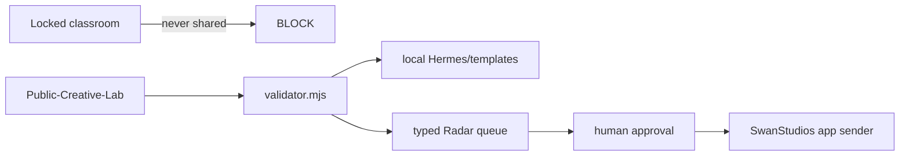
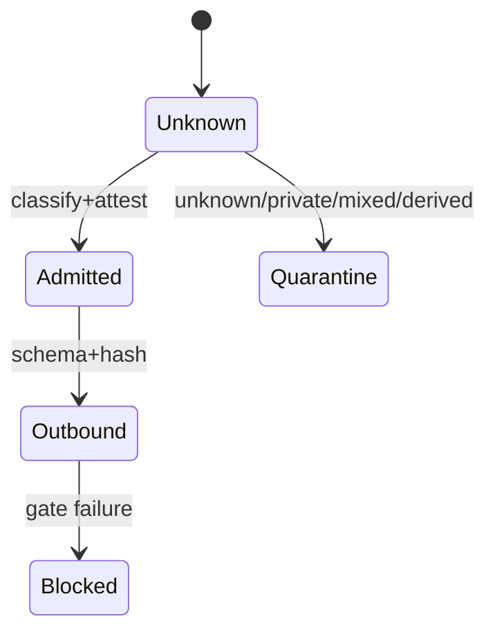
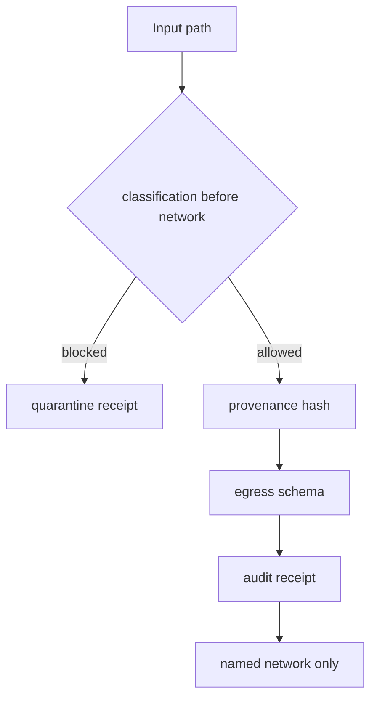
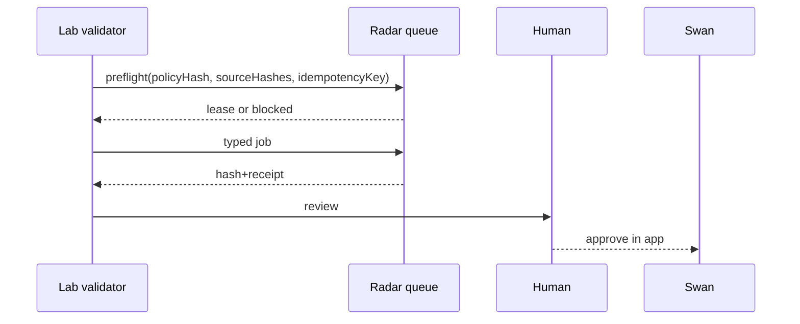
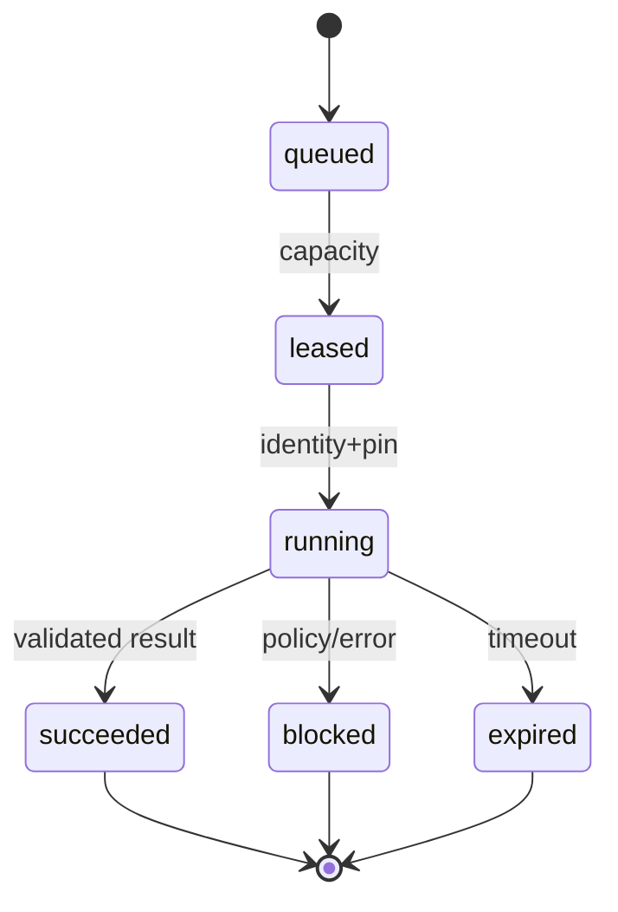
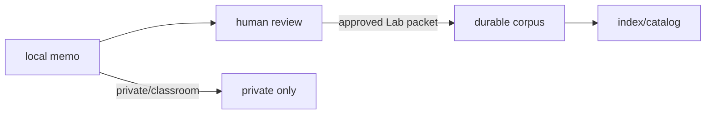
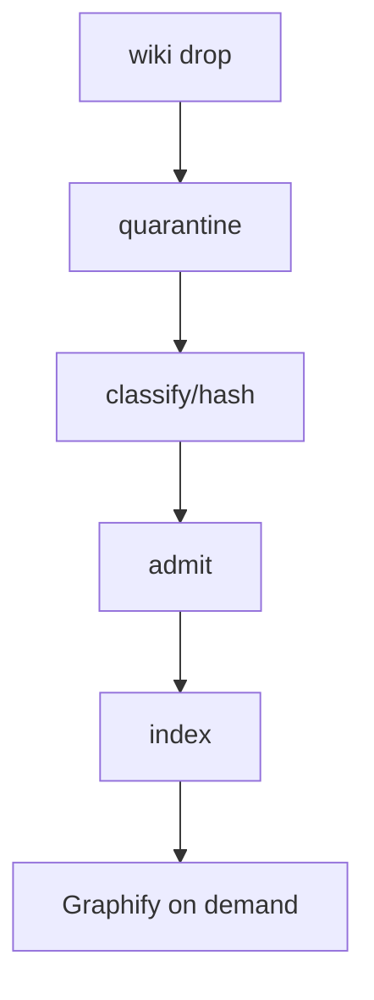
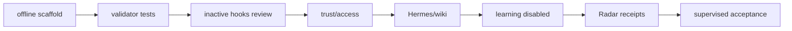

# Public-Creative-Lab hostile review and build blueprint

**Status:** LOCAL SYNTHESIS DRAFT — the Qwen seat ran privately; Ox, Grok, Kimi, and GLM remain `[UNAVAILABLE]` until the owner authorizes provider egress. This file is not an activation receipt and does not authorize hooks, Radar, transport, or credentials.
**Source freeze:** `d72131f20`; request=`ORCHESTRATOR-HOSTILE-REVIEW-REQUEST-PUBLIC-CREATIVE-LAB-2026-08-25.md`; hardware=`Apple M3, 16 GiB`; E4=`884cf34bf` + `0a088096d`.

## 0. Decision, scope, and review record

One architecture is selected: one Standard macOS account; three fresh-session front doors; a local deterministic validator/core; a small on-demand local Hermes; a separate public/synthetic/personal wiki; a typed, disconnected Radar queue client; SwanStudios remains the only sender; human approval remains mandatory. No account hopping, mounted drive, remote shell, general browser, model fallback, or classroom-data redaction path is permitted.

Seat record: Qwen 3.8 local=`REJECT` (run against the immutable handoff plus the fixed Qwen remit; the exact 204-line request file was not present as a working-tree file, so this is a bounded local input, not a claim of full five-seat coverage); P0 memory/concurrency, P0 determinism/core boundary, P0 state machine, P1 queue/backpressure, P1 tool limits, P1 offline floor, P2 hash chain/schema. Ox=`[UNAVAILABLE — provider-egress authorization not granted]`; Grok 4.6=`[UNAVAILABLE — provider-egress authorization not granted]`; Kimi K3=`[UNAVAILABLE — provider-egress authorization not granted]`; GLM 5.3=`[UNAVAILABLE — provider-egress authorization not granted]`. Local preflight=`REVISE`: one macOS account/folder boundary is not a sandbox; admission precedes network/telemetry/embedding; durable receipts/idempotency required.

Adjudication: Qwen P0 memory→accepted; P0 deterministic core→accepted; P0 state machine→accepted; P1 queue→accepted; P1 tool calls→modified to zero LLM tools in the core; P1 offline→accepted; P2 audit/schema→accepted. Local preflight→accepted. The four unavailable seats are not silently substituted; this draft must be amended with their verdicts before final activation.

Resolved older sections: generic class design is lab-only when public/synthetic/personal-nonclassroom and never classroom-derived; personal-assistant front door is Lab; Hermes read grant is shared-tier only; no always-on replica is selected; R4 placement rule is confirmed; adoption is gated by offline receipts; 5090 work is queued and never an automatic fallback; household messaging is Telegram-private and notification-only. The marketing engine is built but unarmed/unhosted; the CommunicationDraft queue is now active but delivery remains approval-gated.

## A. Filesystem and profile layout

```
~/Public-Creative-Lab/                 owner=Standard account; mode=0700; active after Phase 1
  AGENTS.md CLAUDE.md                  mode=0600; derived policy; active only in Lab
  .policy/lane-policy.json             0600; policy; active
  .policy/validator.mjs                0700; composite validator/emitter; active Phase 2
  hooks/codex.hooks.json               0600; proposed, enabled=false
  hooks/claude.settings.json           0600; proposed, enabled=false
  hooks/handlers/{session,prompt,tool,stop,end}.mjs 0700; proposed, inactive
  staging/{public,synthetic,personal-nonclassroom}/ 0700; admitted inputs only
  quarantine/{incoming,blocked,scanner-error}/ 0700; never indexed or sent
  outbound/{pending,approved,sent}/    0700; hashes/receipts only; no secrets
  audit/{events,roots}/                0700; payload-free SHA-256 chain
  hermes/{soul,memory,inbox,corpus,ideas}/ 0700; local Lab brain
  wiki/{karpathy,obsidian,indexes,graph-imports,quarantine}/ 0700; local vaults
  radar/{requests,results,receipts}/   0700; disconnected until Phase 7 approval
  messaging/{inbox,outbox}/            0700; synthetic/personal only
```

Every directory is 0700 and every file 0600 unless executable above; ownership is the existing Standard account, not the administrator account. The locked classroom Hermes profile, its credentials, unrelated home folders, browser profiles, Cloud/Radar app scopes, mounted volumes, symlinks, backup selections, file watchers, and indexes must never include or point into Lab, and Lab must never symlink/mount/copy/index/watch/back up classroom data. macOS folder permissions are an application-scoping aid, not a security sandbox; a compromised same-account process can still access permitted OS resources. Quarantine is not proof of safety.

## B. Derived rulebooks

**ONE RULE:** classify and admit content before DNS, API calls, telemetry, embeddings, transcription, remote tools, uploads, or inference; unknown or mixed content stops with no payload emitted.

Conflict order: owner decisions > source `CLAUDE.md` > compact reference > this derived rulebook > task notes; a stricter rule wins. `AGENTS.md` and `CLAUDE.md` are each ≤300 lines, generated from the same source, and carry `LANE=PUBLIC-CREATIVE-LAB; CLASS=PUBLIC|SYNTHETIC|PERSONAL-NONCLASSROOM; SESSION=<fresh-id>; FALLBACK=DISABLED`.

Exact responses: `STOP: PUBLIC-CREATIVE-LAB admission failed (<rule-id>); no network, tool, model, or write occurred; inspect receipt <receipt-id>.` Attestation=`I attest this payload is public, synthetic, or personal-nonclassroom, contains no classroom/private-derived content or secrets, and may cross only the named boundary.` Switch=`I confirm the previous session is closed, copied context is absent, and the new lane is PUBLIC-CREATIVE-LAB.` No fallback=`NO FALLBACK: the selected model/provider is unavailable; deterministic floor or BLOCK is the only result.`

Rule ledger (source rule → Lab disposition):

|1|derived styled-components only if UI|2|derived 44px controls|3|derived dark-first|4|kept ≤300 lines|5|derived headers|6|derived tokenized colors|7|derived WCAG|8|kept zero PII|9|kept no yoga language|10|dropped no charts|11|dropped no Render claim|12|kept provider permission|13|derived additive commits|14|kept documentation|
|15|kept plan first|16|kept spend gate|17|kept dual hostile pass|18|kept existing patterns|19|kept evidence language|20|derived sibling sweep|21|kept task DoD|22|derived premium UI|23|derived design critique|24|derived responsive matrix|25|derived reduced motion|26|derived receipts|27|kept surface classification|28|kept claim lock|29|derived schema cross-check|30|kept skeptic rule|31|derived route shadow|32|kept hygiene scan|33|kept file classification|34|kept no blind cleanup|35|kept lean roots|36|kept index|37|kept separate cleanup|38|kept post-task hygiene|
|39|kept recurrence/ignore|40|derived design router|41|kept closeout evidence|42|derived backend audit if app code|43|dropped styled helper unless UI|44|kept write secret scan|45|kept no rewrite|46|kept Fable final decider|47|derived no unsupervised remote work|48|kept phase audit|49|kept automated inspection|50|kept three-layer QA|51|kept confidence tags|52|kept anti-rework|53|kept wording sweep|54|kept wide grep|55|kept probes|56|kept baseline disclosure|57|kept dual-tier summary|58|kept schema drift|59|kept read secret safety|60|kept next-slice closeout|61|kept slice hostile review|
|62|derived strategy only at Swan boundary|63|kept static intelligence|64|satisfied by governing grill|65|derived routing|66|kept but inactive|67|kept live lanes|68|kept plan→worker|69|kept Hermes inbox|70|kept batch push|71|kept model/effort routing|72|kept generated catalog|73|kept proof-before-done| 

## C. Classification, provenance, egress, and schemas

States=`unknown → private|mixed|derived-from-private|public|synthetic|personal-nonclassroom`; `unknown/mixed/derived-from-private/private → quarantine|BLOCK`; `public/synthetic/personal-nonclassroom → admitted`; admitted→`outbound-pending`; human attestation→`approved`; validator failure/scanner error→`BLOCK`; any front-door change→`unknown` plus fresh session. Automated scanning cannot establish origin, absence of copied context, classroom non-derivation, consent, or legal ownership; attestation and placement remain required.

Exit codes: `0=admit`, `10=unknown`, `11=private/mixed/derived`, `12=secret`, `13=path/symlink/traversal`, `14=malformed/UTF8`, `15=oversize`, `16=scanner-error`, `20=egress-schema`, `21=revoked/replay`, `22=owner-required`, `30=disabled/offline`. Maximum serialized request=262144 bytes; paths must resolve below Lab root; symlinks, junctions, UNC, absolute paths, traversal, private/local network targets, and payload-bearing logs are rejected.

The single composite `validator.mjs` performs decode→path confinement→classification→secret scan→schema validation→policy decision→hash→payload-free audit receipt→emission under one lock; no caller may separately validate then send.

```json
{"$id":"lane-policy","type":"object","additionalProperties":false,"required":["schemaVersion","lane","allowedClasses","network","fallback","hooks"],"properties":{"schemaVersion":{"const":"1.0.0"},"lane":{"const":"public-creative-lab"},"allowedClasses":{"type":"array","items":{"enum":["public","synthetic","personal-nonclassroom"]}},"network":{"enum":["offline","named-egress"]},"fallback":{"const":"disabled"},"hooks":{"type":"object","required":["codex","claude"],"additionalProperties":false,"properties":{"codex":{"const":false},"claude":{"const":false}}}}}
{"$id":"provenance","type":"object","additionalProperties":false,"required":["receiptId","path","sha256","classification","sourceKind","attested","sessionId"],"properties":{"receiptId":{"type":"string","pattern":"^r_[A-Za-z0-9_-]{12,80}$"},"path":{"type":"string","maxLength":512},"sha256":{"type":"string","pattern":"^[a-f0-9]{64}$"},"classification":{"enum":["private","unknown","mixed","derived-from-private","public","synthetic","personal-nonclassroom"]},"sourceKind":{"enum":["file","manual","generated"]},"attested":{"type":"boolean"},"sessionId":{"type":"string","minLength":12}}}
{"$id":"outbound-envelope","type":"object","additionalProperties":false,"required":["schemaVersion","requestId","lane","classification","sourceHashes","taskCode","payload","idempotencyKey"],"properties":{"schemaVersion":{"const":"1.0.0"},"requestId":{"type":"string","pattern":"^req_[A-Za-z0-9_-]{12,80}$"},"lane":{"const":"public-creative-lab"},"classification":{"enum":["public","synthetic","personal-nonclassroom"]},"sourceHashes":{"type":"array","minItems":1,"items":{"type":"string","pattern":"^[a-f0-9]{64}$"}},"taskCode":{"enum":["review","summarize","class-design-generic","asset-brief","radar-read"]},"payload":{"type":"object","additionalProperties":false},"idempotencyKey":{"type":"string","minLength":16,"maxLength":128}}}
{"$id":"audit-receipt","type":"object","additionalProperties":false,"required":["receiptId","requestId","decision","ruleId","inputHash","previousHash","hash","createdAt"],"properties":{"receiptId":{"type":"string"},"requestId":{"type":"string"},"decision":{"enum":["admit","block","quarantine","send","replay"]},"ruleId":{"type":"string"},"inputHash":{"type":"string","pattern":"^[a-f0-9]{64}$"},"previousHash":{"type":["string","null"]},"hash":{"type":"string","pattern":"^[a-f0-9]{64}$"},"createdAt":{"type":"string","format":"date-time"}}}
{"$id":"quarantine-receipt","type":"object","additionalProperties":false,"required":["receiptId","sourceHash","reasonCode","scannerVersion","nextAction"],"properties":{"receiptId":{"type":"string"},"sourceHash":{"type":"string","pattern":"^[a-f0-9]{64}$"},"reasonCode":{"enum":["unknown","private","mixed","derived","secret","path","malformed","oversize","scanner-error"]},"scannerVersion":{"type":"string"},"nextAction":{"const":"human-review-or-delete"}}}
{"$id":"radar-request","type":"object","additionalProperties":false,"required":["schemaVersion","requestId","jobCode","classification","sourceHashes","leaseSeconds","idempotencyKey","timeoutSeconds"],"properties":{"schemaVersion":{"const":"1.0.0"},"requestId":{"type":"string"},"jobCode":{"enum":["public-fetch","deterministic-brief","queue-status"]},"classification":{"enum":["public","synthetic","personal-nonclassroom"]},"sourceHashes":{"type":"array","items":{"type":"string","pattern":"^[a-f0-9]{64}$"}},"leaseSeconds":{"const":90},"idempotencyKey":{"type":"string"},"timeoutSeconds":{"enum":[30,60,120]}}}
{"$id":"radar-response","type":"object","additionalProperties":false,"required":["schemaVersion","requestId","state","attempt","resultHash","receiptId"],"properties":{"schemaVersion":{"const":"1.0.0"},"requestId":{"type":"string"},"state":{"enum":["queued","leased","running","succeeded","blocked","failed","cancelled","expired"]},"attempt":{"type":"integer","minimum":0,"maximum":2},"resultHash":{"type":"string","pattern":"^[a-f0-9]{64}$"},"receiptId":{"type":"string"}}}
```

## D. Inactive Codex/Claude integration

`hooks/codex.hooks.json`: `{"enabled":false,"events":{"session_start":"hooks/handlers/session.mjs","prompt_submit":"hooks/handlers/prompt.mjs","pre_tool_use":"hooks/handlers/tool.mjs","stop":"hooks/handlers/stop.mjs","session_end":"hooks/handlers/end.mjs"},"timeoutMs":1500,"failure":"block"}`. `hooks/claude.settings.json`: `{"enabled":false,"hooks":{"SessionStart":"hooks/handlers/session.mjs","UserPromptSubmit":"hooks/handlers/prompt.mjs","PreToolUse":"hooks/handlers/tool.mjs","Stop":"hooks/handlers/stop.mjs","SessionEnd":"hooks/handlers/end.mjs"},"timeoutMs":1500,"failure":"block"}`. Exact mapping: start establishes fresh session; prompt requires classification attestation; pre-tool calls composite validator; stop writes payload-free receipt; end closes session and clears transient context. Exit `0` advisory pass, `10–30` block, timeout/crash=`16` block. Hooks are enforcement only at PreToolUse/egress; start/prompt/stop/end are advisory/receipt-producing. Review project trust and permissions before activation; this review activates none.

## E. Hermes, wiki, and ideas habit on M3/16 GiB

Hermes default is deterministic templates; optional local model is on-demand only, ≤1B q4, context≤8192, one request, `MemoryMax=2G`, no resident browser, no concurrent inference, and no network fallback. Qwen 3.8 27B is not a Mac default; it stays on the queued 5090 lane. Browser work is one ephemeral page with a 512MiB cap and a 5-second teardown target. If capacity is unknown, use templates and write `[UNKNOWN]` rather than loading a larger model.

`hermes/soul/derived.md` contains only Lab rules; `memory/` is local working memory; `inbox/` is local pending memos; `corpus/` is approved Lab corpus; `ideas/ideas.jsonl` is local output. Exact private memo=`~/Public-Creative-Lab/hermes/inbox/`; exact durable Lab corpus=`~/Public-Creative-Lab/hermes/corpus/`; shared learning staging=`~/Public-Creative-Lab/outbound/pending/` and transport is disabled.

Wiki ingest: copy→hash→classify→quarantine→human admission→index; Karpathy vault=`wiki/karpathy`, Obsidian=`wiki/obsidian`, indexes=`wiki/indexes`, Graphify imports=`wiki/graph-imports`; Graphify runs on demand only and never sees quarantine. Never turn a private transcript into shared material by redaction. The never-in test asserts no path, hash, or content from classroom/private roots enters any Lab index or envelope.

Ideas habit: proposed disabled launchd job `com.swan.public-creative-lab.ideas`, 20:00 local daily, input=`hermes/corpus` only, output schema `{ideaId,sourceHashes,idea,classification,status,createdAt}`, budget `$0`, feedback=`hermes/ideas/feedback.jsonl`, safety line=`SAFETY: public/synthetic/personal-nonclassroom only; no classroom/private-derived input; transport disabled.` It remains disabled until `[OWNER ACTION]` approves the exact file and schedule.

## F. Radar, workstation, and messaging contracts

The laptop is a queue client, never a Radar host. It holds no production-DB credential, user token, admin capability, shell, mounted share, browser session, or send credential. The future endpoint is a named service identity with certificate/public-key pin, scope=`public-creative-lab:job`, independent revocation, 90-second lease, FIFO single-worker fairness, idempotency key=`sha256(lane|jobCode|sourceHashes|inputHash)`, max attempts=2, per-job timeout≤120s, cancellation on owner-busy, and result quarantine on any mismatch. Automatic fallback is forbidden; route stays disconnected until receipts are reviewed and approved.

Typed queue path: `validator.mjs → radar/requests/*.json → lease → deterministic worker → radar/results/*.json → validator.mjs → radar/receipts/*.json`; free text is rejected in `jobCode`, `state`, `classification`, and policy fields. Owner busy returns `blocked` without retry storm. Cloud/Radar preflight requires policy hash, source hashes, certificate pin, revocation check, replay check, and human approval receipt.

Household path: dedicated private Telegram household chat, never classroom front door. Allowed payload is `{messageId,authorRole,classification,bodyHash,body,createdAt}` where classification is public/synthetic/personal-nonclassroom; forbidden are classroom/private-derived bytes, secrets, credentials, client data, links that trigger actions, and approval commands. Retain 30 days locally, notify only, no durable learning by default; SwanStudios app remains the sole sender and human approval boundary. Positive tests prove the classroom path cannot publish to this channel.

## G. Visuals and wireframes


Fallback: three isolated doors converge only on an admission receipt; only the app sends.

Fallback: every unsafe transition terminates without payload.

Fallback: no DNS precedes the classification diamond.

Fallback: one lease, one result hash, one human decision.

Fallback: max two attempts and no fallback model.

Fallback: redaction never promotes private content.

Fallback: Graphify cannot read quarantine.

Fallback: every edge has a red stop and rollback; P7 is not implied by P6.

Wireframes (paths in brackets):
```
[~/Public-Creative-Lab/hooks] FRONT DOOR  Classroom | Lab | Cancel
```
```
LANE=PUBLIC-CREATIVE-LAB  CLASS=PUBLIC  SESSION=fresh  FALLBACK=DISABLED
[~/Public-Creative-Lab/AGENTS.md]
```
```
Switch to Lab? close prior session / clear context / attest class  [Confirm]
```
```
BLOCKED  reason=derived-from-private  receipt=r_...  No network or retry  [Quarantine]
```
```
PRE-EGRESS  class public  hashes 2  schema 1.0.0  destination named  [Attest] [Cancel]
```
```
RADAR  queued 1 | leased 0 | owner-busy 0 | blocked 0  [View receipt]
```
```
LEARNING  source hashes | class | reviewer | status=draft  [Approve] [Reject]
```
```
OFFLINE  deterministic floor available  network disabled  [Save local memo] [Exit]
```

## H. Synthetic-only test matrix and commands

Command sequence: `node .policy/validator.mjs --self-test --offline`; `node --test tests/lab/*.test.mjs`; `node scripts/scan-secrets.sh --staged`; `node .policy/validator.mjs --positive-control`; expected acceptance=`all required rows pass, all positive controls observe traffic/write, zero network calls in Phase 1/2, zero payloads in receipts/logs`.

|fixture/action|decision|exit|receipt/gate|
|public text|admit|0|provenance/admission|
|synthetic text|admit|0|provenance/admission|
|personal-nonclassroom text|admit|0|attestation|
|unmarked|block|10|quarantine/classification|
|unknown|block|10|quarantine|
|mixed/private-derived|block|11|quarantine/never-in|
|secret-shaped/JWT/DB URL|block|12|no echo/write scan|
|absolute/UNC/local-network URL|block|13|path/egress|
|symlink/junction/traversal|block|13|path confinement|
|malformed JSON/invalid UTF-8|block|14|parse receipt|
|262145-byte input|block|15|size receipt|
|scanner throws|block|16|scanner-error receipt|
|schema widening/free text|block|20|schema gate|
|expired/revoked identity|block|21|revocation receipt|
|replayed request|block|21|idempotency receipt|
|hooks disabled|block|30|disabled receipt|
|model switch|block|30|lane unchanged/no fallback|
|resume/compaction/copied context|block|10|fresh-session receipt|
|offline startup|admit floor|0|offline receipt|
|Cloud/Radar outage|floor/block|30|no retry storm|
|certificate mismatch|block|21|pin receipt|
|duplicate result|block|21|result hash|
|timeout|expired|30|lease receipt|
|owner busy|blocked|30|fairness receipt|
|app reads outside Lab|block|13|positive path receipt|
|learning not allowlisted|block|11|no transport|
|draft auto-push attempt|block|30|human-review gate|
|payload receipt/log inspection|pass|0|hashes only|
|positive network harness|observed|0|must prove observation|
|positive file-write harness|observed|0|must prove write observation|

## I. Eight mechanical phases

1. **Offline scaffold.** Preconditions: one Standard account, classroom profile untouched. Mutate the tree/policy only. Verify `find ~/Public-Creative-Lab -type l` is empty and mode/owner manifest matches. Rollback: remove only new Lab tree. Red stop: any classroom path, symlink, or unknown class. Remains disabled: hooks, Radar, transport, ideas.
2. **Validator/tests.** Preconditions: Phase 1 manifest. Add composite validator and synthetic fixtures/tests. Verify offline command sequence and positive controls. Rollback: remove validator/tests, preserve quarantine receipts. Red stop: scanner fail-open, payload log, network call, or any unexpected exit. Remains disabled: hooks/Radar/cloud.
3. **Inactive hook review.** Preconditions: Phase 2 green. Add exact JSON blocks with `enabled:false`; owner reviews hashes. Verify parse, event map, timeout, fail-closed tests. Rollback: delete proposed hook files. Red stop: enabled flag, path outside Lab, or no failure behavior. Remains disabled: all hooks.
4. **Project trust/access.** Preconditions: owner accepts the limits of macOS permissions. Restrict Cloud/browser app folders to Lab; start fresh sessions; run outside-root and context-copy tests. Rollback: revoke app folder access and close sessions. Red stop: any classroom visibility or inherited context. Remains disabled: hooks/transport.
5. **Hermes/wiki.** Preconditions: Phase 4 never-in passes. Create local brain/vault/indexes and optional ≤1B model profile. Verify memory cap, offline startup, quarantine, Graphify-on-demand. Rollback: remove indexes/model cache, retain payload-free receipts. Red stop: model pressure, private-derived admission, or network fallback. Remains disabled: shared learning/Radar.
6. **Learning staging.** Preconditions: local corpus and mistakes/feedback sections exist. Create allowlisted draft packet path; require human approval; test no auto-push and no private-to-shared redaction. Rollback: quarantine pending packets. Red stop: allowlist mismatch or transport attempt. Remains disabled: transport and ideas schedule.
7. **Radar receipts/connection.** Preconditions: owner approves endpoint identity, pin, revocation, lease, and resource limits `[OWNER ACTION]`. Add queue client only; run synthetic request/response/replay/timeout/owner-busy tests. Rollback: disconnect route, delete pending requests, retain receipts. Red stop: missing pin, production credential, default-deny proof, or fallback. Remains disabled: Cloud/Radar until every receipt is reviewed.
8. **Supervised acceptance.** Preconditions: all prior gates and four external seat verdicts appended. Owner reviews manifest, inactive hooks, schemas, receipts, and test report. Run one synthetic supervised job and one offline fallback. Rollback: disable launchd/hooks, disconnect Radar, quarantine outputs. Red stop: any unknown, mixed, private-derived, provider retention uncertainty, or missing receipt. Final activation requires explicit owner approval; no automatic push.

## J. Open gates, evidence, and handoff

Unresolved owner actions are not architecture choices: `[OWNER ACTION]` provider-egress authorization; R2/healthcheck credentials; shared-Hermes read scope; replica decision; class-placement confirmation; Radar browser-tree ownership; inbox cleanup; Tailscale; DMARC. Until then, the deterministic local plan remains valid but external seats, hooks, learning transport, and Radar remain disabled. This draft must not claim five-seat adjudication or final completion.

Required final amendment: append four independent seat records, adjudicate each finding, recompute the packet hash/blob, commit this one file additively, and report commit plus blob SHA. Only after that and all eight phases may the batch be pushed; before any backend push run both Rule-42 audits, preserve unrelated dirty work, verify branch/deploy/asset/health evidence, and never push `main` without explicit approval.

PANEL GATE REMAINS OPEN — do not activate hooks, shared learning, Radar, or external model routing until the missing seats and owner receipts are complete.
