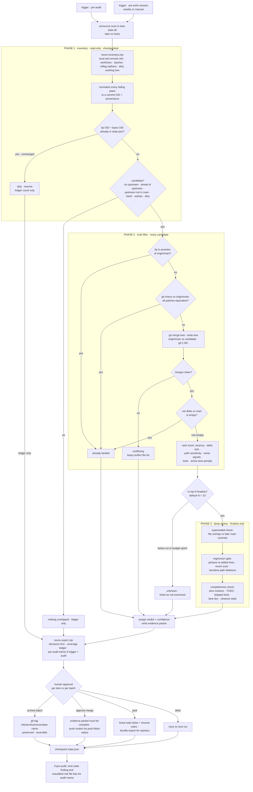
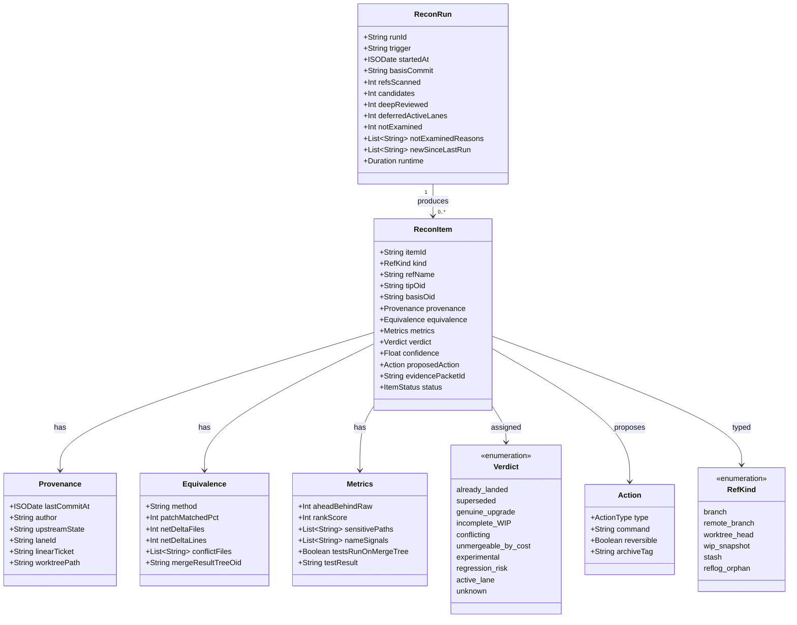

# GLM Consult

**Model:** glm-5.3
**Document:** c:/tmp/reconcile-skill-brief.md
**Tokens:** 2163 in / 25671 out (reasoning: 18889) | total 27834
**Wall:** 386.7s

---

# `unshipped-recon` — a pre-audit reconciliation skill for SwanStudios

Three load-bearing ideas before the deliverables:

1. **Never count commits; measure net delta.** Every number in this design comes from `git merge-tree` content comparison, not `ahead N`. The store-inquiry-button case (ahead 68, real delta 1 commit) is the calibration fixture, not an edge case.
2. **Normalize every hiding place to a commit OID + provenance.** Branches, stashes, reflog orphans, and even the 419 dirty files (via a synthetic snapshot commit) all become "a commit to test against origin/main." One truth filter, six input sources.
3. **The report sells decisions, not data.** If run #3 doesn't take under 60 seconds and produce ≤3 human decisions, this skill joins the ten open tabs it was built to replace.

---

## 1. Blueprint

### Purpose
Before any audit or major work session, answer: *what work exists that origin/main does not represent, is each piece better or worse than what's live, and what happens to each piece* — with a machine-verified truth filter, a capped decision budget for the human, and an honest ledger of what was *not* examined.

### Scope
- Inventory: local branches, remote non-main branches (pushed-but-unmerged is also unshipped — audits read main), worktrees, stashes, detached-HEAD/reflog-only commits, uncommitted working tree (tracked + untracked).
- Classification against `origin/main`: content-equivalence → net delta → verdict.
- Actions *proposed*, never executed without approval: archive (tag-first), merge-prep (evidence packet), park (linear-todo ticket), preserve (bundle export for orphans / push-to-private-remote for no-upstream branches — **backup is not shipping**, but 31 branches existing only on one laptop is a fire risk worth its own flag).

### Non-goals
- Not a merge bot. Not the audit. Not mainline catch-up (the current branch being 1,947 behind is **drift-check's** job; recon reports the number and hands off).
- Not drift-check's duplicate: drift-check says "main moved past you"; `unshipped-recon` says "you moved past main and never told anyone." Inverse directions, deliberately paired.
- Not a scheduler. It does not create founder time; it triages what founder time should buy (see Failure #2).

### Trigger conditions
- **Hard:** immediately before any security/quality audit (blocks memo emission until run completes or is explicitly overridden).
- **Soft:** pre-work-session, weekly cadence or manual.
- **Phase 4 only:** SessionStart heartbeat — a <2s candidate-count check that nudges only when the count changes materially. A daily nag gets disabled by day 4; this is designed to survive.

### Architecture — why skill + script + (eventually) hook (Open Q3)
| Layer | What | Why |
|---|---|---|
| `recon-inventory.mjs`, `recon-classify.mjs`, `recon-report.mjs` | Deterministic scan, truth filter, checkpointing, report generation | 409 refs × git calls is a job for a script: cheap, resumable, zero LLM tokens, same output every time |
| `SKILL.md` (`unshipped-recon`) | Judgment layer: verdict rules, evidence bars, escalation, integration with drift-check / stale-check / agent-lane / linear-todo / push-blast-radius | Deciding "superseded vs genuine-upgrade" requires reading a diff and naming intent — that's agent work |
| SessionStart hook (Phase 4) | Heartbeat nudge only | Hooks run constantly; anything expensive there gets ripped out within a week |

### Integration map (extend, never reinvent)
- **drift-check** — paired invocations: recon pre-audit, drift-check pre-work. Recon cites drift-check numbers for the current branch rather than re-deriving them.
- **agent-lane / lane-session-start** — recon reads lane locks and worktree liveness to produce `active-lane` verdicts; writes a courtesy "scanner ran" note into the lane state dir (additive file) so agents aren't surprised.
- **linear-todo** — "park" is *defined as* "ticket with resume notes," not "forget."
- **push-blast-radius** — every approved merge routes its push through this gate. Recon never pushes.
- **stale-check** — carried-forward `unknown` items re-verify before re-reporting.
- **hermes-closeout-gate** — a lane that passed closeout is evidence for "complete-but-unpushed" over "incomplete-WIP."

### Safety envelope
- **Read-only default.** The scan mutates nothing. Sanctioned-additive exception: recon may write loose objects and create refs under `refs/recon/*` and `refs/archive/recon/*` (additive refs cannot destroy data; recon excludes its own namespaces from inventory and prunes old snapshots only with approval). No working-tree checkout, ever; deep test runs use an ephemeral worktree under `.recon/tmp` behind an opt-in `--deep` flag.
- **Archive = preserve.** Tag first (`refs/archive/recon/<date>-<name>`), optionally bundle-export. Local branch removal is a separate, explicit, opt-in command. The report never claims irrelevance of preserved work — only "zero net delta vs main at basis `<OID>`."
- **No secrets/PII.** Reports contain paths, counts, OIDs, and commands — never file contents or diff bodies. Evidence packets (which do contain diffs, because a human must read them) live only in `.recon/evidence/`, gitignored. Secret-pattern filename matches (`.env*`, `*dump*`, `*.sql`…) are flagged by name only, and the report says names are withheld.
- **Resumable.** `state.json` checkpoints per item keyed on `(tipOid, basisOid)` — if either moves, the equivalence result is invalid and recomputed. This pair-keying matters (see Failure #1).
- **Honest coverage.** Every report carries a ledger: scanned / candidates / deep-reviewed / deferred / not-examined-and-why.

### Cost model (what runs where)
| Tier | Runs on | Per-unit cost | Tools |
|---|---|---|---|
| 0 — census | all ~420 refs | ms (one `for-each-ref` batch) | metadata, dates, upstream state |
| 1 — truth filter | candidates only (~70) | 50–200ms | `merge-base --is-ancestor`, `git cherry`, `merge-tree --write-tree` |
| 2 — deep review | finalists (top N=10) | 10–60s | pickaxe `-S`, log walks, TODO scans, completeness signals |
| 3 — human | ≤3 decisions | founder time | the report |

Ranking score: `recency + log(netDelta) + pathSensitivity(auth/payment/PII/migrations=3, api=2, else 1) + nameSignals(p0/safety/hotfix/sec/fix = 3) + hasTests − activeLanePenalty(defer)`.

### Git facts relied on — and where I'm unsure
- Confident: `git cherry <upstream> <head>` marks patch-id-equivalent commits `-`; needs a sane merge-base; patch-ids break under rebase-with-conflict-resolution.
- Version dependency: `git merge-tree --write-tree` (ephemeral merge, no working tree) needs git ≥ 2.38. Fallback on older git: cherry + three-dot-diff heuristic, reported at reduced confidence. I believe `--write-tree` exits nonzero and emits conflict info on conflict — worth a Phase 1 test rather than assuming.
- **Unsure:** whether `git stash create` captures untracked files (I believe it does not). The design does not depend on it: untracked files are snapshotted via `hash-object` + a synthetic `commit-tree`.
- **Unsure:** `git fsck --unreachable` cost on this repo. Measured in Phase 0; if >2 min it becomes skippable with an explicit "orphans not examined" ledger line.
- Reflog-only commits can be gc'd between runs — orphan inventory warns and proposes bundle export immediately.

### Answers to the remaining open questions

**Q1 — Minimum evidence before "merge this."** All four machine gates, or the verdict degrades (to `conflicting` or `unknown`), never "upgrade with fingers crossed": (1) net delta > 0 on `merge-tree` basis = current `origin/main`; (2) clean merge, or trivial conflicts resolved *in the packet* with rationale; (3) regression gate — no pickaxe hits (no lines the branch adds were removed by later main commits), no sensitive-path deletions, no overlapping `fix/sec/CVE` commits on main since branch date (any hit forces human review); (4) provenance — a named intent (branch name, lane doc, or commit messages). Then a human, then push-blast-radius.

**Q2 — Incomplete vs complete-but-unpushed.** Signals of *incomplete*: slice markers in name/lane doc ("slice 0 of 3"), TODO/FIXME/`console.log`/`debugger` in added lines, skipped tests, tests whose imports don't resolve, no closeout marker (hermes-closeout passed, changelog/docs touched). Signals of *complete*: green targeted tests on the merge tree + closeout marker. Output is a confidence score; below threshold → `unknown`, because guessing here creates both false parks and false merges.

**Q4 — Avoiding week-two abandonment.** Delta-only steady-state reports (suppress unchanged items), hard cap of 3 human decisions per run (overflow auto-tickets), one batched reversible command for the zero-delta class, runs tied to events (audits) not calendars, and a visible debt trend (`409 → 61 → 58`) so the skill pays rent in relief.

**Q5 — The 419 dirty files right now.** Never blocks, never commits. Clustered by path prefix into WIP clusters (3 in the current repo, roughly docs/, payments/, scratch/), snapshot to a synthetic commit for safety and analysis, flag clusters mixing unrelated concerns, flag secret-pattern filenames by name only. The working tree is a first-class inventory item, not background noise.

**Q6 — Parallel agents.** Read-only scan takes no locks. Worktree liveness + lane locks + recent commits (<48h) → `active-lane` verdict: deferred, never archived, lane owner named in report. The courtesy note in the lane state dir prevents "unknown scanner" panic.

---

## 2. Flowchart — invocation to verdict per item



---

## 3. Data model — the reconciliation item



Field notes: `basisOid` on the *item* (not just the run) is what makes resume safe — equivalence results are invalidated when main moves. `aheadBehindRaw` is stored for the "numbers that correct your memory" section only; it never feeds verdicts.

---

## 4. Wireframe — the report

**First-run / pre-audit report** (decisions at top, commands inline, everything batched below):

```
╭─────────────────────────────────────────────────────────────────────╮
│ UNSHIPPED-RECON · 2026-08-12 09:14 · trigger: pre-audit · 4m 12s     │
│ coverage: 409 local + 12 remote refs · 71 candidates · 8 deep        │
│           2 deferred (active lanes) · 12 not examined (see below)    │
╰─────────────────────────────────────────────────────────────────────╯
 ⚡ 3 DECISIONS — everything else is batched or deferred

 1 MERGE      claude/equipment-p0-safety        5w old · P0 paths
              net delta 14 files (auth/, equipment/) · clean merge
              regression gates: patch-level clean · tests 41/41 on tree
              evidence: .recon/evidence/E-0142 · approve:
                git merge --no-ff claude/equipment-p0-safety
              (push routes through push-blast-radius)

 2 QUARANTINE codex/prod-smoke-sw-fix           regression-risk ⚠
              re-adds 6 lines main removed in 5f3a9c1 "authz scope"
              merge proposed by no one · review: .recon/evidence/E-0147

 3 FINISH?    claude/qa-harness-slice0-…      incomplete · 4h · live lane
              lane doc: slice 1 of 3 · parked → SS-2214 w/ resume notes

 ✂ ARCHIVE  33 branches = ZERO NET DELTA vs main (squash-merge phantoms)
             one reversible command, tags first, nothing discarded:
                recon-archive --batch B-0812
 🛟 BACKUP   31 branches have no upstream — they exist only on this Mac
                recon-bundle --all-unpushed     (writes .recon/bundles/)

 ── numbers that correct your memory ────────────────────────────────
   "121 commits ahead" → 6 files of genuine delta
   "409 branches"      → 38 real items (9 actionable, 29 parked)
   419 dirty files     → 3 WIP clusters: docs/ · payments/ · scratch/
   ⚠ 3 untracked files match secret-name patterns — names withheld,
     listed only in .recon/evidence/E-0151 (never pasted anywhere)

 ── not examined (so you know) ──────────────────────────────────────
   12 branches ranked below cut-off (pre-2026, small delta)
   semantic-regression check NOT run on 6 of 8 finalists (no --deep)

 ── pre-audit memo ──────────────────────────────────────────────────
   audit reads origin/main @ 9c1e4ad. Not represented there:
     stale findings likely: auth/permissions.ts (E-0142 fixes what the
                            last audit flagged as finding #4)
     unaudited new risk:   payments/webhook-retry.ts (never reached
                            main = never audited)
   attach this memo to the audit request.
```

**Steady-state delta report (what week 3 actually looks like):**

```
╭───────────────────────────────────────────╮
│ RECON delta · 2026-08-26 · 41s · 1 change │
╰───────────────────────────────────────────╯
 1 FINISH? claude/launch-audit-lane5  slice 2 of 2 · tests 12/12
           → SS-2299 (ticketed 3× already · escalation: kept, not aged)
 branch debt: 409 → 61 → 58 ▼ · parked 29 · finished 0 ⚠ 3 weeks
```

---

## 5. Verdict taxonomy

| Verdict | Detection signal | Required evidence | Default action | Risk if misapplied |
|---|---|---|---|---|
| `already-landed` | merge-tree net delta empty, or cherry all `-`, or ancestor | basis OID pinned | batch archive (tag first) | real work archived — recoverable via tag, but trust damage is not |
| `superseded` | net delta non-empty, but overlapping files changed later on main with same-intent commits | overlap list + main commit refs + human confirm on sensitive paths | archive with pointer to the main commit that superseded it | a still-better version quietly shelved |
| `genuine-upgrade` | net delta > 0, clean merge, all 4 evidence gates green | evidence packet E-### | propose merge → human → push-blast-radius | **highest severity:** reintroduces a fixed vulnerability if the regression gate misses a semantic revert |
| `incomplete-WIP` | slice markers, TODO/FIXME in delta, skipped tests, lane doc lists remaining slices | completeness signal list + confidence score | park → linear-todo ticket with resume notes | finished work rotting as "WIP" forever — parked ≠ protected |
| `conflicting` | merge-tree reports conflicts | conflict file list | human review packet | attention cost only |
| `unmergeable-by-cost` | behind main > ~500 AND conflicts high AND delta small | counts + conflict list | archive with extracted diff packet, note "rewrite is cheaper than rebase" | diff packet never read = silent death with paperwork |
| `experimental` | name signals (spike/poc/try) or throwaway-only paths | name + touched paths | park/archive | low |
| `regression-risk` | pickaxe hits: branch re-adds lines main removed; or reverts a later fix commit | main fix commit refs + matched hunks (packet) | **quarantine — merge forbidden pending human** | false positive → flag fatigue; false negative → the disaster case |
| `active-lane` | live worktree, lane lock held, or commits < 48h old | agent-lane registry lookup | defer + notify lane owner | near-zero by construction (never archived) |
| `unknown` | insufficient evidence, below rank cut, or budget exhausted | explicit reason recorded | not-examined list; optional ticket | unknowns accumulate silently → skill read as useless |

The owner's binary maps cleanly: *upgrade* ≈ `genuine-upgrade`; *downgrade* ≈ `superseded` / `experimental` / `unmergeable-by-cost` / `incomplete-WIP`-parked. The added verdicts exist because `regression-risk` must be **unmergeable by construction**, `active-lane` must be untouchable, and `unknown` must be a respectable answer rather than a guess.

---

## 6. Phased build plan

| Phase | Ships | Independently useful because | Success metric |
|---|---|---|---|
| **0 · Census** (½–1 day) | `recon-inventory.mjs`: all refs local+remote, worktrees, stashes, reflog orphans, dirty-file counts; naive age-sorted table | Replaces "ten tabs" terror with one list; surfaces the 31 no-upstream backup fire | Owner sees all 409 with dates |
| **1 · Phantom purge** (1–2 days) | Truth filter (ancestor → cherry → merge-tree); batch tag+archive command; report v0; calibration fixtures | The single biggest relief: expected mass of zero-delta branches becomes one reversible command | `claude/store-inquiry-button` classifies "1 commit real, not 68"; branch count drops by the calibrated amount |
| **2 · Verdicts** (2–3 days) | Ranking, top-N gate, full verdict assignment, the real report wireframe, coverage ledger, resume state, WIP clustering | First pre-audit memo ships — the originating purpose is live | Pre-audit memo attached to an actual audit |
| **3 · Judgment** (3–5 days) | Deep review: superseded, regression gates, completeness heuristics, evidence packets, opt-in `--deep` test runs in ephemeral worktrees | Merge recommendations become evidence-backed instead of vibes | One `genuine-upgrade` merged through the full gate; a planted regression caught in dry run |
| **4 · Habitability** (ongoing) | Delta-only reports, linear-todo auto-ticketing, SessionStart heartbeat, drift-check pairing | The skill survives contact with week three | Report read < 60s; ≤3 human decisions/run; debt trend visibly declining |

Phase 1's calibration fixtures double as acceptance tests: the four measured example branches from the brief must classify as expected before anything archives.

---

## 7. The three ways this skill fails

### Failure 1 — Correlated misclassification, amplified by batch archive
The scariest failure isn't one wrong verdict; it's forty wrong verdicts from one cause. The `claude/*` branch family shares merge-bases — fork branches off branches, as parallel-agent repos always do — so a single skewed merge-base (after a force-push, a history rewrite, or an unusual rebase topology) poisons `git cherry` results for an entire family at once. My design then does the worst possible thing with that error: it *batches* it. Forty `already-landed` verdicts print simultaneously, and the one-command archive — the feature that makes Phase 1 feel miraculous — executes the mistake at scale. My resume mechanism makes it worse unless keyed correctly: if checkpoints were keyed on tip OID alone, stale equivalence results would survive across runs because branches didn't move even though main's basis did. That's why the state key is `(tipOid, basisOid)` — but note the counter-pressure: every busy day on main invalidates *all* equivalence records, cost creeps toward full rescans, and the owner starts skipping runs (which is Failure 2 wearing a different coat). Mitigations: equivalence must be confirmed on two different bases before archive-eligibility, batch sizes capped, and archive is tag-first so the error is reversible in git and irreversible only in trust. Residual risk: accepted. The design bets that a correlated git pathology is rarer than the everyday chaos it fixes — a bet, not a proof.

### Failure 2 — Decision debt: the skill becomes tab #11, and "park" is silent death with paperwork
The first run is a high: 77 → 1, 409 → 38. The third run is a guilt list. The hard items — the twelve `conflicting`, `incomplete-WIP`, and `unknown` branches that need actual founder judgment — reappear every single run, because incomplete slices need focused sessions the founder demonstrably doesn't schedule (that's why the branches exist). My own aging policy is the trap: after three appearances, unresolved items auto-park into linear-todo. But a ticket queue the founder also doesn't read is just the original problem — work silently dying — with better metadata. The bitterest version: `claude/equipment-p0-safety`, the exact branch this skill exists to rescue, gets ticketed, aged, and buried, and the skill *facilitates* the abandonment while feeling productive about it. Mitigations: top-3 decision cap, delta-only suppression, sensitivity-weighted aging (P0/safety/auth/payment items **never** age out — they escalate), and a self-snitch line in the report when park-rate exceeds finish-rate for weeks ("parked: 29 · finished: 0 · 3 weeks"). Residual risk: irreducible by software. The skill can triage founder time; it cannot manufacture it, and an honest design says so out loud.

### Failure 3 — Regression theater: "no signals detected" manufactures false confidence
The brief names the highest-severity failure — merging a stranded branch that re-introduces a fixed vulnerability — and my gates are weakest exactly there. The pickaxe/regression checks are *textual*: they catch a branch that re-adds lines main removed. They do not catch `claude/equipment-p0-safety` rewriting `canAccess()` wholesale with pre-fix logic plus new checks — that merges cleanly, matches no removed line, and reinstates the vulnerable *behavior* with innocent-looking *text*. The only real defense is a regression test for the original fix running against the merge tree — which requires the fix to have a test, requires `--deep` mode (opt-in, slow, skipped on lazy days), and requires the test not to be quarantined as flaky. So the report prints a tidy row of green checkmarks, the founder reads "regression gates: clean" as "safe," and the checkmark *displaces* the vigilance a scary-looking unknown would have provoked. A confident wrong answer is worse than no answer. Mitigations: absence-of-evidence phrasing ("checked: patch-level reverts · **not checked**: semantic equivalence of rewritten functions"), mandatory `--deep` full suite for sensitive-path merges, regression flags tuned noisy on auth/payment/PII. And here is the honest bind: the fix for Failure 3 — more gates, more flags, more mandatory runs — directly worsens Failure 2, the boredom death. Tuning this trade-off is the real design work of Phase 3, and I do not believe it has a complete solution — only a dial, a human, and a report that must keep admitting what it did not look at.

---

*Design posture, restated: an 80%-right skill that runs before every audit beats a complete one the founder ghosts by September. Every phase above ships standalone value; the failure modes above are the price of that choice, stated rather than discovered.*
