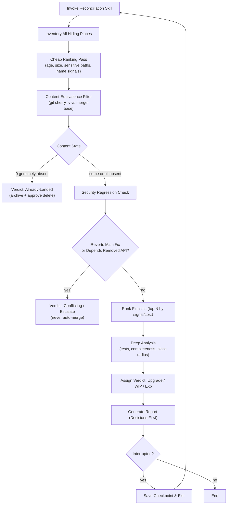
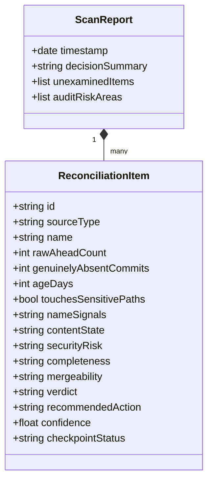

# Tencent Hy3 - Design Inspiration

**Reviewer:** `tencent/hy3` (high)
**Document:** c:/tmp/reconcile-skill-brief.md
**Seed:** (none)
**Tokens:** 2221 in / 6981 out | **Cost:** ~$0.0040 | **Wall:** 164.5s | **finish_reason:** stop

---

# Pre-Audit Reconciliation Skill — Design Blueprint

---

## 1. Blueprint

**Purpose**  
A reusable skill that runs *before* any security/quality audit or major work session to answer: *"What work exists that hasn't reached production, is it better or worse than what's live, and what should happen to each piece?"* It is the **inverse** of `drift-check` (which warns you that you are behind; this warns you that main is missing your work).

**Scope**  
- Inventory unshipped work across all hiding places: working tree, stashes, reflog orphans, worktrees, local branches (with/without upstream).  
- Filter phantom work via content-equivalence (`git cherry` / patch-id).  
- Triage at scale (409 branches) using a cheap ranking pass; deep-analyze only finalists.  
- Output a decision-led report for the owner and an audit-impact statement.

**Non-Goals**  
- Not a merge/rebase/push tool (read-only by default; actions require explicit per-item approval).  
- Not a replacement for `drift-check`, `stale-check`, or `agent-lane` — it integrates and defers to them.  
- Never deletes or drops anything ("archive" = tag/bundle/pointer).

**Trigger Conditions**  
- Manual: `skill:pre-audit-recon` before running an audit or starting a big session.  
- SessionStart hook: lightweight inventory only (no deep analysis) to surface "you have N unpushed upgrades".  
- Pre-audit gate: blocks audit if unaudited risk in sensitive paths is detected and unacknowledged.

**Integration Points**  
- `drift-check` (inverse direction; share merge-base logic).  
- `agent-lane` / `lane-session-start.mjs` — respect file locks; skip locked worktrees.  
- `linear-todo` — write parked/escalated items as board cards.  
- `push-blast-radius.mjs` — reused as the pre-merge safety check before any "push" recommendation.  
- `stale-check` — re-verify a carried-forward "archive" decision before repeating it next session.

**Open Questions Answered**  
1. *Min evidence to merge:* Genuinely-absent via `git cherry` + no security-revert signal + passes lint/test against current main + `push-blast-radius` clean.  
2. *Incomplete vs complete:* Branch-name signals (`slice`/`wip`), TODO/FIXME density in diff, unclosed Linear ticket, last commit message tense.  
3. *Skill vs hook vs script:* **Combination** — script does cheap scan (scale), skill gives agent judgment framework, SessionStart hook ensures it isn't ignored.  
4. *Avoid ignoring:* Lead with decisions, cap deep analysis to top N, never require reading 409 rows.  
5. *419 uncommitted files:* Immediately `git stash` with named tag (`recon-stash-<date>`) and list in report; never silently include in "upgrades".  
6. *Parallel agents:* Read-only across worktrees; never touch lane-locked paths; report which worktrees were skipped.

---

## 2. Flowchart (Mermaid)



---

## 3. Data-Model Diagram (Mermaid)



---

## 4. Wireframe — Owner Report (Information Design Emphasis)

**Design principles applied:** Inverted pyramid (decision → action → risk → evidence). No raw branch dumps. ASCII markers `[PUSH]`/`[ARCHIVE]`/`[HUMAN]`/`[RISK]` for 60-second scan. Grouped by *action*, not by *branch*.

```text
================================================================================
 PRE-AUDIT RECONCILIATION  |  2026-08-15 09:00  |  local main is 1,947 behind
--------------------------------------------------------------------------------
 DECISION SUMMARY (read this first)
   [AUDIT MAIN] -> Safe to audit, EXCEPT 1 unaudited risk area (see below)
   [ACTION]     -> 2 upgrades to PUSH, 1 to ARCHIVE, 1 needs YOUR call
   [RISK]       -> codex/prod-smoke-sw-fix reverts a security fix on main

 WHAT TO DO (ordered by priority)
  1. [HUMAN]  codex/prod-smoke-sw-fix : behind 2,269, REVERTS auth fix -> don't audit/touch
  2. [PUSH]   claude/equipment-p0-safety : genuine P0 safety, absent on main
  3. [PUSH]   claude/qa-harness-slice0 : active, tests pass, absent
  4. [ARCHIVE] claude/launch-audit-lane5 : incomplete WIP, 11d stale -> park

 UNAUDITED RISK (not on origin/main; audit will miss this)
   - auth/  : equipment-p0-safety has unpushed access-control logic
   - payments/ : verified NO unpushed changes (safe)

 WHAT WE DID NOT EXAMINE (honest scope)
   - 360 of 409 branches: filtered as already-landed via patch-id (spot-check advised)
   - 419 uncommitted files: stashed to 'recon-stash-2026-08-15' for your review
   - 2 worktrees locked by agents: skipped per lane policy

 DETAILS (finalists only)
 > claude/equipment-p0-safety
   State: genuinely-absent (1 commit), touches auth/
   Verdict: genuine-upgrade | Conf: 0.8
   Evidence: git cherry absent; no revert; lint clean
 > codex/prod-smoke-sw-fix
   State: absent BUT reverts 'fix: CVE-2024-auth' on main
   Verdict: conflicting/escalate | Conf: 0.9
================================================================================
```

---

## 5. Verdict Taxonomy Table

| Verdict | Detection Signal | Required Evidence | Action | Risk if Wrong |
|---|---|---|---|---|
| **already-landed** | `git cherry` shows 0 absent | Patch-id match vs main | Archive tag + approve delete (never auto) | False positive deletes real work |
| **superseded** | Same files, different patch-id on main | Main diff solves same issue | Park / archive | Owner redoes solved work |
| **genuine-upgrade** | Absent + passes tests + no revert | Cherry absent, blast-radius clean | Merge (explicit approval) | Hidden conflict / regressions |
| **incomplete-WIP** | Name `slice/wip`, TODO density, open Linear | Diff lacks tests/closing commit | Park (tag WIP) | Mistaken for shippable |
| **conflicting** | Merge-base far, reverts security fix | Cherry + message scan | Human decision | Blind merge re-introduces vuln |
| **unmergeable-by-cost** | Behind 1,900+ commits | Merge-base age | Rewrite or park | Rebase costs > rewrite |
| **experimental** | Name/age signals, no Linear link | None strong | Park | Noise in main |
| **unknown** | Any check fails / ambiguous | Escalate, never guess | Linear ticket | False confidence |

---

## 6. Phased Build Plan

**Phase 1 (ships first, independently useful):**  
A read-only `recon-scan.mjs` wrapper around `git cherry` + branch enumeration. Outputs the decision-led report (wireframe above) for manually invoked scans. Solves the "phantom 40 branches" trap immediately.

**Phase 2:**  
SessionStart hook integration (lightweight inventory only, no deep pass) + respect `agent-lane` locks + auto-stash of 419-file working tree into named stash.

**Phase 3:**  
Deep analysis for finalists: run lint/test against main, security-revert scan (grep commit messages vs sensitive paths), `push-blast-radius` reuse.

**Phase 4:**  
Audit-linkage gate — block/annotate audit runs with "unaudited risk" delta file for the auditor agent.

---

## 7. The Three Ways This Skill Fails (Adversarial)

1. **Patch-id lies after rebase-with-conflict.**  
   My design trusts `git cherry`/`patch-id` as the content-equivalence core. But if a branch was rebased with conflict resolution, the patch-id changes *semantically* while the intent landed. The skill will then report "genuinely-absent" for a fix that actually shipped (or vice-versa: report "already-landed" and delete a branch that had a critical conflict-fix). At 409 branches, the owner will not spot-check my spot-check. The core assumption is fragile under the exact workflow (rebase-heavy agents) this repo uses.

2. **The report is scannable, so the owner scans past the landmine.**  
   I optimized for 60-second scanning by putting `[RISK]` as a one-liner under "DECISION SUMMARY". But the owner's habit (from the brief) is "take care of eight, leave two." He will see `[PUSH] 2 upgrades`, execute them, and treat the `[HUMAN]` line as background noise. The information design *enables* the exact failure mode it warns against: a confident "push these" list next to a quiet "by the way, this one reverts security" line. The skill needs a hard gate (not just a line item) for revert-risks.

3. **Resumable checkpoint becomes a time-travel hallucination.**  
   With 419 uncommitted files and parallel agents actively merging via worktrees, a checkpoint saved at 09:00 is stale by 09:05. If the script resumes from the checkpoint, it may report `claude/qa-harness-slice0` as "ahead 55" when an agent already pushed 50 of those, or miss a new worktree. Worse, the "WHAT WE DID NOT EXAMINE" section will claim coverage based on yesterday's state, creating false confidence. The skill's honesty constraint collapses the moment the checkpoint file is not invalidated by any repo mutation.

---
