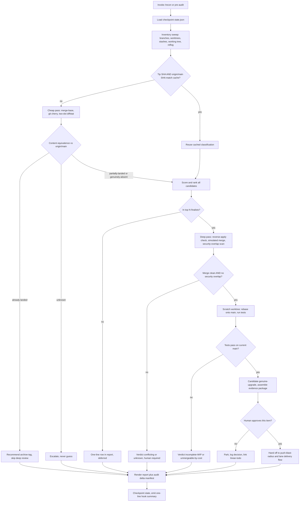
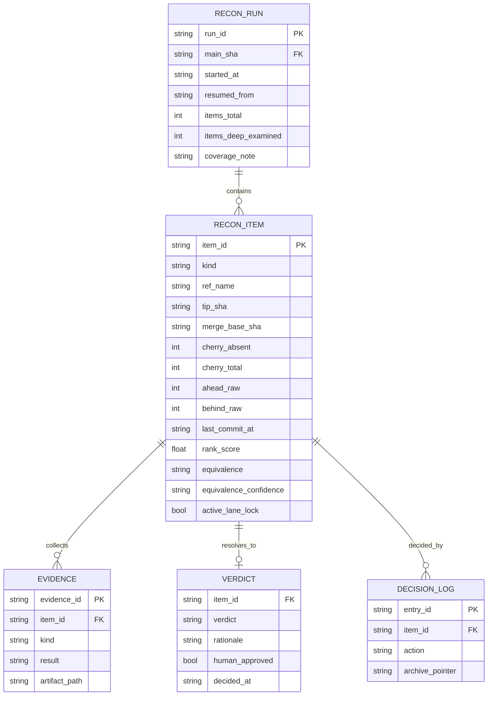

# Kimi K3 - Review

**Reviewer:** `moonshotai/kimi-k3` (high)
**Document:** c:/tmp/reconcile-skill-brief.md
**Seed:** (none)
**Tokens:** 2224 in / 8563 out | **Cost:** ~$0.1351 | **Wall:** 150.7s | **finish_reason:** stop

---

# Skill Design: `recon` — Pre-Audit Reconciliation

---

## Deliverable 1 — Blueprint

### Purpose
Answer, before any audit or major work session: *"What work exists that hasn't reached `origin/main`, is any of it real, and what should happen to each piece?"* — and emit an **audit delta manifest** so audits know what they're not reading.

### Name & form (Open Question 3)
**A combination, in three layers.** Justification follows from the scale:

| Layer | Artifact | Job |
|---|---|---|
| **Engine** | `scripts/recon-scan.mjs` | Deterministic, testable, checkpointable. All git calls, content-equivalence, ranking, state file. An agent should never be parsing 409 branches of raw `git` output through an LLM context — that's how you get hallucinated verdicts. |
| **Skill** | `skills/recon/SKILL.md` | The judgment layer. Reads the engine's JSON, runs deep analysis on finalists only, renders the report, walks the human through per-item approvals. |
| **Hook** | one line appended to the existing SessionStart path | Prints *only* a delta line: `recon: 3 new stranded items since last run (2 touch auth/). Run /recon.` Never the full report. |

A pure skill can't checkpoint reliably; a pure script can't judge upgrade-vs-downgrade; a pure hook becomes noise. The split also mirrors the repo's existing pattern (`drift-check` skill + `drift-check-gate.mjs` hook).

### Scope
- Inventory: branches (with/without upstream), worktrees, stashes, uncommitted working tree, reflog-only commits.
- Content-equivalence classification vs `origin/main`.
- Ranked triage; deep analysis of top N (default N=15).
- Verdict recommendation + evidence package per item; human-gated handoff to `push-blast-radius.mjs` and the lane delivery flow.
- Audit delta manifest (§5.6).

### Non-goals
- **Never** merges, pushes, rebases, deletes, stash-drops, or checks out. It recommends; humans and existing gated tooling execute.
- Not a branch-hygiene enforcer. It does not nag about branch count.
- Not a code reviewer. It does not judge style, only *shipped-ness, regression risk, and completeness*.
- Not real-time. It is a pre-session/pre-audit batch tool, not a watcher.

### Trigger conditions
1. Explicit: `/recon` before any audit or major session (the primary path).
2. SessionStart hook delta-line (passive, zero-cost).
3. `drift-check` cross-reference: when drift-check fires "you are behind," it appends "run `/recon` to check the inverse direction." The two skills are explicitly inverse and should reference each other, not merge.

### Integration points
- **`agent-lane` / `lane-session-start.mjs`**: recon reads lane state files to (a) exclude branches with active locks from "stranded" classification — a branch an agent is *on right now* is not stranded, it's in flight; (b) reuse the delivery-state vocabulary ("committed is not delivered") instead of inventing one.
- **`linear-todo`**: every `park`/`escalate` decision creates or links a board item, so parked work has a pointer that isn't a branch name.
- **`push-blast-radius.mjs`**: the only path by which a `genuine-upgrade` recommendation becomes a push.
- **`stale-check`**: before re-executing any carried-forward recommendation from a prior recon run, stale-check re-verifies it.
- **Audit skills**: consume `recon-output/audit-delta.md`.

---

## Deliverable 2 — Flowchart (Mermaid)



---

## Deliverable 3 — Data-Model Diagram (Mermaid)



Key fields, explained:
- **`kind`**: `branch | worktree | stash | working-tree | reflog-orphan`.
- **`equivalence`**: `already-landed | partially-landed | genuinely-absent | unknown`, with a separate **`equivalence_confidence`** (`high|medium|low`) because the detection methods disagree and the report must show *how sure* we are, not just *what we think*.
- **`ahead_raw`** is stored but labeled untrusted — kept only because the owner thinks in those numbers and the report should show the correction (`ahead 68 → 1 real`).
- **Cache key is the pair `(tip_sha, main_sha)`** — see failure mode 3.
- **`coverage_note`**: the run record explicitly lists what was *not* examined (e.g., "reflog scan skipped; 394 branches ranked but not deep-reviewed"). Hard constraint: honest about cost.
- **No file contents, no diffs, no PII in the JSON.** `artifact_path` points at on-disk artifacts that stay local; reports contain paths and counts only.

---

## Deliverable 4 — Wireframe (the report)

Decision-first, delta-first, scannable in <60s. The full inventory is behind `--full`.

```
══════════════════════════════════════════════════════════════════
 RECON — pre-audit reconciliation          run 2026-08-15 09:41
 main: origin/main @ a1b2c3d   ·   resumed from run 2026-08-14
══════════════════════════════════════════════════════════════════

 ▶ SINCE LAST RUN:  2 new stranded items · 1 resolved (landed) ·
   1 verdict changed (main moved).  409 refs swept in 41s.

 ┌─ DECISIONS NEEDED (3) ─────────────────────────────────────────┐
 │                                                                │
 │ 1. claude/equipment-p0-safety        GENUINE-UPGRADE?  ⚠ human │
 │    ahead 77 → 12 real commits · 5 wk old · touches auth/       │
 │    merge sim: CLEAN · tests on main: PASS · 1 security overlap │
 │    → main commit 9f3e1a2 touched same hunk in auth/session.ts  │
 │    → RECOMMEND: human review of that hunk, then merge via      │
 │      push-blast-radius.  [approve] [park] [show evidence]      │
 │                                                                │
 │ 2. codex/prod-smoke-sw-fix           UNMERGEABLE-BY-COST       │
 │    2 real commits · behind 2,269 · rebase est. high conflict   │
 │    → RECOMMEND: archive-tag + rewrite fresh if still wanted.   │
 │      [archive] [defer]                                         │
 │                                                                │
 │ 3. claude/launch-audit-lane5-20260803   INCOMPLETE-WIP         │
 │    35 real commits · 4 WIP markers · tests fail on branch      │
 │    → RECOMMEND: park to linear-todo or schedule finish slice.  │
 │      [park] [defer]                                            │
 └────────────────────────────────────────────────────────────────┘

 ALREADY LANDED (safe to archive-tag, zero risk): 6 branches
   store-inquiry-button (ahead 68 → 1 real, that 1 = README typo)
   + 5 more  [--full to list]

 DEFERRED (ranked, not deep-reviewed): 31   UNKNOWN: 2 ⚠

 ┌─ AUDIT DELTA — what an audit of main will NOT see ─────────────┐
 │ Unaudited risk:   auth/session.ts, equipment/safety-gate.ts    │
 │                   (12 commits, equipment-p0-safety)            │
 │ Stale findings:   api/webhooks.ts — finding #A-114 likely      │
 │                   already fixed on landed branch               │
 │ Working tree:     419 uncommitted files NOT audited, snapshot  │
 │                   recorded as dangling commit 7c4d… (untouched)│
 └────────────────────────────────────────────────────────────────┘

 NOT EXAMINED: reflog orphans (weekly deep scan only) · 31 deferred
 branches beyond rank 15 · stash contents older than 90 days.
 Next: /recon --approve 1   ·   /recon --full   ·   /recon --deep
══════════════════════════════════════════════════════════════════
```

Design notes: the top block is the *delta*, not the inventory — this is the anti-chore mechanism (Open Question 4). Decisions lead; data supports. Every recommendation names its evidence in one line. "NOT EXAMINED" is printed every run, by requirement.

---

## Deliverable 5 — Verdict Taxonomy Table

| Verdict | Detection signal | Required evidence | Action (all human-gated) | Risk if wrong |
|---|---|---|---|---|
| `already-landed` | Two-dot tree diff `main..tip` empty; **or** `git cherry` empty **and** net patch reverse-applies cleanly onto main | Both signals agree, or one agrees + confidence=high | Archive-tag (`archive/<branch>@<sha>`), then *offer* branch delete — never auto | Low: tag preserves everything; worst case is clutter |
| `superseded` | Branch's net patch overlaps hunks main changed *differently* after merge-base; reverse-apply fails but semantic intent matches a main commit | Human confirms intent match; agent presents both diffs side by side | Archive-tag + close with pointer to the main commit that superseded it | Medium: archiving a still-needed variant; mitigated by tag |
| `genuine-upgrade` | `genuinely-absent` + clean simulated merge + **zero unresolved security overlaps** + tests pass rebased on current main + dependency manifests not regressed | Full evidence package (see OQ1 below) | Recommend merge via `push-blast-radius.mjs`; per-item human approval | **Highest severity in the skill** — see failure mode 2 |
| `incomplete-WIP` | WIP/TODO/FIXME markers in diff; tests fail *on the branch itself*; commit messages match `wip|slice N of M`; lane state ≠ delivered; exported-but-unwired symbols | ≥2 independent signals (any one alone is weak) | Park to `linear-todo` with a "finish slice" item, or schedule | Low: nothing lost, board item keeps it visible |
| `conflicting` | Simulated merge has conflicts, **or** branch touches a hunk main modified after merge-base in a sensitive path | Enumerated conflict list; the specific overlapping hunks shown | Escalate to human with both versions; never auto-resolve | High if mishandled — this is where reverted security fixes hide |
| `unmergeable-by-cost` | `behind_raw` huge (e.g., >500) + simulated merge conflict density high + real-commit count small | Cost estimate: conflicts ÷ real commits; compare to "rewrite fresh" | Archive-tag + linear-todo item "rewrite if still wanted" | Low: work preserved, rewrite often cheaper |
| `experimental` | Name signals (`spike/`, `poc/`, `experiment`), no tests, never pushed, single-author burst | Weak by design — default to park, not delete | Park; archive-tag if >90 days idle | Low |
| `unknown` | Detection methods disagree, merge-base missing/unreliable, or confidence=low on any classification | N/A — absence of evidence **is** the verdict | Escalate. The skill is forbidden from guessing | Low *if honored*; catastrophic if the skill rounds it to something convenient |

**Minimum evidence before recommending merge (Open Question 1):** all six — (1) `genuinely-absent` at confidence ≥ medium; (2) clean `git merge-tree` simulation or fully enumerated conflicts; (3) security-overlap scan: no shared hunks with main commits after merge-base in sensitive paths, *or* each overlap explicitly shown to and approved by the human; (4) tests pass in a scratch worktree rebased on current `origin/main`; (5) `package.json`/lockfiles not regressed to older versions; (6) `push-blast-radius.mjs` passes. Missing any → verdict downgrades to `conflicting` or `unknown`.

**Incomplete vs complete-but-unpushed (Open Question 2):** completeness is a *multi-signal* call — tests green on the branch, no WIP markers, lane delivery-state says "committed, awaiting push," linked linear item marked done. Any single signal lies (commit messages especially). Two-plus agreeing signals required; disagreement → `unknown`.

---

## The content-equivalence engine (the core, per §3)

Layered, cheapest first, short-circuiting — run per branch in the cheap pass:

1. **Ancestry check** — `git merge-base --is-ancestor tip origin/main`: tip fully contained → `already-landed`, high confidence. (Catches clean merges.)
2. **Tree identity** — two-dot diff `git diff origin/main tip` empty → `already-landed`, high. (Catches rebases where commits differ but tree matches.)
3. **`git cherry -v origin/main tip`** — counts patch-id-absent commits. This is what correctly resolved `store-inquiry-button` (68→1). **Known failure modes:** (a) needs a sane merge-base — for branches with no upstream or weird history, merge-base may be ancient or absent; (b) **squash-merges break it**: N branch commits squashed into 1 main commit means all N patch-ids are absent → false `genuinely-absent`. This repo's proof case happened to be cherry-pick-shaped, so cherry worked; I am *not* assuming that's universal here.
4. **Net-patch reverse-apply** (finalists only) — `git diff merge-base tip | git apply --reverse --check` against main's tree: if the branch's whole net change can be *undone* from main, its content is present → upgrades a cherry "absent" to `already-landed` (catches squash-merges). **Failure mode:** context drift — if lines *around* the hunks moved on main, reverse-apply fails even when content landed → false `partially-landed`. Acceptable direction: it errs toward human review, not toward silence.
5. **Disagreement → `unknown`.** Never average, never guess.

**Cost model (§5.3):** steps 1–3 + diffstat + metadata run on all 409 refs (~4 git calls each, parallelizable, target <60s). Steps 4–5 plus simulated merge, security-overlap scan, and scratch-worktree test run run on **top 15 by rank score only**. Rank score = `path_sensitivity × 3 + name_signal × 2 + recency + log(1 + real_commits) − age_decay`, where `real_commits` is the *cherry-absent* count, never `ahead`.

**The 419 uncommitted files (Open Question 5):** treated as *one* item, not 419. `git stash create` produces a dangling commit of the working tree **without touching the tree or stash list** (read-only compliant) — record its SHA as the preservation pointer, plus a `git status --porcelain` directory-level summary. Verdict is always the same: "dedicated session required," surfaced in the audit delta as unaudited surface area. Recon never attempts per-file triage of a live working tree — that's a different job and a different session.

**Reflog orphans:** `git fsck --unreachable` is too slow for every run; weekly `--deep` flag only, and the report's NOT-EXAMINED line says so on every non-deep run.

---

## Deliverable 6 — Phased Build Plan

**Phase 1 — "The Truth Filter" (ships first, independently useful).** Engine: inventory of branches + worktrees, equivalence layers 1–3, rank score, markdown report, state file with `(tip_sha, main_sha)` cache keys. No deep analysis, no verdicts beyond `already-landed / genuinely-absent / unknown`. *Why first:* the 67-of-68 phantom-work problem is the whole ballgame; even this alone turns "40+ branches of mystery" into a one-screen answer, and it exercises the resumability/cache machinery everything else builds on.

**Phase 2 — Working tree, stashes, checkpoint/resume hardening.** `git stash create` snapshot, directory summary, interrupted-run resume, delta-since-last-run report header, SessionStart one-liner hook.

**Phase 3 — Finalist deep pass.** Reverse-apply layer, `git merge-tree` simulation, security-overlap scan, scratch-worktree test runs, full verdict taxonomy + evidence packages, human approval flow wired to `push-blast-radius.mjs`.

**Phase 4 — Audit linkage & integrations.** Audit delta manifest, linear-todo parking, lane-lock awareness, weekly `--deep` reflog scan, drift-check cross-references.

Each phase is runnable and useful if development stops there. Phase 1 alone justifies the skill's existence.

---

## Deliverable 7 — The Three Ways This Skill Fails (adversarial)

### Failure 1: The truth filter cries wolf, and the skill dies of noise in week two
My layered equivalence detection has a known asymmetry I should be honest about: **every failure mode points the same direction — toward false "absent."** Squash-merges defeat `git cherry`. Context drift defeats reverse-apply. Rebase-with-conflict-resolution defeats patch-id. So on a repo with 409 branches and unknown merge history, the plausible steady state is: dozens of branches classified `partially-landed` or `genuinely-absent` that are actually shipped. The owner investigates the first three, finds them already live, and — exactly as the brief predicts — abandons the skill. My mitigations (layered checks, confidence labels, `unknown`) *reduce* this but do not eliminate it, and the `unknown` verdict has its own failure mode: if 30% of branches come back `unknown`, "never guess" becomes "always escalate," which is just noise wearing a halo. **Residual risk, admitted:** the skill's classification precision is bounded by the repo's merge hygiene, which I cannot control. The only real defense is that Phase 1 ships cheap enough to *measure* the false-positive rate on this actual repo before the expensive machinery is built — if Phase 1 shows >20% false-absent, the honest move is to fix merge hygiene first, not build Phase 3.

### Failure 2: A "clean merge" re-introduces a vulnerability, and the evidence package certifies it
This is the highest-severity mode and my defense has a hole I want to name precisely. The security-overlap scan is **textual and heuristic**: it flags shared hunks and keyword-matched commit messages in a hand-maintained list of sensitive paths. But the dangerous case is a **semantic reversion with no textual overlap**: the stranded branch restores a code path in `auth/login.ts` that main's later security fix *deleted from a different file* (`auth/session.ts`), or re-adds a dependency version whose CVE patch lives in a lockfile hunk that merges cleanly. Simulated merge: clean. Overlap scan: silent. Tests: pass — because the vulnerability was found by an *audit*, and no regression test was ever written for it. My six-part evidence package then presents this branch as a certified `genuine-upgrade`, and the certification is the dangerous part — a human skimming "tests: PASS, merge: CLEAN" approves faster than they'd have approved with no tool at all. **The skill manufactures false confidence at exactly the decision point that matters most.** Mitigations I can honestly offer: (a) the verdict language must never say "safe to merge" — it says "no detected regression," and the report shows the evidence, not a green checkmark; (b) cross-reference past audit findings: if any historical audit finding touched a file the branch modifies, the branch is auto-`conflicting`, full stop; (c) human approval is per-item and non-bypassable. But I cannot close this hole. The correct framing is that recon *raises the floor* on stranded-work decisions; it does not, and must never claim to, prove an upgrade is an upgrade.

### Failure 3: The cache lies, and stale verdicts are presented as fresh
The resumability design caches classifications keyed by `(tip_sha, main_sha)`. The subtle bug: I key on `origin/main`'s SHA **as of the last fetch**. If the owner runs recon, then fetches, then works for three days without fetching again, every cached verdict is computed against a main that no longer reflects reality — a branch that was `partially-landed` may now be fully landed (its content merged via another lane), and worse, a `genuine-upgrade` candidate may now *conflict with a security fix that landed yesterday*. The report header says "main: a1b2c3d" but nobody reads that line; they read the verdicts. A reconciliation tool whose output silently describes last Tuesday's reality is **worse than no tool**, because the entire point of the skill is that the owner already has a stale-reality problem. Mitigations: hard-fail if `origin/main` is older than a configurable threshold (default 24h) unless `--stale-ok` is passed; stamp every verdict with the main SHA it was computed against and grey out mismatched rows in the report; treat cache entries as *suspect* rather than *valid* whenever main moved. But the deeper admission: any incremental-caching design trades freshness for the speed that makes the tool actually get run, and I have chosen that trade deliberately. The 80%-right-and-actually-run principle cuts both ways — a recon run that takes 20 minutes won't be run, and a recon run that's instant may be describing a main that no longer exists. The threshold-fail is the compromise, and it will still bite someone who passes `--stale-ok` out of habit.

---

*One flagged uncertainty, per instructions: `git merge-tree --write-tree` (the clean simulated-merge form) requires git ≥ 2.38; on older git the equivalent is a scratch-worktree `git merge --no-commit --no-ff` followed by abort, which is slower and touches a worktree. The design assumes ≥ 2.38 but Phase 3 must verify the local git version and fall back rather than fail.*
