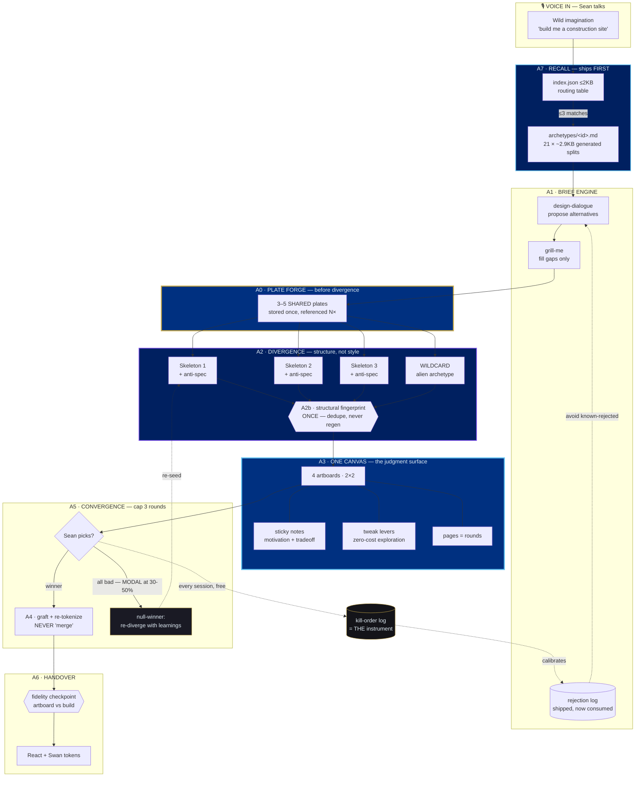
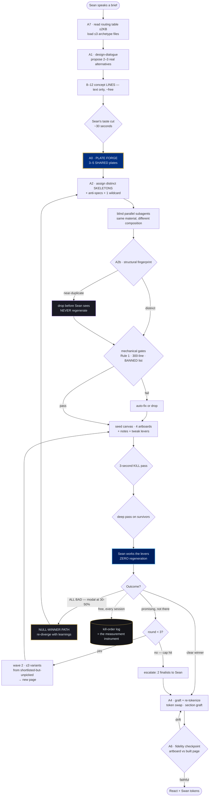

# SWAN ATELIER STUDIO — FINAL PLAN (post-panel synthesis)

- **Date:** 2026-08-18 · **Author:** Claude Opus 5 (Fable-tier, synthesizing) · **Status:** PLAN — ready for Sean's steer
- **Panel:** GLM-5.3 (291s, 20.8k out, ~17.4k reasoning) · Kimi K3 (139s, **$0.0708**) · Qwen 3.8 local (35s, $0)
- **New primary evidence:** the `design` skill was **probed live this session** — it resolves three `[UNKNOWN]`s the panel had to reason around
- **Supersedes:** `SWAN-ATELIER-STUDIO-REVIEW-PACKET-2026-08-18.md` §4 (the proposal). §2 ground truth stands.

---

## §0 — VERDICT

The proposal survives, but **four of its six modules were wrong as written** and one central sequencing decision inverted the source transcript's most important finding. The panel earned its keep. Nothing here is a rubber stamp.

**The one-line plan:** *Generate the material once, diverge on **structure** not style, judge ≤5 side-by-side with live tweak levers, graft — never "merge" — and let the picking itself be the measurement instrument.*

### Panel attribution note (integrity)

**Qwen's output self-labeled as "GLM-5.3"** — it adopted the reviewer name from the packet header. It is Qwen's review and is attributed as such throughout. Additionally, **Qwen hallucinated the prior program's module names** (called B7 "Video Generation", B9 "Handover", B5 "Recall", B1 "Creation Spine", B2 "Variant Tournament" — all wrong). **Its module-level sequencing advice is discarded on that basis.** Its Q3–Q7 reasoning is independent of the error and stands.

**My own packet defect, conceded:** GLM caught that I asked the panel to re-judge a ten-stage sequence while defining only about half the stages. Kimi flagged the same gap ("I don't know what B5/B9 contain"). That materially degraded review quality on Q1–Q2 and the fault is mine.

---

## §1 — CONVERGENT FINDINGS (independent agreement = highest confidence)

| # | Finding | Who | Confidence |
|---|---|---|---|
| **C1** | **A2 as written produces N skins of ONE skeleton.** Seeding archetype/style/motion constrains the *recipe*, not the *structure*. The model prior dominates: "construction homepage" → hero + cards + footer regardless of seed. | **All 3, independently** | Highest in the document |
| **C2** | **Fix = constrain the STRUCTURE, free the style.** Qwen "Constraint Inversion — if two variants share a DOM structure they are the same variant" · Kimi "archetype the only mandatory axis; compare section-sequence signatures" · GLM "distinct structural skeletons + anti-specifications" | All 3 | Highest |
| **C3** | **"Merge" is mostly fantasy — decompose it.** Palette/token swap = real · section graft = real but fragile · **layout transfer = regeneration wearing a merge costume** | All 3 | Highest |
| **C4** | **Kill the similarity-**regeneration** loop.** No metric specified; visual similarity is the wrong metric; regeneration oscillates. Replace with a **structural fingerprint run once → dedupe before Sean sees, never regenerate.** | Kimi + GLM | High |
| **C5** | **N = 5/7 is wrong, and the stated rationales are fake rigor.** Sean doesn't vote, so "odd avoids ties" is meaningless; "7 matches Rule 40" **double-counts** — Rule 40's 8–12 is *concept* breadth and the taste cut already sits between concepts and renders. | All 3 (Qwen→3, Kimi→4 or 3+1, GLM→≤5 in waves) | High |
| **C6** | **R4 recall = split the monolith + ≤2KB routing table + wire the hop into the skill's own contract.** Kimi: *"A capability is reachable iff the skill that needs it loads it as part of its own contract."* GLM adds: make the split a **generated build artifact** so it cannot rot against the source. | Kimi + GLM, near-identical | High |
| **C7** | Construction/trades archetype missing — R3's own worked example is uncovered | All 3 | Certain |
| **C8** | Cost model is asserted ("cents"), never measured | Kimi + GLM | Certain |

---

## §2 — ADJUDICATED DISAGREEMENTS

### D1 — The judging bottleneck: sieve vs. mechanical gates → **GLM wins**

- **Kimi:** build a taste sieve on `design-dialogue`'s shipped rejection log; shadow-mode first; *"kill authority is earned, not assumed."*
- **Qwen:** automated quality scoring (contrast > 4.5, font > 16px), show Sean the top 2.
- **GLM:** *"A proxy rubric is Goodhart bait. Pre-filtering to 'the 3 Sean will like' requires a model of Sean more accurate than the generator's hit rate — the Taste Ledger again with a rubric skin."*

**Ruling: GLM.** Kimi's own highest-value prior catch was the Taste-Ledger Rule-52 violation, and its sieve reintroduces that exact shape one level up — GLM caught Kimi repeating its own lesson. Qwen's rubric cannot rank taste; contrast ratio and font size would kill the interesting outlier every time.

**What we take instead — GLM's reframe, which dissolves the problem:** N-up doesn't multiply Sean's load, it **changes its shape.** Seven sequential reviews is 7× work. Five side-by-side *with honest captions* is **one comparative judgment plus a kill-list** — and comparison is cognitively far cheaper than scoring. Automate **mechanical gates only** (Rule 1 no-MUI, 300-line cap, taxonomy BANNED list) — shipped doctrine, zero taste claimed.

**What we keep from Kimi:** the rejection log is shipped and unused. It feeds the **brief** (so variants aren't born into known-rejected space), never a scoring function.

### D2 — The measurement instrument → **GLM wins**

- **Kimi (its #1 absence, twice running):** no evaluation instrument exists; ship one.
- **GLM:** *"The N-up canvas with kill-order logging **is** the instrument. Zero new machinery."*

**Ruling: GLM.** Kimi asks for a new artifact; GLM shows it falls out of the flow for free. Every N-up session already emits winner, kill order, and reasons. **Log what already happens.** This also honors Rule 52 — Kimi's instrument would be the third re-invention of an adjudicated system.

### D3 — N-number → **synthesis, resolved by new evidence (§3)**

All three argued *down* from 7 on judging-capacity and legibility grounds, and all three were right on the evidence they had. **The canvas probe supplies a fourth axis none of them knew about** — see §3.4. Sean gets the breadth he asked for without paying the judging cost they warned about.

---

## §3 — NEW EVIDENCE: the `design` skill, probed live `[VERIFIED]`

GLM wrote: *"one day of canvas probing reorders this entire list."* It took ten minutes, and it does.

**3.1 — Artboard count is NOT capped.** Every `.dc.html` file is its own artboard on one pan/zoom canvas; `canvas.json` positions them with x/y/w/h. The real limits are a **16 MiB document** and **2 MiB per entry**. → **A3 drops from Kimi's #3 vaporware and GLM's "binary, works-or-doesn't" to low risk.**

**3.2 — Pages (≤40) are native.** A canvas splits into named pages the viewer flips between. → **Tournament rounds become pages on one canvas.** This solves Kimi's absence #3 (no persistence model for tournament state) with zero new machinery.

**3.3 — Annotations (≤200 sticky notes) are native**, manifest-only, positioned in canvas space. → the per-variant **motivation + tradeoff caption**, which is precisely what makes GLM's "comparison is cheap" claim true. The skill's own doctrine independently demands it: *"Give each option an honest motivation and its main tradeoff — a set where only your favorite gets a case made for it is a rigged vote."*

**3.4 — Tweak chips: the finding that resolves the N-fight.** `data-props` entries with editors render as **live lever chips above each artboard** — enum variants, density/dark toggles, one accent color, a spacing scale. Sean changes them **without any regeneration.**

> **4 artboards × 3 levers ≈ dozens of explorable states, while Sean only ever judges 4 objects at once.**

This is how Sean gets the "5–7 options" *experience* he asked for while honoring the judging ceiling all three reviewers insisted on. The breadth moves to an axis that costs nothing.
**Discipline (the skill's own rule):** tweaks are **levers, not copy** — behavioral switches and values that cut across the design. Never a tweak for body text.

**3.5 — Copy/paste between artboards is native**, and template holes re-resolve against the destination. → **section-graft (C3) has both a GUI path for Sean and a programmatic path for me** (I hold the working `.dc.html` files, so a graft is recompose + re-seed). This makes GLM's condition — *"mechanical merge is real iff A2 imposes generation-time contracts"* — actually satisfiable, because I control generation.

**3.6 — Confirmed absent:** design-system color tokens and the "request tweaks" agent loop are **not** in this canvas editor (they need the claude.ai/design backend). Swan's `design.md` + a per-project `brand.md` is the substitute, exactly as T5 already concluded.

**3.7 — A hard budget nobody costed.** 16 MiB/document, 2 MiB/entry, images ~70 KB each as bare base64. **N variants × private image plates has a hard ceiling.** Shared plates are stored once and referenced N times — so the size cap and GLM's assets-first catch (§4) point the same direction independently. That convergence is itself evidence the fix is right.

---

## §4 — THE HIGHEST-VALUE CATCH (GLM, and neither other reviewer found it)

> **§4.2 inverted the source transcript's #1 finding.**

The transcript's step 2 — generate the **brand asset pack BEFORE designing**, explicitly *"the step most people miss"* — became, in my ladder, **"creative: winner only."** And **no A-module owned creative at all.** Meanwhile §2 shows video generation shipped but **image generation is a 3-line hardcoded style string.**

So the plan was building seeding contracts and merge manifests to judge variants **composed from no real material.** That is the cheapest available explanation for outputs that don't feel like $100k — and it is the same conclusion the prior program reached as gap #1 (*"the creative is the heavy lifter, and Swan isn't lifting it"*), which I then re-broke.

**The fix, and its bonus:** generate **one shared 3–5 plate asset pack pre-divergence**; every variant composes from it. GLM's second-order insight is the sharpest line in the whole panel:

> *Same material, different composition **is the true divergence test.*** It isolates composition from material — so you learn whether your structural seeding actually works, instead of confounding it with who got the prettier plate.

---

## §5 — THE REVISED ARCHITECTURE

**Renames (all three reviewers demanded the honesty):** ~~A4 Merge Engine~~ → **A4 Graft & Re-tokenize.** Never say "merge."

| Module | What it is now | Change from packet |
|---|---|---|
| **A0 · Plate Forge** | **NEW — ships first.** One shared 3–5 plate asset pack per brief, generated *before* divergence. Every variant composes from the same material. | **Added** (GLM's #1 catch) |
| **A1 · Brief Engine** | Voice → brief. Routes `design-dialogue` → `grill-me`. **Step 1 of its contract is "read the routing table"** (C6). Consumes the rejection log so variants aren't born into known-rejected space. | Contract-bound |
| **A2 · Divergence** | **Structural skeletons, not style seeds.** Each variant gets a distinct hand-specified skeleton (chapter count, grid, nav model, hero mechanics) + **anti-specifications** ("no top nav", "hero is not full-bleed image + centered text") + 1 alien-archetype wildcard. Style free. Blind parallel subagents. | **Rewritten** (C1/C2) |
| **A2b · Structural fingerprint** | Normalized tag sequence + section order + grid columns. **Run once. Dedupe before Sean sees. Never regenerate.** | **Replaces** the regen loop (C4) |
| **A3 · Judgment Surface** | 4 artboards default (2×2, legible at one zoom), 5 max. Each carries a sticky-note caption (motivation + tradeoff) and 2–3 tweak levers. Rounds = pages. | De-risked by §3 |
| **A4 · Graft & Re-tokenize** | Token/palette swap (real) + section graft (real, fragile). **Layout transfer is out of scope and is named as regeneration.** Enabled by A2's generation-time contract: shared custom-property names + self-scoped sections. | **Renamed + narrowed** (C3) |
| **A5 · Convergence** | Branch from winner. **Hard cap 3 rounds.** **NEW: null-winner path** — "all bad" → re-diverge with what was learned (Kimi's absence #2; the modal outcome at 30–50% satisfaction). | **Null path added** |
| **A6 · Handover** | Canvas → React with Swan tokens. **NEW: fidelity checkpoint** — winning artboard vs. built page, side-by-side, before ship (GLM absence #3: *"the $100k bar dies at artboard→React lossiness"*). | **Checkpoint added** |
| **A7 · Recall** | **Promoted to first.** Generated split (`archetypes/<id>.md`) + generated `index.json` ≤2KB + one line in the skills' contracts + routing positive-controls added to the **shipped 73-test suite**. | **Promoted** (C6) |
| ~~Taste sieve~~ | **CUT.** Goodhart bait / Taste Ledger with a rubric skin (D1). Mechanical gates only. | **Cut** |
| ~~New measurement instrument~~ | **CUT.** The canvas + kill-order log *is* the instrument (D2). | **Cut** |

### §5.1 — The N-number, settled

| Stage | Medium | Count | Cost | Who cuts |
|---|---|---|---|---|
| Concepts | text lines | **8–12** (Rule 40, unchanged) | ~free | Sean, 30 seconds |
| **Render wave 1** | artboards | **4** (5 for awe) | cheap | Sean: one comparative pass + kill-list |
| **Tweak exploration** | live levers | **~dozens of states** | **zero** | Sean, no regeneration |
| Wave 2 *(only if needed)* | artboards | **≤3**, seeded from shortlisted-but-unpicked, conditioned on wave-1 reactions | cheap | Sean |
| Creative | shared plates | **3–5, generated once at A0** | cents | — |
| Motion | 8s video | **winner only** | $1–2 | — |

**Effective breadth ≥ 8. Judged width ≤ 5. Regenerations to explore a variant: 0.**
Two-pass judging (GLM): a 3-second kill pass, then a deep pass on survivors.

---

## §6 — BLUEPRINT (mermaid)



---

## §7 — WIREFRAME: what Sean actually sees

```
┌───────────────────────────────────────────────────────────────────────────┐
│  ⌂ Construction Co — Direction Round 1        [Pages ▾ R1 | R2]  [Save]   │
├───────────────────────────────────────────────────────────────────────────┤
│                                                                            │
│  ┌── A · "Field Report" ─────────┐   ┌── B · "Blueprint" ───────────────┐ │
│  │ [accent ▾][density ▾][dark ○] │   │ [accent ▾][density ▾][dark ●]    │ │  ← tweak
│  │ ┌───────────────────────────┐ │   │ ┌──────────────────────────────┐ │ │    levers
│  │ │  NO TOP NAV — side rail   │ │   │ │  full-bleed plate, type over │ │ │    (0 cost)
│  │ │  ▓▓▓▓ plate-01            │ │   │ │  ▓▓▓▓▓▓▓▓ plate-01           │ │ │
│  │ │  editorial 2-col          │ │   │ │  centered manifesto          │ │ │
│  │ └───────────────────────────┘ │   │ └──────────────────────────────┘ │ │
│  └───────────────────────────────┘   └──────────────────────────────────┘ │
│   ▸ 📌 Trust-first. Licensing above    ▸ 📌 Awe-first. Slower to the        │
│     the fold. Costs: less drama.         quote CTA — that's the trade.     │
│                                                                            │
│  ┌── C · "Ledger" ───────────────┐   ┌── D · WILDCARD ──────────────────┐ │
│  │ [accent ▾][density ▾][dark ○] │   │ [accent ▾][density ▾][dark ●]    │ │
│  │ ┌───────────────────────────┐ │   │ ┌──────────────────────────────┐ │ │
│  │ │  dense data grid          │ │   │ │  construction AS editorial   │ │ │
│  │ │  ▓▓ plate-02  ▓▓ plate-03 │ │   │ │  magazine — alien archetype  │ │ │
│  │ └───────────────────────────┘ │   │ └──────────────────────────────┘ │ │
│  └───────────────────────────────┘   └──────────────────────────────────┘ │
│   ▸ 📌 Proof-first. Risks feeling      ▸ 📌 Memorable, off-genre. May      │
│     like a spreadsheet.                  read as "not a builder."          │
│                                                                            │
│         ── same 3 plates in all four. only COMPOSITION differs ──          │
└───────────────────────────────────────────────────────────────────────────┘
   Sean: one comparative pass → kill 2 → tweak the survivors → "graft C's
   proof strip into B" → round 2 lands on page R2. Zero regenerations to
   explore; one regeneration to graft.
```

---

## §8 — FLOWCHART: the run loop



---

## §9 — SEQUENCING

Both Kimi and GLM independently said recall jumps the queue, and GLM added the probe.

| # | Step | Why here | Cost |
|---|---|---|---|
| **1** | **A7 Recall** — generated splits + `index.json` + skill-contract line + routing tests | Cheapest, unblocks everything, **has value even if the engine never ships** | hours |
| **2** | **Construction/trades archetype** | R3's own demo hits an uncovered cell (C7) | ~a day |
| **3** | **A0 Plate Forge** | GLM's #1 catch; everything downstream judges material that doesn't exist yet | days |
| **4** | **5-up smoke test on a toy brief** | Proves C1/C2 before any infrastructure is built on the assumption | hours |
| **5** | **A2 + A2b + A3** | The engine, now de-risked by §3 | days |
| **6** | **A5 null-path + kill-order log** | Kimi's highest catch; rides shipped infra | hours |
| **7** | **A4 graft + A6 handover checkpoint** | Last; narrowest promise | days |

**Standing branch law (Atelier §0):** cut from `origin/main`. This tree is **2,094 commits behind** — building the brain here forks it a third time.

---

## §10 — HONEST GAPS (carried forward, unresolved)

- **The §2.2 mechanism gaps are still unscheduled** (Kimi's absence #4). B11 rides a spine that has shipped nothing: no custom creative, no interpolation, reference depth capped. **A0 partially closes gap #1; the other three remain open.** If they slip, this ships as a divergence engine over mediocre bases — *five flavors of the same weakness.*
- **D4 vs. reference-ladder URL conflict** — inherited open from Atelier B0.4, and §4.4's UI-sniping corpus piles onto it. GLM: *"that's a Fable ruling, not an engineering task."*
- **P-mode one-query Mobbin cap** — rationale still `[UNKNOWN]`; commit `9599539d8` has a bare message.
- **Cost per artboard still unmeasured.** §5.1 says "cheap" on the same evidence I was criticized for. Metering is step 4's job.
- **Voice-first autonomy (R3) has no owner module.** GLM's vaporware #3, and it is correct: the failure shape is *"a sycophantic 40-question interview Sean abandons by question 12."* A1 must have a hard question budget.
- **Motion is judged with the motion removed** (GLM absence #4) — a motion-seeded variant looks *emptier*, not livelier, on a static artboard. Unsolved; may argue against motion as a seed axis at all.
- **Nothing here is built.** No code, no brain file modified.

---

## §11 — WHAT I NEED FROM SEAN

1. **N-number:** you asked 5–7; the panel unanimously argued down and the tweak-lever finding (§3.4) gives the breadth back for free. **Recommend 4 (5 for awe) + levers + wave-2.** Accept, or hold at 5–7 and I'll design for the legibility cost.
2. **Sequencing:** recall-first (hours, unblocks all) vs. engine-first (the exciting part). **Recommend recall-first** — both paid reviewers said so independently.
3. **The three still-open spine gaps** — interpolation, reference depth, pixel-convergence — are they in scope for this program, or does Atelier stay parked and Studio ships on top of what exists?
4. **The D4/URL conflict needs a Fable ruling** before the UI-sniping corpus lands.

## §12 — PANEL COST

| Reviewer | Wall | Cost |
|---|---|---|
| GLM-5.3 | 291s | **$0** (subscription) |
| Kimi K3 | 139s | **$0.0708** |
| Qwen 3.8 local | 35s | **$0** |
| **Total** | | **$0.0708** |
