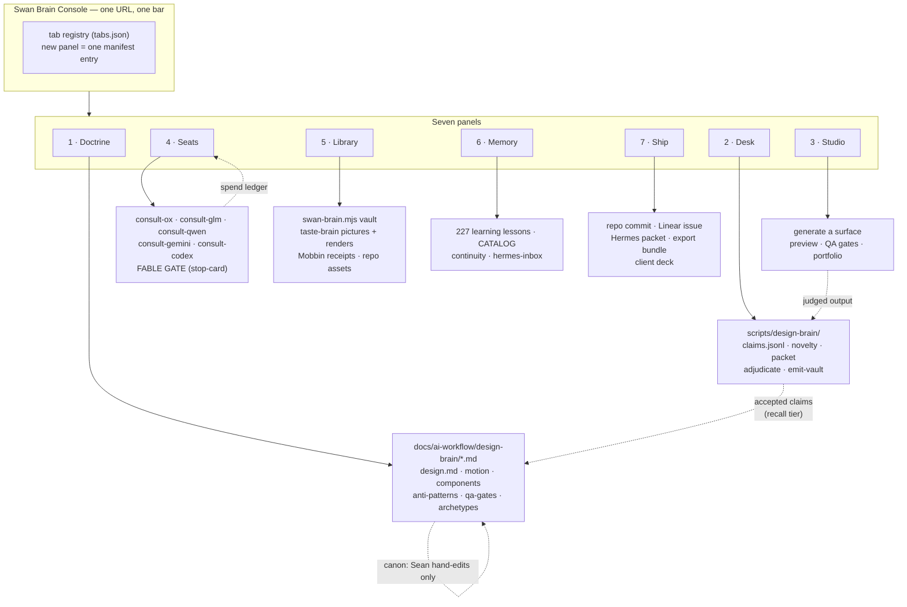

# Swan Brain Console — gap analysis vs. the "design operating system" transcript, and the build blueprint

**Remit.** Sean watched a walkthrough of a self-built "design operating system" (Jack Roberts /
Claude Code) and asked: compare it to the Swan Design Brain, take everything worth taking,
upgrade it, and give the Swan Brain its **own console** — built so the brain can keep growing
into it.

This document is (1) the honest gap table, (2) the things Swan already does *better* that must
not be regressed, (3) the console blueprint, (4) the slice plan, (5) the open questions.

---

## 0. What the Swan Design Brain actually is today

Two halves that have never been joined by a surface.

**Half A — doctrine (31 files, `docs/ai-workflow/design-brain/`).**
`design.md` (238 lines, 28 sections: tokens, two modes, type, spacing, panels, GlowButton,
inputs, tables, Victory charts, chat, T0–T4 command surfaces, onboarding, trainer/client,
Coach Command Center, Hermes Cyberforest, modals, nav, the four states, mobile 320/375/414,
wide 2560/3840, motion, a11y, anti-patterns, implementation notes) · `design.html` (1,355 lines,
a static mirror of `design.md` only) · `motion.md` · `components.md` · `anti-patterns.md` ·
`qa-gates.md` · `cinematic-pages.md` · `website-archetypes.md` (560 lines) ·
`swan-element-intelligence.md` · `mobbin-learning-system.md` · `external-reference-mcp.md` ·
8 `adapters/` · 3 `obsidian/` · 3 `graphify/`.

**Half B — the learning engine (`scripts/design-brain/`, 1,266 lines `src/`, zero deps, 39/39 tests across 4 suites — [VERIFIED] this session).**
A governed 6-step loop: `log-receipt` → `synthesize` → `corroborate` → `packet` → **Sean
adjudicates** → `adjudicate` → `emit-vault`. Claims are recall-tier even when accepted; canon is
promoted only by Sean hand-editing doctrine. Only shipped products corroborate; agent text never
does. Contradictions stay visible; scoring never resolves them.

> **[VERIFIED] Trailhead-truth finding (Rule 75), found while writing this doc.** The engine's own
> `README.md` says *"~800 lines, 14/14 tests."* Actual: `wc -l scripts/design-brain/src/*.mjs` = **1,266**;
> running all four suites = **39 pass / 0 fail** (`corroborate` 10, `engine` 14, `novelty` 6, `similarity` 9).
> The README was accurate when `engine.test.mjs` was the only suite and has silently drifted since. This is
> the exact class of decay the console is meant to end: **numbers a human maintains by hand go stale
> invisibly.** Every count the console shows must be generated at read time, never transcribed.

> **[VERIFIED] Feasibility signal for S2.** `adjudicate.mjs` already exports `parseDecisions(packetText)`
> and `applyDecisions(proposed, existing, decisions, {actor, batchId, nowIso})` as pure functions
> (`scripts/design-brain/src/adjudicate.mjs:29,47`), with `LETTER_STATUS = {a:'accepted', r:'rejected',
> t:'trial'}` and merge requiring an explicit `m CLM-xxx` target. **The Desk does not need to shell out or
> re-implement anything** — it imports these two functions and stays on the one audited path that can change
> a claim's status. The header states it plainly: *"the ONLY path that changes claim status."*

> ## ⚠ SUPERSEDED BY ROUND 2 — read `SWAN-BRAIN-CONSOLE-ROUND2-2026-08-26.md` first
>
> This document's central premise was **wrong**, and the correction reorders the whole plan.

**The wound — [STRUCK, was `[HYPOTHESIS]` presented as fact].** This section originally claimed
that step 4 of the loop costs Sean *"~75 minutes a week"* of hand-editing letters into
`BATCH-<date>.md`, and built the flagship slice around removing it.

**[VERIFIED] 2026-08-26: the learning engine has never been run.** `SWAN_DESIGN_BRAIN_ROOT` is
unset, `~/design-brain` does not exist, and `find ~ -maxdepth 4 -name claims.jsonl` returns
nothing. Zero receipts, zero claims, zero batches. The "75 minutes" is a **cadence target
written into the engine's README for a loop that has never executed** — not an operating cost.

There is no chore to remove. The real wound is that **nobody can see that the loop has never
started**, which is why Round 2 promotes a *Pipeline* panel to slice 2 and demotes the
adjudication Desk to slice 6 behind a shadow-mode gate.

Corrected cost: `[UNKNOWN] — no batch has ever been adjudicated.`

---

## 1. Gap table — transcript capability vs. Swan today

| # | Transcript capability | Swan today | Verdict |
|---|---|---|---|
| 1 | **Export/import a design system** as one portable artifact; own it outside the vendor | 31 repo-bound markdown files + a static HTML mirror. No bundle format. | **GAP.** Cannot hand "the Swan system" to another tool, model, or person as one thing. |
| 2 | **Many design systems registered**, pick one per build | Exactly one system (Crystalline Swan) with a second *mode* (Cyberforest). | **GAP.** The partner lane (her own school) and client work each need their own system. Doctrine is single-tenant by construction. |
| 3 | **Any model, one picker**, riding subscriptions not API credits | 12 `consult-*.mjs` CLIs, each with its own flags and footguns. The Ox-as-Grok misfire happened **twice** (2026-08-24, 2026-08-25) because the seat is selected by an env var. | **GAP, and it has already cost real credibility.** A button cannot be forgotten; an env var can. |
| 4 | **Cost per model shown before you spend** | `spend-ledger.mjs` + two-ask gate + `pending-approval.json`. Correct, and CLI-only. | **GAP.** Spend is invisible until it blocks. Sean reached ~95% of Fable with zero hostile reviews and zero blueprints to show for it — the exact failure a visible meter prevents. |
| 5 | **Studio**: prompt → build → inline preview → full-screen → portfolio grid of everything made | Nothing. Design work happens in chat; output lands in the repo or nowhere. | **GAP.** No preview surface, no portfolio, no "show me the last twelve things we designed." |
| 6 | **Library** with semantic search over local assets ("magic scan" finds a burger with no metadata) | Reach is genuinely large — `swan-brain.mjs` over a 4,418-doc vault, the taste-brain corpus and renders, Mobbin MCP, R2 video. Through three-plus unrelated CLIs. | **PARTIAL.** The reach exists; the surface does not. |
| 7 | **Insights** — spend, usage, ROI | `ledger.jsonl`, `gate-telemetry.jsonl`. | **GAP.** Data exists, no view. |
| 8 | **Memory** you can browse | Richer than the transcript's: 227 durable learning lessons, `CATALOG.md` + `CATALOG.local.md`, continuity log, Hermes inbox, `MEMORY.md`. | **PARTIAL.** Grep-only. `hermes-learning-surface.mjs --grep` is the whole UI. |
| 9 | **"Dreaming"** — nightly log scan proposing new skills | `skill-harvest` (manual), `auto-research` (manual). | **GAP** in cadence, not capability. Nothing is scheduled. |
| 10 | **Workflows live in the OS** — create → publish to N platforms | Zero distribution. Design output reaches the repo and stops. | **GAP**, but Swan's version is not Instagram — see §3.7. |

## 2. Where Swan already beats the transcript (do not regress)

These are load-bearing and the console must carry them forward, not flatten them.

1. **Governed learning.** The transcript's memory is "Claude dreams over your chat logs." Swan
   has receipts with anti-vacuity floors, mechanical confidence from product count, K1–K5
   dedupe, visible contradictions, single-source claims capped `low`, and **canon promoted only
   by a human hand-edit**. There is no promote script *on purpose*.
2. **Evidence separation.** Only shipped products corroborate. Agent text — memos, repo docs —
   never counts as evidence. The transcript has no equivalent and would happily learn from its
   own output.
3. **The hostile-review chain**, QA gates, the responsive matrix (320 → 3840), the banned-pattern
   list with a *why* per item.
4. **Sean's own measured taste.** The taste brain is not a style preset — it is 3 grids and 18
   judgements of what Sean actually chose, with a never-show-twice writer and an own-material law.
5. **Privacy posture.** IDs and roles only; the stealth-seat retention warning is written into
   the seat script itself.

## 3. The console

### 3.1 One sentence
**Swan Brain Console** — a zero-dependency local surface at one URL where the Design Brain's
doctrine, its learning loop, every model seat, the studio, the library, the memory and the ship
lane are seven tabs under one bar, and new panels register themselves without touching the shell.

### 3.2 Why local, zero-dep, and shaped like the prompter
`swan-taste-brain/prompter/` already proved this exact pattern in production: a plain
`node:http` server, one `app.html` + `app.css` + per-tab `app-*.js` modules each ≤105 lines, a
single writer endpoint, tests that run with no GPU and no network. The console reuses that
shape. **It is not a React app inside SwanStudios.** It is an operator tool, and per the
taste-brain ruling, operator tools sit outside the SaaS styled-components/Victory rules —
judging design well requires a neutral surface that does not itself argue for a palette.

### 3.3 Architecture



### 3.4 The seven panels

**1 · Doctrine — the system, rendered and searchable.**
Every doctrine file, not just `design.md` (today's `design.html` mirrors one file out of 31).
Live token swatches with contrast ratios computed in-page. A mode switch (Crystalline Swan ↔
Crystalline Cyberforest) that repaints the swatches. Full-text search across all 31 files.
Every component pattern with its anatomy, four states, and do/don't. **Solves gap 1's first
half** — and replaces `design.html`, which becomes generated rather than hand-maintained (it is
currently 1,355 lines that must be kept in sync with `design.md` by hand, and drift there is
silent).

**2 · Desk — the adjudication desk. This is the flagship.**
The ~75-minute weekly markdown-editing chore becomes cards. Novelty dial as a gauge, per domain.
Each DECIDE claim is one card: the claim, its receipts, its confidence, its corroborating
products, its contradictions — and four buttons (`accept` · `reject` · `trial` · `merge into…`).
Keyboard-first: `a` / `r` / `t` / `m`, `j`/`k` to move. Nothing is auto-decided; the console
writes the same letters into the same batch file and calls the same `adjudicate.mjs`. **The
trust model does not move an inch** — claims stay recall-tier, canon still requires Sean editing
doctrine by hand. The console removes the typing, not the judgement.

**3 · Studio — build against a system, with any seat.**
Pick system (Crystalline Swan / Cyberforest / a registered partner or client system) → pick seat
→ pick effort → prompt → build. Output renders in an inline frame, opens full-screen, and lands
in a portfolio grid. **The Swan upgrade the transcript does not have:** every generated surface
is run through `qa-gates.md` automatically — the responsive matrix, contrast, 44px targets,
the four states, the banned-pattern list — and the card shows pass/fail per gate before Sean
looks at it. A generated design that fails a gate is labelled, not silently shown.

**4 · Seats — every model, one panel, live spend.**
One row per seat: Ox Alpha, GLM 5.3, Qwen (local), Gemini, Codex, Sol, Kimi, DeepSeek, Fable.
Each row: what it costs, what it is good at, whether it is free/subscription/paid, and a Run
button. **The Ox footgun becomes structurally impossible** — the seat is a button bound to
`consult-ox.mjs`, and the served-model line from the response is displayed next to the seat name,
so a mis-served model is visible rather than assumed. A live spend meter reads `ledger.jsonl`:
spent this topic, spent this week, budget remaining. **Fable's row is a stop-card, not a Run
button** — it renders the `seat-relay` FABLE GATE block with a copy button and never invokes
`consult-fable.mjs`. Same for the ChatGPT-Sol and Codex rows: they emit a paste-ready relay
prompt (see `.claude/skills/seat-relay/SKILL.md`), because those seats are hand-driven.

**5 · Library — one search across everything Swan can already see.**
The reach exists in three CLIs; this is the surface. Vault (4,418 docs via `swan-brain.mjs`),
taste-brain pictures and renders, Mobbin inspection receipts, repo assets. The transcript's
"magic scan" (find a burger picture with no burger metadata) has a real Swan analogue: the taste
brain already indexes pictures by judged content rather than filename. **Copyright boundary
holds** — the Midlibrary corpus is third-party and stays outside SS-PT; the console *cites and
links*, it never copies material in.

**6 · Memory — browsable, not grep-only.**
227 durable learning lessons, `CATALOG.md` + `CATALOG.local.md`, the continuity log, the Hermes
inbox queue. Filter by date, author, decision, status. Stale rows (source SHA no longer matching)
flagged red per Rule 72. **The two catalogs never merge** — the local one indexes gitignored
stores and merging them is how gitignored content leaks into git.

**7 · Ship — where a finished thing goes.**
The transcript publishes to Instagram and LinkedIn. Swan's distribution targets are different and
more valuable: commit to the repo, cut a Linear issue, emit a Hermes learning packet or inbox
memo, export a **system bundle** (gap 1's second half — the portable artifact), or assemble a
client deck (the taste brain's client mode is already Sean's sales role-play). Social publishing
is explicitly **out of scope for v1** and listed as a later question, not a silent omission.

### 3.5 Extensibility — Sean's explicit requirement

> *"we need to build this console knowing that we're gonna be expanding this Swan brain and
> making it better too. So it needs to be open to take in new things as well."*

Three mechanisms, all cheap:

1. **Tab registry.** `console/tabs.json` lists `{id, label, module, api}`. The shell iterates it.
   A new panel is one manifest row plus one `app-<id>.js` module. The shell is never edited to
   add a panel — the same discipline that keeps the prompter's modules under 105 lines each.
2. **Source registry.** `console/sources.json` lists what the Library and Memory panels read.
   A new corpus (a new vault collection, a new asset store) is one row, not new code.
3. **Seat registry.** `console/seats.json` lists `{seat, script, billing, gate, remit}`. A new
   model is one row. `gate: "relay"` renders a stop-card instead of a Run button — which is how
   Fable, ChatGPT and Codex are represented without special-casing them in the shell.

Registries are read at request time, so adding a panel does not require a restart.

### 3.6 What the console must NOT do (hard boundaries)

- **Never auto-promote a claim to canon.** Canon is a Sean hand-edit of doctrine. No promote
  button, ever — the absence of a promote script is deliberate and must survive the console.
- **Never invoke Fable.** Rule 80 / `seat-relay`. Fable's row is a stop-card.
- **Never write into `wiki/` or `docs/ai-workflow/references/`.** Console writes are T2: the
  batch file, `claims.jsonl` via `adjudicate.mjs`, the portfolio directory, and nothing else.
- **Never merge the two catalogs.**
- **Never bind to anything but loopback.** Same posture as the taste-brain `/api/make` endpoint.
- **Never send PII or credentials to a seat.** The stealth-seat retention warning applies at the
  console boundary, not only in the CLI.
- **No vector/embedding/RAG infrastructure** (Rule 72 standing prohibition). The Library panel
  is grep and the existing catalogs over the existing vault search — not a new index.

### 3.7 Deliberate divergences from the transcript

| Transcript | Swan | Why |
|---|---|---|
| Publish to Instagram/TikTok/LinkedIn via a third-party API | Ship lane targets repo / Linear / Hermes / bundle / client deck | SwanStudios is a trainer-led B2B2C operating system, not a content channel. Social distribution is a separate decision with its own risk surface. |
| "Claude dreams nightly over your logs" | `skill-harvest` on a cadence, proposing only | Autonomous self-modification of doctrine is exactly what the governed learning model exists to prevent. |
| Any model, unlimited, all default-on | Seats are registry rows with billing + gate; paid ones are opt-in and spend-gated | Rule 16, spend-ledger two-ask, and the reason this whole conversation started. |
| Design system exported to use "in Claude or ChatGPT" | Bundle export **plus** the existing per-agent adapters | Swan already solved cross-agent usage better — adapters carry per-agent rules, not just tokens. |

---

## 4. Slice plan

Each slice ships independently, is reviewable alone, and leaves the console usable.

| # | Slice | Delivers | Depends on |
|---|---|---|---|
| **S0** | Governance | Rule 80 (Fable = review/blueprint only) in `CLAUDE.md` + `AGENTS.md` on **origin/main**; `seat-relay` skill (**done**) | — |
| **S1** | Shell + registries | `console/serve.mjs`, `app.html`, `app.css`, `app-shell.js`, `tabs.json`/`sources.json`/`seats.json`, loopback bind, tests | S0 |
| **S2** | **Desk** | Adjudication cards, novelty gauge, keyboard letters, writes the same batch file, calls the same `adjudicate.mjs` | S1 |
| **S3** | Doctrine | All 31 files rendered + searched, live token swatches with contrast, mode switch; `design.html` becomes generated | S1 |
| **S4** | Seats | Seat rows, served-model display, live spend meter, Fable/ChatGPT/Codex stop-cards emitting relay prompts | S1 |
| **S5** | Studio | Generate → preview → auto-QA-gate → portfolio | S3, S4 |
| **S6** | Library + Memory | Unified search surface over vault / taste-brain / Mobbin / catalogs / learning corpus | S1 |
| **S7** | Ship + bundle | Export a portable system bundle; repo / Linear / Hermes targets | S3 |
| **S8** | Multi-system | Register a second design system (partner lane); Studio and Doctrine become system-scoped | S3, S7 |

**S2 is first after the shell on purpose.** It is the only slice that removes an existing
recurring 75-minute cost. Everything else adds capability; S2 subtracts a chore.

---

## 5. Risks and open questions for the panel

1. **Is a seventh surface the right answer, or is this a taste-brain tab?** The taste brain
   already has a working shell (Make · Judge · Directions · Kept). Argument for separate: the
   taste brain is Sean's *personal visual taste* over a copyrighted corpus and lives outside
   SS-PT; the Design Brain is *SwanStudios doctrine* and lives in the repo. Merging them puts
   repo doctrine next to third-party corpus material. Argument against: two consoles is two
   things to maintain. **Panel: rule on this.**
2. **Branch reality.** This tree is `wip/comms-notifications-2026-07-05`, **2,285 commits behind
   `origin/main`** and 478 ahead. Rule 80 must land on a branch cut from `origin/main` or it
   will never reach the constitution. Any console code written here has the same problem.
3. **Does the Desk weaken the trust model?** Making adjudication fast could make it thoughtless.
   Proposed mitigation: the card shows receipts and contradictions *before* the buttons, and
   there is no "accept all."
4. **`design.html` becoming generated** deletes 1,355 hand-written lines. Is anything in it not
   derivable from `design.md`? Needs a diff before S3.
5. **Studio auto-QA is a claim about correctness.** A gate that reports "pass" on a design that
   is actually broken is worse than no gate. What is the minimum gate set we can actually prove?
6. **Scope honesty.** S1–S8 is a substantial program, not a session. Which slices are v1?

---

## 6. Review chain for this document

```
Opus 5 (author, this doc)
  → Ox Alpha (stealth, $0)      ─┐
  → GLM 5.3 (subscription)      ─┤ free panel, parallel
  → Opus 5 hostile self-pass    ─┘
    → 🛑 FABLE GATE — Sean switches models; Fable hostile review
      → relay prompt for ChatGPT GPT-5.6 Sol (filesystem access)
        → Opus folds all verdicts, verifies each finding, arbitrates
```
