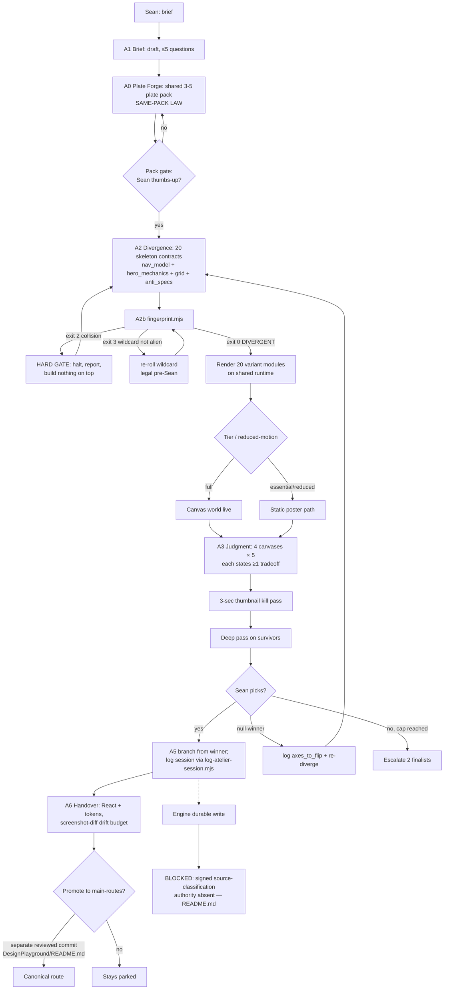

# Swan Brain Console v3 + 20-Variant Three.js Front-Page Fleet — Build Blueprint

- **Date:** 2026-09-13 · **Author:** DeepSeek Harness agent (builder) · **Status:** CANONICAL_CURRENT (supersedes the two 2026-08-26 console docs)
- **Worktree:** `tmp/worktrees/brain-console-20260913` · **Branch:** `feat/swan-brain-console-20260913` · **Base:** `origin/main` @ `aafe387a9` (2026-09-12)
- **Lane (rule 67):** `vs-claude--brain-console-20260913-d260fe8f92.lane.md`
- **Authority order:** `SWAN-CINEMATIC-DESIGN-SYSTEM.md` > `design-brain/design.md` > `.claude/skills/swan-atelier-studio/SKILL.md` > this packet.

---

## 0. Supersession and preservation (Skill step 4)

| Prior artifact | Classification | Evidence | Disposition |
|---|---|---|---|
| `SWAN-BRAIN-CONSOLE-BLUEPRINT-2026-08-26.md` | **HISTORICAL — self-declared REJECTED** | Its own front-matter line 2: `decision: REJECTED (GPT-5.6 Sol)`; line 11: analysis ran against `wip/comms-notifications-2026-07-05`, "2,285 commits behind `origin/main`"; line 75: "⚠ SUPERSEDED — read `SWAN-BRAIN-CONSOLE-ROUND2-2026-08-26.md` first" | NOT acted on. Preserved unedited. |
| `SWAN-BRAIN-CONSOLE-ROUND2-2026-08-26.md` | **STALE** | Same 2026-08-26 authorship and the same stale-branch defect class | Read for ideas only; no slice inherited as authority. |
| `SWAN-ATELIER-STUDIO-FINAL-PLAN-2026-08-18.md` + R2 rulings | **CANONICAL_CURRENT** | Landed as `.claude/skills/swan-atelier-studio/SKILL.md` on `origin/main` — the skill itself is the surviving canonical form | Obeyed. This packet implements its A0–A6 loop; it does not replace it. |
| front-page atelier run, branch `feat/front-page-atelier-run` @ `4362c37e7` | **CANONICAL_CURRENT but OFF-MAIN** | `git merge-base --is-ancestor 4362c37e7 origin/main` → exit 1 (NOT in main); its 10 variants live in `scripts/design-brain/atelier/frontpage/*.dc.html` + `build-8run-v2.mjs` | Treated as **precedent and plate-material source**, never as a competing plan. Its variants are HTML/JPEG; none import `three`. |

**Why a v3 rather than an amendment.** Both 2026-08-26 documents are self-invalidated on this exact axis (wrong branch, 2,285 commits stale), so amending them would carry forward a defect their own author retracted. This packet is authored **on** `origin/main` and supersedes both.

**Preservation proof.** No file was edited or deleted to produce this packet. The two 2026-08-26 docs remain byte-identical on disk; `git status` in this worktree shows only added files.

---

## 1. Requirements

**User / job / outcome.** Sean wants (a) an enterprise-grade console UI where AI agents and he can drive design generation, (b) **20** structurally distinct Three.js front-page variants derived from the live SwanStudios homepage, (c) page copy that does not read as AI-generated, and (d) all of it governed by the SWAN Design Brain rather than generic model taste.

| ID | Requirement | Acceptance criterion (measurable) |
|---|---|---|
| R1 | 20 Three.js front-page variants exist | Exactly 20 variant scene modules resolve at type-check; registry exposes 20 entries |
| R2 | Variants are *structurally* distinct, not restyled | `fingerprint.mjs` reports **DIVERGENT** for all 20 (exit 0); no two share `nav_model + hero_mechanics + grid` |
| R3 | Every variant renders real Three.js | Each variant imports `three`; no variant is a static image or CSS-only imitation |
| R4 | Variants derive from the live homepage | Each variant composes the 12 canonical sections' *content* from `HomeData`/`marketingStats`; each declares which sections it keeps, merges, or re-orders |
| R5 | Copy does not read as AI-generated | Copy pack passes the anti-slop gate (§6 T7): zero banned phrases, concrete nouns, no "unlock/elevate/seamless/journey" class |
| R6 | Console is a real UI surface | Zero-dependency `node:http` server; one URL; keyboard-navigable; loads with no network and no GPU |
| R7 | Console shows the learning engine honestly | Engine tabs render **BLOCKED / read-only** with the gating reason quoted from `scripts/design-brain/README.md`; no write control is offered or faked |
| R8 | Nothing canonical changes | `main-routes.tsx` unmodified; homepage remains `HomePage.V4`; variants reachable only via parked registry |
| R9 | Accessibility + motion floor | Reduced-motion path renders a static poster; all interactive targets ≥44px; WCAG 4.5:1 |
| R10 | Judgment instrument recorded | Each variant carries ≥1 stated tradeoff; tournament rounds are canvas pages |

**Scope / non-goals.** IN: console shell, 20 variants, copy pack, registry wiring, tests. **NOT**: promoting any variant to `/`; enabling design-brain durable writes; Mobbin corpus writes; touching `HomePage.V4`; any backend, DB, auth, or payment path; installing `@react-three/fiber` (not a dependency and not needed).

**Roles.** Builder = this agent. Sean = taste-cut and adjudicator. Kimi K3 = rule-46 final reviewer (external gate; **not run** in this slice — see §10).

**Assumptions / unresolved decisions.**
- A1 `[VERIFIED]` MAPIN = Mobbin. `external-reference-mcp.md:17` — "If someone says 'Mobin' in notes or transcripts, normalize it to Mobbin." A full-machine search found zero `MAPIN` artifacts (subagent recon, 82,579 files enumerated).
- A2 `[VERIFIED]` Mobbin MCP is **registered on this machine but NOT callable from this runtime**. `C:\Users\BigotSmasher\.codex\config.toml` registers 7 servers: `playwright`, `open-design`, `node_repl`, `render`, `linear`, **`mobbin`**, `hermes-public-graph`. The DSH session in which this packet was authored exposes only `playwright` (`.claude/mcp.json`). So the *connector exists* while *these tools are not callable here* — `external-reference-mcp.md:20` states this must be proven per task, and `:23` requires the literal marker `[MOBBIN UNAVAILABLE]` in the reference receipt. Recorded in §9/B1.
- A2b `[VERIFIED]` **Max ONE lazy Three.js scene per page, with a mandatory 2D fallback.** `design-brain/adapters/cinematic-site-generator.md` §7: "Three.js/R3F progressive-enhancement ONLY, max ONE lazy scene behind Suspense with 2D fallback; mandatory in-file tier ladder (Full cinema / Lean cinema / Reduced motion)." This **shapes the variant architecture** (see §2): 20 variants does NOT mean 20 WebGL canvases per page — it means 20 distinct front pages, each carrying exactly one lazy scene plus a committed 2D fallback path.
- A2c `[VERIFIED]` A prior design console exists but is **dormant**: `frontend/src/components/DashBoard/Pages/admin-design/HomepageDesignLab.tsx` (5 cinematic variants, preview-only). Repo-wide grep found zero route/import/JSX references to it or to `admin-design` outside that file. Classified dormant in §10; not reused, not deleted (rule 34).
- A3 `[VERIFIED]` Motion tier is a first-class home contract (`useAnimationTier` → full/balanced/essential) and must be honoured by every variant.
- **U1 (consequential, needs Sean):** whether any variant should later be promoted to `/` — deliberately out of scope; promotion is a separate reviewed commit per `DesignPlayground/README.md`.
- **U2 (consequential, needs Sean):** console host — operator-only local tool vs. admin-dashboard route. This packet builds the **local operator tool** (v1 fence), matching the surviving precedent shape.

**Business rules / invariants.**
- I1 Variants are **parked**; canonical route imports never consume `playgroundRegistry.ts` (`playgroundRegistry.ts:1-6`).
- I2 No hardcoded colours in new UI; `var(--token, #fallback)` only (rule 6).
- I3 ≤300 lines per file (rule 4); blueprint header on components >100 lines (rule 5).
- I4 The design-brain engine stays fail-closed. `scripts/design-brain/README.md`: *"new receipt writes remain fail-closed until the signed source-classification authority adapter has production keys, trusted time, and revocation state"*.
- **Forbidden side effects:** no `git push`; no canonical-route edit; no DB access; no LLM/provider spend; no Mobbin writes; no `--amend`/rebase (rule 45).

---

## 2. Blueprint

**Two surfaces, one doctrine.**

```
Design doctrine (design.md, 22 archetypes, tokens)  ← single source of truth
        │
        ├─► SURFACE A — Swan Brain Console (operator tool, node:http, zero-dep)
        │     reads doctrine + engine state; WRITES nothing to the engine
        │
        └─► SURFACE B — Variant fleet (20 raw-Three.js modules)
              consumed by the EXISTING /design-playground gallery
              (playgroundRegistry.ts) — never by main-routes.tsx
```

**Component / state ownership.**

| Component | Owns | Does NOT own |
|---|---|---|
| `three-runtime/createWorld.ts` | Renderer, camera, DPR cap, RAF loop, IntersectionObserver + visibilitychange pause, resize, dispose | Any variant's content or layout |
| `three-runtime/useWorldMount.ts` | React mount/unmount lifecycle, tier + reduced-motion gating | Scene composition |
| `three-worlds/<id>/skeleton.ts` | The variant's divergence contract (`nav_model`, `hero_mechanics`, `grid`, `anti_specs[]`, `wildcard`) | Rendering details |
| `three-worlds/<id>/<Id>World.tsx` | That variant's scene + DOM overlay composition | Shared runtime internals |
| `three-worlds/registry.ts` | The 20-variant manifest | Canonical routing |
| `copy/pack.ts` | All human-visible strings for variants | Doctrine or tokens |
| Console `app.html` + per-tab modules | Presentation of doctrine/engine state | Engine writes |

**Dependencies.** `three@0.169.0` (already present, `frontend/package.json`). React 18 + styled-components (present). **Zero new dependencies.** Console uses Node builtins only (`node:http`, `node:fs`, `node:path`).

**Existing patterns reused (rule 18).**
- Raw Three.js import style: `CoachFocusLens.tsx:12` — `import * as THREE from 'three'` (the only pre-existing canvas-layer precedent).
- Parked-surface seam: `frontend/src/pages/DesignPlayground/playgroundRegistry.ts` + `README.md`.
- Canvas discipline: `HomePage/v-next/hero/OpticsCanvas.tsx` — DPR capped at 2 (0.5× coarse pointer), rAF paused by IntersectionObserver **and** `visibilitychange`, `pointer-events:none`, `aria-hidden`, `active` gate for reduced-motion.
- Motion tiers: `hooks/useAnimationTier`.

**Exact integration points.**
- `frontend/src/pages/DesignPlayground/playgroundRegistry.ts` — append entries; interface already supports `mobbinRefs: string[]` and `status: 'parked'`.
- `frontend/src/pages/HomePage/three-worlds/registry.ts` — new, self-contained.
- **No edit to** `frontend/src/routes/main-routes.tsx`.

**Tradeoffs (explicit).**
1. *Raw Three.js over react-three-fiber* — R3F is ergonomic but is not an installed dependency; adding it would be a new dependency and an unproven pattern in this repo. Chosen: raw three, matching the one existing precedent. Cost: more manual dispose/resize code, centralized in the runtime.
2. *20 in one gallery vs. 5-artboard canvases* — the atelier skill caps a **judgment canvas** at ≤5. Chosen: implement all 20, but present them as **4 tournament canvases of 5 + 1 finalists canvas**, which satisfies both Sean's "20–50, I pick the best" and the skill's ≤5 rule. 20 artboards on one page would violate the skill and make 3-second thumbnail judging impossible.
3. *Local operator console over in-app admin route* — keeps the console out of the production bundle and out of auth scope (U2 open).

---

## 3. Wireframes

### 3.1 Console — desktop (≥1280px)

```
┌──────────────────────────────────────────────────────────────────────────────┐
│  SWAN BRAIN CONSOLE            doctrine 22 · variants 20 · engine BLOCKED    │  ← status bar (generated at read time)
├────────────┬─────────────────────────────────────────────────────────────────┤
│ ▸ Doctrine │  VARIANT FLEET — TOURNAMENT ROUND 1 of 5                        │
│ ▸ Fleet    │  ┌───────────┐ ┌───────────┐ ┌───────────┐ ┌───────────┐        │
│ ▸ Canvas   │  │ V01       │ │ V02       │ │ V03       │ │ V04       │        │
│ ▸ Copy     │  │ [canvas]  │ │ [canvas]  │ │ [canvas]  │ │ [canvas]  │        │
│ ▸ Engine   │  │ nav: …    │ │ nav: …    │ │ nav: …    │ │ nav: …    │        │
│ ▸ Seats    │  │ tradeoff  │ │ tradeoff  │ │ tradeoff  │ │ tradeoff  │        │
│ ▸ Memory   │  └───────────┘ └───────────┘ └───────────┘ └───────────┘        │
│ ▸ Ship     │  ┌───────────┐        ◇ ghost cell: shared plate manifest        │
│            │  │ V05 WILD  │        "what all five hold constant"              │
│            │  │ [canvas]  │                                                  │
│            │  └───────────┘                                                  │
├────────────┴─────────────────────────────────────────────────────────────────┤
│ [◀ round] [round 1 2 3 4 · finalists]   [thumb pass ▸ deep pass]   [lever: …] │
└──────────────────────────────────────────────────────────────────────────────┘
```

### 3.2 Console — mobile (≤414px)

```
┌──────────────────────┐
│ SWAN BRAIN CONSOLE   │
│ engine BLOCKED       │
├──────────────────────┤
│ [Doctrine][Fleet]    │ ← 44px tabs
│ [Canvas][Copy]       │
│ [Engine][Seats]      │
├──────────────────────┤
│ ┌──────────────────┐ │
│ │ V01  [canvas]    │ │
│ │ nav: …           │ │
│ │ tradeoff: …      │ │
│ └──────────────────┘ │
│ ┌──────────────────┐ │
│ │ V02  [canvas]    │ │
│ └──────────────────┘ │  ← single column, no hover-only action
└──────────────────────┘
```

### 3.3 Variant page states

| State | Rendering |
|---|---|
| **loading** | Sapphire base `var(--bg-base,#002060)` + section labels as static skeleton. Never blank. |
| **empty** | N/A — variants are self-contained; no remote data. Declared, not silently skipped. |
| **partial** | WebGL context available but a texture fails → scene renders geometry with flat token colours; copy overlay unaffected. |
| **success** | Full scene + overlay at the resolved tier. |
| **denied** | WebGL unavailable/blocked → static poster path (`prefers-reduced-motion` path) plus a visible "static preview" note. Never a black box. |
| **validation-error** | N/A — no user input in v1 variants. |
| **failure** | Runtime throws → React error boundary renders the static poster; the fleet gallery keeps the other 19 usable. |
| **retry/recovery** | Context-loss listener (`webglcontextlost`) prevents default and re-inits once; second loss falls back to poster. |

**Keyboard / focus / a11y.** Every variant container is `role="region"` with an `aria-label`; canvas is `aria-hidden` + `pointer-events:none`; all real controls are DOM elements with `:focus-visible` outlines; gallery is a roving-tabindex list. **Responsive:** 320/375/414 single column; 768 two-up; 1280 four-up; 2560/3840 capped container with the canvas DPR cap unchanged (rule 24).

---

## 4. Flowchart (Mermaid)



**Blocked / error / cancel / retry / rollback coverage.** Blocked = the engine write path (`Y`), refused by design and surfaced in the console. Error = fingerprint collision (`G`) halts before rendering. Cancel = Sean stops at any gate; nothing is written beyond the parked registry. Retry = re-diverge (`R`) after a null-winner. Rollback = remove the two added registries; no canonical file was modified (§9 rollback).

---

## 5. Contracts

**Skeleton contract** (`three-worlds/<id>/skeleton.ts`) — the divergence unit, per the atelier skill's A2:

```ts
export interface SkeletonContract {
  id: string;                    // 'v01'..'v20'
  title: string;
  nav_model: NavModel;           // structural, drives fingerprint
  hero_mechanics: HeroMechanics;// interaction model, structural, drives fingerprint
  grid: GridModel;               // drives fingerprint
  chapters: number;
  anti_specs: string[];          // negatives aimed at the modal layout
  wildcard?: string;             // exactly one variant carries an alien seed
  tradeoff: string;              // MANDATORY ≥1 per artboard
  keeps: string[];               // canonical sections retained
  merges: string[];              // canonical sections folded together
}
```

`NavModel` ∈ `{ 'no-nav', 'side-rail', 'bottom-dock', 'sticky-minimal', 'progress-spine', 'chapter-dots', 'split-rail', 'command-palette', 'edge-tabs', 'horizon-bar', 'radial-hub', 'vertical-index', 'floating-pill', 'split-header', 'corner-anchor', 'ticker-nav', 'stepper-left', 'gutter-labels', 'overlay-drawer', 'orbital' }`.
`HeroMechanics` ∈ `{ 'scroll-scrub', 'pointer-parallax', 'depth-tunnel', 'type-only', 'object-orbit', 'field-reveal', 'measured-reveal', 'assembling-parts', 'liquid-surface', 'grid-ignition', 'line-draw', 'swarm', 'camera-dolly', 'shader-morph', 'instanced-field', 'light-sweep', 'fracture', 'waveform', 'terrain-fly', 'lens-refract' }`.
`GridModel` ∈ `{ 'full-bleed', 'editorial-12', 'asymmetric-7-5', 'broken-grid', 'modular-bento', 'single-column-measure', 'two-track', 'shelf', 'spine-offset', 'band-stack', 'mosaic', 'split-diagonal', 'rail-plus-well', 'tessellated', 'kanban-columns', 'sheet', 'ledger', 'orbit-ring', 'magazine-fold', 'free-float' }`.

**Contract rules.** `nav_model`, `hero_mechanics`, and `grid` are each drawn from a distinct enumerator, so 20 variants can be pairwise-unique on the fingerprint tuple while remaining doctrine-compliant. **Motion is deliberately NOT a seed axis** (atelier skill A2): motion enters winner-only, so a static artboard is not judged with its motion removed.

**Console ↔ engine contract.** Read-only. The console may `readFile` doctrine + engine artifacts and render counts **generated at read time** (never transcribed — the ROUND2 doc's own §0 warns that hand-maintained numbers go stale invisibly). It exposes no route that reaches `log-receipt`, `synthesize`, `corroborate`, `adjudicate`, or `emit-vault`. `S` spec mode is `enabled:false` and the console must show that state, not hide it.

**Copy pack contract.** One typed module; no string may be composed by concatenating a template onto a noun at runtime. Every claim must trace to a real source: stats only from `content/marketingStats`, features only from `HomePage/components/shared/HomeData.ts`. **No invented metrics** (data-truth rule).

**Privacy / trust boundary.** Console binds `127.0.0.1` only. It reads no `.env`, no client data, no PII; it prints file counts and doctrine headings, never record contents. Zero PII to LLMs (rule 8) — no provider egress exists in this slice at all.

**State / sequence / ERD applicability.** State diagram — N/A, the console is stateless between requests (each request re-reads doctrine; no cache to invalidate). Sequence diagram — N/A, single-process request/response with no async fan-out. ERD — N/A, no data model is introduced. Each is recorded here rather than silently omitted.

---

## 6. Test plan (IDs → action → expected → level → command)

| ID | Action | Expected observable | Level | Command |
|---|---|---|---|---|
| T1 | Type-check the new frontend modules | 0 new errors vs. baseline | unit/static | `npx tsc --noEmit` |
| T2 | Run fingerprint over the 20 skeletons | exit 0, verdict DIVERGENT | unit | `node scripts/design-brain/atelier/fingerprint.mjs <skeletons.json>` |
| T3 | Assert registry count | exactly 20 entries, all `status:'parked'` | unit | vitest |
| T4 | Assert every variant imports `three` | 20/20 true | unit | vitest (source scan) |
| T5 | Assert snapshot tuple uniqueness | no duplicate `nav_model+hero_mechanics+grid` | unit | vitest |
| T6 | Assert canonical route untouched | `main-routes.tsx` hash unchanged; no registry import from routes | contract | vitest |
| T7 | Anti-slop gate over the copy pack | 0 banned-phrase hits; 0 template-composed strings | unit | vitest |
| T8 | Engine BLOCKED state | console HTML contains the gate reason and offers no write control | integration | vitest over console render fn |
| T9 | Reduced-motion path | with `prefers-reduced-motion: reduce`, poster renders, no rAF loop starts | runtime | Playwright |
| T10 | Responsive matrix | no overlap/clip at 320/375/414/768/1280/2560/3840 | runtime | Playwright |
| T11 | Keyboard reachability | every control reachable, visible focus ring | runtime | Playwright |
| T12 | Canonical homepage unaffected | `/` still renders `HomePage.V4` hero headline | runtime | Playwright |

**RED contract suite.** T2/T3/T5/T7/T8 are authored **before** implementation and run first, expected to fail (module-not-found or assertion). Setup/import errors are explicitly **not** accepted as RED proof; each RED run must fail on the assertion, recorded in the receipt.

**Forbidden side effects asserted by tests:** no write outside the worktree; no network; no DB; no git mutation.

**Isolation.** All fixtures live under the new directories. No test touches production DB or `DATABASE_URL`. Playwright runs against a local dev server only.

---

## 7. Traceability

| Req | Acceptance | Artifact | Test | Slice | Status |
|---|---|---|---|---|---|
| R1 | 20 modules resolve | `three-worlds/registry.ts` | T1,T3,T4 | S3 | PLANNED |
| R2 | fingerprint DIVERGENT | `skeletons.json` + fingerprint | T2,T5 | S2 | PLANNED |
| R3 | real three usage | 20 scene modules | T4 | S3 | PLANNED |
| R4 | derives from live home | `copy/pack.ts` + per-variant `keeps` | T7 | S4 | PLANNED |
| R5 | anti-slop copy | `copy/pack.ts` | T7 | S4 | PLANNED |
| R6 | real console UI | console modules | T8,T11 | S5 | PLANNED |
| R7 | honest BLOCKED engine | console engine tab | T8 | S5 | PLANNED |
| R8 | nothing canonical changes | diff scope | T6,T12 | S6 | PLANNED |
| R9 | a11y + motion floor | runtime + variants | T9,T10,T11 | S3,S6 | PLANNED |
| R10 | judgment instrument | canvas pages + tradeoffs | T3 (tradeoff non-empty) | S6 | PLANNED |

**Uncovered / risk.** R4 is verified structurally (content imported from the canonical modules), not by semantic review of every sentence — a human taste pass is required at the canvas stage and is **not** substitutable by a test. Boundary covered only by mocks: none; T9–T12 are real-browser.

---

## 8. Implementation slices

| Slice | Entry evidence | Work | Exit evidence |
|---|---|---|---|
| **S1** | Packet exists | RED tests T2/T3/T5/T7/T8 authored; run and recorded failing | RED output captured |
| **S2** | S1 | 20 skeleton contracts + `skeletons.json` | fingerprint exit 0 DIVERGENT |
| **S3** | S2 | Shared runtime + 20 scene modules | T1,T3,T4 green |
| **S4** | S3 | Copy pack (anti-slop pass) | T7 green |
| **S5** | S4 | Console shell + tabs + BLOCKED engine state | T8,T11 green |
| **S6** | S5 | Registry wiring + 4 tournament canvases + finalists page | T6,T9,T10,T12 green |

**Dependencies.** S2→S3→S4→S5→S6 strictly ordered except S4, which may land after S3. **Compatibility/migration:** none — additive only; no route, schema, or token change. **Rollout:** the worktree branch only; no push without Sean. **Recovery/rollback:** delete `three-worlds/`, `SwanBrainConsole/`, `scripts/swan-brain-console/`, revert the two registry additions — canonical surfaces were never touched, so rollback is deletion-only.

**Logs/metrics.** Console status bar prints counts generated at read time; fingerprint prints verdict + collision pairs; each variant declares `data-variant-id` for QA selection. **Performance budget:** ≤60fps scrub target, canvas DPR capped at 2 (0.5× coarse), rAF paused offscreen and on tab-hide, ≤2 MiB per artboard entry, ≤16 MiB per canvas document, first contentful paint = static poster on every tier (never blank). **Operational owner:** Sean.

**Applicability decisions.** Migration/restore — N/A (no persistence). Rollout flags — N/A by design: `DesignPlayground/README.md` states design surfaces must never gate behind a flag. Permissions matrix — N/A (localhost operator tool, no roles).

---

## 9. Hostile review, decisions, blockers

**Self-attack (rule 17) — findings and resolutions.**

1. **"20 variants × full-page scenes cannot fit ≤300 lines/file."** Correct if each variant were a whole page. Resolution: split into a shared runtime (owns renderer/loop/lifecycle) + per-variant scene modules that only compose. Verified by design; enforced by T1 + a line-count check.
2. **"You are about to re-create the exact defect the last console packet died of — working on a stale branch."** Mitigated: work is in a worktree cut from `origin/main@aafe387a9`, and every load-bearing claim in §0–§2 is cited to a file on that base.
3. **"Fingerprint distinctness could be gamed by permuting enum strings while the pages look the same."** Real risk. Mitigation: `anti_specs` are mandatory per variant and are aimed at the modal layout, so a variant that differs only by enum label still has to state what it refuses to do; the human taste pass at the canvas stage is the actual defence, and this packet says so rather than claiming the test proves visual distinctness.
4. **"Console may leak engine contents or invite writes."** Mitigated by contract (§5) + T8 asserting the absence of write controls.
5. **"Motion-axis seeds would bias judging."** Honoured: motion excluded from the fingerprint, per atelier A2.

**Blockers (named, not hidden).**
- **B1 — Mobbin MCP registered but not callable from this runtime** `[VERIFIED]`. `mobbin` is a registered server in `C:\Users\BigotSmasher\.codex\config.toml`; this DSH session exposes only `playwright`. Per `external-reference-mcp.md` §2 the reference receipt carries **`[MOBBIN UNAVAILABLE]`** and design proceeds from `SWAN-CINEMATIC-DESIGN-SYSTEM.md` + `design.md` + the 22 archetypes. **Path forward for Sean:** the connector is real and already configured, so Mobbin-backed reference intake can run from a Codex runtime (or once Mobbin is added to the DSH harness) without any new setup from him. This is a runtime-scope limitation, not a missing subscription.
- **B2 — Design-brain durable writes are fail-closed** `[VERIFIED]` (`scripts/design-brain/README.md`). The console renders this state honestly; no taste log can be persisted until the authority adapter exists. Consequence: Sean's picks in this round are captioned in the canvas but **not** machine-logged. Sean chose this explicitly.
- **B3 — Rule-46 Kimi K3 review NOT run.** This slice makes no commit. Per rule 46 the external gate is required before commit; it is deferred to that point, and no "ready to ship" claim is made.

---

## 10. Readiness receipt

**Canonical artifacts.** This packet. Superseded: the two 2026-08-26 console docs (preserved, unedited). Obeyed: `.claude/skills/swan-atelier-studio/SKILL.md`, `design-brain/design.md`, `design-brain/external-reference-mcp.md`, `DesignPlayground/README.md`.

**Canonical Surface Receipt (rule 26) — the homepage we derive from.**
- (a) route file: `frontend/src/routes/main-routes.tsx:59-63` mounts `/`.
- (b) mounted component: `HomePage.V4` via `lazyLoadWithErrorHandling(() => import('../pages/HomePage/components/HomePage.V4'), 'Home Page V4', () => import('.../HomePage.V3'))` — V3 is the **error fallback**, not the mount.
- (c) consumer: `frontend/src/pages/HomePage/components/HomePage.V4.tsx` (99 lines) orchestrating 12 sections + `PrismCapture` + `EvidenceLensBand`.
- (d) exact content sources: `components/shared/HomeData.ts`, `content/marketingStats.ts`.
- (e) backend route: **N/A** — the homepage reads static content modules, no API path.
- (f) authoritative fields: `FEATURES`, `PROGRAMS`, `GOLF_FEATURES`, `TESTIMONIALS`, `STATS`, `SOCIAL_CATEGORIES`, `TRAINER_FEATURES` in `HomeData.ts:12-98`; `MARKETING_STATS` keys `yearsExperience`, `clientsTransformed`, `sessionsDelivered`, `swimmersTaught`, `lbsLostTogether`, `satisfactionPct` (`HomeData.ts:74-79`).

**Surface classification (rule 27).**

| Surface | Class | Evidence |
|---|---|---|
| `HomePage.V4` at `/` | **canonical** | `main-routes.tsx:59-63` |
| `HomePage.V3` | **legacy** (error fallback only) | same call, 3rd arg |
| `HomePage/v-next/HomeVNext` | **dormant** (parked) | `playgroundRegistry.ts` entry `id:'home'`, `status:'parked'` |
| `DesignPlayground/concepts/*Homepage` (6 series) | **dormant** (preview-only) | `playgroundRegistry.ts:1-6` header + `LegacyConceptPreviewPage` |
| 20 new three-worlds | **dormant** by intent (parked this slice) | to be added to `playgroundRegistry.ts` |

**Applicability matrix.** Requirements ✅ · Blueprint ✅ · Wireframes ✅ (3 UI surfaces, all states) · Mermaid ✅ (rendering limitation: no Mermaid renderer in this runtime, so the source above is authoritative and the preview is **NOT RENDERED** — disclosed per protocol) · Contracts ✅ · Test plan ✅ (12 IDs, RED suite defined) · Traceability ✅ · Slices ✅ · Hostile review ✅ · Receipt ✅.

**Status.** **PLAN READY.** Not IMPLEMENTATION VERIFIED, not DEPLOYED.
**Evidence run so far:** recon only — lane digest, canonical route read, dependency check, machine-wide MAPIN/Mobbin search. No implementation test has been run yet; none is claimed.
**Next authorized slice:** S1 — author and run the RED contract suite.
