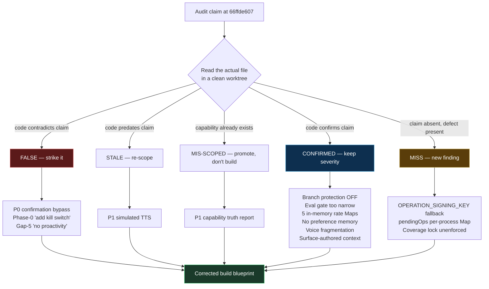
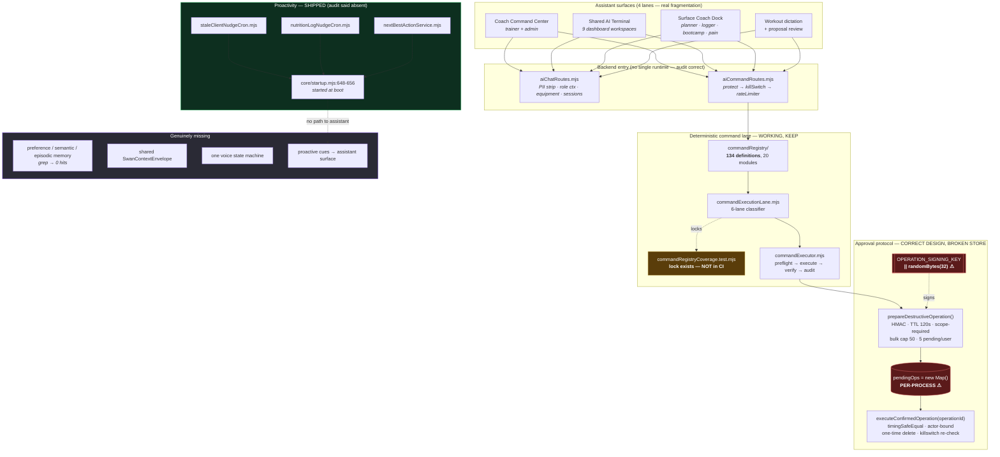
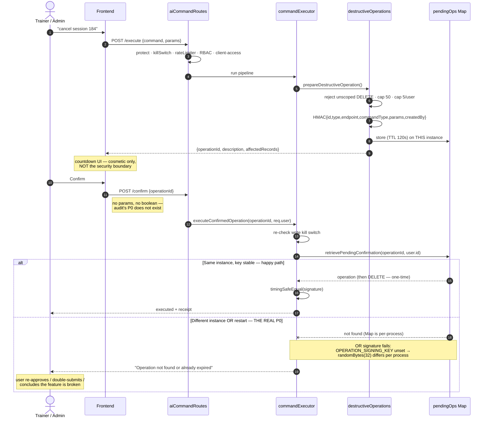
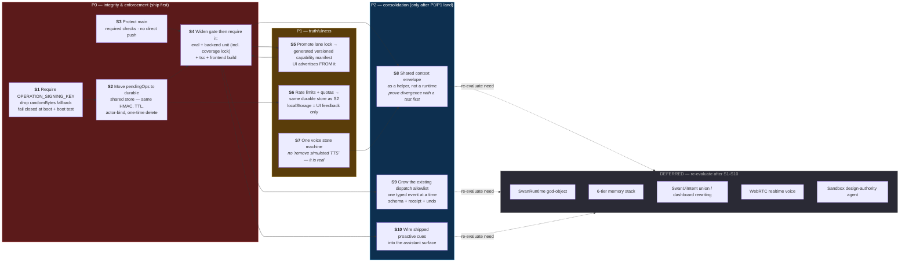

# Swan Coach — Jarvis Readiness: CORRECTED Master Report & Build Blueprint

**Supersedes:** the original "Jarvis Readiness Audit" (unsigned, 2026-08-20)
**Target:** `SeanSwan/-SS-PT-New` · `main` @ `66ffde60784c1e47f8344c44b113214b1a529e7d`
**Method:** grounded file-read verification in a clean worktree at that exact commit,
then a 5-seat hostile-review panel against that evidence.
**Panel:** Claude Opus 5 (grounded verifier + Final Decider) · GLM 5.3 · Kimi K3 ·
Grok 4.6 · Qwen 3.8 (local, free)
**Date:** 2026-08-21

---

## 0. One-paragraph verdict

The original audit's *architectural instincts are sound and its CI finding is
excellent*, but **its headline P0 is fabricated**, two more findings are false or
stale, one is mis-scoped as greenfield work that already exists, and one whole
"gap" section describes a subsystem that is built and wired at boot. Meanwhile it
**walked past the actual P0 sitting in the same file it claimed to have read**.
The corrected picture: Swan Coach is not "halfway to Jarvis with a broken safety
model" — it is **a working, deterministic, genuinely well-guarded command center
with two production-config defects and no CI enforcement**. The fix is roughly
four small changes and a GitHub setting, not a nine-file runtime rewrite.

---

## 1. Claim-by-claim disposition

Every row was verified by file read at `66ffde607`. `✗` = the audit is wrong.

| # | Audit claim | Disposition | Evidence |
|---|---|---|---|
| 1 | **P0** — backend accepts client-supplied `confirmation.confirmed === true`; caller can skip the ceremony | **✗ FALSE — vulnerability does not exist** | `aiCommandRoutes.mjs:365-378` — `/confirm` accepts **only** `operationId`. Repo-wide grep for a client-authored confirmation boolean in the command lane returns **zero** hits (the single `confirmed === true` match is an unrelated list filter at `session.service.mjs:651`) |
| 2 | **P0** — main does not enforce the eval gate | **✓ TRUE — the one true P0** | `gh api …/branches/main` → `{"protected": false, "required_checks":{"checks":[],"contexts":[],"enforcement_level":"off"}}` |
| 3 | **P1** — eval gate too narrow | **✓ TRUE** | `.github/workflows/ai-eval-gate.yml` runs only `npm run eval > ../ai-eval-report.json`. No tsc, vitest, build, E2E, or secret scan. 4 workflows exist total |
| 4 | **P1** — "134 definitions" needs a generated truth report | **⚠ MIS-SCOPED — half-built** | `commandExecutionLane.mjs` already classifies all 6 lanes deterministically; `commandRegistryCoverage.test.mjs` already **locks** membership and fails on raw `not_wired` |
| 5 | **P1** — in-memory rate counter, localStorage quota | **✓ TRUE (confirmed deeper)** | `services/ai/rateLimiter.mjs` — **five** in-process Maps: `userRequestsPerMinute`, `userRequestsPerHour`, `concurrentUsers`, `globalRequests`, `rateLimitHits` |
| 6 | **P1** — `usePremiumTTS` simulates speaking with a timer | **✗ FALSE / stale** | `usePremiumTTS.ts:130,133,141,154,170,171` calls real `window.speechSynthesis` — `getVoices()`, `speak()`, `cancel()`. Grep for `simulat\|setTimeout\|disabled` → **no matches** |
| 7 | **P1** — voice is fragmented across surfaces | **✓ TRUE** (minus the TTS example above) | Four distinct paths confirmed |
| 8 | **P1** — context is surface-authored | **✓ TRUE** | Each surface builds its own payload |
| 9 | **Phase 0** — "add a server-side kill switch" | **✗ FALSE — two already exist** | `commandLaneControls.mjs` — `isCommandLaneEnabled()` (`AI_COMMANDS_ENABLED`) and `areCommandWritesEnabled()` (`AI_COMMAND_WRITES_ENABLED`); re-checked inside `executeConfirmedOperation` so an op minted before a flip cannot execute after |
| 10 | **Gap 5** — "proactivity is mostly absent from the user-facing runtime" | **✗ LARGELY FALSE** | `staleClientNudgeCron.mjs` + `nutritionLogNudgeCron.mjs` are **started at boot** (`core/startup.mjs:648-656`); `nextBestActionService.mjs` is served via `progressPulseController.mjs:20,45,72`. The audit's own example of missing behaviour ("three clients have not logged workouts in seven days") **is a shipped, scheduled cron** |
| 11 | **Gap 4** — memory is thread-memory only, no preference/semantic tier | **✓ TRUE** | Grep for `preferenceMemory\|userPreference\|semanticMemory\|episodicMemory` across `backend/services` + `backend/models` → **zero hits** |
| 12 | **Gap 2** — UI authority is 4 allowlisted workout events | **✓ TRUE** | `coachFrontendDispatchClassifier.mjs`, `coachDispatchEligibilityService.mjs`, `aiChatService.mjs`, `workoutCommands.mjs` |
| 13 | 134 definitions ≠ 134 capabilities | **⚠ HALF-TRUE** | The count drift is real and self-documented (`commandRegistry/index.mjs:6-12`). But the audit's framing of `not_wired` as a live bucket is **stale**: `commandRegistryCoverage.test.mjs:16-21` asserts `expect(unclassified).toEqual([])` — **the raw `not_wired` bucket is empty and CI-lockable.** The point survives only via `manual_only` / `chat_fallback` *(caught by GLM 5.3)* |

**Score: 6 confirmed · 4 false · 2 mis-scoped/half-true · 1 largely false.**

---

## 2. What the audit MISSED — the real P0

This sits in `destructiveOperations.mjs`, the *same file* whose protocol the audit
claimed was absent.

```js
// backend/services/ai/destructiveOperations.mjs:12
const OPERATION_SECRET = process.env.OPERATION_SIGNING_KEY || crypto.randomBytes(32).toString('hex');
// :17-18
const pendingOps = new Map();   // In-memory store (fallback when Redis is disabled — which it currently is in production)
```

**Three compounding defects:**

1. **Ephemeral signing key.** If `OPERATION_SIGNING_KEY` is unset in production the
   HMAC secret is random *per process*. Every deploy or restart silently
   invalidates in-flight approvals; two instances cannot verify each other's
   signatures.
2. **Per-process approval store.** `pendingOps` is a `Map`, with an inline comment
   confirming Redis is disabled in production. Mint-on-instance-A → confirm-on-
   instance-B fails with *"Operation not found or already expired."* The
   destructive-confirm lane is **non-deterministic under horizontal scale** — in
   the one place determinism matters most.
3. **It violates the repo's own spec.** `AI-Village-Documentation/GOD-LEVEL-AI-UPGRADE-PROMPT-V3.md:599`
   declares `const OPERATION_SECRET = process.env.OPERATION_SIGNING_KEY;` with **no
   fallback**, and `:806` lists it in `REQUIRED_ENV`. The shipped code silently
   degrades from its own design document.

**Severity inversion:** the audit flagged in-memory Maps for the *cosmetic
transcription quota* (P1) and missed the identical defect in the *security-critical
approval store*. This is not a bypass — it is an availability and integrity failure
of the only approval protocol Swan has. The realistic exploit is human: users who
hit "Operation not found" twice will re-approve, double-submit, or route around the
safety UX entirely.

**Second miss (compounding):** `commandRegistryCoverage.test.mjs` — the one test
that would stop silent capability drift — **is not a required check**, because
branch protection is off. The audit asked for a truth report while the truth
*lock* it already had was unenforced.

**Third miss, then narrowed:** Grok proposed auditing `process.env.X || fallback` as
a systemic class. I ran it — `grep -rnE "process\.env\.[A-Z_]+\s*\|\|" backend/services/ai backend/middleware`
returns 25 hits, and **all but one are benign defaults** (model names, timezones,
base URLs, an empty-string admin allowlist that fails *closed*).
`destructiveOperations.mjs:12` is the sole security-critical instance. Grok's
instinct was right; the blast radius is one line, not a program.

---

## 3. Panel convergence — and where I overrule a reviewer

| Finding | GLM 5.3 | Kimi K3 | Grok 4.6 | Qwen 3.8 | Claude (verifier) |
|---|---|---|---|---|---|
| P0 #1 confirmation bypass is FALSE | ✓ | ✓ | ✓ | ✓ | ✓ **file-read** |
| Simulated-TTS claim is FALSE | ✓ | ✓ | ✓ | ✓ | ✓ **file-read** |
| Branch protection is the true P0 | ✓ | ✓ | ✓ | ✓ | ✓ **`gh api`** |
| Signing key + `pendingOps` is the real P0 | ✓ | ✓ | ✓ | ✓ | ✓ **file-read** |
| Capability report is half-built | ✓ | ✓ | ✓ | ✓ | ✓ **file-read** |
| SwanRuntime is over-engineered | ✓ | ✓ | ✓ | ✓ | ✓ concur |
| Kill switch already exists | ✓ | — | partial | — | ✓ |
| `not_wired` bucket is empty + locked | ✓ **unique** | — | — | — | ✓ verified |
| HMAC is inert under current topology | ✓ **unique** | — | — | — | ✓ concur |
| The two P0s amplify each other | ✓ **unique** | — | — | — | ✓ concur |
| Proactivity already shipped + wired | — | — | — | — | ✓ **unique** |

### GLM's two sharpest additions

**(a) The HMAC is currently inert.** With a per-process secret *and* a per-process
store, no signed payload ever crosses a trust boundary — there is no adversary path
where `timingSafeEqual` matters. The cryptographic rigor is pointed at nothing while
key lifecycle and shared storage go unhandled. This *reorders* the fix list: moving
the store to Redis is what makes the existing crypto meaningful, not an add-on to it.

**(b) The two P0s interlock.** With branch protection off, any direct push that
restarts instances silently voids every in-flight approval. The audit treated its two
P0s as independent; one amplifies the other.

**Where I narrow GLM:** GLM ranked "provision Redis in production" as a blocking
P0-enabler. Verified — **Redis is already wired**: `backend/config/session.mjs:21,33,47-49`
builds an `ioredis` client directly from Render's `REDIS_URL`, with
`initializeSession()` and `closeRedisConnection()` exported. S2 therefore *reuses
existing, configured infrastructure*; it is not an infra project. Confirm `REDIS_URL`
is set on the Render service and the enabler collapses into the slice.

**Where GLM dissents from me:** GLM calls the 72/58/45 scores "unweighted numerology"
and says delete them. It has a point — they are unfalsifiable. I keep corrected scores
in §8 as *directional only*, with this dissent recorded. Do not cite them as evidence.

**Overruling Qwen:** Qwen wrote *"the SwanRuntime is a hallucination — there is no
evidence in the seed that this exists."* That is a misread. The audit **proposes**
SwanRuntime as target architecture; it never claims it exists. Qwen's conclusion
(over-engineered, discards working code) is right; its stated reason is wrong.
Recorded so the reasoning does not propagate.

**Overruling the panel collectively:** all four external seats accepted the audit's
Gap-5 framing that proactivity is missing. It is not — see §1 row 10. That section
of the audit should be struck, not sequenced into "Phase 4." No external seat
caught this because it was outside the evidence seed I gave them; it came from my
own pass. **Treat every seat's silence as unverified, never as agreement.**

---

## 4. Verification flow — how each claim was dispositioned



---

## 5. What is ACTUALLY built — the truthful as-is architecture



---

## 6. The confirmation lane — what actually ships, and exactly where it breaks



---

## 7. Corrected build blueprint — dependency-ordered

The original audit's Phase 0–5 is replaced. **No `backend/services/swanRuntime/`.**
Every slice below is small, independently shippable, and hostile-reviewed to dry.



### Slice table

| Slice | Change | Why | Blast radius | Verification |
|---|---|---|---|---|
| **S1** | Remove the `\|\| randomBytes(32)` fallback; throw at boot if `OPERATION_SIGNING_KEY` is unset or short; add to required-env validation | Restores the repo's own documented contract; stops per-process secrets | 1 file + boot validation | Boot test: unset → refuses to listen. Set → boots |
| **S2** | Move `pendingOps` to a durable shared store (Redis if wired, else a DB table) preserving HMAC payload, 120s TTL, actor-bind, one-time delete, per-user cap | The actual confirmation P0 — makes mint/confirm work across instances and restarts | 1 file + store | Multi-instance mint/confirm test; restart test; replay test must still fail |
| **S3** | Enable branch protection on `main`: required checks, no direct push, no admin bypass for the AI lane | Currently a firehose — the only finding that is both true and exploitable today | GitHub setting | `gh api …/branches/main` → `protected: true` with non-empty contexts |
| **S4** | Widen `ai-eval-gate.yml` to run eval + backend unit (**including `commandRegistryCoverage.test.mjs`**) + tsc + frontend build, then mark required | Without this, S3 gates nothing and the existing drift lock stays inert | 1 workflow | PR with a deliberately undispatched command must fail the required check |
| **S5** | Emit the already-computed lane map as a versioned artifact; command center / terminal / dock advertise **from** it | Stops "134 schemas" being read as 134 capabilities. Promote, do not greenfield | 1 generator + UI read | Manifest matches `getCommandExecutionLane` for all 134; UI shows `manual_only` / `not_wired` truthfully |
| **S6** | Move the five `rateLimiter.mjs` Maps + transcription quota to the S2 store, with user/tenant/feature dimensions | Abuse control that survives restart and multi-instance | 1 file | Restart mid-window → count persists |
| **S7** | One voice capability service with explicit states; `SPEAKING` only when audio is actually playing | Real fragmentation. **Do not** "remove simulated TTS" — `usePremiumTTS` is genuine | voice hooks | State-machine unit tests across all four surfaces |
| **S8** | Extract one context builder shared by command center, terminal, dock — **after** a test proves divergence | Fixes the real drift without a runtime god-object | shared helper | Failing test first: same selection, different surfaces, same envelope |
| **S9** | Extend `coachFrontendDispatchClassifier` with typed events as the product needs them — schema, role, receipt, undo | Grows UI authority safely on the pattern that already works | classifier + registry | Per-event allowlist + payload schema tests |
| **S10** | Surface `nextBestAction` + nudge-cron output inside the assistant | Proactive detection is **already shipped and wired** — only the assistant path is missing | wiring | Assistant raises a stale-client cue without being asked |
| **S11** | Adversarial test pack locking the approval lane: confirm-without-mint · replay a consumed `operationId` · cross-user `operationId` · expired TTL · execute-after-kill-switch · direct API call bypassing the frontend | These behaviours **already hold** — lock them so they cannot regress. This is the 10% of the dead P0 that survives *(GLM)* | tests only | All six must fail closed |
| **S12** | Add tenant + role-at-approval into the signed HMAC payload; step-up auth for top-risk ops | The genuine hardening kernel left after striking the fake P0 *(GLM)* | 1 file | Signature must not verify if role changed between mint and confirm |

### Non-negotiable invariant for any future runtime *(GLM)*

If a `SwanRuntime` is ever built, its charter must state this in writing before the
first file:

> **NL classification → registry → dispatcher stays deterministic.
> The runtime may SELECT writes. It may never AUTHOR them.**

The audit itself calls the chat/command split "one of the strongest parts of the
system," then makes adapter-wrapping it the first structural move. Without the
invariant above, Phase 1 erodes the system's single best property.

**Explicitly NOT doing now** (and why): the `swanRuntime/` nine-file tree, the
six-tier memory stack, the `SwanUiIntent` dashboard-rewriting union, WebRTC realtime
voice, and the sandbox design agent. None of them are in the dependency graph of
anything that is broken, and Phase 1 as written would replace a *working, tested*
HMAC two-phase commit with a reimplementation — the bug is the `Map` and the random
key, not the absence of a class named `SwanTurn`.

---

## 8. Corrected scores

| Target | Audit | Corrected | Why |
|---|---|---|---|
| Constrained fitness ops copilot | 72 | **78** | Proactive nudges + next-best-action are shipped and wired; the audit scored them as absent |
| Production-safe autonomous actor | 58 | **62** | Approval protocol is materially stronger than assessed (HMAC, actor-bind, one-time, TTL, caps, kill-switch re-check) — but the per-process store and ephemeral key are a real deduction, and open `main` is worse than the audit conveyed |
| Full Jarvis assistant | 45 | **45** | Unchanged. Memory tiers, one runtime, cross-surface voice, and broad UI authority genuinely are absent |

The gap to Jarvis is real. The **safety crisis is not** — it was largely
manufactured by not reading `/confirm`.

---

## 9. Standing lesson

An audit that says *"appears to accept"* has told you it inferred rather than read.
Three of this audit's four false findings trace to a single habit: reasoning from
the frontend's appearance to the backend's contract. The countdown UI looked like
the security boundary, so the boundary was assumed to be the countdown. The
correction is procedural, not attitudinal — **open the route handler before ranking
a route's severity.**

---

*Panel: Claude Opus 5 (grounded verifier / Final Decider) · GLM 5.3 · Kimi K3 ·
Grok 4.6 · Qwen 3.8. External spend this run: ~$0.09 actual (Kimi $0.049 + Grok
$0.044); GLM subscription; Qwen local/free.*
