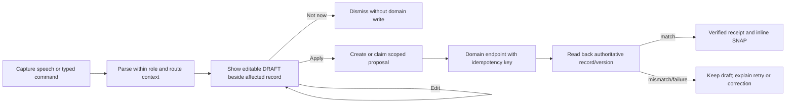
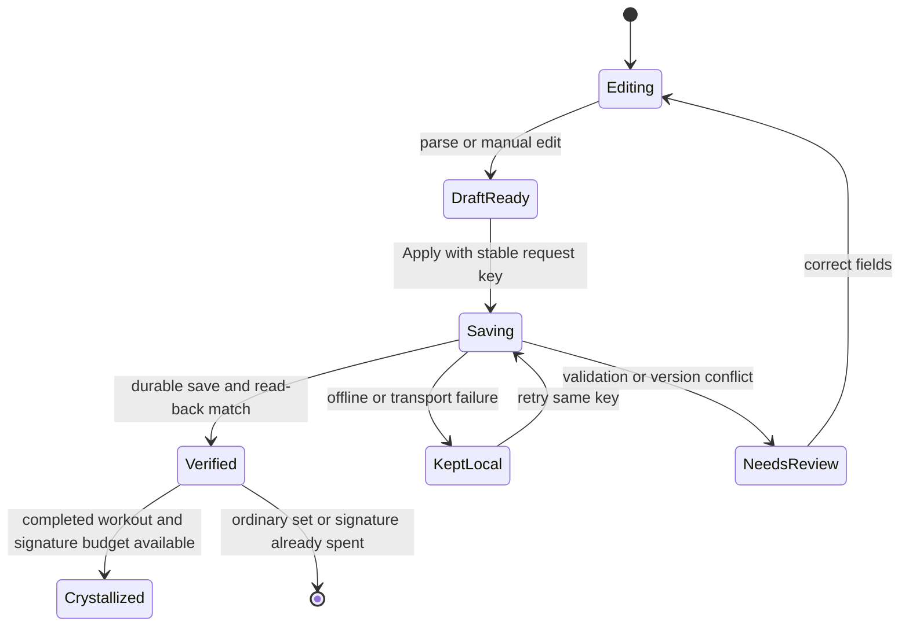
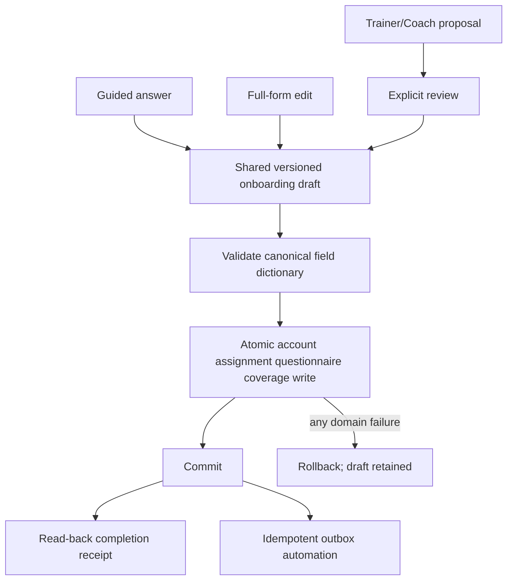
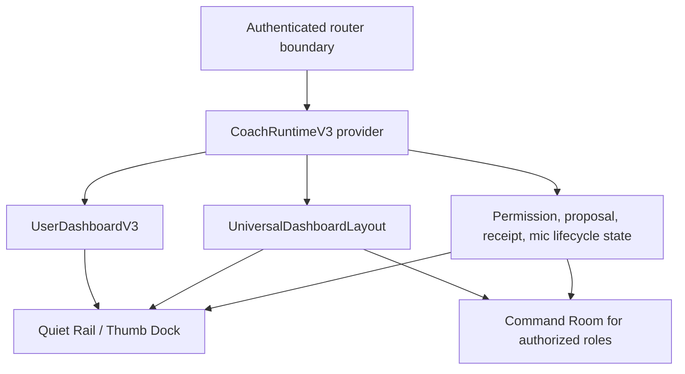

# Swan Coach V3 — UX Blueprint and Wireframes

## Re-pin receipt (2026-08-16, amendment A4 gate)

`origin/main` has moved from the pinned `610295fb4aeb` to **`e89ee80d72f6`** — **323 files changed**.
Per A4, drift blocks slice entry until verified, so it is recorded here rather than assumed benign.

**Coach-adjacent files that changed since the pin** (these invalidate any claim in this doc that
rests on the old tree):

- `WorkoutLogger/WorkoutLogger.tsx`
- `WorkoutLogger/WorkoutLoggerCoachTerminal.tsx` *(+ its test)* — **a Coach terminal now lives inside
  the logger; this did not exist at the pinned SHA and is not described anywhere in this doc**
- `WorkoutLogger/useWorkoutSubmit.ts` *(+ `useWorkoutSubmit.aiAckTruth.test.tsx`)*
- `WorkoutLogger/workoutCoachContext.ts` *(+ test)*
- `WorkoutLogger/workoutSubmitOutcome.ts`
- `WorkoutLogger/WorkoutLogger.clientRoute.test.ts`, `WorkoutLogger.protocolSections.test.tsx`

**Consequence:** the logger↔Coach boundary is more built than this doc assumes. Any slice touching
the logger must read `WorkoutLoggerCoachTerminal.tsx` and `workoutCoachContext.ts` first — the
"two logger families" finding in the GLM review was scoped before this delta was accounted for and
should be re-checked against it.

The 2026-08-15 GLM review packets were themselves sourced at `e89ee80d72f6`, so their inventory is
current; only this document's pin was stale.

## Latest Design Brain receipt

Fetched `origin/main` on 2026-08-12. The latest Design Brain sequence is REV2 taxonomy and field
techniques (`c41c47b`), corrected router mode (`0ff8523`), typography/grid substrate (`75b3dbc`),
414px breakpoint implementation (`1bf3018`), and Forge contract (`2ca87f7`). Current main is
`610295f`; its only deltas from the audited Coach SHA are isolated QA-database files and coordination
tooling/review docs. None changes a cited Coach, workout, onboarding, auth, route, service, or model.

This blueprint applies, in order: `swan-design-router` laws, `design.md`, `typography-grid.md`,
`motion.md`, `components.md`, `qa-gates.md`, and `adapters/product-surfaces.md`. Where older panel
advice conflicts, current canon wins:

- Gold is restricted to a PR numeral/delta, a filigree line no thicker than 1px, a focus ring, or one
  badge per scene. It is not a general warm accent.
- Crystallize may form one authoritative workout record or PR after durable server success. Drafts,
  field saves, retries, and ordinary status changes use inline SNAP feedback.
- Coach Command is a calm zone: response motion only; no ambient loop or decorative signature.
- All surfaces consume world/lens and B7 substrate tokens. They never emit or redefine them.

## Gate 0 — three concept directions

### Direction 1 — Crystal Ledger (recommended)

- **World ID:** NONE; M0–M3 product work. `pro` for Coach/workouts, `mkt` for onboarding.
- **Direction:** a quiet training ledger where the affected record owns the conversation, proof, and
  action; one faceted record forms only after an authoritative workout completion.
- **Signature:** Crystallize the completed workout record; Command Room uses a static refracted state
  seam instead because it is a calm zone.
- **Palette law:** Swan-native Law A. No kill-list material.
- **Why:** strongest data truth, least context switching, and safest fit for live-session use.

### Direction 2 — Guided Refraction

- **World ID:** NONE; M0–M3 product work.
- **Direction:** Coach leads one question at a time through a persistent refracted progress rail while
  the same draft remains directly editable as a full form.
- **Signature:** the progress seam resolves into a still faceted completion receipt after persistence.
- **Palette law:** Swan-native Law A. No kill-list material.
- **Tradeoff:** strongest onboarding clarity, but less efficient for expert trainers doing batch work.

### Direction 3 — Command Plane

- **World ID:** NONE; M0–M3 product work.
- **Direction:** a compact trainer workspace with client context, proposal queue, and immutable receipts
  aligned on one weighted grid; a static refracted seam encodes proposal state.
- **Signature:** none—Coach Command calm-zone rule; the state seam is response-only and load-bearing.
- **Palette law:** Swan-native Law A. No kill-list material.
- **Tradeoff:** highest trainer throughput, but must never leak operator chrome into client Swan Coach.

Sean selects one direction before UI implementation. Direction 1 is the system-wide recommendation;
Directions 2 and 3 remain specialized presentations of the same runtime, not separate products.

## Information architecture

The member journey follows the B2.2 dashboard arc: **Orient → Current truth → Progress insight → Next
best action**. One runtime has three presentations:

| Presentation | Owner | Job | Effect ceiling |
|---|---|---|---|
| Quiet Rail | Client/trainer record | contextual prompt, preview, receipt | role-scoped T0/T1 |
| Thumb Dock | Phone | dictate/type without leaving the record | same as mounted record |
| Command Room | Trainer/admin | review drafts, approve own-scope writes | T2, server enforced |

Manual entry is never hidden. Dictation and typed Coach entry are co-primary; forms are the durable
fallback and correction surface. Client Swan Coach shows no tier badges, run logs, model names,
approval queues, token counts, or other operator chrome.

## Freestyle intake (added 2026-08-16)

> Amends the IA above. Every presentation in this doc assumed a **mounted record** — "the affected
> record owns the conversation." Freestyle begins with **no record**: a ten-minute session can spawn
> a dozen candidate writes across several clients. The IA needs a home for the record-less state.

**Thumb Dock gains an unmounted state.** When no record is open, the dock's mic becomes a Freestyle
session: capture with zero prompts; passive progress signal only (clients / days / fragments counted,
last-word age); pause, resume, and discard with account-keyed local retention per amendment A5 and
the freestyle retention contract.

Stopping hands the buffer to consolidation, which returns a structured summary grouped
**client → date → record type**. The summary **is not a record and cannot Crystallize**; it resolves
into ledger entries only through per-item proposals. Confirmation is one gesture for the accept-all
default, and one tap per item for rejection.

**Command Room** gains the same summary as a reviewable queue, and the day-level trust rollup (A8)
counts freestyle outcomes: *Today: X verified / Y pending / Z kept-local.*

**Ratified rules (Sean, 2026-08-16):**
- **Contradictions → latest-wins with a collapsible trace.** Coach keeps the later value and attaches
  `heard 3, then 4 — kept 4`, collapsed by default, one tap to revert.
- **Future-dated items → always `plan_edit`, never a workout log.** Copy says `added to plan`.
  Future-dated logging is not permitted, not even behind a flag.
- **Duplicate dates → merge/append proposal**, not a failure (freestyle path only; see A9).

Full doctrine: `docs/ai-workflow/coach-brain/10-freestyle-intake.md` (draft).
Retention: `docs/ai-workflow/AI-HANDOFF/SWAN-COACH-FREESTYLE-RETENTION-CONTRACT-2026-08-16.md` (draft).

**Concept-direction verdict:** **Crystal Ledger (Direction 1) still holds — keep it, extended.**
"The affected record owns the conversation" and "one faceted record forms only after authoritative
completion" are the right laws for the freestyle *apply* phase: the summary is a basket of candidate
writes, and each becomes a ledger entry only through its own verified proposal. What changes is that
the ledger now needs a **pre-ledger stage** — the freestyle session and its summary live before the
ledger, never write to it directly, and evaporate per the retention contract once resolved.
Direction 2 remains the onboarding presentation; Direction 3 remains the trainer/admin Command Room,
now hosting the freestyle queue and trust rollup. Freestyle does **not** reopen Gate 0.

## Desktop — Quiet Rail

```text
┌ Navigation ┬ Main record / workout / onboarding ┬ Swan Coach ┐
│ Progress   │ ORIENT: person + goal + today       │ Ask/type   │
│ Workouts   │ CURRENT: editable real fields       │ Mic  Stop  │
│ ...        │ INSIGHT: history/progress proof     │ Draft      │
│            │ NEXT: one primary action            │ Preview    │
│            │ [Edit manually] [Apply change]      │ Receipt    │
└────────────┴──────────────────────────────────────┴────────────┘
```

- Weighted 12-column grid: rail 2, record 7, Coach 3 at 1440; record remains dominant.
- Proposal controls render once, beside the affected record—not duplicated in chat.
- Coach collapses to a 44px labeled trigger; closing restores focus to that trigger.

## Phone — Thumb Dock

```text
┌ Current record ─────────────────────┐
│ Real fields / workout rows          │
│ Draft change highlighted in place   │
│ [Edit] [Not now] [Apply change]     │
├─────────────────────────────────────┤
│ [Type to Swan Coach…] [Mic] [Send]  │  sticky, safe-area aware
└ Home ─ Workouts ─ Progress ─ Coach ─┘  ≤5 tabs
```

- One column at 320/375/414; no horizontal scroll; every target at least 44px with 8px gaps.
- Dock uses `dvh`/safe-area tokens, stops recording on route exit, logout, hide, cancel, timeout,
  unmount, permission loss, and account switch.
- The full manual form remains reachable without opening Coach.

## Trainer/admin — Command Room

```text
┌ Clients / search ┬ Selected record ─────────┬ Draft queue ┐
│ scoped roster    │ current truth + history  │ DRAFT badge │
│                  │ proposed diff in context │ source/time │
│                  │ immutable save receipt   │ Edit Apply  │
│                  │                          │ Reject       │
└──────────────────┴──────────────────────────┴─────────────┘
```

- Compact density is permitted only for fine pointers; coarse pointers force 44px targets.
- Static 1px refracted seam encodes `draft → applying → verified | failed`; text/icon always repeats
  the state. No ambient loop, SheenCard, pointer tracking, or hidden hover actions.
- Names may appear only in the trainer's role-scoped roster/detail. Fan-out AI/debug/receipt evidence
  uses client IDs with client-side mapping.

## Onboarding — one draft, two views

```text
GUIDED                              FULL FORM
Step 4 of 9                        Progress 4/9
“What limits training today?”      Health and movement
[Dictate] [Type answer]             [editable canonical fields]
[Review answer] [Continue]          [Save and continue]
             ↕ same versioned server draft ↕
```

- Mobile guided mode asks one question per screen; Full Form is always available.
- Switching views never copies or forks state. Each field shows source (`you`, `trainer`, `Coach
  draft`), verification state, and last server receipt without exposing internal model/runtime data.
- Safety inputs—pain, waiver, injury history, movement restrictions—remain separate authoritative
  fields. Narrative may suggest mappings but never overwrite them silently.
- Onboarding stays voluntary after access. Resume, skip for now, and delete draft are explicit.

## Workout row and proposal

```text
Exercise: Goblet squat        Set 2 of 3
Weight [ 35 ]  Reps [ 10 ]  RPE [ 7 ]
Coach heard: “35 pounds, 10 reps, RPE 7”  DRAFT
[Edit] [Not now] [Apply set]
Status: Saving… → Saved to workout #… → Verified
```

`Apply set` persists through the canonical workout-form boundary with one logical request key reused
across retry/offline replay. Only a durable response plus read-back receipt can say `Saved`. A completed
workout may spend the route's single registered Crystallize; individual draft edits do not.

### Jarvis form-fill (added 2026-08-16)

Swan Coach was specified as a Jarvis: it drives the UI and fills the fields; Sean only talks. The
backend spine for this already exists — `FRONTEND_DISPATCH` is a live proposal type — and its prompt
contract states verbatim: *"use only for draft UI changes, never as a final write path."*

**The fence stays.** It is not what is missing. Sean's own spec ends with *"ask if it's okay"*, the
authority stack ranks LLM drafting lowest while client-data writes rank near the top, and commits
through the canonical form boundary are what earn idempotency keys, role checks, and read-back
receipts. A direct-write path would have to rebuild all of that, worse.

**What is missing is visibility.** The upgrade is UI, not permission:

- Coach-filled fields carry a **1px Ice Wing left border**, distinguishing them from typed fields.
- Each filled value carries a **"heard" chip** showing the phrase it came from.
- Field **source labels** (`you` / `trainer` / `Coach draft`) per the existing field-source law.
- A **counted primary action** — `Apply 7 drafts` — blue background, purple glow (Dual-Button Glow).
- **Inline correction before apply**; nothing commits until Sean confirms.
- Commit routes through the canonical form boundary with an idempotency key.

## Voice-to-action flow



## Workout save state machine



## Onboarding data flow



## Shared runtime across both shells



## Exact state copy

| State | User-facing copy |
|---|---|
| listening | `Listening… Say stop when you are finished.` |
| processing | `Turning that into an editable draft…` |
| draft | `Review this before anything is saved.` |
| saving | `Saving… Keep this page open.` |
| verified | `Saved and verified.` |
| offline | `Not saved yet. Your draft is kept on this device.` |
| conflict | `This record changed elsewhere. Review the latest version before applying.` |
| rejected | `Nothing was saved.` |
| permission | `Swan Coach cannot make that change from this account.` |

### Freestyle intake rows (added 2026-08-16, amendment A3 extension)

| State | User-facing copy |
|---|---|
| listening_long | `Still listening. Talk as long as you need — nothing is saved yet.` |
| consolidating | `Cleaning it up — merging repeats and putting events in order…` |
| contradiction | `I heard two versions of one detail. I kept the latest — please check it.` |
| resolve_client | `Which client is this about?` |
| resolve_date | `Which day did this happen?` |
| partially_applied | `9 of 12 saved and verified. 3 kept as drafts — review or retry.` |
| session_discarded | `Session discarded. Nothing was saved.` |
| future_dated | `That day hasn't happened yet — added to plan, not logged.` |
| duplicate_day | `This day already has a workout. Append, replace, or skip?` |

The A3 proof standard is unchanged and now covers these rows: every node and edge of the freestyle
state machine must map to a copy row with zero gaps.

## Responsive, accessibility, and visual gates

- Verify 320, 375, 414, 768, 1024, 1280, 1440, 1920, 2560×1440, 3440, and
  3840×2160. Max-widths hold; wide screens add earned columns rather than stretched cards.
- One `h1`, one `main`, logical focus order, keyboard parity, focus restoration, labeled icon controls,
  `aria-describedby` errors, polite live regions for save state, forced-colors outlines, and no nested
  interactives. Color never carries state alone.
- Reduced motion is gated in CSS and JS. The Still composition remains complete; Crystallize becomes an
  instant artifact swap. Mic state never relies on pulsing alone.
- Every data surface ships loading, empty, error, and success states using real endpoint data. No mock
  metric, placeholder-as-label, card-in-card, operator chrome on client Coach, or generic KPI row.
- Before release, run mute, grayscale, 320, screenshot, and jeweler tests plus the three-gate QA receipt.

## Decision gate

This is a wireframe and behavior contract, not implementation approval. Before a builder starts: Sean
selects the direction; current-main route/model receipts are reproduced; exact next-version file paths,
token bridge, feature flag, endpoint/model fields, and kill path are frozen in the slice contract.
