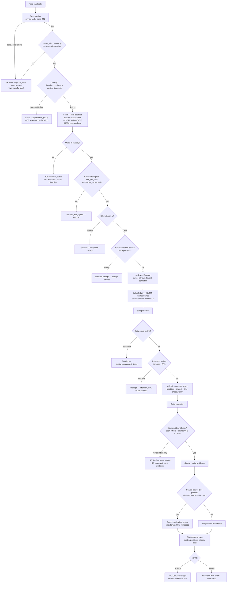

# SwanGuard news lane — completion blueprint (Fable synthesis of the 4-seat panel)

**Panel:** Kimi K3 · GLM 5.3 · Grok 4.6 · DeepSeek V4 Pro, one review each, 2026-08-22.
**Final seat:** Fable 5 — every finding below was checked against the code before it was accepted.
**Spend:** $0.23 actual (est. $0.15). Replies: `panel-swanguard-completion-2026-08-22/`.
**Repo state at review:** SwanGuard-Newsroom `merge/newsroom-mainline-v3` @ `88f1543`.

> **Read this first:** three of the panel's top findings were **verified by running code**, and one
> of those corrected the panel's own diagnosis. Findings I could not verify in-session are tagged
> `[UNVERIFIED]` and must not be treated as fact.

---

## 1. Verified findings — these change the plan

### V1 `[VERIFIED]` "Born dormant" is not a control in the news lane. It is display metadata.

All four seats flagged the contradiction: every `news_rss_sources` row is `lifecycle=dormant`, yet
`news_rss:npr_news` has `owner_enabled=true, quota_spent=2` — it ran.

**Checked:** `lifecycle` in the news lane is written only by the seed (as a preserve-existing
coalesce) and read only by `postgresNewsRssSources.ts` — the health/display read model
(`listSources`, `sourceHealth`) — plus one import-time count assertion. **`officialConnectors.ts`,
which owns `status()`, `setOwnerEnabled()` and `sync()`, never reads it.**

**So the live DB is self-consistent and nothing is currently unsafe** — the real gate is
`official_connector_states.owner_enabled`, which *is* enforced. But the B3 safety story ("seed born
dormant, then enable in batches") describes a second gate that does not exist, and an operator
reading "dormant" will believe an outlet cannot run. **Either make lifecycle a gate (a guarded
`dormant → active` transition) or stop calling it one.** Words that imply a control are a control
in the reader's head.

### V2 `[VERIFIED]` Orphan factory — and the panel named the wrong door

GLM (D4) and Grok (S1.2) both predicted that *enabling* a non-existent outlet mints a permanent
state row. **I ran it. Enable is safe; disable is the leak.**

```
ENABLE  news_rss:ghost_outlet  -> refused: connector_not_ready   states: 0
DISABLE news_rss:ghost_outlet  -> ACCEPTED                       states: 1  ← orphan minted
listOutletStatuses()          -> ['news_rss:ghost_outlet']
```

Cause: in `setOwnerEnabled`, every readiness check sits inside `if (enabled)`. The disable path
falls straight through to `store.setOwnerEnabled(...)`. Any arbitrary `news_rss:*` string therefore
creates a row that my own B0 listing (registry ∪ orphaned state keys) will display forever, with no
delete path anywhere in the system.

**Fix:** registry-membership check before *any* write, both directions → `404 unknown_outlet`; plus
an orphan reaper. The B1b UI cannot reach this (it only offers disable where `ownerEnabled` is true)
— but the API can, and the listing surfaces the result.

### V3 `[VERIFIED]` My own Law 5 is overstated — "a read must not write" is false as shipped

GLM D6, aimed squarely at the fix I landed an hour before the review. `366d6ab` moved kill-switch
seeding from *every* read to *first* read. On a fresh environment, or after a new default is added,
`listKillSwitches()` still writes. The honest statement is **"steady-state reads write nothing."**

**Fix:** move catalog seeding into a migration, then the law becomes literally true and the read
path can assert zero writes in every environment — not just the steady state I measured.

### V4 `[VERIFIED]` The activation phrase is a typo-stop, not a secret

Grok S1.9. `NEWS_RSS_ACTIVATION_PHRASE` is a client-side constant in the web bundle. It prevents an
accidental click; it is not a credential. **This is fine** — the server independently enforces the
same phrase, and the real authorisation is owner role + session. But nobody should describe the
phrase as a security boundary, and the batch path sends it once per outlet, so **if request bodies
are logged, a 146-outlet batch writes it 146 times** `[UNVERIFIED — check the logging middleware]`.

---

## 2. Unanimous finding: the console does not ship

All four seats led with it, and two of them sharpened what I had reported.

- **Kimi:** *"Nothing that cannot be reached from the production entry exists as product."* The B0
  read-cost claim survives (live-DB verified); the B1a/B1b claims do not, **as user-facing
  statements**.
- **GLM:** the structural cause is not the missing route — it is that **`testAppHarness.ts` is the
  mechanism that hides the divergence while staying green.** Tests render `App.tsx`; production
  renders `RootApp`; nothing compares them.

**Both reject "leave it parked", with the same argument:** B1b built an enablement UX, B3 plans to
enable 107 feeds, and the attestation in §3.3 is an owner action. Parking the console means the
146-outlet plan is executed by curl — the ungoverned path this product exists to prevent.

**Consensus resolution:** an `/owner/*` route inside `RootApp`, behind `AuthGate` with an owner role
check, as a lazy chunk. One app, one auth boundary. A separate owner build is explicitly rejected —
it duplicates auth and re-creates the drift that caused this. **Plus a CI assertion that the built
bundle contains governance markers, so it cannot recur silently.**

**This is still Sean's call** — it exposes a whole surface. But the panel is unanimous that "parked"
is not a coherent option alongside B3.

---

## 3. The licence gate is the highest-stakes finding (Kimi S1, GLM D2, DeepSeek 1.2, Grok S0.3)

Four seats independently: `contract_approvals` holds **2 rows, family-scoped**. After B3 seeds 107
outlets, **every one displays "contract: satisfied"** and batch-enable will clear them — against an
attestation signed before those feeds were probed, for outlets whose `termsUrl` is admittedly not
yet supplied.

Kimi: *"the gate is a vibe."* This is the one finding that is **legal exposure rather than UX**, and
it compounds — every batch enabled under a scoped-out attestation is something you cannot retro-fix.

Two proposed mechanisms; **take both**:
1. **Bind the attestation to a feed set** — `contract_approvals.feed_set_hash` (sorted URL list,
   hashed). Enabling a key outside the signed set returns `contract_not_signed`.
2. **Per-outlet licence evidence as a hard blocker** — extend the migration-0028 trigger family:
   refuse `owner_enabled = true` when `terms_url IS NULL`.

The lane-level attestation stays as sign-off; it stops being the *only* gate.

---

## 4. Corrected decomposition

The panel agreed the existing B2 → B3 → C → D ordering is wrong in four ways, and I agree:

1. **It omits the slice that unblocks everything** (ship the console).
2. **It omits the licence-scope slice**, which is blocking and legal.
3. **B2 bundles three different evidence types** with different failure modes — liveness (probe),
   identity (dedupe), licence (terms). Identity is not merely dedupe: it is the unit of
   *corroboration independence* in the endgame, so two feeds of one publisher must never read as
   two independent confirmations.
4. **Schema freeze must precede first cohort ingest.** Items ingested without provenance columns
   can never support source-side syndication detection, and once retention prunes them the evidence
   is unrecoverable. **This is the only irreversible step in the whole plan** and it is currently
   implicit.

| # | Slice | Depends on | Acceptance evidence (an artifact, not an intention) |
|---|---|---|---|
| **S0** | Process repairs: quarantine the red test; CI bundle-marker assertion; tripwire replay proof; **orphan fix (V2)**; seeding→migration (V3) | — | New red anywhere → CI red. Quarantined test going green → CI red (stale). Renaming a governance marker in source → CI red on missing marker in `dist`. Tripwire replayed against the three pre-fix commits, red each time, output committed. `DISABLE news_rss:ghost` → 404, zero rows written. |
| **S1** | Ship the console: `/owner/*` in `RootApp`, owner role check, lazy chunk | S0 | Built bundle contains the owner chunk; e2e **on the built preview**: owner enables one dormant outlet; non-owner gets 403. Bundle delta measured against a CI size budget. |
| **S2** | Licence scope: `feed_set_hash` + `terms_url IS NULL` blocker | S1 | Enabling a feed outside the signed set → `contract_not_signed`. Enabling an outlet with no terms URL → blocked by trigger, not by UI politeness. Migration backfills the hash for the existing 39. |
| **S3a** | Probe **spec** + recurring re-probe | — | `probe.toml` committed (UA, timeout, redirect depth, backoff, per-host cap); two same-day runs differ only in timing fields; a dated `probe_runs` row per feed; drift report vs 2026-08-21 with every change categorised. **Liveness is a property of the probe version** — without a pinned spec, re-probes churn on tooling, not reality. |
| **S3b** | Identity + licence registry for the 107 | S3a, S2 | Overlap computed on **registrable domain + publisher identity + content fingerprint**, never URL strings; 107 collapsed to M canonical outlets with every collision explained; `independence_group_id` assigned; `terms_url` non-null and resolving; merge script **refuses to run** if any row lacks identity or terms. |
| **S4** | Freeze: provenance schema + retention budget + **enforcement job** + lifecycle decision (V1) | S3b | Migration adds the §6 columns; budget is an owner-signed attestation row; enforcement runs in **shadow mode** over the existing 10 items, emitting would-prune counts and deleting nothing; lifecycle either becomes a guarded transition or is renamed to what it is. |
| **S5** | Seed 107 dormant + **live** batch proof | S1, S3b, S4 | Merge idempotent (run twice → no second rows, no drift). First cohort of 10 enabled live. **Mid-batch abort drill**: kill the network after 4 of 10; ledger must say 4, name the rest, and stay re-runnable. Orphan count zero after. Phrase absent from logs. |
| **S6** | Scale proof before the remaining waves | S5 | `loadgen`: 146 synthetic outlets + ~3k items on a scratch **live** Postgres; re-run B0 read-cost, batch ledger, and trigger assertions there. **Quota ceiling observed firing.** Every current perf claim was measured at 1 state row and 10 items. |
| **S7** | `news` as a third `WikiSourceModule` (was "C/W0") | S4 | Module registered; mapping preserves `outlet_id`, `guid`, `canonical_url`, `published_at`; **adding a family without a mapping is a compile error** (the B1a pattern, which worked). |
| **S8** | Claim extraction (was "D/W1") | S4, S7 | Every claim row carries `source_item_id`, verbatim span offsets, and ≥1 source-side evidence row. A claim with zero source-side evidence is **rejected loudly**, with a receipt. CI fails on any JOIN/GROUP BY referencing restated text. |
| **S9** | Clustering + syndication | S8, S3b groups | Fixture trio: (i) two outlets sharing a GUID → **syndication edge, not corroboration**; (ii) two feeds of one publisher → same independence group, not corroboration; (iii) genuinely independent conflicting reports → one cluster, two positions. Same input → hash-identical clusters. |
| **S10** | Disagreement map surface | S9, S1 | Cluster → outlets → positions with link-out to primary docs. **A system-written verdict is refused by a trigger** (test). Syndication edges visually distinct from corroboration. |

---

## 5. The lane, end to end



---

## 6. Operator surface for 146 outlets

Lives at `/owner/outlets` inside `RootApp` (S1), not the parked `App.tsx`.

```
┌─ News outlet connectors ───────────────────────────── owner: <role> ─┐
│ Contract: 39 of 146 in signed set · hash 9f3e… · 107 UNSIGNED  ⚠     │
│ Quota: 1,204 / 5,000 items today ▓▓▓░░░░░░░   Retention: 90d default │
│ Filters [state ▾] [class ▾] [stale >7d ☐] [unsigned ☐] [ghost ☐] 🔍  │
├──────┬──────────────────┬───────────┬────────────────────┬───────────┤
│  ☑   │ OUTLET           │ STATE     │ BLOCKER            │ LAST SYNC │
├──────┼──────────────────┼───────────┼────────────────────┼───────────┤
│  ☐   │ NPR News         │ ● active  │ —                  │ 2m        │
│  ☑   │ AP Top           │ ○ ready   │ owner_not_enabled  │ never     │
│  ☐   │ Reuters World    │ ◐ blocked │ contract_not_signed│ never   ⚠ │
│  ☐   │ KBOI-TV          │ ● active  │ —                  │ 9d     🔴 │
│  ☐   │ npr-new          │ ✖ unknown │ no registry row    │ —      👻 │
│      … ~30 rows/screen, virtualised, NO per-row switches …           │
├──────────────────────────────────────────────────────────────────────┤
│ Selected 2 · 1 hidden by filter · only sole-blocker rows selectable   │
│ Activation phrase [________________]   [Enable 2]   [Disable 0]      │
├──────────────────────────────────────────────────────────────────────┤
│ LAST BATCH · 2026-08-29 14:02 · 18 of 20 enabled                      │
│ FAILED  news_rss:ktv7 kill_switch · news_rss:npr-new unknown_outlet   │
│ [full receipt →]                                                      │
└──────────────────────────────────────────────────────────────────────┘
```

Four properties are non-negotiable, each traceable to a finding:

- **Staleness as an age, not a boolean** — "notice a feed going stale" needs the number visible in
  the default sort. A green dot hides a feed that stopped a week ago.
- **Ghost rows rendered as ghosts** (needs V2 fixed) — a phantom must never be batchable into a
  fake success.
- **The unsigned-set banner** (needs §3) — licence scope visible *before* enabling, not discovered
  in an audit.
- **The batch ledger persists** — it is the receipt for the phrase attestation, and the only place a
  partial batch is on the record.

---

## 7. Data model delta — corroboration from source-side evidence

The product's differentiator is detecting when two outlets are *one story*, not two witnesses. That
is only possible if the join key comes from the **sources' own pointers**, never from restated text.

```sql
CREATE TABLE claims (
  claim_id        uuid PRIMARY KEY,
  source_item_id  uuid NOT NULL REFERENCES official_connector_items,
  outlet_key      text NOT NULL,
  claim_type      text NOT NULL,        -- event | attribution | quantity | date | actor
  subject_text    text NOT NULL,        -- VERBATIM span from source, never a restatement
  subject_span    int4range NOT NULL,   -- offsets into the fetched snippet → provable, auditable
  predicate       text NOT NULL,        -- controlled vocabulary
  object_json     jsonb,                -- nulls allowed, never erased (Law 1)
  extracted_by    text NOT NULL,        -- model + version → retraction by version
  extracted_at    timestamptz NOT NULL DEFAULT now()
);

CREATE TABLE claim_evidence (            -- the corroboration surface
  claim_id       uuid NOT NULL REFERENCES claims,
  evidence_kind  text NOT NULL,          -- source_url | feed_guid | wire_agency | linked_doc_hash | byline
  evidence_value text NOT NULL,          -- the SOURCE's own identifier
  PRIMARY KEY (claim_id, evidence_kind, evidence_value),
  CONSTRAINT no_restated_keys CHECK (evidence_kind <> 'restated_text')
);

CREATE TABLE syndication_groups (
  group_id           uuid PRIMARY KEY,
  canonical_evidence text NOT NULL,      -- strongest shared source-side key
  first_seen_at      timestamptz NOT NULL
);

CREATE TABLE claim_clusters (            -- disagreement, never verdict
  cluster_id uuid PRIMARY KEY,
  topic_key  text NOT NULL,              -- deterministic, not an embedding
  created_at timestamptz NOT NULL DEFAULT now()
);

CREATE TABLE claim_positions (
  cluster_id uuid NOT NULL REFERENCES claim_clusters,
  outlet_key text NOT NULL,
  claim_id   uuid NOT NULL REFERENCES claims,
  stance     text,                       -- asserts | denies | hedges — human-overridable
  PRIMARY KEY (cluster_id, outlet_key, claim_id)
);

ALTER TABLE claims
  ADD COLUMN syndication_group_id uuid REFERENCES syndication_groups,
  ADD COLUMN cluster_id           uuid REFERENCES claim_clusters;
```

Corroboration is detected by **joining `claim_evidence` on `evidence_value`**: two outlets land in
one syndication group because the sources themselves carry the same pointer. `subject_text` is
verbatim-with-offsets, so every claim is auditable back to the fetched snippet — which is also what
keeps extraction inside the shadow-only licence posture: you store spans and links and republish
nothing. The `CHECK` makes the wrong thing **unwritable**, rather than discouraged.

---

## 8. The three risks that decide whether this finishes

1. **Licence scope creep.** One family attestation silently covering 146 feeds. The only *legal*
   rather than technical risk, and it cannot be retro-fixed once feeds are enabled under it.
   **Build step: S2, blocking, before any merge.**
2. **The scale illusion.** Every performance and correctness claim — the 45 ms listing, the batch
   ledger, quota, the dormancy triggers — was measured at **1 state row and 10 items**. B3 jumps to
   146 outlets and ~3,000 items in one move. **Build step: S6 loadgen on live Postgres, with the
   quota ceiling observed firing, before the first real wave.**
3. **Extraction quietly becoming RAG-by-hand** — restated text as a join key, which destroys
   corroboration detection and with it the product's reason to exist. The failure mode is seductive
   because restated keys cluster *better* superficially. **Build step: the `CHECK` above plus a CI
   rule that fails on any query joining restated text.**

---

## 9. Panel calibration

| Seat | Verified real | Corrected by my probe | Unique contribution | Cost |
|---|---|---|---|---|
| **Kimi K3** | high | — | `feed_set_hash` — binding an attestation to a feed set; "a gate that has never fired is indistinguishable from an absent one" | $0.021 |
| **GLM 5.3** | high | — | named the *structural* cause of the unshipped console (`testAppHarness` hides the divergence while staying green); caught my Law 5 overstatement | $0 (sub) |
| **Grok 4.6** | high | orphan door | "constant read cost" is constant **query count** — payload is still O(n); the phrase is a typo-stop, not a secret | $0.117 |
| **DeepSeek V4 Pro** | moderate | orphan door | cleanest slice table; mostly corroborated the others | $0.021 |

**Grok is rehabilitated.** Its previous run returned 317 tokens and zero findings, and I recommended
dropping it; this time it produced the largest reply of the four with several unique catches. **One
zero-finding run is not a verdict on a seat** — a lesson about my own calibration, not about Grok.

Both DeepSeek and GLM asserted that *enabling* a ghost mints an orphan row. Running it showed enable
is refused and **disable** is the leak. Their instinct was right, their mechanism wrong — which is
exactly why panel findings are hypotheses until executed.
