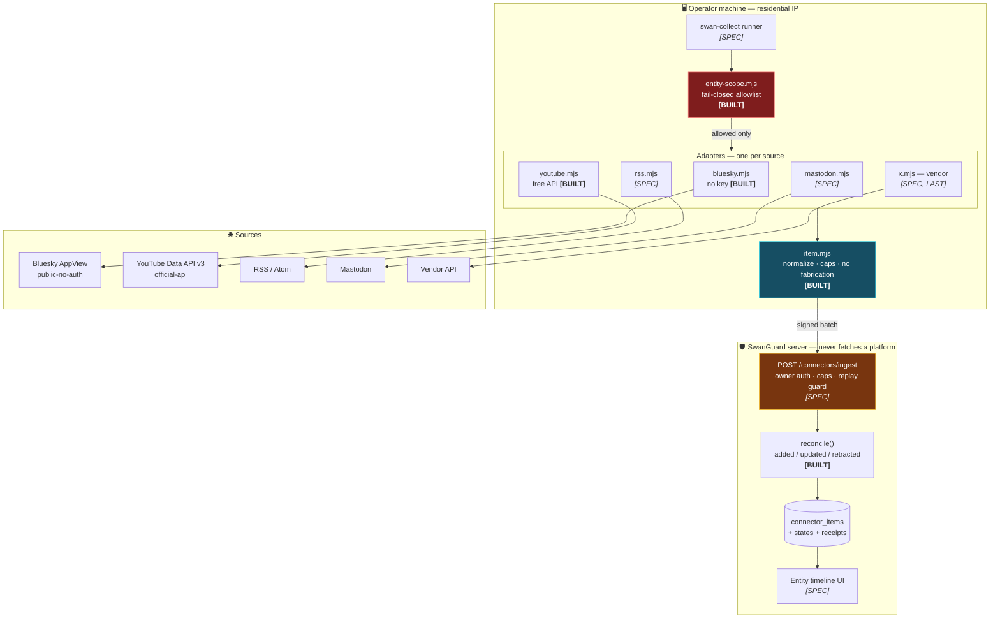
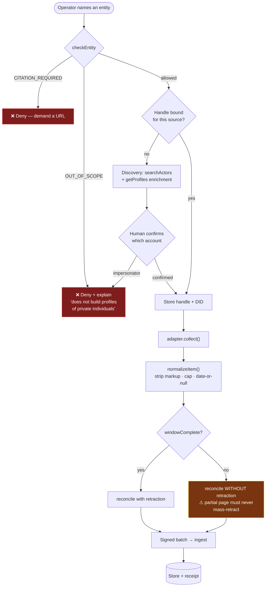
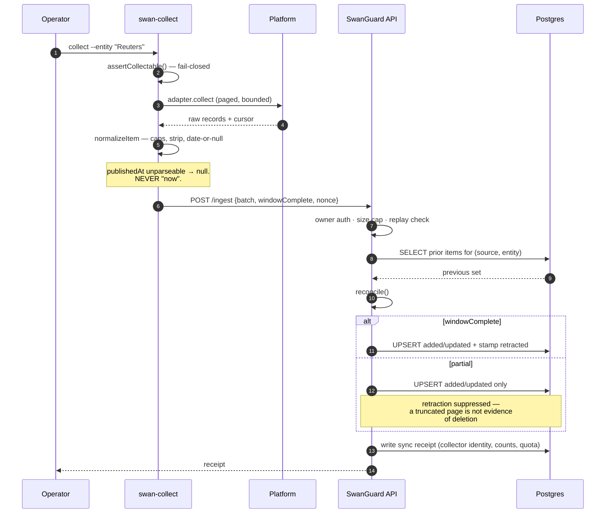
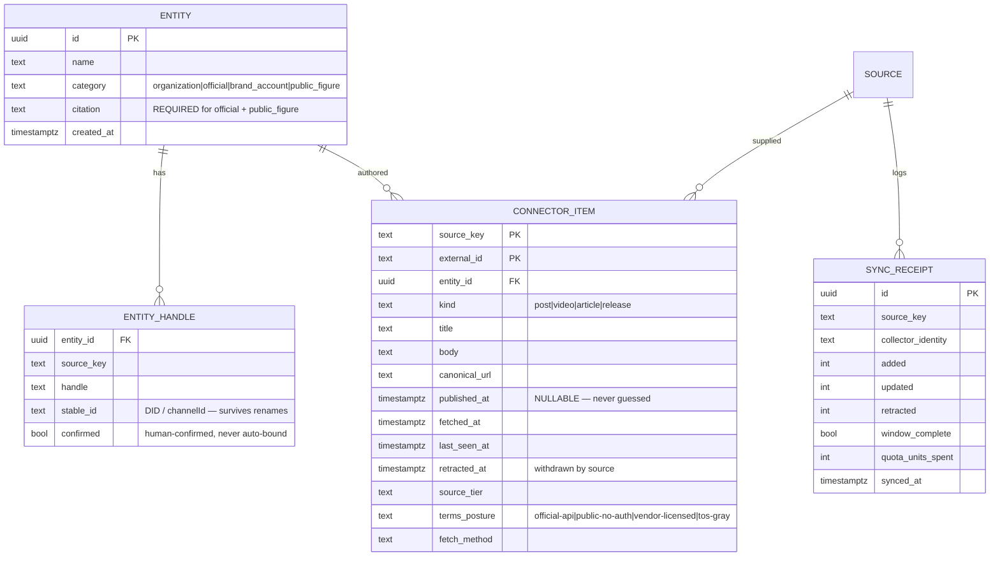

# SwanGuard Entity Intel — Blueprint

Companion to [`SWANGUARD-ENTITY-INTEL-CONNECTORS-SPEC-2026-08-11.md`](./SWANGUARD-ENTITY-INTEL-CONNECTORS-SPEC-2026-08-11.md)
(the *why*). This is the *how*: architecture, data flow, schema, wireframes, and
the build order.

**Built and passing as of 2026-08-11:** the portable core (`item`, `entity-scope`)
plus the Bluesky and YouTube adapters. 30/30 tests. Bluesky proven live against
the real network. Everything below marked **[BUILT]** exists; **[SPEC]** does not.

---

## 1. The portability contract — why this is a folder, not a feature

Sean's requirement: *"have all these components be something we can use in other
apps too."* That is enforced structurally, not by intent:

| Rule | Consequence |
|---|---|
| **Zero npm dependencies** | Nothing to install. Node built-ins only |
| **Zero repo coupling** | No import escapes `swan-collect/`. No SwanGuard/SS-PT types |
| **All I/O injected** | `fetch` and the clock are parameters. Runs in Node/Deno/Bun/browser, and tests need no network |
| **Pure core** | `item.mjs` imports *nothing at all* |
| **Adapters are data-shaped** | Each exports one frozen `adapter` descriptor. A registry can enumerate without importing internals |

**To reuse: copy `scripts/swan-collect/` into any project.** It works unchanged.
The scope gate is what makes it a *newsroom* tool; drop that and it is a generic
entity collector.

---

## 2. Architecture



**The load-bearing decision:** the server never makes an outbound call to a social
platform. That is what keeps SwanGuard off datacenter-IP blocklists *and* leaves
the SSRF surface hardened in packet 3 completely untouched.

---

## 3. Collection flow



## 4. Sync sequence



## 5. Data model



`published_at` being **nullable** is the schema encoding the no-fabrication rule.
A `NOT NULL` column would force a guess at insert time — the constraint itself
would manufacture false evidence.

---

## 6. Wireframes

**Desktop — entity timeline**

```
┌──────────────────────────────────────────────────────────────────────────┐
│  SwanGuard ▸ Entities                                    [＋ Add entity] │
├───────────────┬──────────────────────────────────────────────────────────┤
│ ENTITIES      │  Reuters                          🏢 organization        │
│               │  ──────────────────────────────────────────────────────  │
│ 🏢 Reuters  ● │  Sources   ✔ Bluesky @reuters.com   ✔ YouTube @Reuters   │
│ 🏢 AP       ● │            ＋ add source                                  │
│ 🏛 City Hall ⚠│  Last sync 4 min ago · next in 26 min      [Sync now]     │
│ 🏷 Acme Corp● │  ──────────────────────────────────────────────────────  │
│               │  [ All ] [ Posts ] [ Video ] [ Withdrawn 1 ]             │
│ ── filters ── │                                                          │
│ ☑ organization│  ┌────────────────────────────────────────────────────┐  │
│ ☑ official    │  │ 🦋 Bluesky · 2 min ago         public-no-auth  ⓘ  │  │
│ ☑ brand       │  │ Oil, gold prices rise as geopolitical tensions     │  │
│ ☐ public fig. │  │ mount before CPI data                              │  │
│               │  │ ♥ 42  ⇄ 18  💬 7            ↗ open on bsky.app     │  │
│ ── posture ── │  └────────────────────────────────────────────────────┘  │
│ ● official    │  ┌────────────────────────────────────────────────────┐  │
│ ● no-auth     │  │ ▶ YouTube · 3 h ago              official-api  ⓘ  │  │
│ ○ vendor      │  │ Nvidia's plan for the China market — explained     │  │
│ ○ gray        │  │ 12:04 · published 2026-08-11        ↗ youtube.com  │  │
│               │  └────────────────────────────────────────────────────┘  │
│               │  ┌────────────────────────────────────────────────────┐  │
│               │  │ ⊘ WITHDRAWN BY SOURCE · last seen 2026-08-10       │  │
│               │  │ (retained for accountability — not shown as live)  │  │
│               │  └────────────────────────────────────────────────────┘  │
└───────────────┴──────────────────────────────────────────────────────────┘
```

Every card carries its **posture badge**. A reader can always see whether an item
came from an official API or a gray path — the credibility claim is on the card,
not buried in a settings page.

**Add-entity — the scope gate made visible**

```
┌────────────────────────────────────────────┐
│  Add entity                          ✕     │
├────────────────────────────────────────────┤
│  Name                                      │
│  ┌──────────────────────────────────────┐  │
│  │ Reuters                              │  │
│  └──────────────────────────────────────┘  │
│                                            │
│  Category                                  │
│  ( ● ) 🏢 Organization                     │
│  ( ○ ) 🏛 Public official     ← needs cite │
│  ( ○ ) 🏷 Brand account                    │
│  ( ○ ) 👤 Public figure       ← needs cite │
│                                            │
│  ┌────────────────────────────────────────┐│
│  │ ⓘ SwanGuard does not build profiles of ││
│  │   private individuals. Officials and   ││
│  │   public figures need a source showing ││
│  │   why they are public.                 ││
│  └────────────────────────────────────────┘│
│                        [Cancel] [ Continue]│
└────────────────────────────────────────────┘
```

**Handle confirmation — the impersonation defence, driven by real data**

```
┌──────────────────────────────────────────────────────┐
│  Which Bluesky account is Reuters?                    │
├──────────────────────────────────────────────────────┤
│ ( ● ) reuters.com                    346,118 followers│
│       Reuters                              98,879 posts│
│ ─────────────────────────────────────────────────────│
│ ( ○ ) reutersinstitute.bsky.social    31,389 followers│
│       Reuters Institute · "future of journalism"      │
│ ─────────────────────────────────────────────────────│
│ ( ○ ) reuters-world-rss.bsky.social   19,216 followers│
│       ⚠ "This bot completed its mission."             │
│ ─────────────────────────────────────────────────────│
│  Never auto-bound — a wrong bind attributes someone   │
│  else's words to this entity.                         │
│                              [Cancel] [Confirm]       │
└──────────────────────────────────────────────────────┘
```

*(Those three accounts and their counts are **real**, returned live on 2026-08-11.
The third is exactly the failure this screen prevents.)*

**Mobile (375px)**

```
┌─────────────────────┐
│ ☰  Reuters      ⟳   │
├─────────────────────┤
│ 🏢 organization      │
│ ✔ Bluesky ✔ YouTube │
│ synced 4 min ago    │
├─────────────────────┤
│ [All][Post][Vid][⊘] │
├─────────────────────┤
│ ┌─────────────────┐ │
│ │🦋 2 min · no-auth│ │
│ │Oil, gold prices │ │
│ │rise as tensions │ │
│ │mount before CPI │ │
│ │♥42 ⇄18      ↗   │ │
│ └─────────────────┘ │
│ ┌─────────────────┐ │
│ │▶ 3 h · official │ │
│ │Nvidia's China   │ │
│ │plan — explained │ │
│ │12:04        ↗   │ │
│ └─────────────────┘ │
└─────────────────────┘
  44px targets · single
  column · badge stays
```

---

## 7. Build order

| # | Slice | State |
|---|---|---|
| 1 | Portable core — `item`, `reconcile`, `entity-scope`, `http` | **✅ BUILT** |
| 2 | Bluesky adapter (no key) | **✅ BUILT + live-proven** |
| 3 | YouTube adapter (free API, quota-frugal) | **✅ BUILT — unit-tested only, no key in session** |
| 4 | Runner + registry + store | **✅ BUILT + live-proven** |
| 5 | RSS/Atom adapter | **✅ BUILT + live-proven (NPR, Reddit, YouTube feeds)** |
| 6 | Mastodon adapter | **✅ BUILT + live-proven** |
| 7 | Vendor adapter — X / IG / TikTok / FB / LinkedIn / Threads | **✅ BUILT, ships DISABLED, no provider account to prove it** |
| 8 | Ingest endpoint (auth, caps, replay guard, receipts) | ⬜ **next** — SwanGuard repo, widest attack surface |
| 9 | Entity + handle tables, confirmation UI | ⬜ |
| 10 | Timeline UI incl. withdrawn state | ⬜ |

### Source reality, MEASURED 2026-08-11/12 (residential IP, no credentials)

| Platform | Keyless? | Evidence |
|---|---|---|
| Bluesky | ✅ | search / resolve / paged feed / getProfiles all 200, no auth |
| Mastodon | ✅ | accounts/lookup + statuses 200, no auth |
| RSS/Atom | ✅ | NPR 200 · **Reddit `/r/news/.rss` 200 while its JSON API is 403 even with a browser UA** · YouTube channel feed 200 for some ids, 404 for others |
| YouTube API | ✅ free | 10,000 units/day; `channels`/`playlistItems` = 1 unit each |
| Instagram | ❌ | `?__a=1` → 400 |
| X | ❌ | `cdn.syndication.twimg.com` → 200 with **ZERO bytes** |
| TikTok | ❌ | 200, but 364 KB of SPA shell HTML |
| Facebook | ❌ | 200, but 480 KB of login-walled HTML |

The bottom four are why the vendor adapter exists as ONE component rather than four scrapers.

### Known limitations (stated plainly)

- **RSS never retracts.** A feed is a truncated window, so `windowComplete` is always false and
  items only ever accumulate. If a publisher deletes an article, RSS will not tell us.
- **YouTube and vendor adapters are unit-tested only** — no API key and no vendor account exist
  in this session. Their live behaviour is unproven.
- **Portability is precise:** `core/` and `adapters/` are universal (fetch injected, zero deps).
  `run.mjs` imports `node:url` and is Node-only by nature (it is a CLI); `core/store.mjs` lazily
  imports `node:fs/promises` only when no filesystem is injected.
- **DNS rebinding is unaddressed** in the Mastodon host guard — a hostname that passes validation
  but resolves internally. Low consequence operator-side; would need attention server-side.

## 8. What a hostile reviewer should attack first

Ranked by blast radius:

1. **`/connectors/ingest`** — widest new surface. It accepts attacker-shaped data
   if the operator credential leaks. Batch size caps, replay/nonce handling,
   per-collector attribution, and whether `windowComplete` can be forged to
   trigger mass-retraction (a denial-of-truth attack).
2. **`reconcile` retraction logic** — can a partial page, a duplicate cursor, or a
   source returning `[]` on error cause mass false retraction?
3. **`normalizeItem`** — can markup survive strip→clip? Can a crafted URL pass
   `safeHttpUrl` and still be dangerous downstream? ReDoS on multi-MB text?
4. **`entity-scope`** — any path to a private individual: prototype pollution
   (guarded via `hasOwnProperty` — verify), category confusion, handle injection
   through `sanitizeHandles`.
5. **Adapters** — can a hostile feed body cause unbounded memory? Does the
   YouTube key leak into any log/error? Can a repost be attributed to the wrong
   entity?
6. **Quota** — can a resolve-loop silently burn 10,000 YouTube units?
