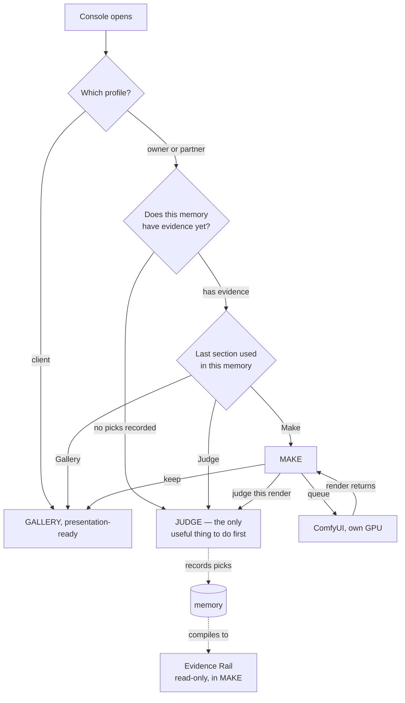
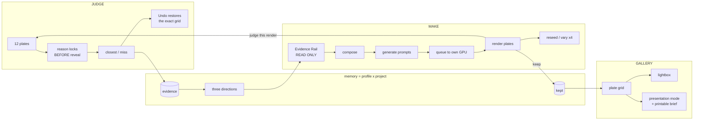
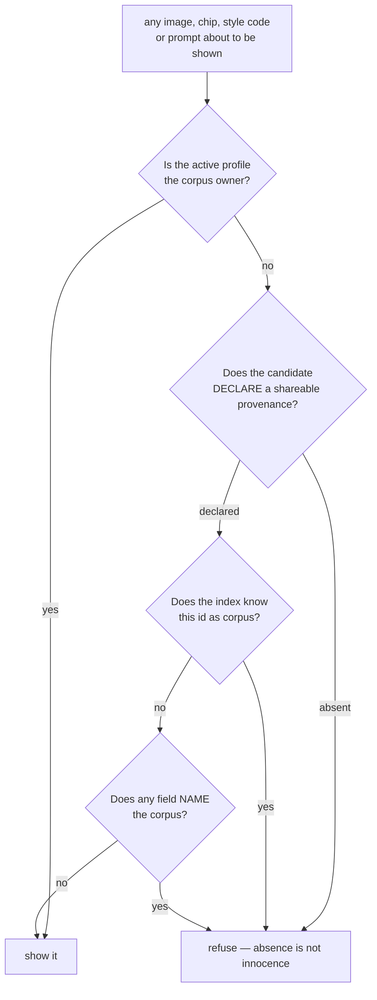

# The Swan Taste Console — blueprint

Two seats answered the same packet independently: **Ox Alpha** and **GLM 5.3**. Their raw
returns are in `panel-taste-console-2026-08-26/`. This file is the arbitrated result.

They agreed on more than they disagreed on, which is itself worth recording: **three
sections, not four**; Gallery replaces Kept; refuse model-routing, pluggable design
systems, and publishing; adopt the full-screen lightbox; narrow "portfolio" to one memory.
Where they split, the split was real and is ruled on in §3.

**Headline: 1 ADOPT-as-asked, 5 ADAPT, 4 REFUSE.** More is cut than added. That ratio is
deliberate — the failure mode this tool actually has is surfaces added faster than they can
be maintained, not a shortage of features.

---

## 1. What Sean asked for, restated

> "Make it more of a console so that everything has its own section. When I pull these
> pictures up, it should be really simple to use and easy. And professional. \[Like\]
> Midjourney or any other professional apps that are out. \[People\] should be able to
> easily... they would clearly see my stuff."

Two requirements hide in there and they pull in opposite directions:

1. **A console** — every function has its own place, nothing buried.
2. **Simple, and it makes the pictures look professional** — because he opens this in front
   of paying clients.

A console with a section per function becomes an aircraft cockpit, which is the opposite of
(2). The resolution both seats converged on independently: **three sections, and the chrome
gets quieter, not busier.** Ox stated the governing principle best, and it is adopted as law:

> Midjourney reads as professional because its interface is nearly monochrome and the
> images scream. Obsidian and Carbon backgrounds everywhere, Frost White text, and the only
> saturated things on screen are the spine, the gold indicator, and the photographs.

---

## 2. Section map

Three sections. Everything else is header context, not a section.

| Section | Owns | Change from today |
|---|---|---|
| **JUDGE** | The judging loop exactly as it runs: the 12-grid, reason-before-reveal, never-show-twice, Undo. `probe.css` untouched. | **Kept as-is, and deliberately given no new chrome.** It is a mode of attention, not a workspace. |
| **MAKE** | Prompt composition, stills/video, steering, seed count, the ComfyUI queue, render results, `reseed` / `vary x4`, "send to Judge". Hosts the **Evidence Rail**. | **Absorbs Directions** as a read-only rail. |
| **GALLERY** | The decided body of work for the current memory: plate-grade grid, lightbox, filter row, and **Presentation mode** — the client-facing view, which also carries the printable brief. | **Kept, renamed and upgraded.** Same data, presented like a gallery instead of a card list. |

**Header (persistent, one row):** wordmark · memory chip `[owner · atlas-fall ▾]` (popover:
recent memories, then profile → project, then New project) · **queue pill**
(`comfy ● busy 1 · 3 queued` / `offline — prompts still writable`) · presentation toggle.

**Deleted as sections, named here so they stay dead:** Settings, Library/Search, Insights,
System/design-systems, Publish, and any Home/Dashboard. Each is refused on the record in §4.

### The one thing both seats got wrong in opposite directions

They split on where the Directions read-out docks.

- **GLM** put it in **Judge** as a right rail: "directions are the read-out of judging;
  co-presenting closes the loop."
- **Ox** put it in **Make** as an Evidence Rail: "a Direction is never a destination — it is
  an input to Make."

**Ruling: Ox is right, and GLM's own answer contains the refutation.** GLM's failure mode #2
admits that at 1024–1200px the Directions panel, the grid and the reason bar compete for the
fold — and it proposes collapsing the panel to a chip at those widths, which quietly gives
up the benefit it was arguing for. But the stronger objection is epistemic, and neither seat
raised it: **this tool's whole claim is that a judgment is recorded before it can be
rationalised.** Putting compiled style codes and named directions on screen *while he
judges* is priming the very judgment the reason-lock exists to keep clean. Judge stays a
clean room.

**But GLM was defending something real that Ox dropped.** Today's Directions tab is also the
*client-facing artefact* — it has Copy-as-text and Print/PDF, and it shows "what you chose".
Ox's map loses that entirely. So the read-out splits by audience, which is better than either
proposal:

- **Working view → the Evidence Rail in Make.** Read-only chips. No editable control, ever.
- **Client view → Gallery, Presentation mode.** The three directions, the picks, and the
  Print/PDF path live where the client is already looking.

---

## 3. Navigation, and where each profile lands

GLM's per-profile landing is adopted — it is the single change that most directly answers
"when I pull these pictures up... they would clearly see my stuff". Nobody probes taste in
front of a client. Sharpened past what GLM proposed:



A memory with nothing in it cannot generate anything worth having, so landing it in Make
would be landing on a dead end. A memory with evidence resumes where he left off. The client
never sees either question.

**Section switching:** rail on desktop (72px, left), bottom bar at ≤640px. Keys `1` `2` `3`.
Bottom bar, never a hamburger — three verbs behind one tap plus a hunt is worse than three
44px targets.

---

## 4. The ten "design OS" ideas — verdicts on the record

| # | Idea | Verdict | What it becomes here, or what it breaks |
|---|---|---|---|
| **A** | Model-agnostic routing | **REFUSE** | There is one render path: his own ComfyUI graph. A routing abstraction over one engine is a surface with no function. Both seats refused independently. If a second local engine ever exists, it is one field in the memory-chip popover, not a UI. |
| **B** | Use the subscription you already have | **ADOPT** | Already the architecture, and the job is to *protect* it. Concretely: a **Copy for Midjourney** button that copies the full prompt with seeds formatted for paste. **Refuse "connect your account" forever** — that is the door every paid tool walks in through. |
| **C** | Semantic local disk scan | **ADAPT** | Real semantic search needs an embedding model — a new dependency (constraint 7) and a permanent maintenance surface. Both seats landed on the same cheap substitute: **every judged picture already carries subject chips and style codes.** Gallery gets a filter row over those plus filename, prompt text and seed — plain `includes()`, instant, zero dependencies, scoped to the current memory. |
| **D** | Insights / spend dashboard | **ADAPT** | There are no providers and no credits; marginal cost is electricity. The useful residue is **engine state**, and today he has none: the header **queue pill** shows `busy / queued / last render / offline`. One pill, not a section. |
| **E** | Studio + pluggable design systems | **REFUSE** | A pluggable design system is taste made portable. Here taste is evidence-derived and evidence is memory-locked. This is the exact motion the six-layer corpus review kept refusing. Also redundant: **Directions already are this tool's design system**, correctly scoped per memory. |
| **F** | Portfolio view | **ADAPT** | A portfolio **within one memory** is legitimate and is what Gallery becomes. The cross-everything rollup is refused: it would co-present the partner's business work and client role-play output alongside corpus-derived renders. To show the partner's work, switch the memory. Two taps, zero law violations. |
| **G** | Full-screen preview + open in new tab | **ADOPT** | Native `<dialog>` with `::backdrop`. Obsidian ground, `object-fit: contain`, ←/→ within the set, Esc and backdrop close, focus returns to the invoking plate. Fira Code footer: memory · direction · seed · date. Open-in-new-tab is a plain same-origin link — no CORS, no server change. |
| **H** | Live edit / regenerate one element | **ADAPT** | Ox refused it as inpainting (out of scope, §7 of the packet) and was right about *that* reading. GLM's reading is the one to build: it is not inpainting, it is **`reseed` (same prompt, new seed) and `vary x4`** on every render plate — one tap onto a path that already exists. 80% of the value, zero pipeline change. |
| **I** | Publish / distribute | **REFUSE** | Violates local-only in the most literal way available. Not an adaptation candidate; a different product. The client-facing need is met by Gallery presentation mode, and the OS file manager is one click away. |
| **J** | Nightly "dreaming" pass | **REFUSE — for now, with the shape recorded** | Ox: an autonomous writer contradicts the tool's epistemics — reason-before-reveal exists precisely to stop unwitnessed rationalisation, and a nightly pass is unwitnessed rationalisation at scale. GLM's containment is genuinely clever (read-only proposals to a *separate pending store*, a `+ dreamed 3` tray, and the accept tap **is** the witness) and it is the **only shape this may ever take** if revived. It is refused today because it is the largest new machinery in the list for the least proven value. |

---

## 5. The signature visual move — the Spine and the Stage

Both seats proposed a signature. They are compatible, and merging them makes one element do
two jobs instead of two elements doing one each.

- **GLM's spine:** a 3px line at the top of the viewport whose colour encodes the active
  profile. It does *safety* work — generating into the wrong memory becomes something you
  can see.
- **Ox's lit sill:** a gradient line under the header with a Gilded Fern marker that slides
  to the active section.

**Merged: one line. Its colour is the profile. The gold marker riding it is the section.**

```css
:root{
  --obsidian:#0A0A0F; --carbon:#141419; --graphite:#1A1A24;
  --sapphire:#002060; --royal:#003080; --ice:#60C0F0;
  --gold:#C6A84B; --frost:#E0ECF4; --violet:#8B5CF6;
  --glow-on-blue:var(--violet);   /* blue surface  -> purple glow */
  --glow-on-purple:var(--ice);    /* purple surface -> cyan glow  */
}
[data-profile="owner"]   { --profile-accent:var(--gold);   --profile-glow:rgba(198,168,75,.55); }
[data-profile="partner"] { --profile-accent:var(--ice);    --profile-glow:rgba(96,192,240,.55); }
[data-profile="client"]  { --profile-accent:var(--violet); --profile-glow:rgba(139,92,246,.55); }

/* The spine. Identity is never colour-only — the memory chip repeats it in words. */
.spine{ position:fixed; inset:0 0 auto 0; height:3px; z-index:60;
        background:var(--profile-accent); box-shadow:0 0 12px var(--profile-glow); }
.spine__section{ position:absolute; top:0; height:3px; width:72px;
                 background:var(--frost); box-shadow:0 0 8px rgba(224,236,244,.5);
                 transition:transform 200ms ease; }

/* The stage. ONE class for every image in every section. */
.plate{ position:relative; padding:8px; border-radius:10px;
  background:
    radial-gradient(120% 70% at 50% -12%, rgba(96,192,240,.07), transparent 55%),
    linear-gradient(180deg, var(--carbon), var(--obsidian));
  box-shadow: inset 0 1px 0 rgba(224,236,244,.06), 0 14px 34px -16px rgba(0,0,0,.85); }
.plate img{ display:block; width:100%; border-radius:6px; object-fit:cover; }
.plate::after{ content:""; position:absolute; inset:0; border-radius:10px;
  pointer-events:none; border:1px solid rgba(96,192,240,0);
  transition:border-color 160ms linear; }
.plate:hover::after{ border-color:rgba(96,192,240,.35); }
.plate[aria-pressed="true"]::after{ border-color:var(--ice);
  box-shadow:0 0 0 1px var(--ice), 0 0 18px rgba(96,192,240,.35); }
.plate figcaption{ margin-top:6px; letter-spacing:.04em;
  font:500 11px/1.5 "Fira Code",monospace; color:#8FA3B0; }

:focus-visible{ outline:2px solid var(--ice); outline-offset:2px; }
@media (prefers-reduced-motion: reduce){
  .spine__section, .plate::after { transition:none; }
}
```

Note the section marker is **Frost White**, not gold as Ox proposed: on an owner memory the
spine is already gold, and a gold marker on a gold spine is invisible. Frost reads on all
three profile colours.

### Palette law — Wing Purple is never text

Both seats flagged Wing Purple as borderline and gave slightly different numbers, so I
computed the table myself rather than take either at face value:

| on → | Obsidian | Carbon | Graphite | Sapphire | Royal |
|---|---|---|---|---|---|
| Frost `#E0ECF4` | 16.43 | 15.28 | 14.36 | 12.70 | 10.07 |
| Ice `#60C0F0` | 9.68 | 9.00 | 8.46 | 7.48 | 5.94 |
| Gold `#C6A84B` | 8.56 | 7.96 | 7.48 | 6.62 | 5.25 |
| **Wing Purple `#8B5CF6`** | **4.66** | **4.34 ✗** | **4.07 ✗** | **3.61 ✗** | **2.86 ✗** |
| Muted `#8FA3B0` | 7.56 | 7.02 | 6.60 | 5.84 | 4.63 |

It is worse than either seat reported: Wing Purple **fails 4.5:1 on every surface except
Obsidian**, where it scrapes through at 4.66. **Law: Wing Purple is a glow, border and spine
colour only. It is never text, anywhere.** Test T3 enforces this permanently.

---

## 6. Wireframes

### Desktop, ≥1100px — MAKE (the working screen)

```
 ▔▔▔ spine · 3px · gold=owner / ice=partner / violet=client ▔▔▔▔▔▔▔▔▔▔▔▔▔▔▔▔▔▔▔▔
┌──────────────────────────────────────────────────────────────────────────────┐
│ ◆ SWAN TASTE   [ ● owner · atlas-fall ▾ ]        comfy ● busy 1 · 3 queued   │ 56
├──────┬───────────────────────────────────────────────────┬───────────────────┤
│  ▦   │  EVIDENCE  (read-only)      │  COMPOSE            │  QUEUE            │
│ Judge│  ─ 01 Warm analog  ·tierA   │ ┌─────────────────┐ │  ▶ RENDER   44px  │
│      │    [dusk][35mm][grain]      │ │ prompt          │ │  ○ job 1 · 0:42   │
│  ✎   │  ─ 02 Clean studio ·tierA   │ │ (Fira Code)     │ │  ○ job 2 · queued │
│ Make │    [packshot][hard light]   │ └─────────────────┘ │  ✓ done → plate   │
│  ●   │  ─ 03 Gilded hour  ·prior   │  Kind [Stills ▾]    │                   │
│      │    [low sun][long lens]     │  Steering [Taste ▾] │  ┌─────┐ ┌─────┐  │
│  ▤   │                             │  How many [ 5 ]     │  │plate│ │plate│  │
│Galry │  no editable control lives  │  Shape [16:9 ▾]     │  │ ↻ ×4│ │ ↻ ×4│  │
│      │  in this rail — ever        │  [ Generate ]       │  └─────┘ └─────┘  │
│      │                             │  [ Copy for MJ ]    │                   │
├──────┴─────────────────────────────┴─────────────────────┴───────────────────┤
│ rail 72px · 56px targets · keys 1/2/3 · only the photographs carry colour     │
└──────────────────────────────────────────────────────────────────────────────┘
```

Above the fold at 1024×768: spine, header, rail, the whole Evidence Rail, the compose
column, and RENDER. The queue list and the render plates scroll internally; the frame does not.

### Desktop — JUDGE (untouched, no new chrome)

```
 ▔▔▔ spine ▔▔▔▔▔▔▔▔▔▔▔▔▔▔▔▔▔▔▔▔▔▔▔▔▔▔▔▔▔▔▔▔▔▔▔▔▔▔▔▔▔▔▔▔▔▔▔▔▔▔▔▔▔▔▔▔▔▔▔▔▔▔▔▔
┌──────────────────────────────────────────────────────────────────────────────┐
│ ◆ SWAN TASTE   [ ● owner · atlas-fall ▾ ]        comfy ● idle                │
├──────┬───────────────────────────────────────────────────────────────────────┤
│  ▦ ● │ JUDGE · grid 14 · 7 of 12 seen                        [ ↶ Undo ]      │
│      │ ┌───────┐ ┌───────┐ ┌───────┐ ┌───────┐                               │
│  ✎   │ │ plate │ │ plate │ │ plate │ │ plate │   NO directions panel here.   │
│      │ └───────┘ └───────┘ └───────┘ └───────┘   Naming a style while he     │
│  ▤   │ ┌───────┐ ┌───────┐ ┌───────┐ ┌───────┐   judges primes the judgment  │
│      │ └───────┘ └───────┘ └───────┘ └───────┘   the reason-lock exists to   │
│      │ ── reason locks BEFORE reveal (probe.css, unchanged) ── keep clean.    │
│      │ [ closest ✓ ]  [ miss ✗ ]   reason ▸                                  │
└──────┴───────────────────────────────────────────────────────────────────────┘
```

### 640px

```
 ▔▔ spine ▔▔▔▔▔▔▔▔▔▔▔▔▔▔▔▔▔▔▔▔▔▔▔▔▔▔▔▔▔▔▔▔▔▔
┌──────────────────────────────────────────────┐
│ ◆  [ ● owner · atlas-fall ▾ ]   ● busy 1 · 3 │
├──────────────────────────────────────────────┤
│ EVIDENCE                                      │
│ [dusk][35mm][grain][packshot][low sun]  →     │  one row, horizontal scroll
├──────────────────────────────────────────────┤
│ ┌──────────────────────────────────────────┐ │
│ │ prompt                                   │ │
│ └──────────────────────────────────────────┘ │
│ Kind [Stills ▾]   How many [ 5 ]             │
│ [           Generate            ]  44px       │
│ [        RENDER on my GPU       ]  44px       │
├──────────────────────────────────────────────┤
│    ▦ Judge   │   ✎ Make ●  │   ▤ Gallery      │ 56px, labelled, never a burger
└──────────────────────────────────────────────┘
```

Gallery at 640px is a two-column plate grid above the bar; tapping a plate opens the
lightbox full-bleed.

---

## 7. The loop, and the law that constrains it





The second diagram is not new work — it is the law already enforced in `events.mjs` and
`profile.mjs`, drawn so the console design can be checked against it. **Every new surface in
this blueprint must pass it: the memory popover, presentation mode, the Gallery filter, and
the lightbox.** That is where tests T4 and T11 come from.

---

## 8. Click cost

Both seats produced tables; where they differ I took the more conservative count.

| Task | Today | Console | Δ |
|---|---|---|---|
| Taste a grid (returning) | 2–5 (who, memory, Taste pictures, …) | 0–1 — profile/memory persist; a memory with no evidence lands in Judge with a grid ready | **−2 to −4** |
| Generate prompts | 3 — Make tab, scan/open Directions, generate | 1–2 — Make, tap a direction chip in the rail, Generate | **−1 to −2** |
| Render one | 1–3 | 1 — RENDER sits beside compose; `reseed` from any plate is 1 | **0 to −2** |
| Show a client his work | 3 — who, project, Kept tab, then flat cards | 2 — chip, pick the client memory → lands in Gallery; `P` for presentation | **−1, and the quality is the point** |

**Where it costs more, and why that is accepted:** creating a new project gains one tap
(chip → New → form instead of a bare button). GLM's defence is correct and worth keeping —
that extra step is a memory-identity checkpoint, a moment where the spine and chip are on
screen before a new memory exists. The isolation law wearing UI.

---

## 9. How this design fails

Ox and GLM each named three. These four survived cross-examination.

1. **The Evidence Rail stops being read-only.** The moment inline direction-editing feels
   convenient, someone adds it — Make absorbs what Directions used to do, blows the file cap,
   and regresses a surface that currently works. The rail ships with **zero** editable
   controls and **T9 exists to fail the day an `<input>` appears inside it.** Deliberately
   brittle; the brittleness is the feature.
2. **Gallery gets heavy exactly when it matters most.** Plate-grade presentation over a few
   hundred kept images without `loading="lazy"` and explicit `width`/`height` on every
   `` means slow first paint and layout shift — discovered in front of a paying client,
   the worst possible venue. **Both attributes are mandatory, enforced by T14.**
3. **Stale context through the persisted header.** Persisting profile+memory is the biggest
   click win and the biggest risk: if switching profile fails to hard-reset the memory
   select, one profile's work renders under another's memory. **The reset must be structural
   — changing profile clears memory to empty and forces a re-select — not a best-effort
   handler.** T7.
4. **Icon-rail discoverability.** The 72px rail is icon-only; the partner, an infrequent
   user, will not know ▦ from ✎, and tooltips do not teach. Mitigation: labelled rail for the
   first sessions (localStorage), fading to icons. GLM called this an unpaid cost and it is —
   accepted knowingly, revisit if she reports it.

---

## 10. Test list

| ID | Assertion | Level | Fails when |
|---|---|---|---|
| T1 | `serve.mjs` rejects a foreign `Host`; no response ever carries `access-control-allow-origin` | node | the gate is removed |
| T2 | every file under `prompter/` ≤ 320 lines | node | a section grows instead of splitting |
| T3 | every text/background token pair in use computes ≥ 4.5:1; **Wing Purple never appears as a text colour** | node | someone makes the purple a label |
| T4 | in partner/client memories: zero network hits on corpus paths, zero corpus `img.src` in the DOM, no corpus badge | browser | the profile gate regresses |
| T5 | after switching memory A→B, no `img` from A remains in the DOM | browser | stale-node leak |
| T6 | the reveal class applies only after the reason-lock event; a second pick is impossible before reveal | browser | probe flow is touched |
| T7 | changing profile clears the memory select and renders no content until a memory is chosen | browser | failure #3 |
| T8 | Undo restores the identical src set; no image repeats within a memory; the ledger resets across memories | browser + node | seen-ledger scoping breaks |
| T9 | static parse: **zero** `<input>`/`<select>`/`<textarea>` inside the Evidence Rail container | node | failure #1 |
| T10 | every focusable/clickable control ≥ 44px in both layouts | browser | cramped chrome ships |
| T11 | client-mode presentation contains only kept-render srcs; the popover lists no other profile's projects in client mode | browser | failure class of the six-layer review |
| T12 | with `prefers-reduced-motion: reduce`, computed transition/animation durations resolve to 0s | browser | motion is ungated |
| T13 | ComfyUI unreachable → pill reads `offline`, prompt writing still succeeds, the queue retries with backoff | node (mock fetch) | offline bricks Make |
| T14 | every `` in Gallery carries `loading="lazy"` and explicit `width`/`height` | node (parse) + browser (no CLS) | failure #2 |
| T15 | dependency guard: only `node:` builtins imported; `package.json` has no runtime dependencies | node | a library sneaks in |
| T16 | directions built from memory A contain no style code or chip from fixture memory B | node | E/F seep in at the data layer |

Browser-level: T4, T5, T6, T7, T8 (DOM half), T10, T11, T12, T14 (CLS half).
Pure node: T1, T2, T3, T8 (ledger half), T9, T13, T14 (parse half), T15, T16.

Every one of these must be written so that **removing the guard makes the test fail** — the
rounds-3-to-7 review shipped three guards that could not fire.

---

## 11. Build order

Independently shippable. Each slice ends green before the next starts.

| # | Slice | Why here | Tests |
|---|---|---|---|
| **1** | **Tokens + the Spine + the `.plate` stage.** One CSS file. Apply `.plate` to the existing judge grid and kept cards without changing markup structure. | Highest visible change per line. Proves the palette law before anything depends on it. | T3, T12 |
| **2** | **Three sections + rail/bottom-bar + per-profile landing + structural profile reset.** Directions demoted to the Evidence Rail (read-only) in Make. | The IA change. Everything after assumes it. | T2, T7, T9, T10 |
| **3** | **Gallery.** Plate grid, lightbox (`<dialog>`), filter row over chips/codes/seed/filename, lazy + dimensions. | The client-facing payoff — the actual ask. | T5, T11, T14 |
| **4** | **Queue pill + offline behaviour + `reseed` / `vary x4` on render plates.** | Engine truth and the H residue. Small, and it needs slice 2's header. | T13 |
| **5** | **Presentation mode + printable brief** (the Directions read-out, client audience). | Completes the split ruled in §2. | T11 |

Slices 1–3 are the ones that answer what Sean asked for. 4 and 5 are the finish.

---

## 12. Relationship to the Swan Brain Console — and a ruling on its open question 4

A parallel session, same day, same transcript, same two panel seats, produced
`SWAN-BRAIN-CONSOLE-BLUEPRINT-2026-08-26.md` (+ `-ROUND2-`): a seven-panel console over the
**Design Brain** — doctrine, learning engine, seats, studio, library, memory, ship. Discovered
here mid-session via a staged-file check, not by coordination. **The two are complementary, and
this file answers the question that one deferred.**

That blueprint's open question 4 is *"Taste-brain console — two URLs, or fund the merge?"* and
its round 2 records that the taste brain's tabs are **not migrated in v1**. Its original argument
for separation — that merging would put repo doctrine next to third-party corpus material — was
**correctly rejected by its own panel** (its Library already reads taste-brain renders and its
Ship lane invokes client mode, so the boundary it claimed was already crossed).

**Ruling: two consoles. The right reason is audience and blast radius, not provenance.**

The Taste Console is opened **in front of paying clients** — that is a stated requirement, it is
why Gallery and presentation mode exist, and it is why client mode lands where it lands. The
Brain Console carries doctrine adjudication, a spend ledger, the learning corpus, and ship lanes.
Merge them and every one of those becomes a tab that must be *hidden* in client mode — and "one
forgotten `if`" is exactly the failure class both seats independently flagged here (§9.3) and the
class the six-layer corpus review lived in. A surface you hand to a client should not contain
anything that must be hidden from them; that is a stronger and more testable boundary than any
claim about where files live.

**What this permits and forbids:**

- **Permitted:** the Brain Console *reads* taste-brain data — Library indexing renders, Ship
  invoking a client deck. A data dependency is not a UI merge.
- **Forbidden:** any Taste Console panel that shows doctrine, spend, seats, gates, or the
  learning corpus. If it cannot be shown to a client, it does not belong on this surface.
- **Shared:** the design language. The tokens, the spine, and the `.plate` class in §5 are
  written to be lifted into the Brain Console verbatim so the two look like one family. That is
  the merge worth funding — one visual system, two surfaces.

---

## 13. Model calibration

| Seat | Cost | Value |
|---|---|---|
| **GLM 5.3** | $0 | The per-profile landing, the `.plate` class, the containment shape for J, the queue-pill reading of D, and the honest admission that its own Directions-in-Judge placement collides at mid widths — which is what let me rule against it. |
| **Ox Alpha** | $0 | The governing "chrome recedes, photographs carry the colour" law, the Directions-is-an-input argument, the read-only-rail tripwire test, the lazy-loading failure venue, and the structural profile reset. Refused 6 of 10 and was right to. |

Both free. Neither was asked to agree with the other, and the one place they contradicted
each other was the most valuable minute of the exercise.

**What I verified myself rather than relaying:** the contrast table (§5) — both seats were
directionally right and both understated it; the ruling in §2, which neither seat's own
argument reached.
