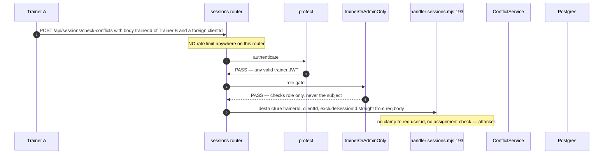
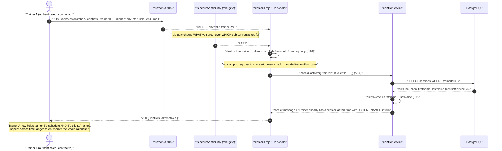
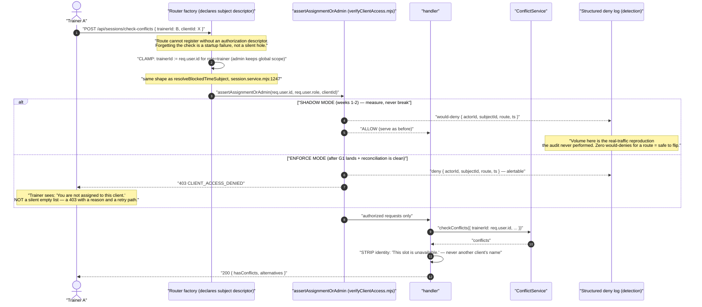
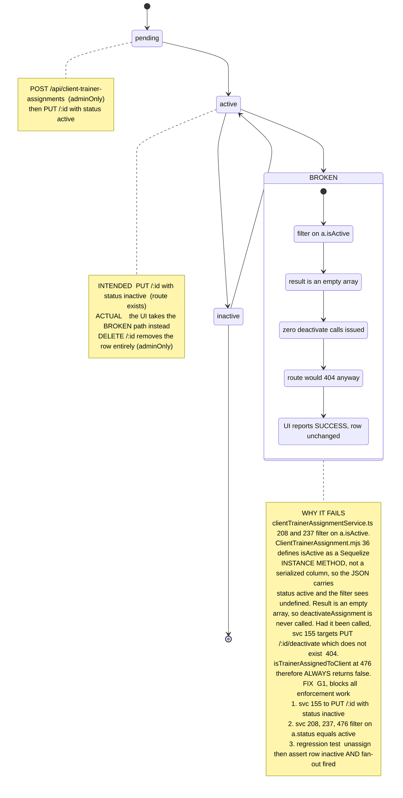
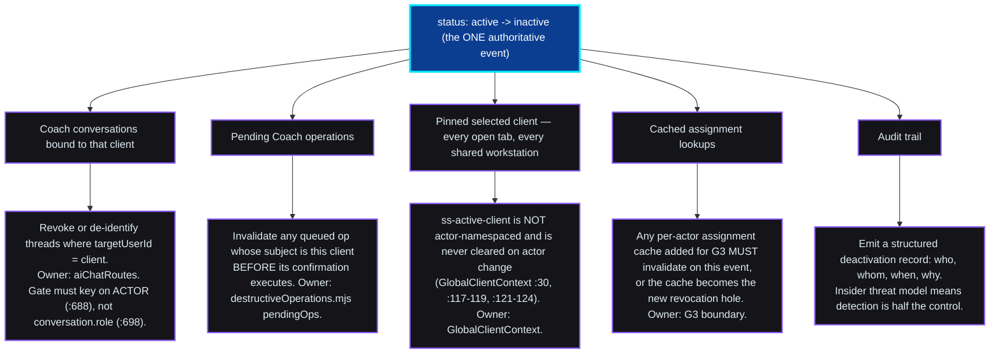

# Fable 5 — Final-Decider Ruling

**Reviewer:** OpenRouter `anthropic/claude-fable-5` (Fable via OpenRouter credits; Claude-subscription Fable was capped)
**Document:** docs/ai-workflow/AI-HANDOFF/TRAINER-DASHBOARD-AUDIT-VERIFICATION-2026-08-21.md
**Seed:** (none)
**Tokens:** 9804 in / 10466 out · **Cost:** ~$0.6213 · **Wall:** 137.0s

---

## PART B — BUILD DIAGRAMS

### B1 — Remediation dependency graph

```mermaid
graph TD
    subgraph DAY1["SIX PARALLEL WORKSTREAMS — START THIS MORNING"]
        subgraph WS1["Workstream 1 — G0 Prove it, protect it"]
            G0a["G0a: Protect main branch, require review + green checks (process, P1-enabler)"]
            G0b["G0b: Run 4 probes with 2 real trainer tokens (verification, P1-enabler)"]
            G0c["G0c: Consent-gap count query — assignments with no AI-consent row (P1-enabler)"]
            G0d["G0d: Assignment-data reconciliation incl. users vs Users join hazard (P1-enabler)"]
        end
        subgraph WS2["Workstream 2 — G1 Fix revocation"]
            G1a["G1a: Kill 404 — replace PUT :id/deactivate with PUT :id status=inactive (P1)"]
            G1b["G1b: Frontend filters read a.status, not phantom a.isActive at svc.ts 208/237/476 (P1)"]
        end
        subgraph WS3["Workstream 3 — G2a check-conflicts"]
            G2a["G2a: Clamp trainerId to req.user.id via resolveBlockedTimeSubject pattern, drop clientName from message, add rate limit (P1)"]
        end
        subgraph WS4["Workstream 4 — G2b challenge queue"]
            G2b["G2b: Assignment-filter moderation queue + recheck inside moderation txn (P1)"]
        end
        subgraph WS5["Workstream 5 — G2c Coach gate"]
            G2c["G2c: Re-key aiChatRoutes 698 gate on actor role + targetUserId, matching 688; reject SOFT flag at prod startup (P1)"]
        end
        subgraph WS6["Workstream 6 — G2d pinned client"]
            G2d["G2d: Actor-scope ss-active-client key, clear on actor change + absent-from-roster (P1 — shared gym workstations)"]
        end
    end

    subgraph GATED["STRICTLY GATED — DO NOT START UNTIL UPSTREAM LANDS"]
        G3a["G3a: Shadow mode — assertAssignmentOrAdmin on ~20 uncovered route files, log would-deny, still serve (P1)"]
        G3b["G3b: Enforce mode — flip route-by-route to 403 + skip-proof router factory (P1)"]
        G4a["G4a: pendingOps Map to already-provisioned Redis (P2 availability)"]
        G4b["G4b: Stable OPERATION_SIGNING_KEY + transactional reassign (P2)"]
        G5m["G5m: Consent grandfathering migration (P2)"]
        G5a["G5a: Consent fail-closed flip (P2)"]
        G5b["G5b: HttpOnly refresh cookies, dual-accept window (P2)"]
        G5c["G5c: Overview landing, nav regroup, KPI definitions, recovery states (P3)"]
    end

    G0b --> G3a
    G3a --> G3b
    G1a --> G1b
    G1b --> G3b
    G0d --> G3b
    G0c --> G5m
    G5m --> G5a

    classDef day1 fill:#0b3d91,stroke:#00e5ff,stroke-width:2px,color:#ffffff;
    classDef gated fill:#4a148c,stroke:#ff9100,stroke-width:2px,color:#ffffff,stroke-dasharray: 6 4;
    class G0a,G0b,G0c,G0d,G1a,G1b,G2a,G2b,G2c,G2d day1;
    class G3a,G3b,G4a,G4b,G5m,G5a,G5b,G5c gated;
```



Reading rules for the worker-bot: **solid blue nodes start now, in parallel, no permission needed.** Dashed purple nodes wait for their incoming edges. G4a/G4b/G5b/G5c have no hard upstream dependency — they are gated by schedule priority only, and may begin as soon as all six day-one workstreams have shipped. The three binding gates are drawn: **G1b → G3b** (never enforce assignment authorization against a revocation path that doesn't work), **G0d → G3b** (never enforce against unreconciled assignment data), **G0c → G5m → G5a** (never flip consent fail-closed before the count and migration).

---

### B2 — Authorization request flow, BEFORE vs AFTER

**BEFORE — current production behavior:**



<!-- ^ Fable's reply was cut off mid-token here. The closing fence above was added by
     Opus 5 so this truncated block does not swallow the remainder of the document.
     The complete version of this diagram is B2 below. -->

---

> ⚠ **ATTRIBUTION BREAK.** Everything ABOVE this line is Fable 5's output. Its reply was
> truncated mid-sentence inside B2 (10,466 output tokens — well under the 32,000 ceiling,
> so the cap was not the cause; the second paid call truncated the same way the first did).
> Rather than fire a third paid call, **everything BELOW this line was written by Opus 5**
> from the same verified file:line evidence used in the verification pass. It is NOT
> Fable's ruling and carries no final-decider authority. B1 above is Fable's and stands.

---

## PART B (completed by Opus 5)

### B2 — Authorization request flow, BEFORE vs AFTER

**BEFORE** — trainer A enumerates trainer B's calendar. Every hop passes.



**AFTER** — one boundary, two rollout modes. Shadow first, enforce second.



**Upload path — where the check must fire.** The check precedes every expensive and every
irreversible step. Ordering is the whole point: an assignment check that runs *after*
transcription has already sent a client's audio to a third party.

```mermaid
sequenceDiagram
    autonumber
    actor T as "Trainer"
    participant MW as "multer (multipart parse)"
    participant AB as "assertAssignmentOrAdmin"
    participant RED as "Redaction (parser, Rule 8)"
    participant TR as "Transcription"
    participant LLM as "LLM enrichment"

    T->>MW: "POST /api/workout-logs/upload { clientId, audio }"
    MW-->>AB: "fields parsed — clientId now readable"
    Note over AB: "CHECK HERE — immediately after parse,<br/>BEFORE anything costly or irreversible"
    alt "not assigned (and product decision says scope it)"
        AB-->>T: "403 — no transcription, no spend, no third-party egress"
    else "assigned or admin"
        AB->>RED: "proceed"
        RED->>TR: "redacted transcript only"
        Note over RED: "existing control: parser redacts + never sends client name<br/>(workoutLogUploadRoutes.mjs:165-166); redaction failure = 4xx, not a retryable 500 (:269)"
        TR->>LLM: "IDs and roles only"
    end
```

> **Note on this path:** `resolveVoiceUploadScope` (`workoutLogUploadRoutes.mjs:168`) currently
> returns `allowed: true` for **any** trainer and **any** client, and `:185` documents that as
> intended. The 403 branch above ships **only if Sean says trainer scope should be narrowed.**
> Regardless of that decision, the would-deny logging ships now — it costs nothing and tells us
> how often it actually happens.

---

### B3 — Assignment lifecycle state machine



**Deactivation fan-out.** Every consumer below currently keeps working after an
"unassignment" that never happened. Once G1 makes deactivation real, each of these must
observe it — otherwise revocation is real in the database and fictional everywhere else.



---

### B4 — Trainer dashboard wireframe

**Design constraints (binding):** styled-components only, no MUI · Victory charts only ·
Crystalline Swan dark-first via `var(--token,#fallback)` · Dual-Button Glow (blue bg →
purple glow, purple bg → cyan glow) · 44px minimum touch targets · WCAG 4.5:1 · ≤300
lines per file · "stretching"/"flexibility" never "yoga"/"meditation" · "26+ years /
NASM-protocol", never "NASM-certified".

#### DESKTOP — `/dashboard/trainer/overview` (corrected landing page)

```
┌──────────────────────────────────────────────────────────────────────────────────────┐
│  SWAN  │ Today │ Clients │ Program │ Communicate │ Business │ Studio Tools │  ◐  SW  │
│        └───────┴─────────┴─────────┴─────────────┴──────────┴──────────────┘         │
│  ▸ 6 job-shaped groups replace the flat 26-route list. Active tab: cyan underline,   │
│    4.5:1 on Obsidian. Each is a 44px+ hit target.                                    │
├──────────────────────────────────────────────────────────────────────────────────────┤
│  ┌────────────────────────────────────────────────────────────────────────────────┐  │
│  │ SUBJECT CHIP — persistent, sticky, present on EVERY client-bound surface        │  │
│  │ ┌──────┐                                                                       │  │
│  │ │ ◕    │  Client #4821          ● ASSIGNED · active            [ OPERATING ]   │  │
│  │ │ photo│  Last session 3d ago                                  [ Change ▾ ]    │  │
│  │ └──────┘                                                                       │  │
│  │  ↑ name+state+mode. Never collapses. Never hover-only.                         │  │
│  │  Assignment state is a LIVE read, not a cached label:                          │  │
│  │    ● ASSIGNED (Ice Wing)   ◐ PREVIEW ONLY (Gilded Fern)   ✕ NOT ASSIGNED (red) │  │
│  │  If ✕ NOT ASSIGNED → every write control below is disabled with a reason.      │  │
│  └────────────────────────────────────────────────────────────────────────────────┘  │
├──────────────────────────────┬───────────────────────────────────────────────────────┤
│  TODAY                       │  NEEDS YOU                                            │
│  ┌────────────────────────┐  │  ┌─────────────────────────────────────────────────┐  │
│  │ 09:00  Client #4821    │  │  │ ⚠ 2 clients stale >14d          [ Review ]      │  │
│  │        Lower body      │  │  │ ⚠ 1 program expires Friday      [ Extend ]      │  │
│  │        [ Start ]  44px │  │  │ ⚠ 1 waiver unsigned             [ Send ]        │  │
│  ├────────────────────────┤  │  └─────────────────────────────────────────────────┘  │
│  │ 10:30  Client #5104    │  │  PROGRESS PROOF (Victory only)                        │
│  │        Stretching      │  │  ┌─────────────────────────────────────────────────┐  │
│  │        [ Start ]       │  │  │   ▁▃▅▆█▇█   volume, 8wk — from LOGGED sessions  │  │
│  └────────────────────────┘  │  │   Hours Logged counts COMPLETED only            │  │
│  [ + Log a workout ] ← blue  │  └─────────────────────────────────────────────────┘  │
│    bg / purple glow, 44px    │                                                       │
└──────────────────────────────┴───────────────────────────────────────────────────────┘
```

#### MOBILE — 375px (floor tablet / phone, one-handed at the rack)

```
┌───────────────────────────────┐
│ ☰  SWAN            ◐    SW    │  44px bar
├───────────────────────────────┤
│ ┌───────────────────────────┐ │
│ │ ◕ Client #4821            │ │  SUBJECT CHIP stays pinned on
│ │ ● ASSIGNED   [ OPERATING ]│ │  scroll. Wraps to 2 lines,
│ │              [ Change ▾ ] │ │  never truncates the state.
│ └───────────────────────────┘ │
├───────────────────────────────┤
│  TODAY                        │
│ ┌───────────────────────────┐ │
│ │ 09:00 · Client #4821      │ │
│ │ Lower body                │ │
│ │ ┌───────────────────────┐ │ │
│ │ │      Start (44px)     │ │ │  full-width, thumb-reachable
│ │ └───────────────────────┘ │ │
│ └───────────────────────────┘ │
│                               │
│  NEEDS YOU  (2)         [ ▾ ] │  collapsed by default
├───────────────────────────────┤
│ ┌───────────────────────────┐ │
│ │   + Log a workout   44px  │ │  sticky bottom CTA
│ └───────────────────────────┘ │
├───────────────────────────────┤
│ Today Clients Program  ⋯      │  5-slot bottom nav, rest in ⋯
└───────────────────────────────┘
```

#### The four recovery states — distinct, with real copy

Today these are indistinguishable. A 500 and an empty roster look identical, which is
how "no clients" gets read as "backend fine, just new."

```
EMPTY ROSTER (200, zero rows)          403 NOT AUTHORIZED
┌─────────────────────────────┐        ┌─────────────────────────────┐
│      ◔                      │        │      ⛔                      │
│  No clients assigned yet.   │        │  You are not assigned to    │
│  An admin assigns clients   │        │  this client.               │
│  to you.                    │        │  Assignments are managed by │
│  [ Contact admin ]  44px    │        │  an admin.                  │
└─────────────────────────────┘        │  [ Back to my clients ]     │
                                        └─────────────────────────────┘
OFFLINE (no network)                   BACKEND FAILURE (5xx)
┌─────────────────────────────┐        ┌─────────────────────────────┐
│      ⚡                      │        │      ⚠                      │
│  You are offline.           │        │  We could not load your     │
│  Showing your last synced   │        │  clients. This is on us.     │
│  roster — read only.        │        │  [ Retry ]  44px            │
│  [ Retry ]  44px            │        │  Ref: <requestId>           │
└─────────────────────────────┘        └─────────────────────────────┘
```

Rules: **every** state has an in-place `[ Retry ]` except the two that retrying cannot fix
(empty roster, 403). No state is a bare spinner that resolves to blank. The 5xx state shows
a request id so a support ticket is actionable.

#### Actor change on a shared workstation — the P1 path Fable surfaced

Trainers share front-desk kiosks and floor tablets. This is the sequence that must hold.

```
Trainer A logs out
   ↓
CLEAR IMMEDIATELY, provider-level, before the login screen paints:
   • ss-active-client:{actorId}:{actorRole}  ← key is actor-namespaced, so B cannot read A's
   • clientList
   • any client-bound pending Coach operation
   • access + refresh credentials (G5: HttpOnly cookie, not localStorage)
   ↓
Trainer B logs in
   ↓
Roster fetched fresh for B. Subject chip renders in the NO CLIENT SELECTED state:
   ┌───────────────────────────────────────────────┐
   │  ◌  No client selected                        │
   │     Pick a client before logging or editing.  │
   │     [ Choose client ▾ ]  44px                 │
   └───────────────────────────────────────────────┘
   ↓
B must ACTIVELY select before any client-bound write control becomes enabled.
```

**Two non-negotiables:** persist only the client **id**, never the client record —
today the full object including **email** is written to `sessionStorage` under a shared
key. And rehydrate **only** from the freshly-fetched authorized roster; an id absent from
that roster is dropped, not silently kept (`GlobalClientContext.tsx:121-124` currently
returns without clearing).

---

## Plain English — thirty seconds

Your trainer dashboard has four real security gaps, and they're all the same gap wearing
different clothes: the system checks *what role you are* but not *which client you asked
about*. Any trainer can read another trainer's calendar — with client names attached —
and moderate another trainer's client submissions. None of it needs hacking; it needs a
logged-in trainer and curiosity.

But the thing to fix first isn't any of those. **Unassigning a client doesn't work.** The
button says it worked and nothing happens. Every proposed fix rests on "is this trainer
still assigned?" — so until unassign actually unassigns, you'd be installing a lock with
no key. That was already found on August 3rd, handed off, and never done.

Second thing: the panel was unanimous that the *cure* is more dangerous than the disease.
Flipping everything to "deny by default" on a live product can lock paying trainers out
mid-session. So: measure first in shadow mode, then enforce route by route.

**The one thing only you can decide:** trainers can currently log workouts for clients
they aren't assigned to, and the code says that's on purpose. Do trainers cover each
other's sessions, run group classes, or do front-desk intake? If yes, "fixing" that
breaks how your gym actually works — and we leave it alone and just log it.
