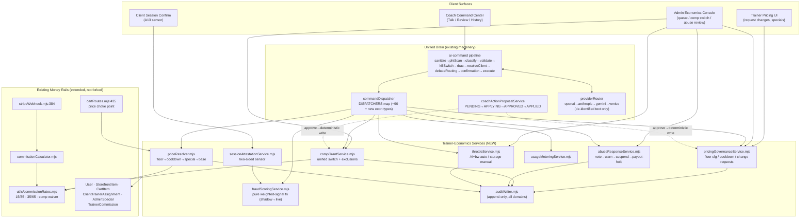
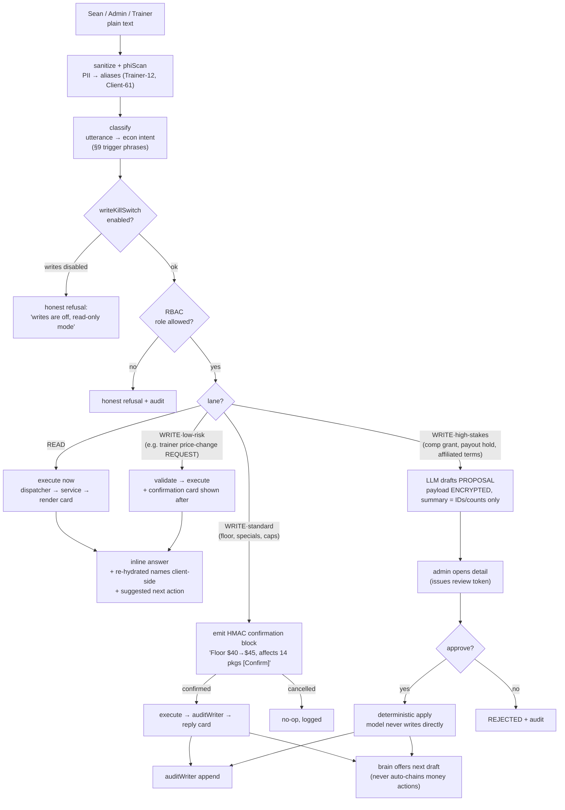
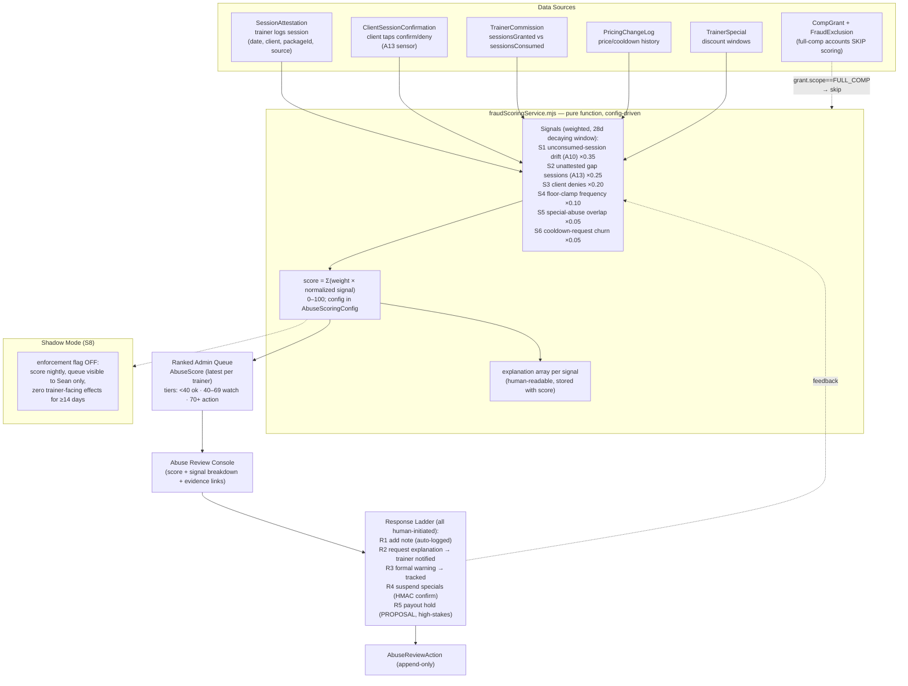

# Kimi K3 — Front-End / Design Review

**Reviewer:** OpenRouter `moonshotai/kimi-k3` (effort: high)
**Document:** <HOME>/AppData/Local/Temp/claude/<SCRATCH-KEY>/60dae4f0-968f-430a-bd11-293cfae81a64/scratchpad/trainer-economics-BLUEPRINT-KIMI-COMMISSION.md
**Seed:** (none)
**Tokens:** 3226 in / 16000 out · **Cost:** ~$0.2497 · **Wall:** 515.9s

---

# SWANSTUDIOS TRAINER-ECONOMICS BUILD BLUEPRINT
## Authored by Kimi K3, Lead Architect — v1.0 (execution-ready)

---

# 1. EXECUTIVE VISION

## 1.1 What this system is

Trainer-economics is a **governance layer over money that already flows**, not a new money system. Every dollar in SwanStudios already passes through one choke point (`cartRoutes.mjs:435` → `firstMoney(...)` at `:169`) and one commission truth (`utils/commissionRates.mjs`). My architecture does not fork either. It **plugs into both** and adds four capabilities around them:

1. **Pricing governance** — a deterministic price-resolution chain (`floor → cooldown → special → base`) executed inside the existing cart choke point. No UI anywhere can bypass it because the UI never sets price; the resolver does.
2. **A unified comp system** — one `CompGrant` model spanning trainers, clients, and users, replacing the "two toggles" concept. One admin switch, one audit trail, one fraud-exclusions registry.
3. **A fraud sentinel** — a deterministic, weighted-signal scoring engine (no ML in v1) fed by a **two-sided session sensor** (trainer attests, client confirms). Shadow-mode first, then a graduated response ladder that never auto-punishes.
4. **Resource metering + throttle** — usage ledger, admin-tunable caps, automatic AI/bandwidth throttle with Sean alerted, storage manual.

## 1.2 The Jarvis experience (how Sean operates it)

The brain stays exactly what it is: **talk → propose → tap-approve → deterministic-execute**. I do not add autonomy. I add **vocabulary**.

Sean types into the Coach Command Center (or the new Economics Console's embedded terminal):

> "Set the platform floor to $45."

The pipeline runs `sanitize → phiScan → classify → validate → writeKillSwitch → rbac → resolveClient → debateRouting → confirmation → execute`. Classify maps the utterance to `admin.set_price_floor`. Because this is a **money write**, the executor emits a confirmation action-block; Sean sees a rendered card — *"Set global price floor $40 → $45. Affects 14 active packages. Effective immediately. [Confirm] [Cancel]"* — taps Confirm (HMAC-signed), and the dispatcher writes through the governance service, appends to `PricingChangeLog`, and replies in-line: *"Done. Floor is $45. 2 packages were below the new floor and were flagged, not auto-changed — want me to draft fixes?"*

That last turn is the whole philosophy: **the brain executes deterministically, then offers the next draft**. It never chains money actions without a fresh approval.

Reads are frictionless — *"who's gaming the system"* executes immediately and returns the ranked abuse queue as an inline card. Writes are gated — comp, pricing, throttle overrides, and every rung of the fraud response ladder above "add note" require either a proposal approval (review-token gated, payload encrypted at rest) or an HMAC confirmation, per the tier table in §9.

Doctrine preserved verbatim: **"The model prepares drafts; deterministic services own final writes."**

## 1.3 Design principles I enforced everywhere

- **One choke point per concern.** Price resolves in one function. Comp resolves in one function. Fraud scoring runs in one pure function. If a builder is about to write a second path, the answer is no.
- **Shadow before teeth.** Every enforcement mechanism (pricing floor, fraud ladder, throttle) ships logging-only first, proves itself against production data, then gets its enforcement flag flipped. Flags live in one `EconomicsFlags` config, admin-visible.
- **Append-only truth.** Every money-relevant mutation appends to a domain log written through a single `auditWriter.mjs`. Nothing updates history; history accrues.
- **The sensor the detector reads must not be controlled by the subject.** A13 (dark sessions) is only solvable with a client-side confirmation signal. This is non-negotiable and shaped the entire data model.
- **Zero PII to LLMs.** The brain sees `Trainer-12`, `Client-61`, dollar amounts, and counts. Never names. Names are re-hydrated client-side from the IDs the brain returns.

---

# 2. HOSTILE REVIEW OF THE PRIOR PLAN — what I'm changing and why

| # | Prior plan said | Verdict | My change |
|---|---|---|---|
| H1 | S1 = "audit tables" as a standalone slice | **Wrong shape.** Tables without writers are dead schema; builders would invent one-off insert code per slice. | S1 ships an **`auditWriter.mjs` service + the first consumer** (price-resolution instrumentation). Every later slice writes through the same writer. Schema and writer ship together or not at all. |
| H2 | "Two comp toggles" (trainer comp, client comp) | **Superseded by Sean's locked decision #4** (ONE unified switch across trainers + clients + users). Two parallel toggle systems = two audit trails, two fraud-exclusion lists, guaranteed drift. | Replaced with a single **`CompGrant`** model (§7). One table, one resolver, one admin surface. |
| H3 | Fraud detector scoring unspecified/"algorithm as centerpiece" | **Centerpiece framing invited over-engineering** (ML, anomaly models). At this scale ML is unauditable and indefensible to a lawyer. | Deterministic **weighted-signal score with time decay**, every signal individually explainable in the admin UI. The "algorithm" is a pure function + a config table. §5 and S8 specify it exactly. |
| H4 | A13 acknowledged but sliced late | **Backwards.** A dark-session detector without the client-side sensor is a false-negative machine. The sensor is a *product surface* (client confirms sessions), not a detector detail. | **Session attestation + client confirmation is its own slice (S7) that ships before the detector (S8).** Detector reads two-sided data from day one. |
| H5 | Slice order: comp toggles (S4) before detector (S5), throttle last | Partially right, but comp **must** land before the detector leaves shadow, because full-comp accounts are the #1 source of false positives, and the **FraudExclusion registry lives with CompGrant**. | Order: governance → requests → specials → onboarding v2 → **comp+exclusions** → attestation sensor → detector shadow → response ladder → metering → throttle. Detector never scores a full-comp account. §10. |
| H6 | Price-change request flow listed as a bullet under decision #3, not a slice | **Under-scoped.** It's a model, a trainer UI, an admin queue, notifications, audit, and two brain commands. | Promoted to a **full slice (S3)** with complete contracts. |
| H7 | No price-resolution instrumentation before enforcement | Enforcing a $40 floor without first observing how often current carts resolve below it = blind enforcement, angry trainers, rollback. | S1 includes **shadow price-resolution logging**: run the resolver, log `wouldHaveClamped`, enforce nothing. S2 flips enforcement using S1's data. |
| H8 | AdminSpecial "extend or sibling" left open | Ambiguity = builder guesses. | **Decision: sibling (`TrainerSpecial`), not extension.** AdminSpecial is client-scoped bonus-session promo; TrainerSpecial is trainer-scoped price discount. Different invariants, different tables, shared scoping/soft-delete/date-window pattern. §7, S4. |
| H9 | No owner for the competing package mounts (`/api/admin/packages` vs legacy `/api/admin/storefront`) | Two live mounts is a latent IDOR/consistency bug. | **Decision: no third mount; legacy is frozen.** New pricing-governance UI calls `/api/admin/packages` only. Deprecation banner on legacy in S11's upgrade pass. Migration of the live UI is explicitly out of scope except where pricing slices touch it. |
| H10 | Nothing said about *upgrading* existing systems | Violates Sean's directive #1. | §11 is a first-class section with a named enhancement per existing system, each pinned to the slice that delivers it. |
| H11 | No conversational layer in prior slices | Violates directive #2. | Every slice now ships its brain commands/proposals **with** the feature (§9 is the master contract). The brain is not a bolt-on phase. |
| H12 | Usage caps "admin-tunable" with no policy model | Tunable-where? Builders would hardcode. | **`UsageCapPolicy` table** (per-role, per-resource, admin-editable, audited). Defaults are seed data matching decision #5, not constants. |

**What I'm keeping:** S0's commissionRates single-source-of-truth (extend, never fork), shadow-mode-then-ladder for fraud, the abuse vector list A1–A13 with A10 (under-report/over-deliver) as the priority signal, and the reconciliation script staying read-only.

---

# 3. MERMAID — SYSTEM ARCHITECTURE



**Key architectural fact:** the brain never touches models directly. Brain → dispatcher → economics service → model → auditWriter. Same path as the admin UI. One path per capability, always.

---

# 4. MERMAID — CONVERSATIONAL-COMMAND FLOW



**Reads vs. writes, in one line:** reads and trainer-initiated *requests* execute in-line; admin money/comp writes get HMAC confirmation; comp grants, payout holds, and anything touching affiliated classification go through the encrypted proposal lane with review-token approval.

---

# 5. MERMAID — FRAUD-DETECTION PIPELINE



**Why this shape:** A10 (the priority vector) is caught by S1 (granted-minus-consumed drift); A13 is caught by S2/S3, which **only exist because of the two-sided sensor** — a trainer can fake an attestation but cannot fake the client's independent confirm. S4/S5 catch pricing gaming. Every rung of the ladder is a human decision; the system ranks and explains, it never convicts.

---

# 6. MERMAID — COMP + THROTTLE DECISION FLOW

```mermaid
flowchart TB
    subgraph COMP["Unified Comp Switch (one surface, all roles)"]
        SW["Admin Comp Switch UI<br/>search any User (trainer / client / user)"]
        SW --> DEC{grant type?}
        DEC -- "waive_membership" --> G1["CompGrant<br/>scope=MEMBERSHIP_WAIVER"]
        DEC -- "full_comp (100%)" --> G2["CompGrant<br/>scope=FULL_COMP<br/>+ auto-adds FraudExclusion row"]
        DEC -- "custom (e.g. % sessions)" --> G3["CompGrant<br/>scope=CUSTOM, terms json"]
        G1 & G2 & G3 --> CRE["compResolver.mjs<br/>checked at cart + membership + commission"]
        CRE --> RATES2["commissionRates.mjs extended:<br/>FULL_COMP → fee waived, commission row<br/>written with compGrantId, rate 0, flagged"]
        G1 & G2 & G3 --> AUD2["CompGrantAudit via auditWriter"]
    end

    subgraph THROTTLE["Usage Metering → Throttle"]
        MW["metering middleware<br/>(AI tokens · bandwidth · storage · req count)"]
        MW --> UL["UsageLedger (hourly rollup per user)"]
        UL --> CHK{vs UsageCapPolicy<br/>(per role, admin-tunable)}
        CHK -- "<80%" --> OK["no action"]
        CHK -- "80–99%" --> WARN["usage_warning event<br/>→ notify Sean + user"]
        CHK -- "≥100% AI or bandwidth" --> AUTO["AUTO-THROTTLE<br/>throttleService sets ThrottleEvent<br/>AI → queue/downgrade; bw → rate-limit<br/>ALERT SEAN immediately"]
        CHK -- "≥100% storage" --> MAN["MANUAL only:<br/>alert Sean, read-only flag suggestion,<br/>NO auto action"]
        AUTO --> OVR["admin override via brain<br/>'unthrottle Client-61' → HMAC confirm<br/>→ UsageTierAudit"]
        MAN --> OVR
    end

    CG2["FULL_COMP accounts still meter<br/>(comp ≠ unlimited usage)"] -.-> MW
```

**Defaults (locked decision #5), stored as seed rows in `UsageCapPolicy`:** 100k AI tokens/mo, 1GB bandwidth/mo, 5GB storage, 2k requests/day — per standard user; trainer tier gets its own row (2× AI, since trainers drive the logger brain). All tunable from the console; every change audited.

---

# 7. MERMAID — ERD

```mermaid
erDiagram
    User ||--o{ PricingChangeRequest : "trainer requests"
    User ||--o{ TrainerSpecial : "trainer owns"
    User ||--o{ SessionAttestation : "trainer attests"
    User ||--o{ ClientSessionConfirmation : "client confirms"
    User ||--o{ AbuseScore : "subject"
    User ||--o{ CompGrant : "grantee"
    User ||--o{ UsageLedger : "consumes"
    User ||--o{ ThrottleEvent : "subject"
    User ||--o{ TrainerCommission : "earns"
    User ||--o{ ClientTrainerAssignment : "either side"
    StorefrontItem ||--o{ PricingChangeLog : "price history"
    StorefrontItem ||--o{ TrainerSpecial : "discounted by"
    StorefrontItem ||--o{ CartItem : "purchased as"
    TrainerSpecial ||--o{ PricingChangeLog : "may trigger"
    CompGrant ||--o| FraudExclusion : "FULL_COMP auto-creates"
    CompGrant ||--o{ TrainerCommission : "waives fee on"
    SessionAttestation ||--o| ClientSessionConfirmation : "confirmed by"
    AbuseScore ||--o{ AbuseReviewAction : "actions against"
    UsageCapPolicy ||--o{ UsageTierAudit : "change history"

    PricingChangeLog {
        int id PK
        int storeFrontItemId FK
        int changedByUserId FK
        string changedByRole
        decimal oldPrice
        decimal newPrice
        string source "manual|special|floor_clamp|request"
        int pricingChangeRequestId FK_null
        boolean wouldHaveClamped "shadow-mode marker"
        json context
        datetime createdAt "append-only, no updatedAt writes"
    }
    PricingChangeRequest {
        int id PK
        int trainerId FK
        int storeFrontItemId FK
        decimal requestedPrice
        string reason "required, 20-500 chars"
        string status "pending|approved|denied|expired"
        int reviewedByUserId FK_null
        string reviewNote
        datetime cooldownEndsAt "computed: last change + 30d"
        datetime createdAt
    }
    TrainerSpecial {
        int id PK
        int trainerId FK
        int storeFrontItemId FK_null "null = all trainer pkgs"
        decimal specialPrice "must be >= floor"
        datetime startsAt
        datetime endsAt "max 14 days, enforced"
        boolean isActive
        boolean isDeleted "soft-delete, mirrors AdminSpecial"
        int createdByUserId FK
    }
    SessionAttestation {
        int id PK
        int trainerId FK
        int clientId FK
        int trainerCommissionId FK_null
        date sessionDate
        string source "logger|manual|import"
        string idempotencyKey UK "trainer+client+date+source"
    }
    ClientSessionConfirmation {
        int id PK
        int sessionAttestationId FK
        int clientId FK
        string verdict "confirmed|denied|expired"
        datetime respondedAt "null until client acts; expires 7d"
    }
    AbuseScore {
        int id PK
        int trainerId FK
        int score "0-100"
        json signals "per-signal values + human explanations"
        string window "28d"
        datetime computedAt
    }
    AbuseScoringConfig {
        int id PK
        json weights "S1..S6"
        json thresholds "watch 40, action 70"
        boolean shadowMode "default true"
        int updatedByUserId FK
    }
    AbuseReviewAction {
        int id PK
        int abuseScoreId FK
        int actorUserId FK
        string rung "note|explanation|warning|suspend_specials|payout_hold"
        string note
        json metadata
        datetime createdAt "append-only"
    }
    CompGrant {
        int id PK
        int userId FK "any role"
        string scope "MEMBERSHIP_WAIVER|FULL_COMP|CUSTOM"
        json terms "CUSTOM only"
        string reason "required"
        int grantedByUserId FK
        datetime startsAt
        datetime endsAt_null
        boolean isActive
        int revokedByUserId FK_null
    }
    FraudExclusion {
        int id PK
        int userId FK
        int compGrantId FK
        string reason "auto: full_comp"
        boolean isActive
    }
    UsageLedger {
        int id PK
        int userId FK
        string resource "ai_tokens|bandwidth|storage|requests"
        bigint amount
        string windowStart "hourly rollup bucket"
    }
    UsageCapPolicy {
        int id PK
        string role "user|client|trainer|admin"
        string resource
        bigint capAmount
        string period "daily|monthly"
        string onExceed "auto_throttle|manual|none"
        boolean isActive
    }
    ThrottleEvent {
        int id PK
        int userId FK
        string resource
        string action "throttled|unthrottled"
        string trigger "auto_cap|admin_override"
        int actorUserId FK_null
    }
    UsageTierAudit {
        int id PK
        int usageCapPolicyId FK
        int changedByUserId FK
        bigint oldCap
        bigint newCap
    }
```

**Attachment notes:** `TrainerCommission` gains nullable `compGrantId FK` + `wasComped boolean` (migration, additive only — S0 logic untouched). `User` gains **one** column: `usageTier string default 'standard'` (role-keyed lookup into UsageCapPolicy). `trainerType` already exists post-S0. All FKs reference `"Users"` per hard rules. Every auditable table is written **only** via `auditWriter.mjs`.

---

# 8. WIREFRAMES

## 8.1 Admin Economics Console (desktop ≥1280px)

```
┌──────────────────────────────────────────────────────────────────────────────┐
│ ◆ SWAN ECONOMICS        [Pricing] [Requests ③] [Comp Switch] [Abuse ②] [Usage]│
│──────────────────────────────────────────────────────────────────────────────│
│ ┌─ GLOBAL FLOOR ──────────────┐ ┌─ PRICE-CHANGE REQUESTS (3) ───────────────┐│
│ │ Floor: $40/session          │ │ Trainer-4  Apex 10-pkg  $35→$45  "matching ││
│ │ [Change Floor…] (confirm)   │ │  market rate"           [Approve] [Deny]   ││
│ │ Cooldown: 30d · req-flow ON │ │ Trainer-9  Duo monthly  $50→$48  "retention"││
│ │ Shadow clamps (7d): 2       │ │  ─ cooldown active until Jun 12 ─  [Deny]  ││
│ └─────────────────────────────┘ └────────────────────────────────────────────┘│
│ ┌─ ABUSE QUEUE (shadow mode: ON — no trainer-facing effects) ────────────────┐│
│ │ 70+ ▓ Trainer-12  score 78  [S1 unconsumed drift 14 sess] [S2 6 dark sess] ││
│ │     signals: S1▓▓▓▓ S2▓▓ S3▓ │  [Open Review]  (evidence → attestations)   ││
│ │ 40–69 ░ Trainer-7  score 52  [S4 floor-clamp 5×]           [Open Review]   ││
│ └────────────────────────────────────────────────────────────────────────────┘│
│ ┌─ ECONOMICS TERMINAL ───────────────────────────────────────────────────────┐│
│ │ › who's gaming the system                                                  ││
│ │ ◆ 2 trainers above action threshold. Trainer-12 (78): 14 unconsumed…       ││
│ │ › set the floor to 45                                                      ││
│ │ ◆ DRAFT — Floor $40 → $45. Affects 14 active packages, 2 below floor.      ││
│ │   [Confirm — signed]  [Cancel]                                             ││
│ └────────────────────────────────────────────────────────────────────────────┘│
└──────────────────────────────────────────────────────────────────────────────┘
Style: Midnight Sapphire #002060 bg, Ice Wing #60C0F0 headers, Dual-Button Glow
on [Approve]/[Confirm] (blue→purple), Gilded Fern #C6A84B for scores ≥70.
All touch targets ≥44px. Charts (usage/abuse trend tabs) = Victory only.
```

## 8.2 Admin Comp Switch (desktop)

```
┌──────────────────────────────────────────────────────────────────┐
│ ◆ COMP SWITCH                                                     │
│ Search any user: [ maria▌        ]  role: (any ▾)                 │
│──────────────────────────────────────────────────────────────────│
│ Client-61 · Maria S. · client · active since Jan                  │
│ ┌──────────────────────────────────────────────────────────────┐ │
│ │ Grant:  ( ) Waive membership   (●) Full comp (100%)          │ │
│ │         ( ) Custom…                                          │ │
│ │ Reason (required): [ founding member, family          ]      │ │
│ │ Ends: [ never ▾ ]                                            │ │
│ │ ⚠ Full comp auto-excludes this account from fraud scoring.   │ │
│ │ This is a money action → proposal + approval required.       │ │
│ │            [ Draft Comp Grant ]  (glow blue→purple)          │ │
│ └──────────────────────────────────────────────────────────────┘ │
│ ACTIVE GRANTS (4)                                                │
│ Client-61  FULL_COMP   by Sean  Mar 3–    [Revoke…](signed)      │
│ Trainer-2  MEMBERSHIP_WAIVER   by Sean  Jan 12–   [Revoke…]      │
└──────────────────────────────────────────────────────────────────┘
```

## 8.3 Trainer Pricing + Change-Request UI (desktop / and it's the mobile shell too)

```
┌────────────────────────────────────────────┐
│ ◆ MY PRICING                                │
│ Your type: Affiliated (35/65)               │
│ Platform floor: $40/session                 │
│────────────────────────────────────────────│
│ Apex 10-package                             │
│ Current: $45/session · changed Apr 2        │
│ Cooldown: eligible to change NOW ✓          │
│ New price: [ 50▌ ]  (min $40)               │
│ Why (required, ≥20 chars):                  │
│ [ NASM master cert, demand up      ]        │
│ ℹ Within cooldown? This becomes a request   │
│   to your admin instead.                    │
│   [ Submit Change ] (glow)                  │
│────────────────────────────────────────────│
│ MY REQUESTS                                 │
│ $45→$50 · Apr 2 · ✓ Approved by admin       │
│ $40→$45 · Feb 20 · ✗ Denied "too soon"      │
│────────────────────────────────────────────│
│ MY SPECIALS (max 14 days, ≥ $40 floor)      │
│ [ + New Special ]  Summer Kickoff $42 Jun1-7│
└────────────────────────────────────────────┘
```

## 8.4 Mobile 375px — Admin Economics Console (stacked, tab-first)

```
┌─────────────────────────────┐
│◆ ECONOMICS        [≡ tabs ▾]│
│─────────────────────────────│
│ FLOOR                       │
│ $40/session   [Change…]     │
│ 44px btn, full-width        │
│─────────────────────────────│
│ REQUESTS (3)                │
│┌───────────────────────────┐│
││Trainer-4 · $35→$45        ││
││"matching market rate"     ││
││[Approve]      44px glow   ││
││[Deny]         44px ghost  ││
│└───────────────────────────┘│
│┌───────────────────────────┐│
││Trainer-9 · $50→$48        ││
││cooldown till Jun 12       ││
││[Deny]                     ││
│└───────────────────────────┘│
│─────────────────────────────│
│ ABUSE (shadow ON)           │
│┌───────────────────────────┐│
││●78 Trainer-12             ││
││S1▓▓▓▓ S2▓▓ S3▓            ││
││[Open Review]  44px        ││
│└───────────────────────────┘│
│─────────────────────────────│
│ TERMINAL                    │
│┌───────────────────────────┐│
││› who's gaming the system  ││
││◆ 2 above threshold…       ││
││[ type a command…     ]    ││
││                    [Send] ││
│└───────────────────────────┘│
└─────────────────────────────┘
```

## 8.5 Mobile 375px — Trainer Pricing

```
┌─────────────────────────────┐
│◆ MY PRICING                 │
│ Affiliated · 35/65          │
│ Floor: $40 · eligible NOW ✓ │
│─────────────────────────────│
│ Apex 10-package             │
│ Current $45/session         │
│ New price                   │
│ [        50        ] 56px   │
│ Why (required)              │
│ [ NASM master cert…  ]      │
│ [   Submit Change   ] 56px  │
│        glow blue→purple     │
│─────────────────────────────│
│ MY REQUESTS                 │
│ ✓ $45→$50 Approved          │
│ ✗ $40→$45 Denied            │
│─────────────────────────────│
│ MY SPECIALS                 │
│ [ + New Special ] 44px      │
└─────────────────────────────┘
```

---

# 9. NEW BRAIN COMMAND / PROPOSAL TYPES — exact contracts

All commands register in `commandDispatcher.mjs` DISPATCHERS and pass `hasDispatcher()`. All ride the existing pipeline. `confirmationTier`: `none` (read), `post` (execute + receipt card), `signed` (HMAC confirm before execute), `proposal` (encrypted draft + review-token approval).

### 9.1 Reads (execute immediately)

| Command | Trigger phrases | RBAC | Dispatcher → service |
|---|---|---|---|
| `econ.get_pricing_overview` | "what's the floor", "pricing overview", "show trainer prices" | admin, trainer (scoped) | `dispatchers/econDispatcher.mjs#getPricingOverview` → `pricingGovernanceService.overview()` |
| `econ.list_price_requests` | "pending price requests", "who wants a raise" | admin | `#listPriceRequests` → `pricingGovernanceService.listRequests({status:'pending'})` |
| `econ.get_fraud_queue` | "who's gaming the system", "fraud queue", "suspicious trainers" | admin | `#getFraudQueue` → `fraudScoringService.rankedQueue()` |
| `econ.get_abuse_detail` | "why is trainer 12 flagged", "explain that score" | admin | `#getAbuseDetail` → `fraudScoringService.explain(trainerId)` |
| `econ.list_comp_grants` | "who's comped", "show comp grants" | admin | `#listCompGrants` → `compGrantService.list()` |
| `econ.get_usage` | "usage report", "who's near their cap", "throttle status" | admin | `#getUsage` → `usageMeteringService.overview()` |
| `econ.run_payout_report` | "run payouts", "payout report for May" | admin | `#runPayoutReport` → `payoutReportService.generate(period)` (read-only; PDF artifact saved to R2, link returned) |

### 9.2 Writes — commands

| Command | Tier | RBAC | Trigger phrases |
|---|---|---|---|
| `econ.set_price_floor` | **signed** | admin | "set the floor to $45", "raise the price floor" |
| `econ.request_price_change` | post | trainer (self only) | "change my Apex package to $50", "request a price increase" |
| `econ.approve_price_request` / `econ.deny_price_request` | **signed** | admin | "approve trainer 4's price change", "deny that request" |
| `econ.create_trainer_special` | **signed** | trainer (self), admin | "run a 14-day special at $42", "summer kickoff discount" |
| `econ.fraud_review_action` | rung-dependent: note/explanation = post; warning/suspend_specials = **signed**; payout_hold = **proposal** | admin | "add a note on trainer 12", "warn trainer 12", "suspend their specials", "hold their payout" |
| `econ.set_usage_cap` | **signed** | admin | "raise trainer AI cap to 200k", "set client bandwidth cap" |
| `econ.throttle_override` | **signed** | admin | "unthrottle client 61", "lift the throttle" |

**Action-block contract — `econ.set_price_floor` (representative signed command):**

```json
{
  "type": "confirmation_required",
  "command": "econ.set_price_floor",
  "params": { "newFloor": 45.00, "currency": "USD" },
  "preview": {
    "oldFloor": 40.00,
    "affectedPackages": 14,
    "belowFloorPackages": [{ "storeFrontItemId": 88, "currentPricePerSession": 42.00 }],
    "policy": "below-floor packages are FLAGGED, never auto-changed"
  },
  "confirmation": { "method": "hmac", "ttlSeconds": 120 },
  "render": {
    "title": "Set global price floor $40 → $45",
    "body": "14 active packages affected. 2 are below the new floor and will be flagged for trainer request flow.",
    "buttons": ["Confirm", "Cancel"]
  }
}
```

**`econ.request_price_change` (post-tier, executes with validation):**

```json
{
  "type": "execute",
  "command": "econ.request_price_change",
  "params": { "storeFrontItemId": 88, "requestedPrice": 50.00, "reason": "NASM master cert, demand up" },
  "guards": {
    "actorIsOwner": true,
    "minFloor": 40.00,
    "reasonLength": [20, 500],
    "cooldown": "if within 30d → creates PricingChangeRequest(status=pending); else applies directly + PricingChangeLog(source='manual')"
  },
  "render": { "receipt": "Price $45 → $50 applied." }
}
```

**`econ.fraud_review_action`:**

```json
{
  "type": "execute",
  "command": "econ.fraud_review_action",
  "params": { "abuseScoreId": 341, "rung": "warning", "note": "Unconsumed drift 14 sessions over 28d" },
  "guards": {
    "allowedRungs": ["note", "explanation", "warning", "suspend_specials", "payout_hold"],
    "tierByRung": { "note": "post", "explanation": "post", "warning": "signed", "suspend_specials": "signed", "payout_hold": "proposal" },
    "appendOnly": true
  }
}
```

### 9.3 Writes — proposals (encrypted payload, review-token approval)

Register in `coachActionProposalService.mjs` TYPE enum alongside existing types. Same PENDING→APPLYING→APPROVED→APPLIED lifecycle. Summary JSON = IDs/counts only.

| Proposal type | Trigger phrases | Applies via |
|---|---|---|
| `comp_grant` | "comp this client", "waive Maria's membership", "give trainer 2 full comp" | `compGrantService.grant()` — deterministic |
| `comp_revoke` | "uncomp client 61", "revoke that grant" | `compGrantService.revoke()` |
| `payout_hold` | "hold trainer 12's payout" | `abuseResponseService.payoutHold()` |

**`comp_grant` proposal contract:**

```json
{
  "type": "comp_grant",
  "summary": { "userId": 61, "userRole": "client", "scope": "FULL_COMP" },
  "payload_encrypted": {
    "userId": 61,
    "scope": "FULL_COMP",
    "terms": null,
    "reason": "founding member, family",
    "startsAt": "2025-06-01T00:00:00Z",
    "endsAt": null
  },
  "sideEffects": [
    "Creates FraudExclusion row (auto)",
    "Future TrainerCommission rows for this user: fee waived, wasComped=true",
    "Membership billing paused at period boundary"
  ],
  "approval": { "requiresReviewToken": true, "approverRole": "admin" },
  "render": { "title": "Full comp — Client-61", "warning": "Money action. Excluded from fraud scoring." }
}
```

**Name re-hydration rule (all types):** the brain returns `userId` + alias (`Client-61`); the frontend resolves the real name via the existing authenticated user endpoint. No name ever enters the LLM context.

---

# 10. RE-AUTHORED SLICE SEQUENCE

Conventions: paths relative to repo root; `backend/`, `frontend/src/`. Every slice: migration is reversible; styled-components only; palette per hard rules; files ≤300 lines (split `*Service.mjs` / `*Service.helpers.mjs` / `*Service.queries.mjs`); brain commands ship **with** their slice; every write path goes through `auditWriter.mjs`.

---

### S1 — Audit foundation + shadow price instrumentation
**Goal:** the append-only writer every later slice depends on, plus observation of the pricing choke point before any enforcement.
**Files:**
- `backend/services/audit/auditWriter.mjs` — `append({table, row, actor, context})`; refuses UPDATE/DELETE on audited tables (throws).
- `backend/services/economics/priceResolver.mjs` — pure fn `resolve({storeFrontItem, trainer, activeSpecials, floorConfig, now}) → {price, source, wouldHaveClamped}`.
- `backend/services/economics/priceResolver.test.mjs`
- `backend/models/PriceChangeLog.mjs`, `backend/migrations/XXXX-create-price-change-log.mjs`
- Patch `backend/routes/cartRoutes.mjs` (~:435): call resolver in **shadow mode** — result discarded, `wouldHaveClamped` logged via auditWriter. No behavior change.
- `backend/config/economicsFlags.mjs` — `{ priceFloorEnforce: false, fraudShadow: true, throttleEnforce: false }`, env-overridable.
**Acceptance:** 7 days of shadow logs queryable; resolver unit tests cover floor/cooldown/special precedence (12 cases); zero change to any cart response body; kill-switch flag reverts to pure `firstMoney` path.
**Do NOT:** change `CartItem.price` behavior; add enforcement; fork `commissionRates`; write PriceChangeLog anywhere but auditWriter; add a third admin package mount.

---

### S2 — Pricing governance (floor $40 + 30d cooldown)
**Goal:** enforce floor and cooldown at the resolver; flip the flag.
**Files:**
- `backend/services/economics/pricingGovernanceService.mjs` — floor config CRUD, cooldown check (`lastChange + 30d`).
- `backend/models/PricingGovernanceConfig.mjs` + migration (single-row config: floor=40.00, cooldownDays=30, requestFlowEnabled=true — seeded, matches locked decisions 1 & 3).
- Patch `cartRoutes.mjs`: enforcement branch behind `priceFloorEnforce`.
- Patch package create/update paths (`adminPackageRoutes.mjs`, trainer package route): validate `pricePerSession ≥ floor` at write time.
- Brain: `econ.get_pricing_overview` (read), `econ.set_price_floor` (signed) — `backend/services/ai/dispatchers/econDispatcher.mjs` + classifier phrases.
- `frontend/src/components/Admin/Economics/EconomicsConsolePage.tsx` — console shell + Pricing tab (wireframe 8.1); route `/admin/economics`.
**Acceptance:** cart below floor is clamped to floor with `source='floor_clamp'` logged; package write below floor → 422 with clear error; floor change via brain requires HMAC confirm and appends PriceChangeLog; S1 shadow data and S2 live clamps reconcile (no surprises ≥1% divergence without explanation).
**Do NOT:** auto-rewrite existing below-floor packages (flag only); bypass resolver from any new UI; store floor in an env var (it's config-table data, audited).
**⚑ HIGH-STAKES — security review (money path).**

---

### S3 — Price-change request flow (locked decision #3, full feature)
**Goal:** trainer-initiated change requests → admin queue → approve/deny → audit → notify.
**Files:**
- `backend/models/PricingChangeRequest.mjs` + migration (partial-unique index: one `pending` per storeFrontItemId — race-safe, same pattern as onboarding fix).
- `backend/services/economics/priceChangeRequestService.mjs` (+`.queries.mjs` if >300 lines).
- `backend/routes/economics/priceRequestRoutes.mjs` — `POST /api/economics/price-requests` (trainer, owner-checked), `GET /api/economics/price-requests?status=` (admin), `POST .../:id/approve|deny` (admin, `adminOnly`).
- Notifications: reuse existing notification service — `price_request_submitted / approved / denied` to trainer + admin.
- Brain: `econ.request_price_change` (post), `econ.list_price_requests` (read), `econ.approve_price_request` / `deny` (signed).
- `frontend/src/components/Trainer/Pricing/TrainerPricingPage.tsx` (wireframes 8.3/8.5); `frontend/src/components/Admin/Economics/PriceRequestsTab.tsx`.
**Acceptance:** within cooldown → request created, price unchanged; outside cooldown → direct apply + log; approve applies price through resolver (never raw model write); deny requires note; double-submit race → 409 from partial-unique index; trainer sees status transitions without refresh (poll 15s).
**Do NOT:** let trainers approve their own requests even if they hold admin on another account (check actor≠trainerId); allow request price below floor (422); skip the reason field; bypass `adminOnly` middleware.
**⚑ HIGH-STAKES — security review.**

---

### S4 — TrainerSpecial (sibling to AdminSpecial) + AdminSpecial lift
**Goal:** trainer-owned, floor-bounded, ≤14-day price specials; harden the existing AdminSpecial while we're adjacent.
**Files:**
- `backend/models/TrainerSpecial.mjs` + migration (soft-delete, date-window, isActive — mirrors AdminSpecial shape).
- `backend/services/economics/trainerSpecialService.mjs` — CRUD + overlap validation (one active special per package).
- `backend/routes/economics/trainerSpecialRoutes.mjs`.
- Extend `priceResolver.mjs`: special branch (special wins if active ∧ ≥ floor; special < floor → clamp + log `source='special_floor_clamp'`).
- Brain: `econ.create_trainer_special` (signed).
- `frontend/src/components/Trainer/Pricing/TrainerSpecialsPanel.tsx`.
- **AdminSpecial upgrade (mandate #1):** extract shared `backend/services/promo/specialWindowHelpers.mjs` (date-window, soft-delete, scoping) used by both models; add `updatedByUserId` + auditWriter logging to AdminSpecial mutations (it currently has no audit).
**Acceptance:** special below floor never reaches a cart below floor; expired special stops resolving within one resolver call (no cache); AdminSpecial create/update now emits audit rows; both models share the helper with zero duplicated window logic.
**Do NOT:** extend AdminSpecial's table with price fields (sibling, per H8); allow concurrent active specials on one package; cache specials in memory beyond request scope.
**⚑ HIGH-STAKES — security review (price path).**

---

### S5 — Onboarding v2: trainer-type branch  **[LAWYER REVIEW] on affiliated path**
**Goal:** v1 onboarding gains the independent/affiliated branch; affiliated is designed, gated, and non-launchable without sign-off.
**Files:**
- Patch `frontend/src/components/Onboarding/TrainerOnboardingForm.tsx` — step 0: type selection (Independent / Affiliated), with plain-English consequences of each (rate 15/85 vs 35/65, pricing autonomy differences).
- Patch `backend/models/TrainerApplication.mjs` + migration: `declaredTrainerType` enum; partial-unique index extended to (userId, declaredTrainerType) pending.
- `backend/services/onboarding/affiliatedTermsService.mjs` — affiliated terms PDF + e-sign evidence (reuses waiver SignaturePad/IP/UA/hash pattern).
- Patch `backend/utils/commissionRates.mjs` — `baseRatesForType` already throws on unknown; add `assertOnboardedType(user)` helper wiring application → User.trainerType at approval time (single write point).
- `backend/config/economicsFlags.mjs`: `affiliatedOnboardingEnabled: false` — route 503s with "pending legal review" when off.
**Acceptance:** independent path ships end-to-end (apply → pending_review → approve → trainerType set → rates resolve 15/85); affiliated path is fully built, feature-flagged off, and renders the flag message; approval writes trainerType in exactly one place; re-applying across types is blocked by the index.
**Do NOT:** default anyone to affiliated silently (S0 fixed drift — don't reintroduce it); enable the affiliated flag without the [LAWYER REVIEW] sign-off recorded in the repo (`docs/legal/affiliated-signoff.md`); duplicate the e-sign evidence code — reuse it.
**⚖ [LAWYER REVIEW] — affiliated classification (possible W-2/employee, contract terms). ⚑ HIGH-STAKES (commission rates).**

---

### S6 — Unified CompGrant switch + fraud exclusions + comp fee waiver
**Goal:** one comp system across trainers/clients/users (locked decision #4), wired into commission and the fraud detector's exclusion list.
**Files:**
- `backend/models/CompGrant.mjs`, `FraudExclusion.mjs`, `CompGrantAudit.mjs` + migrations.
- `backend/services/economics/compGrantService.mjs` — grant/revoke/resolve; FULL_COMP grant transactionally creates FraudExclusion row; revoke deactivates it.
- Extend `backend/utils/commissionRates.mjs` — `ratesForUser(user)` now checks active CompGrant: FULL_COMP → `{fee: 0, comped: true}`. Additive; existing exported behavior for non-comped users byte-identical.
- Patch `backend/services/CommissionService.mjs` — comped rows write `wasComped=true, compGrantId`, loud-alert stays for NULL type.
- Migration: `TrainerCommission` + `compGrantId`, `wasComped` (nullable, additive).
- Membership waiver check at billing boundary: `compResolver.isMembershipWaived(userId, at)`.
- Brain: `econ.list_comp_grants` (read), `comp_grant` + `comp_revoke` proposals (§9.3).
- `frontend/src/components/Admin/Economics/CompSwitchTab.tsx` (wireframe 8.2).
**Acceptance:** FULL_COMP client purchases → commission row written, fee 0, compGrantId set, never appears in any fraud signal query (exclusion enforced at query layer, not by convention); revoke mid-period takes effect next period; every grant/revoke audited with reason (empty reason → 422); membership-waived user is not billed at boundary.
**Do NOT:** create a second comp/toggle table for any role; skip writing commission rows for comped sessions (the row IS the audit); let exclusions be manual-only (FULL_COMP must auto-exclude); apply comp retroactively to past commission rows (never rewrite history).
**⚑ HIGH-STAKES — security review (money + fraud integrity).**

---

### S7 — Two-sided session attestation (A10/A13 sensor)
**Goal:** trainers attest sessions; clients independently confirm. This is the detector's ground truth.
**Files:**
- `backend/models/SessionAttestation.mjs`, `ClientSessionConfirmation.mjs` + migrations (idempotency UK on attestation).
- `backend/services/economics/sessionAttestationService.mjs` — attest (auto-fired when trainer logs a session in the Workout Logger for a client with active `ClientTrainerAssignment`), confirm/deny, 7-day expiry job.
- `backend/routes/economics/attestationRoutes.mjs` — client confirm endpoint (client-only, ownership-checked); trainer attest endpoint (idempotent).
- Patch `WorkoutLoggerCoachTerminal.tsx` save path: after human save (AI_SUBMIT stays blocked — unchanged), backend emits attestation for assigned-client sessions.
- `frontend/src/components/Client/SessionConfirmCard.tsx` — client dashboard card + push/email notification (reuse notification service): "Trainer-— logged a session Tue 6pm. Confirm?"
- Cron/worker: `backend/jobs/attestationExpiryJob.mjs` — unresponded attestations expire at 7d (`verdict='expired'`).
**Acceptance:** logger save → attestation row within one transaction; duplicate attest (same key) → 200 no-op (idempotent); client confirm/deny writes verdict + timestamp; expired attestations marked by job; trainer cannot write to ClientSessionConfirmation (403, tested); client cannot see other clients' attestations (IDOR test).
**Do NOT:** auto-confirm on behalf of clients ever; make confirm block the trainer (it's a sensor, not a gate); wire AI_SUBMIT_WORKOUT — the human save gate stays; send client PII anywhere in brain-facing payloads.
**⚑ Security review (IDOR surface: trainer-controlled input feeding fraud scoring).**

---

### S8 — Fraud detector, shadow mode (centerpiece, deterministic)
**Goal:** nightly weighted-signal scoring → ranked admin queue. Zero trainer-facing effects.
**Files:**
- `backend/models/AbuseScore.mjs`, `AbuseScoringConfig.mjs` + migrations (seed config: weights per §5, watch=40, action=70, shadowMode=true).
- `backend/services/fraud/fraudScoringService.mjs` (+`.signals.mjs` — one pure fn per signal S1–S6, each returns `{value, explanation}`).
- `backend/jobs/fraudScoringJob.mjs` — nightly; skips any user with active FraudExclusion.
- Brain: `econ.get_fraud_queue`, `econ.get_abuse_detail` (reads).
- `frontend/src/components/Admin/Economics/AbuseQueueTab.tsx` + `AbuseReviewPage.tsx` (wireframe 8.1): score, per-signal bars (Victory), evidence deep-links to attestations/confirmations/price logs.
**Acceptance:** scoring fn is pure (same inputs → same score, property-tested); every score stores its per-signal explanation JSON; full-comp accounts never scored (test); queue ranked desc, paginated; Sean-visible-only gate via `fraudShadow` flag; 14-day shadow soak with a weekly divergence review note committed to `docs/fraud/shadow-soak.md`.
**Do NOT:** introduce ML/anomaly libraries; auto-trigger any trainer-facing consequence; score clients (subjects are trainers); hardcode weights (config table only); compute in request path (job only).
**⚑ Security review (accusation integrity — false positives are a legal/reputation risk).**

---

### S9 — Response ladder (human-initiated, tiered)
**Goal:** the graduated ladder from §5, each rung a permissioned, audited action.
**Files:**
- `backend/models/AbuseReviewAction.mjs` + migration (append-only).
- `backend/services/fraud/abuseResponseService.mjs` — rung handlers: note / request-explanation (notifies trainer, 7-day response window) / warning / suspend_specials (deactivates TrainerSpecials, reversible) / payout_hold (sets hold flag read by payout report — **proposal lane only**).
- `backend/routes/economics/abuseReviewRoutes.mjs` (adminOnly, rung-tiered middleware).
- Brain: `econ.fraud_review_action` (tier map per §9.2).
- Frontend: actions panel inside `AbuseReviewPage.tsx`; trainer-facing "explanation requested" inbox card.
**Acceptance:** rungs execute in any order but payout_hold requires proposal approval end-to-end (review token tested); suspend_specials reversible with audit pair; every rung appends AbuseReviewAction; trainer explanation responses attach to the open action; no rung exists that the UI can invoke outside the ladder service.
**Do NOT:** add auto-escalation timers that act without a human; let payout_hold be a signed-confirmation command (it is proposal-tier, locked); allow deleting actions.
**⚑ HIGH-STAKES — security + employment-law sensitivity. ⚖ [LAWYER REVIEW] on payout-hold wording in trainer-facing notices.**

---

### S10 — Usage metering + cap policies
**Goal:** ledger + admin-tunable caps (locked decision #5). Metering only; no throttle yet.
**Files:**
- `backend/models/UsageLedger.mjs`, `UsageCapPolicy.mjs`, `UsageTierAudit.mjs` + migrations; seed policies: user(100k tok/mo, 1GB bw/mo, 5GB storage, 2k req/day), trainer(200k tok/mo — brain-heavy role), admin(effectively unlimited, still metered).
- `backend/services/metering/usageMeteringService.mjs` (+`.rollup.mjs`).
- `backend/middleware/usageMeterMiddleware.mjs` — counts AI tokens (wrap `providerRouter.mjs` response usage), request count, bandwidth (response bytes); async write, never blocks request, fail-open with alert.
- Storage: nightly job sums R2 usage per user prefix → ledger.
- Brain: `econ.get_usage` (read), `econ.set_usage_cap` (signed).
- `frontend/src/components/Admin/Economics/UsageTab.tsx` — Victory charts, per-user drill-down, cap editors.
**Acceptance:** metered totals reconcile with provider billing within 5% over a billing cycle; middleware adds <5ms p95; cap change via brain → signed confirm → UsageTierAudit row; fail-open path alerting tested (kill ledger write, requests still succeed).
**Do NOT:** meter inside the LLM privacy boundary with raw prompts (token counts only, post-de-identification); enforce anything; store per-request bodies in the ledger (amounts + bucket only).
**⚑ Security review (metering middleware touches every request — perf + injection surface).**

---

### S11 — Auto-throttle + alerts (locked decision #6) + existing-system hardening pass
**Goal:** AI/bandwidth auto-throttle at cap with Sean alerted; storage manual; plus the consolidation work on legacy surfaces.
**Files:**
- `backend/models/ThrottleEvent.mjs` + migration.
- `backend/services/metering/throttleService.mjs` — checks ledger vs policy at request time (cached 60s per user+resource); AI → downgrade model tier + queue overflow; bandwidth → rate-limit headers + chunked caps; storage → alert only.
- Alerts: `usage_warning` (80%), `auto_throttled` (100%) → notification service → Sean + affected user.
- Brain: `econ.throttle_override` (signed).
- **Hardening pass (mandate #1):** deprecation banner + `X-Deprecated` header on legacy `/api/admin/storefront` package endpoints pointing to `/api/admin/packages`; reconciliation script launcher gets a console button (read-only, admin); commission NULL-type loud-alert now also pages Sean via notification service.
**Acceptance:** synthetic over-cap user is throttled within 60s and Sean notified; override lifts within 60s with audit pair; storage over-cap produces alert and zero automatic behavior; legacy mount serves deprecation headers without breaking the live legacy UI.
**Do NOT:** auto-throttle storage (locked decision #6 — manual); throttle admins; silently downgrade AI without the user-facing notice; remove the legacy mount (freeze, don't delete).
**⚑ HIGH-STAKES — security review (availability-affecting automation).**

---

### S12 — Payout reporting + economics console polish
**Goal:** `econ.run_payout_report` read command producing the period payout PDF (R2 artifact), incorporating comp rows, holds, and reconciliation script output.
**Files:**
- `backend/services/economics/payoutReportService.mjs` (+`.pdf.mjs` — reuse existing PDF/R2 pattern from onboarding).
- `frontend/src/components/Admin/Economics/PayoutsTab.tsx`.
**Acceptance:** report for a closed period is byte-stable on regeneration (deterministic); comped sessions itemized separately; payout-hold trainers shown held with reason; reconciliation script diff attached; PDF in R2 with signed URL.
**Do NOT:** execute payouts (read-only forever in v1 — Stripe payouts stay manual); include client names in LLM-context previews of the report.
**⚑ HIGH-STAKES (financial reporting).**

---

# 11. "UPGRADE EVERYTHING WE HAVE" — existing systems, lifted

| Existing system | Weakness found | Enhancement (delivered in) |
|---|---|---|
| **S0 commission stack** (`commissionRates`, `CommissionService`, calculator) | Single source of truth exists but knows nothing about comped sessions; NULL-type loud-alert goes nowhere actionable. | `ratesForUser` comp-aware extension (S6); comped commission rows flagged + itemized in payout report (S12); loud-alert → notification service → Sean (S11). |
| **Onboarding v1** (`/become-a-trainer`) | No trainer-type branch; application doesn't drive `User.trainerType`, risking the exact drift S0 fixed. | Type-selection step, affiliated terms + e-sign (gated), single approval-time write of trainerType (S5). |
| **AdminSpecial** | No audit trail on mutations; window/soft-delete logic duplicated-able. | Shared `specialWindowHelpers` with TrainerSpecial; auditWriter on all mutations; `updatedByUserId` (S4). |
| **Package CRUD** (`adminPackageRoutes` + legacy mount) | Two live mounts, no floor validation, no price history. | Floor validation at write (S2); PriceChangeLog on every mutation (S1–S2); legacy frozen + deprecation headers (S11). **No third mount, ever.** |
| **Coach brain** | ~90 commands, none for economics; unwired types return honest `not_wired` — good, keep it. | 12 new commands + 3 proposal types (§9), each fully wired at ship time — zero new `not_wired` types. Alias re-hydration pattern documented for all future econ commands (S2 onward). |
| **Workout Logger** | Sessions vanish into the log with no economic ground-truth signal; AI_SUBMIT correctly blocked. | Human save now emits SessionAttestation for assigned clients — the logger becomes the A10/A13 sensor without changing its UX or its human-save gate (S7). |
| **Reconciliation script** | Runnable but manual/discoverable-only. | Console launcher button + diff attached to payout report (S11–S12). Stays read-only. |

---

# 12. OPEN QUESTIONS + ASSUMPTIONS

**Questions that materially change the build (answer before the listed slice):**

1. **Cooldown semantics (before S3):** does the 30-day clock run from the trainer's last *approved* change on that package, or across *all* their packages? I assumed **per-package** (global-per-trainer would let one popular package freeze a whole catalog). If Sean wants global, it's a one-line scope change in `cooldownEndsAt` — but it changes S3's UX copy.
2. **Client-confirmation denial consequences (before S9):** a client's `denied` verdict feeds signal S3. Does a single denial ever surface to the trainer, or only aggregate? I assumed **aggregate-only in v1** — individual denials visible to admin, never verbatim to trainer (retaliation risk). If Sean wants trainer visibility, S9 gains a notice template that needs ⚖ wording review.
3. **Comped-client sessions (before S6):** does a FULL_COMP client's session consume from a purchased package at all, or is it package-free? I assumed comped sessions still write commission rows (fee 0) against a package if one exists, package-free otherwise. This changes `commissionCalculator` branching — cheap if decided now, painful after S6.
4. **Trainer AI cap tier (before S10):** I set trainers at 200k tokens/mo (2× user) because they drive the logger brain. Confirm, or give me the number.

**Assumptions I made (builder: proceed on these):**
- All money is USD, two-decimal `DECIMAL(10,2)` columns; rounding half-up at the resolver only.

