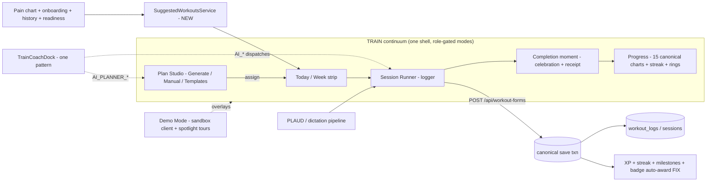

# SWAN WORKOUT OS — Fable Blueprint (Unified Planner + Logger + Coach + Charts + Demo Mode)
**Date:** 2026-07-29 · **Author:** Fable 5 (Final Decider) · **Owner:** Sean Swan
**Ground truth:** audited against `origin/main` @ `c39adab88` in worktree `C:/tmp/ss-workout-os-audit-20260729` by 4 parallel read-only agents (frontend surfaces / backend spine / charts truth / guidance+IA). The wip tree this doc sits on is 1,217 commits behind main — **no finding below is from the stale tree.**
**Doctrine alignment:** subordinate to `SWAN-CORTEX-UNIFIED-BRAIN-MASTER-DIRECTIVE-2026-07-12.md` (RATIFIED, on main) — one brain, many composers; deterministic safety first; trainer indispensability. This blueprint is the **surface half** of that program (its §12 site-wide integration + the consolidation prerequisite), NOT a rival plan.
**Review:** Kimi K3 one-shot review authorized by Sean 2026-07-29 (verdict appended §11).

---

## §0 — RECONSTRUCTED PROMPT (Sean's ask, amplified)

Sean's raw ask: the workout logger is confusing (coloring + layout); planner and logger are split up and hard to find; merge planner + builder + logger into ONE easy super-app; keep/improve every existing capability (never remove without a better replacement); Swan Coach must be able to do what Sean asks (log workouts, remind clients, update the client-dashboard suggested-workouts section fed by pain chart + onboarding + logged workouts); every useful piece of client data must reach charts that make sense; add an interactive Demo Mode replacing Teach Me as an upgrade; use Swan design brain + Mobbin; Kimi + Fable review the layout decision.

**Gaps the reconstruction adds (each verified against repo/doctrine):**
1. **Consolidation is the real project.** There are today **3 plan-authoring UIs, 2 trainer logger entry points, 4 logger route/label pairs, and 2 dormant name-colliding workout stacks**. The confusion is structural. The Cortex directive already names duplicate-surface consolidation a prerequisite — this blueprint executes it for the workout surfaces.
2. **Trainer indispensability is a hard boundary** (Sean 2026-07-11, Cortex §2.5): clients read + do, never decide. The unified app must NOT give clients plan-authoring; "one super app" means one per-role continuum, not one identical screen for everyone.
3. **Coach safety parity before Coach power.** The ratified Cortex P0 slice (§5.4) proves coach chat can stage exercises bypassing pain/safety gates. Making Coach *more* able to drive the app must ride on closing that bypass, not precede it.
4. **Suggested Workouts does not exist** — zero backend matches. It's a from-scratch engine (ingredients exist: `ClientPainEntry`, `MovementAnalysis`, onboarding coverage, `swanCoachCortexService` readiness, logged history). `/api/recommendations` is e-commerce — a naming trap to avoid.
5. **Charts are mostly truthful already** (15-endpoint canonical registry, real tables, honest failures). The real gaps are *unsurfaced wins*: celebration, receipts, streak chart, badge auto-award, a dead rings endpoint.
6. **Demo Mode must absorb, not orphan, two prior investments:** the live Teach Me system (~1,961 lines of per-route refiner copy + toggle infra) and the locked Swan Guide plan (grill-complete 2026-07-16, stranded on branch `claude/swan-guide-20260716`: checklist hub + spotlight tours + `data-tour` anchors + real-action checkmarks + XP/Pathfinder badge).
7. **Demo needs a sandbox, not just tours.** "Interactive" means doing the real flows against fake data. Reusable precedent exists: `backend/seeders/20260329-seed-qabot-workout-data.mjs` (45 forms / 90 days, populates every chart) + the 55yo test-client persona seeder + `LaunchControlPage` feature-flag infra.
8. **Voice/dictation lanes already exist and must be preserved as-is:** logger `AI_*` + planner `AI_PLANNER_*` FRONTEND_DISPATCH families, `surfaceIntentRemap`, PLAUD/upload pipeline (transcribe → `redactTranscriptPII` → parse → reviewable draft → canonical save). The unification reuses these contracts unchanged.
9. **Design ceiling:** Mobbin evidence (Ladder, Bevel, Runna, Future, Gymshark) converges on ONE training continuum — Week plan → Today hero → active logging → completion → progress — one accent for the active set, coach presence embedded in the plan. That is the layout thesis.
10. **Nothing removed without replacement** (Sean's law): every legacy surface gets an absorbed-into target + redirect; Rule 34 gates any deletion.

---

## §1 — VERIFIED CURRENT STATE (compressed; full agent reports in session transcript)

### 1.1 Frontend surfaces (all `[VERIFIED]` on main @ c39adab88)
| Surface | File | Status |
|---|---|---|
| Client logger | `components/WorkoutLogger/WorkoutLogger.tsx` (866 ln + ~50 co-located files) | **CANONICAL** — dictation strip (component present; **role-gated to admin/trainer users today** per the 2026-07-15 hostile-review fix), coach terminal, NASM rolodex, 44px contract-tested |
| Trainer logger | `TrainerDashboard/WorkoutLogging/EnhancedWorkoutLogger.tsx` (159 ln) | **COMPETING** — no dictation, no coach dock; route has NO nav link; sidebar "Log Workout" goes to `clients?intent=log_workout` instead |
| Admin loggers | `/dashboard/admin/log-workout` (redirect), `/dashboard/admin/log-my-workout` | **URL-only — zero sidebar entries** |
| Planner | `DashBoard/Pages/admin-workout-planner/WorkoutPlannerPage.tsx` (298 ln, ~14 hooks, ~35 style files) | **CANONICAL** (admin+trainer) — has `WorkoutPlannerCoachDock` |
| Builder #2 | `TrainerWorkoutForgePage.tsx` (285 ln, "Build Plan" sidebar) | **COMPETING** — manual draft + `WorkoutCopilotPanel` (a 3rd copilot pattern) |
| Builder #3 | `WorkoutManagement/WorkoutPlanBuilder.tsx` (454 ln, 4-step wizard) | **COMPETING** — buried in Client Hub "Architect" training sub-tab |
| Dormant stack | `pages/workout/WorkoutDashboard.tsx` + `pages/workout/components/WorkoutPlanner.tsx` (name-collides!) at `/workout`; `components/WorkoutBuilder/WorkoutBuilderPage.tsx` at `/workout-builder` | **DORMANT** — mounted, zero nav links |
| Dead code | `WorkoutOutletWrapper.tsx` (0 importers), `MobileWorkoutLogger.tsx` (38-ln self-declared placeholder) | **DEAD** |
| Styling | 0 naked hex anywhere (good); BUT gold accent locally re-declared across ~9 planner style files; 3 different copilot UI patterns | root of "coloring is confusing" |

### 1.2 Backend spine
- **Canonical write:** `POST /api/workout-forms` (`dailyWorkoutFormRoutes.mjs`, **2,581 lines**, one mega-transaction: WorkoutLog rows + DailyWorkoutForm + session billing + plan advance + completion receipt + PR detection + XP/streak/milestones).
- **Two sets-storage shapes:** flat `WorkoutLog` (canonical save) vs normalized `WorkoutExercise`+`Set` (legacy writers). Canonical chart registry reads `workout_logs`/`workout_sessions` — honest; the legacy 13-chart path reads `DailyWorkoutForm.formData` — second read path, drift-prone.
- **Plans:** `WorkoutPlan.planData` JSONB is the live shape (UUID ids, `normalizeWorkoutPlanId` mandatory); `WorkoutPlanDay`/`WorkoutPlanDayExercise` normalized tables exist **unwired**.
- **Coach lane:** 134 registered commands; `log_workout` writes via canonical save; logger `AI_*` + planner `AI_PLANNER_*` dispatch families; `surfaceIntentRemap.mjs` disambiguates twin commands; proposal engine human-gated. `notify_client` (type `reminder`) exists for client reminders.
- **Voice:** upload → transcribe → `redactTranscriptPII` (deterministic, pre-LLM) → parse → reviewable draft → canonical save. Client/user strictly self-scope.
- **Known Cortex P0 defects touching this domain** (ratified directive §1.2): 7-day pain window drops chronic pain from generation context; coach chat `AI_ADD_EXERCISE` bypasses pain/quality gates; advisory (non-blocking) safety gate on deterministic generation; TrainerPermissions drift fail-open on who may log.
- **Suggested workouts: nothing exists.** Exercise-level recommendation exists (`GET /api/workout/recommendations/:userId`); full-session suggestion service does not.

### 1.3 Charts truth
- **Canonical:** 15 `chart-*` endpoints (`chartDataController.mjs`), real tables, errors surface as 500s not fake zeros, client + trainer/admin routed. Victory-only confirmed repo-wide.
- **Gaps:** `PostWorkoutCelebration.tsx` fully built, **0 mounts**; completion receipt computed server-side, **0 frontend consumers**; **badges can never auto-award** (write path exists in `gamificationController.mjs:1643` but `awardWorkoutXP.mjs` never calls it); streak computed but **not charted**; `ring-weekly-source` (Apex Ascension Rings) endpoint fully built, **0 frontend refs**; 5 deprecated endpoints empty-by-design; legacy vs canonical dual read paths in trainer/admin UI.

### 1.4 Guidance / demo / nav
- Teach Me (`DashboardTeachMeGuide` + `TeachMeToggle`): **live, maintained**, ~1,961 ln refiner copy + 724-ln lesson library (`content/teach-me/`), localStorage seen-state. Per-exercise `getExerciseTeachMe` with content-honesty guards.
- Swan Guide locked decisions (recovered from `C:/tmp/ss-swan-guide-20260716`): checklist hub + spotlight tours, in-house engine (no tour lib), `data-tour` anchor registry + CI test, checkmark = real action done, soft first-run offer, XP + Pathfinder badge (server-validated idempotent), warm-coach voice with banned-jargon list, small state-flag set, per-step Ask-Coach escape hatch, label stays "Teach Me".
- **No tour lib / no data-tour anchors / no MSW / no Storybook on main.** Feature-flag infra exists (`WORKSPACE_CONFIG.featureKey` + LaunchControlPage). Demo-data seeders exist (qabot 90-day dataset; risk-persona client).
- Nav registry: `config/canonical-surface-names.ts` + `config/dashboard-tabs.ts` (admin) + role sidebars. Client IA is already clean (Log Workout 1-click, `?loadPlan=today`).

---

## §2 — PRODUCT DECISIONS (non-negotiable for this program)

1. **ONE training continuum per role, one brand: "Train".** Client: Today → Log → My Plan → Progress. Trainer/Admin: Client → Plan Studio → Log → Review/Progress. The continuum is one app shell with modes — not siloed pages scattered across sidebar sections.
2. **One authoring surface.** The three plan-authoring UIs merge into **Plan Studio** (base = canonical `WorkoutPlannerPage` architecture: hook-per-concern, coach dock) with three explicit modes: **Generate** (deterministic builder + LLM explain), **Manual** (Forge's drag/manual value), **Templates/Wizard** (PlanBuilder's guided value). Forge + PlanBuilder are absorbed, then retired behind redirects (Rule 34-gated).
3. **One logger component, role-parameterized.** Client `WorkoutLogger` is the base (it already has dictation, coach terminal, last-weight chips, touch-target contracts). Trainer/admin logging = same component with client-context header + trainer affordances. `EnhancedWorkoutLogger` absorbed → retired.
4. **One Coach dock pattern.** `LoggerDictationStrip`, `WorkoutPlannerCoachDock`, `WorkoutCopilotPanel` reconcile into one `TrainCoachDock` component family (surface prop drives command family + `routeContext.surface` token; existing dispatch contracts unchanged).
5. **One accent semantic.** A single shared token module defines the Train color system: ONE active-accent (Ice Wing) for "what you're doing now," Gilded Fern reserved for PRs/milestones only, status colors (planned/done/skipped) defined once. Kills the 9-file gold sprawl. Mobbin evidence: the calm one-accent set-row is the genre standard.
6. **Trainer indispensability preserved:** clients never see Plan Studio; client plan views stay read+do; plan switching/edits remain trainer/admin-only. Coach explains to clients, proposes to trainers.
7. **Deterministic safety first:** no new Coach power lands before the chat-bypass close (Cortex §5.4) is in place for the surfaces this program touches.
8. **Data truth:** every new visual reads real logged data; demo data appears ONLY inside Demo Mode's sandbox, visibly labeled.
9. **Nothing removed without a better replacement:** every retired surface maps to its absorbing mode + a redirect shim; deletion only after grep-verified zero-consumer checks and Sean's Phase-2 cleanup approval.
10. **All new work behind default-off feature flags**; production stays green; batch-push cadence; ≤300-line files; styled-components + `var(--token, #fallback)`; Victory only.

---

## §3 — TARGET ARCHITECTURE



### 3.1 Route + nav consolidation (S1)
| Today | Becomes |
|---|---|
| Client: `log-workout`, `workouts`, `progress` scattered | TRAIN section: Today (default), My Workouts, Progress — Log stays 1-click, `?loadPlan=today` default preserved |
| Trainer: "Build Plan" + "Workout Planner" + "Log Workout"(intent) + orphaned `/log-workout` | TRAIN section: Plan Studio, Log Workout (real route, client-picker header), Client Progress |
| Admin: planner + build-plan; NO logger nav | Same TRAIN section as trainer + "Log My Workout" (owner personal logger) entry |
| `/workout`, `/workout-builder`, forge/wizard routes | redirect shims → absorbing mode (pattern already proven: `AdminLogWorkoutRedirect` et al.) |

### 3.2 Session Runner (logger refactor) — wireframes
Desktop (client, ≥1280px):
```
┌────────────────────────────────────────────────────────────────┐
│ TODAY · Wk3 D2 — Push Day        ⏱ 24:10   [Coach ▾] [Finish] │
├───────────────────────────────┬────────────────────────────────┤
│ ▸ Goblet Squat      3×12      │  NOW: SET 2 OF 3               │
│   ✓ 12 @ 95   ✓ 12 @ 95      │  reps [ 12 ]  lb [ 95 ]        │
│   ○ last: 12 @ 90 (chip)     │  RPE  [ 7 ]   [log set ✓]      │
│ ▹ Bench Press       4×10      │  rest 0:45  [skip] [+15s]      │
│ ▹ Row               3×12      │  pain check-in: [none ▾]       │
├───────────────────────────────┴────────────────────────────────┤
│ 🎙 dictation strip: "bench set two, ninety-five, eleven reps"  │
└────────────────────────────────────────────────────────────────┘
```
Mobile (≤414px): exercise list collapses to a swipeable card stack; NOW panel is the card; dictation strip pinned above keyboard; one accent (Ice Wing) marks the active set row only; completed = neutral check; keypad ≥44px (existing contracts kept).

### 3.3 Plan Studio (authoring merge) — wireframe (trainer, desktop)
```
┌─ PLAN STUDIO · client #84 ────────────────── [Generate|Manual|Templates] ┐
│ Week strip:  W1  W2 [W3] W4        phase: Hypertrophy (OPT P3)          │
│ ┌ Mon ─────┐ ┌ Wed ─────┐ ┌ Fri ─────┐   Rolodex / candidates          │
│ │ Push 6ex │ │ Pull 5ex │ │ Legs 6ex │   [search + NASM filters]       │
│ └──────────┘ └──────────┘ └──────────┘   drag → day                     │
│ Coach dock: "swap leg press for box squat" → ✓ swapped (undo)          │
│ [Save plan]  [Assign + notify client]  revision r14 · receipts intact  │
└──────────────────────────────────────────────────────────────────────────┘
```
Save/assign stays human-only (AI drafts, never persists — existing contract).

### 3.4 API/data contracts (unchanged vs new)
| Contract | Status |
|---|---|
| `POST /api/workout-forms` canonical save (+ receipts, XP, plan advance) | UNCHANGED (S6 splits the 2,581-ln file internally, behavior-locked by existing tests) |
| `GET /api/workout-logs/last-weights`, `/upload`, `/history-preview` | UNCHANGED |
| `AI_*`, `AI_PLANNER_*`, `surfaceIntentRemap`, proposal engine | UNCHANGED (S4 reuses; chat-bypass close per Cortex §5.4) |
| Plan CRUD `workout-plans` (+ lifecycle, PDF, backup/blend) | UNCHANGED |
| **NEW** `GET /api/workouts/suggested/:userId` | S7 — deterministic composer: active pain (ALL active, no 7-day window — aligns w/ Cortex §5.1) + OHSA compensations + onboarding coverage + last-N logged sessions + readiness → ranked next-session suggestions with `rationale[]`; client-safe copy; Rule 8 (IDs only) |
| **NEW** demo sandbox flag + seeded demo client (reuses qabot seeder shape) | S8; demo user excluded from billing/real notifications (reuse `isNonDeductingClientAccount` classifier) |

---

## §4 — DESIGN LANGUAGE (via swan-design-router at build time)

- **Reference set (Mobbin):** Ladder (dense dark set-table, one yellow accent → ours = Ice Wing), Bevel (calm set rows, previous-workout ghosts), Runna (week strip + coach note embedded + "Record" hero CTA), Future (drag-to-move days, coach presence), Gymshark (filled-row completed sets). SwanStudios executes these in Crystalline Swan: Obsidian/Carbon surfaces, Frost White text, Ice Wing active accent, Wing Purple for Coach affordances, Gilded Fern ONLY for PR/milestone moments.
- **New shared module `frontend/src/styles/train-tokens.ts`:** semantic tokens (`--train-active`, `--train-done`, `--train-planned`, `--train-pr`, `--train-coach`) with Crystalline fallbacks; all Train surfaces import from it; contract test asserts no Train style file declares its own gold/purple locally.
- Dark-first, reduced-motion variants, 44px targets (keep existing touchTarget contract tests), responsive matrix incl. 320/414/768/1440/2560×1440.
- Ideation gate: Plan Studio + Session Runner are working surfaces → Mobbin-lane concepts (2-3 directions) at build time; no scroll-film maximalism here.

---

## §5 — SWAN COACH INTEGRATION (hive-mind parity)

1. **One dock, three surfaces:** `TrainCoachDock` renders in Runner (logger commands), Studio (planner commands), Today (read commands + reminders). Existing command registry + `routeContext.surface` allowlist unchanged.
2. **Close the chat bypass first** (Cortex §5.4, ratified): `AI_ADD_EXERCISE`-class dispatches resolve exerciseName → registry and pass pain/quality eligibility server-side before staging; ineligible → coach explains + proposes alternatives. This slice coordinates with (does not duplicate) Cortex Phase 1 — if Cortex P1 lands first, S4 consumes it.
3. **Reminders:** "remind client 84 to log" → existing `notify_client` (type `reminder`); Demo Mode and Today surface expose the same action for trainers (1 tap from stale-client indicators).
4. **Suggested-workouts commands:** new read command `view_suggested_workout` + trainer-approve flow to convert a suggestion into a plan day (proposal-engine gated, never auto-writes).
5. **Dictation parity:** trainer/admin get the dictation strip in the unified logger (client gating rules preserved: dictate is admin/trainer-gated today — decision open in §10 whether clients get voice self-log).

---

## §6 — CHARTS & PROGRESS TRUTH PACK

1. Wire **badge auto-award** into `awardWorkoutXP` (write path exists; idempotency keys mandatory — gamification gotcha).
2. Mount **PostWorkoutCelebration** as the Session Runner completion moment (it's built; dormant) + surface the server-computed **completion receipt** (sets/volume/PRs/credits) on the same screen. This is the shareable-milestone hook of the Product Core Loop.
3. **Streak trend chart** added to the canonical registry (data already computed at save time).
4. **Rings decision:** `ring-weekly-source` endpoint is built + dead — either mount an Apex Rings widget on Today (recommended: it's the daily-glance visual) or delete the endpoint (Rule 34). Recommendation: mount.
5. **Single read path:** trainer/admin legacy `ClientProgressCharts` (13-chart, `DailyWorkoutForm.formData`) migrates to the canonical 15-chart grid (`AdminProgressChartsGrid` already exists and mirrors it) → legacy path retired behind grep-verified zero-consumer check.
6. Sweep for stale callers of the 5 deprecated empty-by-design endpoints.
7. Est-1RM multi-lift toggle = product decision (§10), not silent change — single-lift honesty is deliberate.

---

## §7 — SUGGESTED WORKOUTS ENGINE (client dashboard section — currently nonexistent)
*(Hardened per Kimi findings 3.1-3.7, Fable-accepted.)*

**Governance first: this is a Cortex COMPOSER, not a second brain.** It consumes the shared context spine (`clientIntelligenceService`) and the same eligibility/safety gates as the workout builder — it never implements its own pain logic. Registered in the Cortex adapter family (directive §6).

- **Pain→exclusion mapping is NOT new logic:** it reuses the builder's existing pain-exclusion filter fed by `clientIntelligenceService` exclusions and the ONE region→muscle map (Cortex Phase-2 consolidation target). The engine calls the shared eligibility function; if that function is wrong, it's wrong once, fixed once.
- **Precondition micro-slice S7.0 (pulled INTO this program unless Cortex P1 ships it first):** the pain-window fix — ALL `isActive` pain entries load regardless of age (Cortex §5.1). S7 must not ship on the known-corrupt 7-day-window input. Coordinate via review-queue; whoever lands it first, S7 consumes it.
- **Progression anchoring:** suggestions derive loads/volume from the client's actual last-N per-exercise history (`workout_logs` + `/last-weights` data), capped by readiness — Yellow/Red readiness regresses (drops intensity method, de-scores plyo/power — the existing Cortex readiness caps). No load suggestions without history for that movement (offer the movement, not a number).
- **Inputs:** ALL active pain entries; OHSA/MovementProfile compensations; onboarding coverage + goals; last-N logged sessions (recency + per-muscle-group weekly balance + frequency cap); readiness; assigned-plan state; **session-duration availability, equipment access, and stated dislikes** (from onboarding where present; degrade gracefully where absent).
- **Cold start (primary value case):** no history + no plan → suggestions compose from onboarding goals + baseline measurements + the conservative starter templates (`nasmTemplateRegistry`), always tagged "starting point — your coach will refine," and every cold-start suggestion lands in the trainer's review queue rather than silently shipping to the client. New-client output quality is a named test fixture (the 55yo risk-persona seeder).
- **Invalidation is safety, not perf:** suggestions are computed on read (no cache) OR, if caching is ever added, a new pain entry / readiness change invalidates synchronously in the same transaction. v1: compute on read.
- Output: ranked 1-3 suggestions `{title, focus, whyRationale[], exercises[] from eligible registry pool, safetyFlags[]}` — client copy is read+do; trainer copy is propose+approve (proposal-engine gated).
- Hard rules: assigned plan wins (suggestions fill gap days only); Rule 8 IDs-only; deterministic core fully testable without LLM. ~~Mode B/C conditionals~~ dropped until those Cortex phases exist (speculative generality — Kimi 3.7 accepted).
- **Automated stale-client nudges ride this slice (S7b):** no-log-in-N-days → client nudge + trainer digest line, via existing `notify_client` reminder type; consent- and cadence-gated (proactivity budget, quiet hours per Cortex §13.5.4); N configurable per client; generic outbound envelopes (no pain/body detail — Cortex §13.5.8). This is the automation half of Sean's "remind clients" ask; 1-tap manual reminders alone are not the money feature.
- Surfaces: client Today card, client dashboard section, trainer client-detail panel, `view_suggested_workout` Coach command.

---

## §8 — DEMO MODE (interactive; absorbs Teach Me as an upgrade)

**Thesis:** Demo Mode = Swan Guide engine (locked 2026-07-16 decisions) + a seeded sandbox. Not a video, not a text panel — you DO the flow on fake data with a spotlight guiding you.

1. **Engine (from the stranded Swan Guide plan, decisions already locked):** in-house spotlight overlay + step cards, `data-tour` anchor registry + CI coverage test, checklist hub per section, checkmark = real action performed, soft first-run offer, per-step Ask-Coach escape hatch, server-persisted progress, idempotent XP + Pathfinder badge, warm-coach voice + banned-jargon list. Copy mined from the existing ~1,961 lines of refiner content (Phase-0 copy triage per the Swan Guide plan).
2. **Sandbox:** "Try it with a demo client" — a flagged demo client (qabot-shape seeder: 90 days of realistic logs so every chart renders) available to trainers/admin in Plan Studio + Runner, and a self-demo dataset for clients' first-run. Demo entities: excluded from billing/sessions/notifications (reuse non-deducting classifier), visually watermarked ("DEMO"), one-tap reset.
3. **Role journeys:** client (log a workout → see celebration → see chart move), trainer (build a plan in Studio → assign → log for demo client → review progress), admin (oversight + interventions). Each journey's final step is the user tapping the REAL control.
4. **Teach Me absorption path:** Demo Mode engine replaces the essay-panel body of `DashboardTeachMeGuide`; the header toggle + per-route entry points remain (label decision Sean's — locked decision said keep "Teach Me"; Sean's new ask says "Demo Mode"; recommend user-facing **"Show Me"/"Teach Me" stays on the toggle, launching interactive demos** — final naming in §10). Nothing deleted until the new engine covers the route (per-route migration checklist; leftover copy mined then archived).
   **Explicit carve-out (Kimi 4 accepted):** `getExerciseTeachMe` (per-exercise pedagogy with content-honesty guards) and the 724-line `content/teach-me/` lesson library are **exercise education, NOT UI onboarding** — they stay as-is, out of the absorption entirely. Only route-level guide panels are absorbed.
5. **Demo progress separation:** demo-play events are flagged and never conflate with real usage — checkmarks/XP for guide sections require the REAL action on real data (locked Swan Guide decision); sandbox actions complete the *tour step*, not the *skill checkmark*. Demo-client concurrency: one demo instance per trainer (per-user reset); global seed reset is admin-only.
6. Feature-flagged (`featureKey` infra), client+user dashboards first (locked audience order), trainer, then admin. **Build split (Kimi 4 partially accepted):** S9a = sandbox + watermark + billing/notification exclusion (the high-value 20%, cheap — seeder + classifier reuse); S9b = spotlight-tour engine + checklist hub + anchors (the Swan Guide build — real value but a multi-week build; ships after S1-S8 or when Sean prioritizes it). The anchor-maintenance tax (every UI change can break `data-tour` anchors; CI catches, humans fix) is acknowledged and budgeted into S9b's definition of done.

---

## §9 — NUMBERED SLICES (each independently shippable, flag-gated, worker-bot executable)

> Execution: per slice → `fable-blueprint-forge` package (exact files, signatures, copy, tests) at build time. Order revised after the Kimi review (§11) for true harm-reduction-per-hour. Every slice: canonical-surface receipt (Rule 26) → build → hostile dry-loop (Rule 73) → targeted tests + tsc + build gates → local commit (Rule 70). Rough sizing in brackets (solo-agent build days, Kimi finding 5.8 accepted).

- **S1 — Nav/IA truth (no feature change). [1-2d]** TRAIN section per role in sidebars/`dashboard-tabs.ts`; real trainer logger route linked; admin logger entries added; redirect shims for `/workout`, `/workout-builder`, forge/wizard URLs; `canonical-surface-names.ts` updated. **Also produces the tap-count baseline table** (manually measured: taps from landing → set logged, per role) so later "fewer taps" claims are falsifiable — no analytics infra needed (Kimi 5.3, accepted lightweight). *Accept:* every role reaches log/plan/progress in ≤2 clicks from landing; zero dead nav entries; route tests updated; dormant stacks unreachable-by-nav but redirect-mapped; baseline table in the slice receipt.
- **S2 — Train tokens + LOGGER visual calm-down only. [1-2d]** `train-tokens.ts` semantic module; restyle `WorkoutLogger` set rows/status colors to the one-accent semantic. Planner gold-sprawl kill MOVED to S8 (it dies with the merge — don't restyle what's being absorbed; Kimi 1.5 partially accepted). *Accept:* contract test proves no logger style file declares accent colors locally; visual QA (iteration at 320/414/1440; full Rule-24 matrix incl. 2560×1440 at slice close — house law, Kimi 6.5 rejected); zero functional diffs.
- **S3 — Session Runner UX + completion moment + resilience. [4-6d]** Today-first entry (week strip + hero card), NOW panel/card-stack per §3.2, last-weight chips, rest timer, inline pain check-in (capture only; feeds readiness later per Cortex §12). **Celebration + receipt land HERE** (Kimi 1.2 accepted — `PostWorkoutCelebration` mount + server-computed receipt surface; cheapest felt win, no stub-and-rework). **In-flight session persistence** (Kimi 5.1 accepted): probe current draft behavior first; guarantee refresh-safe local draft + resume, and failed-save retry with duplicate-guard (reuse the existing `clientRequestId` idempotency key on `WorkoutSession`). **Empty states designed** (Kimi 5.6): Today with no plan / no history / no suggestions each gets a real state, not a blank. *Accept:* tap count vs S1 baseline (concrete numbers, target ≥30% fewer for repeat-set logging); refresh mid-workout loses nothing (test); duplicate submit cannot double-write (test); mobile card stack clean at 320-414px; dictation + `AI_*` command tests green; plan→log 1 tap preserved; celebration renders on real save.
- **S4 — One logger for all roles + Coach dock unification (rescoped). [4-6d]** **GATE S4.0 — the billing/deduction matrix (Kimi 2.1, the money catch):** before any merge code, probe + document current deduction semantics per logging context — client self-log, trainer-for-client, admin-for-client, admin personal (`log-my-workout`) — across `session_deducted`, `sessionBillingPolicy`/`isNonDeductingClient`, and the canonical-save billing branch; matrix reviewed by Fable + Sean, THEN parameterization implements it explicitly. **GATE S4.1:** TrainerPermissions fail-open drift (who may log for whom) resolved or explicitly accepted-with-reason before role-parameterization ships. Then: role-parameterize `WorkoutLogger` (client-context header for trainer/admin); absorb `EnhancedWorkoutLogger` affordances (inventory = pre-build artifact, Fable-reviewed — NOT builder-discretion; Kimi 2.3 accepted); `TrainCoachDock` unifies the **logger + canonical planner docks only** — Forge's `WorkoutCopilotPanel` dies unmigrated with Forge in S8 (Kimi 1.3 accepted); dictation for trainer/admin logging paths; chat-bypass close lands here iff Cortex P1 hasn't shipped it (coordinate via review-queue). *Accept:* trainer logs for a client through the same component with billing behavior matching the approved matrix (tests per matrix row); `surfaceIntentRemap` twin-command tests green; bypass regression test (pain-excluded exercise refused with alternative) passes.
- **S5 — Charts truth pack (rescoped). [2-3d]** Badge auto-award wiring (idempotent keys — gamification gotcha); streak chart endpoint+card; legacy 13-chart trainer path → canonical grid (zero-consumer grep receipt before retirement); deprecated-endpoint caller sweep; **dual write-path ruling executed** (see §10.6 — freeze `WorkoutExercise`+`Set` as legacy-read-only, document, verify no new writers). Rings: NOT mounted here — §10 decision. *Accept:* logged workout auto-awards eligible badge exactly once (idempotency test); streak chart shows real data; legacy path retired with receipts; write-path ruling documented + regression test that canonical save is the only sets-writer on the live path.
- **S7.0 — Pain-window micro-fix [<1d]** (pulled in unless Cortex P1 lands first — Kimi 1.4 accepted; see §7).
- **S7 — Suggested Workouts composer + surfaces + S7b auto-nudges** (§7, hardened). **[5-8d]** *Accept:* deterministic tests (pain exclusion via shared eligibility, plan-wins, readiness caps, cold-start fixture on the risk-persona seeder); client Today card + dashboard section render real suggestions; Coach `view_suggested_workout` returns same payload; stale-client nudge fires on the configured threshold with generic envelope (test) and never without consent; zero PII in LLM phrasing calls.
- **S8 — Plan Studio merge. [6-10d]** Three authoring UIs → one Studio with **Generate + Manual** modes (Generate = the canonical planner's EXISTING generation surface — not net-new; Kimi 2.4 rejected on evidence) **+ template library inside Manual** with a guided "New plan" flow that preserves the wizard's step-validation spine, not just its screens (Kimi 2.5/6.4 accepted — no third "Templates mode"). Capability inventories for Forge + PlanBuilder = pre-build artifact, Fable-reviewed (Kimi 2.3). **In-flight draft migration specified:** Forge/wizard drafts inventoried; migrate-or-expire-with-notice, never silent loss (Kimi 2.6). Planner gold-sprawl token kill happens here. Redirects; retire old surfaces (Rule 34 pass). *Accept:* per-capability checklist demonstrably green; `AI_PLANNER_*` + sequencing/undo tests green; save/assign human-only preserved; revision/receipt contracts intact; draft-migration test.
- **S9a — Demo sandbox. [2-3d]** Seeded demo client (qabot-shape), watermark, billing/notification exclusion, per-trainer instance + admin-only global reset (§8). *Accept:* demo client cannot touch billing/notifications (tests); every chart renders on demo data; reset restores seed state.
- **S9b — Guide engine (Swan Guide build)** — spotlight tours + checklist hub + `data-tour` anchors + CI coverage; ships after S1-S8 or on Sean's explicit priority call. **[8-12d]** *Accept:* per the stranded Swan Guide plan's Phase-1 gates; anchor CI test; XP/badge idempotent server-validated; demo-play vs real-action separation tests.
- **S10 — Cleanup pass** (separate, Sean-approved per Rule 37/34): delete absorbed/dormant files after grep-verified zero-consumer receipts; `.gitignore`/docs updates; Rule 48 audit record for the program.
- **EVICTED — S6 canonical-save decomposition** (Kimi 1.1 accepted): zero user value, self-admittedly non-blocking; do it the first time `dailyWorkoutFormRoutes.mjs` genuinely blocks a change, as its own behavior-locked slice.

**Sequencing notes:** S1+S2 are the fast relief (≤4 days combined). S3-S5 deliver the felt "super app." S7 before S8 (Kimi's order accepted): suggested workouts + nudges are Sean's named asks and client-facing value; the authoring merge is trainer-side and bigger. Cortex P1 (safety) runs in parallel ownership — coordinated via review-queue, with S7.0/S4-bypass as the explicit handshake points.

---

## §10 — OPEN DECISIONS FOR SEAN (blocking only where marked)

1. **Naming:** user-facing label for the unified surface ("Train"?) and for Demo Mode ("Teach Me" stays per locked Swan Guide decision vs "Demo Mode" per new ask). Non-blocking for S1-S7; blocking for S9 copy.
2. **Client voice self-log:** ~~open~~ **RESOLVED §12.2 — gate stays (trainer/admin only) for v1**; reopen only on Sean's explicit ask.
3. **Rings:** ~~open~~ **RESOLVED §12.2 — mounted on Progress in slice C3** (Kimi's own independent plan flipped to mount; asset is built and on-vision).
4. **Est-1RM multi-lift toggle:** DEFERRED (Kimi 6.7 accepted) — single-lift honesty stands until you explicitly ask.
5. **Trainer "Log Workout" default:** land on client-picker (current intent flow) or last-logged client? (C0/C2 detail.)
6. **Dual sets write-path:** ~~open~~ **RESOLVED §12.2 — freeze normalized writes + historical read-adapter + reconciliation query (slice C5)**; full row migration stays a future slice.
7. **`WorkoutPlanDay*` tables:** wire (normalized future) or document-dormant (recommended for now).
8. **Billing matrix sign-off (BLOCKING S4):** the S4.0 deduction-semantics matrix (who logs → whether a session credit deducts) needs your explicit approval before the logger merge ships — it's the money path.
9. **Priority check:** Marketing Command Center is the standing #1 money focus; this program is large (~25-40 build-days total as sliced). Recommended: run S1-S2 now (≤4 days, daily-pain relief), schedule S3+ as the next major build lane. Your call on cadence.

---

## §11 — KIMI K3 REVIEW VERDICT + FABLE RULINGS (review ran 2026-07-29, ~$0.15)

Full review: `KIMI-WORKOUT-OS-REVIEW-2026-07-29.md`. One-shot, Sean-authorized. Fable (Final Decider) rulings:

**ACCEPTED and folded (the review materially improved the plan):**
- **2.1 Billing/deduction matrix** — the highest-value catch. Now GATE S4.0, Sean-sign-off blocking (§10.8).
- 1.1 S6 decomposition evicted (do-when-earned). · 1.2 Celebration/receipt into S3 (no stub-and-rework). · 1.3 Forge copilot dies unmigrated. · 1.4 S7.0 pain-window micro-fix pulled in; TrainerPermissions gate = S4.1. · 1.5 S2 narrowed to logger-only (planner restyle dies with the S8 merge).
- 3.1-3.7 Suggested engine hardened: declared a Cortex composer on shared eligibility (no second brain), progression anchoring, cold-start spec + fixture, compute-on-read invalidation, added inputs, B/C speculation dropped, S7b auto-nudges added (5.5).
- 2.3 Capability inventories = pre-build Fable-reviewed artifacts, not builder discretion. · 2.5/6.4 Templates mode → template library + guided flow preserving step-validation. · 2.6/5.9 draft migration specified. · 2.2 dictation wording corrected (§1.1) — it's role-gated by design, decision stays §10.2.
- 4 Demo Mode split S9a (sandbox now) / S9b (guide engine later); `getExerciseTeachMe` + lesson library explicitly carved OUT of absorption; demo-vs-real progress separation; anchor-tax acknowledged.
- 5.1 in-flight session persistence + failed-save/duplicate-guard into S3 (reusing `clientRequestId` idempotency). · 5.3 tap-count baseline table in S1 (lightweight, no analytics infra). · 5.4 write-path ruling (§10.6). · 5.6 empty states into S3. · 5.8 per-slice sizing added. · 6.7 est-1RM deferred fully.

**REJECTED with evidence:**
- **2.4 "Generate mode is net-new"** — false: the canonical `WorkoutPlannerPage` IS a generation surface today (AI generation + saved-plan vault, `planner_generate_workout` command, deterministic `workoutBuilderService` behind it). S8 consolidates existing generation; it does not invent it.
- **6.5 breakpoint cut** — Rule 24 (house law) mandates the full responsive matrix incl. 2560×1440; compromise: iteration at 3 widths, full matrix at slice close.
- **6.3 delete rings outright** — softened to a Sean decision at S3 (§10.3); the gamification lane is a standing product vision, not cosplay, but it doesn't block anything.
- **4 "cut the tour engine indefinitely"** — softened to S9b-deferred: the Swan Guide engine is Sean's own grill-locked plan and serves the B2B2C scale thesis, not just today's solo operation. Sandbox ships first either way.

**Net effect:** slice order rewritten (S1 → S2 → S3 → S4 → S5 → S7.0 → S7(+b) → S8 → S9a → [S9b] → S10; S6 evicted), one blocking money gate added, the safety engine grew a real spec, and four resilience foundations (persistence, duplicate-guard, empty states, metrics baseline) entered the plan before new surfaces get built on their absence.

---

# §12 — FINAL COMBINED PLAN (Fable blueprint × Kimi review × Kimi independent plan)

**Per Sean's directive 2026-07-29:** Kimi authored his own plan from a facts-only packet (`KIMI-WORKOUT-OS-INDEPENDENT-PLAN-2026-07-29.md`, second authorized call, ~$0.09); this section is the three-way synthesis and is now **THE build plan**. Sean granted full refactor approval; build starts from here.

## 12.1 Where all three plans agree (locked, no further debate)
One role-configured logger (`loggerContext` prop on `WorkoutLogger`; `EnhancedWorkoutLogger` dies after inventory) · one authoring surface on the canonical planner (Forge dies; wizard's guided value survives; ONE coach dock) · one "Workouts/Train" hub per role (Today / Plan / Progress tabs; Plan hidden from clients) · charts activation is the cheapest delight (celebration + receipt + streak + badge auto-award) · suggested engine is deterministic with a BLOCKING eligibility filter, readiness caps, per-suggestion reason strings, cold-start from onboarding+OHSA · Demo Mode adopts the grill-locked Swan Guide plan + demo persona seeders; Teach Me copy migrates, per-exercise education survives untouched · `planData` JSONB stays; `WorkoutPlanDay*` stays unwired · the 2,581-line save route is wrapped and golden-mastered, never rewritten · Kimi's 10-item not-build list adopted wholesale (no offline PWA, no realtime collab, no wearables, no design-system rebuild, no multi-staff tiering, no new LLM surfaces).

## 12.2 Divergences — Final Decider rulings
| Divergence | Ruling |
|---|---|
| Planner default mode (Kimi-plan: Guided/wizard default; Fable: power canvas + template library) | **Guided is the default for NEW plans; Power canvas one toggle away; per-user preference remembered.** Sean dogfoods both before Forge dies. |
| Dead-code timing (Kimi-plan: excise week 1; Fable: defer to cleanup pass) | **Excise early (C1)** — the four audit-verified dead/dormant surfaces only, grep receipts per file, git-recoverable, under Sean's blanket refactor approval. Everything else still waits for its replacement. |
| Rings (Kimi review: delete; Kimi plan: mount as top Progress card; Fable: Sean decides) | **Mount in C3** — when the same reviewer flips within a day, the asset is cheap, built, and on-vision; ship it and let usage decide. |
| LLM in suggestion phrasing (Fable: allowed; Kimi plan: zero-LLM) | **Zero-LLM v1.** Template reason strings from the firing rule. Cheaper, trustworthy, PII-immune; LLM phrasing can be added behind a flag later. |
| Suggestion tap behavior | **Kimi's mechanic adopted:** client tap loads the suggestion into THEIR logger as a session (read+do); trainer gets "Push to plan" pre-staging the planner form (human Save = the write). |
| Legacy normalized set-rows (Fable: freeze + document; Kimi plan: freeze + read-adapter + reconciliation) | **Kimi's fuller version:** freeze new normalized writes (regression test), read-adapter keeps historical rows visible, reconciliation query compares both stores per client BEFORE the legacy 13-chart path retires. |
| Billing matrix (only the Kimi REVIEW caught it; his own plan omitted it) | **Stands as a blocking gate** inside C2 — role-parameterized logging ships only against the Sean-approved deduction matrix. |
| Client dictation | **Keep the admin/trainer gate for v1** (deliberate prior decision + Kimi not-build #5). Sean can reopen it explicitly. |

## 12.3 THE COMBINED SLICE SEQUENCE (build order; each flag-gated, golden-master-protected)
| # | Slice | Contents | Size |
|---|---|---|---|
| **C0** | Hub shell + nav truth | Workouts/Train hub (tabs per role), sidebar entries incl. admin loggers, redirects, `canonical-surface-names` update, tap-count baseline table | S (2-3d) |
| **C1** | Dead-surface excision | `/workout` stack, `/workout-builder`, outlet wrapper, mobile placeholder — grep receipts each, git-recoverable | S (1-2d) |
| **C2** | Logger convergence | **Golden-master contract tests on `POST /api/workout-forms` FIRST** (billing, cursor, receipt, PR, XP); **billing/deduction matrix Sean-signed (GATE)**; TrainerPermissions gate check; `loggerContext` prop; trainer client-banner (+client-picker landing); retire `EnhancedWorkoutLogger` (reviewed inventory); 3-color set-state language (pending=dim Frost / active=Ice Wing / complete=Gilded Fern — gold's ONLY logger use; Wing Purple=Coach only) via `train-tokens.ts` + token contract test | M (4-6d) |
| **C3** | Completion + charts activation | `PostWorkoutCelebration` mount fed by the receipt, badge auto-award (idempotent), streak endpoint+card, **rings mounted on Progress**, deprecated-endpoint caller sweep | S (2-4d) |
| **C4** | Session Runner UX | Today-first entry (week strip + hero), NOW panel / mobile card stack, rest timer, last-weight chips, **in-flight persistence + refresh-safe draft + duplicate guard** (`clientRequestId`), **empty states**, inline pain check-in (capture only) | M (4-6d) |
| **C5** | Data convergence | Freeze normalized `WorkoutExercise`+`Set` writes (regression test), historical read-adapter, per-client reconciliation query, retire legacy 13-chart path (zero-consumer receipts) | M (~1wk) |
| **C6** | Suggested engine v1 + nudges | **C6.0 pain-window micro-fix precondition** (unless Cortex P1 shipped it); zero-LLM deterministic composer per §7 (Cortex-composer governance, blocking eligibility, readiness caps, reason strings, cold-start fixture on risk-persona seeder); client card→logger session; trainer Push-to-plan; `suggest_workout` command; **stale-client auto-nudges** (consent/cadence-gated, generic envelopes) | L (~2wk) |
| **C7** | Planner consolidation | Guided (wizard) default + Power canvas modes; Forge dies (capability inventory reviewed; drafts migrate-or-expire-with-notice); ONE coach dock; planner gold-sprawl token hoist; redirects | M-L (1.5-2wk) |
| **C8a** | Demo sandbox | Demo persona (90-day seeder + risk persona), watermark, billing/notification exclusion, per-trainer instance, admin global reset | S (2-3d) |
| **C8b** | Demo Mode engine | Port the stranded Swan Guide branch: spotlight tours + checklist hub + `data-tour` anchors + CI test; Teach Me copy → tour content; panels retire per-route after parity; demo-play ≠ real-action separation | L (1.5-2wk) |
| **C9** | Cleanup + Rule 48 program audit record | Remaining retirements w/ receipts; `.gitignore`/docs; program closeout | S |

**Standing rules for every slice:** one flag in flight at a time; production green before the next slice starts; canonical-surface receipt → build → hostile dry-loop (Rule 73) → targeted tests + tsc + build + Rule 42 audit → local commit; batch push per Rule 70; C2/C6 chat-bypass + safety handshakes coordinate with Cortex P1 via review-queue. Build happens in a fresh worktree off current `origin/main` — never on the stale wip tree.

**Total program: ~7-10 build-weeks.** C0-C3 (~2 weeks) end Sean's daily pain and light up the dead delights; C4-C6 deliver the felt super-app + the headline suggested-workouts ask; C7-C8 finish the consolidation and the Demo Mode upgrade.

---

# §13 — PRE-BUILD HOSTILE REVIEW ADDENDUM (2026-07-29, build branch `claude/workout-os-build-20260729` off `origin/main@14032c035`)

Sean-directed hostile pass on the §12 plan itself, receipts re-verified against CURRENT main (the §1 audit ran 1 commit earlier at c39adab88). Findings amend §12; where they conflict, §13 wins.

**HR-1 [MATERIAL — C3 rescoped].** The completion moment ALREADY EXISTS on main: `frontend/src/components/WorkoutLogger/handoff/` (PostSaveHandoff + CelebrationBurst + ProofChart + ShareProofButton + StreakGoalModule + NextBestActionCard + role gating + tests), imported at `WorkoutLogger.tsx:44` and mounted at `:811`, **dark behind `VITE_ENABLE_POST_SAVE_HANDOFF` (default OFF)**. §12-C3's "mount PostWorkoutCelebration" would build a SECOND celebration. C3 is now: (a) receipt on handoff completeness; (b) **light the handoff as the completion moment**; (c) classify `Celebrations/PostWorkoutCelebration.tsx` absorb-or-retire — no double celebration; (d) badge auto-award; (e) streak chart; (f) rings mount; (g) deprecated-endpoint sweep.

**HR-2 [gotcha + ruling].** The handoff flag is a build-time Vite env var (CLAUDE.md gotcha — not runtime-flippable). Sean's directive explicitly includes "celebration/streak/badges/rings turned on," so C3 flips the code default to ON with the env var inverted into a kill switch (`VITE_ENABLE_POST_SAVE_HANDOFF=false` disables). Recorded for the batch report.

**HR-3 [C1 correction].** `WorkoutBuilderPage` carries 3 co-located test files, and `WorkoutLogger/CorrectiveRecommendationsPanel.styleExtraction.test.ts` references the WorkoutBuilder path — the excision receipt must classify that cross-reference and remove/update tests with the surface, not leave orphaned suites.

**HR-4 [dependencies SATISFIED].** The Cortex P1 safety handshakes §12 planned around have ALREADY SHIPPED on main: `coachDispatchEligibilityService.mjs` exists with `SAFETY_REVIEW_REQUIRED`/`PAIN_EXCLUDED` blocking parity; no 7-day pain-window remnants in pain queries. C2/C4/C6 handshakes downgrade from "build/coordinate" to "verify + regression-lock." C6.0 is LIKELY already satisfied — verify with a concrete test at C6 start.

**HR-5 [C2 gate vs non-stop ruling].** The billing-matrix gate (§10.8) requires Sean sign-off; Sean directed non-stop build. Ruling: C2 ships **behavior-PRESERVING** parameterization only — golden-master tests lock current deduction semantics per logging context BEFORE refactor; the matrix doc records observed truth for Sean's async sign-off; **zero deduction-semantic changes in this batch**. Any semantics Sean wants changed after reading the matrix = follow-up slice. Gate honored by preservation + documentation.

**HR-6 [Rule 4].** `WorkoutLogger.tsx` is 866 lines (already over cap). C2 must be net-neutral-or-better on that file via forced extractions only (role banner, context plumbing) — no wholesale rewrite, no growth.

**HR-7 [defaults adopted, Sean can override].** Hub user-facing label = **"Workouts"** (copy-only, reversible). Trainer "Log Workout" default = client-picker flow (current intent behavior). Both flagged in the batch report.

**HR-8 [receipt drift].** Badge write path on current main is `backend/services/badgeService.mjs` (+ `awardWorkoutXP.mjs` / `workoutXpAwardStep.mjs` confirmed badge-free — the auto-award gap is real); the §6.1 `gamificationController.mjs:1643` citation is stale. `ring-weekly-source` zero-frontend-refs RE-CONFIRMED on current main.

**HR-9 [C6 hardening].** Coach pain readers just suffered table-name drift fixed on main (`093072b11`: `"PainEntries"`→`client_pain_entries`). The C6 composer MUST read pain via the `ClientPainEntry` model — no raw SQL — to be immune to the drift class fixed the day before this build started.

**HR-10 [process].** Codex launch-core findings (same surfaces) not yet posted; folded at the all-slices dry-loop stage per lane note. Playwright MCP browser QA avoided for authenticated flows (SWA-94 credential-autofill hazard); local vitest/build gates + component tests carry verification.

**HR-11 [C0 ruling].** The "hub shell with tabs" is DEFERRED to C4 (Today surface) — an empty hub today would create a competing nav layer, the very disease this program cures. C0 executed as contract-safe nav truth inside three PINNED product decisions discovered in contract tests (admin client-logging owned by Client Hub; trainer intent-flow Log Workout; client first-cluster already the continuum). See WORKOUT-OS-C0-RECEIPT.

**HR-12 [C2 rescope — the merge already happened].** `EnhancedWorkoutLogger` is a thin client-resolution WRAPPER over the canonical `WorkoutLogger` (view.tsx:12,131); `AdminPersonalWorkoutLogger` is a 37-line `forceSelfMode` wrapper; all logging surfaces converge on ONE `useWorkoutSubmit → POST /api/workout-forms`. §12-C2's "retire EnhancedWorkoutLogger" is REVERSED with evidence — wrappers are glue, not competitors. C2 shipped the set-state calm-down (train-tokens + 3-state row language + contract test) and the billing-matrix gate artifact (`WORKOUT-OS-C2-BILLING-MATRIX-2026-07-29.md`) with two Sean decisions pending: owner-personal-logger credit burn (§3) and TrainerPermissions schema repair timing (SWA-87, accepted-with-reason §4).

**HR-14 [C5 premise corrections, recon-receipted].** (a) The legacy `workout_exercises`/`sets` tables are **0 rows in prod** (repo-documented probe, `analyticsService.mjs:120-124`) — the "historical read-adapter" collapses to the existing `required:false` readers (already adapter-shaped); the reconciliation becomes a read-only deploy probe (`inspect-workout-set-store-drift.mjs`). (b) The "legacy 13-chart TRAINER path" premise was WRONG: `ClientProgressCharts` is mounted at ONE **client-role** route (`/progress/detailed`, Guardian-gated) — NOT zero-consumer, so §12-C5's own retirement gate fails; retirement DEFERRED pending a 13-vs-15 chart coverage audit (capability-preservation law). AdminProgressChartsGrid already replaced it on trainer/admin. (c) NEW scope gap found: trainer-mounted `EnhancedClientProgressView` reads the formData `/progress` sibling endpoint — single-read-path work item recorded for a follow-up slice. (d) Freeze enforced at `workoutService.mjs` (8 write sites on live-but-dormant routes; stale bundles could re-open drift) — not at frontend callers.

**HR-13 [golden-master truth].** Route-level supertest coverage EXISTS and is strong for billing/deduction + plan-cursor (`backend/__tests__/dailyWorkoutFormRoutes.*.test.mjs` — a location trap: they live in `__tests__`, not `tests/`). Verified gaps: completion receipt mocked-never-asserted, PR events never asserted in a 201 body, XP/streak stubbed out at route level. C3 (which touches receipt/PR/XP surfaces) must add those route-level assertions as its first move.
