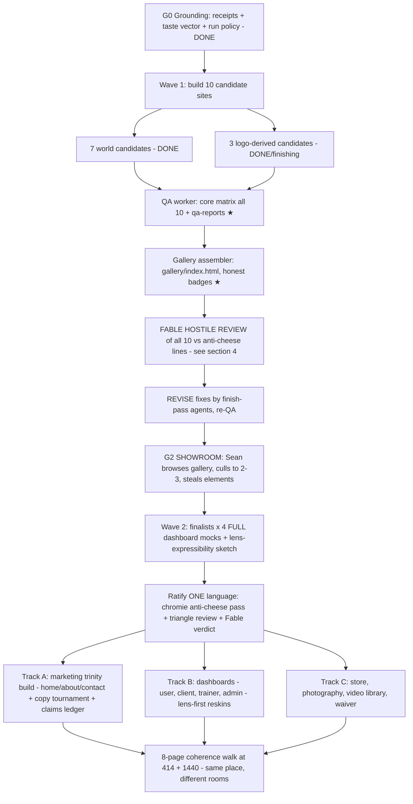

# FABLE CONTINUATION BLUEPRINT — Unified World Redesign (pick up here, build as Fable would)

- **Date:** 2026-07-16 ~17:00 PT · **Author:** Fable (claude-fable-5), Final Decider · **Status:** LIVE HANDOFF — written because tokens were running low mid-program
- **Purpose:** any competent AI (Claude tier, Codex, fresh Fable session) reads THIS FILE FIRST and continues the Unified World Redesign exactly as Fable would — same taste, same laws, same order. Every decision is already made; the builder makes none. Follows `fable-blueprint-forge` doctrine.
- **Read order for a fresh session:** this file → `SWAN-UNIFIED-WORLD-REDESIGN-MASTER-2026-07-16.md` (program law, same dir) → `MARKETING-TRINITY-REBUILD-HANDOFF-2026-07-16.md` (Track A detail, same dir) → the run's `BUILDER-BRIEF.md` + `ADDENDUM-LOGO-LANGUAGES.md` (work orders) → `docs/ai-workflow/brainstorms/unified-world-gallery-2026-07-16.md` (taste vector + run policy).

## 1. WHERE EVERYTHING LIVES (all inside ONE worktree — work here, never in the main checkout)

- **Worktree:** `<REPO>/.claude/worktrees/unified-world-gallery-2026-07-16` · branch `worktree-unified-world-gallery-2026-07-16` off origin/main `93b160cba`. NOT pushed. Sean gates any push.
- **Factory run (gitignored):** `<worktree>/experiments/world-factory/2026-07-16/unified-gallery-01/` — `run-manifest.json`, `BUILDER-BRIEF.md`, `ADDENDUM-LOGO-LANGUAGES.md`, `receipts/` (4 dashboard receipts — visual law for any dashboard mock), `assets/logo.png`, `sites/<id>/`, `qa/`, `gallery/`.
- **Doctrine (on this branch):** `docs/ai-workflow/design-brain/worlds.md` (+ techniques/psychology/experience-mode), `SWAN-CINEMATIC-DESIGN-SYSTEM.md`. worlds.md anti-cheese lines are BINDING per site.
- **Old wip tree** (`wip/comms-notifications-2026-07-05`, main checkout) still holds Sean's unrelated uncommitted WIP — do not touch it.

## 2. EXACT STATE SNAPSHOT (2026-07-16 16:57 PT — RE-INVENTORY ON ARRIVAL, it moves)

| Site (sites/<id>) | HTML | manifest | Meaning |
|---|---|---|---|
| glacier-cathedral | 62KB | **no** | finish pass was in flight (Wave 1c) |
| chrome-sovereign | 73KB | YES | COMPLETE |
| archive-editorial | 69KB | YES | COMPLETE |
| evergreen-dominion | 48KB | YES | COMPLETE |
| alpine-apex | 62KB | YES | COMPLETE |
| webb-deep-field | 50KB | YES | COMPLETE |
| cascade-vault | 59KB | **no** | finish/build in flight |
| logo-faceted-sigil | 52KB | YES | COMPLETE |
| logo-wing-current | 57KB | YES | COMPLETE |
| logo-sapphire-badge | 60KB | **no** | in flight |
| gallery/index.html | MISSING | — | pending QA + assembly |

Workflow `unified-gallery-wave1c` (run wf_02fbb92b-5fb) was executing: finish×2 → build×4 → QA(all 10) → gallery. It may have completed, died on usage limits, or died on an API outage — this program has been interrupted by BOTH twice. **Recovery pattern (proven): inventory the run dir on disk → sites with HTML but no manifest get a FINISH prompt (audit + 3 hostile passes + write manifest) → empty dirs get a FULL build → then QA worker → then gallery assembler.** The finish/build/QA/gallery prompt texts are in the workflow scripts under the session's `workflows/scripts/` dir — or reconstruct from BUILDER-BRIEF.md; the brief is the contract, the prompts are thin wrappers naming the site + steps.

## 3. PROGRAM FLOWCHART (where we are: ★)

Track laws (full text in the master doc §2/§7): Law A everywhere (world = setting, Crystalline Swan = ALL chrome, Dual-Button Glow); dashboards M0–M3 + calm zones + function preservation; store checkout + waiver flow byte-identical behavior (money-path tests gate); Trinity doc's copy rules + claims-vs-reality audit are Track A's core; batch-push once per track (Rule 70); factory output NEVER self-promotes to production (new receipts + Sean approval + normal gates required).

## 4. FABLE'S GALLERY REVIEW PROTOCOL (do this before showing Sean — this is the "as Fable would" core)

Open every site in a real browser at 1440 and 414. Judge each against ITS OWN doctrine, hostile-first:

1. **Anti-cheese check (kill criterion #1):** worlds.md names each world's tacky failure. Glacier = frosted-glass-everywhere; Evergreen = pine-silhouette cabin decor; Cascade = theme-park ride; Alpine = motivational-poster sludge; Webb = dishonest cosmic wallpaper; Chrome Sovereign = rented-penthouse stock luxury; Archive = boring-not-restrained; Faceted Sigil = 2015 low-poly wallpaper; Wing Current = corporate swooshes; Sapphire Badge = crypto-coin medallion. A site exhibiting its failure mode = REVISE with the specific fix named.
2. **Signature-move test:** can you describe the site's one decisive move from memory an hour later? No move, or five competing moves = REVISE ("subtract until one dominates").
3. **Lens strip = coherence proof:** the 4 dashboard panels must be layout-faithful to `receipts/` (user 3-col CreatorShell, client mint-navy embedded, trainer Observatory, admin bento with priority order), world at a whisper, chrome Crystalline, numbers monospace + SAMPLE-labeled, perfectly readable. A gorgeous hero with a sloppy strip FAILS the mission — the strip is why this gallery exists.
4. **Law A sweep:** any non-Crystalline chrome color, any `#00FFFF`/`#7851A9`, any recolored/distorted logo = REVISE, no exceptions.
5. **Copy sweep:** "26+ years" only; NASM-protocol (never "certified"); Swan Coach (never user-facing "AI"); no yoga/meditation; SAMPLE labels on illustrative numbers; benevolent tone, no named-company attacks, no politics.
6. **Craft floor:** one h1; Join CTA unmistakable; no horizontal overflow 414/1440; reduced-motion tells the full story; semantic story readable with JS off.
Fable's bar: schema-compliance is not taste. If a site is *fine*, it's REVISE — every one of the 10 must have a moment Sean will remember.

## 5. G2 SHOWROOM (Sean's review — run as a grill-me capture)

Hand Sean the gallery path: `<run>/gallery/index.html` (open in browser; everything is local). Capture per candidate, one question at a time, appending to `docs/ai-workflow/brainstorms/unified-world-gallery-2026-07-16.md` §4: keep / kill / steal-this-element + WHY (the why is the taste data). Expected output: 2–3 finalists (hybrids legal — "world X with candidate Y's cards" becomes a Wave-2 hybrid entry). Then Wave 2 per master doc §6: finalists × 4 FULL dashboard mocks, calm-zone proof, lens-expressibility sketch (what's a `RecipeV2` today vs chrome/world-layer code vs lens extension).

## 6. OPEN SEAN DECISIONS (carry them; don't re-ask what's answered)

ANSWERED: Wave A ✓ · roster ✓ (+3 logo candidates) ✓ · spend ✓ · M3-not-M4 ✓ · Track C scope + order ✓ · "you drive" standing delegation ✓.
OPEN (needed at Track A copy phase, not before): real stats values (clients transformed / satisfaction % / sessions / lbs) · testimonials real-vs-illustrative (Fable recommends real-only) · 24h response promise keep/soften · "AI" allowed in SEO meta only (recommend yes) · GlassCard-vs-SheenCard marketing standard (recommend GlassCard).

## 7. HOW FABLE BUILDS (the taste contract — binding on any successor)

1. **One decisive move per surface, subtraction before addition.** If removing an effect doesn't weaken the page, remove it.
2. **Atmosphere never interferes with reading.** Data, money, legal = calm. The world whispers in every room and only sings on marketing/showcase surfaces.
3. **Honesty is a design element:** SAMPLE labels, UNVERIFIED badges, honest empty states, no invented numbers, no hidden failures in galleries or manifests.
4. **The laws outrank beauty:** Law A, M-caps, contract tests (trainer responsive contract, admin priority order), 44px, 4.5:1, reduced-motion story, ≤300-line files, `css`` ` helper, `var(--token, #fallback)`.
5. **Receipts before code, hostile pass before "done," narrow claims** (rule 26/61/28). Never say "fixed" without the exact verified path.
6. **Salvage before rebuild; inventory disk before re-running anything.**
7. **Sean's time is the scarcest resource:** batch his decisions, lead with recommendations, never block work on a question a default can answer.

## 8. DO-NOTS (each has burned this program or repo before)

- Do NOT push, merge, or deploy — Sean gates every push (batch-push once per track when he says go).
- Do NOT touch the old wip tree's uncommitted WIP, Codex's worktrees (`C:/tmp/sspt-*`), or any file in another agent's lane (Rule 67 — read `.ai-workflow/coordination/*.lane.md` first).
- Do NOT let factory output into `frontend/`/`backend/` — promotion is a separate receipted, Sean-approved task.
- Do NOT run paid AI Village without Sean's explicit per-run yes (Rule 16). Triangle review is free — use it at ratification.
- Do NOT re-ask answered decisions; do NOT invent scope beyond the master doc's tracks.
- Do NOT `git add -A` (stage explicit paths); no amend/rebase (Rule 45).

**Immediate next actions for whoever picks this up:** (1) inventory the run dir; (2) complete any unfinished site via the §2 recovery pattern; (3) ensure QA reports + gallery exist; (4) run §4 Fable review, fix REVISEs; (5) hand Sean the gallery for G2. Then follow the flowchart.
