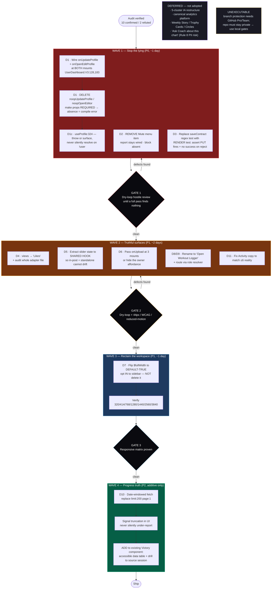
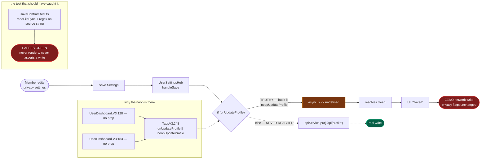

# User Dashboard — Refactored Master Remediation Blueprint

**Supersedes the external audit.** The audit was *credible but not correct*: its defect
findings hold, its severity ranking drifts, and its headline build item is overstated.
This document is what we actually build.

## How this was produced

1. Opus 5 verified every audit claim against `origin/main @ 66ffde607` — never the local
   `wip/` tree, which is 2158 commits behind and would have produced false verdicts.
2. A verified-evidence packet (real code pasted under each claim) went to three hostile
   seats: **GLM 5.3, Kimi K3, Grok 4.6**. All 3/3 returned. Cost $0.096.
3. The panel found **five blind spots in the packet itself**. Opus 5 closed all five.
   Two of those closures **changed the plan**.

### The two plan-changing closures

| Panel challenge | Resolution | Effect on plan |
|---|---|---|
| GLM + Grok: "the save behavior was inferred from a regex test; `UserSettingsHub.tsx` was never pasted" | Read the real handler. `if (onUpdateProfile) { await onUpdateProfile(payload) } else { apiService.put(...) }` — **inference was correct** | P0 stands, now evidence-backed |
| GLM: "if `dashboard.updateProfile` is local-state-only, the prescribed fix wires a *second* lie" | `useProfile.ts:323` calls `profileService.updateProfile()` and re-throws — **a real network write** | Fix is safe. **Disproven risk.** |

### Corrections this process made to the audit

| # | Audit said | Truth at `origin/main` | Impact |
|---|---|---|---|
| A | Progress tab shows "static horizontal bars", "far below the chart system" | **Already real Victory charts.** `WorkoutsTab.tsx:50,186` -> `WorkoutsTabCharts.tsx` uses `VictoryChart/Bar/Axis/Label` + shared `victoryStyleProps` | **Biggest scope cut.** Not a rewrite — additive |
| B | "Protect `main`, require status checks + approving review" | GitHub API returns **403: needs Pro/Team or a public repo**. Repo has a credential-leak history -> public is a hard no | Recommendation **unexecutable as written**; replace with local gates |
| C | Settings P0 (correct) | Missed **two siblings**: `onOpenEditProfile` is dead at the same 2 mounts (Grok); `useProfile.ts:324 if (!user) return` is a third silent-success path (Opus 5) | Fix must cover all three |
| D | did not examine tests | **~137 source-text regex tests** assert `toContain`/`toMatch` against component source strings (floor; 207 read a `.ts/.tsx` source file). The suite's "contract" guarantees are largely string-shape, not behavior | New P1 doctrine defect |

### Where the panel disagreed, and the ruling

- **`views := likesCount` severity.** Kimi -> P0 (data-truth rule). GLM + Grok -> hold P1
  (real number, wrong label, self-facing, no write-deception). **Ruling: P1**, 2-1, but it is
  a one-string fix so it ships in the same first pass regardless.
- **Mute: remove vs implement.** Grok -> remove now, do not implement in the trust window.
  Kimi -> removal is untenable *if* block/report are also stubs. GLM -> remove now, implement
  after verifying block/report. **Ruling: REMOVE.** Contingency resolved by evidence —
  `report` is genuinely wired (`handleReportSubmit` -> `onReport`); `block` does not exist.
  Removing mute leaves a working report path, so users retain a real safety control.
- **IA.** All three seats independently rejected the audit's 5-cluster consumer-social IA
  (Home/Feed/Progress/Community/Profile) as diluting a trainer-led B2B2C wedge.
  **Ruling: IA is OUT OF SCOPE for remediation.** Do not restructure navigation to fix bugs.

### What we are NOT doing (and why)

The audit's weeks 7-12 — Weekly Swan Story, Trophy Cards, Accountability Circles, coach chart
annotations, creator missions, "Ask Coach about this chart" — are **deferred, not adopted**.
GLM: *"an auditor's weeks 7-12 are options priced at zero."* Grok and Kimi both called the
12-week roadmap a sales document whose 48-hour trust-repair core is the actual product.
Additionally **"Ask Coach about this chart" is a Rule 8 zero-PII landmine** flagged
independently by Grok and GLM — if it is ever built, chart context must be IDs + aggregates only.

---

## The defect ledger (verified, ranked)

| ID | Defect | Sev | Evidence (`origin/main`) |
|----|--------|-----|--------------------------|
| D1 | Settings reports "Saved", writes nothing | **P0** | `UserDashboardTabsV3.tsx:105,248`; `UserDashboard.V3.tsx:128,183` pass no callback; real handler `UserSettingsHub.tsx:118-149` |
| D1b | Edit Profile affordance dead at same mounts | **P0** | `UserDashboardTabsV3.tsx:106,249` |
| D1c | `updateProfile` silently returns when `!user` | **P1** | `useProfile.ts:324` |
| D2 | "Mute User" is a live safety control that no-ops | **P0** | `usePostCardModeration.ts:47-49`; rendered `PostHeader.tsx:177` |
| D3 | Contract tests assert source strings, not behavior | **P1** | ~137 files; exemplar `UserSettingsHub.saveContract.test.ts` |
| D4 | Creative shows likes labeled as views | **P1** | `CreativeGallery.data.ts:164` |
| D5 | In-post transformation slider frozen at 50 | **P1** | `PostCard.tsx:56` (no setter); works at `TransformationPhotoShowcase.tsx:113` |
| D6 | Owner transformation upload never renders | **P1** | gate `:262,:280` needs `onUpload`; 3 mounts pass none |
| D7 | Nested 300px rail crushes content 1280-1440 | **P1** | `DashboardV3LayoutStyles.ts:152`; `HomeTabVision.styles.ts:61,67` |
| D8 | "Log This Style" transfers no workout | **P1** | `PostWorkoutDetailsModal.tsx:181,193` — identical static href |
| D9 | Hard-coded `/dashboard/client/...` bypasses role resolver | **P1** | same file, same lines |
| D10 | Progress truncates at 200 sessions, silently | **P2** | `WorkoutsTab.tsx:91` |
| D11 | Activity claims more than the ≤6 posts it maps | **P2** | `ActivitySection.data.ts:52` |

Not defects (verified, do not "fix"): `FeedEnrichmentCardView` noop like/comment is
**correct** — those cards are `readOnly` external source cards (`HomeCommunityFeed.tsx:173-179`).

---

## Build order (panel-ratified)

All three seats converged on the same shape: **honesty first, layout second, charts last.**

## The failure mechanism, as a wire diagram

The single root pattern behind D1/D1b/D1c/D6 is **absence-of-capability converted into
silent success**. GLM named the doctrine fix: *optional handlers must fail loudly, never resolve.*

## Data at risk in D1 (why it is P0, not P1)

From the real payload at `UserSettingsHub.tsx:122-145`, every one of these silently fails
to persist: `profileVisibility`, `showBadges`, `showAchievements`, `showStats`,
`showWorkoutHistory`, `showLevel`, `chartVisibility`, `emailNotifications`,
`smsNotifications`, `push`, `autoShareWorkoutsToFeed`, `fitnessGoal`,
`trainingExperience`, `healthConcerns`, `emergencyContact`.

That is **privacy controls and health data**. A member who sets their profile to private
is still public. Grok: *"user thinks transformation photos went private and they did not."*

## Acceptance criteria (Rule 73 — no "done" without these)

- **D1**: a render test mounts `UserSettingsHub` with the callback **mutated to a no-op**
  and **FAILS**. A test that merely asserts "Saved" appears would reproduce the bug.
  Plus: assert no success state when the write rejects.
- **D2**: the Mute item is absent from the DOM; report still functions.
- **D3**: replacement test renders and asserts network behavior; census of the other
  ~137 source-text tests filed as backlog, not silently ignored.
- **D7**: measured content-column width at 1280/1366/1440 exceeds an agreed minimum.
- Every wave ends with a **dry-loop hostile pass that finds nothing** before "done" is said.

## Local gates (replacing the unexecutable branch protection)

Since GitHub branch protection is plan-blocked and the repo must stay private:
pre-push hook running typecheck + affected tests + secret scan; the existing `Stop`
hooks stay authoritative. This is weaker than server-side enforcement — state that
plainly rather than claiming the audit's recommendation was satisfied.
