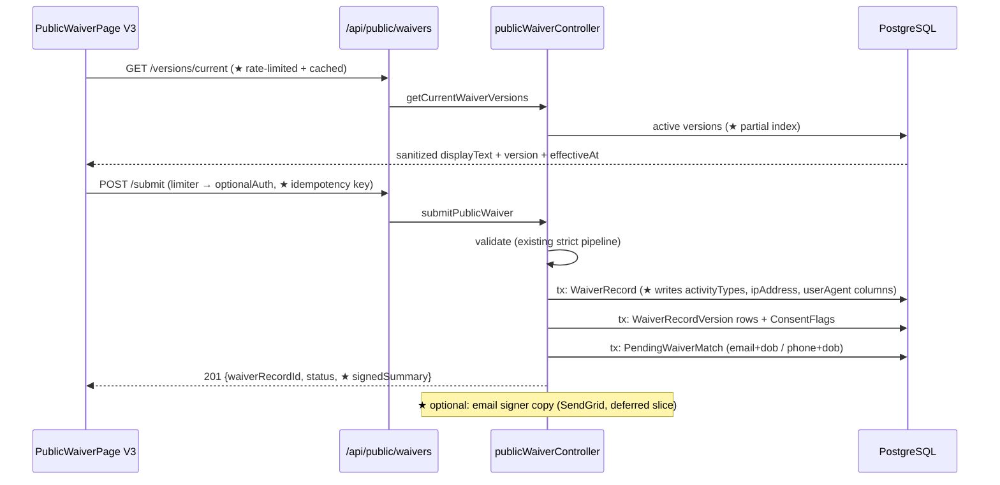

# Waiver System Overhaul — Blueprint & Master Prompt (2026-08-04)

**Status:** ✅ BUILT — all slices shipped on `claude/waiver-overhaul-20260804` (pushed, NOT merged). Panel complete. Dry-loop DRY at round 5. Awaiting Sean's merge decision + attorney review of v2.0 text. See §8 for the closeout record.
**Owner:** Sean (SwanStudios). **Author:** Fable 5 (Final Decider).
**Build tree:** worktree `C:/tmp/ss-waiver-v4-20260804`, branch `claude/waiver-overhaul-20260804` off origin/main `7149646e4`.
**decision:** overhaul waiver wording + UX + routes per this blueprint
**status:** open
**supersedes:** none (extends `docs/ai-workflow/blueprints/WAIVER-CONSENT-QR-FLOW-CONTRACT.md`)

---

## 0. The Enhanced Prompt (Sean's prompt, reconstructed with full context)

> **Original ask (voice, 2026-08-04):** "Look at the waiver page and waiver system with Kimi K3 and HY3. Enhance and update it, especially the wording — one of the AIs said the wording needs work — and make it logically better overall. Make the page more beautiful based on Kimi/HY3 UI-UX suggestions. Enhance the routes it runs through with better features. Improve this prompt with missing context, do what you recommend, run everything through K3 as a hostile review, and document with wireframe/blueprint/flowchart/mermaid — no vibe-coding."

**Enhanced master prompt:**

Overhaul the SwanStudios waiver system end-to-end — the public `/waiver` page (`PublicWaiverPage.V3.tsx`, mounted at `main-routes.tsx:437-444`), the admin manager at `/dashboard/admin/waivers`, the backend `/api/public/waivers/*` + `/api/admin/waivers/*` routes, and the canonical waiver **wording** stored in `waiver_versions` — on a fresh branch off origin/main (the wip tree is 1508 commits behind; waiver files have drifted).

**Workstream A — Wording (the core ask).** Author waiver text v2.0 as new `WaiverVersion` rows (never edit v1.0 in place — the version system exists precisely for this): core liability waiver, AI/Swan Coach consent notice, and the three activity addenda. Fix the known legal-copy weaknesses: add an express negligence release + indemnification + severability-with-venue (CA), a real minor/guardian section (the current core text has **none**), an electronic-signature consent clause (E-SIGN/UETA), media consent as clearly optional, remove the hardcoded "February 2026" effective date, and align naming ("Swan Coach" vs "AI-powered features" — one brand voice, per the no-"AI"-user-facing rule, with the legal disclosure exception decided explicitly). Rewrite all page-level microcopy (headings, consent labels, success/error states) from form-spec voice into SwanStudios voice. **Flag: AI-drafted legal text requires attorney review before production (per the 5W contract §16) — the build ships behind that gate, wording marked draft.**

**Workstream B — Page UX/logic.** Fix the ranked defects: (1) type-to-sign accessibility fallback for the signature canvas; (2) the silent dead-end when versions fail to load (explicit error state + retry); (3) scroll-to-accept or explicit read-attestation per document; (4) DOB-driven minor detection forcing the guardian flow; (5) honor `returnUrl` from the waiver gate; (6) success screen that shows what was signed (version + timestamp), offers a copy (print/email), and routes logged-in users correctly; (7) idempotent submit + 429 handling; (8) `<form>` semantics, aria-live errors, aria-invalid, focusable legal text; (9) sanitize rendered waiver HTML (DOMPurify); (10) theme-token the SignaturePad + admin surfaces. Keep the V3 visual language (glass card, hero, Crystalline tokens) but elevate it per Kimi K3 + HY3 direction — this is a trust-critical legal surface: calm, premium, zero template-feel.

**Workstream C — Routes/backend features.** Fold the backend audit findings; strengthen validation, rate limiting, and matching; surface admin action failures (six actions currently fail silently); add a signer-copy delivery path and version-attestation in the submit contract; reconcile the duplicated seeder wording into one source of truth.

**Workstream D — Process.** Blueprint-first (this doc): mermaid flowcharts (signer flow, matching lifecycle, version/re-consent lifecycle), ASCII wireframes (mobile + desktop), route/data contracts, numbered slices each independently shippable with acceptance criteria. One Kimi K3 + HY3 panel pass on this packet (spend-gated, dry-run preflight → Sean's `-ConfirmSpend`); their findings fold back here before code. Build slice-by-slice with per-slice gates (vitest, tsc, build, Rule 42 audit, secret scan), commit per slice, push once at batch end (Rule 70). Hostile dry-loop until clean (Rule 73). Minors' data + legal surface ⇒ this qualifies as high-stakes: the panel consult is the paid review; no auto-Village without Sean.

---

## 1. Current-State Audit — Frontend (origin/main, receipts verified)

### 1.1 Canonical Surface Receipt (Rule 26)

| Element | Evidence |
|---|---|
| Route mount | `frontend/src/routes/main-routes.tsx:437-444` — `path: 'waiver'` renders `<PublicWaiverPage />` in Suspense |
| Mounted component | `main-routes.tsx:108-112` — lazy V3 primary, **V2 as chunk-failure fallback** (not dead) |
| Consumer service | `frontend/src/services/publicWaiverService.ts:68-78` — `GET /versions/current`, `POST /submit` |
| API base | `publicWaiverService.ts:16` — `${VITE_API_URL}/api/public/waivers` |
| Admin mount | `UniversalDashboardLayout.routes.tsx:163` → `/dashboard/admin/waivers`; sidebar item `config/dashboard-tabs.ts:175` |
| Overview widget | `AdminOverviewPanel.tsx:210` — `WaiverSummaryWidget` in Mission Critical bento |
| User gate | `routes/protected-route.tsx:131-149, 294-297` — clients/users without linked waiver redirected `/waiver?returnUrl=…` |

Classification: **V3 canonical; V2 dormant-fallback (drifted — lacks V3's auth redirect, a real divergence); old `PublicWaiverPage.tsx` archived on main (`archive/pending-deletion/2026-07-16/`).**

### 1.2 Ranked defects (frontend explorer, file:line verified)

1. **Signature canvas has no keyboard/AT path** — `SignaturePad.tsx` bare `<canvas tabIndex={0}>`, no aria-label/role/type-to-sign; signature required by `V3:463` ⇒ page unusable for keyboard/motor-impaired users on a legally required field.
2. **Silent dead-end** — `V3:434` swallows version-fetch errors; empty `relevantVersions` defeats the `hasMissingText` banner (`:449-452`); submit disabled forever with zero explanation.
3. **No scroll-to-accept / read attestation** — `WaiverTextContainer` scrolls (`:243`) but consent label "risks described above" (`:743`) is unenforced; section 2 doesn't even render with no activities selected.
4. **Minor detection absent** — DOB captured (`:663-672`) never evaluated; guardian is self-declared checkbox (`:701-708`); guardian gives typed string while minor draws the binding signature.
5. **`returnUrl` dead on arrival** — gate writes it (`protected-route.tsx:296`), page never reads it (only `source` at `V3:405`); hardcoded `/user-dashboard` (`:519`); logged-in users can see "Create an Account" (`:560`). Test `PublicWaiverPage.V3.redirect.test.tsx:128-140` asserts the broken behavior as correct.
6. **Six silent admin failures** — `AdminWaiversManager.tsx:107,131,146,157,167,198` console.error only; approve/reject/attach show nothing on failure (only Revoke rethrows).
7. **Unsanitized `dangerouslySetInnerHTML`** on public page — `V3:636`, regex tag-sniff only, no DOMPurify ⇒ any write path into waiver text becomes stored XSS.
8. **Generic copy throughout** — bare-ordinal headings, default success string, `+1 (555) 123-4567` placeholder, "contact staff" dead-end with no contact info (`:627`), enum-speak activity labels.
9. **V2 fallback drift** — no `useAuth`/`useNavigate`; chunk-failure users get old behavior.
10. **Theme-blind surfaces** — `SignaturePad.tsx` fully hardcoded (`#0a0a2e`, `#60C0F0`); `adminWaivers.styles.ts` ~60 raw hex values; amber-on-amber contrast risk `V3:283-286`.
11. Also: no `<form>`/Enter-submit; no aria-live/aria-invalid; no unsaved-work guard; no submit idempotency; no 429 branch; Clear button inside canvas wipes signature with no undo; fixed 200px canvas height on mobile; admin table 8 columns with no mobile breakpoint; stale AUTHOR headers.

### 1.3 Verbatim wording inventory (current v1.0)

Canonical text lives in `waiver_versions` rows seeded by **two duplicated files** (`backend/seeders/seed-waiver-versions.mjs` ← boot-time, `backend/scripts/seed-waiver-versions.mjs` ← manual CLI; wording identical, `.trim()` makes hashes match — consolidation needed, not a bug).

Core waiver v1.0 sections: Assumption of Risk / Release of Liability / Medical Clearance / Emergency Medical Treatment / Personal Property / Governing Law (CA). **Legal-copy gaps identified:**
- No express release of **negligence** claims (weakens CA enforceability; releases must be clear and explicit).
- **No minor/guardian clause anywhere in the core text** — yet the UI has a guardian flow.
- No indemnification/hold-harmless clause.
- No electronic-signature consent (E-SIGN/UETA acknowledgment).
- No venue/county, no arbitration decision (governing law only).
- No communicable-disease clause.
- No media/photo release text (the UI checkbox at `V3:760` consents to something no document describes!).
- No revocation/term language; hardcoded "Effective Date: February 2026".
- Consent-label/brand drift: page says "AI-powered features" (`V3:752`), admin calls it "Swan Coach Consent" (`AdminWaiverDetailModal.tsx:86`), contract draft §6 says "AI-Assisted Coaching Notice". One voice needed + explicit decision on the "no 'AI' user-facing" rule vs. honest legal disclosure.
- **Attorney review is a non-code production gate (5W contract §16) — all v2.0 text ships as draft behind that gate.**

## 2. Current-State Audit — Backend (origin/main, receipts verified)

### 2.1 Route ownership (Rule 31 walk)

- `app.use('/api/public/waivers', publicWaiverRoutes)` — `backend/core/routes.mjs:570`. Only `/api/public*` mount; no shadow.
- `app.use('/api/admin/waivers', adminWaiverRoutes)` — `routes.mjs:568`. Nine bare `/api/admin` routers register **before** it; none currently defines a `/waivers` path (grep-verified) → no live shadow, but the ownership is order-dependent with **no route-ownership test** (latent).

Public endpoints: `GET /versions/current` (**no middleware at all**), `POST /submit` (`waiverLimiter` 10/15min → `optionalAuth`) — `publicWaiverRoutes.mjs:16-17`.
Admin endpoints (all `protect, adminOnly`, **no limiter**): list, detail, match approve/reject, attach-user, revoke, mark-reconsent-required — `adminWaiverRoutes.mjs:22-28`.

### 2.2 What's genuinely good (keep, don't rebuild)

- Submit validation is strict and well-tested: calendar-true DOB, contact-required, activity allowlist, explicit-boolean consents, guardian pair, `source` allowlist blocking forged `admin_tablet` (`publicWaiverController.mjs:156-262`).
- Evidence model is right: verbatim `versionTextSnapshots` in `metadata` (deliberately unsanitized legal record), `WaiverRecordVersion` join rows, server-side `sanitize-html` on **served** text only (commit `71cdf3407`) with the XSS contract test.
- Matching honors "no name-only" (email+DOB 0.9 / phone+DOB 0.85, client-role-scoped).
- `waiverGate` is fail-closed (503 on DB error), wired inside `protect` (`authMiddleware.mjs:385`), JWT-verified impersonation bypass, 44 gated prefixes, strong test coverage (9 test files, model shape-locks, real-DB CHECK constraints).
- Eligibility service (`waiverVersionEligibilityService.mjs`) correctly drives re-consent via `requiresReconsent` + version-outdated reason codes.

### 2.3 Ranked weaknesses (W1-W12, file:line verified)

| # | Weakness | Evidence |
|---|---|---|
| **W1** | **New waiver wording requires a code deploy** — text hardcoded in seeder; `findOrCreate` on `(type, activity, version)` means editing v1.0 text is a **silent no-op** with hash divergence; **no admin create/retire/version endpoint exists** | `seeders/seed-waiver-versions.mjs:38-114, 142-151`; `adminWaiverRoutes.mjs:22-28` |
| **W2** | Canonical legal text duplicated in 2 files; only `seeders/` is live (`startup.mjs:21,339`); `scripts/` copy orphaned (zero importers) — a lawyer's redline applied to the wrong file is a silent no-op | hash-identical today |
| **W3** | `GET /versions/current` unauthenticated, **no rate limit, no cache**; runs unbounded findAll + CPU-bound sanitize per hit | `publicWaiverRoutes.mjs:16`; controller `:104-124` |
| **W4** | No index for the hot filter `retiredAt IS NULL AND effectiveAt <= now` (public + AI eligibility paths); `waiver_record_versions.waiverVersionId` unindexed for reconsent count | `WaiverVersion.mjs:90-96` |
| **W5** | Admin list/detail ship **every column** ×100/page: base64 `signatureData`, DOB, `guardianTypedSignature`, `metadata` incl. **unsanitized** `versionTextSnapshots` → admin-surface XSS bypass risk + needless PII exfil surface | `adminWaiverController.mjs:158-165, 194` |
| **W6** | Latent IDOR: sequential `waiverRecordId` returned to anonymous callers; safe today only because no non-admin read endpoint exists | `publicWaiverController.mjs:430` |
| **W7** | Non-numeric ids / bad status-source query values → Postgres error → 500 instead of 400 on 5 admin paths | `:184, 208, 274, 311-315, 385, 146-147` |
| **W8** | `approveMatch`/`rejectMatch` — the action that legally binds a document to an identity — writes **no audit row** (logger.info only); attach/revoke/reconsent do | `:261, 294` vs `:355, 410, 470` |
| **W9** | Zero rate limiting on all 7 admin endpoints | `adminWaiverRoutes.mjs:22-28` |
| **W10** | No activation invariant: two concurrently-effective versions tiebreak on `id DESC` (insert order), seeder hardcodes identical `effectiveAt` for all rows | controller `:82-90`; seeder `:147` |
| **W11** | Seed failure is non-fatal → app boots green with empty `waiver_versions`; whole waiver flow 400s; every client also locked out of AI features | `startup.mjs:345-347` |
| **W12** | Test gaps: no route-ownership test, no versions/current-limiter test, no `activityTypes`-persisted test (why Drift-1 went unnoticed), no admin-list-excludes-signature test | — |

### 2.4 Schema drift (Rule 58 verdict)

FK targets all correctly `"Users"`; table names consistent; no case drift. **Two real drifts:**
- **Drift-1:** `WaiverRecord.activityTypes` (notNull, contract §5.3/§9.2) is **never written** by submit — every row stores `[]`; activity survives only via addendum join rows. `publicWaiverController.mjs:334-358`.
- **Drift-2:** `ipAddress`/`userAgent` **columns** are dead — controller writes them into `metadata` JSONB instead; typed columns NULL on every row. `:353-354`.
- Contract §11.3 "resend/share QR link" endpoint: never built. Contract §12.4 audit-every-override: broken by W8.
- Associations registered twice (per-model + `associations.mjs:1143-1161`), aliases currently identical — benign drift trap; pick one owner.

---

## 3. Target Architecture

### 3.1 Signer flow (public `/waiver`) — target

```mermaid
flowchart TD
    A[Entry: QR /waiver?source=qr · header link · waiver gate redirect with returnUrl] --> B{Versions load?}
    B -- fail --> B1[EXPLICIT error state + Retry button + contact line\n(kills silent dead-end)]
    B1 --> B
    B -- ok --> C[1 Choose your training setting\n(human labels, not enum-speak)]
    C --> D[2 Your information\nname · DOB · email/phone]
    D --> E{DOB < 18?}
    E -- yes --> F[Guardian flow FORCED\nguardian name + guardian DRAWN signature\nminor listed as participant]
    E -- no --> G[3 Read your agreement\nper-document read attestation\n(scroll tracking + explicit ack)]
    F --> G
    G --> H[4 Consents — separated blocks\nliability (required) · Swan Coach consent (optional, explained)\n· media release (optional, has real §text now)]
    H --> I[5 Sign\ncanvas OR accessible type-to-sign fallback\nclear-with-undo]
    I --> J[6 Review & submit\nshows doc titles + versions being signed\nidempotency key, 429-aware]
    J --> K{Auth state}
    K -- logged-in client --> L[Success: what you signed + when\nemail/print copy · refresh auth · honor returnUrl]
    K -- anonymous --> M[Success: confirmation ID + copy\n+ Create account CTA]
```

### 3.2 Submit sequence (backend) — target deltas marked ★



### 3.3 Version lifecycle (fixes W1/W10) — target

```mermaid
stateDiagram-v2
    [*] --> Draft: admin POST /versions (new version string, server-computed textHash)
    Draft --> Active: activate (tx: sets effectiveAt=now,\nretires previous same-key active version)
    Active --> Retired: retire OR superseded by next activation
    Active --> Active: mark-reconsent-required (existing endpoint)
    Retired --> [*]
    note right of Active: invariant — at most ONE active row per (waiverType, activityType); enforced in tx + partial unique index
```



Matching lifecycle is unchanged (already contract-true): `pending_match → linked` via auto-match approve / manual attach; `revoked`/`superseded` terminal; sibling matches bulk-rejected.

---

## 4. Wireframes (target, Crystalline tokens)

### 4.1 Mobile (390px) — public signer

```
┌─────────────────────────────┐
│  ≈ hero video (reduced-     │  motionMode-aware; calm, no typewriter
│    motion: static frame)    │
│  🦢  Training Agreement      │  ← human title, not "Activity Waiver & Release"
│  Sign once — takes about    │
│  2 minutes.                 │
├─────────────────────────────┤
│ ┌─ Glass card ────────────┐ │
│ │ ● Setting  ○ Info  ○ Read│ │  ← step rail (scroll-anchored, not a wizard;
│ │   ○ Consent ○ Sign       │ │     one page, sections reveal progressively)
│ │                          │ │
│ │ Where will you train?    │ │
│ │ [🏠 Home gym ]           │ │  44px+ cards w/ icon, not bare checkboxes
│ │ [🌳 Park / outdoors ]    │ │
│ │ [🏊 Swimming lessons ]   │ │
│ │                          │ │
│ │ About you                │ │
│ │ [Full legal name       ] │ │
│ │ [Date of birth         ] │ │  → <18 auto-opens guardian panel (amber note)
│ │ [Email] [Phone]  1 req'd │ │
│ │                          │ │
│ │ Your agreement    v2.0   │ │  version + effective date VISIBLE to signer
│ │ ┌──────────────────────┐ │ │
│ │ │ scrollable legal text│ │ │  focusable; progress % ; per-doc
│ │ │ …                    │ │ │  "I have read" ack row at end
│ │ └──────────────────────┘ │ │
│ │ ☑ Liability release *    │ │  separated consent blocks w/ 1-line
│ │ ☐ Swan Coach features    │ │  plain-English explanation each
│ │ ☐ Photo & media release  │ │
│ │                          │ │
│ │ Sign here                │ │
│ │ ┌──────────────────────┐ │ │  canvas, 44px [Clear↩] OUTSIDE pad,
│ │ │   (draw)             │ │ │  undo; [Type instead] a11y fallback
│ │ └──────────────────────┘ │ │
│ │ [    Agree & Sign  →   ] │ │  GlowButton; shows doc count "3 documents"
│ └──────────────────────────┘ │
└─────────────────────────────┘
SUCCESS: ✓ You're covered, {first name}. Signed v2.0 · Aug 4 2026, 2:14 PM
[Email me a copy] [Print]  → returnUrl / dashboard (logged-in) · Create account (anon)
ERROR (versions down): "We can't load the agreement right now." [Try again] + studio contact
```

### 4.2 Desktop (1280px+) — two-column

```
┌───────────────────────────────────────────────────────────────┐
│ hero (short)  Training Agreement — Sign once, ~2 min          │
├───────────────────────────┬───────────────────────────────────┤
│ LEFT (sticky, 38%)        │ RIGHT (62%)                       │
│ Step rail + trust panel:  │ Setting cards → About you →       │
│ what you're signing (3    │ Agreement reader (tall, 60vh) →   │
│ docs, versions, effective │ Consent blocks → Signature →      │
│ dates), why we ask, priv- │ Review strip → [Agree & Sign]     │
│ acy note, studio contact  │                                   │
└───────────────────────────┴───────────────────────────────────┘
```

### 4.3 Admin `/dashboard/admin/waivers` — deltas only

- Table → stacked cards under 768px (currently 8-col raw table).
- Every action gets toast feedback success **and failure** (kills the 6 silent paths).
- Detail modal renders snapshots through the same sanitizer as public (W5).
- New "Versions" tab (if Sean approves W1 authoring scope): list versions w/ status chips (Draft/Active/Retired), "New version" editor (title + rich text), Activate w/ confirm ("retires v1.0, N signers become outdated"), impactedUserCount surfaced from existing reconsent endpoint.

---

## 5. Slice Plan (each independently shippable; per-slice gates: vitest affected + tsc + build + Rule 42 + secret scan)

| # | Slice | Contents | Acceptance |
|---|---|---|---|
| S0 | Guard rails | Route-ownership test for `/api/*waiver*`; failing tests capturing Drift-1/2 + W7 500s | new tests red→green baseline |
| S1 | Backend correctness | Write `activityTypes`/`ipAddress`/`userAgent` columns (Drift-1/2); param validation → 400s (W7); status/source query allowlists | submit test asserts columns; 400 tests |
| S2 | Backend safety | `versions/current` limiter + 60s in-memory cache (W3); admin limiter (W9); partial index migration `.cjs` (W4); audit rows for approve/reject (W8) | limiter tests; migration up/down; AiConsentLog rows asserted |
| S3 | Admin response hygiene | attributes allowlist on list (no signatureData/metadata/guardianTypedSignature); detail returns sanitized snapshots (W5) | test: list excludes blobs |
| S4 | Version lifecycle | Activation invariant (tx retire-previous + partial unique index); seeder consolidation (scripts/ delegates to seeders/) (W2/W10); seed-failure → error-level + health flag (W11) | eligibility + dedupe tests under invariant |
| S5 | **Wording v2.0** | New v2.0 rows via seeder: core (adds negligence release, indemnification, minor/guardian §, e-sign consent, venue, communicable disease), media release doc (new — checkbox finally references real text), Swan Coach notice rewrite, 3 addenda polish; ALL microcopy rewrite; effective-date rendered from `effectiveAt` | text lands as **draft-gated** (`effectiveAt` future or behind flag) pending attorney review; brand-voice pass |
| S6 | Page core UX | Error state + retry (defect 2); `<form>` semantics + aria-live/aria-invalid/required (8); honor `returnUrl` (safe relative-path validation) (5); idempotent submit + 429 branch (7) | new redirect test replaces the one asserting broken behavior |
| S7 | Signature a11y | Type-to-sign fallback; canvas aria; Clear moved out + undo; DOMPurify on rendered text (9) | keyboard-only E2E completes waiver |
| S8 | Minor/guardian + attestation | DOB-driven guardian forcing; guardian draws (minor listed); per-doc read-attestation w/ scroll tracking (3/4) | validation tests for <18 paths |
| S9 | Success + beauty pass | Success redesign (what/when signed, copy delivery, correct routing); step rail; setting cards; trust panel; SignaturePad theme tokens; reduced-motion | design dual-pass + viewport matrix |
| S10 | Admin UX | Toast failures (6 silent paths); mobile cards; stale headers; [if approved] Versions authoring tab (W1) | manual + tests |
| S11 | Fallback + closeout | V2 fallback: re-point to V3 module or backport auth handling (defect 9); hostile dry-loop rounds until dry; batch push; deploy verify | Rule 73 proof |

**Kimi K3 + HY3 panel reviews THIS document before S5-S10 are locked** — their wording + UX/UI direction folds into S5/S9 specifically.

---

## 6. Decisions for Sean (blocking or steering)

1. **Panel spend** — approve the preflight below (Kimi K3 + HY3; Opus 5 optional third seat).
2. **Re-consent policy** — when v2.0 activates, do existing signers get `requiresReconsent` (forced re-sign via existing machinery) or grandfather until next visit? Recommendation: **force re-consent** — v2.0 adds materially protective terms; the machinery already exists.
3. **"AI" vs "Swan Coach" in legal copy** — standing rule says never "AI" user-facing; a consent disclosure arguably must be plain about automated processing. Recommendation: title it **"Swan Coach (AI-Assisted Coaching) Notice"** — brand-first, honest in parentheses, one voice everywhere (fixes the 3-way naming drift).
4. **Admin version authoring (W1 fix)** — build the Versions tab + endpoints this pass, or defer and ship v2.0 via seeder only? Recommendation: ship seeder path in S5 (fast), build authoring in S10 (the durable fix — wording updates without deploys, which is exactly today's pain).
5. **Attorney review** — v2.0 text ships draft-gated (contract §16). Sean owns scheduling the review; activation flips after.
6. **Signer copy delivery** — email copy via SendGrid on submit (needs template + the DMARC record from SWA-13, still pending) vs print-only now. Recommendation: print + on-screen now; email lands when DMARC does.

## 6.5 PANEL VERDICT (2026-08-04, all three seats returned; total spend ≈ $0.72)

Reviews: `WAIVER-KIMI-K3-REVIEW-2026-08-04.md` ($0.10) · `WAIVER-HY3-REVIEW-2026-08-04.md` ($0.004) · `WAIVER-OPUS5-REVIEW-2026-08-04.md` ($0.61). Convergent on: guardian-as-signer inversion, type-to-sign as first-class, version-load error state, receipt-style success, negligence clause, media release doc, one brand voice ("Swan Coach").

**Final Decider rulings (Fable):**
1. **ADOPTED (Opus R15/6C.3): admin WYSIWYG authoring is CUT.** Legal text ships as repo seeder rows through PR review — deploy-gating binding legal copy is a control. Blueprint §6 decision 4 is resolved: seeder path only. S10 loses the Versions tab.
2. **ADOPTED: version-activation invariant at the DB level** — partial unique index `(waiverType, activityType) WHERE "retiredAt" IS NULL` + transactional activate (diverges from Opus's tstzrange EXCLUDE: no btree_gist dependency, and we don't need future-dated coexistence; the seeder activates transactionally).
3. **ADOPTED: bundle-hash echo.** `/versions/current` returns a `bundleHash` (sha256 over sorted version ids+textHashes); `/submit` requires it and rejects stale bundles with `WAIVER_BUNDLE_STALE` + refreshed docs (kills the fetched-at-20:40-signed-at-21:20 evidence race).
4. **ADOPTED: durable signed artifact** — server-composed self-contained HTML (full text + fields + consent grid + signature image + hashes + version ids) stored with the record at submit; success screen offers print/download. Email delivery deferred (DMARC/SWA-13 gate) → ticket.
5. **ADOPTED: minor path = guardian is the CONTRACTING PARTY.** DOB fork; guardian draws the binding signature + verbatim authority attestation; participant (minor) named; minor typed assent; age bands (<13 guardian-only data entry; 13-17 guardian executes; 18+ self); emergency contact fields required for minors. Out-of-band guardian execution (own-device SMS link) → ticket (needs product + Twilio decisions).
6. **ADOPTED: split/scoped consents** — Swan Coach consent scoped to serving only (explicit "never used to train models; never sold"); media release split internal-progress vs public-marketing use with minor-safety guardian gating.
7. **ADOPTED (Opus §7.1 "best finding"): Home-Gym reciprocal indemnity** for trainer injury at client premises + premises-safety warranty; independent-contractor released parties + third-party-beneficiary language; covenant not to sue + heirs/derivative binding; gross-negligence carve-out; savings clause; venue + pre-suit notice, **NO arbitration clause**; full E-SIGN elements; English-comprehension attestation; capacity/impairment line; generic communicable-disease clause; swim guardian-on-premises duty + supervision representation; park permit allocation; counsel-consultation acknowledgment.
8. **ADOPTED: no scroll-telemetry-as-evidence** (Opus assumption-kill 4). Light per-document attestation + conspicuous boxed release restatement above the signature. Kimi's full-height reading sheets stay (UX, not evidence).
9. **ADOPTED: kill hero video + typewriter on this page.** Static header; motion budget moves to the success Seal (Kimi B.6 + HY3 Crystalline Seal, reduced-motion safe).
10. **ADOPTED: idempotency key** (client-generated at load, unique index, replay returns original) + localStorage draft persistence + explicit 429 copy.
11. **REJECTED (for now): auto-link at 0.9 confidence** (HY3) — identity binding keeps human review; Opus concurs (provisional-link + trainer confirm is the future shape) → ticket.
12. **DEFERRED → Linear tickets:** trainer session-start waiver-status view (all three seats want it — highest-value missing feature), out-of-band guardian execution, age-out job, perishable health attestation split, email copy + resend, bot check on public path, Spanish version, media takedown workflow, booking-gate re-consent integration, remediation campaign tooling (the cohort QUERY ships now as a read-only script).
13. **Re-consent reality check (Opus failure-mode 3):** verified — `waiverGate` gates on linked-record existence only, NOT version currency, so activating v2.0 with `requiresReconsent` does NOT lock dashboards; it only gates Swan Coach features via the eligibility service. Soft-landing = `/waiver` re-consent mode with a "what changed" summary (new `changeSummary` column) + prior-record pre-fill.

## 7. Hostile self-review of this blueprint (round 1)

- ✔ Confirmed V2-fallback claim by diffing V2/V3 imports (drift real, not cosmetic-only as first assumed).
- ✔ Corrected my own earlier claim of seeder hash-drift (scripts/ `.trim()` equalizes hashes — verified by SHA in backend audit).
- ✔ Checked the returnUrl test actually asserts the broken behavior (`V3.redirect.test.tsx:128-140`) — S6 must rewrite that test, not just the page.
- ✔ Slice order: backend safety (S1-S4) lands before wording/UX so v2.0 activates onto sound machinery.
- ⚠ Open risk: S5 wording is legally sensitive — attorney gate is non-code and stays with Sean (escape-hatch honesty, Rule 73).
- ⚠ Open risk: forcing re-consent (decision 2) will re-gate existing clients mid-usage; needs a soft-landing banner rather than hard 403 surprise — folded into S8 acceptance.


---

## 8. Closeout record (2026-08-06)

**Branch:** `claude/waiver-overhaul-20260804` — 9 commits, rebased onto `origin/main` (`cf3552504`), pushed. **Not merged**: merging deploys a legal surface and the v2.0 wording is attorney-gated. Code and wording are independent (flag default off), so a merge would ship the hardening + rebuilt page with v1.0 text still live.

### Slices shipped
| Slice | What landed |
|---|---|
| S0/S1 | Route-ownership guard (Rule 31 latent shadow), Drift-1/2 regressions, 400s on malformed admin input, audit rows on match approve/reject |
| S2/S4a | Typed evidence columns written, server-enforced minor policy, bundle-hash staleness rejection, idempotency key, durable signed artifact, versions limiter + 60s cache, admin limiter, hardening migration (one-active-version invariant, changeSummary, participant/emergency columns, hot-path indexes) |
| S3/S4b | Admin list attribute allowlist, sanitized detail snapshots, seed-failure at ERROR, single-source legal text |
| S5 | **Wording v2.0 (DRAFT, `WAIVER_ACTIVATE_V2` gated)** + new Photo & Media Release document + `media_release` type + per-document acceptance |
| S6–S9 | Page rebuilt: type-to-sign, document attestation, DOB-driven guardian fork, error/empty states + retry, returnUrl honoured, receipt with signer copy, zero-dep HTML scrub, hero video + typewriter removed |
| S10 | Six silent admin failures surfaced, mobile cards, ~60 colours onto tokens, stale headers |
| S11 | V2 unmounted, remediation audit script, dry-loop, rebase, board sync |

### Dry-loop ledger — DRY at round 5
| Round | Vantage | Found |
|---|---|---|
| 1 | Real module execution (no mocks) | Artifact embedded waiver text **verbatim** while the receipt writes it into a new window — reopened the stored-XSS vector through a new path. Fixed + 3 regressions. |
| 2 | Adversarial input analysis | **3 open-redirect bypasses** in `safeReturnUrl` (`/\evil.com`, TAB, vtab → `//evil.com`). Fixed via URL-parser validation + 22 tests. |
| 3 | Verify delegated work + whole-repo backend | Manual-link client search **failed silently** — missed by the subagent that fixed the manager's six paths. Fixed. |
| 4 | Full frontend suite + production build | CLEAN |
| 5 | Real Express router over HTTP (supertest) | CLEAN — 8/8 first run |

`DRY-LOOP: CLEAN×2 (rounds: 5)`

### Final gates (rebased tree)
Backend waiver suites **190/190** · frontend waiver/admin/signature **56/56** · `tsc --noEmit` **exit 0, 0 errors** (requires `--max-old-space-size=12288`; default heap OOMs — pre-existing) · `vite build` exit 0 · Rule 42 audit clean · secret scan clean.

### Pre-existing red on main (proved not mine — reverted my source to base, they still fail)
`galleryReferralCreditGuardTruth`, `adminWorkoutLoggerHistoryDate`, `editWorkoutDateParsing`, `WorkoutGenerationAuthPipeline.truth`.

### Not proven in-session
No browser or screen-reader run — a11y claims are structural and type-checked, not AT-verified. The migration has not run against a real Postgres. The remediation audit has not run against production data (SWA-152).

### Rebase note
Main moved 194 commits and touched the same admin-waiver files (launch-audit lane 2 added a `TableScroller`). Both mobile strategies were **composed** rather than one discarded: horizontal scroll region above the card breakpoint, stacked cards below, `min-width` dropped in card mode so a phone never scrolls sideways.

### Follow-ups on the board
SWA-151 (trainer session-start waiver status — all three models called it the highest-value gap) · **SWA-152 urgent** (minor remediation cohort; script ready, needs a production run) · SWA-153 (emailed copy, out-of-band guardian execution, age-out job, health re-attestation, additive addenda, bot check, takedown workflow, Spanish version).
