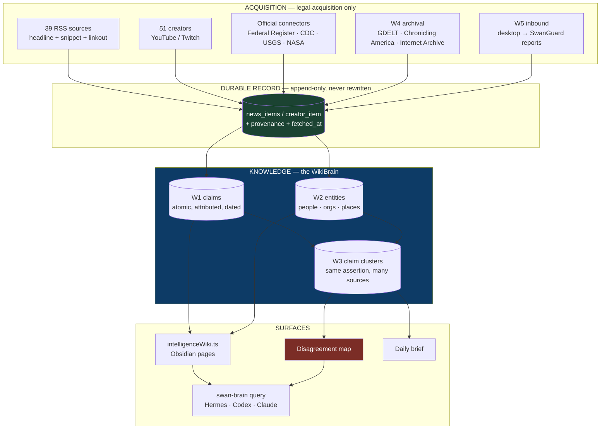
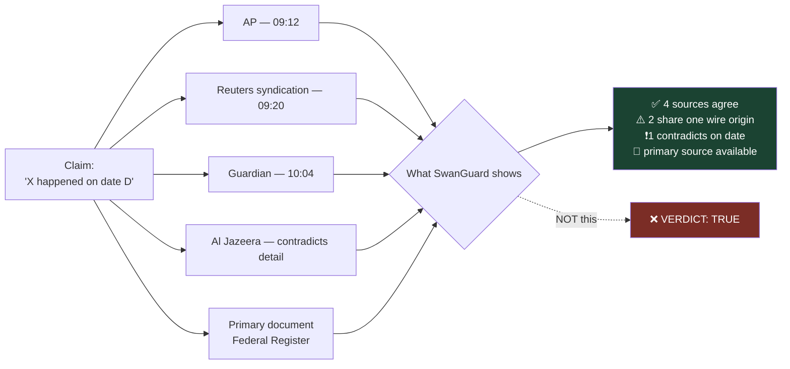
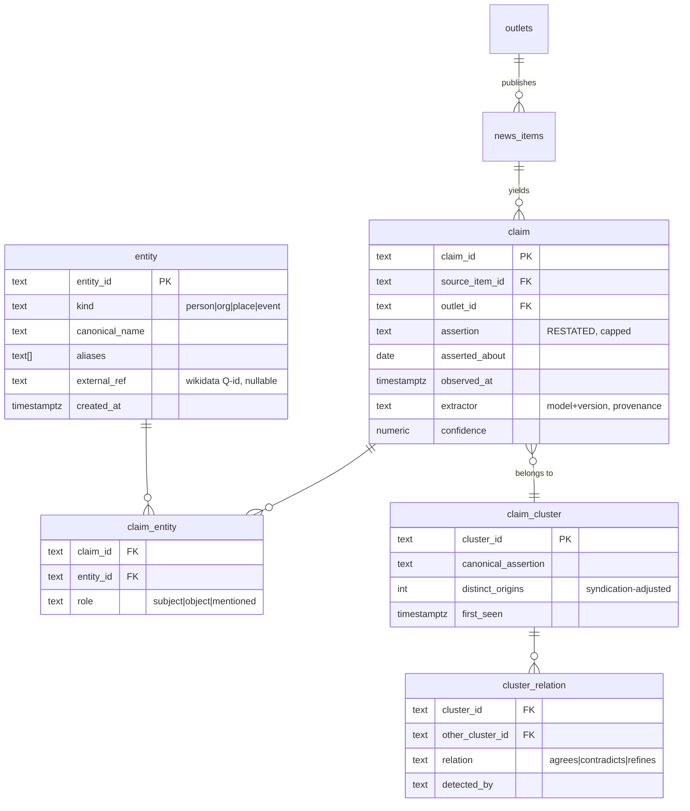

# 267 — WikiBrain Architecture Plan

**Status:** PLAN — for hostile review (GLM-5.3 · Kimi K3 · Grok 4.6 · Claude Opus 5)
**Date:** 2026-08-21 · **Owner:** Sean · **Board:** SWA-70
**Supersedes nothing.** Extends phases 46–50 (fact-check smoke, intelligence-wiki packet, wiki web surface).

---

## 0. The finding that reframes this plan

Sean asked to "build the WikiBrain." **Most of it is already built.** What is missing is not
architecture — it is that nothing has ever produced a row.

Verified live, 2026-08-21:

| Table | Rows | What it is for |
|---|--:|---|
| `comment_extracted_claims` | **0** | atomic claims pulled out of text |
| `comment_claim_fact_checks` | **0** | verdicts attached to those claims |
| `influence_wiki_facts` | **0** | the influence lane's wiki facts |
| `company_trust_facts` | **0** | company trust records |
| `creator` | 51 | *(was 0 until F0, 2026-08-20)* |
| `news_rss_sources` | 39 | *(was 0 until N1, 2026-08-21)* |
| `creator_item` | 0 | no creator enabled yet |
| `official_connector_states` | 0 | **no connector has ever been owner-enabled** |

`apps/api/src/intelligenceWiki.ts` already emits Obsidian-shaped pages — frontmatter
(`confidence`, `lastVerified`, `staleAfterDays`, `tags`), `citations[]`, `wikilinks[]`, slug,
`pageType`. It accepts exactly two source modules:

```ts
type WikiSourceModule = 'comment_intel' | 'influence_intel';
```

**News is not one of them.** That single line is the gap between "SwanGuard has a wiki" and
"SwanGuard has a WikiBrain fed by the world."

> **The pattern, named once:** every empty table in this repo has the same cause — machinery
> shipped, feeding never wired. F0 and N1 each fixed one instance. This plan must not add a
> sixth generator with no feeder; **every slice below is judged on whether it produces rows.**

---

## 1. What Sean asked for, mapped to lanes

| Ask (his words) | Lane | Exists? |
|---|---|---|
| "look up all the news out in the world right now today" | N2 trigger + N3 feed | fetcher exists, trigger does not |
| "old school news from back in the day" | **W4 archival** | nothing |
| "desktop … send information updates … via messages and reports" | **W5 inbound** | connector model exists, no inbound |
| "APIs connected … as much information in depth as possible" | N4 + W4 | partial |
| "build up my Karpathy Wiki … we have a WikiBrain" | **W1–W3** | generator exists, unfed |
| "kinda like a fact checker, like Snopes" | **W3 disagreement map** | claim model exists, unfed, no cross-source layer |
| "comparing charts and the articles and sources and information and people" | **W2 entities + W3** | nothing |

---

## 2. System shape



---

## 3. The epistemics decision — a disagreement map, NOT a truth oracle

This is the single most consequential design choice in the plan, and it should be argued with
before it is built.

Sean said "kinda like a fact checker, like Snopes." Snopes has **human editors** who research a
claim and publish a verdict with their reasoning and their name on it. An automated system that
prints **"FALSE"** next to a claim is doing something categorically different: it is asserting
adjudicated truth with no accountable author, on evidence it assembled by keyword.

**The failure mode is not embarrassment, it is confident wrongness in the direction of the
majority.** Six outlets running the same wire copy is *one* source wearing six hats. A naive
"5 sources say X, 1 says Y → X is true" scores syndication as corroboration and would have
marked many later-vindicated minority reports as false.

**Decision:** the system computes and displays **who claims what, from which source, when, and
where they disagree.** It does not emit a truth verdict. The verdict column exists
(`comment_claim_fact_checks`) and stays **human-set**.



**Syndication detection is therefore load-bearing, not a nicety.** Without it the agreement
count is inflated by construction.

---

## 4. Legal posture through the knowledge layer

N1 pinned acquisition to `rss_headline_snippet_linkout`. The claim layer must not quietly widen it.

| Layer | Stored | Basis |
|---|---|---|
| Item | headline, short snippet, URL, timestamp, source | as licensed |
| **Claim** | **a short factual assertion, restated, + attribution + link** | facts are not copyrightable; restatement is not reproduction |
| Entity | name, canonical id, links | factual |
| Cluster | claim ids + agreement relations | derived metadata |
| **Never** | full article text, paywalled body, image reproduction | — |

**Constraint for W1:** claim text is a *restatement*, capped short, always carrying
`source_item_id`. A claim that is merely a copied sentence is a licence violation wearing a
schema. Enforce with a length cap plus a similarity check against the stored snippet.

---

## 5. Schema (new tables only)



**`distinct_origins`, not `source_count`** — the column name itself encodes the syndication
lesson so a later contributor cannot casually count sources.

**Every claim carries `extractor`.** When an extraction model is replaced, its output must be
re-derivable and attributable; without it the corpus becomes an un-auditable pile.

---

## 6. Rule 72 re-decision — stated, not drifted into

SwanStudios Rule 72 forbids vector/embedding/RAG and knowledge graphs for flat lookups, with an
explicit re-open gate: **">2,000 catalog rows or >5,000 items in one store."**

**SwanGuard crosses that gate almost immediately.** 39 feeds returned **1,445 items** at seed
time; a daily poll accumulates past 5,000 within days.

**Position:** the gate is crossed, and the answer is still **not RAG.**

- Retrieval stays FTS + structured SQL. Postgres FTS over `news_items` is adequate and already in use.
- The claim/entity/cluster layer is **normalised tables, not a knowledge graph engine and not a
  vector index.** Joining three tables is not the thing Rule 72 forbids.
- Similarity for clustering uses **deterministic** methods first — normalised text, shingling,
  MinHash/SimHash. These are auditable and reproducible; an embedding is neither.
- **Reopen embeddings only if** deterministic clustering demonstrably fails on real data, and
  record that as a new decision with the evidence.

This is a re-decision recorded on purpose, per Rule 72's own instruction not to drift.

---

## 7. Wireframes

### 7.1 Home — "what is happening right now"

```
┌────────────────────────────────────────────────────────────────────────────┐
│  SwanGuard                              🔍 search    ⚙ sources    👤 owner  │
├────────────────────────────────────────────────────────────────────────────┤
│  TODAY                                            Fri 21 Aug · 39 sources  │
│                                                                            │
│  ┌──────────────────────────────────────────────────────────────────────┐ │
│  │ ⚡ MOST CORROBORATED                                                  │ │
│  │ "Assertion restated in one line."                                     │ │
│  │ 6 outlets · ⚠ 3 share one wire origin · 📄 primary doc available      │ │
│  │ [ see the map ]                                                       │ │
│  └──────────────────────────────────────────────────────────────────────┘ │
│                                                                            │
│  ┌──────────────────────────────────────────────────────────────────────┐ │
│  │ ❗ SOURCES DISAGREE                                                    │ │
│  │ "Assertion A"  ← 4 outlets      vs.   "Assertion B"  ← 2 outlets      │ │
│  │ differ on: date, casualty figure                                      │ │
│  │ [ compare side by side ]                                              │ │
│  └──────────────────────────────────────────────────────────────────────┘ │
│                                                                            │
│  LOCAL — Orange County          WORLD              OFFICIAL RECORD        │
│  ▸ …                            ▸ …                ▸ Federal Register …   │
└────────────────────────────────────────────────────────────────────────────┘
```

### 7.2 Disagreement map — the fact-check surface

```
┌────────────────────────────────────────────────────────────────────────────┐
│  ← back            CLAIM CLUSTER · first seen 21 Aug 09:12                  │
├────────────────────────────────────────────────────────────────────────────┤
│  "Restated canonical assertion."                                           │
│                                                                            │
│  WHO SAYS IT                          WHEN        DIFFERS ON               │
│  ● AP                    wire         09:12       —                        │
│  ○ Outlet B              syndicated   09:20       (same wire as AP)        │
│  ○ Outlet C              syndicated   09:31       (same wire as AP)        │
│  ● Guardian              own report   10:04       figure: 12 vs 14         │
│  ● Al Jazeera            own report   10:22       date: 19th vs 20th       │
│                                                                            │
│  ┌── DISTINCT ORIGINS: 3  (5 outlets, 2 syndicated) ───────────────────┐  │
│  │  Counting outlets would have said 5. It is 3.                        │  │
│  └──────────────────────────────────────────────────────────────────────┘  │
│                                                                            │
│  📄 PRIMARY SOURCE   Federal Register 2026-…   [ open ]                    │
│                                                                            │
│  YOUR VERDICT (human only)   ( ) supported  ( ) disputed  ( ) unresolved   │
│  notes ▁▁▁▁▁▁▁▁▁▁▁▁▁▁▁▁▁▁▁▁▁▁▁▁▁▁▁▁▁▁▁▁▁▁▁▁▁▁▁▁▁▁▁▁▁▁▁▁▁▁▁▁▁▁  [ save ]  │
└────────────────────────────────────────────────────────────────────────────┘
```

> The verdict control is **the only** place a truth judgement is entered, and a human enters it.

### 7.3 Entity page — "everything about this person / org"

```
┌────────────────────────────────────────────────────────────────────────────┐
│  ENTITY · person · canonical name              wikidata: Q… (if resolved)  │
├────────────────────────────────────────────────────────────────────────────┤
│  TIMELINE OF CLAIMS                                                        │
│   21 Aug  ● "…"                        3 origins    ⚠ disputed             │
│   14 Aug  ● "…"                        1 origin                            │
│   02 Aug  ● "…"                        7 origins                           │
│                                                                            │
│  CO-OCCURRING ENTITIES        SOURCES THAT COVER THEM MOST                 │
│  ▸ Org X   (14 claims)        ▸ Outlet A  31%                              │
│  ▸ Place Y (9 claims)         ▸ Outlet B  22%                              │
│                                                                            │
│  [ open as wiki page ]   [ export packet ]                                 │
└────────────────────────────────────────────────────────────────────────────┘
```

---

## 8. Ingest → knowledge flow

```mermaid
sequenceDiagram
  participant O as Owner
  participant C as Connector (owner-enabled)
  participant F as newsRssClient
  participant I as news_items
  participant X as Extractor
  participant K as claims / entities
  participant U as Clusterer
  participant W as Wiki + Disagreement map

  O->>C: enable source (explicit act)
  C->>F: sync due
  F->>I: append items (headline+snippet+link+provenance)
  Note over I: append-only; nothing rewritten
  I->>X: unprocessed items
  X->>K: restated claims + entities + extractor stamp
  Note over X,K: restatement capped;<br/>similarity-checked vs snippet
  K->>U: new claims
  U->>U: normalise → shingle → group
  U->>U: collapse syndicated origins
  U->>W: clusters + agree/contradict relations
  W-->>O: brief · map · wiki pages
  O->>W: human verdict (only here)
```

---

## 9. Slices — each judged on "does it produce rows?"

| Slice | Produces | Depends on | Size |
|---|---|---|---|
| **N2** trigger the news sync | `news_items` rows | owner enables 1 connector | S |
| **W0** wire `news` as a third `WikiSourceModule` | wiki pages from news | N2 | S |
| **W1** claim extraction | `claim` rows | N2 | M |
| **W2** entity extraction + canonicalisation | `entity`, `claim_entity` | W1 | M |
| **W3** clustering + syndication collapse + disagreement map | `claim_cluster`, `cluster_relation` | W1, W2 | L |
| **W4** archival lane (GDELT / Chronicling America / Internet Archive) | historical `news_items` | W1 | L |
| **W5** desktop → SwanGuard inbound reports | inbound items | connector model | M |
| **W6** expose to Hermes/Codex/Claude via `swan-brain`-style query | — | W0–W3 | S |

**Order:** N2 → W0 → W1 → W2 → W3, then W4/W5 in parallel, W6 last.
**Rationale:** N2 and W0 turn the whole existing stack from zero-row to producing within one
slice each. W3 is where the actual product value lives, and it cannot be built before W1/W2.

---

## 10. What could make this wrong

Stated up front so the panel attacks the right things.

1. **Claim extraction quality is the whole product.** Bad extraction produces a confident
   disagreement map built on misread sentences — worse than no map. Unaddressed: what extracts,
   at what cost, with what error rate, and how error is measured.
2. **Syndication detection may be harder than assumed.** Outlets rewrite wire copy. If detection
   fails, `distinct_origins` silently inflates and the core value proposition inverts.
3. **Entity canonicalisation is a known-hard problem.** Two people share a name; one person has
   five spellings. Wikidata is proposed as an anchor but not designed here.
4. **Volume.** 1,445 items per poll × N polls/day × claim fan-out is real growth. No retention
   policy is specified.
5. **The restatement line is legally load-bearing and thinly specified.** A length cap plus
   similarity check is asserted, not proven adequate.
6. **The disagreement map could still mislead.** Showing "4 vs 2" is itself a framing that
   implies the majority is right.
7. **The archival lane (W4) has a different legal posture** from RSS and is not analysed here.

---

## 11. Verification gates

| Slice | Gate |
|---|---|
| N2 | owner enables 1 source → `news_items` count > 0 within one sync, verified in live Postgres |
| W0 | a wiki page generated from a news item, with citations resolving to the source URL |
| W1 | claims extracted from ≥100 real items; **manual read of a 20-claim sample** for restatement + accuracy |
| W2 | entity resolution measured against a hand-labelled sample; precision reported, not assumed |
| W3 | a known syndicated story collapses to 1 origin, not 6 — **on real fetched data** |
| W6 | Hermes retrieves a news claim through its own MCP path, not a convenience CLI |

**Nothing in this plan may be reported as done on a fake-client suite alone.** The N1
`connector_key` bug passed the fake suite and failed against real Postgres; that precedent governs.

---

## 12. Panel questions

1. **§3** — is disagreement-map-not-verdict right, or is it an abdication that leaves Sean doing
   the work he wanted automated?
2. **§6** — is the Rule 72 re-decision defensible, or is deterministic clustering going to fail on
   real news and force embeddings anyway?
3. **§5** — does the schema survive contact with wire copy, corrections, retractions, and
   developing stories where a claim *changes*?
4. **§4** — is the restatement boundary actually defensible, or is a derived claim database from
   licensed snippets a licence violation regardless of phrasing?
5. **§9** — is the slice order right, given every table in the system is currently empty?
6. **§10** — which risk is most underestimated, and what is missing from the list entirely?
