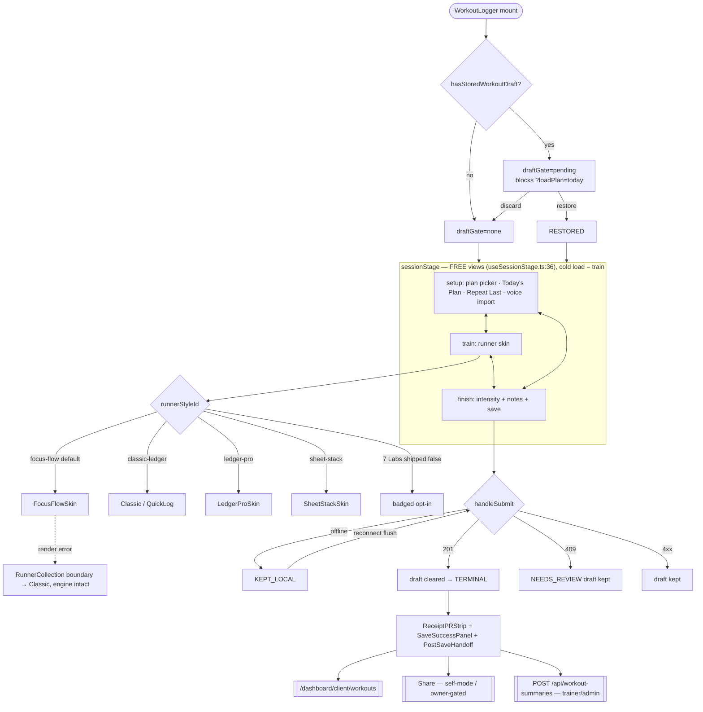

# 01 — WORKOUT LOGGER · Audit + Blueprint

**Ground truth:** `origin/main@3887c8ef`, read-only audit 2026-09-03. Every file:line below was read this session (`[VERIFIED]`) unless tagged otherwise. Shared protocol + bans: `10-CHECKPOINT-PROTOCOL-AND-BANS.md`. Builder starts at §E.
**Builds on (do not re-litigate):** `SESSION-SHELL-HANDOFF-2026-07-30.md` (6 zones / 3 stages, consult-ratified), `SESSION-SHELL-LIVE-STATE-HANDOFF-2026-07-31.md` (what shipped), `RUNNER-STYLES-FINAL-10-2026-07-30.md` (3 archetypes × recipes), `POST-SAVE-HANDOFF-AUDIT-RECORD-2026-07-19.md`, `UNIFIED-WORKOUT-OS-FABLE-BLUEPRINT-2026-07-29.md` §12/§13 (C0–C8a shipped, C8b deferred), `KIMI-WORKOUT-OS-REVIEW-2026-07-29.md` §1.1 (do NOT split the 2,624-line route file until it blocks a change).

---

## §A — GROUND TRUTH

### A1. Canonical Surface Receipt (Rule 26)

| Part | Evidence |
|---|---|
| (a) Route mount | `frontend/src/routes/main-routes.tsx:936-945` mounts `dashboard/*` under `ProtectedRoute` → `UniversalDashboardLayout`. Role tables in `UniversalDashboardLayout.routes.tsx`: client `:222` `/log-workout → WorkoutLogger`; admin `:151` `/log-my-workout → AdminPersonalWorkoutLogger`; trainer `:190` `/log-workout → EnhancedWorkoutLogger`; admin `:150` `/log-workout → AdminLogWorkoutRedirect` (→ Client Hub `?tab=training&trainingSection=logger`). |
| (b) Mounted JSX | `UniversalDashboardLayout.shellPieces.tsx:108` renders `<Component />` for every role route. `AdminPersonalWorkoutLogger.tsx:28-34` → `<WorkoutLogger forceSelfMode …/>`. `EnhancedWorkoutLogger.tsx:27-159` resolves client then mounts `WorkoutLogger` via `EnhancedWorkoutLogger.view.tsx`. **One logger component: `frontend/src/components/WorkoutLogger/WorkoutLogger.tsx` (883 lines).** |
| (c) Consumer hooks | `useWorkoutSubmit.ts:66` (save), `useWorkoutDraft.tsx:56`, `useOfflineQueue.ts:57`, `useWorkoutPlanLoading.ts`, `useGhostPreFill.ts`, `useLastWeightSuggestions.ts`, `useSessionStats.ts`, `useRestTimer.ts`, `useWorkoutAiEvents.ts`, `runner/useRunnerEngine.tsx:42`, `runner/shell/useSessionStage.ts:64`. |
| (d) API literals | `'/api/workout-forms'` (`frontend/src/services/nasmApiService.ts:740,746`) — THE SAVE. Also `/api/workout-forms/my/info`, `/api/workout-forms/client/:id/info`, `/api/workouts/:id/current`, `/api/admin/clients/:id/workouts?limit=1|10`, `/api/workout-logs/last-weights`, `/api/workout-logs/upload`, `/api/workout-summaries`, `/api/exercises/library`, `/api/social/posts`, `/api/config/public-flags`. |
| (e) Backend match | `backend/core/routes.mjs:774` `/api/workout-forms` → `backend/routes/dailyWorkoutFormRoutes.mjs:611` `POST /` (`protect`, `checkTrainerClientRelationship`). Sibling mounts: `routes.mjs:441` `/api/workout-logs`, `:558` `/api/admin`, `:600` `/api/workouts`, `:601` `/api/workout-summaries`. |
| (f) Model fields | **`DailyWorkoutForm`** (`backend/models/DailyWorkoutForm.mjs`, table `daily_workout_forms`, explicit `field:` snake_case on every column): `id` UUID · `sessionId→session_id` · `clientId→client_id` · `trainerId→trainer_id` NOT NULL · `date` **DATEONLY** · `formData→form_data` JSONB · `sessionDeducted` · `totalPointsEarned` · `mcpProcessed` · `submittedAt` · `formVersion` · `estimatedDuration` · `trainerNotes` · `clientSummary`. Validator `clientTrainerDifferent` (`:402`). **`WorkoutSession`** (`backend/models/WorkoutSession.mjs`, table `workout_sessions`, camelCase columns, no `field:`): `id` UUID · `userId` · `title` · **`date` `DataTypes.DATE` (`:44`, timestamp — see C-S2)** · `clientRequestId` · `duration` · `intensity` · `notes` · `totalWeight/Reps/Sets` · `status` ENUM(planned,in_progress,completed,skipped,cancelled) · `workoutPlanId` · `workoutPlanDayId` · `sessionType` · `trainerId` · `isMilestone`. **`WorkoutLog`** (`backend/models/WorkoutLog.mjs`, table `workout_logs`, camelCase): `sessionId` · `exerciseName` · `circuitName` (`:26`) · `circuitOrder` (`:30`) · `exerciseRole` (`:35`, isIn primary|drop-movement|active-recovery|core|mobility|finisher) · `setNumber` · `reps` · `weight` · `tempo` · `rest` · `rpe` · `notes` · `exerciseNote` · `setType` (`:98`, isIn warmup|working|dropset|superset|failure|amrap|rest_pause, default `'working'`) · `isometricHoldSeconds` (`:104`). Migration for the last five: `20260828000001-add-workout-log-circuit-fields.cjs`. **No `formQuality` column exists anywhere.** `WorkoutExercise`/`Set` are NOT written by this surface (0 rows in prod per C5 receipt). |

### A2. Surface classification (Rule 27)

| Surface | file | Class | Evidence |
|---|---|---|---|
| `WorkoutLogger.tsx` | `frontend/src/components/WorkoutLogger/WorkoutLogger.tsx:100` | **canonical** | all three role routes reach it (A1) |
| `AdminPersonalWorkoutLogger.tsx` (36 ln) | same dir | canonical wrapper | routes `:151` |
| `EnhancedWorkoutLogger` (159 ln) | `frontend/src/components/TrainerDashboard/WorkoutLogging/` | canonical route shell | routes `:190` |
| `ExerciseAutocomplete.tsx` + `.styles.ts` + `.tokenContract.test.ts` | same dir | **dormant / dead** | `grep -rln ExerciseAutocomplete frontend/src` → only its own 3 files; the only reference to `/api/exercises/search` in the surface. Superseded by `NASMExerciseRolodex` + `useExerciseSearch`. |
| `NASMProtocolSection.tsx` (197 ln) | same dir | legacy, dormant-on-purpose, **no dormancy header** | only `import type { NASMItem }` survives (`NASMProtocolDefaults.ts:21`); `WorkoutLogger.protocolSections.test.tsx:67-72` forbids re-import |
| 7 Swan Labs runner styles | `runner/runnerStyles.ts` (`shipped:false`) | dormant by design | `RUNNER-STYLES-FINAL-10` — promote/kill on 90-day data that is **not instrumented** |
| Manual write lane vs AI write lane | `dailyWorkoutFormRoutes.mjs:128-158` vs `services/workout/aiWorkoutDailyFormPayloadService.mjs:146-164` | **competing — same tables, divergent column coverage** | §C S1 |

### A3. File inventory (over-cap files only; the surface has 55 non-test files + 33 in `runner/` + 14 in `handoff/`, all others under cap)

| Lines | File | Rule 4 note |
|---|---|---|
| 2624 | `backend/routes/dailyWorkoutFormRoutes.mjs` | money path; split DEFERRED by Kimi §1.1 ruling — touch only for the surgical S1 fix |
| 883 | `WorkoutLogger.tsx` | +17 past the "do not grow" line set at 866 by `ELEGANCE-BLUEPRINT-ARC-L-LOGGER`; every slice here must be net-neutral-or-better (pinned by `WorkoutLogger.extraction.test.ts`) |
| 542 | `WorkoutLoggerTypes.ts` | types + data catalogs mixed |
| 514 | `backend/services/workoutLogParserService.mjs` | |
| 457 | `backend/controllers/adminWorkoutLoggerController.mjs` | |
| 364 | `backend/services/workout/aiWorkoutDailyFormService.mjs` | |
| 352 | `WorkoutLogger.helpers.ts`, `backend/routes/workoutLogUploadRoutes.mjs` | |
| 326 | `useWorkoutSubmit.ts` | |
| 309 | `useWorkoutDraft.tsx` | |
| 307 | `WorkoutLoggerTheme.ts` | ~25 raw hex + 9 gradients, Rule 6 violation (§C C1) |

Tests: 115 co-located frontend test files; ~30 backend files across `backend/__tests__` and `backend/tests`.

### A4. Runtime flow — the save path

```mermaid
sequenceDiagram
    autonumber
    actor U as Trainer / Client
    participant AB as ActionBar (zone 6)
    participant WS as useWorkoutSubmit
    participant PB as workoutLoggerSubmitPayload
    participant OQ as useOfflineQueue
    participant SV as dailyWorkoutFormService
    participant MW as protect + checkTrainerClientRelationship
    participant RT as dailyWorkoutFormRoutes POST /
    participant DB as PostgreSQL
    participant PS as post-commit services
    participant UI as SaveSuccessPanel + Handoff

    U->>AB: tap Save
    AB->>WS: handleSubmit()
    WS->>WS: 6 guards before first await (race, empty, client, balance, incomplete set, clientId)
    WS->>PB: buildWorkoutFormSubmitBody() — null ratings OMITTED, never null
    alt offline
        WS->>OQ: queueSubmission(body) → KEPT_LOCAL, draft kept
    else online
        WS->>SV: POST /api/workout-forms (30s abort)
        SV->>MW: admin any | self only | trainer needs active assignment
        MW->>RT: next()
        RT->>DB: BEGIN; User.findByPk(LOCK.UPDATE)
        RT->>RT: scheduled-session + billing decision + future-date + trainer attribution
        RT->>DB: pg_advisory_xact_lock(clientId:date)
        RT->>DB: DailyWorkoutForm.findOne(clientId,date)
        alt duplicate
            RT-->>WS: 409 → NEEDS_REVIEW, draft kept
        else clear
            RT->>DB: WorkoutSession.findOrCreate({userId, date:'YYYY-MM-DD'}) ⚠ S2
            RT->>DB: WorkoutLog.destroy(sessionId) then bulkCreate(rows) ⚠ S1 drops 5 columns
            RT->>DB: DailyWorkoutForm.create(formData JSONB = full exercises)
            RT->>DB: credit decrement · plan advance · session complete · COMMIT
            RT->>PS: earnings · variation · challenges · XP+badges (setImmediate) · PR detection (sync) · safeAssemble(handoff)
            RT-->>WS: 201 {form, message, handoff}
            WS->>WS: dispatchWorkoutLogged → swan:workout-logged → charts refetch
            WS-->>UI: PR strip + SaveSuccessPanel + PostSaveHandoff portal
        end
    end
```

### A5. Shell / runner state machine



### A6. What works today (present tense = code does it now)
- One logger for three roles; deep links `?loadPlan=today|clientId|sessionId|sessionDate|sessionCredits|assignmentKey|assignmentType|exercise|returnTo`.
- 6 zones (ContextBar, ShellNotices, StageRail tablist, StageCanvas with per-stage scroll memory, CoachDrawer, ActionBar) each in a `ShellZoneBoundary`; 3 free stages; 4 shipped skins switchable mid-session losslessly; a skin crash falls back to Classic with state intact.
- Population: rolodex (worker-indexed), Today's Plan, Repeat Last (trainer/admin only), OPT phase templates, planned-assignment picker, voice/file import with review, ghost prefill + last-weight + overload hints (trainer/admin only).
- Live logging: weight/reps/RPE/tempo/rest, thumb keypad with plate math, rest timer with absolute `endsAt`, PR toast, 40/60/80% warm-up ramp, wake lock, live-region announcements, 44px+ everywhere (9 touch-target suites).
- Persistence: 1s-debounced localStorage draft keyed `user:client:date` (7-day), draft beats `?loadPlan=today`, offline queue with honest write-failure reporting, draft cleared only on 201.
- Server: advisory lock per (clientId,date), 409 duplicate guard, one transaction for `WorkoutSession` + `WorkoutLog` + `DailyWorkoutForm`, credit decrement, plan advance, scheduled-session completion, billing receipt on the 201.
- Post-save: PR strip, SaveSuccessPanel (Done / Buy more / Book next / Share), PostSaveHandoff (est-1RM proof chart, NBA, streak, celebration; double-gated), `swan:workout-logged` live chart refetch, client-side PDF, summary email (trainer/admin), Coach round-trip URLs, `AI_SUBMIT_WORKOUT` through the same `handleSubmit`.

---

## §B — DATA CONTRACTS

### B1. `POST /api/workout-forms` (billing-sensitive, golden-master locked — BAN B9)
Request (`workoutLoggerSubmitPayload.ts:30-37`, wire types `nasmApiService.ts:180-193`):

| Field | Type | Req | Server validation (file:line) | Persisted where |
|---|---|---|---|---|
| `clientId` | int | ✅ | positive int; self-role must equal own id; trainer needs `EDIT_WORKOUTS` + active assignment (`dailyWorkoutFormRoutes.mjs:633,649,688,694-722`) | all three tables |
| `date` | `YYYY-MM-DD` | ✅ | `toIsoDateOnly`; overridden by linked session date (`:801`); rejected if > client-local today (`:846-856`) | `daily_workout_forms.date` DATEONLY; `workout_sessions.date` DATE ⚠ |
| `exercises[]` | array | ✅ | non-empty (`:633`) | JSONB `form_data` (full) + `workout_logs` rows (partial ⚠ S1) |
| `exercises[].exerciseName` | string ≤255 | ✅ | trimmed, fallback `Exercise N` (`:131-133`) | `workout_logs.exerciseName` |
| `exercises[].painLevel` | 0-10 | ✅ | **not range-validated** (§C V1) | JSONB only |
| `exercises[].formRating` | 1-5 | – | omitted when null | JSONB only |
| `exercises[].performanceNotes` | string | – | → `exerciseNote` (`:135-137`) | `workout_logs.exerciseNote` |
| `exercises[].supersetGroup` | int>0 | – | omitted unless >0 | JSONB only |
| `exercises[].circuitName / circuitOrder / exerciseRole` | str/int/str | – | sent (`workoutLoggerSubmitPayload.ts:230`) — **DROPPED by row builder** | JSONB only ⚠ S1 |
| `sets[].setNumber` | int | – | strict positive else index+1 (`:141,145`) | `workout_logs` |
| `sets[].reps` / `weight` | int / number | ✅ | non-negative, default 0 (`:146-147`) | `workout_logs` |
| `sets[].tempo` ≤20 / `restTime` ≥0 / `rpe` 1-10 (out-of-range → null) / `notes` | | – | `:148-151` | `workout_logs` |
| `sets[].formQuality` | int | – | no column anywhere | JSONB only (§C S3) |
| `sets[].setType` | enum(7) | – | sent (`:207` default `'working'`) — **DROPPED**; DB default masks it | JSONB only ⚠ S1 |
| `sets[].isometricHoldSeconds` | int ≥0 | – | sent when set (`:215-216`) — **DROPPED** | JSONB only ⚠ S1 |
| `sessionNotes` | string | – | `\|\| ''` (`:1090`) | `form_data` |
| `overallIntensity` | 1-10 or omitted | – | omitted = unrated → SQL null (`:1005-1007`) | `form_data` + `workout_sessions.intensity` |
| `scheduledSessionId` | int | – | must exist, belong to client, trainer-assigned, not cancelled/blocked/no_show (`:658-670,757-799`) | billing |
| `equipmentProfileId` | int | – | shape only — ownership NOT verified (§C A3) | `form_data` |
| `plannedAssignment` | object | – | client allowlists type; server re-resolves (`:812-823`) | plan advance |

Responses: `201 {success, form:{id, clientId, trainerId, date, totalSets, estimatedDuration, scheduledSessionId?, sessionDeducted, billing:{status,shouldDeduct,sessionDeducted,creditsDeducted,creditsRequired,remainingSessions}, plannedAssignment, planProgress, challengeProgress, prEvents[], submittedAt}, message, handoff}` (`:1389-1409`) · `400` (missing/bad id/date/billing/future) · `401` · `403` (self-for-other, no permission, unassigned, session not client's/trainer's) · `404` (client/session) · `409 {success:false, form:{id,…}}` (`:923-943`) · `500 {code:'INTERNAL_ERROR'}` incl. the "no valid trainer or admin" refusal (`:899-902`).

### B2. Other endpoints on this surface
| Endpoint | Auth | Contract |
|---|---|---|
| `POST /api/workout-logs/upload` (`workoutLogUploadRoutes.mjs:187`) | `authorize` + in-handler `resolveVoiceUploadScope` (self only for client) + rate limit | multipart `{file?|transcript?, clientId, date?, sessionId?}` → `ParsedWorkout`; mapper hardcodes `tempo:''`, `restTime:60` (§C U2) |
| `GET /api/workout-logs/last-weights?clientId&names=` (`:139`) | `protect` + `assertAssignmentOrAdmin` | `{success, weights:{}}`; empty = success |
| `POST /api/workout-summaries` (`workoutSummaryRoutes.mjs:64`) | `trainerOrAdminOnly` + `verifyClientAccessByUserId` | `{clientId, formId, exercises[], sessionNotes, overallIntensity, sendEmail}` → `{success, emailSent}` |
| `GET /api/admin/clients/:clientId/workouts?limit=` (`adminWorkoutLoggerRoutes.mjs:99`) | `authorize(['admin','trainer'])` + `ensureClientAccess` | history for ghost/repeat — **clients cannot call it** (§C A4) |
| `GET /api/workouts/:userId/current` (`clientWorkoutRoutes.mjs:62`) | `protect` + `ensureClientAccess` | today's plan |
| `HandoffData` | server-assembled `safeAssemble` (`:1376-1383`) | `{proof, nba, headline:'pr'|'first'|'streak'|'default', share:{eligible,reason}, pendingSync}` (`handoff/workoutHandoff.types.ts`) |

---

## §C — DEFECTS / DRIFT / RISKS (each verified this session unless tagged)

| ID | Sev | Finding | Evidence |
|---|---|---|---|
| **S1** | 🔴 HIGH | Manual lane drops `circuitName`, `circuitOrder`, `exerciseRole`, `setType`, `isometricHoldSeconds` — rows carry only `sessionId, exerciseName, setNumber, reps, weight, tempo, rest, rpe, notes, exerciseNote`. AI/Coach/PLAUD lane persists all five. Every UI-logged dropset/AMRAP/failure/warm-up set is stored as `'working'`; circuits vanish from `workout_logs`. Charts, PR detection, proof loader, Repeat Last read `workout_logs`. | `dailyWorkoutFormRoutes.mjs:128-158` vs `aiWorkoutDailyFormPayloadService.mjs:146-164`; columns `WorkoutLog.mjs:26,30,35,98,104`; migration `20260828000001`; frontend sends them `workoutLoggerSubmitPayload.ts:207,215-216,230`. Test asymmetry: `backend/tests/unit/workoutLogServiceCircuitMetadata.test.mjs` pins the AI lane only. |
| **S2** | 🟠 MED | `WorkoutSession.date` is `DataTypes.DATE` (timestamp) but `findOrCreate` matches `date: 'YYYY-MM-DD'` → matches only exact-midnight rows; a planner/`/api/workout/sessions`-created non-midnight session is missed and a duplicate session row is inserted; the reconcile `update` at `:1058` never runs. `[LIKELY]` mechanism verified; prod duplicate count not probed. | `WorkoutSession.mjs:44`; migration `20250714000001:50`; `dailyWorkoutFormRoutes.mjs:1012-1016`. |
| **S3** | 🟡 LOW | `formQuality` per set is collected, PDF-exported, voice-mapped, but has no column → never chartable. | `workoutLoggerSubmitPayload.ts:100,213`; `WorkoutLog.mjs` (absent) |
| **S4** | 🟡 LOW | Self-log role set declared 3× (frontend `WorkoutLogger.helpers.ts:341`, `authMiddleware.mjs:628`, `dailyWorkoutFormRoutes.mjs:70`). | duplicated-value class (lesson-recall) |
| **A2** | 🟠 MED (latent) | Handler re-reads `req.body.clientId` (`:616`) instead of the pinned `req.authorizedClientId` the middleware sets "as the durable confused-deputy fix" (`authMiddleware.mjs:689`). Not exploitable today (no `:clientId` param) — a comment describes a protection the code does not consume. | `dailyWorkoutFormRoutes.mjs:616,649` |
| **A3** | 🟡 LOW | `equipmentProfileId` shape-validated only; no existence/ownership check. | `:673-682,1102-1104` |
| **A4** | 🟠 MED | Client self-mode has **no** ghost prefill and **no** Repeat Last because both read the admin/trainer-only history route. Feature gap caused by endpoint placement, not product intent. | `WorkoutLogger.repeatLastSession.ts:99`; `WorkoutLogger.tsx:213`; `adminWorkoutLoggerRoutes.mjs:9` |
| **R1** | 🟠 MED | No `UNIQUE(client_id,date)` on `daily_workout_forms`; dedupe = findOne + advisory lock (route's own comment `:907-914`). Does not bind the AI lane, backfill, or planner producers. | `:915-943` |
| **R3** | 🟡 LOW | Offline flush can re-send synced entries if the localStorage rewrite fails; relies on server 409 (shown as a warning). | `useOfflineQueue.ts:104-131` |
| **R4** | 🟡 LOW `[LIKELY]` | `WorkoutLog.destroy` + `bulkCreate` is a full replace per session: a manual save after an AI/PLAUD write on the same session deletes those rows. Combined with S2 = data-loss shape. | `:1071-1077` |
| **V1** | 🟡 LOW | `painLevel` not range-validated server-side. | `:633-682` |
| **C1** | 🟠 MED | `WorkoutLoggerTheme.ts:35-82` ~25 raw hex + 9 gradients, no `var(--token)`; `WorkoutLoggerTypes.ts:400-403` repeats 4 phase colors. Cannot follow Swan Lens; Rule 6 + `ELEGANCE-BLUEPRINT` mandate violated. | file read |
| **U2** | 🟡 LOW | Voice import fabricates `tempo:''`, `restTime:60` as logged data. | `workoutLoggerVoiceImport.ts:36-37` |
| **D1** | 🟠 MED | `ExerciseAutocomplete` (191+141 ln) dead with a green guard test — Rule 77 trap. | grep → own 3 files only |
| **D2** | 🟡 LOW | `NASMProtocolSection.tsx` dormant-on-purpose, no header. | `NASMProtocolDefaults.ts:21` type import only |
| **D3** | 🟡 LOW | `GET /plans` in `workoutRoutes.mjs:293` shadowed dead by `routes.mjs:410` mount order. Not on the logger path; Rule 31 sibling note. | mount order |
| **T1** | 🟡 LOW | `handoff/postSaveHandoffFlag.ts:2-4` still says "ships DARK · Default OFF" — the feature shipped 2026-07-19. Rule 75. | file read |
| **G1** | 🟡 | Runner-Styles 90-day promote/kill gate has **no telemetry** implemented; 7 Labs styles in permanent limbo. | `runnerStyles.ts`; no analytics seam in `runner/` |
| **G2** | 🟡 | `WorkoutLogger.tsx` grew 866→883 past the "do not grow" line. | `wc -l` |

**Not defects (checked):** IDOR on save path (layered guards `authMiddleware.mjs:645-712` + `:688-722`), double-submit (`useWorkoutSubmit.ts:97-99,239-241`), `/api/workout` vs `/api/workout/sessions` shadowing (no collision today, fragile by construction), 44px/a11y (strong).

**Test coverage gaps:** manual row-builder columns (S1); non-midnight session match (S2); two concurrent POSTs through the advisory lock; `WorkoutLog.destroy` blast radius (R4); offline re-send idempotency (R3); foreign `equipmentProfileId` (A3); every backend test is mock-based (schema drift invisible by construction — Rule 79); no viewport test at 320/375/414/2560/3840; PDF test covers the mapper only.

---

## §D — TARGET DESIGN (only what this program changes; the shipped shell IS the design)

All tokens `var(--token, #fallback)`; Crystalline Swan fallbacks; Dual-Button Glow; 44px; reduced-motion. The 6-zone shell is NOT redesigned here.

### D1. Client self-mode "Last time" affordance (slice L4) — Train stage, Focus Flow skin, 375px
```
┌──────────────────────────────────────────┐
│ ● Today · Wed Sep 3        [Plan ▾] [⋯]  │  ContextBar (unchanged)
├──────────────────────────────────────────┤
│ Goblet Squat                    2 of 5   │  exercise hero card
│ ┌──────────────────────────────────────┐ │
│ │ Last time · Aug 31   135 lb × 10 · 10│ │  <- NEW ghost row (self-mode). Fira Code.
│ │ Suggested  140 lb × 10   [Use ↵]     │ │     `Use` = 44px ghost button, 1 tap fills set 1
│ └──────────────────────────────────────┘ │
│ Set 1  [ 140 ] lb  [ 10 ] reps  RPE [ 7 ]│
│ Set 2  [     ]     [    ]        [   ]   │
│ + Add set                                │
├──────────────────────────────────────────┤
│ [⏱ 1:30] [＋ Exercise]  [🎙]   [ SAVE ]  │  ActionBar (unchanged)
└──────────────────────────────────────────┘
```
- Exact copy: `Last time · <Mon D>` · `Suggested` · button label `Use`. Empty history renders NOTHING (no "no history yet" noise) — identical to today's trainer behavior when history is empty.
- Data source: NEW self-scoped `GET /api/workout-forms/my/history?limit=10` (L4). Ghost math reuses `useGhostPreFill.ts` unchanged; only the fetch URL and the `skip` flag change.
- Setup stage gains `Repeat last session` as a second CTA under `Load Today's Plan`, self-mode only, only when history exists (exact copy `Repeat last session`; subtitle `<Mon D> · <N> exercises`).

Desktop ≥1024: identical content; the ghost row sits inline right of the exercise title inside the same card (no second column). No new layout.

### D2. Set-type chip truth (slice L1 makes existing UI truthful — no UI change)
The set row already exposes `setType` and `isometricHoldSeconds`. After L1, Repeat-Last and history surfaces show what was actually logged; the chip design is unchanged.

### D3. Tokenized theme (slice L6) — token map
| Legacy hex (`WorkoutLoggerTheme.ts`) | Replacement token | Fallback |
|---|---|---|
| `#16a34a`, `#059669`, `#10b981` (success/completed) | `var(--train-done, #60C0F0)` (Ice Wing — done state already defined in `styles/train-tokens.ts`) | `#60C0F0` |
| `#2563eb`, `#06b6d4` (primary/cyan) | `var(--accent-primary, #60C0F0)` | `#60C0F0` |
| `#7c3aed`, `#8b5cf6` (purple) | `var(--train-coach, #8B5CF6)` — Coach ONLY per train-tokens law | `#8B5CF6` |
| `#f59e0b`, `#ea580c` (warning/phase) | `var(--train-pr, #C6A84B)` — gold = earned ONLY | `#C6A84B` |
| `#dc2626`, `#ef4444`, `#e11d48` (danger) | `var(--status-danger, #F87171)` — existing global danger token; contrast ≥4.5:1 on Carbon | `#F87171` |
| `#475569`, `#6b7280` (muted) | `var(--text-muted, #A9B8C6)` | `#A9B8C6` |
| `#000000` | `var(--bg-base, #0A0A0F)` | `#0A0A0F` |
| 9 gradients | `linear-gradient(135deg, var(--surface-2,#003080), var(--surface-1,#002060))` — one sapphire deep gradient per the Swan Card standard | |
OPT phase colors (`WorkoutLoggerTypes.ts:400-403`) collapse to ONE accent + a phase numeral; phase is communicated by label, not hue (train-tokens "one-accent semantic" law from Workout OS S2).

---

## §E — NUMBERED SLICES (independently shippable; tests first; STOP at each)

Every slice: Rule 26 receipt → RED tests → build → hostile dry-loop → `npx vitest run <folders>` + `npx tsc --noEmit` + `vite build` + Rule 42 audit → local commit (explicit paths) → §10 package → STOP.

### L1 — Manual lane column parity (S1) · **S** · backend only · no flag
**Files:** `backend/routes/dailyWorkoutFormRoutes.mjs:128-158` (edit ~8 lines inside `buildWorkoutLogRowsFromFormExercises` only); NEW `backend/services/workout/workoutLogEnums.mjs` (allowlists, one declaration used by BOTH builders); NEW `backend/tests/unit/workoutLogRowBuilders.parity.test.mjs`.
**Steps:**
1. RED: the new test imports both builders (export `buildWorkoutLogRowsFromFormExercises` from the route module as a named export — no behavior change) and asserts, for one fixture containing a dropset, an isometric hold, a circuit of 3, and an unknown `setType:'bogus'`, that both produce identical `{circuitName, circuitOrder, exerciseRole, setType, isometricHoldSeconds}` per row. Prove RED (paste failure).
2. Add to the manual row: `circuitName: compactWorkoutLogString(exercise.circuitName, 100)`, `circuitOrder: parseStrictPositiveInteger(exercise.circuitOrder) ?? null`, `exerciseRole: EXERCISE_ROLES.has(exercise.exerciseRole) ? exercise.exerciseRole : null`, `setType: SET_TYPES.has(set.setType) ? set.setType : 'working'`, `isometricHoldSeconds: toNonNegativeInteger(set.isometricHoldSeconds, null)`.
3. Normalization is mandatory: an unknown value must NOT 500 a save that used to succeed (the model `isIn` validator throws under `bulkCreate({validate:true})`). Test the `'bogus'` case → `'working'`.
**Accept when ALL:** parity test green + RED proof pasted; `backend/__tests__/dailyWorkoutFormRoutes.*.test.mjs` all green with counts (golden master untouched — payload shape unchanged, response unchanged); `workoutLogServiceCircuitMetadata.test.mjs` green; Rule 42 audit pasted; route file line count ≤ 2636. **Payload and billing untouched (BAN B9) — this changes what is written, not what is accepted.**
STOP.

### L2 — WorkoutSession date match (S2) · **M** · backend · `SEAN-GATE` only if a migration is proposed
1. Rule 58 probe (read-only SQL, paste counts only): `SELECT COUNT(*) FROM workout_sessions WHERE date::time <> '00:00:00'` and `SELECT "userId", date::date, COUNT(*) FROM workout_sessions GROUP BY 1,2 HAVING COUNT(*)>1 LIMIT 20`.
2. RED test `backend/__tests__/dailyWorkoutFormRoutes.sessionDateMatch.test.mjs`: a pre-existing session at `2026-09-03T14:00:00Z` for the client must be FOUND and reconciled (no second row) when a form for `2026-09-03` is saved.
3. Fix the lookup in BOTH lanes to date-truncate: `where: { userId, [Op.and]: [sequelize.where(sequelize.fn('DATE', sequelize.col('date')), workoutDateIso)] }` (`dailyWorkoutFormRoutes.mjs:1012-1016` and the equivalent in `aiWorkoutDailyFormService.mjs`). Keep `defaults.date` as the ISO string.
4. **DEFAULT DECISION (§G Q1):** do NOT migrate the column to DATEONLY in this program.
**Accept:** RED→GREEN pasted; probe receipt pasted; both lanes' tests green; Rule 42.
STOP.

### L3 — Concurrency + full-replace regression tests (R1, R4) · **S** · backend · test-only
1. `backend/__tests__/dailyWorkoutFormRoutes.concurrentSave.test.mjs`: two simultaneous POSTs for the same client+date → exactly one 201 and one 409 (existing supertest harness; if the DB is mocked, state so per Rule 56).
2. Regression: after L2, an AI-lane session on the same day is FOUND by the manual save (not duplicated), and `WorkoutLog.destroy` touches only that one session id. **DEFAULT DECISION (§G Q3):** full-replace semantics are kept; this slice pins them.
STOP.

### L4 — Client self-mode history (A4) · **M** · full-stack · Launch-Control public flag `ENABLE_CLIENT_SELF_HISTORY` (default ON after QA)
**Backend:** NEW `GET /api/workout-forms/my/history?limit=<1..20>` in `dailyWorkoutFormRoutes.mjs` (≤40 lines, beside `/my/info` at `:282`) — identity from `req.user.id` ONLY (source-contract test asserts the handler contains no `req.params.userId` / `req.query.userId` / `req.body.clientId`). Response shape byte-identical to `GET /api/admin/clients/:id/workouts` so `useGhostPreFill` and `repeatLastSessionIntoLogger` need no mapper change. Tests: 401 unauth; 200 self; `limit` clamped; shape snapshot equals the admin route's for the same fixture.
**Frontend:** `useGhostPreFill.ts` — select URL by `isClientSelfMode`; remove `skip: isClientSelfMode` at `WorkoutLogger.tsx:213`; `WorkoutLogger.repeatLastSession.ts:99` — replace the early return with the self URL. Setup-stage CTA per §D1 in NEW `runner/shell/zones/RepeatLastCta.tsx` (≤80 lines); `WorkoutLogger.tsx` net-neutral.
**Accept:** backend 4 tests green; `WorkoutLogger.ghostPrefill.test.tsx` + `.repeatLastSession.test.ts` extended with a self-mode case (RED first); `RepeatLastCta.test.tsx` (hidden when no history; 44px); tap count recorded: self-mode repeat-last = 2 taps from Train; screenshots 375 + 1440; `WorkoutLogger.tsx` ≤883.
STOP.

### L5 — Dead picker quarantine + truth fixes (D1, D2, T1, D3) · **S** · `SEAN-GATE` for any move/delete
1. PROPOSE in the package: `ExerciseAutocomplete.{tsx,styles.ts,tokenContract.test.ts}` → `archive/pending-deletion/<date>/frontend/src/components/WorkoutLogger/` + `MANIFEST.md` row (origin, date, grep receipt, approver). Execute ONLY after Sean's yes.
2. Add the dormancy header to `NASMProtocolSection.tsx` (why dormant, what still imports its type, the guard test name). BUILDER-CHOICE: extract `NASMItem` to `NASMProtocolTypes.ts` so the component can be quarantined later.
3. Fix `handoff/postSaveHandoffFlag.ts:2-4` to present truth (shipped 2026-07-19; Launch-Control runtime flag preferred, VITE constant = build fallback).
4. `workoutRoutes.mjs:293` shadowed `GET /plans`: propose deletion with the mount-order receipt; do not delete without Sean.
STOP.

### L6 — Tokenize `WorkoutLoggerTheme.ts` (C1) · **M** · frontend
1. RED: NEW `WorkoutLoggerTheme.tokenContract.test.ts` (pattern: `ExerciseSetRow.trainTokens.contract.test.ts`): no raw hex outside `var(--…, #…)` in `WorkoutLoggerTheme.ts` and `WorkoutLoggerTypes.ts:390-410`; every fallback ∈ Crystalline Swan set.
2. Apply §D3. Split `WorkoutLoggerTheme.ts` (307) into `WorkoutLoggerTheme.tokens.ts` + `WorkoutLoggerTheme.ts` (both <200).
3. Run `runner/shell/contrast.recipes.audit.test.ts`; screenshots at 320/375/414/1440/2560×1440 for all 4 skins (20 shots) attached.
**Accept:** contract test green; contrast audit green; zero functional diffs (`shell.save-path.canonical.test.tsx` green); Rule 24 matrix pasted.
STOP.

### L7 — `formQuality` column + input truth (S3, U2, V1) · **M** · backend + frontend
1. Additive migration `add-workout-log-form-quality.cjs`: `workout_logs."formQuality" INTEGER NULL` (camelCase to match the table), clean `down`.
2. Model attribute + BOTH row builders (`formQuality: toIntInRange(set.formQuality, 1, 5, null)`); parity test extended.
3. Server range-validate `painLevel` 0-10 → 400 with static copy (RED test).
4. `workoutLoggerVoiceImport.ts:36-37`: `tempo: parsed.tempo ?? undefined`, `restTime: parsed.restTime ?? undefined` (omitted, never fabricated); test updated with a RE-ANCHOR row (Rule 81).
**Accept:** Rule 58 `information_schema` receipt for `workout_logs` pasted after migration; parity + payload tests green; golden-master suite green.
STOP.

### L8 — Runner-Styles telemetry seam (G1) · **M** · frontend · zero PII
Extend the `swan:handoff-analytics` CustomEvent pattern (`handoff/WorkoutLoggerHandoffMount.tsx:55-61`) to `runner/`: emit `{styleId, event:'set_logged'|'undo'|'first_log'|'abandon', tSinceMountMs}` — enums and ms only. Sink per §G Q4. Test: events carry only enums/ms; never ids or names.
STOP.

### L9 — Program cleanup + Rule 48 audit record · **S**
Execute approved quarantines from L5; `.gitignore` if an artifact class recurred; write `WORKOUT-LOGGER-TRUTH-PASS-AUDIT-RECORD-<date>.md` (12 sections per Rule 48); one line in `ACTIVE-INDEX.md`.
STOP.

**Order:** L1 → L2 → L3 → L4 → L5 → L6 → L7 → L8 → L9. L1 alone fixes the largest truth gap and is one afternoon.

---

## §F — TEST MATRIX (what proves what)

| Slice | New/extended test | Proves | Kind |
|---|---|---|---|
| L1 | `workoutLogRowBuilders.parity.test.mjs` | both lanes write identical column sets; unknown setType → `'working'` | unit |
| L1 | existing `dailyWorkoutFormRoutes.*.test.mjs` | payload/billing golden master unchanged | supertest |
| L2 | `dailyWorkoutFormRoutes.sessionDateMatch.test.mjs` | non-midnight session found, no duplicate | supertest (mock DB — disclose) + prod probe receipt |
| L3 | `dailyWorkoutFormRoutes.concurrentSave.test.mjs` | 1×201 + 1×409 under concurrency; destroy scoped to one session | supertest |
| L4 | `dailyWorkoutFormRoutes.myHistory.test.mjs` | 401/200/self-only/shape parity with admin route; no param-derived identity | supertest + source-contract |
| L4 | `WorkoutLogger.ghostPrefill.test.tsx` (+self), `.repeatLastSession.test.ts` (+self), `RepeatLastCta.test.tsx` | self-mode ghost + repeat work; CTA hidden when no history; 44px | vitest/jsdom |
| L5 | `WorkoutLogger.protocolSections.test.tsx` (unchanged) | dormant component still not re-imported | contract |
| L6 | `WorkoutLoggerTheme.tokenContract.test.ts`, `contrast.recipes.audit.test.ts` | no raw hex; contrast ≥4.5:1 | static + audit |
| L7 | parity test (+formQuality), `dailyWorkoutFormRoutes.validation.painLevel.test.mjs`, `workoutLoggerVoiceImport.test.ts` (RE-ANCHOR) | column persisted; 400 on bad pain; no fabricated rest | unit/supertest |
| L8 | `runnerTelemetry.test.ts` | events carry only enums/ms | unit |
| all | `shell.save-path.canonical.test.tsx` | POST body byte-identical | golden |

---

## §G — DECISIONS PRE-MADE FOR THE BUILDER (Sean may override; none block)

| # | Question | Default adopted | Why |
|---|---|---|---|
| Q1 | Migrate `workout_sessions.date` to DATEONLY? | **No** (L2 fixes the lookup only) | avoids a prod data migration on the money path until the probe shows zero non-midnight rows |
| Q2 | Client self-history endpoint location | `GET /api/workout-forms/my/history` beside `/my/info` | same auth chain, same file, identity from token only |
| Q3 | Keep full-replace `WorkoutLog.destroy` semantics? | **Yes**, pinned by test | the 409 guard already prevents a second manual save; L2 closes the duplicate-session path that made it dangerous |
| Q4 | Runner-Styles telemetry sink | reuse `/api/telemetry` beacon (`routes.mjs:396`) if its allowlist permits a new event name; else DEV-only console + record the gap | no new infra; Rule 8 |
| Q5 | `ExerciseAutocomplete` disposition | quarantine to `archive/pending-deletion/` (Sean-gated) | Rule 77 Tier 2 |
| Q6 | Split `dailyWorkoutFormRoutes.mjs`? | **No** | Kimi §1.1 ruling stands |
| Q7 | OPT phase hue | one accent + numeral | train-tokens one-accent law (Workout OS S2) |
| Q8 | Flag for L4 | Launch-Control public flag, default ON after QA | runtime-flippable (Vite env is build-time only — CLAUDE.md gotcha) |

**Sean-owned items that ride along (not blocking):** owner-billing fix (Sean's own saves burn a paid session — `SESSION-SHELL-HANDOFF` §7); Workout OS C8b guide-engine port; the four PENDING-SEAN dictation QA items in `DICTATION-PLANNER-LOGGER-SYNC-AUDIT-RECORD-2026-07-14.md` §10; `KIMI-WORKOUT-OS-REVIEW` §1.4 pain-window contradiction (no recorded resolution); TrainerPermissions fail-open gate timing (SWA-87).
