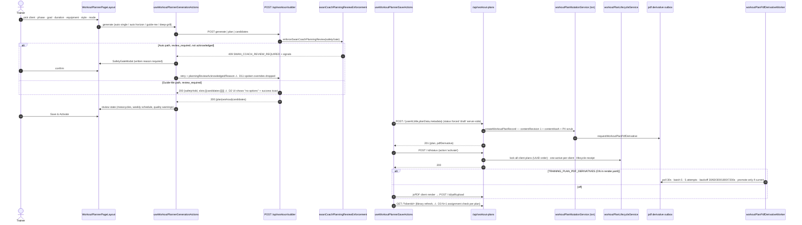

# 02 — WORKOUT PLANNER / PROGRAM BUILDER · Audit + Blueprint

**Ground truth:** `origin/main@3887c8ef`, read-only audit 2026-09-03; headline defects re-verified by direct file read this session. Shared protocol + bans: `10-CHECKPOINT-PROTOCOL-AND-BANS.md`. Builder starts at §E.
**Builds on (do not re-litigate):** `UNIFIED-WORKOUT-OS-FABLE-BLUEPRINT-2026-07-29.md` §12/§13 (C7 planner consolidation SHIPPED: Guided default + Power toggle, Forge retired, gold hoisted to `plannerGold.ts`), `WORKOUT-OS-C7-RECEIPT-2026-07-29.md` (the Client Hub Wizard was deliberately KEPT), `UNIFIED-BRAIN-WORKOUT-PLANNER-AUDIT-RECORD-2026-07-16.md` (AI drafts, human saves — server never writes plans from dictation), `SWAN-CORTEX-UNIFIED-BRAIN-MASTER-DIRECTIVE-2026-07-12.md` §5.3 (deterministic safety gate, 409 + acknowledged-review contract), `JARVIS-ULTIMATE-BLUEPRINT-2026-07-31.md` §4/§6 (the source of the dark IA-V2 / lens / template flags), `KIMI-WORKOUT-OS-REVIEW-2026-07-29.md` §1.1 (no mega-file decomposition on a schedule).

---

## §A — GROUND TRUTH

### A1. Canonical Surface Receipt (Rule 26)

| Part | Evidence |
|---|---|
| (a) Route mount | `frontend/src/routes/main-routes.tsx:936-944` `dashboard/*` → `UniversalDashboardLayout`. Role rows in `UniversalDashboardLayout.routes.tsx`: admin `:153` and trainer `:198` `/workout-planner → WorkoutPlannerPage`; admin `:146` `/workout-design-lab → WorkoutDesignLabPage` (admin only); redirects: `/build-plan` (admin+trainer), `/workout-forge` (trainer), `/workouts/:clientId?` (admin, preserves `clientId` as query) via `UniversalDashboardLayout.routeComponents.tsx:186-194, :214-218`; legacy `/workout-builder` → `main-routes.tsx:320-328` `LegacyWorkoutRedirect`. **No client-role row exists** — a client cannot reach the planner (`UniversalDashboardLayout.tsx:75-78`). |
| (b) Mounted JSX | `UniversalDashboardLayout.shellPieces.tsx:92-118` `<Component />`. Tree: `WorkoutPlannerPage.tsx:14-18` → `<WorkoutPlannerProvider><WorkoutPlannerPageLayout/>` → `WorkoutPlannerPageLayout.tsx:94-289` (LensFrame → CommandPanel `:98` → StatusAssistantStrip `:139` → three-panel region `:242-251` → SavedPlansSection `:254` → ConfirmDialog `:278` → SafetyGateModal `:279`). |
| (c) Consumer hooks | one spine `plannerContexts/useWorkoutPlannerOrchestration.ts:39-212` sliced into 4 contexts by `WorkoutPlannerProvider.tsx`; `useWorkoutPlannerGenerationActions.ts:95`, `useWorkoutPlannerGuidedCandidateActions.ts:45`, `useWorkoutPlannerSafetyGate.ts:54`, `useWorkoutPlannerSaveActions.ts:25`, `useWorkoutPlannerSavedPlansState.ts:26`, `useWorkoutPlannerLoadPlanActions.ts:188`, `useWorkoutPlannerRolodexState.tsx`, `useWorkoutPlannerCoachSurface.ts:38`. |
| (d) API literals | `plannerLogic/endpointFor.ts:6-7` `'/api/workout-builder/generate'`, `'/api/workout-builder/plan'`; `useWorkoutPlannerGuidedCandidateActions.ts:73` `'/api/workout-builder/candidates'`; `useWorkoutPlannerSavedPlansState.ts:67` `` `/api/workout-plans?clientId=` ``; `useWorkoutPlannerSaveActions.ts:98,129,162,272` create/PUT/status/template; `WorkoutPlannerBlendDialog.tsx:226` `'/api/workout-plans/blend'`; `WorkoutPlannerBackupPanel.tsx:123,149,169` backup/generate/promote; PDF `…/pdf`, `…/pdf/upload`. |
| (e) Backend match | `backend/core/routes.mjs:409` `/api/workout-plans` → `workoutPlanRoutes.mjs` (914 ln, 21 handlers); `:410` `/api/workout/plans` legacy alias (same router, mounted BEFORE `/api/workout` at `:411` — intent documented `:407-408`, ordering correct); `:437` `/api/workout-builder` → `workoutBuilderRoutes.mjs` (`router.use(protect)` `:152`, `authorize` `:159`, limiter 10/min/IP `:93-99,:160`). No overlapping sibling mounts on the touched paths. |
| (f) Model fields | **`WorkoutPlan`** (`backend/models/WorkoutPlan.mjs`, table `workout_plans`, deliberate hybrid casing documented `:39-45`): `id` UUID · `userId→'userId'` · `trainerId→'trainer_id'` · `title` · `description` · `nasmPhase→'nasm_phase'` 1–5 · `startDate→'start_date'` · `endDate→'end_date'` DATEONLY · `durationWeeks→'durationWeeks'` 1–52 def 4 · `status` ENUM(active,paused,completed,draft,archived) def `'active'` · `archivedAt/By` · `currentWeek→'current_week'` · `currentDay→'current_day'` · **`planData→'plan_data'` JSONB (the plan of record)** · `contentRevision→'content_revision'` · `contentHash→'content_hash'` /^[a-f0-9]{64}$/ · `progressNotes→'progress_notes'` JSONB · `createdBy→'created_by'` · `metadata` JSONB · `isTemplate→'is_template'` · `templateMeta→'template_meta'`. Indexes `:200-205`: userId, trainer_id, status, (userId,status). The partial unique index `workout_plans_one_active_per_user` the route relies on (`workoutPlanRoutes.mjs:81-83`) is **NOT declared in the model**. Model comment `:40-41` says the live table also carries `tags`, `difficulty`, `isPublic` — undeclared. **`WorkoutPlanCompletionReceipt`** (immutable, `updatedAt:false`, unique on `idempotency_key` and `daily_workout_form_id`). **`WorkoutPlanDay` / `WorkoutPlanDayExercise`** (camelCase, no `field:`) — a parallel normalized representation the planner does NOT use (see A2). **No `WorkoutPlanRevision` model/table exists** — revisioning is two columns + `workoutPlanRevisionService.mjs`. |

### A2. Surface classification (Rule 27)

| Surface | Class | Evidence |
|---|---|---|
| `admin-workout-planner/WorkoutPlannerPage` | **canonical** | routes `:153,:198` + JSX `shellPieces.tsx:96-113` |
| `WorkoutManagement/WorkoutPlanBuilder` (Client Hub → Training → "Build Plan") | **competing (LIVE)** | lazy `clients-team/tabs/TrainingTabSectionContent.tsx:21-22`, JSX `:85`; writes via `hooks/useWorkoutMcp.ts:110,:129,:134` to `/api/workout-builder/plan`, `/api/workout-plans`, `/status`. C7 KEPT it deliberately ("embedded guided lane"); the route table simultaneously claims Build Plan "moved to Workout Planner" — a live Rule 75 contradiction. |
| `workout-design-lab/WorkoutDesignLabPage` | canonical, different job | routes `:146`; showroom over a fake view model; writes only lens preference. Not a rival. |
| `/api/workout-plans` vs `/api/workout/plans` | canonical vs legacy alias | same router; the alias has one non-test consumer (below) |
| `frontend/src/services/workout-planner-service.ts` | **dead** | only `frontend/src/services/index.ts:25` re-exports it; zero importers (re-verified this session). Targets endpoints that do not exist: `/api/workout/plans/clone` `:92`, `/:planId/archive` `:106`, `/:planId/restore` `:120`. |
| IA-V2 fleet (`WorkoutPlannerV2Shell`, `CommandPanelV2`, `RolodexPanelV2`, `PlannerSaveBarBinding`, `WorkoutPlannerSaveBar`, `PlanVsActualStrip`, `plannerLogic/resolve*`) | dormant, flag-dark, headers say so | `WorkoutPlannerPageLayout.tsx:223-234`; `plannerIaV2Flag.ts:7-13` needs `VITE_ENABLE_PLANNER_IA_V2`, absent from `render.yaml` → OFF |
| Lens fleet (9 lenses + `PlannerLensSwitcher`) | dormant, flag-dark | `plannerLensFlag.ts:7-13`; flip condition self-declared `:5` ("conformance suite green across every registered lens") and `lens/conformance.test.tsx` exists |
| Templates | dormant, double-dark | write only from `PlannerSaveBarBinding.tsx:66` (IA-V2) AND `plannerTemplatesFlag.ts`; read `GET /?scope=templates` (`workoutPlanRoutes.mjs:105-115`) has zero consumers |
| `WorkoutPlanDay*` tables | legacy parallel writer | written by `backend/services/workoutService.mjs:1157,:1177,:1322,:1342`; read by `aiWorkoutController.mjs:264,:952,:1106,:1245`; creating migrations retired to `backend/migrations/retired-mjs-20260804/` |

### A3. File inventory — over-cap only (13 files); full inventory in the audit transcript

| Lines | File | Note |
|---|---|---|
| 1514 | `backend/services/workoutBuilderService.mjs` | generation core, 5× cap — decomposition DEFERRED (Kimi §1.1 class) |
| 1270 / 1113 / 662 / 306 | `WorkoutManagement/ClientSelection.tsx`, `ExerciseLibrary.tsx`, `WorkoutPlanBuilderStyles.ts`, `TrainingScheduleStep.tsx` | the competing builder — strangler target (P10) |
| 914 | `backend/routes/workoutPlanRoutes.mjs` | six handlers carry `// fallow-ignore-next-line complexity` |
| 429 | `backend/routes/workoutBuilderRoutes.mjs` | |
| 354 | `backend/services/workoutBuilderCandidateService.mjs` | |
| 333 / 332 / 325 / 302 / 302 | `LongHorizonScheduleView.parts.tsx`, `WorkoutPlannerBlendDialog.tsx`, `WorkoutPlannerCommandPanel.sections.tsx`, `SavedPlanCard.tsx`, `workoutPlanShapeService.mjs` | marginal |

Planner tree: 22,753 lines incl. tests; 91 frontend test files; 62 backend test files; 14 structure-fence tests enforce decomposition. Exactly ONE workaround marker in the whole surface (`PlannerSaveBarBinding.tsx:20`). Hex discipline: one raw literal in a print block (`lens/styles/blueprint/index.tsx:20`).

### A4. Runtime flow — generate → gate → save → activate → PDF



### A5. Surface map — live vs dark

```mermaid
flowchart TD
    A["/dashboard/admin|trainer/workout-planner"] --> B[WorkoutPlannerPage → Provider → PageLayout → LensFrame]
    B --> F{VITE_ENABLE_PLANNER_IA_V2?}
    F -- no (prod) --> G{VITE_ENABLE_PLANNER_LENS_STYLES?}
    F -- yes --> H[V2Shell · CommandPanelV2 · SaveBar · PlanVsActual — DARK]
    G -- no (prod) --> I[ThreePanel: Rolodex / Builder / Teach]
    G -- yes --> J[PlannerLensHost 10-lens registry — DARK]
    B --> K[CommandPanel]
    K --> L{generationMode default = guide_me}
    L -- auto --> M[POST /generate | /plan → 409 gate → modal]
    L -- guide_me / deep_grill --> O[POST /candidates → 200 even on safetyHold ⚠]
    M --> R[review] --> S[planDataBuilder → POST /api/workout-plans draft]
    O --> R
    S --> V[POST /:id/status activate] --> Y[SavedPlansSection: load/activate/rename/duplicate/archive/PDF]
    Y --> Z2[BackupPanel] & Z3[BlendDialog → new draft]
    B --> Z5[CoachDock AI_PLANNER_* + sequence rearrange/undo — human Save only]
    CH["Client Hub → Training → Build Plan (WorkoutPlanBuilder)"] -. competing writer .-> S
    CC["Swan Coach chat: delete_workout_plan"] -. no client-scope check ⚠ D1 .-> V
```

### A6. What works today (present tense)
- Roster + `?clientId=`/`?self=1`; three generation modes (Auto / Guide Me 4 / Deep Grill 6), **Guide Me default** for new operators (`plannerViewMode.ts:18`, persisted `ss.planner.view.v1`); single-workout and 1/4/12/26/39/52-week horizons; 6 goals, NASM phase 1–5, 7 categories, sessions/week, equipment profile, Base-NASM vs Hardcore + 8 methods.
- Deterministic safety gate with acknowledged-override contract (trainer/admin only, written reason, modal stays open on re-block) on the **Auto** path.
- Manual builder (add/remove/reorder/swap with 5-axis rolodex filters; sets/reps/tempo/rest/intensity/notes); long-horizon month→week→day drill-down with per-day swap; pure quality warnings.
- Save draft / Save & Activate / Update (optimistic concurrency via `expectedRevision` → 409 `WORKOUT_PLAN_REVISION_CONFLICT`) / Update & Activate; library load, activate, rename, duplicate (server, always draft), archive (blocked when only active plan), primary-arc select; blend (provenance in metadata, cross-client refused); AI backup plan generate/promote (transactional).
- PDF: async server derivative worker ON in prod, jsPDF fallback, upload, metadata attach, authenticated in-app stream (`GET /:id/pdf/content.pdf` — client owner may stream).
- Swan Coach dock (hidden from client role): dictated add/swap/remove/generate, NASM rearrange, one-level undo; server never persists from dictation.
- Deep links `?planId=`, `?mode=`, `?debateJobId=`, `?returnTo=`.

**Flags (production state):** `VITE_ENABLE_PLANNER_IA_V2` OFF · `workout-planner-pro` per-user TRUE (ANDed with the env flag) · `VITE_ENABLE_PLANNER_LENS_STYLES` OFF · `VITE_ENABLE_PLANNER_TEMPLATES` OFF · `TRAINING_PLAN_PDF_DERIVATIVES` **ON** (`render.yaml:76-77`) · `ENABLE_CLIENT_PLAN_SELFGEN` OFF (client roles 403) · `ENABLE_SUGGESTED_WORKOUTS` OFF (`GET /suggested/:clientId` 404).

**Planned / not wired (Rule 75):** Assign/Schedule from the SaveBar ("announced unavailable", `PlannerSaveBarBinding.tsx:70-74`); bulk discard; template browse/apply; org-wide template sharing (deliberately absent); mobile Program tab ("on its way", `WorkoutPlannerV2Shell.tsx:138-143`).

---

## §B — DATA CONTRACTS (file:line = where validated)

| Endpoint | Request (validated) | Response |
|---|---|---|
| `POST /api/workout-builder/generate` (`workoutBuilderRoutes.mjs:166-235`) | `clientId` int>0 req `:177-180` · `category` enum(7) else `full_body` `:186-188` · `equipmentProfileId` int|null `:203` · `exerciseCount` 1–20 def 6 `:189` · `rotationPattern` enum def `standard` `:187` · `primaryGoal` ∈ `ALLOWED_GOALS` else dropped `:193` · `nasmPhase` 1–5 else dropped `:106-110` · training style `:195` · `planningReviewAcknowledged` bool · `planningReviewReason` str | `200 {success, workout}` · `409 {code:'SWAN_COACH_REVIEW_REQUIRED', reviewRequiredSignals[], missingCriticalData[]}` `:216-224` · `400 …REASON_REQUIRED` · `500 {error, details}` (dictionary-mapped `:129-149`) |
| `POST /api/workout-builder/plan` (`:239-303`) | + `durationWeeks` 1–52 def 12 `:262` · `sessionsPerWeek` 1–7 def 3 `:263` · `startingPhaseOverride` 1–5 `:266` · `primaryGoal` def `general_fitness` `:261` | `200 {success, plan:{planSummary, mesocycles[], weeklySchedule[], recommendations[], weeks?[], rationale[]}}` |
| `POST /api/workout-builder/candidates` (`workoutBuilderCandidateRouteHandler.mjs:38-90`) | `clientId` /^\d+$/ req · `equipmentProfileId` must parse if present → 400 · `category` def full_body · `primaryGoal` def general_fitness · `nasmPhase` def 2 · `generationMode` · `candidateCount` mode-derived | `200 {success, candidates}` — **a safety block ALSO returns 200** with `safetyHold` + one slot `candidates:[]` (`workoutBuilderCandidateService.mjs:283-302`) |
| `GET /api/workout-plans` (`workoutPlanRoutes.mjs:101-148`) | `scope=templates` short-circuits `:107-115` · `userId|clientId`, `trainerId` strict positive int else 400 · `status` passthrough unvalidated · `isTemplate:false` forced · `limit 50` | `{success, plans[], count}` after `filterPlansByTrainerAssignment` `:141` |
| `GET /api/workout-plans/client/:userId` (`:165-262`) | `verifyClientAccessByUserId`; honors `X-Client-Timezone` `:212` | `{success, plan|null, currentSession, todayAssignment, trainingPlanCatalog, homeworkSummary, trainingDateContext}`; 404 when no plan and no catalog |
| `GET /api/workout-plans/:id` (`:294-305`) | `verifyClientAccessByPlanId` | `{success, plan, currentSession}` |
| `POST /api/workout-plans` (`:468-543`) | `userId` req unless `isTemplate` · `title` req · `nasmPhase` 1–5 `:484-489` · `planData` normalized + PII-scrubbed `:492` · `progressNotes`, `metadata` coerced + scrubbed · `templateMeta.tags` ≤12 · **`status` in body IGNORED — forced `'draft'` `:518`**; `currentWeek/Day` forced 1 | `201 {success, plan, pdfDerivative}` |
| `PUT /api/workout-plans/:id` (`:557-620`) | allowlist `title, description, nasmPhase, startDate, endDate, durationWeeks, currentWeek, currentDay, planData, progressNotes, metadata` `:571-575` · `status` → **400** `:562-567` · `expectedRevision` | `{success, plan, pdfDerivative}` · `409 {code:'WORKOUT_PLAN_REVISION_CONFLICT', currentRevision}` |
| `POST /api/workout-plans/:id/status` (`:705-712`) | `{action}` ∈ activate|pause|complete|archive (`workoutPlanLifecycleService.mjs:20-25`) | `{success, plan, pdfDerivative, lifecycleReceipt, trainingPlanCatalog}` · 409 `WORKOUT_PLAN_LIFECYCLE_CONFLICT` |
| `POST /:id/duplicate` `:740-783` · `PUT /:id/advance` `:802-876` (requires active, no `expectedRevision`) · `POST /blend` `:381-414` (`{planAId, planBId, picks[], title?}`; equal/missing → 400; cross-client → 400) · `POST /backup/:userId/generate` `:320-373` · PDF family `:634-685` | | |
| Coach `delete_workout_plan` (`commandRegistry/workoutCommands.mjs:201-212`) | `planId` uuid|int · `destructive`, `requiresConfirmation` · `roleRequired admin|trainer` · **`requiresClientRef:false`** | → `dispatchDeleteWorkoutPlan` (`workoutPlanCommandDispatchers.mjs:26-38`) → `transitionWorkoutPlanLifecycle(archive)` with NO ownership check |

---

## §C — DEFECTS / DRIFT / RISKS

| ID | Sev | Finding | Evidence (re-verified ✔ where marked) |
|---|---|---|---|
| **D1** | 🔴 HIGH | `delete_workout_plan` chat command archives ANY plan by id with no client-scope check. `commandExecutor.mjs:408` returns early when `!requiresClientRef`; dispatcher calls `transitionWorkoutPlanLifecycle` on `params.planId` directly. REST equivalent is protected by `verifyClientAccessByPlanId`. A trainer who knows a UUID of a client they are not assigned to can archive it via chat. `requiresConfirmation` is UX, not authz. | ✔ `workoutCommands.mjs:201-212`; `workoutPlanCommandDispatchers.mjs:26-38`; `commandExecutor.mjs:225,408` |
| **D2** | 🔴 HIGH | Guide-Me safety hold is invisible: server returns **200** with `safetyHold` and empty slots; frontend type has no `safetyHold` field (grep → zero hits in planner FE); panel renders `slot.instruction` only; success toast fires ("Swan Coach returned guided exercise options"). Because Guide Me is the DEFAULT mode, the most common path degrades a safety block into "the AI found nothing". Rule 75 copy contradiction. | ✔ `workoutBuilderCandidateService.mjs:283-302`; `WorkoutPlannerGuidedCandidateTypes.ts:39-54`; `WorkoutPlannerGuidedCandidatesPanel.tsx:80-82`; `useWorkoutPlannerGuidedCandidateActions.ts:89-92` |
| **D3** | 🟠 MED | N+1: `verifyClientAccess.mjs:282-287` loops `assertAssignmentOrAdmin` per plan (each a `ClientTrainerAssignment.findOne`); list fetches up to 50 → up to 50 sequential queries per library load. `listAssignedClientIds` already exists `:116-129`. | audit read |
| **D4** | 🟡 LOW `[LIKELY]` | Undeclared live columns `tags`, `difficulty`, `isPublic` per the model's own comment `WorkoutPlan.mjs:40-41`; reads return `undefined` silently (Rule 79 phantom read). No current caller. | model comment; DB not probed |
| **D5** | 🟠 MED | Partial unique index `workout_plans_one_active_per_user` relied on by `workoutPlanRoutes.mjs:81-83,:744-746` is not declared in the model `indexes` (`:200-205`). A fresh/sync environment silently loses the invariant. | model read |
| **D6** | 🟠 MED | `frontend/src/services/workout-planner-service.ts` is dead (only `services/index.ts:25` re-exports) and targets non-existent endpoints (`/clone`, `/archive`, `/restore`). Rule 77 trap. | ✔ grep |
| **D7** | 🟡 LOW | `composeBlendedPlanData` hardcodes `category:'full_body'` (`planBlendService.mjs:68`). | audit read |
| **D8** | 🟡 LOW | Client sends `status:'draft'` on create (`useWorkoutPlannerSaveActions.ts:104,:275`), server ignores; same body to PUT would 400. Contract noise. | audit read |
| **D9** | 🟡 LOW | Template scrub asymmetric: FE strips `notes` tree-wide (`scrubPlanTemplate.ts:29`, incl. per-exercise coaching notes); BE scrub (`workoutPlanDataPrivacyService.mjs:6-23`) does not list `notes`. Surfaces when templates go live. | audit read |
| **D10** | 🟡 LOW | `PUT /:id/advance` passes no `expectedRevision` (`:809-846`); safe today because completion marks are in `MUTABLE_PROGRESS_KEYS` (`workoutPlanRevisionService.mjs:24-33`) and it runs under a row lock — invariant depends on that list staying complete. | audit read |
| **D11** | 🟠 MED | Acknowledged safety-gate retry drops spoken overrides: `useWorkoutPlannerGenerationActions.ts:228` calls `postWorkoutGeneration(review.clientId, ack)` without the `overrides` arg the original call passes at `:257`. "Generate a legs day" → ack → dropdown category wins. | audit read |
| **D12** | (same root as D2) | success toast on the safety-hold non-result. | `useWorkoutPlannerGuidedCandidateActions.ts:89-92` |
| **D13/D14** | 🟡 | ~2,000 lines of IA-V2 + lens code built, tested, dark for weeks; drift risk. Lens flip condition is self-declared and checkable today. | headers + flags |
| **D15** | 🟡 LOW | `isViewerClient` branches (`useWorkoutPlannerClientState.ts:68`, `PageLayout.tsx:221`, `PlannerSaveBarBinding.tsx:47,:70-72`) are unreachable — no client route exists; code narrates a destination (Rule 75). | routes + `UniversalDashboardLayout.tsx:75` |
| **D16** | 🟠 MED (arch) | Two prescription sources of truth: `planData` JSONB (planner) vs `WorkoutPlanDay*` rows (`workoutService.mjs` writes, `aiWorkoutController.mjs` reads). `clientWorkoutRoutes.current.test.mjs:74-77` exists because an invalid include once broke the client read path. | audit read |
| **D17** | 🟠 MED | Competing writer: Client Hub `WorkoutPlanBuilder` still mounted (`TrainingTabSectionContent.tsx:21-22,:85` ✔) while the route table says Build Plan "moved to Workout Planner" — Rule 75 contradiction + two codebases writing `workout_plans`. | ✔ grep |
| **A11y** | 🟡 `[LIKELY]` | No `aria-live` on `WorkoutPlannerStatusAssistantStrip` — generation failures/gate outcomes unannounced. | grep absence |

**Test gaps:** no test that `delete_workout_plan` is client-scoped (D1); no FE test consuming `safetyHold` (D2); no test that overrides survive the ack retry (D11); no end-to-end `planDataBuilder → normalizeWorkoutPlanDataForPersistence → hashWorkoutPlanContent` round-trip (both sides mock the boundary — Rule 79 class); no viewport test at the Rule 24 widths; no test for D3/D4/D5.

---

## §D — TARGET DESIGN (only what this program changes)

### D1. Guide-Me safety hold surfaced (slice P2) — three-panel layout, Builder panel, 1440 and 375
```
┌─ Guided candidates ───────────────────────────────────────────────┐
│ ⚠ Safety review pending for this client                           │  <- NoticeLane-style band, var(--train-coach) border
│ Swan Coach can't suggest exercises until the review is complete.  │     (purple = Coach ONLY per train-tokens)
│ Signals: active pain entry · missing readiness                     │  <- reviewRequiredSignals as chips (enum → label map)
│                                   [ Review now ]  [ Use Auto mode ]│  <- 44px; Review now opens the SAME SafetyGateModal
└───────────────────────────────────────────────────────────────────┘
```
- Exact copy: title `Safety review pending for this client`; body `Swan Coach can't suggest exercises until the review is complete.`; buttons `Review now`, `Use Auto mode`. No success toast on a hold; the toast copy becomes `Swan Coach paused suggestions — safety review pending.` (warning tone).
- `Review now` reuses `openSafetyGateReview` with a `mode:'candidates'` review state so the acknowledged retry re-POSTs `/candidates` with `planningReviewAcknowledged` + reason (server already accepts these on `/generate`; **P2 step 3 extends the candidates handler to honor the same two fields** — additive).
- On 375px the band spans full width above the slots; buttons stack vertically, each 44px.

### D2. Assign / Schedule from the SaveBar (slice P8) — active, clean plan; 1440
```
┌─ Save bar ───────────────────────────────────────────────────────────────┐
│ ● Active · Rev 3 · saved 2m ago              [ Assign / Schedule ] [ ⋯ ] │  <- primary = blue bg → purple glow
└──────────────────────────────────────────────────────────────────────────┘
        ↓ opens inline sheet (no route change)
┌─ Schedule this plan ─────────────────────────────────┐
│ Client: <name from roster>                            │
│ Start  [ Mon Sep 8 ▾ ]   Days  [M][W][F]  ✓ 3/wk     │  <- day chips 44px; default = plan's sessionsPerWeek
│ Sessions to book   [ 12 ]  (plan = 4 wk × 3)          │
│ ○ Book as trainer sessions (uses client credits)      │  <- DEFAULT when client has credits
│ ● Assign as homework (no credit)                      │  <- DEFAULT when client has 0 credits
│                          [ Cancel ]  [ Schedule 12 ]  │
└──────────────────────────────────────────────────────┘
```
- Writes through the EXISTING scheduling API only (`/api/sessions` family, `routes.mjs:417-419`) — no new booking path; assignment key from `workoutPlanAssignmentIdentityService.mjs`. Billing untouched: booking a trainer session uses the existing session-credit path; homework assignment writes `plannedAssignment` metadata only. **SEAN-GATE** before push (touches scheduling + credits adjacency).

### D3. Template picker (slice P9) — CommandPanel top, both widths
```
[ Start from ▾ ]  Blank · My templates (N) · Recent plans (N)
   └─ sheet: search + tag chips + cards (name · phase · weeks · last used)  [ Use template ]
```
Hydration reuses `workoutPlannerLoadPlanHydration.ts`; `userId` replaced with the selected client on apply; scrubbed notes (D9) reconciled first.

---

## §E — NUMBERED SLICES

Every slice: receipt → RED tests → build → dry-loop → `npx vitest run src/components/DashBoard/Pages/admin-workout-planner` + backend targeted files + `tsc` + `vite build` + Rule 42 → local commit → §10 package → STOP.

### P1 — Client-scope the `delete_workout_plan` command (D1) · **S** · backend · no flag
1. RED: `backend/tests/unit/workoutPlanCommandDispatcher.authz.test.mjs` — trainer NOT assigned to the plan's `userId` → dispatcher returns a refusal outcome (same shape the REST 403 uses) and `transitionWorkoutPlanLifecycle` is NOT called; assigned trainer → archived; admin → archived.
2. In `dispatchDeleteWorkoutPlan`: `const plan = await WorkoutPlan.findByPk(planId)`; 404-shaped refusal if missing; `await assertAssignmentOrAdmin(ctx.user.id, ctx.user.role, plan.userId)` (import from `backend/middleware/verifyClientAccess.mjs`) before transitioning. Keep `requiresClientRef:false` (the plan id is the ref) — the check lives in the dispatcher.
3. Extend `workoutPlanCommandDispatcherContract.test.mjs` with the negative case.
**Accept:** RED→GREEN pasted; existing dispatcher + lifecycle suites green; no route change.
STOP.

### P2 — Surface the Guide-Me safety hold (D2, D12) · **S/M** · full-stack · no flag
1. RED (FE): `useWorkoutPlannerGuidedGenerationActions.test.tsx` — a 200 with `safetyHold` sets `guidedSafetyHold` state, fires the warning toast copy from §D1, and does NOT fire the success toast; `WorkoutPlannerGuidedCandidatesPanel.test.tsx` — renders the band with signals chips + two 44px buttons; `Review now` calls `openSafetyGateReview({mode:'candidates', …})`.
2. Types: add `safetyHold?: {reason:string; instruction:string}`, `reviewRequiredSignals?: string[]` to `WorkoutGuidedCandidatesResponse`; map in `workoutPlannerGuidedCandidates.helpers.ts:59-62`.
3. BE (additive): `workoutBuilderCandidateRouteHandler.mjs` reads `planningReviewAcknowledged` + `planningReviewReason` and passes them to `generateWorkoutCandidates`; the service skips `heldResponse('safety_review_required')` when `enforceSwanCoachPlanningReview` accepts the acknowledgement (reuse the same enforcement service; trainer/admin only; empty reason → 400 same code). RED supertest in `workoutBuilderCandidateSafety.test.mjs`: hold without ack; pass with ack + reason; 400 with ack + empty reason.
4. **DEFAULT DECISION (§G Q1):** keep the 200 + `safetyHold` wire shape (additive fields) — do NOT switch to 409; changing the status is a contract change with no benefit once the UI consumes the hold.
5. New band component `WorkoutPlannerGuidedSafetyBand.tsx` (≤90 lines) so `GuidedCandidatesPanel.tsx` stays <300.
**Accept:** FE tests + BE tests green with counts; screenshots 375 + 1440 of the band; tap count: hold → review → confirm = 2 taps.
STOP.

### P3 — Preserve spoken overrides through the safety retry (D11) · **S** · frontend
Carry `overrides` into `SafetyGateReviewState` (`useWorkoutPlannerSafetyGate.ts:11-16`) and pass them at `useWorkoutPlannerGenerationActions.ts:228`. RED test: dictated `category:'legs'` → 409 → ack → retry body carries `category:'legs'`.
STOP.

### P4 — Fix the N+1 (D3) · **S** · backend
Replace the per-plan loop in `verifyClientAccess.mjs:270-289` with one `listAssignedClientIds` call + in-memory filter, preserving the fail-closed throw-vs-empty distinction documented at `:126-129`. RED: a spy on `ClientTrainerAssignment.findOne`/`findAll` proves ≤2 queries for 50 plans; existing `filterPlansByTrainerAssignment` behavior tests green.
STOP.

### P5 — Declare the DB backstops (D4, D5) · **S** · backend · `SEAN-GATE` only if a migration is proposed
1. Rule 58 probe (paste): `SELECT indexname, indexdef FROM pg_indexes WHERE tablename='workout_plans'` and `SELECT column_name, data_type FROM information_schema.columns WHERE table_name='workout_plans' ORDER BY ordinal_position`.
2. If the partial unique index exists in prod: declare it in `WorkoutPlan.mjs` `indexes` (`unique:true, where:{status:'active'}` on `userId`) so the model documents the invariant; if it does NOT exist: STOP and propose the migration (dedupe plan first).
3. Declare `tags`, `difficulty`, `isPublic` ONLY if the probe shows them; otherwise delete the stale comment at `:40-41` (Rule 75).
**Accept:** probe receipt; `workoutPlanRoutes.mounted.test.mjs` + model tests green.
STOP.

### P6 — Quarantine `workout-planner-service.ts` (D6) + truth fixes (D8, D15) · **S** · `SEAN-GATE` for the move
1. Propose `frontend/src/services/workout-planner-service.ts` → `archive/pending-deletion/<date>/frontend/src/services/` + remove the re-export at `services/index.ts:25` + `MANIFEST.md` row with the grep receipt. Execute after Sean's yes.
2. Stop sending `status` on create (`useWorkoutPlannerSaveActions.ts:104,:275`); payload test RE-ANCHOR row.
3. Add a one-line header to the `isViewerClient` branches stating "unreachable today — no client route; kept as defense-in-depth" (Rule 75) — BUILDER-CHOICE to remove instead if `WorkoutPlannerPageLayout.tsx` needs the lines.
STOP.

### P7 — End-to-end `planData` round-trip test + `aria-live` · **S** · test + a11y
1. NEW `backend/tests/unit/planDataRoundTrip.test.mjs` that imports the REAL FE builder output fixture (`planDataBuilder.testFixtures.ts` — export a JSON snapshot for node) and runs it through `normalizeWorkoutPlanDataForPersistence` → `hashWorkoutPlanContent`, asserting `weeks[]`, `mesocycles`, `recommendations`, `rationale` survive and the hash is stable. Closes the both-sides-mocked gap.
2. `WorkoutPlannerStatusAssistantStrip.tsx:107`: wrap the message in `role="status" aria-live="polite"`; test asserts the attribute.
STOP.

### P8 — Assign / Schedule from the SaveBar (§D2) · **M** · full-stack · flag `VITE_ENABLE_PLANNER_IA_V2` stays the switch (the SaveBar only exists in IA-V2) — **this slice therefore also runs the IA-V2 Rule-24 viewport QA and proposes the flag flip** · `SEAN-GATE` before push
1. RED: sheet renders defaults per §D2 (homework default when credits = 0; trainer-session default otherwise); `Schedule N` posts N session bookings through the EXISTING sessions API client and one `plannedAssignment` metadata PUT; zero new backend routes (source-contract test: no new `router.post` in `workoutPlanRoutes.mjs` for this slice).
2. `PlannerScheduleSheet.tsx` (≤200) + `usePlannerScheduleActions.ts` (≤120); `PlannerSaveBarBinding.tsx:70-74` announces the real action.
3. IA-V2 QA: screenshots at 320/375/414/768/1024/1280/1440/1920/2560×1440/3840×2160 for the V2 shell; conformance tests green; **propose** adding `VITE_ENABLE_PLANNER_IA_V2=true` to `render.yaml` in the checkpoint package (Sean flips).
STOP.

### P9 — Template library browse + apply (§D3) · **M** · full-stack · flag `VITE_ENABLE_PLANNER_TEMPLATES`
1. Reconcile D9 first: make the BE scrub the single source (add `notes` handling that strips ONLY plan-level/personal notes, keeps per-exercise coaching notes) and have the FE call it via the same key list exported from one module (duplicated-value class → one declaration in `shared/` or a generated constant). RED tests on both sides against one fixture.
2. Consumer for `GET /api/workout-plans?scope=templates` → `usePlannerTemplates.ts`; picker sheet per §D3; apply = hydrate via `workoutPlannerLoadPlanHydration.ts` with `userId` = selected client, `loadedPlanId` = null (a template apply creates a NEW draft on save).
3. Flip `VITE_ENABLE_PLANNER_TEMPLATES` proposal in the package.
**Accept:** template round-trip test (save template → list → apply → save draft) with PII assertions (no client ids/names in the template row — supertest reads the persisted JSONB); tap count: blank → template applied = 3 taps.
STOP.

### P10 — Strangler: retire the Client Hub `WorkoutPlanBuilder` (D17) · **L** · one component per PR · `SEAN-GATE`
1. Capability inventory FIRST (Kimi 2.3 law): table of every field/step in `WorkoutManagement/*` (ClientSelection, PlanDetails, ExerciseSelection, TrainingSchedule, ReviewSave) vs its planner equivalent; anything missing in the planner is built in the planner BEFORE any retirement.
2. Replace the Client Hub "Build Plan" mount (`TrainingTabSectionContent.tsx:85`) with a deep link into the canonical planner carrying `?clientId=&returnTo=` (the redirect pattern already exists for `/build-plan`).
3. Grep-zero-consumer receipts for each of the 14 `WorkoutManagement/*` files → `archive/pending-deletion/` proposals; execute per Sean.
**Accept:** every inventoried capability has a planner test; Client Hub tab test updated (RE-ANCHOR rows); 4 over-cap files leave the working tree.
STOP.

**Order:** P1 → P2 → P3 → P4 → P5 → P6 → P7 → P8 → P9 → P10. P1+P2 are the safety pair and ship first; P8/P9 are the biggest coaching-loop wins; P10 is the consolidation the Workout OS blueprint left open.

**Deliberately NOT in this program:** decomposing `workoutBuilderService.mjs` (1,514) — Kimi §1.1 class, extract only along seams a slice needs; retiring `WorkoutPlanDay*` (D16) — needs its own canonical-surface receipt because `workoutService.mjs` still writes them.

---

## §F — TEST MATRIX

| Slice | Test | Proves |
|---|---|---|
| P1 | `workoutPlanCommandDispatcher.authz.test.mjs` | unassigned trainer refused; assigned/admin archive; lifecycle not called on refusal |
| P2 | `useWorkoutPlannerGuidedGenerationActions.test.tsx` (+hold), `WorkoutPlannerGuidedSafetyBand.test.tsx`, `workoutBuilderCandidateSafety.test.mjs` (+ack) | hold rendered, no success toast, ack path works, 44px |
| P3 | `useWorkoutPlannerGenerationActions.safetyGate.test.tsx` (+overrides) | retry body carries spoken category |
| P4 | `verifyClientAccess.filterPlans.test.mjs` (spy) | ≤2 queries for 50 plans; fail-closed preserved |
| P5 | probe receipt + model index test | invariant declared where it exists |
| P6 | `useWorkoutPlannerSaveActions.test.tsx` (RE-ANCHOR: no `status` on create) | contract noise removed |
| P7 | `planDataRoundTrip.test.mjs`, strip a11y test | real cross-boundary round-trip; status announced |
| P8 | `PlannerScheduleSheet.test.tsx`, `usePlannerScheduleActions.test.tsx`, source-contract (no new routes) | defaults, N bookings, zero new backend surface |
| P9 | template round-trip supertest + shared scrub fixture tests | PII-free template; apply hydrates |
| P10 | capability-inventory tests in planner; Client Hub tab test | nothing lost before deletion |
| all | 14 structure-fence tests + `WorkoutPlannerStyles.lineCap.test.ts` | Rule 4 holds |

---

## §G — DECISIONS PRE-MADE FOR THE BUILDER

| # | Question | Default | Why |
|---|---|---|---|
| Q1 | Guide-Me hold: 200+`safetyHold` or 409? | keep **200 + additive fields** | UI consumes the hold; no contract break for other callers |
| Q2 | Where does the D1 check live? | in the dispatcher via `assertAssignmentOrAdmin` | mirrors the REST guard; registry stays `requiresClientRef:false` (plan id IS the ref) |
| Q3 | IA-V2 flag flip | proposed in P8's package after the Rule-24 QA; Sean flips `render.yaml` | Vite env is build-time; Sean owns prod flags |
| Q4 | Templates: who scrubs? | backend is the single scrub; FE reuses the exported key list | one declaration (duplicated-value class) |
| Q5 | Assign/Schedule billing | trainer-session booking uses the EXISTING credit path; homework = metadata only; no new billing code | BAN B9 adjacency; SEAN-GATE on push |
| Q6 | `WorkoutPlanBuilder` fate | strangler → planner deep link, one component per PR | Kimi "nav change first, deletion last" |
| Q7 | Blend `category` (D7) | leave as-is, document | metadata only; matches the multi-week forcing rule |
| Q8 | `workoutBuilderService.mjs` split | **No** | Kimi §1.1 |

**Sean-owned items riding along:** the `/api/workout` vs `/api/workout/sessions` dual-implementation call (`WORKOUT-SESSIONS-DUAL-IMPLEMENTATION-DIFF-2026-07-30.md`, unactioned); `WorkoutPlanDay*` wire-or-document decision (recommended: document dormant); JARVIS S14–S24 planner spine (why ~2,000 lines are dark).
