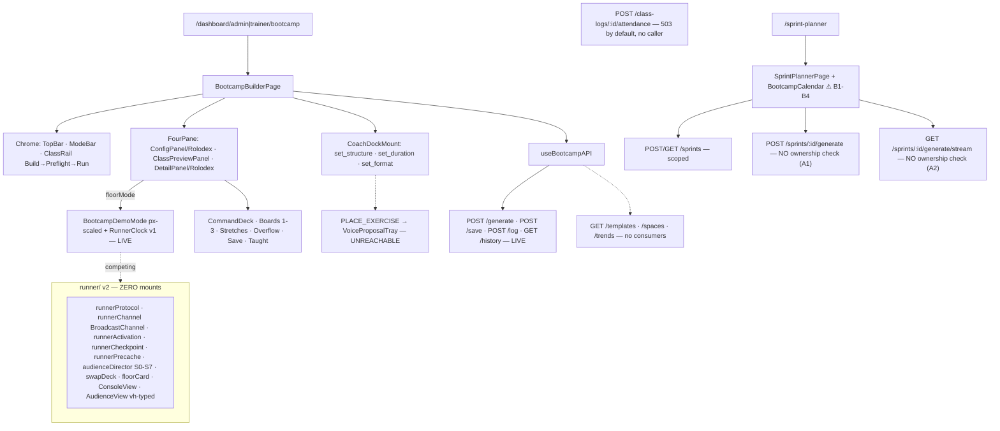

# 04 — BOOT CAMP CREATOR · BUILDER + RUNNER + SPRINT PLANNER · Audit + Blueprint

**Ground truth:** `origin/main@3887c8ef`, read-only audit 2026-09-03; the two P0 findings and the runner dormancy were re-verified by direct file read this session. Shared protocol + bans: `10-CHECKPOINT-PROTOCOL-AND-BANS.md`. Builder starts at §E.
**Builds on (do not re-litigate):** `BOOTCAMP-V2-CANONICAL-SURFACE-RECEIPT-2026-08-01.md` (one page, one alias, one library path, one persistence model — still true; its line numbers are stale), `BOOTCAMP-V2-KIMI-SECURITY-2026-08-03.md` (F2/F3/F4/F6a shipped; F1 half-shipped; F5/F6c open), `BOOTCAMP-V2-OPUS5-PRODUCT-2026-08-03.md` (zero of its top five shipped — this blueprint schedules them), `SWAN-CORTEX-UNIFIED-BRAIN-MASTER-DIRECTIVE-2026-07-12.md` §11 (bootcamp adapter consumes the shared Cortex; kill the `nasmPhase` constant; class-wide impact budget; real format engines; anonymous constraint aggregation).

---

## §A — GROUND TRUTH

### A1. Canonical Surface Receipt (Rule 26)

| Part | Evidence |
|---|---|
| (a) Route mount | `UniversalDashboardLayout.routes.tsx:155` (admin) and `:206` (trainer) `/bootcamp → BootcampBuilderPage`; `:161`/`:208` `/sprint-planner → SprintPlannerPage`; protected aliases `main-routes.tsx:678-686` `/bootcamp-builder` and `:690-698` `/sprint-planner` (`allowedRoles ['trainer','admin']`). Lazy decls `routeComponents.tsx:88-89`. |
| (b) Mounted JSX | `BootcampBuilderPage.tsx:207-288` returns the tree; `:289` `BootcampBuilderPageWithBoundary` = ErrorBoundary → LensFrame → Page; `:290` default export. Tree: `BootcampBuilderChrome` (TopBar + PDF + TeachMe, ModeBar ai|manual|hybrid, `BootcampClassRail`) → `FourPane` (`BootcampLeftPanel` ConfigPanel/Rolodex · `ClassPreviewPanel` → `BootcampDemoMode` in floorMode, `BootcampCommandDeck`, `ExplanationsStrip`, `ClassPreviewMainBoard` + `BootcampSlotActionBar`, `ClassPreviewAlternatives`, `BootcampTaughtPanel` · `BootcampRightPanel` ExerciseDetailPanel/Rolodex) → `BootcampCoachDockMount` (stage ≠ run). |
| (c) Consumer hooks | `useBootcampAPI` (`frontend/src/hooks/useBootcampAPI.ts:60`), `useBootcampTaughtLog` (`:62`), `useBootcampWorkflowStage`, `useBootcampSlotActions`, `useBootcampAiEvents` (`CoachDock/BootcampCoachDockMount.tsx:45`), `useBootcampRunner` (`BootcampRunnerClock.tsx:41`), `useExerciseSearch` (Rolodex), `useEquipmentAPI`, `useSprintAPI` (`SprintPlannerPage.tsx:29,49`). |
| (d) API literals | `useBootcampAPI.ts:80` `/api/bootcamp/generate` · `:88` `/save` · `:102` `/templates` (no UI consumer) · `:120` `/log` · `:132` `/history` · `:138,:152` `/spaces` (no consumer) · `:163,:169` `/trends*` (no consumer). `useSprintAPI.ts:110,127,144,161,178` `/api/bootcamp/sprints[/:id]` · `:234` `/:id/generate/stream` · `:256` `/:id/generate` · `:283` `/slots/:slotId/confirm` · `:301` `/slots/:slotId/regenerate`. |
| (e) Backend match | `backend/core/routes.mjs:439` `/api/bootcamp → bootcampRoutes.mjs` (router-level `protect` `:41` + `authorize(['admin','trainer'])` `:42`; 11 handlers); `:440` `/api/bootcamp/sprints → sprintRoutes.mjs` (identical router-level guards `:56-57`). Rule 31 overlap: the sprint prefix enters `bootcampRoutes` first, matches nothing, falls through — no shadowing today; **any future divergence of `bootcampRoutes`' router-level `authorize` list silently becomes the effective gate for the whole sprint API.** |
| (f) Model fields | **`BootcampTemplate`** (`backend/models/BootcampTemplate.mjs:23-131`, table `bootcamp_templates`, camelCase, no `field:`): `id, trainerId→Users, name, description, classFormat ENUM(37), targetDurationMin, demoDurationMin, clearDurationMin, dayType, difficultyBase, equipmentProfileId, spaceProfileId, maxParticipants, optimalParticipants, isActive, tags, aiGenerated, lastUsedAt, timesUsed, metadata, classStyle ENUM(12), intensityCategory, rounds, exerciseDurationSec, includeStretch, stretchDurationMin`. **`BootcampClassLog`** (`bootcamp_class_log`, `updatedAt:false`): `id, templateId, trainerId, classDate DATEONLY, dayType, actualParticipants, overflowActivated, exercisesUsed JSONB NOT NULL, modificationsMade, trainerNotes, classRating, energyLevel, attendance JSONB nullable` (migration `20260803000100`). **`BootcampExercise.board`** ENUM(`main`,`alternative`,`lowImpact`) — frontend `BoardView` `jointFriendly` is a label over `alternative`. Enum cross-check (Rule 29): `classFormat` 5+32 = 37 ✔; `classStyle` 4+8 = 12 ✔; `lowImpact` added by `20260526000200` ✔. **No drift.** |

### A2. Surface classification (Rule 27)

| Surface | Class | Evidence |
|---|---|---|
| `BootcampBuilderPage` + `/bootcamp-builder` alias | **canonical** | A1 |
| `BootcampDemoMode` + `useBootcampRunner` + `BootcampRunner.logic.ts` + `BootcampRunnerClock` | **canonical runner v1 (live)** | `ClassPreviewPanel.tsx:79` → `BootcampDemoMode.tsx:11` |
| `frontend/src/components/BootcampBuilder/runner/**` (13 files, ~1,566 ln: `runnerProtocol`, `runnerChannel`, `runnerActivation`, `runnerCheckpoint`, `runnerPrecache`, `audienceDirector`, `swapDeck`, `floorCard`, `ConsoleView`, `AudienceView`, …) | **DORMANT — competing runner v2, ZERO mounts** | ✔ re-verified: no importer outside `runner/` and its tests anywhere under `BootcampBuilder/`, `DashBoard/`, `routes/`, `pages/`. The "slice 11 shell" its headers name as parent does not exist. Rule 77 trap of the worst kind. |
| `SprintPlannerPage` + `BootcampCalendar` | adjacent canonical | routes `:161,:208`; `SprintPlannerPage.tsx:249` |
| `POST /class-logs/:id/attendance` | dormant (503 unless `SWAN_BOOTCAMP_ATTENDANCE_ENABLED==='true'`; zero frontend callers) | `bootcampRoutes.mjs:206-215` |
| `GET /templates`, `GET|POST /spaces`, `PUT /spaces/:id`, `GET /trends`, `POST /trends/:id/approve`, `GET /exercises` | dormant (zero consumers) | ✔ grep for `getTemplates`/`loadTemplate` outside the hook + tests → none |
| `AI_BOOTCAMP_PLACE_EXERCISE` + `BootcampVoiceProposalTray` (109 ln) | dormant (unreachable: no `bootcamp_place_exercise` in the registry; dispatched only by tests) | `bootcampCommands.mjs:12-72` (3 commands) |
| `AI_BOOTCAMP_LOAD_TEMPLATE` | dormant — permanent `ack(e,false)` | `useBootcampAiEvents.ts:128` |

### A3. Over-cap files (Rule 4)
`bootcampGenerator.mjs` **965** · `SprintPlannerStyles.ts` **586** · `bootcampRoutes.mjs` **418** · `classStyleModifiers.mjs` **328** · `ExerciseDetailPanel.tsx` **312** · `bootcampCrud.mjs` **305** · at cap: `BootcampBuilderStyles.ts` 300, `sprintService.mjs` 299. Shared isomorphic core `shared/bootcamp-core/` (13 modules, all under cap). Hex discipline clean (362 hex, all inside `var()`); raw `rgba()` in 6 style files (`Audience.styles.ts:138` is an untokenized Ice Wing).

### A4. Runtime flow — configure → generate → save → taught (live)

```mermaid
sequenceDiagram
    autonumber
    actor T as Trainer
    participant P as BootcampBuilderPage
    participant H as useBootcampAPI
    participant R as bootcampRoutes.mjs
    participant G as bootcampGenerator
    participant X as exerciseRolodexBridge (raw SQL on "Exercises")
    participant D as dayTypeContract + runLadder
    participant B as bootcampBrain (heuristic default)
    participant DB as PostgreSQL

    T->>P: stations · dayType · duration · equipment profile · optPhase ⚠ dropped by route (D4)
    P->>P: seed empty GeneratedBootcamp (:49-79) — never blank
    T->>P: Generate
    P->>H: generateClass({…, exclusionKeys})
    H->>R: POST /api/bootcamp/generate — clamp every input (:87-98)
    R->>G: generateBootcampClass({trainerId, requesterRole, …})
    G->>DB: 14-day freshness names from BootcampClassLog (:828)
    G->>DB: EquipmentProfile + assertProfileAccess (:298-304) → 403 BOOTCAMP_PROFILE_ACCESS_DENIED
    G->>X: queryExercisesForBootcamp({muscles, equipment, excludeNames})
    Note over X: .catch(() => []) — schema drift returns an EMPTY pool silently (F1)
    G->>D: applyDayTypeContract → ladder R0→R3→R5→R6 (per-item selectionRung)
    Note over D: hardFilter: () => true — rejectedByFloor always 0 (F3); freshness starvation reported as EQUIPMENT relaxation (F2)
    G->>B: orderPoolWithBrain — heuristic; LLM only if SWAN_BOOTCAMP_BRAIN='llm' (tokenized ex_0..N)
    G-->>R: GeneratedBootcamp (stations, boards 1-3, stretches, overflow, explanations)
    R-->>P: 200 {bootcamp}
    T->>P: Save as Template
    P->>H: POST /save {generatedClass}
    Note over R,DB: no schema validation, no array caps (A4); equipmentProfileId/spaceProfileId NOT persisted (D5); nothing reads templates back (D1)
    T->>P: Mark as Taught
    P->>H: POST /log {classDate LOCAL, exercisesUsed} — templateId never sent (D2)
    R->>DB: BootcampClassLog.create → the ONLY input to the freshness engine
```

### A5. Live vs dormant map



### A6. Runner v2 state machine (dormant design — documented so mounting it is a mechanical decision)

```mermaid
stateDiagram-v2
    [*] --> Idle
    Idle --> Resuming: loadCheckpoint (localStorage swan.bootcamp.runner.*.v1)
    Resuming --> Idle: planId mismatch / unparseable → clear
    Resuming --> Running: absolute epochs → resume in place
    Idle --> Activating: Start Class (one gesture: fullscreen + audio + video + wakeLock)
    Activating --> Publishing: createRunnerState(planId, now)
    Publishing --> Running: console publishes full state + plan over BroadcastChannel
    state Running {
      Live --> Paused: PAUSE (baseSeq==seq)
      Paused --> Live: RESUME (shiftMs += paused)
      Live --> Live: SKIP / PREV / EXTEND_60 (clamped at segment start)
      Live --> Stale: baseSeq != seq → reason resync, no side effect
    }
    Running --> Checkpointed: every change → sync localStorage write (⚠ setItem not try/caught — A5)
    Running --> AudienceMirror: receiver applies only seq > lastSeq; never rewinds
    Running --> Ended: END_CLASS → clearCheckpoint
    note right of AudienceMirror: BroadcastChannel = same origin AND same browser instance. A TV, Chromecast or second device never receives it (E1).
```



### A7. What works today (present tense)
Builder: 3 modes; config 1–6 stations × 1–5 exercises, 5 day types, 12 styles, 6 intensities, OPT phase 1–5 (**UI only — dropped server-side**), duration, participants, name, equipment profile, stretch toggle; live timing with >55-min alert; Rolodex with 5 filter axes + equipment-profile narrowing; slot duplicate/move/remove (44px, aria-labels); Boards 1/2/3; stretches; overflow plan; flow meter; Class Rail (Build→Preflight→Run with blockers/warnings/primary action); Command Deck readiness 0–100; Save as Template (write-only); PDF; Mark as Taught → freshness engine; Teach Me.
Floor v1: wake lock + audio cues; station grid; media stage + depth-video modal; director rail (44px); runner clock (aria-live, progress, slip badge, pause/resume/skip/restart, per-segment cue); ≥2200px scaling tier.
Generation: live `"Exercises"` pool; 14-day freshness; day-type contract + relaxation ladder with per-item rung; provable chips; equipment quantities + feasibility warnings; small-class collapse; day-aware finishers; low-impact quality gate; aggregate (never per-participant) pain-aware gating; 12 class styles; overflow; deterministic heuristic brain; equipment-profile IDOR gate.
Sprint Planner: create, month calendar with day-type dots, slot detail, confirm-taught, single-slot regenerate, SSE full generation with `Last-Event-ID` reconnect.
Voice: 3 FRONTEND_DISPATCH commands, client re-validation, honest refusal, real Undo payloads.
Flags: `SWAN_BOOTCAMP_ATTENDANCE_ENABLED` (OFF) · `SWAN_BOOTCAMP_BRAIN` (heuristic) · `SWAN_BOOTCAMP_BRAIN_PROVIDER_MODULE` · `SWAN_BOOTCAMP_BRAIN_TIMEOUT_MS` (8000, clamp 1–30 s). No `VITE_*` flags on this surface.

---

## §B — DATA CONTRACTS

| Endpoint | Validation (file:line) | Response |
|---|---|---|
| `POST /api/bootcamp/generate` (`bootcampRoutes.mjs:61`) | `classFormat` whitelist `:88` · `stationCount` 1–6 `:89` · `exercisesPerStation` 1–5 `:90` · `classStyle` whitelist(12) · `dayType` whitelist(5) `:91` · `intensityCategory` whitelist(6) · `targetDuration` 20–90 `:92` · `expectedParticipants` 1–50 `:93` · `equipmentProfileId` parseInt · `name` ≤200 · `includeStretch` · `stretchDurationMin` 1–10 · `exclusionKeys` ≤100 × ≤200 chars `:94-98` · **`optPhase` NOT destructured (`:63-69`) — silently dropped** | `200 {success, bootcamp: GeneratedBootcamp}` · `403 {code:'BOOTCAMP_PROFILE_ACCESS_DENIED'}` · `500` |
| `POST /save` (`:130`) | `if (!generatedClass)` only; stations/stretches/overflow spread into `bulkCreate`/`create` unvalidated and uncapped (`bootcampCrud.mjs:144-146,200-213`); exercises ARE whitelisted `:157-193`; `equipmentProfileId`/`spaceProfileId` not written | `200 {success, templateId}` |
| `GET /templates` (`:146`) | `classFormat`, `dayType` whitelists; `limit` ≤50 | `{success, templates[+stations→exercises+overflow]}` — zero consumers |
| `POST /log` (`:162`) | `classDate` req · `exercisesUsed` non-empty req · `templateId?` · `trainerNotes` ≤2000 · `classRating` 1–5 · `energyLevel` enum | `{success, logId}`; emits `bootcamp:classLogged`. Frontend never sends `templateId`. |
| `GET /history` (`:284`) | `dayType` whitelist · `limit` ≤50 · `offset` ≥0 | `{success, logs, total}` |
| `POST /class-logs/:id/attendance` (`:206`) | 503 unless flag · `attendees[{userId}|{guest}]` ≤60 · dupes collapse · empty requires `noShowConfirmed:true` · one transaction, `LOCK.UPDATE`, batched assignment count, `DailyWorkoutForm.bulkCreate` · `idempotencyKey` stored INSIDE `formData` JSONB — **no unique column/index** | `201|200 {success, alreadyRecorded, attendance:{recordedAt, attendees[], workoutFormIds[]}, created, guests}` · `404` for missing AND not-owned · `403` generic · `400` |
| `POST /sprints/:id/generate` (`sprintRoutes.mjs:125`) | `genLimiter` 3/5min · 409 if job running · **NO ownership check; `generateSprintClasses(sprintId, sendEvent)` → `BootcampSprint.findByPk` unscoped (`sprintGenerator.mjs:64`)** | SSE `{type:'started'}` … result / `{type:'error', code:'sprint_generation_failed'}` |
| `GET /sprints/:id/generate/stream` (`:173`) | replays buffered events from `sprintJobs` — **NO ownership check** | SSE replay + 500 ms poll |
| `GET /sprints/:id` (`:90`) | `sprint.trainerId !== req.user.id && role !== 'admin'` → 403 (the pattern the two above lack) | |
| Runner channel (dormant) | `BroadcastChannel 'swan-bootcamp-runner-v1'`; `{v:1, kind:'state'|'command'|'hello'}`; `RunnerState {seq, planId, startedAtEpochMs, shiftMs, pausedAtEpochMs, endedEarly}`; `RunnerCommand {cmdId, type PAUSE|RESUME|SKIP|PREV|EXTEND_60|END_CLASS, baseSeq, atEpochMs}` | single writer; stale → resync; idempotent; full state never deltas |

---

## §C — DEFECTS / DRIFT / RISKS

| ID | Sev | Finding | Evidence |
|---|---|---|---|
| **A1** | 🔴 P0 | Sprint generation is cross-tenant writable: any trainer/admin can regenerate another trainer's 3-month plan. | ✔ `sprintRoutes.mjs:125-159`; `sprintGenerator.mjs:64` `findByPk` unscoped; contrast `:90-96` and `regenerateSlot` `:213` (scoped) |
| **A2** | 🔴 P0 | Sprint generation stream is cross-tenant readable (class content per slot) by integer id. | ✔ `sprintRoutes.mjs:173-182` |
| **A3** | 🟠 P1 | Two runners; the better one (v2, vh-typed TV surface, crash-resume, single-writer protocol) has zero mounts and no parent shell. Agent trap. | ✔ grep |
| **A4** | 🟠 P1 | `POST /save` accepts an unbounded, unvalidated object graph for stations/stretches/overflow. | `bootcampRoutes.mjs:130-143`; `bootcampCrud.mjs:144-213` |
| **A5** | 🟡 P2 | `checkpointState/Plan` `setItem` not try/caught (dormant today). | `runnerCheckpoint.ts:145-151` |
| **A6/A7** | 🟡 P2 | Kimi F5 still open: `MUSCLE_REGION[primaryToken]` prototype lookup (`dayTypeContract.mjs:59,128,131`); no length caps on muscle ingestion (`bootcampTaxonomy.mjs:52-91`). Not exploitable today. | |
| **B1** | 🟠 P1 | Calendar padding keys impossible: January previous-month = `YYYY-00-DD`, December next-month = `YYYY-13-DD`, and the year never rolls → dots silently vanish on padding days. | ✔ `BootcampCalendar.tsx:76,90` |
| **B2** | 🟠 P1 | "Today" computed in UTC (`toISOString`) vs local cell keys → wrong day after 17:00 for UTC-7. The correct helper exists at `useBootcampTaughtLog.ts:40-41`. Duplicated-value drift. | ✔ `:42` |
| **B3** | 🟠 P1 | Calendar cells and dots are nested clickable `div`s with `stopPropagation`; no role/tabIndex/keyboard/name. | `:114-129`; `SprintPlannerStyles.ts:376,404` |
| **B4** | 🟡 P2 | Month nav 36px / 32px. | `:105,:107`; styles `:101,:240` |
| **C1** | 🟠 P1 | Voice exercise placement unreachable: no `bootcamp_place_exercise` command; `BootcampVoiceProposalTray` never renders for a user. | `bootcampCommands.mjs:12-72` |
| **C2** | 🟡 P2 | `classStyle` accepted by the command but `setClassStyle` not passed in `aiHandlers`. | `BootcampBuilderPage.tsx:277` |
| **D1** | 🟠 P1 | Templates write-only — no reader anywhere; `GET /templates` built and unused. | ✔ grep |
| **D2** | 🟠 P1 | `timesUsed`/`lastUsedAt` never written; `templateId` never sent on `/log`. Reuse analytics unbuildable. | model `:96-101`; `useBootcampTaughtLog.ts:43-58` |
| **D3** | 🟠 P1 | Attendance built, hardened, reviewed, switched OFF, no UI. Group-class loop severed: members train, charts stay empty. | `bootcampRoutes.mjs:206-282` |
| **D4** | 🟡 P2 | `optPhase` sent, dropped by the route; bridge already supports it (`exerciseRolodexBridge.mjs:66,110-113`). Rule 75 lie in the ConfigPanel. | ✔ `:63-69` |
| **D5** | 🟡 P2 | `equipmentProfileId`/`spaceProfileId` not persisted on save. | `bootcampCrud.mjs:116-141` |
| **D7** | 🟠 P1 | Attendance logs the PRIMARY for a client who did the joint-friendly ALTERNATIVE (`board !== 'alternative'` filter; `lowImpact` not filtered) → false client record. | `bootcampAttendance.mjs:72` |
| **E1** | 🟠 P1 (design) | BroadcastChannel cannot reach a TV/second device; no product surface says so. | `runnerChannel.ts:8-11` |
| **E2** | 🟠 P1 | Live floor board is px-scaled (24px exercise name at ≥2200px) — unreadable from the floor; the vh-typed surface is the dormant one (`--tv-hero-name: 11vh`). | `BootcampDemoMode.styles.ts:34-48,93-97`; `Audience.styles.ts:32-38` |
| **E3/E4/E5** | 🟡 P2 | No mobile breakpoint on the floor board; 8px `MetaTag`; raw `rgba` Ice Wing at `Audience.styles.ts:138`. | |
| **F1** | 🟠 P1 | `exerciseRolodexBridge.mjs:159-161` `.catch(() => [])` — any schema drift on 28 columns → silently empty pool → generator blames the trainer's library. Rule 58 blind spot. | own comment `:74-77` |
| **F2** | 🟠 P1 | R5 explanation misattributes freshness starvation to equipment (freshness applied upstream in SQL). | `describeContract` `dayTypeContract.mjs:263-265` |
| **F3** | 🟠 P1 | `hardFilter: () => true` → `rejectedByFloor` always 0 → biggest structural out never reported. | `dayTypeContract.mjs:216`; `relaxation.mjs:129-132` |
| **F4** | 🟡 P2 | Brain header claims "ORDERS AND SUBSETS"; `validateBrainOrdering:90-91` appends omitted members — it cannot subset. Rule 75. | `bootcampBrain.mjs:10-11` |
| **F5** | 🟡 P2 | `judgmentMetrics` scores a linear head; a station circuit is a cycle — wrap-around pair unmeasured. | `bootcampBrain.mjs:215-224` |
| **G-F1** | 🟠 | Kimi F1 residual: `idempotencyKey` inside JSONB with no unique column/index (`DailyWorkoutForm.mjs:357-398` — 9 indexes, none on it). Row lock closes the race on one DB; the DB-level guarantee does not exist. | |
| **G-F6c** | 🟡 | Future-dated `classDate` not rejected on attendance. | |

**Resolved (do not re-flag — Rule 52):** Kimi F2 (tokenized LLM input), F3 (batched authz), F4 (64 KB cap, timer cleared, timeout clamped), F6a (generic 403); Opus 5 bug #2 (zero-attendee classes); Opus 5 bug #3 (timezone — `classDate` is DATEONLY and written local; the CALENDAR carries the UTC bug instead).

**Test gaps (ranked):** the two "security" API tests (`bootcampAttendanceRouteSafety`, `sprintRoutesSecurity`) read the route SOURCE and assert on substrings — they never issue a request, which is exactly why A1/A2 are green; zero sprint authz tests; zero tests for `BootcampCalendar`; the v2 runner suite (289-line `runnerCore.test.ts`) tests unmounted code; no template-load test; no `optPhase`-reaches-generator test; no ground-truth DB test (F1 invisible by construction); no a11y/responsive assertions; `PLACE_EXERCISE` tests supply the dispatch the product never makes.

---

## §D — TARGET DESIGN

### D1. Roster check-in (slice K4) — opens on entering Preflight; phone 375 (the trainer's device at the door)
```
┌──────────────────────────────────────┐
│ Who's here?                6 of 14  │  Plus Jakarta Sans; count updates live
│ ┌────────────────────────────────┐   │
│ │ 🔍 Search roster               │   │  44px
│ └────────────────────────────────┘   │
│ ☑ Client 1041                        │  <- roster rows = trainer's ACTIVE assignments only
│ ☑ Client 1088                        │     (IDs shown here; real UI shows first name from roster)
│ ☐ Client 1102                        │     56px rows, checkbox 44px hit area
│ ☑ Client 1156                        │
│ …                                    │
│ + Add guest  [ name          ][Add]  │  guest = string label only, never a User
│ ┌────────────────────────────────┐   │
│ │ ✓ Start class with 6            │  │  primary: blue bg → purple glow; disabled until ≥1 or "No one showed"
│ └────────────────────────────────┘   │
│ No one showed · record empty class   │  <- secondary text button → sets noShowConfirmed:true
└──────────────────────────────────────┘
```
- Exact copy: `Who's here?` · `<n> of <N>` · `+ Add guest` · `Start class with <n>` · `No one showed · record empty class`.
- Writes NOTHING until the class is marked taught: check-in state rides in page memory + `sessionStorage` (survives refresh, dies with the tab). On `Mark as Taught`, ONE call: `POST /log` (existing) then `POST /class-logs/:logId/attendance` (existing, flag flipped ON in K4). Failure of the attendance call shows exact copy `Class saved · attendance not recorded — retry` with a 44px `Retry`.
- Desktop ≥1024: same panel docked in the right pane during Preflight.

### D2. Template library (slice K3) — left pane, Build stage
```
[ Start from ▾ ]  Blank · My templates (12) · Recently taught (8)
   └─ sheet: 🔍 search · chips: day type · style · stations  ·  cards: name · dayType · N×M · last taught Aug 28 · used 6×   [ Load ]
```
Exact copy: `Start from`, `My templates (<n>)`, `Recently taught (<n>)`, button `Load`. Load hydrates `GeneratedBootcamp` from `GET /templates` (+stations→exercises+stretches+overflow) and sets `templateId` in page state so `/log` links back (fixes D2).

### D3. Floor board type scale (slice K7) — port from `Audience.styles.ts`
| Element | Today (px) | Target |
|---|---|---|
| exercise name | 18 → 24 @2200 | `clamp(28px, 5.6vh, 72px)` |
| timer | — | `clamp(64px, 22vh, 320px)` |
| station number | 13 → 18 | `clamp(20px, 4vh, 48px)` |
| subline | 11 → 13 | `clamp(16px, 2.4vh, 28px)`, muted |
Phone breakpoint `max-width: 430px`: single-column station list, director rail becomes a bottom bar.

### D4. Truthful explanation copy (slice K6) — exact strings
- Freshness starvation: `3 exercises repeated from the last 14 days were excluded — your library is thin for lower body.`
- Equipment relaxation (only when equipment really relaxed): `2 bodyweight substitutes added — no <equipment> in this profile.`
- Pool query failure (F1): `Exercise library unavailable — showing a bodyweight class. Try again.` (never a relaxation chip).

---

## §E — NUMBERED SLICES

### K1 — Sprint ownership (A1, A2) · **S** · backend · P0 · no flag
1. RED: NEW `backend/tests/api/sprintRoutesAuthz.test.mjs` (REAL supertest, not a source-string test): trainer B `POST /sprints/:idOfA/generate` → 404 (no oracle: same body as not-found); trainer B `GET /sprints/:idOfA/generate/stream` → 404; owner → 200 SSE; admin → 200.
2. In both handlers: `const sprint = await getSprintById(id); if (!sprint || (sprint.trainerId !== req.user.id && req.user.role !== 'admin')) return 404` BEFORE opening the stream; pass `req.user.id` into `generateSprintClasses(sprintId, trainerId, sendEvent)` and scope `findByPk` → `findOne({where:{id, trainerId}})` (admin: `trainerId` = sprint owner after the route check).
3. Replace the substring assertions in `sprintRoutesSecurity.test.mjs` with request-level ones (Rule 81 RE-ANCHOR rows: "source-string test → behavior test").
**Accept:** 4 authz tests green with RED proof; existing sprint tests green; Rule 42.
STOP.

### K2 — Runner v2 disposition (A3, E1) · **S** · docs/headers · `SEAN-GATE` for the decision
1. Add to every file in `runner/` a header: `DORMANT — awaiting the slice-11 Runner shell (not built). The LIVE runner is useBootcampRunner + BootcampRunner.logic + BootcampRunnerClock via BootcampDemoMode. Do not edit this file expecting a user-visible change.` Add an `ACTIVE-INDEX.md` line.
2. Wrap `checkpointState/Plan` `setItem` in try/catch (A5) — one-line each, tests exist.
3. Present Sean the decision in the package (§G Q1): **mount** (needs a topology answer for E1 — "TV = second window of this laptop" declared on a setup screen) vs **retire** (quarantine under Rule 34). Do not delete.
STOP.

### K3 — Templates readable (D1, D2, D5) · **M** · full-stack · no flag
1. RED (FE): `TemplateLibraryPanel.test.tsx` — lists from `getTemplates`, filters, `Load` hydrates `bootcamp` + sets `templateId`; RED (BE): `bootcampCrud` test that `saveBootcampTemplate` persists `equipmentProfileId`/`spaceProfileId`; `logBootcampClass` with `templateId` increments `timesUsed` and stamps `lastUsedAt` (one `UPDATE … SET "timesUsed"="timesUsed"+1`).
2. NEW `BootcampBuilder/TemplateLibraryPanel.tsx` (≤180) + `TemplateLibraryPanel.styles.ts`; mount in `BootcampBuilderSidePanels.tsx` left pane per §D2; `BootcampBuilderPage.tsx` gains `loadTemplate` (≤20 lines — extract to `useBootcampTemplateLoad.ts` if it would exceed 300).
3. `useBootcampTaughtLog.buildTaughtLogPayload` sends `templateId` when present.
4. Implement `AI_BOOTCAMP_LOAD_TEMPLATE` (`useBootcampAiEvents.ts:128`) by name match against the loaded template list (exact match only, else honest `ack(false)`).
**Accept:** tests green; tap count: reopen last Tuesday's class = 2 taps; screenshots 375 + 1440.
STOP.

### K4 — Roster check-in + attendance ON (D3, D7, G-F1, G-F6c) · **M** · full-stack · `SEAN-GATE` before flag flip (writes client records)
1. Migration: `daily_workout_forms."idempotencyKey" VARCHAR(128) NULL UNIQUE` (camelCase? — **check the table's casing with the Rule 58 probe first**: this table uses snake_case `field:` mappings, so the column is `idempotency_key`); backfill from `form_data->>'idempotencyKey'` where present; clean `down`. Model attribute `idempotencyKey→'idempotency_key'`.
2. `bootcampAttendance.mjs:72`: log what each attendee actually did — the primary board by default, the alternative/lowImpact board when the check-in row was flagged `mods:true` (a per-attendee toggle in §D1 rows: exact label `Joint-friendly`); RED tests for both. Reject `classDate > today (local)` with 400 (F6c).
3. `BootcampRosterPanel.tsx` (≤220) + `useBootcampRoster.ts` (≤120) per §D1; `useBootcampAPI.recordAttendance`. Open on Preflight; persist in `sessionStorage` keyed by page instance.
4. Wire: `markTaught` → `/log` → `/attendance`; retry copy per §D1.
5. Propose `SWAN_BOOTCAMP_ATTENDANCE_ENABLED=true` in the package; Sean flips.
**Accept:** supertest: 60-cap, dupes collapse, empty requires `noShowConfirmed`, alternative logged when flagged, future date 400, unique-key violation → `alreadyRecorded`; FE tests; 375 screenshots; Rule 58 receipt for the new column.
STOP.

### K5 — Calendar fixes (B1–B4) · **S** · frontend
RED FIRST: `BootcampCalendar.test.tsx` with `viewDate` = 2026-01-15 and 2026-12-15 asserting every padding key is a real `YYYY-MM-DD` in the adjacent month/year; today highlight uses `localDateString`; every cell is a `<button role="gridcell" aria-label="<Mon D> · <n> classes">` ≥44px; dots are decorative (`aria-hidden`), not clickable; nav buttons 44px. Then fix `BootcampCalendar.tsx:42,76,90,105,107,114-129` + `SprintPlannerStyles.ts:101,240,376,404` (split the 586-line styles file into two <300 files while there).
STOP.

### K6 — Truthful generator (F1, F2, F3, F4, D4) · **M** · backend
1. `exerciseRolodexBridge.mjs:159-175`: on query failure log the error class + query shape (no values) and return `{rows:[], poolQueryFailed:true}`; generator emits the §D4 failure explanation instead of a relaxation chip. RED unit test with a throwing `sequelize.query`.
2. Move freshness exclusion out of SQL into the ladder input: query without `excludeNames`, tag excluded items, let `runLadder` count them; `describeContract` emits the §D4 freshness copy. RED: a starved pool names freshness, not equipment.
3. `dayTypeContract.mjs:216`: pass the real region predicate as `hardFilter` so `rejectedByFloor` is truthful; R6 `structuralOuts` names the thin region.
4. Fix the brain header (F4) to `ORDERS the legal pool (omissions are deprioritized to the tail, never dropped)`.
5. `bootcampRoutes.mjs:63-69`: destructure `optPhase`, clamp 1–5, pass through to the bridge filter (D4). RED route test.
**Accept:** `bootcampGenerationSemantics`, `bootcampDayTypeContract`, `bootcampRelaxationChips` suites green with RE-ANCHOR rows for any changed expectation; new tests RED→GREEN.
STOP.

### K7 — Floor board TV type scale + phone breakpoint (E2, E3, E4, E5) · **S/M** · frontend
Apply §D3 to `BootcampDemoMode.styles.ts` + `.floorStyles.ts`; add `max-width:430px` layout; `MetaTag` ≥11px; tokenize `Audience.styles.ts:138` (`var(--accent-primary, #60C0F0)` with alpha via `color-mix`). Contract test: no px font-size in the floor board files; screenshots at 375, 1440, 1920, 2560×1440, 3840×2160.
STOP.

### K8 — Voice placement + classStyle (C1, C2) · **S** · full-stack
Register `bootcamp_place_exercise` (`exerciseName` 1–120, `stationIndex` 0–5 optional, FRONTEND_DISPATCH, `requiresConfirmation:false`); pass `setClassStyle` in `aiHandlers`. RED: registry test (4 commands), event test that a real dispatch renders `BootcampVoiceProposalTray` and that a non-exact name stays inert.
STOP.

### K9 — `/save` hardening (A4, A6, A7) · **S** · backend
Cap `stations` ≤12, `stretches` ≤20, whitelist their fields like exercises (`bootcampCrud.mjs:157-193` pattern); `MUSCLE_REGION` → `Map`; muscle tokens ≤200 chars × ≤20. RED tests for each cap.
STOP.

### K10 — Circuit-aware brain (F5) · **S** · backend
`judgmentMetrics` and `heuristicBrain` score the cyclic sequence including the wrap pair and evaluate the WORST rotation offset. RED: a plan whose only same-pattern adjacency is last→first must score worse than one with none.
STOP.

### K11 — Rule-4 splits + Rule 48 audit record · **M**
`bootcampGenerator.mjs` (965) along its comment-delimited steps (profiles/capacity, pool+ladder, stations+timing, boards+styles+overflow); `bootcampRoutes.mjs`, `classStyleModifiers.mjs`, `bootcampCrud.mjs`, `ExerciseDetailPanel.tsx`. Then `BOOTCAMP-LOOP-CLOSE-AUDIT-RECORD-<date>.md`.
STOP.

**Order:** K1 → K2 → K3 → K4 → K5 → K6 → K7 → K8 → K9 → K10 → K11. **K3 → K4 is the chain that closes the group-class loop** (reusable class → real `DailyWorkoutForm` per member → charts/streaks/share). K1 protects the plan those runs hang off.

---

## §F — TEST MATRIX

| Slice | Test | Proves |
|---|---|---|
| K1 | `sprintRoutesAuthz.test.mjs` (supertest) | cross-tenant generate/stream → 404; owner/admin OK |
| K2 | `runnerCheckpoint.test.ts` (+quota throw) | checkpoint never throws |
| K3 | `TemplateLibraryPanel.test.tsx`, `bootcampCrud.templatePersist.test.mjs`, `bootcampTaughtLog.templateId.test.ts` | load path exists; profile ids persisted; usage counters written |
| K4 | `bootcampAttendance.test.mjs` (+alt board, +future date, +unique), `BootcampRosterPanel.test.tsx`, probe receipt | truthful per-attendee record; DB-level idempotency |
| K5 | `BootcampCalendar.test.tsx` | real dates across year boundary; local today; keyboard grid |
| K6 | generator suites + `exerciseRolodexBridge.failure.test.mjs` + route `optPhase` test | truthful explanations; pool failure surfaced; optPhase honored |
| K7 | `BootcampDemoMode.typeScale.contract.test.ts` | no px font sizes; tokens only |
| K8 | `bootcampCommands.test.mjs` (4), `useBootcampAiEvents.placeExercise.test.tsx` | reachable placement, inert on inexact |
| K9 | `bootcampRoutes.saveCaps.test.mjs` | caps enforced |
| K10 | `bootcampBrain.cyclic.test.mjs` | wrap-around scored |

---

## §G — DECISIONS PRE-MADE (Sean may override)

| # | Question | Default | Why |
|---|---|---|---|
| Q1 | Runner v2: mount or retire? | **Header-quarantine now; mount as its own tracked initiative after K7 delivers the cheap TV win** | E1 topology must be declared before mounting; K7 gets most of the readable-TV value with no transport risk |
| Q2 | 404 vs 403 on cross-tenant sprint access | **404** | matches attendance's no-oracle rule |
| Q3 | Attendance write timing | check-in at Preflight, write on Mark as Taught | one moment, one call chain; trainer already does "Taught" |
| Q4 | Idempotency key storage | real unique column (snake_case to match the table) with JSONB backfill | Kimi F1's outstanding half |
| Q5 | Freshness in SQL or ladder? | ladder (K6) | the explanation must be able to name it |
| Q6 | `optPhase` | honor it (route → bridge filter) | plumbing exists both ends |
| Q7 | LLM brain on request path | leave off (heuristic default), do not delete | Cortex "deterministic first"; Opus 5 kill-list acknowledged |
| Q8 | Guests in attendance | string label only, never a `User` row | privacy + no phantom accounts |

**Sean-owned items riding along:** Cortex §11 items not scheduled here (class-wide impact budget, real EMOM/AMRAP/tabata format engines, anonymous constraint aggregation) — they need the exercise ontology upgrade (Cortex §7) first; recorded as the next program after K11.
