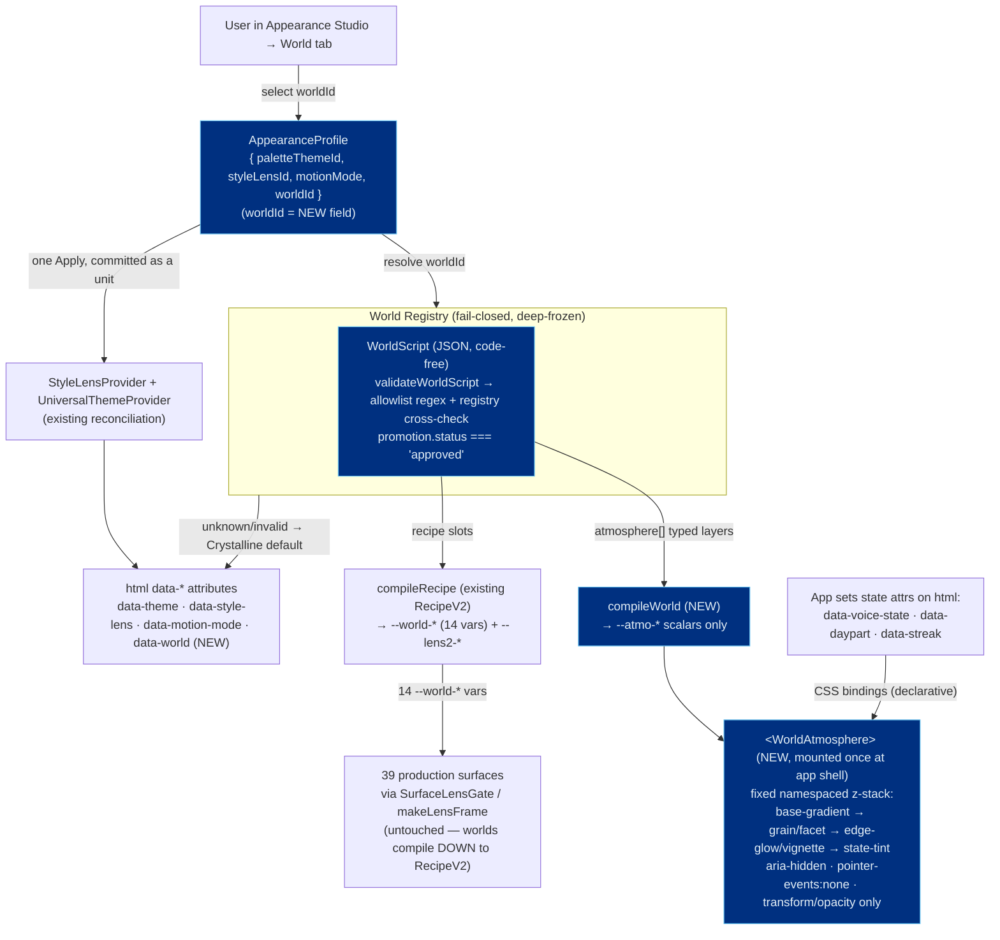
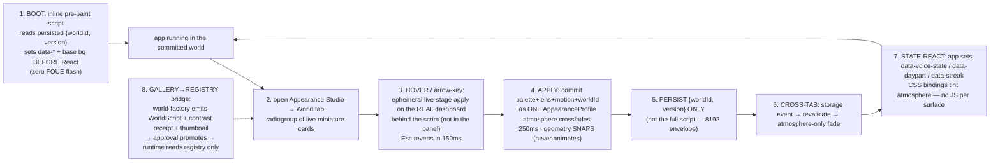

# BUILD BLUEPRINT — SwanStudios Living-Environment System (Kimi K3 vision → exact build spec)

**Author of the vision:** Kimi K3 (`moonshotai/kimi-k3`, review at `AI-Village-Documentation/gemini-consults/kimi-living-environment-2026-07-17.md`).
**Forged into a build package by:** Fable 5. **Builder:** Kimi ("keyme") / any senior builder — build EXACTLY this, make no design decisions the spec leaves open without flagging.
**Grounded on:** real `origin/main @ 96ac6bd3d` (fused `AppearanceProfile`, `--world-*` 14 vars × 39 surfaces, Appearance Studio, RecipeV2 safe layer, `SurfaceLensGate`, `ConsoleAtmosphere`). Input packet: `KIMI-LIVING-ENVIRONMENT-REVIEW-PACKET-2026-07-17.md`.

## 0. The thesis (do not lose this)
A "world" must be a **place, not a recolor.** 14 `--world-*` vars alone make `webb-deep-field` and `chrome-sovereign` indistinguishable except hue. The missing primitive is a **reusable, typed, CSS-only, fail-closed atmosphere layer stack** (`<WorldAtmosphere>`) — `ConsoleAtmosphere` generalized from one lens to the world axis. That single contract converts "18 skins" into "18 environments," delivers the docs-only M4 "page-as-place" tier at runtime, and **zones decoration out of the operator console by construction** (atmosphere lives behind/around content, never in it).

## 1. Architecture (how it composes)



**Precedence (namespace-isolated, conflict-proof):**
`Crystalline chrome  <  palette (data-theme)  <  lens (data-style-lens)  <  world  <  motion veto`
- A world may write **`--world-*` and `--atmo-*` ONLY** — never `--lens2-*`, never palette vars, never `--lens-*`.
- `data-motion-mode` + `prefers-reduced-motion` are a **HARD VETO** over any world motion (precedence, not negotiation).
- Worlds compile **down to** RecipeV2, so all 39 `SurfaceLensGate` surfaces keep working with zero changes.

## 2. The end-to-end FLOW (Sean's #1 priority)



## 3. The safe JSON WorldScript schema (the runtime input format — code-free by construction)

```jsonc
{
  "id": "webb-deep-field",           // string; registry-cross-checked, fail closed to Crystalline
  "version": 3,                      // integer; persisted with id
  "engine": ">=2.0",                 // semver range the runtime supports
  "family": "cosmos",               // world family (worlds.md 5 families)
  "compat": { "palettes": ["crystalline-swan"], "lenses": ["*"] },
  "recipe": { /* existing RecipeV2 six slots → --world-* ; existing allowlist regex applies */ },
  "atmosphere": [                    // typed layer primitives — rendered by runtime, NOT markup
    { "type": "base-gradient", "tokens": { "--atmo-base-a": "oklch(...)", "--atmo-base-b": "oklch(...)" } },
    { "type": "grain",   "opacity": 0.05, "scale": 1.4 },              // texture DESPITE url() ban
    { "type": "facet",   "opacity": 0.08, "scale": 1.0 },
    { "type": "edge-glow","tokens": { "--atmo-glow": "oklch(...)" },
      "motion": { "kind": "drift", "ms": 24000, "reduced": "static" } } // reduced REQUIRED, non-optional
  ],
  "bindings": [                      // state-reactive, declarative only
    { "source": "voice-state", "attr": "data-voice-state",
      "map": { "listening": { "--atmo-tint": "oklch(...)" } }, "transition": "opacity 300ms" }
  ],
  "surfaces": { "workout-planner": { "--world-panel": "oklch(...)" } }, // per-surface --world-* overrides
  "motionBudget": { "maxAnimatedLayers": 2 },
  "a11y": { "minContrast": 4.5, "pairs": [["--world-text","--world-panel"], ["--world-muted","--world-panel"]] }
}
```
**Allowed layer `type`s (typed primitives, closed set):** `base-gradient | grain | facet | edge-glow | vignette | tint`. Unknown type/source/id → fail closed to Crystalline.
**Validation (`validateWorldScript`, extends RecipeV2's regex):** token values pass the existing allowlist (no `url()`, `;`, `{}`, `\`, `<>`); `atmosphere[]` types ∈ closed set; every motion layer has a `reduced` fallback; `a11y.pairs` non-empty; `id`/`version` present; `compat` references known palettes/lenses. Deep-freeze on load. `promotion.status === 'approved'` to be selectable.

## 4. `<WorldAtmosphere>` contract (the one highest-impact build — clone `ConsoleAtmosphere.tsx`)
- Mounted **once** at the app shell, `position:fixed` full-viewport, `z-index` below all content, `aria-hidden`, `pointer-events:none`.
- Fixed layer stack in order: `base-gradient → grain/facet texture → edge-glow/vignette → state-tint`. Each is a typed primitive rendered by the runtime and driven by `--atmo-*` compiled from the script — **this is how texture exists despite the `url()` ban** (grain/facet are built-in SVG/canvas/gradient primitives parameterized by allowlisted scalars only).
- Transform/opacity only (GPU-safe). Per-layer `reduced: "static" | "off"`. Cover-sized transform-scaled layers (no fixed px → no banding at 2560/3840, no seams on tiled noise).
- Fail-closed: renders nothing distinctive unless `html[data-world='<approved id>']`. Every other state renders byte-identically (the ConsoleAtmosphere guarantee).
- **Ship Crystalline Swan itself as a world** with a crystalline facet/sheen layer, so even the default has a designed signature.

## 5. BUILD GATES (Kimi's implementation-fidelity attacks — each is a hard requirement + its test)
1. **CSS-time vars only.** Every `--world-*`/`--atmo-*`/`--lens2-*` consumption is `var(--x, <crystalline-fallback>)` inside the template literal — never `${p => p.theme.x}` (freezes at mount, breaks live switch across 39 surfaces). **Add a stylelint rule: a `var(--world-*/--lens2-*/--atmo-*)` without a Crystalline fallback = build error.**
2. **Boot script, no FOUE.** Inline pre-paint script sets `data-*` + base bg before React mounts. Test: first paint at 320px with a stored world is already world-correct.
3. **CI contrast RECEIPT MATRIX.** Build-time contrast across every approved `world × palette × lens` triple (extend `qa-report.json`), incl. Victory chart series ink on world-tinted panels. Build fails on any pair <4.5:1. Not a runtime prayer.
4. **Zoned decoration.** Atmosphere is a fixed layer stack behind/around content — structurally impossible under tables/charts/dense cards. `data-density` compaction + world `row-columns` clamp to 1 column at 320px.
5. **Dual-Button Glow survives worlds** — validate-time check mapping button-variant pairs per world (blue-bg→purple-glow / purple-bg→cyan-glow must hold).
6. **Focus rings pinned** to a Crystalline-safe token worlds cannot touch (ring vs world panel bg ≥ 3:1 always).
7. **Switcher a11y:** `role="radiogroup"`, roving tabindex, arrow traversal; the CARD is the radio, actions are SIBLINGS (no nested interactives); all targets ≥44px including under `data-density`; <768px = bottom sheet, not a squished dialog.
8. **Motion veto** is precedence, not negotiation; Apply-crossfade gated by reduced-motion.
9. **Persist `{worldId, version}` only** (8192 envelope can't hold a full script); resolve from registry at runtime. **`worldId` registry-cross-checked day one** (don't repeat the `paletteThemeId` non-empty-string gap).
10. **State-by-hue gets a redundant non-color cue** (WCAG 1.4.1). All atmosphere layers `aria-hidden` + `pointer-events:none`.
11. **File budget:** `worldScriptSchema` / `validateWorldScript` / `compileWorld` / `<WorldAtmosphere>` = 4 files, each <300 lines.
12. **Re-tokenize gallery imports:** the ~20 offline gallery worlds likely carry retired Galaxy-Swan DNA — re-tokenize to Crystalline fallbacks at import or reject. House voice on world names (strength/performance; "recovery" not "zen"; no yoga/meditation). Sean copy: "26+ years / NASM-protocol," never "NASM-certified."

## 6. ANTI-FEATURES (Kimi says build the opposite)
- **NOT per-route world switching** — an app that changes place as you navigate stops feeling like one place; spatial consistency IS the brand for an operator console. Do **state-reactive atmosphere** (the Aurora pattern generalized) instead.
- **NOT flat color-swatch previews** — render live miniatures of the user's actual dashboard in each world (Arc Spaces / launcher-tier), or it looks 2019.

## 7. BUILD ORDER — 3 slices, each with its acceptance test
1. **`worldId` seam + World tab** (S/M): add `worldId` to `AppearanceProfile` + registry + a World tab in the Appearance Studio. **Accept:** selecting a world re-themes all 39 gated surfaces; unknown `worldId` fails closed to Crystalline with zero visual change.
2. **`<WorldAtmosphere>` + two ported worlds** (M): the layer contract + port `webb-deep-field` and `chrome-sovereign` from the gallery to WorldScripts. **Accept:** the two are distinguishable in a 100ms static screenshot; `prefers-reduced-motion` renders static layers; axe clean.
3. **Live-stage preview + boot script + CI contrast matrix** (M). **Accept:** hover previews without committing; first paint at 320px with a stored world has no flash; receipt matrix green across every approved world×palette×lens triple or the build fails.

## 8b. ✦ UNIFIED v2 — the two lanes merged into one (2026-07-17)
The design/generator lane ran a SECOND Kimi K3 pass **seeded by this very blueprint** (`KIMI-WORLD-ATMOSPHERE-ENHANCED-2026-07-17.md`). Both lanes converged on one doc; these are its accepted deltas — they SUPERSEDE the conflicting parts of §3–§7 above. This is now the single authoritative runtime+atmosphere spec. The design lane owns the CONTENT pipeline that fills it: `LIVING-WORLD-GENERATOR-MASTER-PROMPT-2026-07-17.md` (the world generator) + the **Design Brain** (`docs/ai-workflow/design-brain/` — `design.md` canonical) supplies the aesthetic values every world's tokens must honor.

**U1 — Phenomena, never creatures (taste-closed by construction, not review).** The `<WorldAtmosphere>` renderer has a CLOSED primitive set and **no arbitrary-geometry primitive** — no path data, no inline SVG shapes — so a whale/dolphin/bee is *unauthorable in the format, forever*. Replace §4's informal stack with this closed set: `base-gradient · particulate · caustics · light-shafts · aurora-ribbon · star-field · fog-band · chromatic-facet · ring-pulse · bloom · vignette · tint`. Every world is crystalline OPTICS (light/depth/refraction/particulate), never fauna → every world reads unmistakably SwanStudios at a 100ms glance because all phenomena share one light-physics. The founder's subjects translate: whale-song vault = caustics + slow `ring-pulse` (light moving at the speed of sound); "physically-correct rainbow" = a `chromatic-facet` dispersion whose hue ORDER (red-out/violet-in) is baked into the renderer, world supplies only angle/spread/intensity scalars. The **swan silhouette** — the one figurative mark that's premium — is relocated to the **Crystallize artifact** only (above-content, one-time, reduced-safe), never ambient.

**U2 — Restraint MECHANIZED (caps are schema fields, not builder taste).** Anti-distraction becomes enforceable numbers: per-layer **max luminance delta vs base** (cap in OKLCH lightness units); **velocity caps** (ambient drift period ≥ 20s; particulate ≤ ~10px/s); **amplitude caps** (opacity oscillation Δ ≤ 0.03 — sub-perceptual). `motionBudget` gains these; `validateWorldScript` rejects any layer exceeding them. The Crystallize ripple + any signature are the highest-energy events and are hardest-capped.

**U3 — Composite contrast, not flat pairs.** Translucent `--world-panel` (alpha < 1) lets particulate move behind live text — the flat `world×palette×lens` matrix never catches it. Fix: EITHER a **min-alpha floor on world panels** OR a **worst-case composite fixture** in the CI receipt matrix (atmosphere at its max-luminance point, behind the min-approved panel alpha, text on top) asserting ≥4.5:1. This closes both a WCAG hole and an architecture-doc lie.

**U4 — Determinism via `seed`.** Add one allowlisted integer `seed` scalar. A place whose grain/particulate rearrange every mount is not the same place — determinism is a core property of *place* and it makes screenshot-diffing + cross-tab consistency real. One integer, huge payoff.

**U5 — Crossfade in OKLCH.** The 250ms world-switch must be **stacked-layer opacity crossfades** (never token-value transitions on one layer) OR `color-mix(in oklch, …)` — or two dark gradients interpolate through sRGB gray mud mid-frame.

**U6 — Capability ≠ security failure (split the fail-closed rule).** Content-security failure (bad token, unknown *type*) → fail closed to Crystalline. But a runtime-2.x client loading a 3.0 world's one unknown layer must **skip that layer, keep the rest**, logged to the qa receipt — `engine: ">=3.0"` negotiation on persisted `{worldId, version}`. Don't lose a whole world to one forward-compat layer.

**U7 — Reduced-motion covers ONE-TIME events too.** Ambient loops are handled; triggered motion (Crystallize ripple, PR gold bloom, signature) is not. Under veto, every triggered event collapses to **opacity-only ≤150ms settle, no transform/scale**. Non-optional per-primitive field.

**U8 — Canvas particulate is real per-frame JS — spec it or bake it.** Per primitive, EITHER full machinery (rAF gated on `visibilitychange` + `data-motion-mode` listener, DPR cap, explicit canvas w/h attrs, ≤4ms frame budget, static frame under reduced motion) OR the cheap trick: **paint noise once, animate the baked bitmap via CSS transform.** **Ban animated `filter`/`backdrop-filter` outright** — `bloom` is pre-baked radial-gradients, or 4K repaints cook the gym phone. Particulate density scales by viewport AREA (or 3840 gets 9× the 1440 count); decide if particulate mounts at all <768px.

**U9 — Mobile reveal zones or admit desktop-first.** At 375/414 a fixed below-content layer shows only in ~16px gutters. EITHER design explicit reveal zones (header transparency band, narrow-viewport-weighted edge-glow, section-gap exposure) OR declare atmosphere desktop-first and stop spending thermal budget <768px. Do not ship an invisible feature to the primary device.

**U10 — `signaturePhenomenon` optional in schema, required by PROMOTION policy for the 5 flagships only.** Scarcity = premium; required-for-all = gimmick monoculture.

**U11 — File budget corrected + slice re-sized.** The atmosphere is **~14 files** (`primitives/<one module per primitive>` ~40–90 lines each + `registry.ts` + `useMotionVeto` + `particulateCanvas`), all <300 lines. **Slice 2 is L, not M.** New `--atmo-*` tokens inherit house rules: `var(--x, <Crystalline fallback>)` (stylelint rule extends), oklch strings only in JSON (no hex), signature colors are token refs, gold PR bloom checked against focus-ring + state-hue collision.

**Sequencing (unchanged seams, re-ordered polish):** Slice 1 (worldId seam) starts untouched — **still gated on Sean's confirm (b)**. The U1 phenomena reframe lands **before Slice 2** (it defines the primitive set). U4 determinism + U5 oklch crossfade land IN Slice 2. U2 luminance caps + U3 composite fixture land in Slice 3. Flagship signatures are Slice 3 polish. Anti-features from §6 stand (no per-route switching; live miniatures not swatches).

## 8. Competitive bar to clear (why this matters)
⌘K → "world" → arrow-key live preview → Enter (Raycast/Linear speed); live data miniatures (Arc Spaces); ambient state-reactivity day one (Whoop/Apple — time-of-day worlds, restrained streak-milestone accent bloom, admin system-health glance-tint); typed-CSS atmospheres (90% of shader feel at 5% cost, survives the allowlist); published contrast receipts as a trust/brand artifact.
