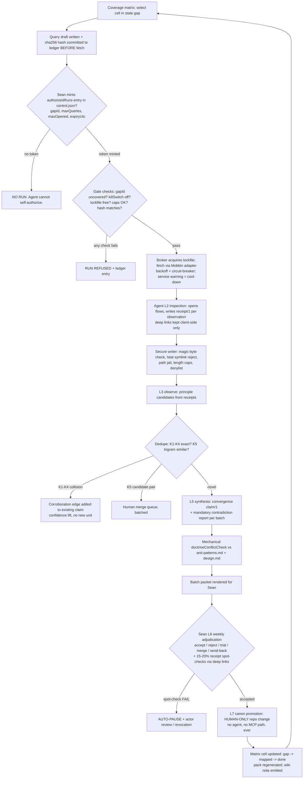
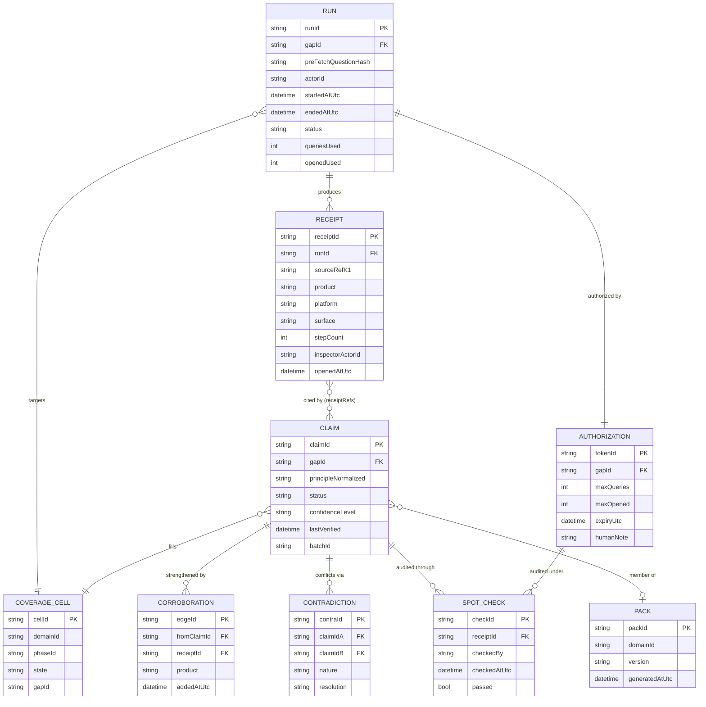

# Kimi K3 — Front-End / Design Review

**Reviewer:** OpenRouter `moonshotai/kimi-k3` (effort: high)
**Document:** .ai-workflow/brain-review/KIMI-PASS-B.md
**Seed:** .ai-workflow/brain-review/KIMI-PASS-A-VERDICT.md
**Tokens:** 10323 in / 16000 out · **Cost:** ~$0.2710 · **Wall:** 487.6s

---

# KIMI PASS B — THE COMPLETE BUILD BLUEPRINT

**Date:** 2026-07-19 · **Pass 2 of 3** · Seed: KIMI PASS A (approved, amended per §1)
**Builder assumption:** a competent agent with zero context. If it isn't written here, it doesn't exist.

---

## 1. BUILD SUMMARY

| # | What | Week | Effort |
|---|---|---|---|
| 1 | Secure writer (magic bytes, lstat, path jail) — fixes hostile scenario 8 | W1 | 0.5 day |
| 2 | `receipt/1` + `claim/1` schemas + validators; `evidence/2` frozen as legacy-read | W1 | 0.5 day |
| 3 | `control.json` v2: authorizedRuns, lockfile, spotCheckLog, kill switch, run-rate config | W1 | 0.5 day |
| 4 | Coverage matrix (11 domains × 5 phases = 55 cells) + gapId gate | W1 | 0.5 day |
| 5 | Receipt pipeline + gate integration (denylist + binary/symlink rejection) | W1 | 0.5 day |
| 6 | Dedupe → corroboration edges + trigram K5 candidate-pair generator + merge queue | W1–W2 | 1 day |
| 7 | Claim synthesis + contradiction report + mechanical doctrineConflictCheck | W2 | 1 day |
| 8 | Batch adjudication packet renderer + annotated-import + matrix update | W2 | 1 day |
| 9 | Spot-check module + auto-pause wiring | W2 | 0.5 day |
| 10 | Broker (concurrency-1, backoff, circuit-breaker, warning cool-down) + source-adapter contract + Mobbin adapter | W2 | 1 day |
| 11 | Retrofit 17 records → ~5 seed claims (**SKIP-OK**, Sean's option) | W1 | 0.5 day |
| 12 | 2 pilot runs, end-to-end | W1 | — |
| 13 | Eval harness (cold-mode, golden set, degrades at n≥10) + wiki-emitter (§2 ruling) | W3 | 1 day |
| 14 | MCP read-only façade (5 tools on existing server) + router contract | W10–11 | 1 day |

**Total new code ≈ 4,600 lines across ~30 files, all ≤300 lines/file.** Eleven weeks to ~70 accepted claims / ~200–280 citations / 3 deep packs / 8 shallow [target from approved Pass A — the projection is a plan, not a promise].

---

## 2. THE §2 RULING — WIKI / GRAPH LAYER

**Ruling: (a)-minimal, implemented as a *generated* lane, not a maintained one. Graphify is killed as a dependency. The five mythos docs go to the attic today.**

### 2.1 Decision

**(a) Build a minimal wiki lane — but generated, never hand-written.** Every **accepted** claim emits one markdown note into `~/design-brain/wiki/` via `wiki-emit.mjs` (built W3, ~180 lines). The notes are the first real linked markdown that has ever existed in this system. Edges, all derived from fields already in `claim/1`:

| Edge | Source field |
|---|---|
| claim → product | `independentProducts[]` |
| claim → principle | `principleNormalized` (K5) — shared K5 = shared principle node |
| claim → C-pattern | `swanTranslation.cPatterns[]` |
| claim → surface/phase | `gapId` decomposition |
| claim ↔ claim | `corroborations[]`, `contradictions[]` |

Properties that make this the right version of (a):
- **Regenerable.** `rm -rf ~/design-brain/wiki && node wiki-emit.mjs` rebuilds it from the claim corpus in seconds. The wiki is a *view*, not an asset. The corpus is the asset. This kills the entire class of "wiki drifted from truth" failures that the old policy docs were already suffering from.
- **Zero new tooling.** Plain markdown + YAML frontmatter. Obsidian is an *optional viewer* if Sean ever installs it; nothing depends on it. Mermaid graphs are emitted per-domain (`wiki/graphs/D01.mmd`) for visual inspection.
- **Honest graph.** Edges exist only where a human-adjudicated claim says they exist. Graphing 3,797 unlinked PDF extractions would be noise [VERIFIED per §2 finding]; graphing ~70 adjudicated claims is signal.

**(c) defer is rejected** because the wiki costs ~180 lines once the claim schema exists (W3), and "packs + FTS is the whole brain" loses the one thing the graph gives: contradiction and corroboration neighborhoods at a glance. **(b) kill is rejected** as too final — but only the *mythos* dies; the *idea* survives in this minimal form.

**Graphify: killed as a component.** Not installed, never was [VERIFIED §2]. No code may import it, shell to it, or check for it. If a graph tool is ever genuinely installed, it may *consume* `~/design-brain/wiki/` — the wiki must not depend on it. "Gravity" in old notes = Sean mishearing Graphify [VERIFIED §2]; both words are now retired from docs.

**Google Antigravity:** noted as a possible future MCP *consumer* only. No design accommodation. [HYPOTHESIS that it ever integrates; irrelevant either way.]

### 2.2 Doc-debt disposition — executed in build step 0, before any code

| Doc | Disposition |
|---|---|
| `obsidian/` (policy docs) | **Move to `docs/_attic/2026-07-wiki-mythos/`.** Place a 5-line tombstone at the original path: *"This described a system that never existed. Reality: `docs/brain/REALITY.md`. Attic: `docs/_attic/2026-07-wiki-mythos/`. Deleted-from-active-docs 2026-07-19."* |
| `graphify/` (3 policy docs, no tool) | Same: attic + tombstone. |
| `vault-routing.md` | Same. Its one true fact (clients-private exclusion) is already enforced by the real gate; `REALITY.md` restates it. |
| `KARPATHY-WIKI-OPERATIONS.md` | Attic + tombstone. |
| `HERMES-WIKI-MYTHOS-MASTER-PLAN.md` | Attic + tombstone. |

**Not hard-deleted** because git history should preserve *what was believed and when it was corrected* — but they must leave every active path. An agent grepping the repo tomorrow must hit the tombstone, not the myth. New doc: `docs/brain/REALITY.md` (~60 lines) stating, in one page: what exists (`~/hermes2/brain-vault`, FTS5, MCP server, PII gate, `design-brain` corpus), what does not (Obsidian vault, Karpathy wiki, Graphify, Pi paths), and the one rule: **docs describing non-existent systems are deleted or atticked on discovery, no exceptions.**

---

## 3. MERMAID DIAGRAMS

### 3.1 System flowchart



### 3.2 Run lifecycle state diagram

```mermaid
stateDiagram-v2
    [*] --> IDLE
    IDLE --> AUTHORIZED : Sean mints authorizedRuns entry
    AUTHORIZED --> REFUSED : gate check fails (covered gapId / hash mismatch / caps / killSwitch)
    REFUSED --> IDLE
    AUTHORIZED --> FETCHING : lockfile acquired
    FETCHING --> COOLDOWN : service warning from Mobbin OR 3 consecutive broker failures
    COOLDOWN --> IDLE : 24h elapsed AND Sean re-mints token (human-only resume)
    FETCHING --> INSPECTING : fetch complete, lock held
    INSPECTING --> SYNTHESIZING : receipts sealed
    SYNTHESIZING --> AWAITING_ADJUDICATION : batch packet rendered
    AWAITING_ADJUDICATION --> ADJUDICATING : Sean opens packet (weekly)
    ADJUDICATING --> PROMOTED : accepted claims -> human canon commit
    ADJUDICATING --> IDLE : batch closed, matrix updated
    PROMOTED --> IDLE
    FETCHING --> PAUSED : PAUSE TRIGGER (any)
    INSPECTING --> PAUSED : PAUSE TRIGGER (any)
    SYNTHESIZING --> PAUSED : PAUSE TRIGGER (any)
    ADJUDICATING --> PAUSED : spot-check failure (immediate)
    note right of PAUSED
        Triggers: spot-check failure; denied-data detection;
        cap breach; CoverageGain<0.25 AND ConfidenceLift<0.25
        over rolling 4 runs; killSwitch=true.
        Resume = new human-minted authorizedRuns entry only.
        There is no boolean to flip.
    end note
    PAUSED --> IDLE : Sean mints new run token
    any --> KILLED : killSwitch=true (Sean, anytime, one field)
    KILLED --> [*]
```



### 3.3 Weekly cycle sequence diagram

```mermaid
sequenceDiagram
    actor Sean
    participant Agent as Acquisition Agent
    participant Gate as Gate + Secure Writer
    participant Mob as Mobbin MCP (adapter #1)
    participant FTS as FTS5 Spine + design-brain collections
    participant Canon as Canon (repo, L7)

    Note over Sean: MONDAY, ~15 min
    Sean->>FTS: read coverage map, last batch results
    Sean->>Gate: edit control.json: mint N authorizedRuns entries (gapIds, caps, expiry)
    Note over Agent: MONDAY-TUESDAY, unattended, ~2-4 runs
    Agent->>Gate: request run (gapId + query draft sha256)
    Gate->>Gate: verify token, lockfile, caps, hash; acquire lock
    Gate->>Mob: brokered fetch (backoff, circuit-breaker)
    Mob-->>Gate: flow metadata (no artifacts stored)
    Agent->>Mob: inspect flows, record step counts + hierarchy notes
    Agent->>Gate: write receipt/1 per observation
    Gate->>Gate: magic-byte/lstat/jail/length checks; append to JSONL ledger
    Agent->>FTS: dedupe check (K1-K5) + contra-search
    Agent->>Gate: write claim/1 candidates + contradiction report
    Gate-->>Sean: batch packet ready (single markdown file)
    Note over Sean: WEEKLY SESSION, 75 min
    Sean->>Gate: open packet; per claim: a/r/t/m/b (one letter each)
    Sean->>Mob: spot-check 3 receipts via client-side deep links, ~4 min each
    alt spot-check passes
        Sean->>Gate: adjudicate import annotated packet
        Gate->>FTS: index accepted claims (recall-tier collection)
        Gate->>FTS: update matrix cells; regen packs; emit wiki notes
    else spot-check fails
        Gate->>Gate: AUTO-PAUSE; log; flag actor for revocation review
        Gate-->>Sean: pause report, nothing promoted
    end
    Note over Sean: ~10 min, human-only
    Sean->>Canon: hand-promote selected accepted claims to doctrine files (L7)
```

### 3.4 ER diagram



---

## 4. DATA CONTRACTS

### 4.1 `receipt/1` — JSON Schema (verbatim, complete)

```json
{
  "$schema": "https://json-schema.org/draft/2020-12/schema",
  "$id": "https://design-brain/schemas/receipt/1",
  "title": "InspectionReceipt",
  "type": "object",
  "additionalProperties": false,
  "required": [
    "schemaVersion", "receiptId", "runId", "gapId", "sourceRef",
    "product", "refType", "surface", "platform", "openedAtUtc",
    "stepCount", "hierarchyNotes", "stateNotes", "inspectorActorId",
    "preFetchQuestionHash"
  ],
  "properties": {
    "schemaVersion": { "const": "receipt/1" },
    "receiptId": { "type": "string", "pattern": "^RCP-[0-9]{8}-[0-9]{4}$" },
    "runId": { "type": "string", "pattern": "^RUN-[0-9]{8}-[0-9]{2}$" },
    "gapId": { "type": "string", "pattern": "^GAP-D[0-9]{2}-P[1-5]-[0-9]{3}$" },
    "sourceRef": {
      "type": "string",
      "description": "K1. Opaque source-assigned reference (adapter-assigned ID, NOT a URL).",
      "maxLength": 128
    },
    "product": { "type": "string", "maxLength": 80 },
    "productCategory": { "type": "string", "maxLength": 60 },
    "refType": { "enum": ["flow", "screen-set", "component-gallery", "teardown"] },
    "surface": { "type": "string", "maxLength": 80, "description": "K2 field. e.g. 'workout-summary', 'checkout-payment'." },
    "platform": { "enum": ["ios", "android", "web", "tablet", "watch"] },
    "openedAtUtc": { "type": "string", "format": "date-time" },
    "stepCount": { "type": "integer", "minimum": 0, "maximum": 500 },
    "hierarchyNotes": {
      "type": "array",
      "maxItems": 40,
      "items": {
        "type": "object",
        "additionalProperties": false,
        "required": ["step", "note"],
        "properties": {
          "step": { "type": "integer", "minimum": 0 },
          "note": {
            "type": "string",
            "maxLength": 280,
            "description": "STRUCTURAL description only: layout regions, ordering, emphasis. No verbatim copy strings over 25 chars (gate-enforced)."
          }
        }
      }
    },
    "stateNotes": {
      "type": "object",
      "additionalProperties": false,
      "properties": {
        "emptyObserved": { "type": "boolean", "default": false },
        "errorObserved": { "type": "boolean", "default": false },
        "loadingObserved": { "type": "boolean", "default": false },
        "offlineObserved": { "type": "boolean", "default": false },
        "notes": { "type": "string", "maxLength": 280 }
      }
    },
    "inspectorActorId": { "type": "string", "description": "Must exist in identity-registry.json with role 'researcher'." },
    "preFetchQuestionHash": { "type": "string", "pattern": "^sha256:[0-9a-f]{64}$" }
  }
}
```

**Denied anywhere in a receipt (gate-enforced, rejects on presence):** `deepLink` (client-side only, lives in `~/design-brain/deeplinks/` — outside git, outside the corpus), screenshots, HTML, image bytes, cookies, tokens, connector URLs, emails, customer identifiers, any string field > 280 chars, any single quoted verbatim string > 25 chars.

### 4.2 `claim/1` — JSON Schema (verbatim, complete)

```json
{
  "$schema": "https://json-schema.org/draft/2020-12/schema",
  "$id": "https://design-brain/schemas/claim/1",
  "title": "ConvergenceClaim",
  "type": "object",
  "additionalProperties": false,
  "required": [
    "schemaVersion", "claimId", "gapId", "principleNormalized",
    "workflowPhase", "userRole", "productCategory",
    "independentProducts", "receiptRefs", "corroborations",
    "contradictions", "swanTranslation", "confidence",
    "contraSearchResult", "doctrineConflictCheck",
    "status", "lastVerified", "staleAfterDays", "proposedBy", "proposedAtUtc"
  ],
  "properties": {
    "schemaVersion": { "const": "claim/1" },
    "claimId": { "type": "string", "pattern": "^CLM-[0-9]{8}-[0-9]{4}$" },
    "gapId": { "type": "string", "pattern": "^GAP-D[0-9]{2}-P[1-5]-[0-9]{3}$" },
    "principleNormalized": {
      "type": "string", "maxLength": 200,
      "description": "K5 string. Lowercase, imperative, product-free. e.g. 'confirm destructive action with consequence summary'."
    },
    "workflowPhase": { "enum": ["P1", "P2", "P3", "P4", "P5"] },
    "userRole": { "type": "string", "maxLength": 60, "description": "Role label only, never a person. e.g. 'trainer', 'client', 'shopper'." },
    "productCategory": { "type": "string", "maxLength": 60 },
    "singleSource": { "type": "boolean", "default": false },
    "independentProducts": {
      "type": "array", "minItems": 1,
      "items": { "type": "string", "maxLength": 80 },
      "description": "Distinct products, distinct companies. If length < 2, singleSource MUST be true and confidence.level capped at 'low'."
    },
    "receiptRefs": {
      "type": "array", "minItems": 1,
      "items": { "type": "string", "pattern": "^RCP-[0-9]{8}-[0-9]{4}$" },
      "description": "A sourceRef is primary in exactly one claim (gate-enforced)."
    },
    "corroborations": {
      "type": "array",
      "items": {
        "type": "object", "additionalProperties": false,
        "required": ["receiptId", "product", "addedAtUtc"],
        "properties": {
          "receiptId": { "type": "string" },
          "product": { "type": "string" },
          "addedAtUtc": { "type": "string", "format": "date-time" }
        }
      }
    },
    "contradictions": {
      "type": "array",
      "items": {
        "type": "object", "additionalProperties": false,
        "required": ["claimId", "nature", "resolution"],
        "properties": {
          "claimId": { "type": "string", "description": "Bidirectional: the paired claim carries the inverse edge." },
          "nature": { "type": "string", "maxLength": 280 },
          "resolution": { "enum": ["open", "context-split", "superseded", "rejected"] }
        }
      }
    },
    "exceptions": { "type": "string", "maxLength": 560 },
    "a11yImplications": { "type": "string", "maxLength": 560 },
    "failureStates": { "type": "string", "maxLength": 560 },
    "swanTranslation": {
      "type": "object", "additionalProperties": false,
      "required": ["b2Arc", "cPatterns", "tokens", "qaRisks"],
      "properties": {
        "b2Arc": { "type": "string", "maxLength": 80 },
        "cPatterns": { "type": "array", "items": { "type": "string", "pattern": "^C([1-9]|1[0-2])$" } },
        "tokens": { "type": "array", "items": { "type": "string", "maxLength": 60 } },
        "qaRisks": { "type": "string", "maxLength": 560 }
      }
    },
    "rejectedPatterns": {
      "type": "array",
      "items": {
        "type": "object", "additionalProperties": false,
        "required": ["pattern", "whyFailsSwan"],
        "properties": {
          "pattern": { "type": "string", "maxLength": 200 },
          "whyFailsSwan": { "type": "string", "maxLength": 280 }
        }
      }
    },
    "confidence": {
      "type": "object", "additionalProperties": false,
      "required": ["level", "basis"],
      "properties": {
        "level": { "enum": ["high", "medium", "low"] },
        "basis": { "enum": ["productCount", "directFitnessEvidence", "trialResult"] },
        "productCount": { "type": "integer", "minimum": 1 }
      }
    },
    "contraSearchResult": {
      "type": "object", "additionalProperties": false,
      "required": ["performed", "hits"],
      "properties": {
        "performed": { "type": "boolean" },
        "hits": { "type": "array", "items": { "type": "string" } }
      }
    },
    "doctrineConflictCheck": {
      "type": "object", "additionalProperties": false,
      "required": ["ran", "rulesChecked", "violations"],
      "properties": {
        "ran": { "type": "boolean" },
        "rulesChecked": { "type": "integer", "minimum": 0 },
        "violations": { "type": "array", "items": { "type": "string" } }
      }
    },
    "status": { "enum": ["proposed", "accepted", "trial", "rejected", "superseded"] },
    "lastVerified": { "type": "string", "format": "date-time" },
    "staleAfterDays": { "type": "integer", "minimum": 30, "default": 180 },
    "proposedBy": { "type": "string" },
    "proposedAtUtc": { "type": "string", "format": "date-time" },
    "humanDecision": {
      "type": ["object", "null"], "additionalProperties": false,
      "required": ["actor", "utc", "batchId"],
      "properties": {
        "actor": { "const": "sean", "description": "Only Sean signs. Hard-coded, not configurable." },
        "utc": { "type": "string", "format": "date-time" },
        "batchId": { "type": "string", "pattern": "^BATCH-[0-9]{4}-W[0-9]{2}$" },
        "note": { "type": "string", "maxLength": 280 }
      }
    }
  }
}
```

### 4.3 `evidence/2` migration / version strategy

**Decision: `evidence/2` is FROZEN, not deleted, not wrapped.** Version strategy = *new artifact types for new semantics, never in-place mutation of a versioned schema*:

1. `evidence/2` stays valid for the 17 existing records, read-only, forever importable.
2. The gate gains a routing table: `{"evidence/2": legacyValidator (read-only), "receipt/1": active, "claim/1": active}`. Any *new* write of `evidence/2` is rejected with "superseded by receipt/1 — see SCHEMA.md".
3. The retrofit (build step 11, SKIP-OK) converts the 17 records → ~5 `claim/1` seeds with `humanDecision.actor: "sean"` only after Sean eyeballs each one; unconverted records stay inert — they never block anything.
4. Rule for all future schemas: bump = new `$id` + new `schemaVersion` const + a checked-in migrator. Old readers must never break on old files.

### 4.4 `control.json` v2 (verbatim template)

```json
{
  "schemaVersion": "control/2",
  "killSwitch": false,
  "pauseState": { "paused": false, "reason": null, "pausedAtUtc": null, "trigger": null },
  "caps": { "maxRunsPerWeek": 12, "maxQueriesPerRun": 6, "maxOpenedPerRun": 24 },
  "runRate": {
    "seanMinutesPerWeek": 90,
    "fallback": {
      "seanMinutesPerWeek": 45,
      "maxRunsPerWeek": 8,
      "expectedYield": "~50 claims / ~150 citations over 11 weeks",
      "note": "Documented fallback tier. Engine reads seanMinutesPerWeek; if Sean sets 45, scheduler clamps maxRunsPerWeek to 8."
    }
  },
  "authorizedRuns": [
    {
      "tokenId": "AUTH-20260720-01",
      "gapId": "GAP-D01-P2-001",
      "maxQueries": 6,
      "maxOpened": 24,
      "expiryUtc": "2026-07-27T00:00:00Z",
      "humanNote": "W1 pilot — workout logging core loop",
      "consumedByRunId": null
    }
  ],
  "lockfile": { "path": "~/design-brain/ledger/run.lock", "holder": null, "acquiredAtUtc": null },
  "spotCheckLog": [
    {
      "checkId": "SPC-20260720-01",
      "receiptId": "RCP-20260720-0007",
      "checkedBy": "sean",
      "checkedAtUtc": "2026-07-20T18:40:00Z",
      "passed": true,
      "note": "stepCount 6 matches live flow; surface label accurate"
    }
  ],
  "spotCheckPolicy": { "sampleRate": 0.17, "minPerBatch": 2, "onFailure": "auto-pause + actor revocation review" },
  "cooldown": { "active": false, "untilUtc": null, "cause": null },
  "metrics": { "rollingWindowRuns": 4, "pauseThresholds": { "coverageGain": 0.25, "confidenceLift": 0.25 } }
}
```

Gate rule: `pauseState.paused == true` OR `killSwitch == true` OR `cooldown.active == true` ⇒ every run request refused. Resume is exclusively a *new* entry in `authorizedRuns` — the only write path is Sean editing this file.

### 4.5 Coverage matrix file format

File: `~/design-brain/matrix/coverage-matrix.json`

```json
{
  "schemaVersion": "matrix/1",
  "domains": [
    { "id": "D01", "name": "workout-logging", "depth": "deep" },
    { "id": "D02", "name": "progress-analytics", "depth": "deep" },
    { "id": "D03", "name": "scheduling-trainer-ops", "depth": "deep" },
    { "id": "D04", "name": "pricing-checkout-storefront", "depth": "deep" },
    { "id": "D05", "name": "onboarding", "depth": "shallow" },
    { "id": "D06", "name": "social-community", "depth": "shallow" },
    { "id": "D07", "name": "admin-settings", "depth": "shallow" },
    { "id": "D08", "name": "search-browse", "depth": "shallow" },
    { "id": "D09", "name": "profile-account", "depth": "shallow" },
    { "id": "D10", "name": "notifications-messaging", "depth": "shallow" },
    { "id": "D11", "name": "universal-states", "depth": "deep-crosscut" }
  ],
  "phases": [
    { "id": "P1", "name": "entry-onboard" },
    { "id": "P2", "name": "core-action" },
    { "id": "P3", "name": "feedback-progress" },
    { "id": "P4", "name": "recovery-error" },
    { "id": "P5", "name": "exit-upgrade" }
  ],
  "cells": {
    "D01-P2": {
      "state": "gap",
      "gapId": "GAP-D01-P2-001",
      "claimIds": [],
      "lastRunId": null,
      "markedDoneAtUtc": null,
      "notes": ""
    }
  },
  "config": {
    "depthAssignments": "config/domains.json — SwanStudios-specific. Portable installs replace this file; the engine never hard-codes a domain name."
  }
}
```

- **States:** `unknown | mapped | gap | deferred | done`. W2 exit test: zero `unknown` cells.
- **gapId scheme:** `GAP-D<nn>-P<n>-<seq3>`, minted once per cell, reused across runs until the cell leaves `gap` state.
- **done criteria (mechanical, all four):** CoverageGain < 0.25 AND ConfidenceLift < 0.25 over the last 4 runs targeting this cell; zero `resolution: "open"` contradictions among its claims; cold-mode pass in this domain. A run token naming a `done` cell fails the gate — waste is mechanically impossible.

### 4.6 K-tables, corroboration, trigram structures

All JSON/JSONL under `~/design-brain/ledger/`:

| File | Structure | Key computed from |
|---|---|---|
| `k1-keys.json` | `{ "<sha256>": { "receiptId": "...", "sourceRef": "...", "createdAtUtc": "..." } }` | sha256(source + sourceRef) — source identity |
| `k2-keys.json` | same map shape → receiptId | sha256(product + surface + platform) |
| `k3-keys.json` | same map shape → receiptId | sha256(product + refType + platform) — replay/reopen detection |
| `k4-keys.json` | same map shape → claimId | sha256(principleRaw lowercased) |
| `k5-index.json` | `{ "<trigramSig>": ["CLM-...", ...] }` | sorted set of character 3-grams of `principleNormalized`, min-hashed to 64-slot signature |
| `k5-candidate-pairs.jsonl` | `{ "pairId", "claimIdA", "claimIdB", "jaccard", "status": "pending|merged|distinct", "decidedBy", "decidedAtUtc" }` | generated W2+, human-decided |

K1–K4 semantics follow the existing gate [LIKELY — Pass A verified only that K5 is a Set membership test at `evidence-gate.mjs:85-92`; exact K1–K4 field composition must be read from that file at build time and these definitions reconciled in SCHEMA.md before step 5 is accepted]. Collision routing: K1–K4 hit on a *receipt* → corroboration candidate; K5 similarity ≥ 0.55 between two *claims* → candidate pair, never auto-merge.

---

## 5. FILE TREE + ORDERED BUILD LIST

### 5.1 File tree (new = `+`, modified = `~`, deleted/atticked = `-`)

```
repo-root/
  scripts/ai-workflow/mobbin-learning/
+   README.md                                  # what this engine is, 80 lines
+   SCHEMA.md                                  # all four schemas annotated, 260 lines
+   config/
+     domains.json                             # SwanStudios 11 domains + depth (PORTABILITY SEAM) ~40
+     doctrine-rules.json                      # machine-checkable extract of anti-patterns/design.md ~120
+     identity-registry.json                   # actors; agent registered as researcher ~30
+   schemas/
+     receipt.1.schema.json                    # §4.1 verbatim ~120
+     claim.1.schema.json                      # §4.2 verbatim ~260
+     control.2.schema.json                    # §4.3 shape ~140
+     matrix.1.schema.json                     # §4.5 shape ~120
+   src/
+     paths.mjs                                # all paths, repo vs WSL data root ~60
+     config.mjs                               # load + validate config/control ~120
+     jsonl.mjs                                # append-only, exclusive-create ledger primitives ~140
+     writer.mjs                               # SECURE WRITER: magic bytes, lstat, jail, length caps ~220
+     validate.mjs                             # ajv wrapper, schema router (evidence/2 read-only) ~160
+     lockfile.mjs                             # O_EXCL acquire, stale detection, release ~120
+     control.mjs                              # authorizedRuns gate checks, pause/kill/cooldown ~180
+     matrix.mjs                               # cell CRUD, gapId mint, done-criteria check ~200
+     broker.mjs                               # fetch broker: backoff, circuit-breaker, cooldown ~240
+     receipts.mjs                             # receipt build + seal + ledger append ~180
+     dedupe.mjs                               # K1-K4 lookups, collision routing ~180
+     trigram.mjs                              # K5 signatures, candidate-pair generation ~200
+     merge-queue.mjs                          # human merge queue read/decide ~140
+     synthesize.mjs                           # observations -> claim/1 candidates ~260
+     contradictions.mjs                       # contra-search + bidirectional edge writer ~180
+     doctrine-check.mjs                       # mechanical diff vs doctrine-rules.json ~160
+     metrics.mjs                              # CoverageGain/ConfidenceLift/ContradictionYield ~160
+     batch-packet.mjs                         # render weekly packet markdown ~240
+     adjudicate.mjs                           # import annotated packet, apply decisions ~240
+     promote.mjs                              # L7 checklist generator (human executes) ~120
+     spotcheck.mjs                            # sample receipts, present deep links, log result ~160
+     retrofit.mjs                             # evidence/2 -> claim/1 seeds (SKIP-OK) ~200
+     wiki-emit.mjs                            # accepted claims -> linked md notes + mermaid graphs ~180
+     packs.mjs                                # pack regeneration from accepted claims ~200
+     eval/
+       cold-mode.mjs                          # cold-run harness, kills source, grades rubric ~200
+       rubric.mjs                             # 10-pt rubric + golden-set manager, degrades at n>=10 ~160
+     adapters/
+       source-adapter.mjs                     # the contract (interface + docs) ~120
+       mobbin.adapter.mjs                     # adapter #1, wraps existing MCP calls ~200
+   tests/
+     writer.test.mjs                          # ~200
+     control.test.mjs                         # ~160
+     validate.test.mjs                        # ~140
+     trigram.test.mjs                         # ~140
+     synthesize.test.mjs                      # ~180
+     adjudicate.test.mjs                      # ~160
+     fixtures/                                # sample receipts/claims, ≤ 8 small files
  docs/
+   brain/REALITY.md                           # §2.2, what exists / what never did ~60
+   brain/RUNBOOK-WEEKLY.md                    # §8 verbatim ~200
+   brain/RUNBOOK-PORTABLE-INSTALL.md          # §9 verbatim ~220
-   obsidian/**                                # -> docs/_attic/2026-07-wiki-mythos/ + tombstone
-   graphify/**                                # -> attic + tombstone
-   vault-routing.md                           # -> attic + tombstone
-   KARPATHY-WIKI-OPERATIONS.md                # -> attic + tombstone
-   HERMES-WIKI-MYTHOS-MASTER-PLAN.md          # -> attic + tombstone
~   scripts/ai-workflow/mobbin-learning/evidence-gate.mjs   # route by schemaVersion; reject new evidence/2 writes; call writer.mjs
~   hermes2_brain_mcp_server.py                # +5 read-only tools (W10-11 ONLY), ~+150 lines
  (WSL data root, outside git)
  ~/design-brain/
    control.json                               # §4.4
    ledger/{runs.jsonl,receipts.jsonl,k*.json,k5-candidate-pairs.jsonl,run.lock}
    claims/claims.jsonl
    matrix/coverage-matrix.json
    batches/BATCH-2026-W30.md ...
    packs/D01.md ... D11.md
    wiki/claims/*.md, wiki/graphs/*.mmd        # generated, regenerable
    deeplinks/*.json                           # CLIENT-SIDE ONLY, never committed, never in corpus
    eval/{golden-set.jsonl,build-receipts.jsonl,cold-runs/}
```

Data root is outside git by policy (JSONL ledgers, exclusive-create, auditable); only schemas, code, config, docs live in the repo. **~4,600 new lines, 30 files, none over 300.**

### 5.2 Ordered build list

| # | Build | Files | Deps | Acceptance test | Stop condition |
|---|---|---|---|---|---|
| 0 | Doc-debt disposal + REALITY.md | 5 attics + tombstones + REALITY.md | none | `grep -ri "obsidian\|graphify\|karpathy\|swanstudios-wiki" --include="*.md" repo docs` hits only tombstones/attic/REALITY | Stop if any doc outside attic describes a wiki/graph tool as existing |
| 1 | Secure writer | `writer.mjs`, `paths.mjs`, `writer.test.mjs` | none | Tests pass: PNG magic bytes written as `x.md` rejected; symlink at target rejected via lstat; `../../etc` path rejected; 281-char string rejected | **Do not proceed past step 5 without this.** Hostile scenario 8 fails open today |
| 2 | Schemas + validator | 4 schema files, `validate.mjs`, test | 1 | Valid receipt/1 & claim/1 pass; each required-field deletion fails; `evidence/2` validates read-only; new `evidence/2` write rejected | Stop if schema router misroutes |
| 3 | control.json v2 + gate checks | `control.mjs`, `lockfile.mjs`, `config.mjs`, test | 2 | Forged gapId (already-covered) refused; expired token refused; consumed token refused; killSwitch refuses all; second concurrent lock acquisition fails | Stop if any refusal path silently allows |
| 4 | Coverage matrix | `matrix.mjs`, `config/domains.json` | 3 | 55 cells seeded `unknown`; gapId mint matches regex; done-check requires all 4 criteria | — |
| 5 | Receipt pipeline + gate integration | `receipts.mjs`, `jsonl.mjs`, ~`evidence-gate.mjs` | 1,2,3,4 | End-to-end: draft hash → token → receipt written → JSONL appended; denied field present → rejected; deepLink field → rejected | Stop if ledger is mutable in place |
| 6 | Dedupe + trigram + merge queue | `dedupe.mjs`, `trigram.mjs`, `merge-queue.mjs`, tests | 5 | K1 collision routes to corroboration not reject; Jaccard ≥0.55 produces exactly one pending pair; human decision writes back | — |
| 7 | Synthesis + contradictions + doctrine check | `synthesize.mjs`, `contradictions.mjs`, `doctrine-check.mjs`, `config/doctrine-rules.json` | 6 | 3 products + 1 principle → 1 claim, confidence medium; 1 product → singleSource + low; contradiction edge written both directions; known anti-pattern violation flagged | — |
| 8 | Batch packet + adjudication import | `batch-packet.mjs`, `adjudicate.mjs`, test | 7 | Packet renders ≤ ~8 lines/claim; annotated packet with `a/r/t/m/b` letters imports; matrix cells update; rejected claims never index | — |
| 9 | Spot-check module | `spotcheck.mjs` | 5,8 | Random 17% sample (min 2); deep link read from `deeplinks/` only; `passed:false` sets `pauseState.paused=true` within same process run | Stop if a failed check does not pause |
| 10 | Broker + adapter contract + Mobbin adapter | `broker.mjs`, `adapters/*` | 3 | Simulated warning → cooldown 24h + refuse until human token; 3 consecutive failures → circuit open; lock held across whole run | **Never probe real limits. Simulated failures only.** |
| 11 | Retrofit (SKIP-OK) | `retrofit.mjs` | 7 | 17 records → ≤5 claim drafts, each shown to Sean; skipped = zero downstream breakage | Sean may skip; nothing depends on it |
| 12 | Pilot: 2 runs | all above | 0–10 | 2 authorized runs complete; ≥3 claims proposed; Sean adjudicates one batch ≤75 min; matrix shows ≥1 cell moved | — |
| 13 | Eval harness + wiki emitter | `eval/*`, `wiki-emit.mjs` | 8 | Cold-run with `killSwitch`-style source block completes; rubric grades 10-question golden set and honestly reports n; `rm -rf wiki && wiki-emit` regenerates byte-identical notes | — |
| 14 | MCP façade + router contract | ~`hermes2_brain_mcp_server.py` | FTS collection live (W10) | 5 tools answer from `design-brain-claims` collection; no write tool exists; `clients-private` untouched (0 rows) | Stop if any tool can write |

---

## 6. WIREFRAMES

### 6.1 The weekly batch-adjudication packet (THE surface)

Rendered as **one markdown file** (`batches/BATCH-2026-W30.md`) Sean edits in place — one letter per claim, then runs `adjudicate import`. No UI to build, no clicks, no app. Reading load: header (10 lines) + ~8 lines per claim × 14 claims ≈ **one screen-and-a-half of reading per decision point**.

```
================================================================================
 BATCH-2026-W30   ·   14 claims proposed   ·   est. 75 min   ·   week 3 of 11
--------------------------------------------------------------------------------
 METRICS (rolling 4 runs):  CoverageGain 0.71 ✓   ConfidenceLift 0.43 ✓
                            ContradictionYield 0.29 (2 real conflicts found)
 DEPENDENCE: single-source share of accepted claims: 41% (W2: 55% — declining ✓)
 CONTRADICTIONS THIS BATCH: 2 (claims #4↔#9, #11↔canon anti-pattern AP-7)
 SPOT-CHECKS REQUIRED: 3 receipts (auto-sampled 17%) — run BEFORE signing: §S
--------------------------------------------------------------------------------
 HOW TO ADJUDICATE: put ONE letter in the [ ] of each claim, save file, run:
     node scripts/ai-workflow/mobbin-learning/src/adjudicate.mjs import BATCH-2026-W30
   a=accept  r=reject  t=trial  m=merge  b=send-back   (anything else = skipped)
================================================================================

#1 [ ]  CLM-20260721-0003 · workout-logging · P2 core-action
  "Log a completed set inline at the exercise row, not on a separate screen"
  Evidence: Hevy · Strong · Fitbod · Caliber        (4 independent products)
  Receipts: RCP-..-0007 RCP-..-0011 RCP-..-0014 RCP-..-0019   [spot: #S1]
  Confidence: HIGH (productCount)   Doctrine check: PASS (18 rules)
  Exceptions: guided/video workouts defer logging to post-session
  Failure states: offline queue observed in 2/4 products
  Swan → B2 arc "proof-of-work"; C4, C7; tokens: spacing.log-row, btn.set-done
  QA risks: none flagged · a11y: row action needs 44pt target (noted)

#2 [ ]  CLM-20260721-0004 · workout-logging · P2
  "Rest timer auto-starts on set completion with skip affordance"
  Evidence: Hevy · Strong                            ⚠ 2 products (meets floor)
  Receipts: RCP-..-0008 RCP-..-0012                  Doctrine check: PASS
  Contradicts: none · Confidence: MEDIUM
  Swan → C7; tokens: timer.rest · rejected-pattern: "fullscreen timer modal —
  blocks logging next set; fails Swan concurrent-logging need"

#4 [ ]  CLM-20260721-0009 · progress · P3          ⚠ CONTRADICTION with #9
  "Progress proof leads with trend chart, not calendar streak"
  Evidence: Fitbod · Caliber · Strava
  ⚠ Conflicts with #9 (streak-first in 2 products) — see contra note below;
    adjudicate both together: a/a with context-split note is VALID
  ...

CONTRA NOTE #4↔#9: trend-first appears in workout-logging contexts;
streak-first appears in habit/retention contexts. Suggested resolution:
context-split — accept both with workflowPhase scoping. [agent suggestion;
your call]

#11 [ ] CLM-20260721-0018 · universal-states · P4  ⚠ DOCTRINE VIOLATION
  "Destructive action uses immediate one-tap undo toast, no confirm dialog"
  ⛔ doctrineConflictCheck: VIOLATES anti-patterns.md AP-7 ("destructive
  actions require consequence summary before commit") — recommend r or t

================================================================================
 §S SPOT-CHECKS (do these first, ~12 min total)
 S1  RCP-20260721-0007  product=Hevy  surface=workout-active  steps=6
     → node src/spotcheck.mjs open RCP-20260721-0007   (prints deep link)
     → compare stepCount + surface to live flow → y/n
 S2  RCP-20260721-0014  product=Fitbod surface=workout-summary steps=3
 S3  RCP-20260721-0019  product=Caliber surface=rest-timer      steps=2
 A failed check auto-pauses the system and flags the actor. That is the point.
--------------------------------------------------------------------------------
 SIGN-OFF: I adjudicated __/14 claims · spot-checks 3/3 pass · initials: ____
================================================================================
```

Design rationale: one letter per claim; contradictions and doctrine violations are pre-flagged so Sean's reading is *directed*; spot-checks are in the same file so they can't be skipped silently; sign-off is a human act with no agent pathway.

### 6.2 Coverage matrix view

```
 DESIGN BRAIN COVERAGE · 2026-07-21 · runs used this week: 3/12
        P1 entry   P2 action  P3 feedback  P4 recovery  P5 exit
 D01 workout-log    G(2 runs)   G AUTH'D     U            U          U        ← DEPTH 1 (W3-5)
 D02 progress       U           G            G            U          U        ← DEPTH 1
 D03 scheduling     U           G            U            U          U        ← DEPTH 2 (W6-7)
 D04 pricing        U           G            U            U          U        ← DEPTH 3 (W8-9)
 D05 onboarding     G           U            U            U          U
 D06 social         G           U            U            U          U
 D07 admin          G           U            U            U          U
 D08 search         G           U            U            U          U
 D09 profile        G           U            U            U          U
 D10 notifs         G           U            U            U          U
 D11 univ-states    G           G            G            G          G        ← crosscut (W10)

 U=unknown  G=gap  M=mapped  D=deferred  ✓=done   AUTH'D=token minted, run pending
 Next 3 gaps by plan: GAP-D01-P2-001 (auth'd) · GAP-D02-P2-001 · GAP-D05-P1-001
```

### 6.3 Claim detail view (`node src/adjudicate.mjs show CLM-20260721-0003`)

```
CLM-20260721-0003  status=ACCEPTED (batch BATCH-2026-W30, sean, 2026-07-21)
Principle: "Log a completed set inline at the exercise row, not on a separate screen"
Cell: D01-P2 (workout-logging · core-action) · gap GAP-D01-P2-001 → now MAPPED

EVIDENCE (4 independent products, 4 receipts + 1 corroboration):
  Hevy     RCP-..-0007  steps=6  empty✓ loading✓   [spot-checked S1: PASS]
  Strong   RCP-..-0011  steps=5
  Fitbod   RCP-..-0014  steps=4  offline queue noted
  Caliber  RCP-..-0019  steps=6
  + corroboration: RCP-..-0022 (Jefit) added W3 — confidence lifted

CONTRADICTS: none open · contra-search: performed, 0 hits
DOCTRINE: PASS 18/18 rules (last run 2026-07-21)
EXCEPTIONS: guided/video workouts defer logging to post-session (2/4 products)
A11Y: row action requires ≥44pt target; swipe-to-log insufficient alone
FAILURE STATES: offline queue (Fitbod, Caliber); duplicate-set guard (Strong
