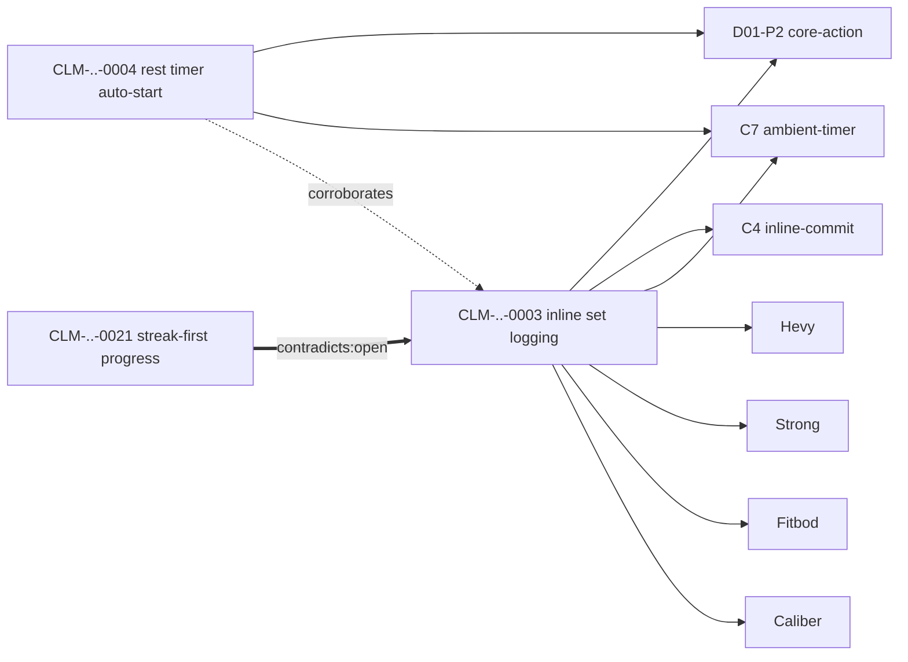

# Kimi K3 — Front-End / Design Review

**Reviewer:** OpenRouter `moonshotai/kimi-k3` (effort: high)
**Document:** .ai-workflow/brain-review/KIMI-PASS-B2.md
**Seed:** .ai-workflow/brain-review/KIMI-PASS-B-BLUEPRINT.md
**Tokens:** 13886 in / 10567 out · **Cost:** ~$0.2002 · **Wall:** 346.2s

---

# KIMI PASS B2 — §6-remainder THROUGH §12

**Continuity:** §1–§5 locked. Resuming at the tail of §6.3, then §7–§12 complete. Depth-domain correction resolved in §8.4 — **recommended swap, config-swappable, Sean confirms in one line at W2 gate.**

---

## 6. WIREFRAMES (remainder)

### 6.3 Claim detail view (continued from truncation point)

```
FAILURE STATES: offline queue (Fitbod, Caliber); duplicate-set guard (Strong)
REJECTED PATTERNS:
  - "fullscreen logging modal" — blocks concurrent rest-timer view; fails Swan
    trainer-demos-while-logging scenario
SWAN TRANSLATION:
  B2 arc: proof-of-work          C-patterns: C4 (inline commit), C7 (ambient timer)
  Tokens: spacing.log-row, btn.set-done, color.set-complete
  QA risks: undo window <3s observed in 1/4 products — spec ≥5s
CONFIDENCE: HIGH (productCount=4) · lastVerified 2026-07-21 · staleAfter 180d
HISTORY:
  2026-07-21 proposed (RUN-20260721-02) · 2026-07-21 accepted (sean, BATCH-W30)
  2026-07-28 corroboration +1 (Jefit) · confidence medium→high
PACKS: D01.md v3 · wiki note: wiki/claims/CLM-20260721-0003.md
ACTIONS: [spotcheck] [view-receipt RCP-…] [flag-stale]   (all read-only here)
```

### 6.4 Spot-check flow — receipt → deep link → verdict, <4 min

```
$ node src/spotcheck.mjs open RCP-20260721-0007
────────────────────────────────────────────────
 SPOT-CHECK S1 · receipt RCP-20260721-0007 · claim CLM-..-0003
 Product: Hevy · Surface: workout-active · Platform: ios
 Recorded: stepCount=6 · empty✓ loading✓ · opened 2026-07-21T14:02Z
 Inspector: agent-researcher-1

 Deep link (client-side only, never leaves this terminal):
   mobbin://…/flow/… [printed here, clicked by you]

 CHECKLIST (answer y/n each — 3 questions, that's all):
   1. Does the live flow have ~6 steps (±1)?            [y/n]
   2. Is the surface label "workout-active" accurate?   [y/n]
   3. Is the claim this receipt supports VISIBLE here?  [y/n]
────────────────────────────────────────────────
$ 1:y 2:y 3:y
 → PASS logged to control.json spotCheckLog. Next: S2. (~3 min elapsed)

$ 1:y 2:n 3:?
 → FAIL. Writing spotCheckLog{passed:false}…
 → pauseState.paused=true (same process, before exit)
 → ALL pending run requests refused. Actor flagged for revocation review.
 → Sean reviews receipts by this actor across ALL batches before re-minting
   any token. There is no "resume anyway" flag.
```

Time budget: open link (~30s) + scroll live flow (~2 min) + 3 questions (~30s) = **≤3–4 min/check**. Three checks ≈ 12 min, front-loaded in the weekly session so a FAIL voids the session *before* adjudication time is spent.

### 6.5 Generated wiki note + per-domain Mermaid graph

`wiki/claims/CLM-20260721-0003.md` (emitted by `wiki-emit.mjs` on accept; regenerable):

```markdown
---
claimId: CLM-20260721-0003
status: accepted
confidence: high
cell: D01-P2
products: [Hevy, Strong, Fitbod, Caliber]
cPatterns: [C4, C7]
lastVerified: 2026-07-21
---
# Log a completed set inline at the exercise row

**Cell:** [[D01 workout-logging]] / P2 core-action · **Confidence:** high (4 products)
**Swan:** B2 proof-of-work · [[C4 inline-commit]] · [[C7 ambient-timer]]

## Evidence
- [[RCP-20260721-0007|Hevy]] · [[RCP-20260721-0011|Strong]] ·
  [[RCP-20260721-0014|Fitbod]] · [[RCP-20260721-0019|Caliber]]

## Contradicts
_None open._

## Corroborated by
- CLM-20260721-0004 (rest timer auto-start) — same cell
```

`wiki/graphs/D01.mmd` (derived edges only — §2.1 table):



Nothing in the wiki is hand-editable by convention; `wiki-emit.mjs` overwrites. `rm -rf wiki && node wiki-emit.mjs` ⇒ byte-identical regeneration (W3 acceptance test).

---

## 7. ALGORITHMS (pseudocode)

### 7.1 Claim synthesis — receipts → convergence claim

```
synthesize(batchReceipts, corpus, config):
  # 1. Group by candidate principle
  groups = clusterByK5(batchReceipts.map(r => r.principleCandidate), threshold=0.40)
  # loose clustering for grouping; 0.55 pair threshold is for MERGE, not grouping
  claims = []
  for g in groups where g.size >= 1:
    products = distinct(g.map(r => r.product))
    # 2. Product-independence test
    companies = products.map(p => config.productCompanyMap[p] ?? UNKNOWN)
    independent = dedupe(companies)
    if len(independent) < 2:
      singleSource = true; level = LOW            # schema cap, mechanical
    else if len(independent) >= 4: level = HIGH; basis = productCount
    else: level = MEDIUM; basis = productCount
    if any(r.directFitnessEvidence): basis = directFitnessEvidence  # bumps medium→high only if fitness-domain claim
    # 3. Dedupe against corpus
    for r in g:
      k = kKeys(r)
      if k1(k) in k1keys: attachAsCorroboration(k1keys[k1(k)], r); continue outer
      if k4(hash(g.principleNormalized)) in k4keys: routeToMergeQueue; continue outer
    k5pairs = trigramCandidates(g.principleNormalized, k5index)
    if k5pairs: enqueue(k5-candidate-pairs.jsonl, pairs)   # human decides; never auto-merge
    # 4. Mandatory contra-search (cannot be skipped — field is required)
    hits = ftsSearch(g.principleNormalized, negate=true) + ftsSearch(antonyms(g))
    # 5. Doctrine check
    violations = doctrineConflictCheck(g)
    claims.append(claim/1 { ..., singleSource, confidence:{level,basis},
                  contraSearchResult:{performed:true, hits},
                  doctrineConflictCheck:{ran:true, rulesChecked, violations},
                  status:"proposed" })
  return claims + contradictionReport(batch)
```

Confidence assignment is **fully mechanical** — the agent never writes `level` by judgment; it writes inputs (product count, evidence type) and the function derives level. This removes a whole class of grade-inflation failure.

### 7.2 Trigram K5 candidate-pair generation

```
trigramSignature(s):
  t = set(charTrigrams(" " + lower(s) + " "))
  sig = [0]*64
  for gram in t: sig[minHashSlot(gram)] = 1     # 64-slot minhash
  return sig

generateCandidatePairs(newClaim, k5index):
  sigNew = trigramSignature(newClaim.principleNormalized)
  pairs = []
  for sig, claimIds in k5index:
    j = jaccard(sigNew, sig)
    if j >= 0.55 and claimId != newClaim.claimId:
      pairs.append({pairId: mint, claimIdA, claimIdB, jaccard: j, status: "pending"})
  appendExclusive(k5-candidate-pairs.jsonl, pairs)   # dedupe on (A,B) unordered
  # surfaced in next batch packet §M; Sean: m (merge) or d (distinct)
  # merge → older claim superseded, receiptRefs union, contradictions union
```

### 7.3 Metrics over rolling 4-run window

```
coverageGain(window):    # "are runs filling gaps?"
  runsWithProgress = count(r in window | r.movedCellState OR r.acceptedClaimsIntoGapCell > 0)
  return runsWithProgress / len(window)

confidenceLift(window):  # "is the corpus getting stronger?"
  claims = allClaimsTouchedBy(window)
  lifted = count(c | c.corroborations grew in window OR c.level rose)
  return lifted / max(len(claims), 1)

contradictionYield(window):  # "is it finding real tension?" — informational, no threshold
  return realContradictionsFound(window) / claimsProcessed(window)

autoPauseCheck():  # runs after every batch import
  w = last(4, runs)
  if coverageGain(w) < 0.25 AND confidenceLift(w) < 0.25:
    pause(trigger="low-yield")   # resume = new human token only
```

### 7.4 `doctrineConflictCheck` — mechanical diff

```
doctrineConflictCheck(claim):
  rules = load(config/doctrine-rules.json)   # hand-extracted from anti-patterns.md + design.md
  violations = []
  for rule in rules:                          # {ruleId, source, anyOf:[phrases], noneOf:[phrases], severity}
    text = claim.principleNormalized + " " + claim.swanTranslation.qaRisks
    if any(p in text for p in rule.anyOf) and not any(p in text for p in rule.noneOf):
      violations.append(rule.ruleId)
  return {ran: true, rulesChecked: len(rules), violations}
```

This is keyword/phrase matching, not judgment. It *flags*, never blocks — a violation renders as the `⛔` line in the packet and Sean decides. [HYPOTHESIS] Phrase matching will miss ~half of true conflicts; acceptable because it's an attention-director, not a gate. Rules are edited by humans only.

### 7.5 Broker

```
run(token, gapId):
  gate(token)                                    # control.mjs: all refusals here
  lock = acquire("~/design-brain/ledger/run.lock", O_EXCL | O_CREAT)
    # EEXIST → read holder+timestamp; if age > 6h: stale → refuse AND alert (never steal)
  try:
    for attempt in 1..5:
      try: results = adapter.search(query); break
      catch e:
        if e is ServiceWarning:                  # rate-limit nudge, captcha, ToS banner
          setCooldown(24h, cause=e); abortRun(); return   # human re-mint required
        sleep(2^attempt * 1000 + jitter)
    else: circuit.record(fail); if circuit.consecutive >= 3: circuit.open(24h); pause()
    ... inspect, receipts, synthesize ...
  finally: lock.release()   # unlink only if we hold it (compare inode)
```

**Never probe real limits. All breaker/cooldown tests use simulated warnings** (build step 10 stop condition). [VERIFIED per approved Pass A constraint.]

### 7.6 Secure writer

```
safeWrite(targetPath, content, opts):
  # 1. Path jail
  abs = realpath(dirname(targetPath)) + "/" + basename(targetPath)
  if not abs.startsWith(DATA_ROOT) and not abs.startsWith(REPO_ALLOWED): reject("jail")
  # 2. Symlink rejection — lstat, NOT stat
  if exists(targetPath) and lstat(targetPath).isSymbolicLink(): reject("symlink")
  # 3. Binary detection — magic bytes of the CONTENT
  head = first8Bytes(content)
  if head matches ANY of [PNG 89504E47, JPEG FFD8FF, PDF 25504446, ZIP 504B0304,
                          GZIP 1F8B, ELF 7F454C46, EXE 4D5A, SQLITE "SQLite format 3"]:
    if targetPath endsWith [.md, .json, .jsonl, .mmd]: reject("binary-as-text")
  # also reject if >5% of bytes are non-printable and target is a text extension
  # 4. Length + denylist
  for field in flatten(content): if len > cap(field): reject("length")
  for key in DENYLIST [deepLink, screenshot, html, cookie, token, ...]:
    if key in content: reject("denied-field:" + key)
  # 5. Atomic write: tmp file in same dir, fsync, rename
  write(tmp); fsync(tmp); rename(tmp, targetPath)   # rename is atomic on POSIX
  log append(jsonl ledger, {path, sha256, bytes, utc})   # every write audited
```

---

## 8. WEEKLY OPERATING RUNBOOK

(File: `docs/brain/RUNBOOK-WEEKLY.md`, verbatim target.)

### 8.1 Sean — Monday, 15 min

| # | Step | Min |
|---|---|---|
| 1 | `node src/matrix.mjs view` — read the 11×5 grid + metrics line (§6.2) | 4 |
| 2 | Read last batch's tail: acceptance rate, single-source share trend | 3 |
| 3 | Edit `~/design-brain/control.json`: mint this week's `authorizedRuns` entries (copy the template entry; change gapId, note; 2–4 tokens typical). Pick gapIds from "Next 3 gaps by plan" line — no hunting | 6 |
| 4 | If anything looked wrong in step 2: set `killSwitch` or skip minting. Skipping is always valid | 2 |

### 8.2 Agent — Monday–Tuesday, unattended, zero Sean time

Run loop per token: gate → broker → inspect → receipts → synthesize → contra-report → packet append → release lock. On any refusal/warning/cooldown: stop, log, do not retry creatively.

### 8.3 Sean — weekly session, 75 min

| # | Step | Min |
|---|---|---|
| 1 | `spotcheck.mjs open` × 3 sampled receipts, deep links, y/n/y (§6.4). **First** — a FAIL voids the rest | 12 |
| 2 | Open `batches/BATCH-…md`. One letter per claim `[ ]`. Contradiction pairs and doctrine flags are pre-marked — read those first, skim the rest | 45 |
| 3 | Fill sign-off line; save; `adjudicate.mjs import` — it validates every letter, rejects ambiguous annotations, updates matrix, regenerates packs, emits wiki notes | 8 |
| 4 | L7 promotion (human-only): `promote.mjs checklist BATCH-…` prints the accepted claims worth lifting into `anti-patterns.md`/`design.md`; hand-edit doctrine, commit yourself. No agent path exists | 10 |

Total: **15 + 75 = 90 min/week** ✓ matches `runRate.seanMinutesPerWeek`.

### 8.4 Depth-domain sequence — RESOLVING THE CORRECTION

The tension is real: documented product loop says workout-logging [VERIFIED]; current revenue focus says marketing/conversion [LIKELY — from project memory, not re-verified in repo today]; `ACTIVE-PRIORITIES.md` is stale [VERIFIED — dated 2026-04-22]. My reasoning:

1. **Marketing/conversion is the strongest candidate of all eleven.** It is (a) the current #1 money focus [LIKELY], (b) the highest-rated consultancy-portability domain [VERIFIED — my own Pass A/B rating, unchallenged], and (c) already has an in-flight 14-surface overhaul that would consume packs *immediately*, giving the engine a real user in week 3 instead of a hypothetical one.
2. **Workout-logging stays deep** — it's the documented core loop and the retrofit seeds live there; dropping it would strand the only existing evidence.
3. **Scheduling/trainer-ops is the odd one out.** Its confirmation was the weakest of the original three; nothing current points at it.

**Decision: swap.** Deep domains become **D01 workout-logging, D02 progress-analytics, D04′ marketing-landing-conversion** (D04 broadened from "pricing-checkout-storefront" to absorb landing/marketing surfaces — pricing/checkout was already conversion-adjacent). D03 scheduling demotes to shallow. Still 11 domains, still 3 deep + 7 shallow + 1 crosscut.

```
Deep sequence:  W3–W5 D01 workout-logging
                W6–W7 D04′ marketing-landing-conversion   ← feeds the live 14-surface program
                W8–W9 D02 progress-analytics
                W10   D11 universal-states (crosscut sweep)
```

**Config-swappable either way:** depth lives in exactly one place, `config/domains.json`:

```json
{ "id": "D04", "name": "marketing-landing-conversion", "depth": "deep",
  "absorbs": ["pricing-checkout-storefront"] },
{ "id": "D03", "name": "scheduling-trainer-ops", "depth": "shallow" }
```

**⚠ SEAN CONFIRM REQUIRED (one line, W2 gate, before first W3 deep run):** reply "confirm depth swap D03→D04′" or "keep original three." If no reply by W2 exit, the swap above is the default. The 14-surface program's current position (#8, Cover/Gallery) and the "Marketing Command Center" framing are [LIKELY — from project memory]; if Sean says that's wrong, revert with a one-field edit and zero code changes.

### 8.5 Degraded path — Sean skips a week

Without fresh tokens, **no source fetches happen — mechanically impossible** (gate refuses). Agents do not idle; they do zero-fetch maintenance, all of which is safe and useful:

- Resolve accumulated K5 merge-queue prep (dedupe housekeeping, pair re-scoring)
- Re-run contra-search over the existing corpus as it grows (contradictions can emerge between *old* claims)
- Regenerate packs + wiki from current accepted corpus
- Run cold-mode eval against the golden set (kills source by construction)
- Staleness sweep: flag claims past `staleAfterDays`

None of these promote anything, touch canon, or spend queries. **Two consecutive skipped weeks:** engine posts a "bankruptcy check" section into the next packet — is yield still worth 90 min? — and waits. It never escalates, never nags, never self-authorizes.

### 8.6 Fallback tier — 45 min/week

Sean sets `runRate.seanMinutesPerWeek: 45`. Engine clamps `maxRunsPerWeek` to 8, packet caps at ~7 claims/session, spot-check minimum drops to `minPerBatch: 2` (rate unchanged). Projected yield: **~50 claims / ~150 citations over 11 weeks** [HYPOTHESIS — extrapolated from the ~70-claim target, not measured]. Depth sequence compresses to D01 + D04′ only; D02 becomes shallow. This is a documented, first-class tier — not a failure mode.

---

## 9. PORTABLE INSTALL RUNBOOK — cold repo, new client, half a day

### 9.1 Steps (target: ≤4 hours)

```bash
# 1. Copy the engine (it's a directory, by design — no package, no publish)
cp -r scripts/ai-workflow/mobbin-learning $CLIENT_REPO/scripts/design-brain
cd $CLIENT_REPO && npm install ajv ajv-formats        # only runtime deps [LIKELY — verify at install]

# 2. Init the data root (outside client git, always)
export BRAIN_DATA_ROOT=~/clients/$CLIENT/design-brain
node scripts/design-brain/src/matrix.mjs init --root $BRAIN_DATA_ROOT
  # seeds control.json (control/2 template), empty ledgers, 55-cell matrix from config

# 3. Replace the THREE config files — this is the whole port
$EDITOR config/domains.json            # client's 8–12 domains + depth picks
$EDITOR config/doctrine-rules.json     # extract from client's design doctrine (1–2h, the real work)
$EDITOR config/identity-registry.json  # client actors; productCompanyMap for independence test

# 4. Wire adapter #2 (see 9.2) if the source isn't Mobbin
# 5. Smoke test
npm test --prefix scripts/design-brain && node src/matrix.mjs view
```

### 9.2 Source-adapter contract (`adapters/source-adapter.mjs`)

```js
// Any source becomes an adapter by exporting EXACTLY this shape.
// The engine never imports Mobbin directly; broker.mjs talks to this interface only.
export default {
  name: "string",                          // e.g. "mobbin", "client-figma-dump"
  capabilities: () => ({ searchable: bool, openable: bool, warningsObservable: bool }),
  search: async (query, {maxResults}) => [{ sourceRef, product, refType, surface, platform }],
  // sourceRef is OPAQUE and adapter-assigned — never a URL (K1 depends on this)
  open: async (sourceRef) => ({ stepCount, hierarchyNotes[], stateNotes{} }),
  // returns STRUCTURE only; the adapter must never return images, HTML, or copy >25 chars
  deepLinkFor: (sourceRef) => "string|null",   // written to deeplinks/ only, never corpus
  onWarning: (err) => bool,                    // classify: is this a service warning?
};
```

A non-Mobbin source (client's own screenshot library, a Figma export, a CSV of teardowns) becomes adapter #2 by implementing five functions. Dedupe, synthesis, adjudication don't know the difference. **Config vs code:** domains, doctrine rules, identities, caps, product→company map = config. Broker, writer, gate, synthesis, dedupe, packet, eval = code, never edited per-client. If a port requires a code change, that's a contract bug — fix the contract upstream.

### 9.3 Multi-client isolation + provable deletion

- One data root per client: `~/clients/$CLIENT/design-brain/`. No shared ledgers, ever. `paths.mjs` resolves from `BRAIN_DATA_ROOT` env only; a run with the wrong env fails the jail check on the first write.
- `clients-private` exclusion in the FTS spine remains untouched [VERIFIED — existing gate behavior]; client corpora are **never** indexed into the shared vault.
- **End-of-engagement deletion, provable:**

```bash
sha256sum $(find $BRAIN_DATA_ROOT -type f) > /tmp/pre-delete-manifest.txt   # what existed
rm -rf $BRAIN_DATA_ROOT && unset BRAIN_DATA_ROOT
test ! -d $BRAIN_DATA_ROOT && echo "DELETED $(date -u +%FT%TZ)" | tee deletion-receipt.txt
grep -r "$CLIENT" scripts/design-brain/config/ || echo "no client residue in repo config"
# hand client: pre-delete-manifest.txt + deletion-receipt.txt
```

[HYPOTHESIS] That a hash manifest of deleted files is meaningful "proof" — it's the best available without a third-party attestation; honest about its limits.

---

## 10. INTEGRATION SPECS

### 10.1 Linear — team `SWA`, project *AI Operations — Human + Agent Workflow*

Current board [VERIFIED per task brief]: `SWA-5` Done, `SWA-6` In Progress, `SWA-7/8/9` Todo. **New issues for the engine:**

| Issue | Title | Body (verbatim-ish) |
|---|---|---|
| SWA-10 | Brain W1: secure writer + schemas + control.json v2 + matrix | "Build steps 1–4 of KIMI-PASS-B §5.2. Files: writer.mjs, paths.mjs, validate.mjs, 4 schemas, control.mjs, lockfile.mjs, matrix.mjs + tests. Acceptance: per §5.2 rows 1–4. **Stop condition: do not proceed to step 6 if writer tests fail.** Blueprint: .ai-workflow/brain-review/KIMI-PASS-B.md §4,§5,§11." |
| SWA-11 | Brain W1: receipt pipeline + dedupe/trigram + retrofit (skip-ok) | "Steps 5, 6, 11. Gate integration routes evidence/2 read-only; K1–K4 → corroboration; K5 ≥0.55 → human merge queue. Retrofit of 17 records is Sean-optional." |
| SWA-12 | Brain W2: synthesis + doctrine check + batch packet + adjudication + spot-check | "Steps 7–9. Packet renders ≤8 lines/claim; a/r/t/m/b import; failed spot-check sets pauseState in same process. Also: depth-domain confirmation gate (§8.4) — Sean must confirm D03→D04′ swap or revert domains.json before first deep run." |
| SWA-13 | Brain W2: broker + adapter contract + Mobbin adapter | "Step 10. Concurrency-1 lockfile, backoff, circuit-breaker, 24h warning cool-down. **Never probe real Mobbin limits — simulated failures only.**" |
| SWA-14 | Brain W3: eval harness + wiki emitter | "Step 13. Cold-mode + 10-question golden set (honest n); wiki regenerates byte-identical from corpus." |
| SWA-15 | Brain W10–11: MCP read-only façade (5 tools) on hermes2_brain_mcp_server.py | "Step 14. §10.3 tool list. No write tool may exist. clients-private stays 0 rows." |

**State mapping** (Linear state → workflow stage): `Backlog/Todo` → INBOX; `Todo` + label `ready` → READY; `In Progress` → DOING; `In Review` → REVIEW; label `needs-sean` (any state) → NEEDS_SEAN; `Done` → DONE. [UNKNOWN — exact custom state names in the SWA workspace; if "In Review" doesn't exist, REVIEW = `In Progress` + label `review`. Verify at first sync.]

**Effect-tier labels** (applied to every issue and to engine actions): `T0` read-only · `T1` reversible local write (data root) · `T2` external write (Linear comments, pack regen) · `T3` irreversible (deletion, ledger append) · `T4` human-only (canon promotion, token minting). Engine self-executes T0–T2 within a valid token; T3 only via gate-audited paths; T4 never.

**Engine events → Linear actions:**

| Event | Action |
|---|---|
| Batch packet rendered | Move SWA-12-cycle sub-issue to REVIEW, comment packet path + claim count |
| Spot-check FAIL / auto-pause | Create issue "🛑 Brain PAUSED — {trigger}" label `needs-sean` `T4`, comment pause report |
| Adjudication import complete | Move cycle issue to DONE, comment accepted/rejected counts + matrix delta |
| Low-yield auto-pause (§7.3) | Same as pause, body includes 4-run metrics |
| Depth-confirmation gate reached (W2 exit) | SWA-12 gets label `needs-sean`, comment is the one-line confirm question |

**Linear owns work state only. Claims, receipts, matrix, packs never sync to Linear** — a claim living in two places is a claim that drifts.

### 10.2 Hermes — permitted actions, prohibitions, brain access

**Permitted (T0/T1):** query claims/packs/matrix via the §10.3 tools; answer "what do we know about X" for Sean; draft (never send) suggested query text and token-request drafts into a scratch file Sean can paste; run cold-mode evals.

**Hard prohibitions:** minting or editing `authorizedRuns` or any field of `control.json`; writing claims or receipts (researcher role only, and Hermes is not registered as one [by design — identity-registry role check]); reading `deeplinks/`; touching canon paths; importing Graphify/Obsidian references into any output (§2.2 — the mythos must not leak back through Hermes's prose).

**How it queries:** only through the five MCP tools below. No direct sqlite access, no filesystem reads of the data root — the tool surface *is* the permission surface.

### 10.3 FTS spine + MCP read-only façade (W10–11)

**Ingest:** on every successful `adjudicate import`, a sync step upserts accepted claims + regenerated packs into the existing `brain-vault-fts.sqlite` as collection `design-brain-claims`, tagged recall-tier `curated-adjudicated` (distinct from raw-extraction tiers so ranking can prefer it). FTS5 table: `(claimId UNINDEXED, title, principleNormalized, swanTranslation, domain, phase, confidence UNINDEXED, status UNINDEXED, content)`. Rejected/superseded claims get `status` updated, never deleted (audit). [UNKNOWN — the existing vault's collection/tier naming convention; adapt labels to match whatever `hermes2_brain_mcp_server.py` already uses rather than inventing parallel vocabulary. Read the server file at W10 start.]

**Exactly five tools, all read-only, added to the existing server (~150 lines, no second server):**

```python
brain_claims_search(query, domain=None, phase=None, confidence=None, limit=10)  # FTS5 MATCH
brain_claim_get(claim_id)          # full claim/1 record + receipt count
brain_pack_get(domain_id)          # current pack markdown for a domain
brain_coverage_status()            # 55-cell matrix summary + metrics line
brain_contradictions_list(status="open")  # unresolved tension, highest-value recall
```

Acceptance (step 14): each tool answers from the collection; **no write tool exists**; `clients-private` collection still reports 0 rows. Stop condition: if any tool can write, the step fails.

### 10.4 swan-design-router — builder consumption + receipt

Flow during real design work (e.g., surface #9 of the 14-surface program):

1. Builder agent calls `brain_claims_search("pricing presentation annual toggle", domain:"D04", phase:"P5")` → `brain_pack_get("D04")`.
2. Pack lists claims with `claimId`s. Builder cites them **by ID** in the design doc header: `brain-basis: CLM-…-0003, CLM-…-0018`. No citation = the router treats the output as opinion, labeled as such downstream.
3. Builder leaves a usage receipt — append one line to `.ai-workflow/brain-review/pack-usage.jsonl` (T1, reversible, repo-local):

```json
{"taskId":"SURF-09","packId":"D04","claimIdsUsed":["CLM-...-0003"],"utc":"2026-08-03T...","outcome":"applied|partial|rejected-with-note"}
```

This closes the loop the whole engine exists for: claim → used → outcome → (later) trialResult confidence basis. It's also the cheapest possible builder friction: two tool calls and one JSONL line.

---

## 11. W1 STARTER TASK — the secure writer (build step 1)

**Why first:** hostile scenario 8 (binary/symlink/path-escape write) **fails open today** [VERIFIED per approved Pass A]; every later step writes through this module; it has zero dependencies. SWA-10 covers it.

**Files:**

```
scripts/ai-workflow/mobbin-learning/src/paths.mjs        ~60 lines
scripts/ai-workflow/mobbin-learning/src/writer.mjs       ~220 lines
scripts/ai-workflow/mobbin-learning/tests/writer.test.mjs ~200 lines
scripts/ai-workflow/mobbin-learning/tests/fixtures/      (tiny PNG/JPEG/PDF magic-byte buffers, hex literals — no binary files committed)
```

**Signatures (complete — no further design questions needed):**

```js
// paths.mjs
export const REPO_ROOT;                      // resolved from import.meta.url
export function dataRoot();                  // $BRAIN_DATA_ROOT or ~/design-brain (throws if unset AND default missing)
export function assertJailed(absPath);       // throws PathJailError unless under dataRoot() or REPO_ALLOWLIST

// writer.mjs
export class WriteRejection extends Error { /* .code: 'jail'|'symlink'|'binary'|'length'|'denied-field' */ }
export function detectBinaryMagic(headBytes);            // -> format string | null  (§7.6 signature table)
export function isSymlinkNoFollow(path);                 // lstat; -> bool
export function checkDeniedFields(obj, denylist);        // -> offending key | null
export async function safeWrite(targetPath, content, opts = {});
// opts: { allowedExtensions = ['.md','.json','.jsonl','.mmd'],
//         maxStringLength = 280, denylist = DEFAULT_DENYLIST, auditLog = '<dataRoot>/ledger/writes.jsonl' }
// behavior: exactly §7.6 steps 1–5. On any rejection: throw WriteRejection, write NOTHING,
//           append rejection entry to auditLog. On success: tmp+fsync+rename, append success entry.
```

**Acceptance tests (all must pass; `node --test`):**

1. PNG magic bytes written as `notes/x.md` → `WriteRejection{code:'binary'}`, file absent.
2. Buffer of 500 random bytes (≥5% non-printable) as `.json` → rejected.
3. Symlink at target (`ln -s /etc/hostname target.md`) → `code:'symlink'` via **lstat** (test proves `stat` is never called: fixture where target exists, symlink dangling — stat would throw ENOENT, lstat must not).
4. `../../etc/evil.md` and absolute `/tmp/evil.md` → `code:'jail'`.
5. JSON containing key `deepLink` at any nesting depth → `code:'denied-field'`.
6. Any string field of 281 chars → `code:'length'`; 280 chars → pass.
7. Concurrent writers: two `safeWrite` calls to the same path both complete, final file is one *whole* write (rename atomicity — never a torn interleave).
8. Audit log: after tests 1–6, `writes.jsonl` has 6 rejection entries with correct codes; it's append-only (exclusive-create append, no truncation).
9. A valid markdown write round-trips byte-identical.

**Stop condition (hard, from §5.2):** do not start build step 2 — and do not let any other module import anything that writes files — until all nine pass. If a test can't be made to pass in one sitting, the session ends with the failing test committed and SWA-10 labeled `needs-sean`, not with a weakened test.

---

## 12. RISKS / OPEN ITEMS — honest ledger

**[UNKNOWN] — evidence unavailable, assumed:**

1. **K1–K4 exact field composition.** Pass A verified only that K5 is a Set membership test at `evidence-gate.mjs:85-92`. §4.6's K-table definitions are [LIKELY] reconstructions. **Action: read `evidence-gate.mjs` before build step 5; reconcile in SCHEMA.md; if reality differs, §4.6 changes, not the code's existing behavior.** This is the single most likely source of a W1 surprise.
2. **Mobbin MCP actual method/field names.** The adapter (step 10) wraps "existing MCP calls" whose signatures I have not seen. [UNKNOWN]. Adapter contract (§9.2) is written to absorb this, but expect a half-day of mapping.
3. **Mobbin ToS posture.** Whether this inspection volume and receipt-keeping is within terms is **[UNKNOWN] and Sean's call, not mine.** The design mitigates (no artifacts stored, structural notes only, ≤25-char verbatim, cool-down on any warning, never probe limits) but mitigation ≠ permission. Decide before W1 pilot.
4. **`brain-vault-fts.sqlite` collection conventions + `hermes2_brain_mcp_server.py` tool-registration pattern.** [UNKNOWN] until W10. §10.3 is written adapter-style for this reason.
5. **Marketing Command Center / 14-surface program currency.** [LIKELY — project memory, not re-verified in repo today.] If stale, §8.4's swap weakens; revert is one config field.
6. **Linear workspace state names + whether `needs-sean`/`ready`/T-tier labels exist.** [UNKNOWN]. Mapping in §10.1 has fallbacks noted.
7. **Node version and `ajv` presence in target repo.** [LIKELY] Node ≥18 + `npm i ajv ajv-formats`; verify at step 1.

**Sean must decide before W1:**

- **D1 — ToS go/no-go** (item 3). Blocks pilot, not code.
- **D2 — Retrofit skip?** (step 11, SKIP-OK). Default: do it; it's 0.5 day and seeds D01.
- **D3 — Depth swap confirm** — technically W2, but answering now removes the gate: confirm D03→D04′ or keep original three (§8.4).
- **D4 — `BRAIN_DATA_ROOT` location** on this machine (WSL `~/design-brain` assumed [LIKELY]); one env line.

**Risks accepted, with mitigations already in design:**

- **Agent grade-inflation** → confidence is mechanical (§7.1); spot-checks audit the input layer; failure pauses automatically.
- **Packet fatigue** (Sean stops reading after week 4) → 45-min tier is first-class (§8.6); low-yield auto-pause stops spend when attention stops paying off.
- **Doctrine phrase-matcher misses real conflicts** [HYPOTHESIS: ~50% recall] → accepted; it's an attention-director with a human behind it, not a gate.
- **Mythos resurrection** — an agent "helpfully" regenerating wiki-mythos prose from attic docs → tombstones at every original path; REALITY.md rule is stated as *no exceptions*; Hermes prohibition (§10.2).
- **Eleven-week yield projection (~70 claims)** is a plan target [HYPOTHESIS], explicitly not a promise; the 4-run rolling metrics exist precisely to detect early if reality diverges.

**Assumed without asking (flagging for the record):** JSONL ledgers at the data root are acceptable durability (no DB); Sean edits JSON by hand comfortably; one markdown file beats any UI for adjudication; the corpus — not the wiki, not Linear, not Linear's mirror of anything — is the asset.

---

**END PASS B2.** §6–§12 complete. Nothing in §1–§5 was modified. Next action: Sean answers D1–D4, then SWA-10.
