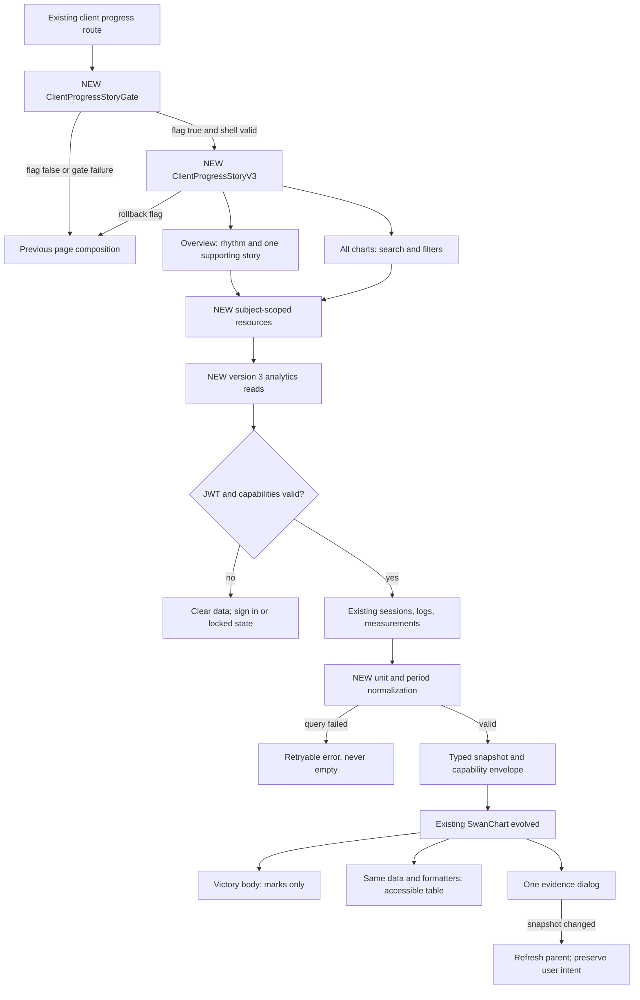
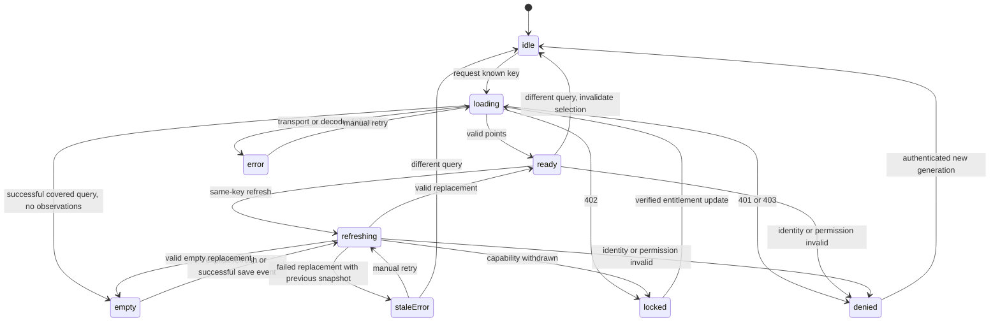
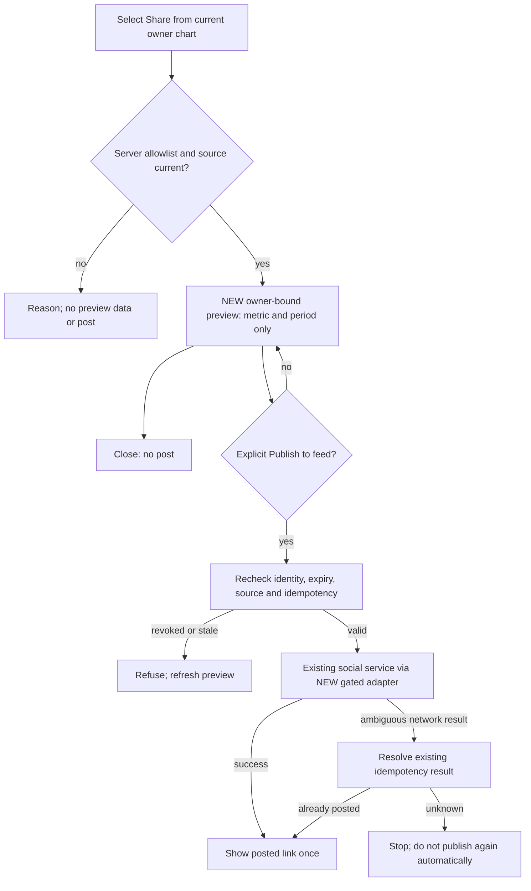
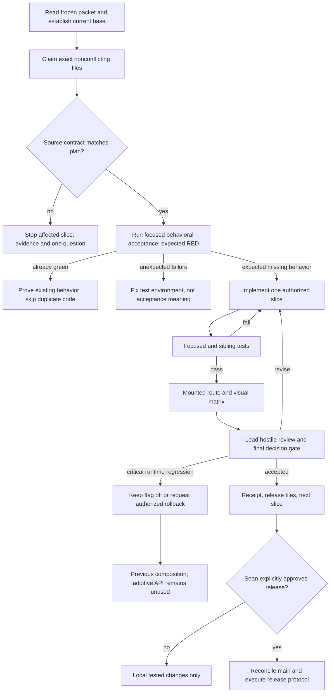

# Architecture and failure paths

These describe the target, not the currently installed system. NEW nodes are explicitly marked.
No schema/ERD is needed: V3 uses existing Session→Log and User→Measurement relationships.
Any schema expansion is a stop-and-ask change, not an implied migration.

## F1 — one consumer system, progressive disclosure



## F2 — resource lifecycle, including stale and revoked data



Every identity/permission change from ANY state clears sensitive memory before paint. Late
responses carry the old generation and are discarded, including after denied/closed/flag-off.
Range/unit changes may display explicitly labeled old, noninteractive content while fetching;
that visual retention is not cache identity or a state transition back to ready.

## F3 — datum to evidence, cancellation and exact identity

```mermaid
sequenceDiagram
  actor Client
  participant View as Plot or keyboard table
  participant Store as Subject-scoped resource
  participant Sheet as Single evidence dialog
  participant API as V3 detail endpoint
  Client->>View: Activate seriesKey + pointKey
  View->>Store: Resolve current snapshot and capability
  alt detail locked
    Store->>Sheet: Explain required tier; no detail request
  else detail allowed and current
    Store->>Sheet: Loading with captured generation
    Sheet->>API: Authenticated query + snapshotId + asOf
    alt source edited or snapshot expired
      API-->>Sheet: 409 SOURCE_CHANGED or SNAPSHOT_EXPIRED
      Sheet-->>Client: Refresh chart to see current records
    else success
      API-->>Sheet: Owned sessions or measurement, matched total
      Sheet->>Store: Is key and generation still current?
      alt yes
        Store-->>Sheet: Render exact source records
        Client->>Sheet: Open session; inspect full sets
      else no
        Store-->>Sheet: Discard response
      end
    else 401 or 403
      API-->>Store: Permission invalid
      Store->>Sheet: Clear and close
    else temporary failure
      API-->>Sheet: Safe error, manual retry
    end
  end
  Client->>Sheet: Close or navigate back
  Sheet->>Store: Abort and increment generation
  Sheet-->>View: Restore trigger focus and chart scroll
```

## F4 — share is a separate, intentional write



## F5 — Luna's slice gate and rollback



## Deferred and recovery outcomes

- Missing production-safe test DB: stop integration layer; no default local dev against production.
- Missing exact logger/export/idempotency contract: stop that slice; no invented endpoint.
- Lost network: stale frame labeled; no auto-retry storm; manual retry preserves context.
- Browser refresh: restores no sensitive cache; fetch current subject again. Saved chart IDs only
  may restore after matching identity; selection is not a persisted private record.
- Feature flag off during overlay: close/abort/clear V3, mount whole previous composition;
  never mix a legacy frame and V3 data silently.
- Rollback needs no destructive migration; source data remains authoritative and unchanged.
